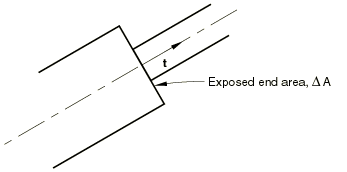
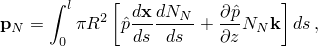
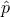
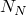
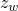
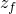
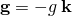
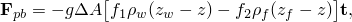
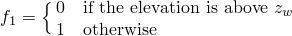
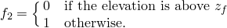

# 6.2.1 Drag, inertia, and buoyancy loading

### 6.2.1 Drag, inertia, and buoyancy loading

**Product: **Abaqus/Aqua

For beam and truss structures immersed in fluid (e.g., offshore piping and riser problems), Abaqus/Standard provides a capability for introducing drag forces via Morison's equation, inertia loads, and buoyancy loads. Fluid drag is associated with velocities due to steady currents and any waves that may have been specified. Fluid inertia is associated with wave accelerations. Buoyancy has two components: the hydrostatic pressure measured to the mean fluid level and the dynamic pressure caused by the presence of waves. Partial submergence is done automatically for all fluid load types.

Drag and inertia loads are considered in two forms: distributed loads along the length of the element (distributed drag loading is further divided into a component normal to the element's axis and a component along the tangent to the element) and point drag and inertia loads where the beam changes cross-section.

Buoyancy loading is applied with a "closed-end" assumption; that is, it is assumed that the element's ends can support buoyancy loading normal to the element's cross-section. If the ends of the element are actually "open ended"---that is, the element's ends cannot support fluid pressure loads---point buoyancy forces are provided to remove the buoyancy forces at the ends of the element.

This section documents the form of these loadings. It is assumed that the fluid particle velocities and accelerations are known as functions of the current spatial location; they are defined by superimposing the steady current velocity and the wave velocity.
### Continuously distributed drag and inertia loading

Distributed load types "FDD," "WDD," "FDT," and "FI" on beam, truss, or rigid beam elements provide continuously distributed drag and inertia via Morison's equations. To specify this loading, the following definitions are used:

is the fluid particle velocity (defined by the steady current input and possibly additional contributions from wave definitions),

is the fluid particle acceleration when the waves are defined,

is the velocity of a point on the element (nonzero during dynamic analysis steps only),

is the acceleration of a point on the element (nonzero during dynamic analysis steps only),

 is the relative fluid velocity,

is a unit vector defining the axial direction at a point in the element,

 is the relative tangential (axial) velocity of the fluid,

 is the relative transverse velocity of the fluid,

is the tangential (axial) drag coefficient,

is the transverse drag coefficient,

is the transverse inertia coefficient,

is the transverse added mass coefficient,

is the fluid density,

is the structural velocity factor, and

*h*

is the exponent for tangential drag.Then, the transverse drag force per unit length on the member is

The tangential drag force per unit length is

and the inertia force per unit length is

Only transverse drag is implemented for wind loading.
### Point drag and inertia loading

At points where the section changes size and, thus, exposes an end area to the fluid (see [Figure 6.2.1&#8211;1](06s02a144.md)), additional drag and inertia forces arise.

Figure 6.2.1&#8211;1 Change in section of an immersed beam.

For this case we need the additional definitions:

is the change in area of the section,

is an outward normal to the exposed area (see [Figure 6.2.1&#8211;1](06s02a144.md)),

is the drag coefficient associated with the discontinuity,

is the tangential inertia coefficient associated with the discontinuity,

is the tangential added mass coefficient associated with the discontinuity, and

are fluid and structural acceleration shape factors for the tangential inertia term.Then the drag force on the transition section is

This force is nonzero only when the relative velocity of the fluid has a negative projection on the outward normal; i.e., when the fluid is flowing against the exposed surface. The inertia force is

### Distributed buoyancy

Abaqus assumes closed-end conditions when computing the distributed buoyancy loads (load type PB) for beams, pipes, rigid beams, and elbows. An open-end condition can be simulated by using load type TSB to remove the buoyancy load from the end of the element.

For truss elements the effect of buoyancy is simply Archimedes' principle; that is, a vertical force equal to the weight of the displaced fluid is applied to the element.

For buoyancy loading the beam is assumed to have a uniform circular pipe section with the effective diameter specified as part of the loading definition.

Consider a pressure field that varies with *z*, the vertical coordinate, where  and  is the unit vector pointing in the vertical direction. Then

For hydrostatic pressure the dependence on the vertical coordinate is linear in *z*,

where  is the vertical location of the free surface of the fluid (either the free surface elevation of the fluid inside the pipe or the elevation of the mean water level for external pressure),  is the density of the fluid, and *g* is the acceleration due to gravity. If waves are defined, the wave field generates a dynamic pressure effect. In this case the pressure field has a nonlinear variation with respect to location. Under the assumption of waves with small amplitude relative to the wave length and depth of the sea, we can assume that the dynamic pressure is slowly varying with respect to the wave direction; hence, derivatives of the pressure with respect to the coordinates in the plane parallel to the still water surface are neglected. However, the dynamic pressure field has a nonlinear dependence on *z*.

The pressure field results in a nodal loading contribution that can be written as follows. Let  be the pressure loading contribution to the weak form of the equilibrium equations. This contribution can be written in terms of a nodal load vector, , as

where the nodal load vector is

where *R* is the radius of the pipe (internal or external),  is the total pressure (including hydrostatic and dynamic pressure),  are the shape functions associated with the nodes on the element, and *l* is the current length of the element.
### Point buoyancy

Point buoyancy is needed to apply discrete buoyant forces on an exposed surface. Point buoyancy can be used to remove the closed-end loading condition on beam, pipe, or rigid beam elements by applying a negative load on the exposed area. Use the following definitions:

*z*

is the elevation of the point considered,

is the mass density of the fluid outside the pipe,

is the mass density of the fluid inside the pipe,

is the free surface elevation of the fluid outside the pipe,

is the free surface elevation of the fluid inside the pipe,

is the outward normal to the exposed area, and

is the gravitational acceleration. In Abaqus it is assumed that .

The buoyancy force is

where

and

### Load stiffness

To ensure the quadratic convergence of the Newton method in Abaqus, it is necessary to calculate the changes in the above forces with respect to changes in the kinematic solution for the structure. Thus, a load stiffness is calculated for all of these load types.
### Reference

### Reference

"Abaqus/Aqua analysis,"  Section 6.11.1 of the Abaqus Analysis User's Guide