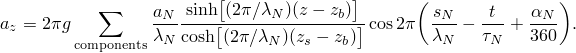
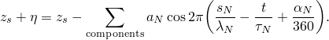
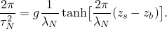
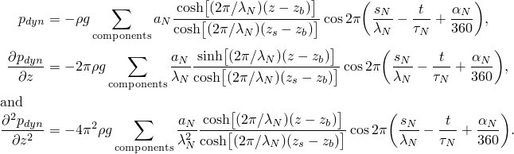
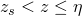
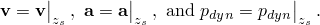
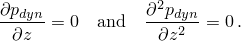

# 6.2.2 Airy wave theory

### 6.2.2 Airy wave theory

**Product: **Abaqus/Aqua

This is a linearized wave theory based on irrotational flow of an inviscid incompressible fluid. The linearization is achieved by assuming the wave height *a* is small compared to the wavelength  and the still water depth. It is also assumed that the fluid is of uniform depth (that is, the bottom is flat).

Since we have irrotational flow, there exists a flow potential, , obeying

and giving the fluid particle velocities as

Now assume there is a potential energy per unit mass, *G*, (in this case associated with the gravity field). Then, equilibrium is given by

where  is the fluid density and *p* is the pressure. Substituting [Equation 6.2.2&#8211;2](06s02a145.md) in [Equation 6.2.2&#8211;3](06s02a145.md), we obtain

This equation can be integrated with respect to position to give

since the fluid is assumed to be incompressible; thus,  is constant. Here *F* is an arbitrary function of *t* and  is the pressure in the air just above the free surface. For convenience we choose 

The term  can be neglected compared to the other terms (this can be shown, from the resulting solution, to be consistent with the order of approximation that the wave height is small compared to the wavelength). By choosing the *z*-coordinate to point vertically upward, the gravity potential is conveniently chosen as

where  is the undisturbed surface level. [Equation 6.2.2&#8211;4](06s02a145.md) then becomes

From this equation the total pressure at a point below the instantaneous fluid surface is

Hence, the total pressure is the air pressure plus the hydrostatic pressure plus the dynamic pressure, , where  is given by

Let  be the elevation of the fluid surface at time *t* above the mean (undisturbed) fluid surface level, . Since the position of the free surface is a part of the solution, there are two boundary conditions that must be applied on . The first is a dynamic equilibrium condition at the interface between the fluid and the air. Since the interface is assumed to have no mass, the forces normal to the interface in the fluid and the air must be equal. If the surface tension of the interface is neglected, the pressure in the water and the air must be equal at the interface. Assuming that the pressure due to the motion of the air is negligible (which can be shown to be reasonable), the air pressure can be approximated by its undisturbed value ([Whitham, 1974](07s01a01-References.md)). The dynamic boundary condition then implies , where *p* is the pressure in the water at the free surface and  is the pressure in the undisturbed air. Since  is assumed to be small with respect to the depth of fluid, the boundary condition can be made linear by applying it at  instead of at .

With these assumptions [Equation 6.2.2&#8211;5](06s02a145.md) provides the boundary term

The second boundary condition on the free surface comes from the kinematics of the free surface. Let the free surface be given by

The velocity of the fluid normal to the surface must be equal to the velocity of the surface normal to itself.

Differentiating this expression with respect to time yields

If we assume that the wave height is small compared to the wavelength  then we can approximate  by the velocity , so that

Eliminating  between [Equation 6.2.2&#8211;6](06s02a145.md) and [Equation 6.2.2&#8211;7](06s02a145.md) gives

The boundary condition on the bottom, , is

The problem is now defined by [Equation 6.2.2&#8211;1](06s02a145.md), [Equation 6.2.2&#8211;8](06s02a145.md), [Equation 6.2.2&#8211;9](06s02a145.md), and the requirement that the solution be a plane wave periodic in the horizontal plane, such that

where  is the direction of wave propagation and *c* is the wave speed.

We solve the problem by assuming that . Since *P* and  are independent functions, [Equation 6.2.2&#8211;1](06s02a145.md) provides the two equations

where *k* is a constant.

Let  (so that *s* measures distance in the direction of travel of the wave). The solution to these equations is  and  hence,

where  and  are constants and  is the phase angle of the wave in degrees ( provides an arbitrary choice of origin in time and is chosen so that the vertical displacement of a fluid particle is a minimum when , , and ).

There is no motion at the bottom of the fluid in the vertical direction, so by [Equation 6.2.2&#8211;9](06s02a145.md) we find

Substituting this into [Equation 6.2.2&#8211;10](06s02a145.md) gives

where *C* is a constant.

The dispersion relation can be obtained by substituting [Equation 6.2.2&#8211;11](06s02a145.md) into [Equation 6.2.2&#8211;8](06s02a145.md) and setting , giving

The wave frequency  is related to the wave period  by . The constant *k* is called the wave number and is related to the wavelength  by , so that .

The free surface elevation above the undisturbed fluid surface, , is given by [Equation 6.2.2&#8211;6](06s02a145.md):

Writing the wave amplitude (half the wave height) as *a*, this defines

so that [Equation 6.2.2&#8211;11](06s02a145.md) can be rewritten

This solution provides fluid particle velocities  and accelerations throughout the fluid for this one wave component. The term  in [Equation 6.2.2&#8211;4](06s02a145.md) was neglected because the wave amplitude *a* is small compared to the wavelength . This implies, from [Equation 6.2.2&#8211;3](06s02a145.md), that the fluid particle acceleration is approximated as ; that is, the convective part of the acceleration, , is neglected.

Since the theory is linear, any set of waves can be superposed by linear superposition of its components:

where  is the potential [Equation 6.2.2&#8211;10](06s02a145.md) of the  wave component. Hence, the theory can be summarized as follows.

For :

Velocity potential:

Fluid particle displacements:

horizontally,

and vertically,

Fluid particle velocities:

horizontally,

and vertically,

Fluid particle accelerations:

horizontally,

and vertically,

Free surface profile:

Dispersion relation for each mode:

Dynamic pressure:

Airy wave theory is a linearized theory; however, the wave amplitude can be large compared with the size of a structure. We, therefore, must make an assumption about the wave kinematics below a crest and above the mean water level. The assumption used here follows modified Airy wave theory as described in [Hansen (1988)](07s01a01-References.md) and [Faltinsen (1990)](07s01a01-References.md). The free surface boundary condition has been made linear in [Equation 6.2.2&#8211;6](06s02a145.md). Above the mean or undisturbed surface level  the velocity, acceleration, and dynamic pressure are extrapolated from their values at the mean surface level. Hence, for 

Accordingly,

When a gravity wave is defined, the penetration of the structure into the fluid must be calculated. Although the Airy wave theory assumes that the fluid displacements are small with respect to the wavelength and the fluid depth, they cannot be small with respect to the dimensions of the structure immersed in the fluid. Hence, the instantaneous fluid surface is used to determine if a point on the structure sees loads due to the presence of the fluid.

The Airy wave field is a spatial description of the wave field. The wave field defines velocity, acceleration, and dynamic pressure at spatial locations for all values of time. Hence, the velocity, acceleration, and dynamic pressure are determined by using the current (for geometrically nonlinear analysis) or reference (for geometrically linear analysis) location of the structure at the current time in the appropriate equations. The time used in the wave field equations is the total time for the analysis, which accumulates over all steps in the analysis (static, dynamic, etc.).
### Reference

### Reference

"Abaqus/Aqua analysis,"  Section 6.11.1 of the Abaqus Analysis User's Guide