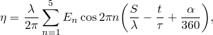
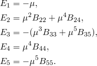

# 6.2.3 Stokes wave theory

### 6.2.3 Stokes wave theory

**Product: **Abaqus/Aqua

Assume that an infinite series of plane, uniform waves travels through the fluid in the positive *S*-direction. The *z*-coordinate is chosen to be positive in the vertical direction, so the gravity potential is , where  is an arbitrary datum.

Assume that the fluid is inviscid and incompressible. The fluid particle velocities are derivable from a flow potential

Equilibrium is

where  is the fluid density and *p* is the pressure. Writing  in terms of the flow potential then gives

Integrating with respect to  (note that  is constant since the fluid is incompressible) gives the Bernoulli equation

where  is an arbitrary function (which for convenience is set to zero) and  is the atmospheric pressure. Substituting in the gravity potential, this is

where  is the undisturbed surface level. From this equation the total pressure at a point below the instantaneous fluid surface is

Hence, the total pressure is the air pressure plus the hydrostatic pressure plus the dynamic pressure, , where  is given by

Let  be the elevation of the free surface above this level. At the free surface the Bernoulli equation is

assuming the pressure at the surface is negligible.

Assuming the waves are uniform, of wavelength  and period , and that they travel in the positive *S*-direction means that the solution as a function of *S* and *t* must appear in terms of a phase angle

where  is the wave celerity. This means that, for any function in the solution,

Thus, at the free surface boundary

and the Bernoulli equation at the free surface is

or

A further boundary condition at the free surface is that the fluid particle velocity relative to the wave celerity must be tangential to the slope of the wave:

At the seabed , there is no fluid motion in the vertical direction:

The problem now consists of finding a potential function, , that satisfies [Equation 6.2.3&#8211;1](06s02a146.md)---the boundary condition at the seabed---as well as the boundary conditions at the surface---[Equation 6.2.3&#8211;2](06s02a146.md) and [Equation 6.2.3&#8211;3](06s02a146.md).

Stokes proposed a power series solution to this problem, and [Skjelbreia and Hendrickson (1960)](07s01a01-References.md) have obtained that solution to fifth-order. The potential function is assumed to be

where , the  are constants that depend on the ratio of water depth to wavelength , and  is a parameter. The wave profile, , is assumed to be

where the  are constants for a given water depth and wavelength. Finally, it is assumed that

and that

Skjelbreia and Hendrickson obtain the 18 constants , , and  from matching terms in equal powers of  and  in the free surface boundary conditions, [Equation 6.2.3&#8211;2](06s02a146.md) and [Equation 6.2.3&#8211;3](06s02a146.md). They give the constants as functions of  as

[Skjelbreia and Hendrickson (1960)](07s01a01-References.md) have a factor +2592 multiplying  in the equation for . This was corrected to 2592 by [Nishimura et al. (1970)](07s01a01-References.md).

They then obtain equations for  and . The wave height is

so [Equation 6.2.3&#8211;5](06s02a146.md) gives

Also, the form assumed for the wave celerity gives

Given the wave period, wave height, and water depth, [Equation 6.2.3&#8211;7](06s02a146.md) and [Equation 6.2.3&#8211;8](06s02a146.md) must be solved simultaneously for the wavelength, , and the parameter . This is done with a Newton method, using the Airy (linear) wave solution as an initial guess.
### Fluid particle velocities and accelerations for Stokes 5th order wave

The flow potential has been approximated as

where

The fluid particle velocities are

and the fluid particle accelerations are

Since the solution appears in terms of the phase angle , it follows that

This allows the acceleration components to be written as

Recall the expression for the dynamic pressure:

Substitution of the expression for  yields:

where

 Finally, the surface position is given as

where

The Stokes wave field is a spatial description of the wave field. All wave field quantities are calculated up to the instantaneous fluid level. The wave field defines velocity, acceleration, and dynamic pressure at spatial locations for all values of time. Hence, the velocity, acceleration, and dynamic pressure are determined by using the current (for geometrically nonlinear analysis) or reference (for geometrically linear analysis) location of the structure at the current time in the appropriate equations. The time used in the wave field equations is the total time for the analysis, which accumulates over all steps in the analysis (static, dynamic, etc.).
### Reference

### Reference

"Abaqus/Aqua analysis,"  Section 6.11.1 of the Abaqus Analysis User's Guide