# 6.3.1 Loading due to an incident dilatational wave field

### 6.3.1 Loading due to an incident dilatational wave field

**Products: **Abaqus/Standard  Abaqus/Explicit

Abaqus provides a capability for introducing generalized forces on acoustic and solid media associated with the arrival of dilatational waves. This capability applies to acoustic scattering problems and problems involving blast loads in air or water. Thus, the capability is available in transient dynamic procedures in Abaqus/Standard and Abaqus/Explicit.

Consider a dynamic problem involving fluid and coupled solid domains, excited by a propagating wave in the fluid arriving from outside these domains. When the mechanics of a fluid can be described as linear, wave fields in the fluid can be superimposed. Therefore, the observed total pressure in the fluid can be decomposed into two components: the incident wave itself, which is known, and the wave field excited in the fluid due to reflections at the fluid boundaries and interactions with the solid. To compute the latter, "scattered" solution, it is sufficient to apply loads at the boundaries of the fluid and solid domains corresponding to the effects of the incident wave field.

The fluid mechanical behavior is nonlinear when the fluid is capable of undergoing cavitation. In that case superposition of the incident wave and the response due to the boundaries, the solid, and the cavitating fluid regions to the incident wave loading is not valid. A total wave formulation (see "Coupled acoustic-structural medium analysis,"  Section 2.9.1) is used in Abaqus/Explicit to handle the incident wave loads on an acoustic medium capable of undergoing cavitation. In the total wave formulation the incident wave loading is applied as traction on the boundary of the modeled acoustic domain as the wave impinges on this domain from an external source. The default scattered wave formulation applicable in the absence of cavitation is presented below.
### Scattering formulation

The equations for coupled fluid-solid interaction in Abaqus are developed in "Coupled acoustic-structural medium analysis,"  Section 2.9.1. Here, we proceed from the coupled system:

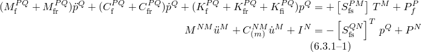These equations couple the total pressure in the fluid to the displacements in the solid. They are valid for any combination of fluid and solid domains in a particular model: the matrix 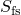 is defined on all the interacting fluid and solid surfaces. The fluid traction

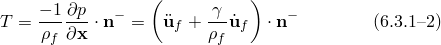 is a quantity (with dimensions of acceleration) that describes the mechanism by which the solid motion drives the fluid; the fluid drives the solid by the pressure on the solid surface. In [Equation 6.3.1&#8211;2](06s03a147.md), 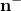 is the inward normal on the boundary.

To proceed, we decompose the total pressure into the known incident wave component and the unknown scattered component:

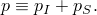 Then

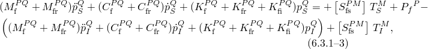and

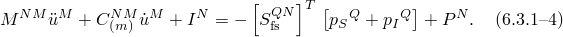We see that the displacements in the solid are driven by the sum of the incident pressure, which forms an applied boundary traction, and the scattered pressure, the unknown field in the fluid.

The incident field is independent of the scattered field by convention. Therefore, it can be shown that it is a solution to the equation

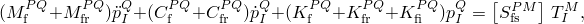so the fluid domain equation reduces to

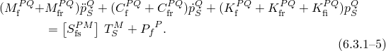This equation, using the scattered pressure as the unknown field variable, is solved together with [Equation 6.3.1&#8211;4](06s03a147.md) using explicit or implicit integration or using the steady-state formulation ("Coupled acoustic-structural medium analysis,"  Section 2.9.1).

The scattered fluid traction, , depends on the incident pressure through the decomposition above and the solid motion at the boundary. In the absence of an impedance condition at this boundary, this results in the relation

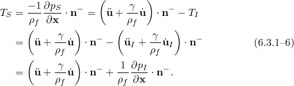If an impedance condition is applied at the fluid-solid boundary, application of the total pressure decomposition and [Equation 2.9.1&#8211;13](02s09a41-Coupled-acoustic-structural-medium-analy.md) results in the relation

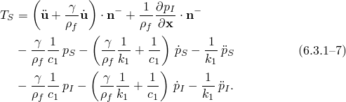
### Virtual mass formulation

The "virtual mass approximation" is a simplification of the general scattered-field form of the coupled system [Equation 6.3.1&#8211;1](06s03a147.md). Physically, it corresponds to considering the fluid wave speed to be very large compared to the characteristic structural wave speeds of interest; that is, fluid disturbances propagate and distribute in the field at an extremely high rate compared to the disturbances in the structure. This can be modeled by imposing an incompressibility condition on the fluid. Formally, applying such a condition results in the suppression of the terms related to time derivatives, volumetric drag, and impedance in the fluid equation for the coupled system:

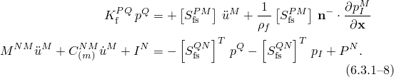The fluid will also be assumed to have homogeneous mass density, . The fluid pressures, 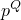, can be eliminated from the structural equation by inverting the fluid "stiffness," 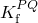 to yield

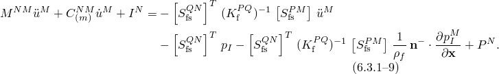Defining

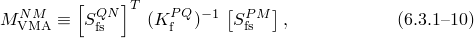the equation for the structure can be written

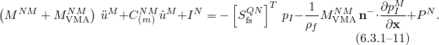This equation makes the term "virtual mass" clear: the effect of an incompressible fluid surrounding a structure is to add inertia to the structural motion, 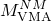. For some shapes---in particular, cylinders, disks, and spheres---the virtual mass is *a priori* known from classical solutions.

The matrix operator 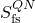 is the discrete form of the integral over the wetted or loaded surface (see "Coupled acoustic-structural medium analysis,"  Section 2.9.1). If the structure is long and thin, it is often modeled with beam elements. Then it is appropriate to replace the surface integral that generates the 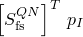 term with a more convenient volume integral term. Since

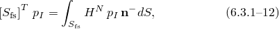where 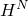 is a suitable interpolation function, Green's theorem can be applied to yield

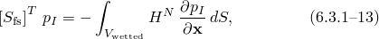where 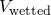 is the volume enclosed by the wetted surface. If  is chosen to be the same interpolation function used for the beam and if the loading is similarly interpolated, this term becomes

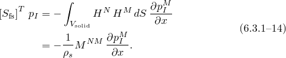Therefore, the virtual mass equations for a beam immersed in an incompressible fluid are

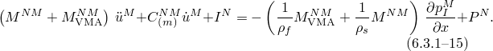This equation states that an immersed beam is loaded by a term due to the pressure gradient in the fluid due to the incident wave and that it experiences an additional amount of inertia due to the presence of the fluid.
### Scattering load amplitude

The incident field in the fluid is assumed known; moreover, it is assumed to be associated with a separable solution to the scalar wave equation of the form

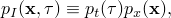where  is the "retarded time," which is a function of the true time, *t*, and the position, . In applications of interest here, the incident wave is produced by an excitation outside the computational domain. However, its temporal part, 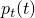, is specified through an amplitude time history at a single point inside the computational domain, referred to as the "standoff point," . The spatial term, 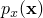, is restricted to forms modeling plane and spherical wavefronts only, emanating from a specified "source" point, 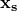.

An incident wave produces a time-varying pressure at a spatial point of interest 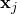 of the form

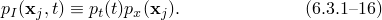The spatial variation of the field at point  is expressed by either

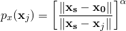for spherically symmetric waves or simply

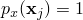for plane waves. The amplitude observed at a point  is related to that at the standoff point through this spatial variation, delayed by the time required for the wave to travel from the standoff point to the point :

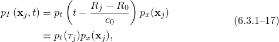 where 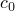 is the wave speed in the fluid. We have defined

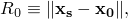and

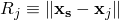 for spherical waves and

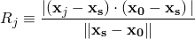for plane waves.  is referred to as "retarded time" because it includes a shift corresponding to the time required for the wave to move from the standoff point to . Of course, the delay may be positive or negative, depending on the relative distances between the point of interest, , and the source and between the standoff point and the source.

The incident wave boundary tractions in the solid equation [Equation 6.3.1&#8211;4](06s03a147.md) result from direct substitution of [Equation 6.3.1&#8211;17](06s03a147.md). The fluid boundary tractions in [Equation 6.3.1&#8211;4](06s03a147.md) and the tractions in [Equation 6.3.1&#8211;15](06s03a147.md) require the evaluation of the gradient of the incident wave pressure, assuming a source point with negligible speed:

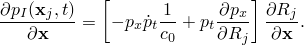First consider the case of generalized spatial decay, spherically symmetric waves with an exponent varying with the distance:

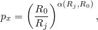where the exponent is chosen to be

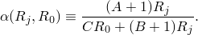This function reverts to acoustic decay for spherical waves if the constants , , and  are zero and approaches plane wave propagation as 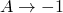; however, it allows some degree of flexibility in adapting the decay to experimental data. The gradient of this term is

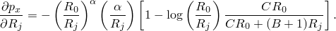 The gradient of the time-varying incident pressure simplifies for spherical acoustic waves to

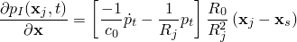 and to

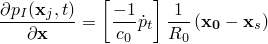 for plane waves. The direction of the wave travel is

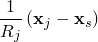for spherical waves and equal to the constant vector

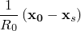for plane waves. The time derivatives of the incident pressure field can be written

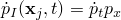 and

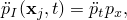 again neglecting the small terms associated with source point motion.Steady-state dynamics

Development of incident wave loading in steady-state dynamics is as for the transient case, with a few exceptions. First, no source point motion is included in the steady-state formulation. Second, only spherical and planar sources are supported. The Fourier transform is applied to the excitation: with the usual assumptions on , this is formally equivalent to substitution of a complex exponential in the steady-state formulation:

where  is the complex magnitude of the incident pressure at the standoff point, as a function of frequency. Then

and the gradient becomes

 for spherical waves and

 for plane waves. The time derivatives of incident pressure, needed for the computation of the fluid traction on impedance boundaries, are

and

The value of the load applied at a point  depends on the specified value  and the spatial variation but includes a phase shift relative to the standoff point, , corresponding to the time shifts in transient analysis.
### Effect of structural motion

Generally, the effects of the motion of the source point, , are included in the defined amplitude  of the incident wave field (specified at the standoff point ). That is, it is assumed that the stated amplitude reflects the time history at a specific fixed standoff point, including the effects of the source point motion, if any. For example, in underwater shock loading the incident wave field is produced by a pulsating gas bubble, which migrates toward the free surface of the water. Therefore, the corresponding incident wave amplitude model for this effect includes a moving source point.

The structural model affected by the incident wave may be in motion, as well. For example, a ship can move with respect to an explosive charge source during the loading. Because the wave motion is usually extremely fast compared to the ship motion and because incident wave pulse durations are typically short, some approximations apply. First, it can be assumed that the motion of the standoff point, , can be described by its position at time zero and by the average velocity during the incident wave loading, . In addition, the magnitude of this velocity can be assumed small compared to the speed of wave propagation, so the wave equation itself is unaffected by the relative motion. Furthermore, it can be assumed that the specified amplitude history, , corresponds to observations made at the position of the standoff point at time zero, .

Under these assumptions the effect of structural motion during incident wave loading can be modeled in a reference frame fixed with the standoff point, so the source point appears to move with :

This motion also affects the perceived arrival time of the wave at the standoff point. Defining the time of arrival at  as *t* and the time of arrival at  as , we can express the difference between these times in terms of :

This time shift is maximum when the movement  is aligned with . Therefore,

Since we have assumed that the standoff motion is slow compared to the wave speed, we neglect this small time shift.
### Underwater explosion---bubble load amplitude

An underwater explosion can lead to the formation of a highly compressed bubble that propels the surrounding water radially outward, generating an outward-propagating shockwave. As the bubble expands, the pressure inside decreases until it is considerably below the ambient pressure. After reaching a maximum radius with a minimum pressure, the bubble begins to contract. The contraction proceeds until the bubble collapses to a minimum radius. Because of a large pressure generated inside the bubble during this stage, the bubble begins to expand again, generating a second outward-propagating wave. Once the bubble expands to a second maximum radius, it contracts again. The same expansion-contraction sequence can repeat many times. At the same time during this pulsation process, the bubble migrates upward under the force of buoyancy. As long as the bubble does not reach the free water surface, the expansion-contraction sequence continues, each time with reduced amplitude.Geers-Hunter model

[Geers and Hunter (2002)](07s01a01-References.md) proposed a phenomenological model that treats an underwater explosion as a single bubble event comprised of a shockwave phase and an oscillation phase, with the first phase providing initial conditions to the second. This model was slightly refined in a later paper, [Geers and Park (2005)](07s01a01-References.md).

Based on this model, the volume acceleration during the shockwave phase is given by

in which  and , where  and  are the mass and radius of the explosive charge, respectively, and *K*, *k*, *A*, and *B* are constants for the charge material;  is the mass density of the fluid.

Integration with  and further integration with  then yields

 and radial displacement and velocity follow as

These expressions are evaluated at  to determine the initial conditions for the subsequent bubble response calculations during the oscillation phase. This choice was validated since, for a single set of charge constants, the initial condition values for values of  between  and  produce essentially the same response during the oscillation phase, as demonstrated by [Geers and Hunter (2002)](07s01a01-References.md).

The following are the equations of motion for the doubly asymptotic approximation model to describe the evolution of the bubble radius, *a*, and migration, *u*, during the oscillation phase:

where

and  is the charge mass density,  is the sound speed in fluid,  is the current volume of the bubble,  is the adiabatic charge constant,  is the volume of charge,  is the ratio of specific heats for gas, *g* is the acceleration due to gravity, and  (where  as the atmospheric pressure and  as the depth of the charge's center).  is an empirical flow drag parameter, which impedes the bubble's migration, and  is an exponent that can be tuned to match experimental migration data [[Geers and Park (2005)](07s01a01-References.md)].

Seven initial conditions are needed. The first two are , , the second two are , , the fifth one is , and the remaining two are determined as

 and

 with

Then [Equation 6.3.1&#8211;19](06s03a147.md) can be solved by using any suitable method for nonlinear ordinary differential equations; in Abaqus, a fourth-order Runge-Kutta integrator with variable time steps is used.

The incident pressure induced during the bubble response can be expressed as

 where

 and

with  given by [Equation 6.3.1&#8211;18](06s03a147.md) for the shockwave phase (), and

for the oscillation phase (). Here, .

Since the constants *A* and *B* are both substantially smaller than one,  for the shockwave phase above is only weakly dependent on . Thus, for simplicity,  can be treated as a constant when the gradient of the pressure is evaluated. In this way all formulations in the previous two sections can still be used without losing any significant accuracy."Waveless" model

The model of [Geers and Hunter (2002)](07s01a01-References.md) can be simplified to ignore the energy losses due to waves in the fluid and the gases. This "waveless" form of the equations more closely reproduces the results of earlier research on this phenomenon.

In the waveless model the shockwave phase of the loading is unchanged from the previous case. The equations of motion for the evolution of the bubble radius and migration during the oscillation phase are simplified, however, using the assumptions

and

Under these assumptions, the waveless equations of motion for the bubble dynamics are

where

The initial conditions are determined as for the previously discussed case. Since the equation for  is now decoupled from the others, it does not need to be solved.
### Reflections outside the computational domain

Abaqus allows the user to specify planes outside the computational domain that reflect the incident wave. This reflected wave is superposed, with a suitable time delay or phase shift, onto the wave arriving at the standoff point via the direct path, forming the total incident wave field for that source. This functionality is implemented for spherical or planar waves and reflection planes at any orientation, which may have arbitrary impedance properties. Only a single reflection from each plane is considered. However, multiple reflections inside the finite element computational domain are considered automatically.Spherical waves

Consider the schematic arrangement of source point, standoff point, and reflection plane *A* as shown in [Figure 6.3.1&#8211;1](06s03a147.md). The reflection plane can be specified by a normal vector, , and some point on the plane, . The distance from the source to the plane is , and the plane is assumed to have a specific characteristic impedance, . This information, together with the behavior of the source, is sufficient to characterize the reflected field in terms of an image source, located at the point . The source will be derived in steady state and then extended to the transient case.

Figure 6.3.1&#8211;1 Schematic of incident wave loading.

The actual source is given by

and the image source is given by

where the normalization length  is chosen for convenience. Generally, a nonzero imaginary part of the plane's impedance  will imply that  will also have a nonzero imaginary part. The unknown  is found by enforcing the impedance condition at the plane:

and the conservation of linear momentum:

where  is the complex density of the medium, including volumetric drag effects. Combining these two equations and simplifying, we have

In Abaqus the impedance property is specified using admittance constants  and ,

so it is convenient to use

This describes the source strength for a spherical image source in steady state, but in the transient case the complex density needs to be eliminated using

 The expression for the image source can be expanded to

In Abaqus the effects of fluid volumetric drag, the spreading loss due to the distance to the reflection plane, and the complex part of the admittance  are ignored, so the amplitude of the reflected wave is related to the amplitude of the incident wave by

Therefore, the reflected spherical load is similar to the direct load, with magnitude reduced by the reflection impedance effect and by the greater distance travelled. In the time domain inversion of the steady-state result, retaining a phase shift corresponding to the arrival time at the standoff point, yields

where

The direction of this wave varies at each field point :

"Soft" and "hard" limits

If a reflecting plane is considered "soft," the pressure is zero there. Then  and

A "hard" reflecting plane refers to a zero fluid particle motion condition, implying . Then

Planar waves

The schematic for reflected plane waves is similar to that for spherical waves, except for the geometry of the reflection. In contrast to the spherical case, when planar waves reflect from a boundary (see [Figure 6.3.1&#8211;2](06s03a147.md)), the direction of the reflected wave is common for all points on the wavefront. The location of the perceived source of the reflected wave is different, however. To calculate the phase shift for the reflected wave incident at an arbitrary point  correctly, the locations of these perceived sources need to be calculated.

Figure 6.3.1&#8211;2 Schematic of incident wave loading using planar waves.

The reflected plane wave load can be calculated on the basis of the reflected wave direction and the time delay associated with the additional path length of the reflected wave. Referring to [Figure 6.3.1&#8211;2](06s03a147.md), we see that the reflected wave direction is given by

The direct path wave travels the distance

and the reflected path travels the distance

The time delay of interest for point , , is related to the difference of these distances via the acoustic wave speed:

The first term on the right is the same as the delay due to the direct path; the rest is the increment due to the additional path length of the reflection. Some geometric manipulations allow this expression to be written in terms of the locations of , , , and the location of the spherical-wave virtual source, :

where

and

Reflected planar waves are subject to reduction in amplitude due to impedance conditions at the reflection plane in the same manner as spherical waves, but there is no spatial attenuation. Unlike spherical waves, planar waves may yield no reflections for some orientations of the specified reflection plane: if the direction of the wave is parallel to the reflection plane, or strikes at an obtuse angle, no reflections are generated.
### Reference

### Reference

"Acoustic and shock loads,"  Section 34.4.6 of the Abaqus Analysis User's Guide