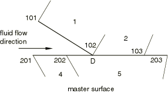
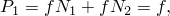
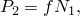
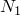
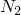
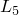
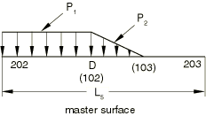
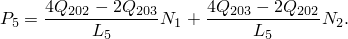

# 6.4.1 Pressure penetration loading with surface-based contact

### 6.4.1 Pressure penetration loading with surface-based contact

**Product: **Abaqus/Standard

Abaqus/Standard allows for the simulation of fluid penetrating into the surface between two contacting bodies and application of the fluid pressure normal to the surfaces. The surface-based contact approach is used to model the interactions between the bodies, where one surface definition provides the "master" surface and the other surface definition provides the "slave" surface. Both surfaces can be deformable, or one can be rigid.

A single slave node&#8211;based penetration criterion is used. Fluid will penetrate into the surface between the contacting bodies from one or multiple locations, which are exposed to the fluid, until a point is reached where the contact pressure is greater than the critical value specified by the user, cutting off further penetration of the fluid. The critical contact pressure is introduced to account for the asperities on the contacting surfaces. The higher this value, the easier the fluid penetrates. The default value of the critical contact pressure is zero, in which case fluid penetration occurs only if the contact pressure is zero and contact is lost. When a node has a contact status of "OPEN," its nearest neighboring nodes are considered to be subjected to the fluid pressure as well. The nodes initially exposed to the fluid, which are specified by the user, will always be subjected to the fluid pressure irrespective of the contact status at these nodes.

The pressure penetration load will be applied normal to the element surface based on the pressure penetration criterion described above at the beginning of an increment and will remain constant over that increment even if the fluid penetrates further during that increment. In two dimensions, a nodal integration scheme is used to integrate the distributed pressure penetration load over an element; the variation of the distributed load over an element will be determined by the load magnitudes at the element's nodes, which are coincident with the base points. Consider the contact interaction of three nodes---101, 102, and 103---on the slave surface made up of faces of two first-order elements, 1 and 2, with a master surface made up of faces of two elements, 4 and 5, which are described by nodes 201, 202, and 203 as shown in [Figure 6.4.1&#8211;1](06s04a148.md).

Figure 6.4.1&#8211;1 Pressure penetration with nonmatching meshes.

If the fluid with a pressure magnitude of *f* has penetrated up to node 102 on the slave surface, the variation of the distributed load over element 1 is given by

and the variation of the distributed load over element 2 is given by

where  and  are the shape functions on the face of a first-order element.

For an element-based master surface we must also consider how the fluid pressure is applied to the master surface, which depends on the location of the "anchor" point on the master surface. The "anchor" point is chosen as the point on the master surface closest to the last slave node subjected to the fluid pressure (pressure penetration tip). All the nodes between the "anchor point" and the node initially exposed to the fluid on the master surface, as specified by the user, are considered to be subjected to the fluid pressure.

The pressure penetration capability does not require that the contacting surfaces have matching meshes; however, the best accuracy is obtained when meshes are initially matching. For initially nonmatching meshes the equivalent fluid pressure applied on the master surface can be evaluated based on equilibrium considerations. For the problem illustrated in [Figure 6.4.1&#8211;1](06s04a148.md), the "anchor" point corresponding to slave node 102 is D. For the element associated with the anchor point (element 5) on the master surface, part of the load is transferred from element 1 and part of the load is transferred from element 2 on the slave surface. The load distribution on element 5 is illustrated in [Figure 6.4.1&#8211;2](06s04a148.md), where  is the element length.

Figure 6.4.1&#8211;2 Stress distribution over an element on the master surface with nonmatching meshes.

Because the fluid pressure will be simulated as a distributed load on the contacting surfaces, the variation of the load over an element needs to be described. For a first-order element if  and  are the equivalent forces at nodes 202 and 203 due to the distributed load shown in [Figure 6.4.1&#8211;2](06s04a148.md), the variation of the distributed load over element 5 on the master surface is given by

A similar approach is used for the second-order elements.
### Reference

### Reference

"Pressure penetration loading,"  Section 37.1.7 of the Abaqus Analysis User's Guide