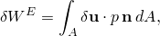
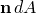
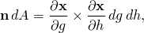
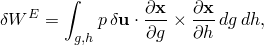
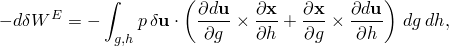
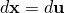
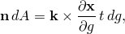
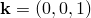
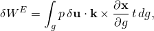
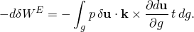

# 6.5.1 Pressure load stiffness

### 6.5.1 Pressure load stiffness

**Product: **Abaqus/Standard

In geometrically nonlinear analysis pressure loads are applied on the deformed structure. Hence, the equivalent nodal loads are dependent on the nodal displacements. This dependency leads to additional contributions to the Jacobian in the solution procedure used in Abaqus/Standard. The external virtual work is

where *A* is the surface on which the pressure is applied;  is the normal to this surface, pointing into the material;  is the virtual displacement field; and *p* is the pressure magnitude.
### Pressure load stiffness on a surface in three-dimensional space

The expression  can be rewritten as follows:

where  are the current coordinates of a point on the surface, and the surface parametric coordinates (*g*, *h*) are chosen to give the correct sign to  through the cross product. The external virtual work is then given by

and the load stiffness matrix is obtained from

where, for a solid, .
### Pressure load stiffness on a surface in two-dimensional space

Now

where  is a unit vector out of the plane of the model, *t* is the thickness of the two-dimensional solid (which is assumed to be constant), and the surface parametric coordinate *g* is chosen to give the correct sign to  through the cross product. The external work is then given by

and the load stiffness matrix is obtained from

### Reference

### Reference

"Distributed loads,"  Section 34.4.3 of the Abaqus Analysis User's Guide