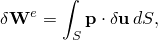
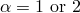
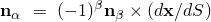
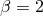
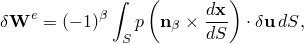
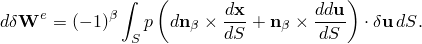
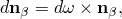
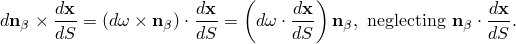
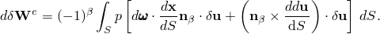
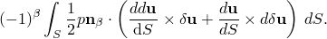

# 6.5.2 Load stiffness for beam elements

### 6.5.2 Load stiffness for beam elements

**Product: **Abaqus/Standard

Abaqus provides for loads per unit length in the beam cross-sectional directions as distributed load options for the beam elements (load types P1, P2). Since these are follower forces, they have a load stiffness; and this stiffness can sometimes be important especially in the case of buckling prediction by eigenvalue extraction. The symmetric form of this load stiffness is included in Abaqus/Standard (see [Hibbitt, 1979](07s01a01-References.md), and [Mang, 1980](07s01a01-References.md)). This form is developed below. The external virtual work on the beam is

where the pressure load, , is given by the externally prescribed pressure magnitude, *p*, as  where  defines the particular cross-sectional direction of the load. Therefore, , where  when , and  when  so that

where *S* is the material coordinate along the beam. Now assuming that the load magnitude, *p*, is externally prescribed so that it does not change with position, the rate of change of  with change in position, , is

Now

and so

Thus,

This load stiffness is not symmetric, except in the case of a beam in a plane with fixed ends (or no ends, such as a ring), in which case the first term is exactly zero and the second gives the symmetric form

In Abaqus, even for the general beams in three dimensions, the load stiffness is introduced as the symmetric part of  above.
### Reference

### Reference

"Distributed loads,"  Section 34.4.3 of the Abaqus Analysis User's Guide