# 6.5.3 Pressure loadings on elbow elements

### 6.5.3 Pressure loadings on elbow elements

**Product: **Abaqus/Standard

Elbow elements are often used to model pipelines in which the curvature of the pipe can change significantly while the pipe is subjected to uniform or hydrostatic pressure. Therefore, pressure loadings that include large geometry changes are developed for these elements, as described in this section.

The virtual work contribution of pressure on the lateral surface of the elbow is

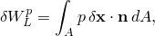where

*p*

is the pressure magnitude,

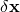

is the variational displacement at a point on the midsurface of the lateral wall of the elbow,

is the normal to the lateral wall midsurface, and

*A*

is the area of space occupied by the lateral surface in the current configuration.

The product of the surface normal and the differential area can be rewritten in terms of material coordinates  along the pipe and  around the pipe section:

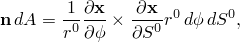where 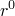 is the initial pipe radius, so that

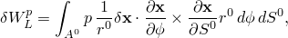where 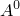 is the area of space occupied by the lateral surface in the reference configuration.

For hydrostatic pressure, the pressure magnitude is a function of position:

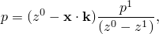where

is the reference pressure magnitude,

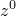

is the zero pressure height,

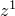

is the reference height, and

is 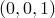, a unit vector in the vertical direction.

In the elbow elements position on the lateral surface, , is interpolated as

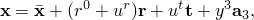where

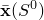

is the position of a point on the pipe axis,

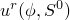

is the radial displacement,

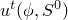

is the tangential displacement,

is 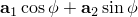, and

is 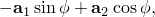 with 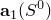 and 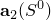 being the cross-sectional basis vectors.

The first variation of the position can now be expressed as

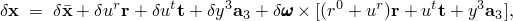and the derivatives of the position with respect to the parametrization are

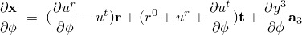and

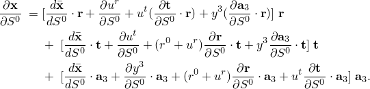Assuming that (1) terms in 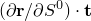 and 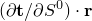 can be ignored due to negligible twist in the pipe, (2) terms in 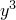 and its derivatives can be ignored due to negligible warping in the pipe, (3) 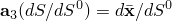, (4) the stretch 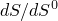 is unity, and (5) 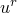 and 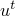 are small compared to , we arrive at the following expression for the integrand of 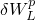:

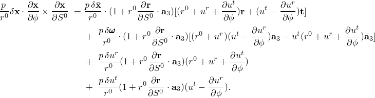For closed-end loading the virtual work contribution of pressure on the end-caps of the elbow is

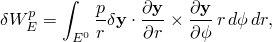where *r* and  are the material coordinates in a two-dimensional cylindrical coordinate system of points on the end-caps of the elbow element,  represents position on the end-caps, and 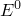 is the area of space occupied by the end-caps of the elbow element. We assume the following deformation for the end-caps:

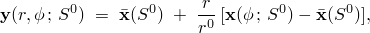where  is the parameter that identifies the end-cap being considered. The assumed deformation arises naturally on considering a deformation of the end-caps in which radial rays of the reference end-cap configuration remain straight lines under deformation. It can be shown easily that the assumed deformation of the end-caps is differentiable as long as the deformations of the circumferential curves of the end-caps are differentiable. For the end-cap boundary shapes that arise in applications (primarily ovalized modes), the assumed deformation will be locally invertible so that integration of functions over the deformed surface is not likely to be a problem.

Ignoring the terms due to warping in the expression for position on the lateral surface, the first variation of position on an end-cap is

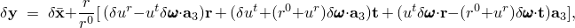and the derivatives of  with respect to *r* and  are

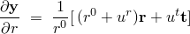and

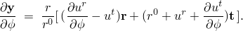The integrand of the expression for the virtual work of pressure on the end-caps can now be expressed as

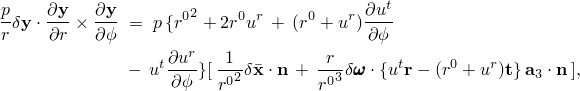where  is 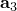 if the center of the end-cap is node 1 of the element and  if the center is node 2 or 3 of the element.

The load stiffness for the pressure loading, which by definition is the first variation of the virtual work of the pressure load, is given by 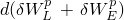. The following expressions are required for its calculation:

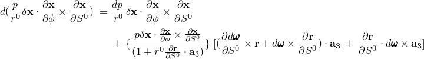

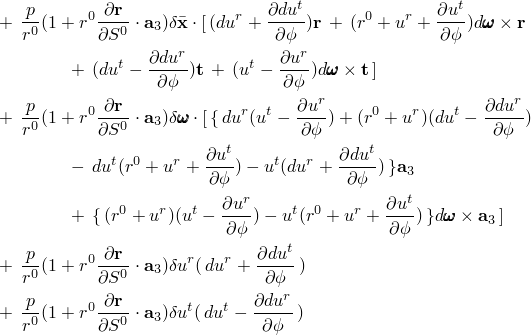and

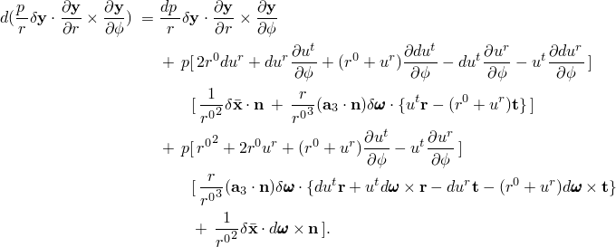In the above 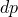 is nonzero only in the case of hydrostatic pressure, when it is given in the first case by

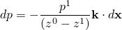and in the second case by

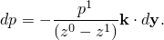
### Reference

### Reference

"Pipes and pipebends with deforming cross-sections: elbow elements,"  Section 29.5.1 of the Abaqus Analysis User's Guide