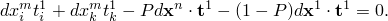

# 6.6.1 Sliding constraint

### 6.6.1 Sliding constraint

**Products: **Abaqus/Standard  Abaqus/Explicit

The sliding constraint has a variety of uses. For example, this MPC is used in conjunction with other MPC types to constrain a shell element mesh to a solid element mesh. The MPC maintains consistency with standard shell theory by forcing initially straight lines through the thickness to remain straight despite rotation and displacement. When applied to solid element nodes on the shell-solid interface, this MPC enforces a kinematic approximation of compatibility with the shell model.

The theory of this constraint is as follows:

Let ,  be the points defining the line; and let  be the node that must lie on this line. The direction of the line is given by

where

Let  be base vectors in the *x*-, *y*-, *z*-directions in the global coordinate system. Then, define a unit vector normal to the line as

unless , in which case we use

Now we can define an orthogonal normal as

, and  now form a set of orthonormal base vectors with  and  normal to the line joining  and . The constraint can be imposed by the condition that the line joining the node *m* to node 1 be perpendicular to  and ; that is,

and

We now choose a local coordinate numbering system such that *i* is the global direction on which  has its largest projection:

Likewise, we choose global direction *j* such that  and

Using this definition of  the constraint conditions can be written explicitly in terms of coordinate components of node *m* as

and

These equations can be used to eliminate  (note that the numbering of  avoids dividing through by zero in this elimination):

and

The above equations will enforce the desired constraint. We also need the derivatives of these constraints. These are

and

where

and

These equations reduce to

and

 can be obtained from the definition of  to give

and, therefore,

and

The incremental constraint equations become

and

Let . Then, the above equations, when written out in full with the same ordering of  used above, are

and

Solving for  we obtain

and

In the two-dimensional case  lies in the *x*&#8211;*y* or *r*&#8211;*z* plane and . This implies that the second constraint equation is satisfied automatically. The remaining constraint equation is

and its derivative is

### Reference

### Reference

"General multi-point constraints,"  Section 35.2.2 of the Abaqus Analysis User's Guide