# 6.6.2 Shell to solid constraint

### 6.6.2 Shell to solid constraint

**Products: **Abaqus/Standard  Abaqus/Explicit

The shell to solid constraints SS LINEAR, SS BILINEAR, and SSF BILINEAR are used to connect shell elements to a solid element mesh. These MPCs are used in conjunction with the sliding constraint SLIDER (see "Sliding constraint,"  Section 6.6.1). The SLIDER MPC maintains consistency with standard shell theory by forcing initially straight lines through the thickness to remain straight despite rotation and displacement. Thus, the shell to solid MPC must enforce the remaining constraints:

The displacement of the shell node at the interface must be equal to the displacement of the corresponding point on a line of nodes through the thickness of the solid;

The rotation of the shell node at the interface must be compatible with the rotation of the corresponding line of nodes through the thickness.

The three MPC types impose essentially the same constraints but use different weighting factors to reflect the nature of the interpolations in the solid elements. SS LINEAR is used with first-order elements, SS BILINEAR is used at the edges of second-order elements, and SSF BILINEAR is used for the middle of second-order elements. The MPCs can be used in two-dimensional as well as three-dimensional models. The degrees of freedom will automatically adapt to the dimensionality of the problem. The shell to solid MPCs can be used with any number of points through the thickness of the solid. The weighting functions for the nodes in the solid will be chosen based on this number.

The displacement constraint for the shell node is obtained by setting the displacement of the shell node, 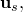 equal to the weighted average of the displacements of the nodes in the solid:

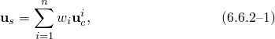where the MPC selects the appropriate weighting factors, 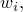 based on the MPC type and the location of the nodes. If the SLIDER MPC is used to keep the nodes in the solid on a straight line, the choice of weighting factors does not influence the solution.

For the formulation of the rotation constraint, we assume that the nodes on the solid remain on one line. Hence, this line of nodes can be represented by the normalized direction  in the undeformed configuration and  in the deformed configuration. Let the rotation of the shell node be given by the finite rotation vector, . Then , , and  are related by the equation

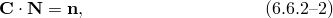where 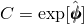 with  the skew symmetric matrix form of the rotation vector . See "Rotation variables,"  Section 1.3.1, for a more detailed discussion of finite rotations.

This constraint equation does not completely define the rotation of the shell node: any solution to [Equation 6.6.2&#8211;2](06s06a153.md) can be augmented by a rotation 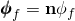 around the line of nodes in the solid, where 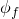 can be chosen arbitrarily. Hence, [Equation 6.6.2&#8211;2](06s06a153.md) only constrains the finite rotation vector  to within two components. The linearized form of the rotation constraint is

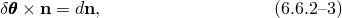where  is the linearized rotation. See "Rotation variables,"  Section 1.3.1, for a more detailed discussion of the linearized rotation.

We now define two local directions,  and , so that , , and  form a right-handed, orthonormal, local coordinate system. We then project [Equation 6.6.2&#8211;3](06s06a153.md) onto  and , which yields

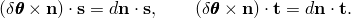

With some standard vector algebra these equations can be transformed into the form

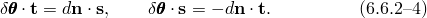

The change in the normal can be expressed in terms of the displacement difference between the two extreme nodes 1 and *n* in the continuum:

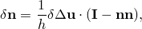where 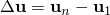 is the displacement difference and 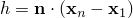 is the distance between the nodes. Substitution in [Equation 6.6.2&#8211;4](06s06a153.md) yields the constraint equations

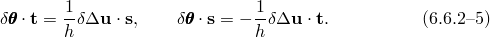

These constraint equations are formulated in terms of local components of . To obtain the constraint in terms of global components of , we choose a basis 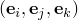 that is a cyclic permutation of the global basis 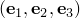, such that 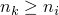 and 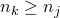. The constraints can then be written in component form as follows:

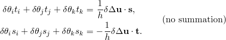

From these two equations we solve for 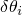 and 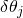:

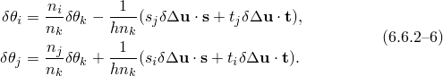

The linearized constraints shown above are used directly in geometrically linear analysis, linear perturbations, and Abaqus/Explicit. In geometrically nonlinear analysis in Abaqus/Standard, the linearized constraints are used to solve for the general nonlinear constraint [Equation 6.6.2&#8211;2](06s06a153.md) with a Newton method. When the rotation is large, the permutation  may change to maintain the conditions that  and .
### Reference

### Reference

"General multi-point constraints,"  Section 35.2.2 of the Abaqus Analysis User's Guide