# 6.6.3 Revolute joint

### 6.6.3 Revolute joint

**Products: **Abaqus/Standard  Abaqus/Explicit

A revolute joint is a joint between two nodes in which the rotations of the nodes differ by a relative rotation about an axis that is fixed in and, therefore, rotates with the joint. A simple example is a hinge.

A revolute joint is implemented in Abaqus/Standard as a multi-point constraint, defining the total rotation of the constrained ("slave") node (the first node of the MPC), , as the total rotation of the "master node" (the second node of the MPC), , followed by the relative rotation 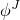, about the axis of the joint :

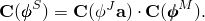The joint axis, , also rotates with the rotation of the master node:

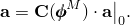

The angular velocity of the slave node is

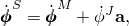and the virtual variations of the rotations are, likewise,

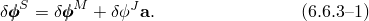Thus, the joint imposes three constraints (each component of the angular velocity of the slave node is constrained) but introduces an additional degree of freedom in the form of the relative rotation . This means the joint provides a total of two constraints to the model if  is not prescribed and three constraints if it is.

The virtual work contribution of the three nodes of the joint is

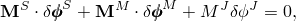where  is the total moment at node *S*,  is the total moment at node *M*, and 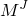 is the moment in the joint. Applying the constraints ([Equation 6.6.3&#8211;1](06s06a154.md)), this is

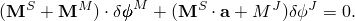If there are no further constraints associated with the nodes of the joint,  and 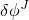 are independent variations, so the constrained virtual work equation implies that

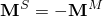and that

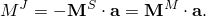

Because the revolute is implemented in this manner, the relative rotation in the joint  appears as a degree of freedom in the model (degree of freedom 6 at the third node of the MPC). Thus, a moment, , can be applied in the joint by specifying its value as a concentrated load;  can be given a prescribed variation in time by specifying a boundary condition; or stiffness and/or damping can be associated with relative rotation of the joint by attaching a spring and/or dashpot to ground to this degree of freedom (a spring or dashpot to ground is used because the variable is a relative rotation).
### Reference

### Reference

"General multi-point constraints,"  Section 35.2.2 of the Abaqus Analysis User's Guide