# 6.6.4 Universal joint

### 6.6.4 Universal joint

**Products: **Abaqus/Standard  Abaqus/Explicit

A universal joint is a joint between two nodes containing orthogonal hinges that provide two axes of relative rotation in the joint.

A universal joint is implemented in Abaqus/Standard as a multi-point constraint, defining the total rotation of the constrained ("slave") node (the first node of the MPC), 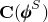, as the total rotation of the "master node" (the second node of the MPC), 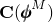, followed by two relative rotations: 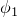 about the first axis of the joint , then  about the second axis of the joint  (which is orthogonal to ):

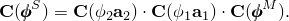The first joint axis, , rotates with the rotation of the master node:

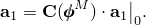The second joint axis has this rotation plus the rotation about the first joint axis:

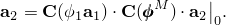

The angular velocity of the slave node is

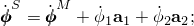and the virtual variations of the rotations are, likewise,

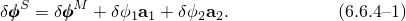Thus, the joint imposes three constraints (each component of the angular velocity of the slave node is constrained) but introduces two additional degrees of freedom in the form of the relative rotations  and . This means the joint provides a total of one constraint to the model if  and  are not prescribed or up to three constraints if they are.

The virtual work contribution of the joint is

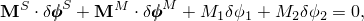where 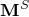 is the total moment at node *S*, 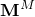 is the total moment at node *M*, and  and  are the moments in the joint hinges. Applying the constraints ([Equation 6.6.4&#8211;1](06s06a155.md)), this is

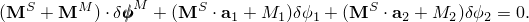If there are no further constraints associated with the nodes of the joint, 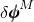, 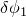 and 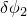 are independent variations, so that the constrained virtual work equation implies that

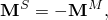

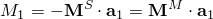and

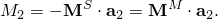

Because the universal joint is implemented in this manner, the relative rotations in the joint,  and , appear as degrees of freedom in the model (degree of freedom 6 at the third and fourth nodes of the MPC). Moments  and  can, therefore, be applied in the joint by specifying their values as concentrated loads;  and  can be given prescribed variations in time by specifying boundary conditions; or stiffness and/or damping can be associated with relative rotations of the joint by attaching springs and/or dashpots to ground to these degrees of freedom (springs or dashpots to ground are used because the variables are relative rotations).
### Reference

### Reference

"General multi-point constraints,"  Section 35.2.2 of the Abaqus Analysis User's Guide