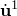
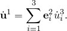
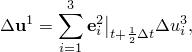
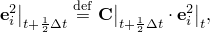
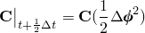
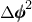
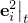

# 6.6.5 Local velocity constraint

### 6.6.5 Local velocity constraint

**Product: **Abaqus/Standard

The V LOCAL MPC in Abaqus/Standard constrains the velocity components at the first MPC node to be equal to the velocity components at the third node along local, rotating, directions. These local directions rotate according to the rotation at the second node. In the initial configuration the first local direction is from the second to the third node of the MPC. The global *z*-axis is used if these nodes coincide. The velocity of the first node , is as follows:

The constraint is integrated approximately to define

where

where

is the increment of rotation defined by half of the magnitude of the increment of rotation at the second node of the constraint, , and , , are the local directions at the beginning of the increment.
### Reference

### Reference

"General multi-point constraints,"  Section 35.2.2 of the Abaqus Analysis User's Guide