# 6.6.6 Kinematic coupling

### 6.6.6 Kinematic coupling

**Product: **Abaqus/Standard

A kinematic coupling constrains a group of slave nodes to the translation and rotation of a master node in a customized manner; combinations of slave node degrees of freedom are selected to participate in the constraint. Since each slave node has a separate relationship with the master node, the kinematic coupling constraint can be considered as the combination of general master-slave constraints. These general constraints are described below.
### Rotations

Each possible combination of selected constraints on a slave node rotation results in rotation relationships that are unique but analogous to existing MPC types: zero constrained rotational degrees of freedom results in a pin constraint; one, results in a universal constraint; two, results in a revolute constraint; and three, results in a beam constraint. Each of these combinations is treated according to the appropriate theory employed in Abaqus/Standard. To implement these constraints, an additional node is created internally for each slave node. For example, for revolute and universal constraints this additional node is used in a similar manner to the nodes required in the specification of the analog MPC types.
### Translations

The additional internal node, described above, also reflects the motion of the slave node, relative to that of a fully constrained slave node in the following manner. Let 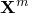 be the position of the master node and 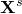 be the position of the slave node in the reference configuration. The reference configuration position of the slave node with respect to the master node is then

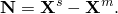Then, in the current configuration

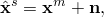where 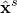 is the fully constrained slave node position and

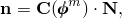where 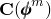 is the rotation matrix associated with the master node rotation, 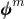. The selectively constrained slave node position can be described as

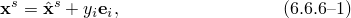where  are the translation degrees of freedom at the additional node and  are the current configuration base vectors, which rotate from the reference global Cartesian base vectors  according to

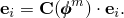

This base vector rotation is made regardless of the choice of rotation constraint at the slave node. Constraint or release of slave node translation degree of freedom *i* can now be described as the constraint (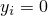) or release of translation degrees of freedom on the additional node. With these constraints on , [Equation 6.6.6&#8211;1](06s06a157.md) can be used to define the constraint equations.
### Linearized form

The linearized form is readily obtained as

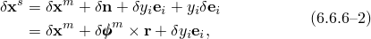where 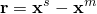.
### Second-order form

The initial stress stiffness terms can be obtained from

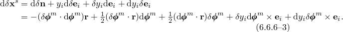
### Reference

### Reference

"Kinematic coupling constraints,"  Section 35.2.3 of the Abaqus Analysis User's Guide