# 1.2.1 输入语法规则


**产品：** Abaqus/Standard  Abaqus/Explicit  

##### **参考**

- ["在Abaqus中定义模型"，第1.3.1节"](pt01ch01s03aus03.md)

### 概述

本节描述管理Abaqus输入文件的语法规则。

Abaqus中的所有数据定义都通过选项块完成——描述问题定义一部分的数据集。您选择与特定应用相关的选项。选项由输入文件中的行定义。Abaqus输入文件中使用三种类型的输入行：*关键词*行、*数据*行和*注释*行。仅支持7位ASCII字符，输入文件每行末尾需要回车符。
- 关键词行引入选项，通常有*参数*，参数以逗号分隔的单词或短语形式出现在关键词行上。参数用于定义选项的行为。参数可以独立存在，也可以有值，可以是必需的或可选的。
- 数据行用于提供数字或字母数字条目，跟在大多数关键词行后面。
- 以星号（**）开头的任何行都是注释行。这类行可以放在文件中的任何位置。它们被Abaqus忽略，因此只会在文件的初始列表中打印。文件中此类行的数量和位置没有限制。

相关参数和数据行（包括每行条目的数量）在[Abaqus关键词参考指南](../key/key-link.md#key)描述每个选项的部分中有详细说明。本节描述适用于所有关键词和数据行的一般规则。

### 关键词行

输入关键词行时适用以下规则：
- 每个关键词行的第一个非空白字符必须是星号（*）。
- 如果给出任何参数，关键词后必须跟逗号（,）。
- 参数必须用逗号分隔。
- 关键词行上的空白将被忽略。
- 一行最多可包含256个字符（包括空白）。
- 关键词和参数不区分大小写。
- 参数值通常不区分大小写。此规则唯一的例外是由Abaqus外部强加的，例如区分大小写的操作系统上的文件名。
- 关键词、参数，在大多数情况下还有参数值，不必完全拼写出来，但必须给出足够的字符来区分它们与其他以相同方式开头的关键词、参数和参数值。Abaqus首先在每个关联文本字符串中搜索精确匹配。如果未找到精确匹配，Abaqus则根据每个关键词、参数或参数值中的最少唯一字符数进行搜索。关键词行中的任何项目都可以省略嵌入式空白。如果参数值用于提供数字或文件名，应提供完整值。
- 如果参数有值，则使用等号（=）。该值可以是整数、浮点数或字符串，取决于上下文。例如，``` [*ELASTIC](../key/key-link.md#usb-kws-melastic), TYPE=ISOTROPIC, DEPENDENCIES=1 ```
- 当参数值是表示项目名称的字符串时，除非值放在引号内，否则不应使用大小写作为区分值的方法。例如，Abaqus不区分以下定义：``` [*MATERIAL](../key/key-link.md#usb-kws-mmaterial), NAME=STEEL [*MATERIAL](../key/key-link.md#usb-kws-mmaterial), NAME=Steel ```
- 同一参数不应在单个关键词行上出现多次。如果参数在单个关键词行上有多个设置，Abaqus将忽略除其中一个之外的所有设置。
- 有时需要延续关键词行；例如，由于参数较多。如果关键词行最后一个字符是逗号，则下一行被解释为该行的延续。例如，上面的[*ELASTIC](../key/key-link.md#usb-kws-melastic)关键词行也可以这样给出：``` [*ELASTIC](../key/key-link.md#usb-kws-melastic), TYPE=ISOTROPIC, DEPENDENCIES=1 ```
- 某些关键词必须与其他关键词结合使用；例如，[*ELASTIC](../key/key-link.md#usb-kws-melastic)和[*DENSITY](../key/key-link.md#usb-kws-mdensity)关键词必须与[*MATERIAL](../key/key-link.md#usb-kws-mmaterial)关键词结合使用。这些相关关键词必须在输入文件中分组在一个块中；不相关的关键词不能在此块中指定。
- 某些选项允许将INPUT或FILE参数设置为备用文件的名称。此类文件名可以包括完整路径名或相对路径名。相对路径名必须相对于提交作业的目录。如果未指定路径，则假定文件位于提交作业的目录中。子结构库必须位于提交作业的同一目录中；不能使用完整路径名来指定子结构库名称。对于由INPUT参数引用的文件，文件名必须包含任何扩展名（例如，`elem.inp`）。对于由FILE参数引用的文件，大多数情况下必须给出不带扩展名的名称，因为Abaqus假定要读取的文件具有与该选项相关的文件类型的正确扩展名：`.res`表示重启文件（["重新启动分析"，第9.1.1节"](pt04ch09s01aus53.md)），`.fil`表示结果文件（["输出"，第4.1.1节"](pt02ch04s01aus38.md)）。但是，当结果文件（`.fil`）或输出数据库文件（`.odb`）与该选项相关时，可能适用特殊规则（详见["Abaqus/Standard和Abaqus/Explicit中的初始条件"，第34.2.1节"](pt07ch34s02aus116.md)和["顺序耦合热应力分析"，第16.1.2节"](pt04ch16s01at39.md)）。在区分大小写的操作系统上，文件或子结构库名称必须具有正确的大小写。无论用户仅指定文件名、相对路径名还是完整路径名，包括路径的完整名称最多可包含256个字符。除非文件名用引号括起来，否则文件名、相对路径名或完整路径名内的所有空格都将被忽略，在这种情况下，名称内的所有空格都将被保留。

### 数据行

数据行用于提供比作为选项参数更容易以列表形式给出的数据。大多数选项需要一行或多行数据行；如果需要，数据行必须紧跟在引入选项的关键词行后面。输入数据行时适用以下规则：
- 数据行最多可包含256个字符（包括空白）。尾随空白将被忽略。
- 所有数据项必须用逗号（,）分隔。空数据字段通过省略逗号之间的数据来指定。Abaqus将对任何省略的所需数值数据使用零值，除非指定了默认值。
- 一行必须只包含指定数量的项目。
- 行末尾的空数据字段可以忽略。
- 浮点数最多可占用20个空格（包括符号、小数点和任何指数表示法）。浮点数可以带指数或不带指数输入。任何指数（如果输入）必须以E或D开头，后跟可选的()或(+)。以下行显示输入相同浮点数的四种可接受方式：``` -12.345 -1234.5E-2 -1234.5D-2 -1.2345E1 ```
- 整数数据项最多可占用9位数字。
- 字符串最多可包含80个字符，不区分大小写。
- 在特定情况下允许使用延续行（参见["单元定义"，第2.2.1节"](pt01ch02s02aus11.md)）。如果允许，此类行由前一行末尾的逗号表示。单个数据项不能跨多行输入。

在许多情况下，与选项一起使用的参数选择决定了所需的数据行类型。例如，有五种不同的方法来定义线性弹性材料（["弹性行为：概述"，第22.1.1节"](pt05ch22s01abo19.md)）。您指定的数据行必须与[*ELASTIC](../key/key-link.md#usb-kws-melastic)选项上给出的TYPE参数值一致。

#### 集合

Abaqus数据定义方法最有用的功能之一是*集合*的可用性。集合可以是节点集合或单元集合。您为每个集合提供一个名称（1-80个字符，第一个字符必须是字母）。该名称提供了一种引用集合所有成员的方法。例如，假设对于[图1.2.1-1](pt01ch01s02aus01.md#iusing-set-exa)所示的结构，我们希望在集合`MIDDLE`的所有节点上施加对称边界条件，并且边缘`SUPPORT`是固定的。

**图1.2.1-1** 集合使用示例。


我们通过以下方式将相关节点组装成集合并指定边界条件
```
[*BOUNDARY](../key/key-link.md#usb-kws-hboundary)
 MIDDLE, ZSYMM
 SUPPORT, PINNED
```

集合是整个Abaqus中的基本引用方式，建议使用集合。选择有意义的集合名称可以轻松识别哪些数据属于模型的哪一部分。有关集合的进一步讨论在["节点定义"，第2.1.1节"](pt01ch02s01aus05.md)和["单元定义"，第2.2.1节"](pt01ch02s02aus11.md)中提供。

#### 标签

标签（如集合名称、表面名称和钢筋名称）不区分大小写，除非用引号括起来（除非从用户子程序访问；参见["用户子程序：概述"，第18.1.1节"](pt04ch18s01aus104.md)）。标签最多可包含80个字符。除非标签用引号括起来，否则标签内的所有空格都将被忽略，在这种情况下，标签内的所有空格都将被保留。用引号括起来的标签必须以字母开头，不能包含句点（.），不应包含逗号和等号等字符。这些限制不适用于用引号括起来的标签，除非标签是材料名称。材料名称必须始终以字母开头，即使名称用引号括起来。

标签不能以双下划线开头和结尾（例如，`__STEEL__`）。此标签格式保留供Abaqus内部使用。

以下是带引号和不带引号输入标签的示例：

```
[*ELEMENT](../key/key-link.md#usb-kws-melement), TYPE=SPRINGA, ELSET="One element"
1,1,2
[*SPRING](../key/key-link.md#usb-kws-mspring), ELSET="One element"
1.0E-5,
[*NSET](../key/key-link.md#usb-kws-mnset), ELSET="One element", NSET=NODESET
[*BOUNDARY](../key/key-link.md#usb-kws-hboundary)
nodeset,1,2
```

#### 重复数据行

某些选项只列出单个数据行。在只允许一行数据的情况下，数据行标题"第一行（也是唯一一行）"会予以说明。示例是[*DYNAMIC](../key/key-link.md#usb-kws-hdynamic)选项。在许多情况下，所示的单个数据行可以重复定义一个变量作为另一个变量的函数；此选择会在数据行后注明。例如，可以给出双向测试数据表来定义超弹性材料：

```
[*BIAXIAL TEST DATA](../key/key-link.md#usb-kws-mbitestdata) 
, 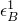 
,  
, 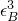 
等等。
```

数据行数量没有限制，但必须按一定顺序给出数据，如下所述。

许多选项需要多行数据；这些由数据行标题"第一行："、"第二行："等表示。例如，定义壳单元的局部方向必须使用恰好两行数据（[*ORIENTATION](../key/key-link.md#usb-kws-morientation)），而定义各向异性弹性需要至少三行数据（[*ELASTIC](../key/key-link.md#usb-kws-melastic)）。

在许多情况下，数据行可以重复，这会在数据行后注明。与单数据行的重复一样，必须按正确顺序给出数据行集，以便Abaqus能够正确插值数据。

##### 示例：因场变量依赖而需要的多行数据

每当选项可以定义为场变量的函数时，您必须确定完全定义该选项所需的数据行数。（有关更多信息，请参阅["材料数据定义"中的"指定场变量依赖性"，第21.1.2节"](pt05ch21s01aus109.md#usb-mat-cmaterialdata-fvdepen)。）例如，如果基于应力的失效准则（[*FAIL STRESS](../key/key-link.md#usb-kws-mefailstress)）定义为两个场变量的函数，则需要两行数据。这对数据行根据需要重复，以完全定义失效准则：

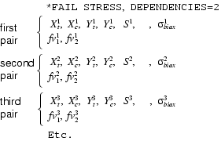

（在此示例中，每对的第一数据行的最后一个字段被省略，这意味着基于应力的失效准则不依赖于温度。）

如果基于应力的失效准则定义为九个场变量的函数，则根据需要重复三行数据：


##### 数据行排序

每当一个变量定义为另一个变量的函数时，必须按正确顺序给出数据，以便Abaqus能够正确地为中间值插值。定义的变量假定在给定自变量范围之外为常量，但涉及损伤的非线性弹性垫片厚度行为除外，在该行为中，数据根据用户指定的数据计算的最后一个斜率进行外推。

如果定义的属性只是一个变量的函数（如上面所示的[*BIAXIAL TEST DATA](../key/key-link.md#usb-kws-mbitestdata)），则应按自变量递增值的顺序给出数据。

如果定义的属性是多个自变量的函数，则必须首先给出属性随第一个变量变化的规律，固定其他变量的值，然后按第二个变量的升序，再按第三个变量的升序，依此类推。数据行必须始终按自变量递增值的顺序排序。此过程确保属性在属性所依赖的任何自变量值下被完整且唯一地定义。

例如，考虑定义为三个场变量（但不包括温度）函数的各向同性弹性：

```
[*ELASTIC](../key/key-link.md#usb-kws-melastic), DEPENDENCIES=3
 , ,  , 1, 1, 1
 , ,  , 2, 1, 1
 , ,  , 1, 2, 1
 , ,  , 2, 2, 1
 , ,  , 1, 3, 1
 , ,  , 2, 3, 1
 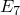, ,  , 1, 1, 2
 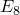, 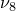,  , 2, 1, 2
 , 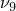,  , 1, 2, 2
 , , , 2, 2, 2
 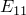, 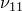, , 1, 3, 2
 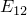, , , 2, 3, 2
 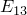, , , 1, 1, 3
 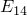, 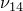, , 2, 1, 3
 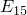, , , 1, 2, 3
 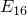, 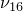, , 2, 2, 3
 , 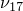, , 1, 3, 3
 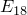, 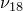, , 2, 3, 3
```
