# 1.2.2 约定


**产品：** Abaqus/Standard  Abaqus/Explicit  Abaqus/CFD  Abaqus/CAE  

##### **参考**

- [第2章，"空间建模"](pt01ch02.md)
- [第二部分，"输出"](pt02.md)
- ["Abaqus/Standard和Abaqus/Explicit中的边界条件"，第34.3.1节"](pt07ch34s03aus118.md)
- ["Abaqus/CFD中的边界条件"，第34.3.2节"](pt07ch34s03aus119.md)

### 概述

本节定义了Abaqus中使用的约定。讨论的主题包括：
- 自由度
- 坐标系
- 自洽单位
- 时间度量
- 空间曲面上的局部方向
- 应力和应变约定
- 几何非线性分析中的应力和应变度量
- 有限旋转约定
- 表格数据输入约定

### 自由度

除轴对称单元、流体连续体单元和电磁单元外，自由度始终按如下方式引用：

| 1 | *x*方向位移 |
| --- | --- |
| 2 | *y*方向位移 |
| 3 | *z*方向位移 |
| 4 | 绕*x*轴的旋转，弧度 |
| 5 | 绕*y*轴的旋转，弧度 |
| 6 | 绕*z*轴的旋转，弧度 |
| 7 | 翘曲幅值（用于开口截面梁单元） |
| 8 | 孔隙压力、静水压力或声压 |
| 9 | 电势 |
| 10 | 连接器材料流动（长度单位） |
| 11 | 温度（或质量扩散分析中的归一化浓度） |
| 12 | 第二个温度（用于壳或梁） |
| 13 | 第三个温度（用于壳或梁） |
| 14 | 等等 |

其中*x*-、*y*-和*z*-方向分别与全局*X*-、*Y*-和*Z*-方向重合；但是，如果在节点上定义了局部变换（参见["变换坐标系"，第2.1.5节"](pt01ch02s01aus09.md)），则它们与变换定义的局部方向重合。

在Abaqus/Standard中，壳单元或梁单元最多可定义20个温度值（自由度11至30）。

#### 轴对称单元

轴对称单元中的位移和旋转自由度按如下方式引用：

| 1 | *r*方向位移 |
| --- | --- |
| 2 | *z*方向位移 |
| 5 | 绕*z*轴的旋转（用于带扭转的轴对称单元），弧度 |
| 6 | *r*-*z*平面内的旋转（用于轴对称壳），弧度 |

其中*r*-和*z*-方向分别与全局*X*-和*Y*-方向重合；但是，如果在节点上定义了局部变换（参见["变换坐标系"，第2.1.5节"](pt01ch02s01aus09.md)），则它们与变换定义的局部方向重合。

#### 流体连续体单元

Abaqus/CFD中的流体连续体单元用于定义单元形状和对连续体进行离散。流体流动分析中的自由度不是由单元类型决定的，而是由分析过程和指定的选项决定的（例如，湍流模型和辅助输运方程）。

#### 电磁单元

Abaqus/Standard中的电磁单元用于定义单元形状和对连续体进行离散。涡流和静磁分析公式使用磁矢势作为自由度（参见["涡流分析"中的"边界条件"，第6.7.5节"](pt03ch06s07at24.md#usb-anl-aeddycurrent-bc)和["静磁分析"中的"边界条件"，第6.7.6节"](pt03ch06s07at25.md#usb-anl-amagnetostatic-bc)）。

#### 自由度激活

Abaqus/Standard和Abaqus/Explicit仅激活节点所需的那些自由度。因此，上述某些自由度可能在模型中的所有节点上都不使用，因为每种单元类型仅使用与其相关的自由度。例如，二维实体（连续体）应力/位移单元仅使用自由度1和2。在任何节点上实际使用的自由度是共享该节点的每个单元所需自由度的包络。

在Abaqus/CFD中，流体流动分析中的活动自由度由分析过程和指定的选项决定。例如，将能量方程与不可压缩流动过程结合使用会激活速度、压力和温度自由度。有关更多信息，请参见["Abaqus/CFD中的边界条件"中的"活动自由度"，第34.3.2节"](pt07ch34s03aus119.md#usb-prc-pboundarycfd-dofs)。

#### Abaqus/Standard中的内部变量

除了上面列出的自由度外，Abaqus/Standard还使用内部变量（如用于施加约束的拉格朗日乘子）用于某些单元。通常您不必关心这些变量，但它们可能出现在错误和警告消息中，并在迭代期间检查非线性约束的满足情况。内部变量始终与内部节点相关联，内部节点使用负数来区分用户定义的节点。

### 坐标系

Abaqus中的基本坐标系是右手直角笛卡尔坐标系。您可以为输入（参见["节点定义"，第2.1.1节"](pt01ch02s01aus05.md)）、节点变量（位移、速度等）的输出以及点载荷或边界条件规范（参见["变换坐标系"，第2.1.5节"](pt01ch02s01aus09.md)）以及材料或运动关节规范（参见["方向"，第2.2.5节"](pt01ch02s02aus15.md)）在本地选择其他坐标系。所有坐标系必须是右手系。

### 单位

除旋转和角度度量外，Abaqus没有内置单位。因此，所选单位必须是自洽的，这意味着所选系统的导出单位可以用基本单位表示，无需转换因子。

#### 旋转和角度度量

在Abaqus中，旋转自由度以弧度表示，所有其他角度度量以度表示（例如，相位角）。

#### 国际单位制（SI）

国际单位制（SI）是自洽单位集的一个例子。SI系统的基本单位是长度（米，m）、质量（千克，kg）、时间（秒，s）、温度（开尔文，K）和电流（安培，A）。二次或导出量的单位基于这些基本单位。导出单位的一个例子是力的单位。SI系统中力的单位称为牛顿（N）：

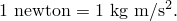

同样，SI系统中电荷的单位称为库仑（C）：


另一个例子是能量单位，称为焦耳（J）：


SI系统中的电势单位是伏特，其选择使得


有时标准单位使用起来不方便。例如，杨氏模量通常以兆帕（MPa）（或等效地，N/mm2）为单位给出，其中1帕斯卡=1 N/m2。在这种情况下，基本单位可以是吨（1吨=1000千克）、毫米和秒。

#### 美国或英制单位

美国或英制单位可能会造成混淆，因为命名约定不如SI系统清晰。例如，1磅力（lbf）将使1磅质量（lbm）获得*g* ft/sec2的加速度，其中*g*是重力加速度的值。如果将磅力、英尺（ft）和秒作为基本单位，则质量的导出单位是lbf sec2/ft。由于密度在手册中通常以lbm/in3给出，必须通过


转换为lbf sec2/ft4。

手册中经常没有明确说明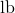是代表lbm还是lbf。您需要检查所用值是否构成一致的单位集。

另外两个造成困难的单位是slug（定义为在1 lbf作用下加速1 ft/sec2的质量）和poundal（定义为使1 lbm加速1 ft/sec2所需的力）。有用的转换是


和

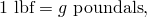

其中*g*是ft/sec2单位下重力加速度的大小。

#### Abaqus中使用的单位符号

单位按如下方式指示载荷和通量类型的值：

| 维度 | 指示符 | 示例（SI单位） |
| --- | --- | --- |
| 长度 | L | 米 |
| 质量 | M | 千克 |
| 时间 | T | 秒 |
| 温度 |  | 摄氏度 |
| 电流 | A | 安培 |
| 力 | F | 牛顿 |
| 能量 | J | 焦耳 |
| 电荷 | C | 库仑 |
| 电势 |  | 伏特 |
| 质量浓度 | P | 百万分之一 |

### 时间

Abaqus有两种时间度量——步长时间和总时间。除某些线性扰动过程外，步长时间从每个步开始测量。总时间从零开始，是所有一般分析步骤（包括重启步骤；参见["重新启动分析"，第9.1.1节"](pt04ch09s01aus53.md)）的总累积时间。总时间在线性扰动步骤期间不累积。

### 空间曲面上的局部切线方向

空间曲面上需要局部切线方向；例如，为了提供描述基于单元的接触表面上的滑移分量或壳中应力和应变分量的约定。Abaqus对此类方向使用的约定如下。

默认的局部1方向是全局*x*轴在曲面上的投影。如果全局*x*轴在0.1以内垂直于曲面，则局部1方向是全局*z*轴在曲面上的投影。局部2方向则与局部1方向成直角，使得局部1方向、局部2方向和曲面的正法线方向构成右手系（参见[图1.2.2-1](pt01ch01s02aus02.md#iconventions-local-surfaces)）。正法线方向在单元中由绕单元节点旋转的右手旋转规则定义。局部表面方向可以重新定义；参见["方向"，第2.2.5节"](pt01ch02s02aus15.md)。

**图1.2.2-1** 默认局部表面方向。

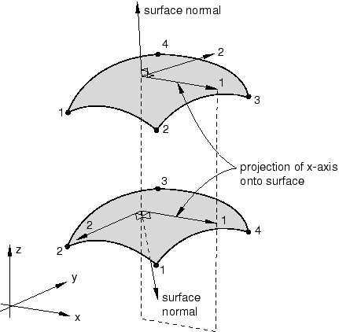

当考虑垫片单元或与积分输出截面（["积分输出截面定义"，第2.5.1节"](pt01ch02s05aus23.md)）或用户定义截面（["输出到数据和结果文件"中的"Abaqus/Standard截面输出"，第4.1.2节"](pt02ch04s01aus39.md#usb-out-oprintfile-section)）相关的局部系统时，局部1和2方向分别变为局部2和3方向。

对于在空间梁、管或桁架单元上定义的"线"型曲面，默认的局部1方向和2方向分别与单元相切和横向。在这种情况下，局部表面方向也可以像["方向"，第2.2.5节"](pt01ch02s02aus15.md)中描述的那样重新定义。

#### 局部方向的旋转

对于几何线性分析，应力和应变分量默认在参考（初始）配置中的材料方向给出。

对于几何非线性分析，Abaqus/Standard中的小应变壳单元（S4R5、S8R、S8R5、S8RT、S9R5、STRI3和STRI65）使用总拉格朗日应变，应力和应变分量相对于参考配置中的材料方向给出。垫片单元是小应变小位移单元，分量默认在参考配置中的行为方向输出。

对于有限膜应变单元（所有膜单元、S3/S3R、S4、S4R、SAX和SAXA单元）以及Abaqus/Explicit中的小应变壳单元，材料方向随曲面的平均刚体运动旋转，形成当前配置中的材料方向。这些单元中的应力和应变分量相对于当前配置中的这些材料方向给出。

有关膜单元、S3/S3R、S4和S4R单元、S3RS、S4RS和S4RSW单元以及SAXA单元中旋转坐标方向定义的更详细讨论，请参见：
- [Abaqus理论指南中的"膜单元"，第3.4.1节](../stm/stm-link.md#stm-elm-membranes)，
- [Abaqus理论指南中的"有限应变壳单元公式"，第3.6.5节](../stm/stm-link.md#stm-elm-finitestrainshells)，
- [Abaqus理论指南中的"Abaqus/Explicit中的小应变壳单元"，第3.6.6节](../stm/stm-link.md#stm-elm-smallstrainshells)，以及
- [Abaqus理论指南中的"允许非对称加载的轴对称壳单元"，第3.6.7节](../stm/stm-link.md#stm-elm-axiasymmshells)。

您可以确定与用户定义截面相关的局部系统是固定的还是随平均刚体运动旋转的；详情请参见["输出到数据和结果文件"中的"Abaqus/Standard截面输出"，第4.1.2节"](pt02ch04s01aus39.md#usb-out-oprintfile-section)。

您可以确定与积分输出截面相关的局部系统是固定的、平移随平均刚体运动，还是随平均刚体运动平移和旋转；详情请参见["积分输出截面定义"，第2.5.1节"](pt01ch02s05aus23.md)。

有关Abaqus/Standard接触分析期间局部切线方向如何演化的信息，请参见["Abaqus/Standard中的接触公式"，第38.1.1节"](pt09ch38s01aus177.md)。

### 应力和应变分量使用的约定

在定义材料属性时，Abaqus中使用的应力和应变分量约定是按以下顺序排列的：

|  | 1方向的正应力 |
| --- | --- |
|  | 2方向的正应力 |
|  | 3方向的正应力 |
| 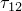 | 1-2平面内的剪应力 |
| 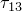 | 1-3平面内的剪应力 |
|  | 2-3平面内的剪应力 |

例如，完全各向异性的线性弹性矩阵是


1、2和3方向取决于所选的单元类型。对于实体单元，这些方向的默认值是全局空间方向。对于壳单元和膜单元，1和2方向的默认值是壳或膜曲面中的局部方向，如[第六部分，"单元"](pt06.md)中所定义。在两种情况下，1、2和3方向都可以像["方向"，第2.2.5节"](pt01ch02s02aus15.md)中描述的那样更改。

对于实体单元的几何非线性分析，默认的（全局）方向不随材料旋转。但是，用户定义的方向确实随材料旋转。

Abaqus/Explicit以内部不同的顺序存储应力和应变分量：、、、、、。对于几何非线性分析，内部存储的分量随材料旋转，无论是否使用用户定义的方向。当使用用户子程序（如[`VUMAT`](../sub/sub-link.md#sub-xsl-vumat)）时，这种区别很重要。

#### 各向异性材料行为

当在连续体单元中定义各向异性材料行为时，用户定义的方向对于将各向异性行为与材料方向相关联是必要的。有关材料方向如何旋转的描述，请参见[Abaqus理论指南中的"状态存储"，第1.5.4节](../stm/stm-link.md#stm-int-statestorage)。

#### 零值应力分量

始终为零的应力分量从存储中省略。例如，在平面应力中，Abaqus仅存储应力值非零的平面中的两个正应力分量和一个剪应力分量。

#### 剪应变

Abaqus始终以工程剪应变报告剪应变，：


### 应力和应变度量

Abaqus使用的应力度量是柯西或"真"应力，对应于当前面积上的力。有关应力度量的更多详细信息，请参见[Abaqus理论指南中的"应力度量"，第1.5.2节](../stm/stm-link.md#stm-int-stressmeas)和["应力率"，第1.5.3节](../stm/stm-link.md#stm-int-stressrates)。

对于几何非线性分析，存在许多不同的应变度量。与"真"应力不同，没有明确的首选"真"应变。对于相同的物理变形，不同的应变度量在大应变分析中会报告不同的值。应变度量的最佳选择取决于分析类型、材料行为以及（在某种程度上）个人偏好。有关应变度量的更多详细信息，请参见[Abaqus理论指南中的"应变度量"，第1.4.2节](../stm/stm-link.md#stm-int-strainmeas)。

默认情况下，Abaqus/Standard中的应变输出是"积分"总应变（输出变量E）。对于Abaqus/Standard中的大应变壳、膜和实体单元，可以请求另外两种总应变度量：对数应变（输出变量LE）和名义应变（输出变量NE）。

对数应变（输出变量LE）是Abaqus/Explicit中的默认应变输出；也可以请求名义应变（输出变量NE）。"积分"总应变在Abaqus/Explicit中不可用。

#### 总（积分）应变

Abaqus/Standard输出到数据（`.dat`）和结果（`.fil`）文件的所有能处理有限应变的单元的默认"积分"应变度量E，通过在材料参考框架中数值积分应变率获得：

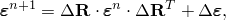

其中和分别是增量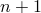和*n*时的总应变；是增量旋转张量；是从增量*n*到的总应变增量。对于使用共旋坐标系的单元（有限应变壳、膜和具有用户定义方向的实体单元），上述方程简化为

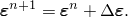

应变增量通过对时间增量内的变形率积分获得：

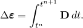

这种应变度量适用于弹性（粘塑性）或弹性蠕变材料，因为塑性应变和蠕变应变通过相同的积分程序获得。在这些材料中，弹性应变很小（因为屈服应力与弹性模量相比很小），总应变可以直接与塑性应变和蠕变应变进行比较。

如果应变的主方向相对于材料轴旋转，则所得应变度量不能与总变形相关，无论使用空间坐标系还是共旋坐标系。如果主方向相对于材料轴保持固定，则应变是变形率的积分，


它等价于后面讨论的对数应变。

#### 格林应变

对于Abaqus/Standard中的小应变壳和梁，默认应变度量E是格林应变：


其中是变形梯度，是单位张量。这种应变度量适用于这些单元使用的小应变、大旋转近似。的分量表示原始配置中沿方向的应变。小应变壳和梁不应与弹塑性或超弹性材料行为一起用于有限应变分析，因为可能会获得不正确的分析结果或发生程序故障。

#### 名义应变

名义应变NE是

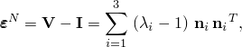

其中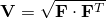是左拉伸张量，是主拉伸，是当前配置中的主拉伸方向。因此，名义应变的主值是主方向上长度变化与参考配置中长度之比，从而直接度量变形。

#### 对数应变

对数应变LE是


其中变量的定义与前面名义应变的定义相同。这也是超弹性材料的应变输出。对于超粘弹性材料，对数弹性应变EE从当前（松弛）应力状态计算，粘弹性应变CE计算为LE EE。

### 应力不变量

Abaqus中的许多本构模型是用应力不变量表示的。这些不变量定义为等效压力应力，


米塞斯等效应力，


和偏应力第三不变量，

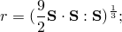

其中是偏应力，定义为


### 有限旋转

空间有限旋转使用以下约定：定义、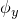、为绕全局*X*、*Y*和*Z*轴的"旋转"（即节点上的自由度4、5和6）。然后定义


其中


方向是旋转轴，是绕旋转轴的角旋转（弧度），遵循右手定则（参见[图1.2.2-2](pt01ch01s02aus02.md#iconvention-finite-rot)）。

**图1.2.2-2** 有限旋转的定义。


的值不是唯一确定的。在整体旋转超过的大旋转问题中，可以加上或减去的任意倍数，这可能导致旋转分量的输出值不连续。如果在Abaqus/Standard中沿正（负）方向在一个轴上发生大于的旋转，旋转输出在*0*和（）之间不连续变化。在Abaqus/Explicit中，旋转输出在所有情况下都在和之间变化。

这个约定在大多数情况下提供了运动边界条件和力矩的直接输入，以及简单的输出解释。Abaqus输出的旋转表示从参考配置到当前配置绕固定轴的单个旋转。输出不跟踪节点处的旋转历史。此外，这个约定简化为小旋转的通常约定，即使是在初始有限旋转上叠加小旋转的情况下（例如，在研究预变形状态附近的小振动时）。

#### 复合旋转

因为有限旋转不可加，所以指定它们的方式与其他边界条件的指定方式有些不同：在步骤上指定的旋转增量必须是将节点从步骤开始时的配置旋转到步骤结束时的所需配置所需的旋转。仅将节点在此步骤上旋转到总旋转向量（如果应用于具有其他初始参考配置的节点，本会使节点进入最终配置）是不够的。如果需要旋转增量才能从步骤开始时（以及前一步结束时）的旋转边界条件旋转到步骤结束时的最终位置，则必须指定边界条件，使得旋转向量在步骤结束时为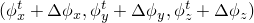。如果旋转向量的方向是恒定的，则指定旋转边界条件和总旋转向量的方法是相同的。

##### 示例

作为如何指定复合有限旋转和解释有限旋转输出的示例，考虑梁旋转的以下示例。

梁最初沿*x*轴。我们希望执行复合旋转，其中（第1步）梁绕*z*轴旋转60度，然后（第2步）梁绕自身旋转90度，然后（第3步）梁绕*x-y*平面中垂直于梁的轴旋转90度，使得梁最终位于*z*轴上。

此复合旋转通过三个步骤实现，施加的旋转向量为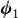、和，其中

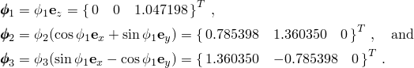

在此示例中，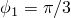、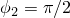和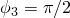。这里表示每个有限旋转关于（单位长度）旋转轴的大小。上述旋转向量在三个步骤中的每一步中应用于该步骤开始时的配置。最直接的方式是使用速度型边界条件来规定这些旋转。为方便起见，Abaqus中速度型边界条件的默认幅值参考是常数1。

此示例的一个典型Abaqus步骤定义，其中节点1固定在原点，旋转应用于节点2，如下所示：

```
[*STEP](../key/key-link.md#usb-kws-hstep), NLGEOM
步骤1：绕z轴旋转60度 
[*STATIC](../key/key-link.md#usb-kws-hstatic)
[*BOUNDARY](../key/key-link.md#usb-kws-hboundary), TYPE=VELOCITY
 2, 4, 5 
 2, 6, 6, 1.047198 
[*END STEP](../key/key-link.md#usb-kws-hendstep)
** 
[*STEP](../key/key-link.md#usb-kws-hstep), NLGEOM
步骤2：绕梁轴旋转90度 
[*STATIC](../key/key-link.md#usb-kws-hstatic)
[*BOUNDARY](../key/key-link.md#usb-kws-hboundary), TYPE=VELOCITY
 2, 4, 4, 0.785398 
 2, 5, 5, 1.36035 
 2, 6, 6 
[*END STEP](../key/key-link.md#usb-kws-hendstep)
** 
[*STEP](../key/key-link.md#usb-kws-hstep), NLGEOM
步骤3：将梁旋转到z轴 
[*STATIC](../key/key-link.md#usb-kws-hstatic)
[*BOUNDARY](../key/key-link.md#usb-kws-hboundary), TYPE=VELOCITY
 2, 4, 4, 1.36035 
 2, 5, 5, -0.785398 
 2, 6, 6 
[*END STEP](../key/key-link.md#usb-kws-hendstep)
```

强烈建议使用上述方法施加有限旋转边界条件（使用具有默认常数幅值定义的速度型边界条件）。但是，如果旋转边界条件作为位移型边界条件施加，输入语法将更改。

Abaqus/Standard中步骤内边界条件规范的约定是指定总或最终边界状态。在这种情况下，必须将所有先前步骤中指定的边界条件添加到增量旋转向量分量中。上述Abaqus/Standard步骤定义将更改为：

```
[*STEP](../key/key-link.md#usb-kws-hstep), NLGEOM 
步骤1：绕z轴旋转60度 
[*STATIC](../key/key-link.md#usb-kws-hstatic)
[*BOUNDARY](../key/key-link.md#usb-kws-hboundary)
 2, 4, 5 
 2, 6, 6, 1.047198 
[*END STEP](../key/key-link.md#usb-kws-hendstep)
** 
[*STEP](../key/key-link.md#usb-kws-hstep), NLGEOM
步骤2：绕梁轴旋转90度 
[*STATIC](../key/key-link.md#usb-kws-hstatic)
[*BOUNDARY](../key/key-link.md#usb-kws-hboundary)
 2, 4, 4, 0.785398 
 2, 5, 5, 1.36035 
 2, 6, 6, 1.047198 
[*END STEP](../key/key-link.md#usb-kws-hendstep)
** 
[*STEP](../key/key-link.md#usb-kws-hstep), NLGEOM
步骤3：将梁旋转到z轴 
[*STATIC](../key/key-link.md#usb-kws-hstatic)
[*BOUNDARY](../key/key-link.md#usb-kws-hboundary)
 2, 4, 4, 2.145748 
 2, 5, 5, 0.574952 
 2, 6, 6, 1.047198 
[*END STEP](../key/key-link.md#usb-kws-hendstep)
```

步骤2和3中的边界条件是增量旋转分量与先前步骤中指定的旋转边界条件之和。

在Abaqus/Explicit中，应使用幅值定义，以避免步骤之间的位移跳跃。通常，使用以总时间表示的幅值定义会很方便。位移边界条件将根据时间增量内幅值曲线的增量值逐步施加。因此，在步骤开始时引入的位移的任何突然跳跃（无论是否有幅值曲线或有两个幅值曲线）都将被忽略（参见["Abaqus/Standard和Abaqus/Explicit中的边界条件"，第34.3.1节"](pt07ch34s03aus118.md)）。上述示例的Abaqus/Explicit步骤定义将更改为：

```
[*AMPLITUDE](../key/key-link.md#usb-kws-mamplitude), TIME=TOTAL TIME, NAME=RAMPUR1
 0., 0., 0.001, 0., 0.002, 0.785398, 0.003, 2.145748
[*AMPLITUDE](../key/key-link.md#usb-kws-mamplitude), TIME=TOTAL TIME, NAME=RAMPUR2
 0., 0., 0.001, 0., 0.002, 1.36035, 0.003, 0.574952
[*AMPLITUDE](../key/key-link.md#usb-kws-mamplitude), TIME=TOTAL TIME, NAME=RAMPUR3
 0., 0., 0.001, 1.047198, 0.002, 1.047198, 0.003, 1.047198
[*STEP](../key/key-link.md#usb-kws-hstep)
步骤1：绕z轴旋转60度
[*DYNAMIC](../key/key-link.md#usb-kws-hdynamic), EXPLICIT
 , 0.001
[*BOUNDARY](../key/key-link.md#usb-kws-hboundary), AMP=RAMPUR1
 2, 4, 4, 1.0
[*BOUNDARY](../key/key-link.md#usb-kws-hboundary), AMP=RAMPUR2
 2, 5, 5, 1.0
[*BOUNDARY](../key/key-link.md#usb-kws-hboundary), AMP=RAMPUR3
 2, 6, 6, 1.0
[*END STEP](../key/key-link.md#usb-kws-hendstep)
**
[*STEP](../key/key-link.md#usb-kws-hstep)
步骤2：绕梁轴旋转90度
[*DYNAMIC](../key/key-link.md#usb-kws-hdynamic), EXPLICIT
 , 0.001
[*END STEP](../key/key-link.md#usb-kws-hendstep)
**
[*STEP](../key/key-link.md#usb-kws-hstep)
步骤3：将梁旋转到z轴
[*DYNAMIC](../key/key-link.md#usb-kws-hdynamic), EXPLICIT
 , 0.001
[*END STEP](../key/key-link.md#usb-kws-hendstep)
```

步骤2和3中的边界条件是增量旋转分量与先前步骤中指定的旋转边界条件之和。

Abaqus在步骤3结束时的旋转场输出为


我们看到，指定边界条件的各个分量都没有出现在最终旋转输出中。最终旋转输出表示在单个步骤中获得最终方向所需的旋转向量。

假设在上述示例的步骤3中，我们希望在节点1而非节点2上施加旋转向量。如果旋转是逐步施加的，Abaqus/Standard步骤定义如下：

```
[*STEP](../key/key-link.md#usb-kws-hstep), NLGEOM 
步骤3：将梁旋转到z轴 
[*STATIC](../key/key-link.md#usb-kws-hstatic)
[*BOUNDARY](../key/key-link.md#usb-kws-hboundary), TYPE=VELOCITY, OP=NEW
 1, 1, 3 
 1, 4, 4, 1.36035 
 1, 5, 5, -0.785398 
 1, 6, 6 
[*END STEP](../key/key-link.md#usb-kws-hendstep)
```

Abaqus/Explicit步骤定义类似。有必要移除在节点2上生效的旋转边界条件。

如前所述，使用速度型边界条件是施加有限旋转边界条件的首选方法。如果旋转边界条件要作为位移型边界条件施加，我们必须首先获取步骤2结束时节点1处的旋转场。该旋转场的Abaqus输出为

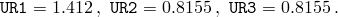

然后必须将这些旋转向量分量添加到我们希望在步骤3中规定的增量旋转向量分量中。Abaqus/Standard步骤定义将更改为
```
[*STEP](../key/key-link.md#usb-kws-hstep)
步骤3：将梁旋转到z轴 
[*STATIC](../key/key-link.md#usb-kws-hstatic)
[*BOUNDARY](../key/key-link.md#usb-kws-hboundary), OP=NEW
 1, 1, 3 
 1, 4, 4, 2.772 
 1, 5, 5, 0.0301 
 1, 6, 6, 0.8155 
[*END STEP](../key/key-link.md#usb-kws-hendstep)
```

Abaqus/Explicit步骤定义将更改为：
```
[*STEP](../key/key-link.md#usb-kws-hstep)
步骤3：将梁旋转到z轴
[*DYNAMIC](../key/key-link.md#usb-kws-hdynamic), EXPLICIT
 , 0.001
[*AMPLITUDE](../key/key-link.md#usb-kws-mamplitude), TIME=STEP TIME, NAME=NODE1UR1
 0., 1.412, 0.001, 2.772
[*AMPLITUDE](../key/key-link.md#usb-kws-mamplitude), TIME=STEP TIME, NAME=NODE1UR2
 0., 0.8155, 0.001, 0.0301
[*AMPLITUDE](../key/key-link.md#usb-kws-mamplitude), TIME=STEP TIME, NAME=NODE1UR3
 0., 0.8155, 0.001, 0.8155
[*BOUNDARY](../key/key-link.md#usb-kws-hboundary), OP=NEW
 1, 1, 3
[*BOUNDARY](../key/key-link.md#usb-kws-hboundary), OP=NEW, AMP=NODE1UR1
 1, 4, 4, 1.
[*BOUNDARY](../key/key-link.md#usb-kws-hboundary), OP=NEW, AMP=NODE1UR2
 1, 5, 5, 1.
[*BOUNDARY](../key/key-link.md#usb-kws-hboundary), OP=NEW, AMP=NODE1UR3
 1, 6, 6, 1.
[*END STEP](../key/key-link.md#usb-kws-hendstep)
```

边界条件再次在Abaqus/Explicit输入中使用幅值曲线指定，以避免在步骤开始时其值发生任何突然跳跃。如上所述以及在["Abaqus/Standard和Abaqus/Explicit中的边界条件"，第34.3.1节"](pt07ch34s03aus118.md)中所述，位移值的任何跳跃都将被忽略，边界将保持在先前的值。

正如这最后一个过程清楚表明的那样，将有限旋转边界条件作为速度型边界条件施加比作为位移型边界条件施加更简单。指定有限旋转边界条件的推荐方法也在["Abaqus/Standard和Abaqus/Explicit中的边界条件"，第34.3.1节"](pt07ch34s03aus118.md)中描述。有关有限旋转如何累积的进一步讨论，请参见[Abaqus理论指南中的"旋转变量"，第1.3.1节](../stm/stm-link.md#stm-int-rotationvars)。
