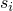
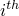

# 2.1.2 参数化形状变化


**产品：** Abaqus/Standard  Abaqus/Explicit  

##### **参考**

- ["参数化输入"，第1.4.1节"](pt01ch01s04aus04.md)
- [*PARAMETER SHAPE VARIATION*](../key/key-link.md#usb-kws-mparametershape)

### 概述

形状参数化可以通过以下方式在Abaqus输入文件中实现：
- 参数化节点坐标；或
- 使用形状变化将节点坐标与形状参数关联。

本节描述形状参数化的不同方法。

### 节点坐标的参数化

任何单个节点坐标都可以直接参数化。这通常价值有限，因为它经常导致形状不规则的设计，难以制造。此外，单独节点坐标的参数化通常需要过多的参数来定义参数化形状。

结合Abaqus中的节点生成使用节点坐标的参数化提供了更实用的形状参数化方法。然而，这种方法在实践中仍然有些有限，因为Abaqus中可用的简单节点生成功能无法描述复杂形状。

#### 直接参数化单独节点坐标

节点坐标参数化的最简单形式是定义单独参数，并在要参数化的节点坐标处使用它们，如["参数化输入"，第1.4.1节"](pt01ch01s04aus04.md)中所述。例如，

```
[*PARAMETER*](../key/key-link.md#usb-kws-mparameter)
x_coord_node_1 = 10.
y_coord_node_1 = 20.
[*NODE*](../key/key-link.md#usb-kws-mnode)
1, <x_coord_node_1>, <y_coord_node_1>
```

#### 使用节点生成进行节点坐标的参数化

形状参数化可以通过参数化某些节点的坐标，然后使用这些节点生成其他节点及其坐标来实现。例如：

```
[*PARAMETER*](../key/key-link.md#usb-kws-mparameter)
x_coord_node_1 = 10.
x_coord_node_11 = 20.
[*NODE*](../key/key-link.md#usb-kws-mnode)
1, <x_coord_node_1>, 50.
11, <x_coord_node_11>, 50.
[*NGEN*](../key/key-link.md#usb-kws-mngen)
1, 11, 1
```

这种形状参数化方法通过隐式地使生成节点的节点坐标依赖于形状参数，减少了形状参数化所需的用户定义参数数量。

### 通过形状变化的线性组合进行形状变化

Abaqus中的形状定义包括基本形状加上使用线性组合添加到基本形状的任意数量的附加形状变化。在数学上，我们可以将节点坐标表示为


其中是基本形状，是形状变化，是形状参数的值。此计算始终在全局直角笛卡尔坐标系中进行。虽然不一定是这样，但通常情况下，定义形状变化的输入就是基本形状相对于相应形状参数的梯度。

您可以通过直接提供或通过节点生成提供节点定义来在Abaqus输入文件中指定模型的基本形状；参见["节点定义"，第2.1.1节"](pt01ch02s01aus05.md)。

您可以指定形状变化和相关形状参数，如本文所述。

此外，您可以指定形状的扰动作为其他形状（例如屈曲模态形状）的线性组合；参见["向模型引入几何缺陷"，第11.3.1节"](pt04ch11s03aus67.md)。

然后可以使用四种类型方法的组合来定义Abaqus输入文件中模型的节点坐标：
- 您可以直接定义单独节点及其各自坐标；这些坐标是基本形状定义的一部分，可以参数化。
- 节点生成可用于根据依赖于现有节点定义的几何简单映射创建节点及其坐标；这些生成的坐标也是基本形状定义的一部分。如有必要，节点生成输入可以参数化。
- 参数形状变化可用于改变使用上述方法定义的节点的坐标。
- 几何缺陷可用于扰动先前使用上述三种方法的任意组合定义的节点坐标。

### 使用形状变化进行形状参数化

您可以指定形状变化而不是直接参数化节点坐标。每个形状变化必须与单个形状参数关联。与形状变化关联的参数的名称必须选择为在以不区分大小写的方式解释时保持唯一。形状参数的值使用参数定义分配。

同一个参数可以多次定义参数形状变化，以便可以分别指定形状变化的不同部分。在这种情况下，如果在同一节点在多个参数形状变化定义中被指定，则该节点的最后一个定义优先。

在参数形状变化定义中指定的节点（如果该节点也未直接定义或通过节点生成定义）将被忽略。

您可以使用三种可能性的组合来指定形状变化：直接指定、从备用输入文件读取，以及从辅助分析的结果文件读取。这些方法在以下小节中描述。

#### 直接定义形状变化或从备用输入文件读取

您可以通过指定节点号和相应坐标分量变化来直接定义形状变化数据。或者，数据可以在ASCII文件中给出。

| **输入文件用法：** | 使用以下选项直接指定形状变化数据： |
| --- | --- |
|  | ``` [*PARAMETER SHAPE VARIATION*](../key/key-link.md#usb-kws-mparametershape), PARAMETER=*name* ``` 使用以下选项在备用输入文件中指定形状变化数据： ``` [*PARAMETER SHAPE VARIATION*](../key/key-link.md#usb-kws-mparametershape), PARAMETER=*name*, INPUT=*input file* ``` |

##### 在替代坐标系中定义形状变化

默认情况下，形状变化数据在全局直角笛卡尔坐标系中解释。您可以在圆柱或球坐标系中指定形状变化数据（直接指定或在备用输入文件中）。在这种情况下，形状变化的计算如下。定义基本形状的节点坐标分量首先从存储它们的全局直角笛卡尔坐标系变换到指定坐标系。然后将形状变化坐标分量相加以给出更新的坐标分量，再变换回全局直角笛卡尔坐标系。最后，形状变化被取为更新坐标分量与原始坐标分量之间的差值，使用以全局直角笛卡尔坐标系表示的分量。与形状变化关联的形状参数的值在任何情况下都不用于形状变化的计算。

| **输入文件用法：** | 使用以下选项在直角坐标系中指定形状变化数据（默认）： |
| --- | --- |
|  | ``` [*PARAMETER SHAPE VARIATION*](../key/key-link.md#usb-kws-mparametershape), PARAMETER=*name*, SYSTEM=R ``` 使用以下选项在圆柱坐标系中指定形状变化数据： ``` [*PARAMETER SHAPE VARIATION*](../key/key-link.md#usb-kws-mparametershape), PARAMETER=*name*, SYSTEM=C ``` 使用以下选项在球坐标系中指定形状变化数据： ``` [*PARAMETER SHAPE VARIATION*](../key/key-link.md#usb-kws-mparametershape), PARAMETER=*name*, SYSTEM=S ``` |

#### 使用辅助分析生成形状变化

辅助模型是用于为主模型生成形状变化的附加有限元模型。辅助模型可用于简化此过程，而不是逐节点地直接定义形状变化。辅助分析是这些辅助模型的有限元分析。

辅助模型通常与主模型具有相同的几何形状、单元连通性和材料类型。但是，边界条件通常不同。对辅助模型施加载荷会产生位移集，我们可以将其解释为形状变化。例如，我们可能有兴趣研究结构对结构缺陷的非线性屈曲行为的敏感性。在这种情况下，我们可以执行辅助特征值线性屈曲分析，然后使用得到的模态形状作为形状变化添加到主模型的基本几何形状中。（这个特殊问题也可以通过使用几何缺陷来解决。）

Abaqus通过用户节点标签从辅助分析中读取形状变化数据。Abaqus不检查两个分析运行之间的模型兼容性。不能从定义为部件实例装配体的模型的结果文件读取形状变化数据（["定义装配体"，第2.10.1节"](pt01ch02s10aus28.md)）。

##### 从静力分析结果文件读取形状变化

要基于先前静力分析的变形几何形状定义形状变化，请指定先前静力分析的结果文件和步骤。可选地，您可以指定要从中读取位移数据的增量编号。（默认情况下，Abaqus将从结果文件上指定步骤的最后一个可用增量读取数据。）此外，您可以为指定节点集读取形状变化数据。

| **输入文件用法：** | ``` [*PARAMETER SHAPE VARIATION*](../key/key-link.md#usb-kws-mparametershape), PARAMETER=*name*, FILE=*results file*, STEP=*step*, INC=*inc*, NSET=*name* ``` |
| --- | --- |

##### 从特征值分析结果文件读取形状变化

要基于先前特征值分析的模态形状定义形状变化，请指定先前特征频率提取或特征值屈曲预测分析的结果文件和步骤。可选地，您可以指定要从中读取特征向量数据的模态编号。（默认情况下，Abaqus将从结果文件上指定步骤的第一个可用特征向量读取数据。）此外，您可以为指定节点集读取特征模态数据。

| **输入文件用法：** | ``` [*PARAMETER SHAPE VARIATION*](../key/key-link.md#usb-kws-mparametershape), PARAMETER=*name*, FILE=*results file*, STEP=*step*, MODE=*mode*, NSET=*name* ``` |
| --- | --- |

### 形状参数化和设计灵敏度分析

对于使用Abaqus/Design进行设计灵敏度分析的目的（["设计灵敏度分析"，第19.1.1节"](pt04ch19s01aus107.md)），如果为参数形状变化指定的参数也被指定为设计参数，则形状变化用于定义节点坐标和节点法线相对于设计参数的设计梯度。如果希望对基本形状执行设计灵敏度分析，所有形状参数必须给出零值。此外，如果参数形状变化定义中指定的任何参数也被指定为设计参数，则所有参数形状变化的参数都必须指定为设计参数。

对于壳和梁单元的DSA计算，Abaqus始终使用节点坐标的设计梯度计算节点法线的设计梯度。要覆盖Abaqus计算的梯度，必须在节点定义中提供节点法线，并使用参数形状变化提供法线的设计梯度。要规定设计与法线无关，必须明确提供零设计梯度。对于从结果文件读取的形状变化，Abaqus基于位移计算法线的梯度，并忽略节点旋转。

对于梁单元，Abaqus使用节点坐标的梯度和使用参数形状变化指定的方向的梯度计算梁截面方向的设计梯度。您不能为方向提供形状变化。Abaqus忽略在梁截面定义或梁单元连通性中的额外节点中隐式提供的任何此类设计梯度。

在以圆柱或球坐标系给出定义形状变化的数据的情况下，重要的是您要理解如何从数据计算形状变化。此计算在前一节中描述。

### 形状变化的可视化

形状变化只能在参数化输入文件被分析输入文件处理器处理后才能可视化。因此，在使用Abaqus/CAE可视化参数形状变化之前，必须至少执行数据检查运行。

与每个单独形状参数关联的形状变化可以可视化为分析步骤零处的位移形状图。基本形状被解释为未变形形状，将形状变化添加到基本形状生成的形状被解释为位移形状。

添加到基本形状的所有形状变化的组合表示分析的真实未变形形状。

### 使用Abaqus/CAE计算形状变化

Abaqus脚本界面命令`_computeShapeVariations( )`提供了计算形状变化的功能。使用此命令需要熟悉Abaqus脚本界面和在Abaqus/CAE中执行脚本。必须遵循的过程在["设计灵敏度分析：概述"，Abaqus示例问题指南第14.1.1节](../exa/exa-link.md#exa-dsa-overview)中描述和说明。
