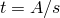
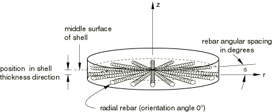
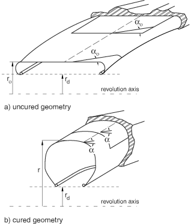
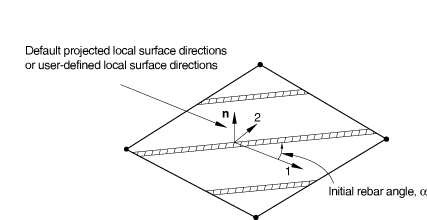
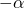
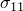

# 2.2.3 定义钢筋


**产品：** Abaqus/Standard  Abaqus/Explicit  Abaqus/CAE  

##### **参考文献**

- [*EMBEDDED ELEMENT](../key/key-link.md#usb-kws-membeddedelement)
- [*MEMBRANE SECTION](../key/key-link.md#usb-kws-mmembranesection)
- [*PRESTRESS HOLD](../key/key-link.md#usb-kws-hprestresshold)
- [*REBAR](../key/key-link.md#usb-kws-mrebar)
- [*REBAR LAYER](../key/key-link.md#usb-kws-mrebarlayer)
- [*SHELL SECTION](../key/key-link.md#usb-kws-mshellsection)
- [*SURFACE SECTION](../key/key-link.md#usb-kws-msurfacesection)
- ["定义钢筋层，" 《Abaqus/CAE用户指南》第12.13.19节](../usi/usi-link.md#usi-prp-section-rebar)

### 概述

钢筋：
- 用于在膜、壳和表面单元中定义单轴钢筋层（此类层被视为一层模糊层，恒定厚度等于每个钢筋横截面积除以钢筋间距）；
- 可用于通过将钢筋表面或膜单元嵌入"宿主"实体单元中来为实体添加钢筋层，如["嵌入单元，" 第35.4.1节](pt08ch35s04aus136.md)中所述；
- 可用于为模型添加额外的刚度、体积和质量；
- 可用于在Abaqus/Standard中的梁单元中添加离散轴向钢筋；
- 可用于耦合温度-位移分析，但不贡献于热导率和比热；
- 可用于耦合热-电-结构分析，但不贡献于电导率、热导率和比热；
- 不能用于热传递或质量扩散分析；以及
- 具有与底层或宿主单元不同的材料属性。
- 不包括底层单元的质量或体积。

### 定义钢筋层

您可以在膜、壳或表面单元中指定一层或多层钢筋。对于每一层，您需要指定钢筋属性，包括钢筋层名称；每根钢筋的横截面积；膜、壳或表面单元平面中的钢筋间距；钢筋在厚度方向上的位置（仅适用于壳单元），从壳的中面测量（正方向为壳正法向的方向）；钢筋材料名称；初始角度方向，以度为单位，相对于局部1方向测量；以及将从中测量钢筋角度输出的等参方向。

您可以通过将具有钢筋层的表面或膜单元嵌入一组宿主连续体单元中，在实体（连续体）单元中对钢筋层进行建模。

| **输入文件用法：** | 使用以下选项在膜单元中定义一层或多层钢筋： |
| --- | --- |
|  | ``` [*MEMBRANE SECTION](../key/key-link.md#usb-kws-mmembranesection), ELSET=*memb_set_name* [*REBAR LAYER](../key/key-link.md#usb-kws-mrebarlayer) ``` 使用以下选项在壳单元中定义一层或多层钢筋： ``` [*SHELL SECTION](../key/key-link.md#usb-kws-mshellsection), ELSET=*shell_set_name* [*REBAR LAYER](../key/key-link.md#usb-kws-mrebarlayer) ``` 使用以下选项在表面单元中定义一层或多层钢筋： ``` [*SURFACE SECTION](../key/key-link.md#usb-kws-msurfacesection), ELSET=*surf_set_name* [*REBAR LAYER](../key/key-link.md#usb-kws-mrebarlayer) ``` 使用以下选项在实体（连续体）单元中建模钢筋层： ``` [*EMBEDDED ELEMENT](../key/key-link.md#usb-kws-membeddedelement), HOST ELSET=*solid_set_name* *memb_set_name* or *surf_set_name* ``` |

| **Abaqus/CAE用法：** | 属性模块：膜、壳或表面截面编辑器： **钢筋层** |
| --- | --- |
|  | 相互作用模块： **创建约束**： **嵌入区域** |

#### 为钢筋层分配名称

您必须为特定单元或单元集中的每一层钢筋分配一个单独的名称。此名称可用于定义钢筋预应力和输出请求。

| **输入文件用法：** | ``` [*REBAR LAYER](../key/key-link.md#usb-kws-mrebarlayer) *rebar layer name* ``` |
| --- | --- |

| **Abaqus/CAE用法：** | 属性模块：膜、壳或表面截面编辑器： **钢筋层**： **层名称** *rebar layer name* |
| --- | --- |

#### 指定钢筋几何

钢筋几何始终相对于局部坐标系定义。定义适当的局部系统将在下一节中描述。钢筋几何可以是恒定的，作为圆柱坐标系中径向位置的函数变化，或根据轮胎"lift"方程变化。在每种情况下，您都必须指定间距*s*和面积*A*，用于确定等效钢筋层的厚度，，以及钢筋相对于此局部系统的角度方向，。

此外，对于壳单元，您必须指定钢筋在壳厚度方向上的位置，从壳的中面测量（正方向为壳正法向的方向）。如果壳的厚度由节点厚度定义（["节点厚度，" 第2.1.3节](pt01ch02s01aus07.md)），则此距离将按节点厚度定义的厚度与截面定义的厚度的比值进行缩放。如果壳的厚度由分布定义（["分布定义，" 第2.8.1节](pt01ch02s08aus26.md)），则此距离按分布定义的单元厚度与默认厚度的比值进行缩放。

##### 用恒定间距定义钢筋

您可以指定几何在局部钢筋坐标系中为恒定。在这种情况下，间距*s*被指定为长度度量。

| **输入文件用法：** | ``` [*REBAR LAYER](../key/key-link.md#usb-kws-mrebarlayer), GEOMETRY=CONSTANT ``` |
| --- | --- |

| **Abaqus/CAE用法：** | 属性模块：膜、壳或表面截面编辑器： **钢筋层**： **钢筋几何：恒定** |
| --- | --- |

##### 将钢筋间距定义为径向位置的函数

您可以按照角度间距（以度为单位）指定间距*s*，如图2.2.3-1所示。

**图2.2.3-1** 轴对称壳单元中径向钢筋示例。



角度间距值也可用于非径向钢筋以及具有非零方向角（相对于子午线平面）的钢筋。在这些情况下，钢筋的方向角不会改变。角度间距选项仅用于通过将角度间距乘以钢筋上关心点到对称轴的径向距离，以长度单位计算钢筋之间的间距。如果钢筋与三维单元关联，则必须为钢筋定义局部圆柱坐标系。

| **输入文件用法：** | ``` [*REBAR LAYER](../key/key-link.md#usb-kws-mrebarlayer), GEOMETRY=ANGULAR ``` |
| --- | --- |

| **Abaqus/CAE用法：** | 属性模块：膜、壳或表面截面编辑器： **钢筋层**： **钢筋几何：角度** |
| --- | --- |

##### 使用轮胎"lift"方程定义钢筋

结构轮胎分析通常使用硫化轮胎几何作为有限元模型的参考配置。然而，帘线几何更方便地相对于"生"或未硫化轮胎配置指定。轮胎lift方程从未硫化几何到硫化几何的映射（请参见图2.2.3-2）。

**图2.2.3-2** 未硫化和硫化轮胎钢筋几何之间的映射。



您可以相对于未硫化配置指定钢筋帘线的间距和方向，让Abaqus将这些属性映射到硫化轮胎的参考配置。使用圆柱坐标系，硫化轮胎中的间距*s*和角度方向从以下公式获得：


其中*r*是钢筋在硫化几何中沿径向方向的位置，是钢筋在未硫化几何中的位置，是未硫化几何中的间距，是相对于未硫化几何中投影局部1方向测量的角度，*e*是帘线延伸比。在轮胎中，*e*代表硫化过程中发生的预应变；*e*=1表示100%延伸。当等于90时，钢筋被认为具有恒定间距。

如果钢筋与三维单元关联，则必须为钢筋定义局部圆柱坐标系。

| **输入文件用法：** | ``` [*REBAR LAYER](../key/key-link.md#usb-kws-mrebarlayer), GEOMETRY=LIFT EQUATION ``` |
| --- | --- |

| **Abaqus/CAE用法：** | 属性模块：膜、壳或表面截面编辑器： **钢筋层**： **钢筋几何：基于lift方程** |
| --- | --- |

#### 局部钢筋方向系统

钢筋几何（如钢筋方向和间距）是相对于局部方向系统定义的。此局部钢筋方向系统与底层赋值使用的局部方向系统完全独立。

钢筋角度始终相对于局部1方向定义，如图2.2.3-3所示。

**图2.2.3-3** 三维壳、膜或表面单元中的钢筋。



使用角度间距或轮胎lift方程定义的间距指定的钢筋相对于圆柱方向系统指定。对于轴对称分析，全局坐标系用作圆柱系统。对于三维分析，您必须提供用户定义的圆柱方向定义。

##### 三维单元的局部方向系统

您可以通过引用用户定义的局部坐标系来定义局部系统。请参阅["方向，" 第2.2.5节](pt01ch02s02aus15.md)，了解如何从用户定义的方向计算壳、膜和表面单元中钢筋定义的局部坐标系。

如果您未指定用户定义的方向，局部1方向基于默认投影局部坐标系。请参阅["约定，" 第1.2.2节](pt01ch01s02aus02.md)，了解空间中表面上默认投影局部方向的定义。

正角度定义从局部方向1到局部方向2绕元素法向方向或用户定义法向方向的旋转。如果壳、膜或表面单元在空间中弯曲，局部1方向将在整个单元中变化，初始钢筋角度方向也将相应变化。可选择与壳或膜截面定义关联的方向定义对钢筋角度方向定义没有影响。例如，在膜截面、壳截面或表面截面中，以下数据将导致如图2.2.3-4所示的钢筋层定义：*A*=0.01；*s*=0.1；钢筋距壳中面的距离=0.0；=30.；钢筋定义引用局部矩形方向，其*X*轴通过点(0.7071, 0.7071, 0.0)，其平面包含点(0.7071, 0.7071, 0.0)，以及绕3方向额外旋转0.0度。

**图2.2.3-4** 相对于用户定义的局部坐标方向定义的钢筋。


以下数据将导致如图2.2.3-5所示的钢筋层定义：*A*=0.01，*s*=0.1，钢筋距壳中面的距离=0.0，=45。

**图2.2.3-5** 相对于默认局部坐标方向定义的钢筋。


| **输入文件用法：** | 使用以下选项为钢筋层定义局部1方向： |
| --- | --- |
|  | ``` [*ORIENTATION](../key/key-link.md#usb-kws-morientation), NAME=*name* [*REBAR LAYER](../key/key-link.md#usb-kws-mrebarlayer), ORIENTATION=*name* ``` |

| **Abaqus/CAE用法：** | 属性模块：****工具****基准****: **类型**： **CSYS** ****分配****钢筋参考方向**** |
| --- | --- |

##### 轴对称单元的局部方向系统

轴对称膜单元或轴对称表面单元中的钢筋必须位于单元参考表面，而轴对称壳中的钢筋可以位于壳参考表面或可以偏离中面。轴对称膜、壳和表面单元中的钢筋可以相对于*r*–*z*平面具有任意角度方向。图2.2.3-6显示周向钢筋示例，图2.2.3-1显示轴对称壳中径向钢筋示例。

**图2.2.3-6** 轴对称壳单元中周向钢筋示例。


您不能为轴对称膜、壳和表面单元中的钢筋层指定用户定义的方向。相反，您需要在钢筋层定义中指定钢筋层相对于*r*–*z*平面的角度方向，以度为单位；此方向沿膜、壳或表面单元的正法向正方向测量。

如果您为无扭曲的轴对称膜、无扭曲的轴对称壳或无扭曲的轴对称表面中的钢筋指定除0或90外的方向角，Abaqus假设钢筋是平衡的（即，一半钢筋位于指定角度，另一半位于角度），内部计算相应处理此类钢筋定义不应与对称模型生成功能一起使用（["对称模型生成，" 第10.4.1节](pt04ch10s04aus63.md)）。建议的建模技术是在带扭曲的轴对称单元中定义不平衡钢筋。另一方面，平衡钢筋可以在常规轴对称单元或带扭曲的轴对称单元中定义，应通过指定一半钢筋位于指定角度，另一半位于角度来定义。

#### 大位移考虑

在几何非线性分析中，随着钢筋增强单元的变形，初始定义的几何属性和钢筋层方向可能因有限应变效应而改变。钢筋层的变形从底层壳、膜或表面单元的变形梯度确定。钢筋随实际变形旋转，而不是随底层单元材料点的平均刚体旋转。详细信息请参阅["壳、膜和表面单元中的钢筋建模，" 《Abaqus理论指南》第3.7.3节](../stm/stm-link.md#stm-elm-rebarshell)。

例如，考虑使用一阶单元建模的板在大纯剪切变形下，如图2.2.3-7所示，其中钢筋最初与单元等参方向对齐。

**图2.2.3-7** 几何非线性分析中钢筋方向的变化。


由于有限应变效应，钢筋旋转但仍与单元等参方向对齐。如果使用各向异性材料属性而不是钢筋对同一问题进行建模，且材料方向（1和2）最初与单元等参方向对齐，在这种大剪切变形下，材料方向旋转，不再与单元等参方向对齐。在这种情况下，材料方向基于材料点的平均刚体旋转确定。因此，如果材料不是真正的连续体，用钢筋建模各向异性行为会更好。

### 在Abaqus/Standard梁单元中定义钢筋

您必须使用基于单元的钢筋（["将钢筋定义为单元属性，" 第2.2.4节](pt01ch02s02aus14.md)）来在Abaqus/Standard梁单元中建模离散钢筋。您需要指定包含钢筋的单元、每根钢筋的横截面积，以及每根钢筋相对于局部梁截面轴的位置（请参见图2.2.3-8）。

**图2.2.3-8** 梁截面中的钢筋位置。


每根单独的钢筋必须在特定单元或单元集中分配一个单独的名称。此名称可用于定义钢筋预应力和输出请求。

| **输入文件用法：** | ``` [*REBAR](../key/key-link.md#usb-kws-mrebar), ELEMENT=BEAM, MATERIAL=*mat*, NAME=*name* ``` |
| --- | --- |

| **Abaqus/CAE用法：** | Abaqus/CAE不支持Abaqus/Standard梁单元中的钢筋。 |
| --- | --- |

### 定义钢筋材料

钢筋的材料属性与底层单元的材料属性不同，由单独的材料定义定义（["材料数据定义，" 第21.1.2节](pt05ch21s01aus109.md)）。您必须将每个钢筋层（或对于Abaqus/Standard中的梁单元，每个钢筋定义）与一组材料属性关联。

以下材料行为不能用于在Abaqus/Standard中定义钢筋材料：
- ["多孔金属塑性，" 第23.2.9节](pt05ch23s02abm25.md)。

以下材料行为不能用于在Abaqus/Explicit中定义钢筋材料：
- ["定义完全各向异性弹性" in "线性弹性行为，" 第22.2.1节](pt05ch22s02abm02.md#usb-mat-clinearelastic-anisotropic);
- ["通过指定弹性刚度矩阵项定义正交各向异性弹性" in "线性弹性行为，" 第22.2.1节](pt05ch22s02abm02.md#usb-mat-clinearelastic-orthoterms);
- ["状态方程，" 第25.2.1节](pt05ch25s02abm50.md);
- ["各向异性屈服/蠕变，" 第23.2.6节](pt05ch23s02abm22.md);
- ["多孔金属塑性，" 第23.2.9节](pt05ch23s02abm25.md);
- ["扩展Drucker-Prager模型，" 第23.3.1节](pt05ch23s03abm30.md);
- ["修正Drucker-Prager/Cap模型，" 第23.3.2节](pt05ch23s03abm31.md);
- ["可压碎泡沫塑性模型，" 第23.3.5节](pt05ch23s03abm34.md);或
- ["混凝土开裂模型，" 第23.6.2节](pt05ch23s06abm38.md)。

尽管Abaqus/Standard允许用正交各向异性弹性（["通过指定弹性刚度矩阵项定义正交各向异性弹性" in "线性弹性行为，" 第22.2.1节](pt05ch22s02abm02.md#usb-mat-clinearelastic-orthoterms)）或各向异性弹性（["定义完全各向异性弹性" in "线性弹性行为，" 第22.2.1节](pt05ch22s02abm02.md#usb-mat-clinearelastic-anisotropic)）定义钢筋材料，但才是这些定义中唯一有意义的材料常数。用于使用相应应力分量计算钢筋方向的应变，，如["线性弹性行为，" 第22.2.1节](pt05ch22s02abm02.md)中所讨论；钢筋中不存在其他应变或应力分量。

如果为钢筋层中的材料指定了非零密度，则钢筋的质量会在动力分析以及重力、离心和旋转加速度分布荷载中被考虑。

梁单元中钢筋的质量不被考虑（仅在Abaqus/Standard中可用）；您应该调整梁材料的密度以考虑钢筋质量。

| **输入文件用法：** | ``` [*REBAR LAYER](../key/key-link.md#usb-kws-mrebarlayer) *rebar layer name*, *A*, *s*, *distance of rebar from shell midsurface*, *rebar material name* ``` |
| --- | --- |

| **Abaqus/CAE用法：** | 属性模块：膜、壳或表面截面编辑器： **钢筋层**： **材料** *rebar material name* |
| --- | --- |

### 初始条件

初始条件（["Abaqus/Standard和Abaqus/Explicit中的初始条件，" 第34.2.1节](pt07ch34s02aus116.md)）可用于定义钢筋的预应力或解相关值。

#### 定义钢筋中的预应力

对于定义了钢筋的结构（如钢筋混凝土结构），您可以使用初始条件来定义钢筋中的预应力。

在Abaqus/Standard的这种情况下，必须在进行主动加载之前通过初始静态分析步骤（["静态应力分析，" 第6.2.2节](pt03ch06s02at01.md)）使结构达到平衡状态（或者也许仅施加"永久"荷载）——请参见["Abaqus/Standard和Abaqus/Explicit中的初始条件，" 第34.2.1节](pt07ch34s02aus116.md)。

| **输入文件用法：** | ``` [*INITIAL CONDITIONS](../key/key-link.md#usb-kws-minitialcond), TYPE=STRESS, REBAR *element number or element set name, rebar name, prestress value* ``` |
| --- | --- |

| **Abaqus/CAE用法：** | Abaqus/CAE不支持钢筋预应力。 |
| --- | --- |

#### 在Abaqus/Standard中保持钢筋中的预应力

如果在钢筋中定义了预应力，除非预应力被固定，否则它将在平衡静态分析步骤中被允许改变；这是结构在自平衡应力状态建立时的应变结果。一个例子是混凝土预应力的预拉伸类型，其中钢筋筋束最初被拉伸到期望的张力，然后被混凝土覆盖。混凝土固化并与钢筋粘结后，释放初始钢筋张力会将荷载传递到混凝土，在混凝土中引入压应力。混凝土中的结果变形减少了钢筋中的应力。

或者，您可以在此初始平衡求解过程中保持一些或所有钢筋中定义的初始应力恒定。一个例子是混凝土后张预应力；钢筋允许在混凝土中滑动（通常它们在导管中），预应力加载由某些外部源（预应力千斤顶）维持。钢筋中预应力的大小通常是设计要求的一部分，在混凝土在预应力加载下压缩时不得减小。通常，预应力仅在分析的第一步中保持恒定。这通常是预应力的更常见假设。

如果预应力在保持恒定的步骤之后的分析步骤中没有保持恒定，由于混凝土中的额外变形，钢筋中的应力将改变。如果没有额外变形，钢筋中的应力将保持在初始条件设定的水平。如果加载历史使得在预应力保持恒定的步骤之后的步骤中，混凝土或钢筋中不会产生塑性变形，则在这些步骤中施加的荷载移除后，钢筋中的应力将恢复到初始条件设定的水平。

| **输入文件用法：** | ``` [*PRESTRESS HOLD](../key/key-link.md#usb-kws-hprestresshold) ``` |
| --- | --- |

| **Abaqus/CAE用法：** | Abaqus/CAE不支持钢筋预应力。 |
| --- | --- |

#### 定义钢筋解相关状态变量的初始值

您可以为单元内钢筋定义解相关状态变量的初始值。请参阅["Abaqus/Standard和Abaqus/Explicit中的初始条件，" 第34.2.1节](pt07ch34s02aus116.md)，了解更多详情。

| **输入文件用法：** | ``` [*INITIAL CONDITIONS](../key/key-link.md#usb-kws-minitialcond), TYPE=SOLUTION, REBAR ``` |
| --- | --- |

| **Abaqus/CAE用法：** | Abaqus/CAE不支持初始解相关状态变量。 |
| --- | --- |

### 输出

钢筋力输出在钢筋积分位置可用，输出变量为RBFOR。钢筋力等于钢筋应力乘以当前钢筋横截面积。钢筋的当前横截面积是通过假设钢筋由不可压缩材料制成来计算的，而不考虑实际材料定义。对于膜、壳或表面单元中的钢筋，输出变量RBANG和RBROT分别识别单元内钢筋的当前方向以及有限变形的结果钢筋的相对旋转。这些量是相对于单元中用户指定的等参方向测量的，而不是默认的局部单元系统或方向定义的系统。请参阅["壳、膜和表面单元中的钢筋建模，" 《Abaqus理论指南》第3.7.3节](../stm/stm-link.md#stm-elm-rebarshell)。

请参阅["Abaqus/Standard输出变量标识符，" 第4.2.1节](pt02ch04s02abv01.md)和["Abaqus/Explicit输出变量标识符，" 第4.2.2节](pt02ch04s02xbv01.md)，了解应力、应变等其他输出量的信息。对于具有多个积分点的膜、壳或表面单元中的钢筋，输出量在积分点和单元质心可用。

#### 指定钢筋角度输出的方向

输出量RBANG和RBROT可以从膜、壳或表面单元平面中的任一等参方向测量。您可以指定期望的等参方向，从中测量钢筋角度（1或2）。钢筋角度从等参方向到钢筋测量，正角度定义为绕单元法向方向逆时针旋转。默认方向是第一个等参方向。

在轴对称壳、表面和膜单元中，第一个等参方向与子午线方向重合，第二个等参方向与环向方向重合。在三角形单元中，Abaqus定义等参方向如下：对于3节点三角形，第一个等参方向是从节点1到第二个单元边中点的直线，第二个等参方向是从第一个单元边中点到第三个单元边中点的直线；对于6节点三角形，第一个等参方向是从节点1到节点5的直线，第二个等参方向是从节点4到节点6的直线（请参阅["单元库：概述，" 第27.1.1节](pt06ch27s01abo25.md)，了解单元节点排序）。

| **输入文件用法：** | ``` [*REBAR LAYER](../key/key-link.md#usb-kws-mrebarlayer) *rebar layer name*, *A*, *s*, *distance of rebar from shell midsurface*, *rebar material name*, *angular orientation of rebar*, *isoparametric direction* ``` |
| --- | --- |

| **Abaqus/CAE用法：** | 您不能在Abaqus/CAE中指定钢筋角度输出的方向；始终使用第一个等参方向。 |
| --- | --- |

##### 示例

例如，用户定义的局部坐标系用于在壳单元中定义钢筋（=），RBANG的输出值为75，如图2.2.3-9所示：

```
[*REBAR LAYER](../key/key-link.md#usb-kws-mrebarlayer), ORIENTATION=ORIENT
 Rbname, 0.01, 0.1, 0.0, Rbmat, 30., 2
[*ORIENTATION](../key/key-link.md#usb-kws-morientation), SYSTEM=RECTANGULAR, NAME=ORIENT
 -0.7071, 0.7071, 0.0, -0.7071, -0.7071, 0.0
 3, 0.0
```

**图2.2.3-9** 相对于用户定义的局部坐标方向测量的RBANG。


钢筋位于壳的中面。输出变量RBANG从第二个等参方向到钢筋测量。如果选择第一个等参方向，输出变量RBANG将报告角度为165。

#### 在Abaqus/CAE中可视化钢筋方向和钢筋结果

Abaqus/CAE支持钢筋层中钢筋方向和结果的可视化。仅当您请求钢筋的单元输出时，钢筋方向图才可用（请参阅["输出到输出数据库，" 第4.1.3节](pt02ch04s01aus40.md#usb-out-odboutput-elementoutput)）。钢筋的单元变量可以作为场输出或历史输出在可视化模块中进行等值线绘制或绘图。每个钢筋层都有一个唯一的名称，代表膜、壳或表面单元中的一个附加截面点。您可以在可视化模块中选择膜、壳或表面单元中的命名钢筋层来显示其结果。Abaqus/CAE尚不支持梁中的钢筋。

