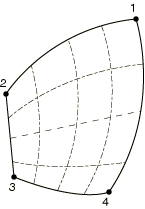
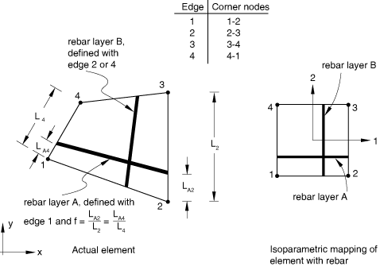
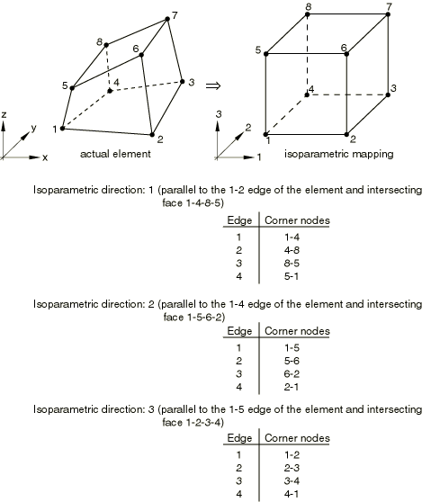
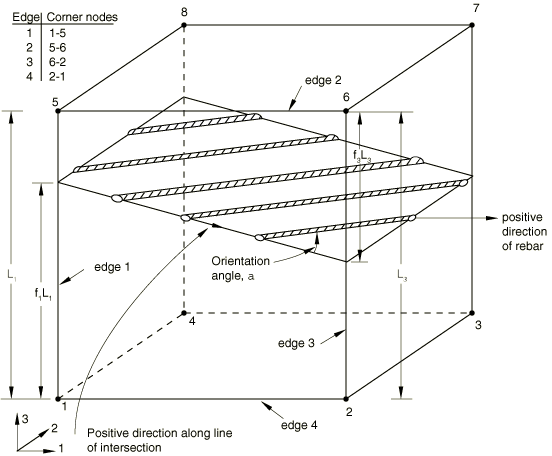
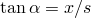
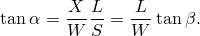
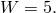

# 2.2.4 将钢筋定义为单元属性


**产品：** Abaqus/Standard  Abaqus/Explicit  

##### **参考文献**

- [*PRESTRESS HOLD](../key/key-link.md#usb-kws-hprestresshold)
- [*REBAR](../key/key-link.md#usb-kws-mrebar)

### 概述

在壳和膜单元中定义钢筋的首选方法是将钢筋层定义为单元截面定义的一部分（如["定义钢筋，" 第2.2.3节](pt01ch02s02aus13.md)中所记录）。在实体中定义钢筋的首选方法是将钢筋表面或膜单元嵌入"宿主"实体单元中（如["嵌入单元，" 第35.4.1节](pt08ch35s04aus136.md)中所述）。本节描述了一种替代方法，即将钢筋定义为壳、膜和连续体单元的单元属性。此方法比["定义钢筋，" 第2.2.3节](pt01ch02s02aus13.md)中所述的方法更麻烦，并且不允许在Abaqus/CAE中可视化钢筋和钢筋结果。

基于单元的钢筋：
- 用于在实体、膜和壳单元中定义单轴钢筋；
- 可以在实体单元中定义为单独的钢筋；
- 可以在壳、膜和实体单元中定义为均匀间距的钢筋层（此类层被视为一层模糊层，恒定厚度等于每个钢筋横截面积除以钢筋间距）；
- 可用于耦合温度-位移单元，但不贡献于热导率和比热；
- 可用于耦合热-电-结构单元，但不贡献于电导率、热导率和比热；
- 在Abaqus/Standard中不贡献于模型的质量；
- 不能用于热传递或质量扩散分析的单元；
- 不能与三角形壳和膜单元或三角形、三角棱柱和四面体实体单元一起使用；以及
- 具有与底层单元不同的材料属性。

### 为钢筋集分配名称

您必须为钢筋集分配一个名称。此名称可用于定义钢筋预应力和输出请求。每层钢筋必须在特定单元或单元集中分配一个单独的名称。

| **输入文件用法：** | ``` [*REBAR](../key/key-link.md#usb-kws-mrebar), ELEMENT=*elem*, MATERIAL=*mat*, NAME=*name* ``` |
| --- | --- |

### 在三维壳和膜单元中定义钢筋

可以在三维壳和膜单元中定义等参钢筋和偏斜钢筋。钢筋不能用于三角形壳或膜。

如果需要三角形壳或膜，可以使用折叠四边形壳或膜。结果的钢筋方向将取决于所使用的钢筋类型（等参或偏斜）。必须仔细定义钢筋，因为单元是扭曲的。此技术仅应在结果不重要且应力梯度不高网格区域中使用。

钢筋的刚度计算使用与底层壳或膜单元计算相同的积分点。有关壳和膜单元的更多信息，请参阅["壳单元：概述，" 第29.6.1节](pt06ch29s06abo27.md)和["膜单元，" 第29.1.1节](pt06ch29s01alm05.md)。

#### 在三维壳和膜单元中定义等参钢筋

等参钢筋沿着单元中等参线的映射对齐（请参见图2.2.4-1）。

**图2.2.4-1** 未扭曲三维壳或膜单元中的"等参"钢筋。


如果包含钢筋的单元的相对边缘不平行，则钢筋方向在单元内每个积分点都不同（请参见图2.2.4-2）。

**图2.2.4-2** 扭曲三维壳或膜单元中的"等参"钢筋方向（虚线表示钢筋方向）。



钢筋的间距在物理空间中将是固定的。间距*s*和钢筋面积*A*用于确定等效模糊层的厚度，。如果包含钢筋的单元边缘不平行，则通过一个边缘的实际钢筋数量（具有此间距）将与通过相对边缘的数量不同（在等参空间中相对）。

您需要指定包含钢筋的单元；每根钢筋的横截面积*A*；壳平面中的钢筋间距*s*；以及在等参空间中绘制时钢筋与其平行的边缘编号（请参见图2.2.4-1）。此外，对于壳单元，您需要指定钢筋在壳厚度方向上的位置，从壳的中面测量（正方向为壳正法向的方向）。如果壳的厚度由节点厚度定义（["节点厚度，" 第2.1.3节](pt01ch02s01aus07.md)），则此距离将按节点厚度定义的厚度与截面定义的厚度的比值进行缩放。如果壳的厚度由分布定义（["分布定义，" 第2.8.1节](pt01ch02s08aus26.md)），则此距离按分布定义的单元厚度与默认厚度的比值进行缩放。如果壳具有复合截面，其层厚度由分布定义（["分布定义，" 第2.8.1节](pt01ch02s08aus26.md)），则此距离按分布定义的单元层厚度之和与默认层厚度之和的比值进行缩放。

| **输入文件用法：** | 使用以下选项在三维壳单元中定义等参钢筋： |
| --- | --- |
|  | ``` [*REBAR](../key/key-link.md#usb-kws-mrebar), ELEMENT=SHELL, MATERIAL=*mat*, GEOMETRY=ISOPARAMETRIC ``` 使用以下选项在通用膜单元中定义等参钢筋： ``` [*REBAR](../key/key-link.md#usb-kws-mrebar), ELEMENT=MEMBRANE, MATERIAL=*mat*, GEOMETRY=ISOPARAMETRIC ``` |

#### 在三维壳和膜单元中定义偏斜钢筋

偏斜钢筋不必类似于单元边缘；它们可以以相对于局部1轴的任何规定角度放置。钢筋的方向必须以两种方式之一定义，如图2.2.4-3所示：

**图2.2.4-3** 三维壳或膜中的"偏斜"钢筋。


1. 钢筋可以相对于默认投影局部坐标系定义（请参阅["约定，" 第1.2.2节](pt01ch01s02aus02.md)）。
2. 钢筋可以相对于用户定义的局部坐标系定义（请参阅["方向，" 第2.2.5节](pt01ch02s02aus15.md)）。

可选择与壳或膜截面定义关联的方向定义对钢筋角度方向定义没有影响。如果壳或膜在空间中弯曲，局部1方向将在整个单元中变化，偏斜钢筋也将相应变化。

对于壳单元，使用分布定义局部坐标系（["分布定义，" 第2.8.1节](pt01ch02s08aus26.md)）对钢筋角度方向定义没有影响。

如果钢筋横截面积为*A*，则应给出钢筋间距*s*，使得等效"模糊"钢筋层的厚度为。

##### 相对于默认投影局部坐标系定义偏斜钢筋

要相对于默认投影局部坐标系定义偏斜钢筋，您需要指定包含钢筋的单元；每根钢筋的横截面积*A*；壳平面中的钢筋间距*s*；钢筋在厚度方向上的位置（仅适用于壳单元），从壳的中面测量（正方向为壳正法向的方向）；以及默认局部1方向与钢筋之间的角度，以度为单位。请参阅["约定，" 第1.2.2节](pt01ch01s02aus02.md)，了解空间中表面上默认投影局部方向的定义。如果壳的厚度由节点厚度定义（["节点厚度，" 第2.1.3节](pt01ch02s01aus07.md)），则厚度方向上的钢筋位置将按节点厚度定义的厚度与截面定义的厚度的比值进行缩放。如果壳的厚度由分布定义（["分布定义，" 第2.8.1节](pt01ch02s08aus26.md)），则厚度方向上的钢筋位置按分布定义的单元厚度与默认厚度的比值进行缩放。正角度定义从局部方向1到局部方向2绕单元法向方向的旋转。例如，在膜中，以下数据将导致如图2.2.4-4所示的钢筋定义：*A*=0.05，*s*=0.1，=45。

**图2.2.4-4** 相对于默认局部坐标方向定义的偏斜钢筋。


当用户定义的局部方向定义未用于定义钢筋的角度方向且壳的法向几乎平行于全局1轴时，局部1轴可能在单元内或从一个单元到下一个单元发生显著变化（请参阅["约定，" 第1.2.2节](pt01ch01s02aus02.md)）。

| **输入文件用法：** | 使用以下选项在三维壳单元中相对于默认投影局部坐标系定义偏斜钢筋： |
| --- | --- |
|  | ``` [*REBAR](../key/key-link.md#usb-kws-mrebar), ELEMENT=SHELL, MATERIAL=*mat*, GEOMETRY=SKEW ``` 使用以下选项在通用膜单元中相对于默认投影局部坐标系定义偏斜钢筋： ``` [*REBAR](../key/key-link.md#usb-kws-mrebar), ELEMENT=MEMBRANE, MATERIAL=*mat*, GEOMETRY=SKEW ``` |

##### 相对于用户定义的局部坐标系定义偏斜钢筋

要相对于用户定义的局部坐标系定义偏斜钢筋，您需要指定包含钢筋的单元；每根钢筋的横截面积*A*；平面中的间距*s*；钢筋在厚度方向上的位置（仅适用于壳单元），从壳的中面测量（正方向为壳正法向的方向）；以及用户定义的1方向与钢筋之间的角度，，以度为单位。请参阅["方向，" 第2.2.5节](pt01ch02s02aus15.md)，了解如何从用户定义的方向计算壳和膜中钢筋定义的局部坐标系。正角度定义从局部方向1到局部方向2绕用户定义法向方向的旋转。例如，在壳中，以下数据将导致如图2.2.4-5所示的偏斜钢筋定义：*A*=0.01；*s*=0.1；钢筋距壳中面的距离=0.0；=30.；钢筋定义引用局部矩形方向，其*X*轴通过点(0.7071, 0.7071, 0.0)，其*X*–*Y*平面包含点(0.7071, 0.7071, 0.0)，以及绕3方向额外旋转0.0度。

**图2.2.4-5** 相对于用户定义的局部坐标方向定义的偏斜钢筋。


| **输入文件用法：** | 使用以下选项在三维壳单元中相对于用户定义的局部坐标系定义偏斜钢筋： |
| --- | --- |
|  | ``` [*REBAR](../key/key-link.md#usb-kws-mrebar), ELEMENT=SHELL, MATERIAL=*mat*, GEOMETRY=SKEW, ORIENTATION=*name* ``` 使用以下选项在通用膜单元中相对于用户定义的局部坐标系定义偏斜钢筋： ``` [*REBAR](../key/key-link.md#usb-kws-mrebar), ELEMENT=MEMBRANE, MATERIAL=*mat*, GEOMETRY=SKEW, ORIENTATION=*name* ``` |

### 在轴对称壳和膜单元中定义钢筋

轴对称膜中的钢筋必须位于膜参考表面，而轴对称壳中的钢筋可以位于壳参考表面或可以偏离中面。轴对称壳和膜中的钢筋可以相对于*r*–*z*平面具有任意方向。图2.2.4-6显示周向钢筋示例，图2.2.4-7显示轴对称壳中径向钢筋示例。

**图2.2.4-6** 轴对称壳单元中周向钢筋示例。


**图2.2.4-7** 轴对称壳单元中径向钢筋示例。


您需要指定每根钢筋的横截面积*A*；钢筋间距*s*；对于壳单元，钢筋在壳厚度方向上的位置，从壳的中面测量（正方向为壳正法向的方向）；相对于*r*–*z*平面的角度方向，，以度为单位；以及测量钢筋间距的径向位置。角度方向沿膜、壳或膜单元的正法向正方向测量为正。如果壳的厚度由节点厚度定义（["节点厚度，" 第2.1.3节](pt01ch02s01aus07.md)），则从中面的距离将按节点厚度定义的厚度与截面定义的厚度的比值进行缩放。如果壳的厚度由分布定义（["分布定义，" 第2.8.1节](pt01ch02s08aus26.md)），则从中面的距离将按分布定义的单元厚度与默认厚度的比值进行缩放。

如果您为无扭曲的轴对称壳或膜中的钢筋指定除0或90外的方向角，Abaqus假设钢筋是平衡的（即，一半钢筋位于指定角度，另一半位于角度），内部计算相应处理。详细信息请参阅["二维钢筋建模，" 《Abaqus理论指南》第3.7.1节](../stm/stm-link.md#stm-elm-rebars2d)。如果使用对称模型生成功能（["对称模型生成，" 第10.4.1节](pt04ch10s04aus63.md)）从轴对称壳或膜模型创建三维模型，则只有平衡钢筋会被正确翻译。轴对称模型中平衡钢筋的定义将在三维模型中产生平衡钢筋；不平衡钢筋的这种翻译不可用。带扭曲的广义轴对称膜中的不平衡钢筋将被正确翻译。

如果给出了钢筋间距的径向位置，则当径向位置变化时，钢筋的总横截面积将保持恒定；此行为对应于周向钢筋数量保持恒定，意味着模糊钢筋层的厚度减小，钢筋间距随*r*增加而增加（请参见图2.2.4-7）。如果省略钢筋间距的径向位置（或设置为零），Abaqus假设钢筋间距保持恒定；相应模糊层的厚度保持固定，使得。

| **输入文件用法：** | 使用以下选项在轴对称壳单元中定义钢筋： |
| --- | --- |
|  | ``` [*REBAR](../key/key-link.md#usb-kws-mrebar), ELEMENT=AXISHELL, MATERIAL=*mat* ``` 使用以下选项在轴对称膜单元中定义钢筋： ``` [*REBAR](../key/key-link.md#usb-kws-mrebar), ELEMENT=AXIMEMBRANE, MATERIAL=*mat* ``` |

### 在连续体单元中定义钢筋

二维或三维连续体（实体）单元可以包含钢筋；钢筋不能在三角形、棱柱、四面体或无限单元中定义。如果需要三角形或楔形单元，可以使用折叠四边形或砖单元。折叠包含钢筋的单元时要小心。检查钢筋的位置和方向是否正确非常重要。

钢筋被定义为单根钢筋或层。在后一种情况下，该层是每个单元中的一个表面；您需要在表面中提供钢筋方向。

#### 在平面和轴对称连续体单元中定义钢筋层

默认情况下，钢筋形成一个层，该层位于与模型平面成直角的表面中。您可以定义此钢筋表面与模型平面相交的线，如下所述。

钢筋在钢筋表面内的方向通过给出模型平面中的相交线与钢筋之间的角度（以度为单位）来定义。此角度在物理三维空间中测量，而不是在等参空间中测量。详细信息请参阅["二维钢筋建模，" 《Abaqus理论指南》第3.7.1节](../stm/stm-link.md#stm-elm-rebars2d)。相交线上的正方向是从相交的较低编号边到较高编号边的方向，正角度表示钢筋向下指向模型平面（其中平面在平面应变分析中平行于*z*轴，或在轴对称分析中平行于轴），如图2.2.4-8所示。

**图2.2.4-8** 平面和轴对称实体单元中钢筋的方向。


如果您为无扭曲的轴对称单元中的钢筋指定除0或90外的方向角，则假设单元中的钢筋是平衡的（一半钢筋位于指定角度，另一半位于角度。

##### 定义等参钢筋

对于等参钢筋，钢筋层与模型平面的相交将沿着单元中等参线的恒定映射进行。您需要指定包含钢筋的单元；每根钢筋的横截面积*A*；钢筋间距*s*；钢筋方向，（如上所述）；从边缘的分数距离*f*（边缘与钢筋之间的距离与单元整个距离的比值）；以及定义钢筋的边缘编号。此外，对于轴对称单元，您需要指定测量钢筋间距的径向位置。

如果为轴对称单元中的钢筋给出了钢筋间距的径向位置，则当径向位置变化时，钢筋的总横截面积将保持恒定；此行为对应于钢筋数量随*r*增加而保持恒定；也就是说，模糊钢筋层的厚度随*r*增加而减小。如果省略钢筋间距的径向位置（或设置为零），Abaqus假设钢筋间距保持恒定；相应模糊层的厚度保持固定，使得。

图2.2.4-9显示了等参钢筋的示例。

**图2.2.4-9** 实体单元中等参钢筋层定义。



在单元的等参映射中，钢筋线平行于单元的其中一个边缘。在图中，钢筋层*A*的线可以使用边缘1或3定义，钢筋层*B*可以使用边缘2或4定义。钢筋层*A*从边缘1的分数距离为比值, ELEMENT=CONTINUUM, MATERIAL=*mat*, GEOMETRY=ISOPARAMETRIC ``` |

##### 定义偏斜钢筋

对于偏斜钢筋，钢筋层与模型平面的相交可以与单元的任意两个边缘相交。您需要指定包含钢筋的单元；每根钢筋的横截面积*A*；钢筋间距*s*；以及钢筋方向，（如上所述）。此外，对于轴对称单元，您需要指定测量钢筋间距的径向位置。您还需要指定沿单元边缘的分数距离，从边缘的第一个节点（如图2.2.4-10所列）到钢筋层与边缘相交的位置，对于所有边缘。只有对应于钢筋相交的两个边缘的值可以非零。

**图2.2.4-10** 实体单元中偏斜钢筋层定义。


图2.2.4-10显示了偏斜钢筋的示例。在单元的等参映射中，钢筋线与单元的两个边缘相交。相交点通过沿每个相交边缘定义分数距离来定位。在图中，钢筋层*A*由沿边缘1的比值, ELEMENT=CONTINUUM, MATERIAL=*mat*, GEOMETRY=SKEW ``` |

#### 在二维轴对称和广义平面应变连续体单元中定义单根钢筋

您可以在轴对称和广义平面应变连续体单元中定义单根钢筋。在这种情况下，钢筋被认为与模型平面成直角——对于广义平面应变单元为厚度方向，对于轴对称单元为周向。

钢筋与模型平面的相交由沿着通过钢筋位置的恒定等参线的交点沿边缘1和边缘2的分数距离定义（请参见图2.2.4-11）。分数距离从图2.2.4-11中列出的第一个边缘节点测量。

**图2.2.4-11** 实体单元中的单根钢筋。


您需要指定包含钢筋的单元；每根钢筋的横截面积*A*；以及确定钢筋在单元中位置的分数距离，和。

| **输入文件用法：** | 使用以下选项在轴对称和广义平面应变连续体单元中定义单根钢筋： |
| --- | --- |
|  | ``` [*REBAR](../key/key-link.md#usb-kws-mrebar), ELEMENT=CONTINUUM, MATERIAL=*mat*, SINGLE ``` |

#### 在三维连续体单元中定义钢筋层

默认情况下，三维连续体单元中的钢筋被定义为位于表面中的层。这些表面最方便地相对于单元的等参映射立方体来定义。因此，在生成网格之前必须考虑如何定义钢筋；如果在设计网格时未考虑钢筋表面，钢筋定义可能非常低效。

在等参映射立方体中，钢筋表面始终有两个边缘（彼此相对）平行于一个等参方向。等参方向在图2.2.4-12中定义。您需要指定此等参方向（1、2或3）。

**图2.2.4-12** 三维单元的等参方向和边缘定义。



单元的特定面（垂直于等参映射立方体中的此等参方向）用于定义表面的其他两个边缘的位置；面在图2.2.4-12中定义，面的边缘也在其中定义。

如果定义了等参钢筋，则钢筋表面的两个不平行于用户指定等参方向的边缘将平行于其他两个等参方向之一；在等参映射立方体中，钢筋表面上有一个等参坐标是恒定的。图2.2.4-13用包含两层等参钢筋的单元说明了这个概念。

**图2.2.4-13** 具有两层等参钢筋的单元。


每个表面的位置由从图2.2.4-12中为所选等参方向定义的面边缘的分数距离*f*给出；您必须指定从中测量分数距离的边缘。

如果定义了偏斜钢筋，则钢筋表面的两个不平行于用户指定等参方向的边缘通常不平行于其他等参方向之一。钢筋表面的这两个边缘的位置由钢筋表面与为所选等参方向定义的相交面的边缘的交点指定（如图2.2.4-12所示）；交点由沿面每个边缘的分数距离*f*给出。（注意，对于偏斜钢筋，分数距离是沿边缘的；对于等参钢筋，分数距离是从边缘测量的。）沿边缘的分数距离从边缘的第一个节点测量。必须给出所有四个分数距离，但只有两个可以非零。

钢筋在钢筋层内的方向角，，在等参映射立方体中定义；它以度为单位测量，是钢筋表面与所选等参方向的面的相交线与钢筋之间的角度。相交线的正方向是从较低编号边缘到较高编号边缘的方向；钢筋的正方向指向单元内部。图2.2.4-14显示了一个示例。方向角在等参映射立方体的钢筋层中定义；因此，等参钢筋和偏斜钢筋的定义是相同的。

**图2.2.4-14** 三维偏斜钢筋建模的方向示例，等参方向2。显示在映射等参单元中。



如果钢筋层在物理空间中不是平的，则每个积分点的方向角可能不同。由于每个单元只能定义一个方向角，因此必须使用单元的平均值方向角；对于合理的网格，此近似不应显著影响结果。

##### 定义等参钢筋

您需要指定包含钢筋的单元；每根钢筋的横截面积*A*；钢筋间距*s*；钢筋方向，（如上所述）；从边缘的分数距离*f*；从中测量分数距离的边缘编号；以及钢筋表面的等参方向。

| **输入文件用法：** | 使用以下选项在三维连续体单元中定义等参钢筋层： |
| --- | --- |
|  | ``` [*REBAR](../key/key-link.md#usb-kws-mrebar), ELEMENT=CONTINUUM, MATERIAL=*mat*, GEOMETRY=ISOPARAMETRIC ``` |

##### 示例：等参钢筋

例如，以下输入定义了图2.2.4-13所示的等参钢筋：

```
[*HEADING](../key/key-link.md#usb-kws-mheading)
ISOPARAMETRIC REBAR
[*NODE](../key/key-link.md#usb-kws-mnode)
 1,  0.,  0.
 2, 10.,  0.
 3, 10.,  5.
 4,  0.,  5.
 5,  0.,  0.,  7.5
 6, 10.,  0., 12.5
 7, 10.,  5., 12.5
 8,  0.,  5., 7.5
[*ELEMENT](../key/key-link.md#usb-kws-melement), TYPE=C3D8R, ELSET=ONE
 1,1,2,3,4,5,6,7,8
[*REBAR](../key/key-link.md#usb-kws-mrebar), ELEMENT=CONTINUUM, MATERIAL=STEEL,
 GEOMETRY=ISOPARAMETRIC, NAME=LAYER_A
 ONE,.04,2.5,49.32628,0.25,4,2
[*REBAR](../key/key-link.md#usb-kws-mrebar), ELEMENT=CONTINUUM, MATERIAL=STEEL,
 GEOMETRY=ISOPARAMETRIC, NAME=LAYER_B
 ONE,.04,1.,63.43494,0.5,3,2
[*MATERIAL](../key/key-link.md#usb-kws-mmaterial), NAME=STEEL
[*ELASTIC](../key/key-link.md#usb-kws-melastic)
 30.E6,
 …
```

钢筋层*A*和*B*使用等参方向2定义。从图2.2.4-12，层的位置必须相对于节点1-5-6-2的面给出。

定义层*A*与此面相交的相交位置的分数距离可以从边缘4（节点2–1的边缘）沿边缘3（节点6–2的边缘）测量，如图2.2.4-13所示。对于层*A*，等于30定义。此角度必须转换为等参映射立方体中的相应角度。此转换可以如下进行：考虑一根与相交线（上述）和相邻边缘相交的单个钢筋（请参见图2.2.4-15）。

**图2.2.4-15** 定义等参钢筋的示例。


从图中，由给出，其中和。（包含2是因为等参映射立方体是2×2×2立方体。）此表达式可以简化为



对于层*A*，，，，和是必须指定的方向角。

定义层*B*与此面相交的相交位置的分数距离可以从边缘3（节点6–2的边缘）测量；（如上所述）；以及等参方向。此外，您需要为图2.2.4-12中定义的相交面的每个边缘指定沿单元边缘的分数距离*f*。只有对应于钢筋相交的两个边缘的值可以非零。

| **输入文件用法：** | 使用以下选项在三维连续体单元中定义偏斜钢筋层： |
| --- | --- |
|  | ``` [*REBAR](../key/key-link.md#usb-kws-mrebar), ELEMENT=CONTINUUM, MATERIAL=*mat*, GEOMETRY=SKEW ``` |

##### 示例：偏斜钢筋

例如，以下输入定义了图2.2.4-16所示的偏斜钢筋：

**图2.2.4-16** 定义偏斜钢筋的示例。


```
[*HEADING](../key/key-link.md#usb-kws-mheading)
[*NODE](../key/key-link.md#usb-kws-mnode)
 1,  0.,  0.
 2, 10.,  0.
 3, 10.,  5.
 4,  0.,  5.
 5,  0.,  0.,  7.5
 6, 10.,  0., 12.5
 7, 10.,  5., 12.5
 8,  0.,  5., 7.5
[*ELEMENT](../key/key-link.md#usb-kws-melement), TYPE=C3D8R, ELSET=ONE
 1,1,2,3,4,5,6,7,8
[*REBAR](../key/key-link.md#usb-kws-mrebar), ELEMENT=CONTINUUM, MATERIAL=STEEL, GEOMETRY=SKEW,
 NAME=LAYER_A
 ONE, .04, 2.5, 55.28, , 2
 .2, 0., .4, .0
[*MATERIAL](../key/key-link.md#usb-kws-mmaterial), NAME=STEEL
[*ELASTIC](../key/key-link.md#usb-kws-melastic)
 30.E6,
 …
```

钢筋层使用等参方向2定义。相交面在图2.2.4-12中定义，具有节点1-5-6-2。钢筋层的位置由其与此面边缘的交点给出；分数距离，和为30。按照与等参钢筋所述相同的计算为55.28。

#### 在三维连续体单元中定义单根钢筋

您可以在三维连续体单元中定义单根钢筋；在这种情况下，钢筋被认为沿着单元的等参方向之一放置。然后通过其与相交面的交点来定位钢筋（如图2.2.4-12所定义）。恒定等参线与相交面边缘1和边缘2的交点由沿边缘1和边缘2的分数距离给出，从每个边缘的第一个节点测量，如图2.2.4-11所示。

您需要指定包含钢筋的单元；每根钢筋的横截面积*A*；确定钢筋在单元中位置的分数距离，和；以及等参方向。按照图2.2.4-12中定义的方式，给出相对于所选等参方向的边缘1和边缘2的分数距离。

| **输入文件用法：** | 使用以下选项在三维连续体单元中定义单根钢筋： |
| --- | --- |
|  | ``` [*REBAR](../key/key-link.md#usb-kws-mrebar), ELEMENT=CONTINUUM, MATERIAL=*mat*, SINGLE ``` |

### 定义钢筋材料

钢筋的材料属性与底层单元的材料属性不同，由单独的材料定义定义（["材料数据定义，" 第21.1.2节](pt05ch21s01aus109.md)）。您必须将每个钢筋定义与一组材料属性关联。

以下材料行为不能用于在Abaqus/Standard中定义钢筋材料：
- ["多孔金属塑性，" 第23.2.9节](pt05ch23s02abm25.md)。

以下材料行为不能用于在Abaqus/Explicit中定义钢筋材料：
- ["定义完全各向异性弹性" in "线性弹性行为，" 第22.2.1节](pt05ch22s02abm02.md#usb-mat-clinearelastic-anisotropic);
- ["通过指定弹性刚度矩阵项定义正交各向异性弹性" in "线性弹性行为，" 第22.2.1节](pt05ch22s02abm02.md#usb-mat-clinearelastic-orthoterms);
- ["状态方程，" 第25.2.1节](pt05ch25s02abm50.md);
- ["各向异性屈服/蠕变，" 第23.2.6节](pt05ch23s02abm22.md);
- ["多孔金属塑性，" 第23.2.9节](pt05ch23s02abm25.md);
- ["扩展Drucker-Prager模型，" 第23.3.1节](pt05ch23s03abm30.md);
- ["修正Drucker-Prager/Cap模型，" 第23.3.2节](pt05ch23s03abm31.md);
- ["可压碎泡沫塑性模型，" 第23.3.5节](pt05ch23s03abm34.md);或
- ["混凝土开裂模型，" 第23.6.2节](pt05ch23s06abm38.md)。

尽管Abaqus/Standard允许用正交各向异性弹性（["通过指定弹性刚度矩阵项定义正交各向异性弹性" in "线性弹性行为，" 第22.2.1节](pt05ch22s02abm02.md#usb-mat-clinearelastic-orthoterms)）或各向异性弹性（["定义完全各向异性弹性" in "线性弹性行为，" 第22.2.1节](pt05ch22s02abm02.md#usb-mat-clinearelastic-anisotropic)）定义钢筋材料，但才是这些定义中唯一有意义的材料常数。用于使用相应应力分量计算钢筋方向的应变，，如["线性弹性行为，" 第22.2.1节](pt05ch22s02abm02.md)中所讨论；钢筋中不存在其他应变或应力分量。

在Abaqus/Standard中，钢筋材料属性的密度被忽略。因此，钢筋的质量在特征值提取和隐式动态过程以及重力、离心和旋转加速度分布荷载中被忽略。

| **输入文件用法：** | 使用以下选项将材料定义与钢筋定义关联： |
| --- | --- |
|  | ``` [*REBAR](../key/key-link.md#usb-kws-mrebar), ELEMENT=*elem*, MATERIAL=*mat* ``` |

### 初始条件

初始条件（["Abaqus/Standard和Abaqus/Explicit中的初始条件，" 第34.2.1节](pt07ch34s02aus116.md)）可用于定义钢筋的预应力或解相关值。

#### 定义钢筋中的预应力

对于定义了钢筋的结构（如钢筋混凝土结构），您可以使用初始条件来定义钢筋中的预应力。

在Abaqus/Standard的这种情况下，必须在进行主动加载之前通过初始静态分析步骤（["静态应力分析，" 第6.2.2节](pt03ch06s02at01.md)）使结构达到平衡状态（或者也许仅施加"永久"荷载）——请参见["在Abaqus/Standard和Abaqus/Explicit中定义初始应力" in "初始条件，" 第34.2.1节](pt07ch34s02aus116.md#usb-prc-pinitialcond-stress)。

| **输入文件用法：** | ``` [*INITIAL CONDITIONS](../key/key-link.md#usb-kws-minitialcond), TYPE=STRESS, REBAR *element number or element set name, rebar name, prestress value* ``` |
| --- | --- |

#### 在Abaqus/Standard中保持钢筋中的预应力

如果在钢筋中定义了预应力，除非预应力被固定，否则它将在平衡静态分析步骤中被允许改变；这是结构在自平衡应力状态建立时的应变结果。一个例子是混凝土预应力的预拉伸类型，其中钢筋筋束最初被拉伸到期望的张力，然后被混凝土覆盖。混凝土固化并与钢筋粘结后，释放初始钢筋张力会将荷载传递到混凝土，在混凝土中引入压应力。混凝土中的结果变形减少了钢筋中的应力。

或者，您可以在此初始平衡求解过程中保持一些或所有钢筋中定义的初始应力恒定。一个例子是混凝土后张预应力；钢筋允许在混凝土中滑动（通常它们在导管中），预应力加载由某些外部源（预应力千斤顶）维持。钢筋中预应力的大小通常是设计要求的一部分，在混凝土在预应力加载下压缩时不得减小。通常，预应力仅在分析的第一步中保持恒定。这通常是预应力的更常见假设。

如果预应力在保持恒定的步骤之后的分析步骤中没有保持恒定，由于混凝土中的额外变形，钢筋中的应力将改变。如果没有额外变形，钢筋中的应力将保持在初始条件设定的水平。如果加载历史使得在预应力保持恒定的步骤之后的步骤中，混凝土或钢筋中不会产生塑性变形，则在这些步骤中施加的荷载移除后，钢筋中的应力将恢复到初始条件设定的水平。

| **输入文件用法：** | ``` [*PRESTRESS HOLD](../key/key-link.md#usb-kws-hprestresshold) ``` |
| --- | --- |

#### 定义钢筋解相关状态变量的初始值

您可以为单元内钢筋定义解相关状态变量的初始值。请参阅["Abaqus/Standard和Abaqus/Explicit中的初始条件，" 第34.2.1节](pt07ch34s02aus116.md)，了解更多详情。

| **输入文件用法：** | ``` [*INITIAL CONDITIONS](../key/key-link.md#usb-kws-minitialcond), TYPE=SOLUTION, REBAR ``` |
| --- | --- |

### 输出

钢筋力输出在钢筋积分位置可用，输出变量为RBFOR。钢筋力等于钢筋应力乘以当前钢筋横截面积。钢筋的当前横截面积是通过假设钢筋由不可压缩材料制成来计算的，而不考虑实际材料定义。对于膜或壳单元中的钢筋，输出变量RBANG和RBROT分别识别单元内等参或偏斜钢筋的当前方向以及有限变形的结果钢筋的相对旋转。这些量是相对于单元中用户指定的等参方向测量的，而不是默认的局部单元系统或方向定义的系统。请参阅["壳、膜和表面单元中的钢筋建模，" 《Abaqus理论指南》第3.7.3节](../stm/stm-link.md#stm-elm-rebarshell)。

请参阅["Abaqus/Standard输出变量标识符，" 第4.2.1节](pt02ch04s02abv01.md)和["Abaqus/Explicit输出变量标识符，" 第4.2.2节](pt02ch04s02xbv01.md)，了解应力、应变等其他输出量的信息。对于具有多个积分点的膜或壳单元中的钢筋，输出量在积分点和单元质心可用。

#### 在壳和膜单元中指定钢筋角度输出的方向

输出量RBANG和RBROT可以从壳或膜平面中的任一等参方向测量。您可以指定期望的等参方向，从中测量钢筋角度（1或2）。在轴对称壳和膜中，第一个等参方向与子午线方向重合，第二个等参方向与环向方向重合。钢筋角度从等参方向到钢筋测量，正角度定义为绕单元法向方向逆时针旋转。默认方向是第一个等参方向。

| **输入文件用法：** | 使用以下任一选项： |
| --- | --- |
|  | ``` [*REBAR](../key/key-link.md#usb-kws-mrebar), ELEMENT=SHELL, MATERIAL=*mat*, ISODIRECTION=*n* [*REBAR](../key/key-link.md#usb-kws-mrebar), ELEMENT=AXISHELL, MATERIAL=*mat*, ISODIRECTION=*n* [*REBAR](../key/key-link.md#usb-kws-mrebar), ELEMENT=MEMBRANE, MATERIAL=*mat*, ISODIRECTION=*n* [*REBAR](../key/key-link.md#usb-kws-mrebar), ELEMENT=AXIMEMBRANE, MATERIAL=*mat*, ISODIRECTION=*n* ``` |

##### 示例

例如，用户定义的局部坐标系用于在壳单元中定义偏斜钢筋（偏斜角度），RBANG的输出值为75，如图2.2.4-17所示：

**图2.2.4-17** 相对于用户定义的局部坐标方向测量的偏斜钢筋的RBANG。


```
[*REBAR](../key/key-link.md#usb-kws-mrebar), ELEMENT=SHELL, MATERIAL=MAT1, NAME=REBARB,
 GEOMETRY=SKEW, ORIENTATION=ORIENT, ISODIRECTION=2
 ELSET1, 0.01, 0.1, 0.0, 30.
[*ORIENTATION](../key/key-link.md#usb-kws-morientation), SYSTEM=RECTANGULAR, NAME=ORIENT
 -0.7071, 0.7071, 0.0, -0.7071, -0.7071, 0.0
 3, 0.0
```

钢筋位于壳的中面。输出变量RBANG从第二个等参方向到钢筋测量。如果选择第一个等参方向，输出变量RBANG将报告角度为165。

#### 在Abaqus/CAE中可视化钢筋方向和钢筋结果

Abaqus/CAE不支持基于单元的钢筋或钢筋结果的可视化。Abaqus/CAE确实支持对["定义钢筋，" 第2.2.3节](pt01ch02s02aus13.md)中所述定义的钢筋的可视化。

