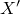
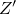
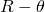
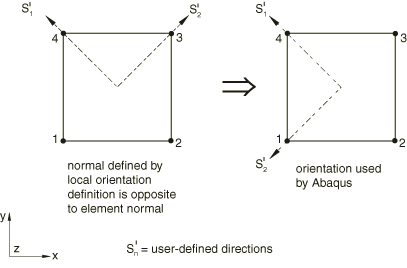

# 2.2.5 方向


**产品：** Abaqus/Standard  Abaqus/Explicit  Abaqus/CAE  

##### **参考文献**

- ["分布定义，" 第2.8.1节](pt01ch02s08aus26.md)
- ["材料库：概述，" 第21.1.1节](pt05ch21s01abo18.md)
- ["材料数据定义，" 第21.1.2节](pt05ch21s01aus109.md)
- ["织物材料行为，" 第23.4.1节](pt05ch23s04abm35.md)
- ["分布荷载，" 第34.4.3节](pt07ch34s04aus122.md)
- ["运动学耦合约束，" 第35.2.3节](pt08ch35s02aus131.md)
- ["耦合约束，" 第35.3.2节](pt08ch35s03aus133.md)
- ["惯性释放，" 第11.1.1节](pt04ch11s01at37.md)
- [*ORIENTATION](../key/key-link.md#usb-kws-morientation)
- ["创建基准坐标系统，" 《Abaqus/CAE用户指南》第62.9节](../usi/usi-link.md#usi-dtm-csys)

### 概述

用户定义的方向用于定义局部坐标系，用于：
- 材料属性定义——例如，各向异性材料或节理材料（如果为实体单元定义了各向异性材料属性，则必须定义局部坐标系）；
- 局部材料方向定义，例如织物材料的平面填充和翘曲纱线方向或各向异性超弹性材料的纤维方向；
- 在壳、膜和表面单元中定义钢筋；
- 定义转动惯量和连接器单元；
- 定义耦合约束；
- 定义分布一般牵引力、剪切牵引力和一般边缘荷载的加载方向；
- 在Abaqus/Standard中定义接触的局部切线方向；
- 积分点的材料计算；
- 应力、应变和单元截面力分量的输出；以及
- 在Abaqus/Standard中定义惯性释放的刚体运动方向局部系统。

用户定义的方向不能用于：
- 在使用Abaqus/Standard中模糊裂缝混凝土材料行为（["混凝土模糊裂缝，" 第23.6.1节](pt05ch23s06abm37.md)）的点上；
- 指定用于定义节点坐标的局部坐标系——请参阅["指定用于定义节点的局部坐标系" in "节点定义，" 第2.1.1节](pt01ch02s01aus05.md#usb-int-inode-system-option)，或["为节点坐标指定局部坐标系" in "节点定义，" 第2.1.1节](pt01ch02s01aus05.md#usb-int-inode-define-csys)，而是；或
- 指定用于施加荷载和边界条件的局部坐标系——请参阅["转换坐标系，" 第2.1.5节](pt01ch02s01aus09.md)，而是。

由于所建模结构的形状和构造，该局部系统通常必须随点变化，因此在定义局部系统的方式上提供了相当大的通用性。您可以直接定义局部方向。Abaqus中提供的直接数据方法旨在提供足够的通用性以轻松建模大多数情况：它们对于规则几何特别有用。分布（["分布定义，" 第2.8.1节](pt01ch02s08aus26.md)）可用于为任意几何形状的实体连续体、壳和膜（在Abaqus/Standard中）单元直接定义空间变化的局部坐标系。

在Abaqus/Standard中，您可以在用户子程序[`ORIENT`](../sub/sub-link.md#sub-xsl-orient)中定义局部方向。

### 为方向分配名称

您必须为每个方向定义分配一个名称。此名称被各种功能引用方向定义。

| **输入文件用法：** | ``` [*ORIENTATION](../key/key-link.md#usb-kws-morientation), NAME=*name* ``` |
| --- | --- |

| **Abaqus/CAE用法：** | 任意模块：****工具****基准****: **类型**： **CSYS**：选择任意方法，然后点击**确定**： **名称：** *name* |
| --- | --- |

### 在包含部件实例装配的模型中定义局部坐标系

在以部件实例装配形式定义的模型中，您可以在部件、部件实例或装配级别定义局部方向。在部件或部件实例级别定义的方向根据为该部件的每个实例（或部件实例）给出的定位数据进行旋转。这包括使用分布定义方向的情况。请参阅["定义装配，" 第2.10.1节](pt01ch02s10aus28.md)和["分布定义，" 第2.8.1节](pt01ch02s08aus26.md)。

### 直接定义局部坐标系

使用两阶段过程直接定义局部系统。

1. 您需要在需要它的特定位置定义局部坐标系。您可以选择矩形、圆柱或球坐标系。坐标系根据点*a*、*b*和*c*定义，如图2.2.5-1所示。您可以选择定义点*a*、*b*和*c*的方法，如下所述。
**图2.2.5-1** 方向系统。


2. 可选地，您可以通过识别这些局部方向之一（、或）作为旋转轴并给出绕该轴的旋转角度（以度为单位）来指定额外旋转。然后局部系统绕指定轴旋转此角度。此定义局部系统的方法适用于Abaqus/Standard中的接触曲面、壳、膜、垫片单元，以及当方向与复合实体截面关联时。额外旋转如图2.2.5-2所示。
**图2.2.5-2** 为壳单元、膜单元、垫片单元（括号中）、复合实体（括号中）和Abaqus/Standard中的接触曲面指定绕局部轴的旋转。

复合实体的局部坐标系由、和指示。其他单元类型的局部坐标系由1、2和3指示；括号中的轴标签为垫片单元定向。

#### 可用的坐标系

提供矩形、圆柱和球坐标系。

##### 定义矩形坐标系

矩形笛卡尔坐标系如图2.2.5-1(a)所示。矩形坐标系是默认的。或者，您可以如图2.2.5-1(d)所示定义矩形笛卡尔坐标系。

| **输入文件用法：** | ``` [*ORIENTATION](../key/key-link.md#usb-kws-morientation), NAME=*name*, SYSTEM=RECTANGULAR ``` |
| --- | --- |
|  | ``` [*ORIENTATION](../key/key-link.md#usb-kws-morientation), NAME=*name*, SYSTEM=Z RECTANGULAR ``` |

| **Abaqus/CAE用法：** | 任意模块：****工具****基准****: **类型**： **CSYS**：选择任意方法，然后点击**确定**： **矩形** |
| --- | --- |

##### 定义圆柱坐标系

圆柱坐标系如图2.2.5-1(b)所示。局部轴为=径向，=切向，=轴向。

| **输入文件用法：** | ``` [*ORIENTATION](../key/key-link.md#usb-kws-morientation), NAME=*name*, SYSTEM=CYLINDRICAL ``` |
| --- | --- |

| **Abaqus/CAE用法：** | 任意模块：****工具****基准****: **类型**： **CSYS**：选择任意方法，然后点击**确定**： **圆柱** |
| --- | --- |

##### 定义球坐标系

球坐标系如图2.2.5-1(c)所示。局部轴为=径向，=周向，=子午线。

| **输入文件用法：** | ``` [*ORIENTATION](../key/key-link.md#usb-kws-morientation), NAME=*name*, SYSTEM=SPHERICAL ``` |
| --- | --- |

| **Abaqus/CAE用法：** | 任意模块：****工具****基准****: **类型**： **CSYS**：选择任意方法，然后点击**确定**： **球面** |
| --- | --- |

#### 定义坐标系的方法

您可以通过直接指定点*a*、*b*和*c*的位置；通过相对于全局节点编号指定点*a*、*b*和*c*的位置；通过相对于局部节点编号指定点*a*、*b*和*c*的位置；通过从另一个坐标系指定偏移来定义坐标系；或通过指定坐标系中的两条线。

##### 通过直接指定点*a*、*b*和*c*的位置来定义坐标系

您可以直接指定点*a*、*b*和*c*的坐标。这些坐标应适合所选系统。此方法是默认方法。

您可以通过指定位于-平面上的三个点（*a*、*b*和*c*）来定义矩形笛卡尔坐标系，如图2.2.5-1(a)所示。点*c*是系统的原点，点*a*必须位于轴上，点*b*必须位于-平面上。虽然不是必须的，但直观上选择点*b*使其位于或接近局部轴附近是合理的。

或者，在Abaqus/Standard中，您可以通过指定位于-平面上的三个点（*a*、*b*和*c*）来定义矩形笛卡尔坐标系，如图2.2.5-1(d)所示。点*c*是系统的原点，点*a*必须位于轴上，点*b*必须位于-平面上。虽然不是必须的，但直观上选择点*b*使其位于或接近局部轴附近是合理的。

对于矩形坐标系，原点（点*c*）的默认位置是全局原点。

您通过给出圆柱系统极轴上的两个点*a*和*b*来定义圆柱坐标系，如图2.2.5-1(b)所示。

您通过给出球面系统的中心*a*和极轴上的点*b*来定义球坐标系，如图2.2.5-1(c)所示。

要直接在实体连续体和壳单元上定义空间变化的局部坐标系，您可以使用分布在每个单元的基础上指定点*a*和*b*的坐标。目前不支持使用分布定义可选点*c*的坐标。请参阅["分布定义，" 第2.8.1节](pt01ch02s08aus26.md)。

| **输入文件用法：** | ``` [*ORIENTATION](../key/key-link.md#usb-kws-morientation), NAME=*name*, DEFINITION=COORDINATES ``` |
| --- | --- |

| **Abaqus/CAE用法：** | 任意模块：****工具****基准****: **类型**： **CSYS**， **方法**： **3点** |
| --- | --- |

##### 通过给出点*a*、*b*和*c*的全局节点编号来定义坐标系

您可以通过指定三个全局节点编号来定位点*a*、*b*和*c*。对于矩形坐标系，原点（点*c*）的默认位置是全局原点。

| **输入文件用法：** | ``` [*ORIENTATION](../key/key-link.md#usb-kws-morientation), NAME=*name*, DEFINITION=NODES ``` |
| --- | --- |

| **Abaqus/CAE用法：** | 您不能在Abaqus/CAE中通过给出全局节点编号来定义坐标系。 |
| --- | --- |

##### 通过给出点*a*、*b*和*c*的局部节点编号来定义坐标系

您可以通过指定单元的局部节点编号来定位点*a*、*b*和*c*。局部节点编号是指节点在单元连通性中指定的顺序。例如，局部节点编号2对应于为单元定义指定的第二个节点。此定义方法允许使用单个方向定义在每个单元的基础上变化局部坐标系。例如，如果将局部节点编号2给为点*c*的位置，将局部节点编号3给为点*a*的位置，则局部方向被定义为平行于单元的(2, 3)边。默认情况下，局部坐标系的原点（点*c*）是单元的第一个节点（局部节点编号1）。

| **输入文件用法：** | ``` [*ORIENTATION](../key/key-link.md#usb-kws-morientation), NAME=*name*, DEFINITION=OFFSET TO NODES ``` |
| --- | --- |

| **Abaqus/CAE用法：** | 您不能在Abaqus/CAE中通过给出局部节点编号来定义坐标系。 |
| --- | --- |

##### 通过给出从另一个坐标系的偏移来定义坐标系

您可以通过从现有坐标系指定偏移来定义坐标系。

| **输入文件用法：** | 您不能在输入文件中通过给出从另一个坐标系的偏移来定义坐标系。 |
| --- | --- |

| **Abaqus/CAE用法：** | 任意模块：****工具****基准****: **类型**： **CSYS**： **从CSYS偏移** |
| --- | --- |

##### 通过给出两条边来定义坐标系

您可以通过指定两条边来定义坐标系。第一条边定义*X*-或*R*轴，*X–Y*或平面通过第二条边。

| **输入文件用法：** | 您不能在输入文件中通过给出两条边来定义坐标系。 |
| --- | --- |

| **Abaqus/CAE用法：** | 任意模块：****工具****基准****: **类型**： **CSYS**： **2线** |
| --- | --- |

### 为各向异性超弹性材料定义局部材料方向

当使用基于不变量的公式（["基于不变量的公式" in "各向异性超弹性行为，" 第22.5.3节](pt05ch22s05abm09.md#usb-mat-canisohyperelastic-invbased)）对各向异性超弹性材料进行建模时，必须定义表征每族纤维的局部方向。这些方向在初始配置中不必正交。您可以相对于材料点处的正交方向系统在材料点处指定这些局部方向。最多可以指定三个局部方向作为局部方向系统定义的一部分。局部方向可以作为场变量输出到输出数据库（请参阅["输出" in "各向异性超弹性行为，" 第22.5.3节](pt05ch22s05abm09.md#usb-mat-canisohyperelastic-output)）。

| **输入文件用法：** | 使用以下选项定义正交系统和*N*个相对于该系统的局部方向，以识别各向异性超弹性材料的首选方向： |
| --- | --- |
|  | ``` [*ORIENTATION](../key/key-link.md#usb-kws-morientation), LOCAL DIRECTIONS=*N* ``` |

| **Abaqus/CAE用法：** | 局部材料方向不能在Abaqus/CAE中定义。 |
| --- | --- |

### 定义织物材料参考配置中的纱线方向

通常，织物材料中的纱线方向在参考配置中可能彼此不正交（请参阅["织物材料行为，" 第23.4.1节](pt05ch23s04abm35.md)）。您可以相对于材料点处正交方向系统的面内轴来指定这些局部方向。局部方向和正交系统一起被定义为单个方向定义。如果未指定局部方向，则这些方向假定与所定义正交系统的面内轴匹配。局部方向在变形时可能保持不正交。Abaqus随变形更新局部方向，并计算这些方向上的名义应变以及它们之间的角度（织物剪切应变）。织物的本构行为根据织物应变在局部系统中定义名义应力。局部方向可以作为场变量输出到输出数据库（请参阅["输出" in "织物材料行为，" 第23.4.1节](pt05ch23s04abm35.md#usb-mat-cfabric-output)）。

| **输入文件用法：** | 使用以下选项定义正交系统和相对于该系统的局部方向，以识别参考配置中的纱线方向： |
| --- | --- |
|  | ``` [*ORIENTATION](../key/key-link.md#usb-kws-morientation), LOCAL DIRECTIONS=2 ``` |

| **Abaqus/CAE用法：** | 织物材料的纱线方向不能在Abaqus/CAE中定义。 |
| --- | --- |

### 在Abaqus/Standard中使用用户子程序定义局部坐标系

在某些情况下，指定局部系统的最简单方法是使用用户子程序。Abaqus/Standard中提供了用户子程序[`ORIENT`](../sub/sub-link.md#sub-xsl-orient)。在这种情况下，每次需要方向定义时都会调用用户子程序。在以部件实例装配形式定义的模型中，用户子程序[`ORIENT`](../sub/sub-link.md#sub-xsl-orient)定义的局部方向必须相对于装配的坐标系定义。

| **输入文件用法：** | ``` [*ORIENTATION](../key/key-link.md#usb-kws-morientation), NAME=*name*, SYSTEM=USER ``` |
| --- | --- |

| **Abaqus/CAE用法：** | 只要允许用户定义的方向，您就可以输入在用户子程序[`ORIENT`](../sub/sub-link.md#sub-xsl-orient)中定义的方向名称。 |
| --- | --- |

### 对方向定义的多次引用

由于方向独立于材料定义，并且它们都可以在任何单元属性定义中引用，因此描述复杂结构组件（如层压复合壳）的能力非常通用且易于使用。

方向定义可以根据需要使用任意多次，并与不同的材料或单元类型定义一起使用；例如，它可用于壳的不同层，其中方向相同。

### 大位移考虑

在大位移分析中，用户定义的方向随材料点的平均刚体运动、方向与ROTAXIAL单元一起使用时的刚体、JOINTC单元中关节的第一个节点、管道-土壤相互作用单元的管道边缘、Abaqus/Standard中接触的适当表面、或方向与耦合约束一起使用时的参考节点一起旋转。但是，当方向在Abaqus/Standard中与弹簧、阻尼器或垫片单元一起定义时，局部方向始终在空间中保持固定。

由于材料方向随材料点的平均刚体运动旋转，如果剪切变形很大，使用各向异性弹性对非真正连续体的材料进行建模可能会产生显著误差。例如，轮胎加固带中的单个纤维可以相对于其他方向的纤维相对容易地剪切。纤维随材料点的实际变形旋转，而不是随平均刚体运动旋转。在这种情况下，各向异性行为更适合用钢筋或织物材料建模。Abaqus/Explicit中的织物材料模型将当前纱线方向跟踪为相对于正交坐标系统的局部方向。

### 与二维实体单元一起使用

当用户定义的方向与平面应力、平面应变或无扭转轴对称单元等二维实体单元一起使用时，方向必须仅重新定义*X*-和*Y*方向：第三个方向必须保持不变（平面应变和平面应力单元的*Z*方向，轴对称单元的方向）。当用户定义的方向与带扭转的轴对称单元的材料行为一起使用时，所有三个方向都可以重新定义。对于轴对称单元，包括CGAX和CAXA单元系列，全局1-、2-和3方向分别是径向、轴向和周向。仅当局部方向位于全局3-或周向方向时，圆柱或球方向才可能适用于轴对称单元。

### 与壳、膜或垫片单元或接触曲面一起使用

当用户定义的方向与壳、膜或垫片单元或接触曲面一起使用时，Abaqus首先按照本节描述的算法旋转，然后将方向系统投影到单元或接触曲面上。

Abaqus首先（通过额外旋转角度）绕指定旋转轴旋转用户定义的局部坐标系。如果您未指定旋转轴或额外角度，Abaqus默认使用局部1轴和0旋转。旋转后，Abaqus遵循轴的循环排列(1, 2, 3)，并将用于额外旋转的轴投影到接触曲面或单元表面上，以形成局部材料1方向（对于垫片为局部材料2方向）。剩余的材料方向然后由单元法向和投影方向的叉积定义。因此，例如：

1. 如果您选择用户定义的1轴作为额外旋转的轴，Abaqus将2轴投影到单元或接触曲面上。这将是接触曲面、壳和膜的局部方向1，垫片的局部方向2。
2. Abaqus将正的单元或接触曲面法向作为接触曲面、壳和膜的局部3方向，垫片的局部1方向。
3. Abaqus通过取单元或接触曲面法向与局部1方向（垫片的2方向）的叉积来计算局部2方向（垫片的3方向），使得三个局部轴形成正交右手局部坐标系。

当额外旋转的轴指向与单元或接触曲面法向相反的方向时，局部2方向（垫片的3方向）相对于相应的用户定义轴反向；请参见图2.2.5-3。这不适用于用于定义钢筋的方向；见下文。

**图2.2.5-3** 局部3方向（垫片的1方向）将与单元或接触曲面法向位于相同方向。



例如，图2.2.5-4所示圆柱壳的螺旋缠绕层的方向将通过定义圆柱坐标系然后将旋转轴指定为1轴并给出旋转角度（以度为单位）来给出。材料属性规范和材料计算的局部1和2方向将是图中所示的那些。

**图2.2.5-4** 螺旋缠绕圆柱壳层：材料方向示例。


当额外旋转的轴大致垂直于单元或接触曲面时，投影方向最容易理解。

要直接在实体连续体和壳单元以及Abaqus/Standard中的膜单元上定义空间变化的局部坐标系，您可以使用分布在每个单元的基础上指定额外的旋转角度。请参阅["分布定义，" 第2.8.1节](pt01ch02s08aus26.md)。

#### 在壳、膜和表面单元中定义钢筋

壳、膜和表面单元中偏斜钢筋的方向可以相对于用户定义的方向定义（请参阅["定义钢筋，" 第2.2.3节](pt01ch02s02aus13.md)）。在这种情况下，局部坐标系计算如下：

1. 局部1方向遵循额外旋转方向的循环排列；例如，如果您选择用户定义的1轴作为额外旋转的轴，Abaqus将2轴投影到单元上。这将是局部1方向。
2. 额外旋转的轴被制成与单元正交以创建局部3方向。此局部3方向不必与单元法向位于相同方向；事实上，当额外旋转轴与单元法向的点积为负时，它将位于相反方向。
3. Abaqus通过取局部3方向和局部1方向的叉积来计算局部2方向，使得三个局部轴形成正交右手局部坐标系。

由于局部3方向可能与单元法向相反，钢筋的定义与单元连通性无关。

#### 在Abaqus/Standard中接触曲面上定义方向时的特别注意事项

当用户定义的方向用于定义Abaqus/Standard中三维接触对曲面上的局部切线方向时（请参阅["Abaqus/Standard中的接触公式，" 第38.1.1节](pt09ch38s01aus177.md)），您不能通过给出局部节点编号来定义点*a*和*b*（请参见图2.2.5-1）。

对于几何非线性分析，接触对的局部切线方向随着最初定义方向的曲面旋转。这些旋转的局部切线方向进一步旋转以确保使用旋转的局部切线方向的叉积计算的法向矢量对应于从节点接触主曲面时的法向矢量。

可以为在三维梁、桁架或管道单元上定义的"线"型从曲面定义任意局部切线方向。当此曲面在大位移分析中与主曲面接触时，局部切线方向被投影到主曲面上。

### 与层压壳一起使用

有两种方法可以在层压壳的截面定义中使用用户定义的方向。在每种情况下，壳截面定义中引用的名称是用户定义方向的名称。

第一种是将用户定义的方向与整个复合壳截面定义关联。然后可以将每层的方向角相对于此截面方向给出（如果没有使用截面方向，则为默认壳坐标方向）。角度作为壳法向方向投影到壳表面后的额外旋转给出。截面力（仅从Abaqus/Standard可用）在为截面指定的局部系统中给出。

第二种是分别指定每层方向的名称；此方法允许为不同层引用不同的方向定义。截面力和应变仍在为整个截面定义的局部方向中报告（如果没有使用截面方向，则为默认壳坐标方向）。单个层方向用于材料计算以及应力和应变输出。

请参阅["使用在分析期间集成的壳截面来定义截面行为，" 第29.6.5节](pt06ch29s06alm19.md)和["使用通用壳截面定义截面行为，" 第29.6.6节](pt06ch29s06alm20.md)，了解更多相关信息。

### 与层压三维实体单元一起使用

当用户定义的方向与复合实体单元（仅在Abaqus/Standard中可用）一起使用时，必须将其中一个局部方向标识为额外旋转的轴。有两种方法可以使用此方向与复合实体截面定义来指定各层的材料方向。在每种情况下，实体截面定义中引用的名称是用户定义方向的名称。

第一种是将用户定义的方向与整个复合实体截面定义关联。然后可以将每层的方向角相对于此截面方向给出。角度作为绕定义为额外旋转轴的局部方向的额外旋转给出。

第二种是分别指定每层方向的名称；此方法允许为不同层引用不同的方向定义。（在这种情况下，与整个实体截面关联的任何用户定义方向将被忽略。）

请参阅["定义单元的截面属性" in "实体（连续体）单元，" 第28.1.1节](pt06ch28s01alm01.md#usb-elm-esolidcont-secprops)，了解更多相关信息。

### 与管道-土壤相互作用单元一起使用

可以为管道-土壤相互作用单元（仅在Abaqus/Standard中可用）定义任意用户定义的方向。在大位移分析中，局部方向系统随底层管道的刚体运动旋转。在小位移分析中，局部系统由PSI单元的初始几何定义，在分析过程中保持固定在空间中。

### 与梁、框架和桁架单元一起使用

有关为梁、框架或桁架定义局部材料方向的信息，请参阅["梁单元横截面方向，" 第29.3.4节](pt06ch29s03alm09.md)。

### 与织物材料模型一起使用

织物平面中的填充和翘曲纱线方向允许在剪切变形下相对于彼此旋转（["织物材料行为，" 第23.4.1节](pt05ch23s04abm35.md)）。当前纱线方向相对于也随材料旋转的正交坐标系统进行跟踪。

### 与节理材料模型一起使用

当用户定义的方向用于为Abaqus/Standard中可用的节理材料模型（["节理材料模型，" 第23.5.1节](pt05ch23s05abm36.md)）定义节理系统方向时，只需定义局部坐标系。假设第一个方向是垂直于节理平面的方向，其他方向位于节理平面内。不能使用额外的旋转轴。

### 与转动惯量和连接器单元一起使用

用户定义的方向必须用于定义用于定义连接器单元的某些连接类型的局部方向（请参阅["连接类型库，" 第31.1.5节](pt06ch31s01aus114.md)）。

用户定义的方向可以与SPRING1、SPRING2、DASHPOT1、DASHPOT2、JOINTC、JOINT2D、JOINT3D和ROTAXIAL单元一起使用，以提供用于定义此类单元作用方向的局部系统。当方向用于这些单元时，不能通过给出局部节点编号来定义点*a*、*b*和*c*（请参见图2.2.5-1）。如果您未指定额外旋转的轴，则将选择无额外旋转的局部1方向作为默认值。

### 与运动学耦合约束一起使用

用户定义的方向可在Abaqus/Standard中用于定义运动学耦合约束（请参阅["运动学耦合约束，" 第35.2.3节](pt08ch35s02aus131.md)）中指定约束方向的局部坐标系。在这种情况下，您不能通过给出局部节点编号来定义点*a*、*b*和*c*（请参见图2.2.5-1）。

### 与基于曲面的耦合约束一起使用

用户定义的方向可用于定义基于曲面的耦合约束（请参阅["耦合约束，" 第35.3.2节](pt08ch35s03aus133.md)）中指定约束方向的局部坐标系。在这种情况下，您不能通过给出局部节点编号来定义点*a*、*b*和*c*（请参见图2.2.5-1）。

### 与惯性释放一起使用

用户定义的方向可在Abaqus/Standard中用于定义计算惯性释放荷载的方向局部系统（请参阅["惯性释放，" 第11.1.1节](pt04ch11s01at37.md)）。在这种情况下，您不能通过给出局部节点编号来定义点*a*、*b*和*c*（请参见图2.2.5-1）。

### 与分布一般牵引力、剪切牵引力和一般边缘荷载一起使用

用户定义的方向可用于在Abaqus中定义指定分布一般牵引力、剪切牵引力和一般边缘荷载的加载方向的局部坐标系。请参阅["分布荷载，" 第34.4.3节](pt07ch34s04aus122.md)。

### 使用分布定义的方向

使用分布定义的空间变化的局部坐标系（用于材料定义、材料计算和输出）只能应用于实体连续体、膜（在Abaqus/Standard中)和壳单元。请参阅["实体（连续体）单元，" 第28.1.1节](pt06ch28s01alm01.md)；["膜单元，" 第29.1.1节](pt06ch29s01alm05.md)；["使用在分析期间集成的壳截面定义截面行为，" 第29.6.5节](pt06ch29s06alm19.md)；和["使用通用壳截面定义截面行为，" 第29.6.6节](pt06ch29s06alm20.md)。

### 输出

当用户定义的方向用于单元截面定义时，应变和单元截面力分量在局部系统中输出。

对于织物材料，即使局部纱线方向不正交，常规材料点张量（如应力和应变）的输出也在正交坐标系中给出。但是，名义织物应力SFABRIC和名义织物应变EFABRIC也可用于输出（请参阅["织物材料行为，" 第23.4.1节](pt05ch23s04abm35.md)）。

这种局部系统的使用在Abaqus/Standard的打印输出表中用脚注指示。与节理材料模型一起使用的方向不影响输出。

当用户定义的方向在Abaqus/Standard中与运动学或分布耦合约束一起使用时，局部系统在分析输入文件处理器输出表中指示。

局部坐标系自动写入输出数据库，但通过相对于局部或全局节点编号指定点*a*和*b*或通过用户子程序定义的系统除外。任何指定的额外旋转都将被忽略。

材料方向自动写入输出数据库。它们也可以写入Abaqus/Standard结果文件（至少指定了一个输出变量；请参阅["输出到数据和结果文件，" 第4.1.2节中的"输出局部方向到结果文件"](pt02ch04s01aus39.md#usb-out-oprintfile-results-directions)）。材料方向可以通过在可视化模块中选择****绘图****材料方向****在Abaqus/CAE中进行可视化。

