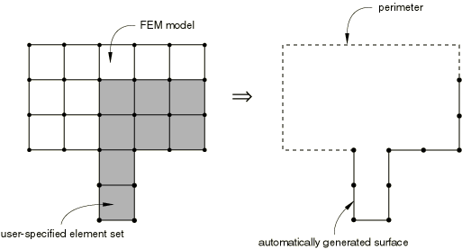
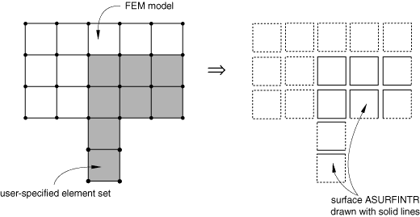
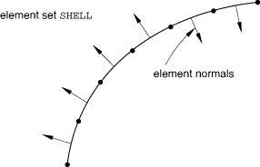
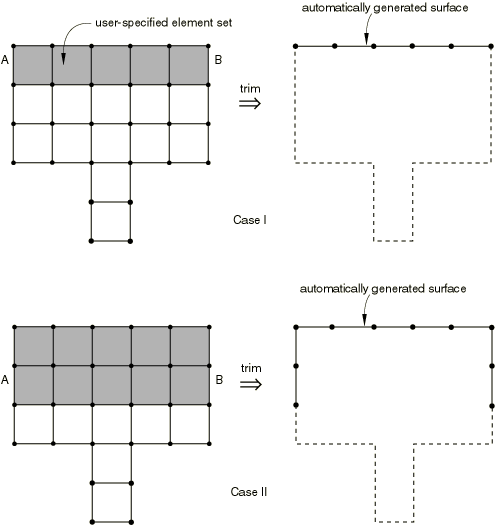

# 2.3.2 基于单元的表面定义


**产品：** Abaqus/Standard  Abaqus/Explicit  Abaqus/CAE  

##### **参考文献**

- ["表面：概述，" 第2.3.1节](pt01ch02s03aus16.md)
- ["集成输出截面定义，" 第2.5.1节](pt01ch02s05aus23.md)
- ["分布荷载，" 第34.4.3节](pt07ch34s04aus122.md)
- ["预定义装配荷载，" 第34.5.1节](pt07ch34s05aus127.md)
- ["网格绑定约束，" 第35.3.1节](pt08ch35s03aus132.md)
- ["耦合约束，" 第35.3.2节](pt08ch35s03aus133.md)
- ["壳到实体耦合，" 第35.3.3节](pt08ch35s03aus134.md)
- ["接触相互作用分析：概述，" 第36.1.1节](pt09ch36s01abo33.md)
- ["腔体辐射，" 第41.1.1节](pt09ch41s01aus187.md)
- [*SURFACE](../key/key-link.md#usb-kws-msurface)
- ["什么是表面？" 《Abaqus/CAE用户指南》第73.2.3节](../usi/usi-link.md#usi-set-conc-surface)

### 概述

基于单元的表面：
- 可以在实体、结构、刚性、表面、垫片或声学单元上定义；
- 可以是可变形或刚性的；
- 在许多情况下可以由元素的任意组合定义；
- 可以在任何实体的外部定义；以及
- 可以在任何用连续体、壳、膜、表面、梁、管道、桁架或刚性单元建模的实体内部定义（例如，通过简单地在平面上切割实体或识别单元及相应内部面来定义通过实体的横截面）。

有关定义基于节点的表面的详细信息，请参阅["基于节点的表面定义，" 第2.3.3节](pt01ch02s03aus18.md)。有关定义解析刚性表面的详细信息，请参阅["解析刚性表面定义，" 第2.3.4节](pt01ch02s03aus19.md)。有关使用现有表面的布尔组合定义表面的详细信息，请参阅["表面操作，" 第2.3.6节](pt01ch02s03aus21.md)。

### 定义基于单元的表面

您必须为所有基于单元的表面分配一个名称；此名称可用于各种功能来定义接触模型、基于表面的荷载或基于表面的约束。此外，您必须指定表面上定义的模型区域。在输入文件中，您可以在单元面、边缘或端部上定义基于单元的表面。在Abaqus/CAE中，您可以在几何或单元面、边缘或端部上定义基于单元的表面。定义表面的方法取决于底层单元类型，在本节后面讨论。

在输入文件中，您只需指定单元编号或单元集名称，这些单元的所有暴露单元面（或梁、管道和桁架单元的"接触边缘"）都将包含在表面。可选地（并且在Abaqus/CAE中是唯一可用的方法），您可以指定单个面、边缘或端部，这使您能够直接控制哪些面、边缘或端部将包含在表面。

对于Abaqus/Explicit中的通用接触，表面周长边缘从表面小平面自动生成，用于边缘到边缘接触约束；您也可以指定包含几何特征边缘（请参阅["在Abaqus/Explicit中定义通用接触相互作用，" 第36.4.1节](pt09ch36s04aus155.md)，和["在Abaqus/Explicit中为通用接触分配表面属性，" 第36.4.2节](pt09ch36s04aus156.md)，了解更多相关信息）。

| **输入文件用法：** | ``` [*SURFACE](../key/key-link.md#usb-kws-msurface), NAME=*surface_name*, TYPE=ELEMENT (默认) ``` |
| --- | --- |
|  | 元素编号或单元集名称被指定为每行数据的第一个条目。可选地，单元面、边缘或端部标识符可以被指定为数据行上的第二个条目。Abaqus中使用的面和边缘标识符在本节后面讨论。多个数据行可用于定义表面。例如，`SURF_1`可以通过以下输入指定： ``` [*SURFACE](../key/key-link.md#usb-kws-msurface), NAME=SURF_1, TYPE=ELEMENT ELSET_1, ELSET_2, S2 ``` |

| **Abaqus/CAE用法：** | 除Sketch、Job和Visualization外的任何模块：****工具****表面****创建****: **名称：** *surface_name* |
| --- | --- |

### 基于单元表面的一般限制

定义单个表面的单元必须满足以下规则，无论表面在Abaqus中如何使用的：
- 二维、轴对称和三维单元不能在同一个表面定义中混合使用。
- 在Abaqus/Standard中，可变形单元不能与刚性单元组合来定义单个表面，但可以与作为刚体一部分的其他可变形单元组合（请参阅["刚体定义，" 第2.4.1节](pt01ch02s04aus22.md)）。
- 以下单元类型不能与同一表面定义中的其他单元类型混合使用：
  - 耦合热-电-结构单元
  - 耦合温度-位移单元
  - 热传递单元
  - 孔隙压力单元
  - 耦合热-电单元
  - 声学有限或无限单元
- 具有非线性非对称变形的轴对称实体傅里叶单元（CAXA单元）不能形成基于单元的表面。

### 表面离散化

对于基于单元的表面，Abaqus使用由有限元网格定义的小平面几何作为表面定义。在粗糙有限元模型中，如果物理表面是弯曲的，表面可能不是非常好的接触建模近似。因此，必须使用足够的网格细化以确保小平面表面是弯曲物理表面的合理近似。或者，某些弯曲表面几何可能更适合用解析刚性表面建模（请参阅["解析刚性表面定义，" 第2.3.4节](pt01ch02s03aus19.md)）。

### 在实体、连续体壳和内聚单元上创建表面

有三种方法可以在实体、连续体壳和内聚单元上定义基于单元表面的面：

1. 指示Abaqus从单元的暴露面生成"自由表面"，
2. 为每个单元指定特定的面，以及
3. 在Abaqus/Explicit中指示Abaqus从非暴露的单元面（即，不属于模型"自由表面"的面）生成内部表面。

自动自由表面生成方法是定义实体单元外部表面最简单的方法。指定单元面使您能够精确控制哪些单元面（外部和内部面的任意组合）形成表面。自动生成内部表面是定义实体单元内部表面最简单的方法（内部表可用于建模因单元失效导致的表面侵蚀）。

在创建单个表面时，可以在同一表面定义中使用所有三种方法。

#### 自动生成自由表面

您可以通过指定一系列单元来定义表面的面。这些单元的面位于模型外部（自由）表面上的将包含在表面定义中。

当使用自由表面生成方法定义表面时，指定的单元可以是连续体和结构单元的混合。

涉及暴露表面上节点的多点约束（["广义多点约束，" 第35.2.2节](pt08ch35s02aus130.md)）在自由表面生成期间不被考虑，这可能导致不属于物体外部的面被包含在表面定义中。例如，图2.3.2-1中所示的单元集`REFINED`中的节点用于线性网格细化约束。具有和没有多点约束生成的表面如图所示。

**图2.3.2-1** 多点约束对自动表面生成的影响。


| **输入文件用法：** | ``` [*SURFACE](../key/key-link.md#usb-kws-msurface), NAME=*surface_name*, TYPE=ELEMENT *element number or element set,* ``` |
| --- | --- |
|  | 例如，如果图2.3.2-2中阴影单元集的名称为`ESETA`，则名为`ASURF`的表面由以下内容指定 ``` [*SURFACE](../key/key-link.md#usb-kws-msurface), NAME=ASURF, TYPE=ELEMENT ESETA, ``` |

| **Abaqus/CAE用法：** | 自动自由表面生成方法在Abaqus/CAE中不受支持。 |
| --- | --- |

**图2.3.2-2** 自动自由表面生成。



##### 用于自动自由表面生成的内聚单元的特殊处理

为自动自由表面生成目的定义单元暴露面时，关于内聚单元有以下独特方面：
- 沿着与内聚单元共享节点的界面非内聚单元的面被认为是暴露的。
- 所有内聚单元的顶面和底面被认为是暴露的；内聚单元的侧面永远不被认为是暴露的。

请参阅["使用内聚单元建模，" 第32.5.3节](pt06ch32s05alm42.md)，了解位于内聚单元上或附近的表面示例。

#### 通过指定实体、连续体壳和内聚单元面创建表面小平面

您可以通过识别应包含在表面定义中的单元面来定义表面的面。

| **输入文件用法：** | ``` [*SURFACE](../key/key-link.md#usb-kws-msurface), NAME=*surface_name*, TYPE=ELEMENT *element number or set, face identifier* ``` |
| --- | --- |
|  | 单元面编号在[第六部分，"单元"](pt06.md)中定义。[表2.3.2-1]包含所有实体、连续体壳和内聚单元的有效面标识符列表。面标识符可以引用单个单元或整个单元集。当您指定单元面来定义表面时，指定的单元不能是连续体和结构单元的混合；但是，表面定义的每条数据行可以引用不同的单元类型。 |

| **Abaqus/CAE用法：** | 除Sketch、Job和Visualization外的任何模块：****工具****表面****创建****: **名称：** *surface_name*，在视口中选择面 |
| --- | --- |

**表2.3.2-1** 实体、连续体壳和内聚单元的表面定义面标识符标签。
| 单元 | 面标签 |
| --- | --- |
| DCCAX2(D) | SPOS, SNEG |
| CPEG3(H)(T)CPS3(T)CPE3(H)(T)CAX3(H)(T)CGAX3(H)AC2D3ACAX3 DC2D3(E)DCAX3(E) | CPEG6(M)(H)(T)CPS6M(T) CPE6(M)(H)(T) CAX6(M)(H)(T) CGAX6(M)(H)(T) AC2D6ACAX6 DC2D6(E)DCAX6(E) | S1, S2, S3 |
| CGAX4(R)(H)(T) CPEG4(H)(I)(R)(T) CPS4(I)(R)(T) CPE4(H)(I)(R)(T)(P) CAX4(H)(I)(R)(T)(P) C3D4(H)(T) AC2D4(R) ACAX4(R)AC3D4 DC2D4(E)DCAX4(E)DC3D4(E)DCC2D4(D)COH2D4 | CGAX8(R)(H) CPEG8(R)(H)(T) CPS8(R)(T) CPE8(H)(R)(T)(P) CAX8(R)(H)(T)(P)C3D10(M)(H)(I)(T)AC2D8 ACAX8AC3D10 DC2D8(E) DCAX8(E)DC3D10(E)DCCAX4(D)COHAX4 | S1, S2, S3, S4 |
| C3D6(H)(T) AC3D6CCL9(H) DC3D6(E) SC6R | C3D15(H)(V) AC3D15 CCL18(H) DC3D15(E) COH3D6 | S1, S2, S3, S4, S5 |
| C3D8(H)(I)(R)(T)(P) C3D27(R)(H)AC3D8(R) CCL12(H) DC3D8(E) DCC3D8(D)SC8R | C3D20(H)(R)(T)(P)AC3D20 CCL24(R)(H) DC3D20(E)COH3D8 | S1, S2, S3, S4, S5, S6 |

#### 自动生成内部表面

在Abaqus/Explicit中，您可以在实体单元网格内部定义表面的小平面。不在模型外部（自由）表面的指定单元的面将包含在表面定义中。例如，内部表面与Abaqus/Explicit中的通用接触算法一起用于建模因单元失效导致的表面侵蚀（请参阅["在Abaqus/Explicit中定义通用接触相互作用，" 第36.4.1节](pt09ch36s04aus155.md)）。

内部表面的自动生成等同于构建由单元所有面组成的表面，然后减去这些单元的自由表面。壳单元、梁单元、管道单元、膜单元等被忽略，因为它们根据定义没有任何内部面。

生成内部表面时，不考虑多点约束。这可能导致位于物体内部的面被排除在表面定义之外。

| **输入文件用法：** | ``` [*SURFACE](../key/key-link.md#usb-kws-msurface), NAME=*surface_name*, TYPE=ELEMENT *element number or element set*, INTERIOR ``` |
| --- | --- |
|  | 例如，如果图2.3.2-3中阴影单元集的名称为`ESETA`，则名为`ASURFINTR`的表面（图中单元已缩小以区分共享相同节点的面）由以下内容指定 ``` [*SURFACE](../key/key-link.md#usb-kws-msurface), NAME=ASURFINTR, TYPE=ELEMENT ESETA, INTERIOR ``` |

| **Abaqus/CAE用法：** | 除Sketch、Job和Visualization外的任何模块：****工具****表面****创建****: **名称：** *surface_name*， **类型**： **网格**；从内部表面选择单元面或边缘 |
| --- | --- |
|  | 您可以使用选择工具从模型内部实体中进行选择；请参阅["选择内部表面，" 《Abaqus/CAE用户指南》第6.2.12节](../usi/usi-link.md#uss-pic-interior)。 |

**图2.3.2-3** 自动内部表面生成。



### 在结构、表面和刚性单元上创建表面

有五种方法可以在结构、表面和刚性单元上定义表面：

1. 您可以通过指示每个指定单元的顶面或底面创建具有明确方向性的单侧表面。
2. 您可以通过仅指定单元并让Abaqus从暴露面生成"自由表面"来创建双侧表面。
3. 您可以创建基于边缘的表面。
4. 您可以在梁、管道和桁架单元的端部创建横截面表面。
5. 您可以通过仅指定单元并让Abaqus生成"自由表面"来沿着梁、管道和桁架单元的长度创建三维曲线型表面。

只要在与Abaqus中其他功能一起使用该表面时有意义，可以在同一表面定义中使用上述任何或所有方法。[表2.3.2-2]包含结构、表面和刚性单元的有效面和边缘标识符列表。

**表2.3.2-2** 结构、表面和刚性单元的表面定义面和边缘标识符标签。
| 单元 | 面和边缘标签 |
| --- | --- |
| SAX1 MAX1 MGAX1M3D6M3D9(R)MCL9 DS8 DSAX2SFMAX2 SFMGAX2SFM3D4(R) SFM3D8(R)SFMCL6 | SAX2(T) MAX2MGAX2M3D8(R) MCL6DS4 DSAX1SFMAX1 SFMGAX1SFM3D3SFM3D6SFMCL9 RAX2 | SPOS, SNEG |
| B21(H) B23(H)PIPE21(H) T2D2(H)(T) | B22(H) (Abaqus/Standard)PIPE22(H) T2D3(H)(T) | END1, END2 |
| B22 (Abaqus/Explicit) B32(H)(OS)ELBOW31(B)(C) PIPE31(H)T3D2(H)(T) | B31(H)(OS) B33(H)ELBOW32 PIPE32(H)T3D3(H)(T) | END1, END2；必须在Abaqus/Explicit中使用基于节点的表面与接触对算法。 |
| STRI3 S3(R)(S)M3D3 | STRI65 R3D3 | SPOS, SNEG,E1, E2, E3 |
| ACIN2D2ACINAX2 | ACIN2D3ACINAX3 | SPOS E1, E2 |
| S4(R)(S)(W)(5)S9R5M3D4(R) | S8R5(T) R3D4 | SPOS, SNEG,E1, E2, E3, E4 |
| ACIN3D3 | ACIN3D6 | SPOSE1, E2, E3 |
| ACIN3D4 | ACIN3D8 | SPOS E1, E2, E3, E4 |

#### 定义单侧表面

您可以在结构、表面或刚性单元的正向或负向上定义单侧表面。正向定义为沿正单元法向的方向，负向定义为沿单元法向相反的方向。所有单元的单元法向定义在[第六部分，"单元"](pt06.md)中给出。

您必须确保所有指定单元的法向方向一致。如果它们的方向如图2.3.2-4所示，则表面法向将在表面遍历时反转方向，当表面与需要方向的功能（如分布表面荷载）一起使用时可能会产生错误的结果。

**图2.3.2-4** 结构单元法向方向不一致可能导致表面无效。



此外，如果在Abaqus/Standard中与网格绑定约束或接触对一起使用的表面上检测到这种情况，将发出错误消息并终止分析。为纠正此图中的表面方向，应使用具有不同面标识符的两个单独单元集。

| **输入文件用法：** | 使用以下选项在结构、表面或刚性单元的正向上定义表面： |
| --- | --- |
|  | ``` [*SURFACE](../key/key-link.md#usb-kws-msurface), NAME=*surface_name*, TYPE=ELEMENT *element number or element set*, SPOS ``` 使用以下选项在结构、表面或刚性单元的负向上定义表面： ``` [*SURFACE](../key/key-link.md#usb-kws-msurface), NAME=*surface_name*, TYPE=ELEMENT *element number or element set*, SNEG ``` 例如，可以使用类似以下的输入定义单元集`SHELL`中单元正向上的单侧表面 ``` [*SURFACE](../key/key-link.md#usb-kws-msurface), NAME=BSURF, TYPE=ELEMENT SHELL, SPOS ``` |

| **Abaqus/CAE用法：** | 除Sketch、Job和Visualization外的任何模块：****工具****表面****创建****: **名称：** *surface_name*，在视口中选择面，单击鼠标按钮2，并指定所选面的侧面 |
| --- | --- |

#### 定义双侧表面

您可以使用自动表面小平面生成方法（即，仅指定单元编号或集）在三维壳、膜、表面和刚性单元上创建双侧表面小平面。一些引用表面的应用程序不允许使用双侧表面：例如Abaqus/Standard中的接触对和需要定向表面的功能（如分布表面荷载）。当可以使用双侧表面时，通常比单侧表面更受欢迎。例如，在定义通用接触的接触域时，使用单侧表面还是双侧表面并不重要。

当双侧表面与Abaqus/Explicit中的接触对一起使用时，所有底层单元的法向不需要具有一致的正方向：Abaqus/Explicit将定义接触表面，使其小平面具有一致的法向，即使底层单元不具有一致的法向。如果单元法向都一致，小平面法向将与单元法向相同；否则，将为表面选择任意正方向。正方向仅相对于接触对算法（请参阅["在Abaqus/Explicit中定义接触对，" 第36.5.1节](pt09ch36s05aus160.md#usb-cni-aexpcontactpair-output)中的"输出"）的接触压力输出变量CPRESS的符号是重要的。

尽管当自接触与接触对一起使用时，接触在表面的两侧无条件地被强制执行，但仅当该表面是双侧时（如果允许），接触才在用于两体接触的表面的两侧被强制执行。使用单侧表面与接触对有时是期望的：接触对中大初始过盈度的解决在使用单侧表面时比使用双侧表面更鲁棒（请参阅["调整Abaqus/Explicit中接触对的初始表面位置和指定初始间隙，" 第36.5.4节](pt09ch36s05aus163.md)）。但是，单侧接触通常比双侧接触更受限；如果从节点意外移动到主表面后面， analysis may fail due to excessive element distortion or may not enforce the contact conditions realistically。这种情况可能发生在存在大变形或刚体运动或由于成型分析中的复杂工具形状时。

| **输入文件用法：** | 使用以下选项在Abaqus/Explicit中的三维壳、膜、表面或刚性单元上定义双侧表面： |
| --- | --- |
|  | ``` [*SURFACE](../key/key-link.md#usb-kws-msurface), NAME=*surface_name*, TYPE=ELEMENT *element number or element set*, ``` 例如，可以使用类似以下的输入定义单元集`SHELL`中单元上的双侧表面 ``` [*SURFACE](../key/key-link.md#usb-kws-msurface), NAME=BSURF, TYPE=ELEMENT SHELL, ``` |

| **Abaqus/CAE用法：** | 除Sketch、Job和Visualization外的任何模块：****工具****表面****创建****: **名称：** *surface_name*，在视口中选择面，单击鼠标按钮2，并选择**两侧** |
| --- | --- |

#### 定义基于边缘的表面

您可以通过指定单个边缘在三维壳、膜、表面或刚性单元上定义基于边缘的表面。或者，您可以指定模型外部（自由）表面上位于这些单元上的所有边缘用于形成表面；此方法不能用于定义位于模型内部的基于边缘的表面。在创建单个表面时，可以在同一表面定义中使用这两种方法。

| **输入文件用法：** | 使用以下选项指定形成表面的单个边缘： |
| --- | --- |
|  | ``` [*SURFACE](../key/key-link.md#usb-kws-msurface), NAME=*surface_name*, TYPE=ELEMENT *element number or element set, edge identifier* ``` Abaqus中使用的单个边缘标识符在[表2.3.2-2]中列出。使用以下选项指定模型外部（自由）表面上位于这些单元上的所有边缘用于形成表面： ``` [*SURFACE](../key/key-link.md#usb-kws-msurface), NAME=*surface_name*, TYPE=ELEMENT *element number or element set*, EDGE ``` 例如，如果图2.3.2-2中的阴影单元集由三维壳单元组成并命名为`ESETA`，则名为`ESURF`的表面可以由以下输入指定： ``` [*SURFACE](../key/key-link.md#usb-kws-msurface), NAME=ESURF, TYPE=ELEMENT ESETA, EDGE ``` |

| **Abaqus/CAE用法：** | 除Sketch、Job和Visualization外的任何模块：****工具****表面****创建****: **名称：** *surface_name*，在视口中选择边缘 |
| --- | --- |
|  | 在Abaqus/CAE中，您可以通过直接在视口中选择所有自由边缘来指定模型外部（自由）表面上位于这些单元上的所有边缘用于形成表面。 |

#### 在梁、管道和桁架单元的端部定义横截面表面

要在梁、管道或桁架单元的横截面上定义表面，您必须指定定义表面的端部。在这些单元端部创建的表面只能用于集成输出请求（请参阅["输出到输出数据库，" 第4.1.3节中的"Abaqus/Explicit中的集成输出"](pt02ch04s01aus40.md#usb-out-odboutput-integrated)）和集成输出截面（请参阅["集成输出截面定义，" 第2.5.1节](pt01ch02s05aus23.md)）定义。

| **输入文件用法：** | 使用以下选项在梁、管道或桁架单元的横截面上定义表面： |
| --- | --- |
|  | ``` [*SURFACE](../key/key-link.md#usb-kws-msurface), NAME=*surface_name*, TYPE=ELEMENT *element number or element set*, END1 or END2 ``` |

| **Abaqus/CAE用法：** | 除Sketch、Job和Visualization外的任何模块：****工具****表面****创建****: **名称：** *surface_name*，在视口中选择三维线区域，单击鼠标按钮2，并选择**端部（洋红色）**或**端部（黄色）** |
| --- | --- |

#### 沿着三维梁、管道和桁架单元的长度定义表面

您不能指定面来沿着三维梁、管道或桁架的长度定义表面，因为它们的单元连通性不能定义唯一的单元或表面法向。相反，您必须指定Abaqus应该为这些单元生成表面。因此，这些单元长度上的表面的使用受到限制。

在Abaqus/Standard中，沿着三维梁、管道或桁架单元长度创建的基于单元的表面可以用于绑定约束，但只能作为接触相互作用中的从属表面。但是，在使用三维梁、管道或桁架建模接触时，使用基于单元的表面而非基于节点的表面有几个优点：

1. 默认局部切线方向平行于单元轴并垂直。
2. Abaqus/Standard将接触结果计算为每单位长度的接触力，而不仅仅是接触力。
3. 定义基于单元的表面可能比定义基于节点的表面更容易。

在Abaqus/Standard中，不允许在三个或更多三维梁、管道或桁架在公共节点处连接的情况下定义表面，因为缺乏唯一定义的单元切线。

在Abaqus/Explicit中，沿着三维梁、管道或桁架单元长度创建的基于单元的表面只能与通用接触算法或绑定约束一起使用。要使用接触对算法定义这些单元的接触，形成梁、管道或桁架单元的节点可以包含在基于节点的表面定义中（["基于节点的表面定义，" 第2.3.3节](pt01ch02s03aus18.md)），并且可以为这个基于节点的表面和非基于节点的表面定义接触对。

沿着三维梁、管道或桁架单元长度创建的表面不能用于预定义分布表面荷载，因为加载方向不是唯一的。

| **输入文件用法：** | 使用以下选项沿着三维梁、管道或桁架单元的长度定义表面： |
| --- | --- |
|  | ``` [*SURFACE](../key/key-link.md#usb-kws-msurface), NAME=*surface_name*, TYPE=ELEMENT *element number or element set*, ``` |

| **Abaqus/CAE用法：** | 除Sketch、Job和Visualization外的任何模块：****工具****表面****创建****: **名称：** *surface_name*，在视口中选择三维线区域，单击鼠标按钮2，并选择**周向** |
| --- | --- |

#### 沿着二维梁、管道和桁架单元的长度创建表面

沿着二维梁、管道和桁架单元长度创建的表面可以用作接触对模拟中的主表面，因为底层单元具有位于模型平面中的唯一单元法向。这些表面也可用于预定义分布表面荷载。

#### 壳、膜或刚性单元厚度和壳偏移

一些引用表面的应用程序将考虑基于壳、膜或刚性单元的底层单元厚度以及这些单元的参考表面相对于中面的任何偏移。例如，Abaqus/Explicit中所有接触算法都可以考虑这些效应。在Abaqus/Standard可用的接触算法中，只有表面到表面小滑动接触公式可以考虑这些效应。请参阅以下章节以获取关于可以考虑表面厚度和偏移的应用程序的其他详细信息：
- ["网格绑定约束，" 第35.3.1节](pt08ch35s03aus132.md)
- ["Abaqus/Standard中的接触公式，" 第38.1.1节](pt09ch38s01aus177.md)
- ["在Abaqus/Explicit中为通用接触分配表面属性，" 第36.4.2节](pt09ch36s04aus156.md)
- ["在Abaqus/Explicit中为接触对分配表面属性，" 第36.5.2节](pt09ch36s05aus161.md)

### 在垫片单元上创建表面

当在垫片单元上定义表面时，不能使用自动表面小平面生成，因为只有顶面和底面可用于创建表面（请参阅["垫片单元：概述，" 第32.6.1节](pt06ch32s06abo30.md)）。Abaqus/Standard无法在垫片链接单元上创建表面，因为顶面和底面各自缩减为单个节点。对于其他垫片单元，您必须直接指定顶面和底面。单元的正向在单元的厚度方向上。所有垫片单元的厚度方向定义在["定义垫片单元的初始几何，" 第32.6.4节](pt06ch32s06alm49.md)中给出。负向定义为沿单元厚度方向相反方向的面。

| **输入文件用法：** | 使用以下选项在垫片单元的正向上定义表面： |
| --- | --- |
|  | ``` [*SURFACE](../key/key-link.md#usb-kws-msurface), NAME=*surface_name*, TYPE=ELEMENT *element number or element set*, SPOS ``` 使用以下选项在垫片单元的负向上定义表面： ``` [*SURFACE](../key/key-link.md#usb-kws-msurface), NAME=*surface_name*, TYPE=ELEMENT *element number or element set*, SNEG ``` 例如，可以使用类似以下的输入定义单元集`GASKET`中单元正向上的单侧表面 ``` [*SURFACE](../key/key-link.md#usb-kws-msurface), NAME=BSURF, TYPE=ELEMENT GASKET, SPOS ``` |

| **Abaqus/CAE用法：** | 除Sketch、Job和Visualization外的任何模块：****工具****表面****创建****: **名称：** *surface_name*，在视口中选择顶面或底面 |
| --- | --- |

#### 三维垫片线单元上的表面

在使用三维垫片线单元建模接触时，与基于节点的表面相比，使用基于单元的表面有几个优点：

1. 局部切线方向平行于垫片线单元并垂直，这有利于输出目的和各向异性摩擦定义。
2. Abaqus/Standard将接触结果计算为每单位长度的接触力，而不仅仅是接触力。

只能在三维垫片线单元上创建的基于单元的表面上用作从属表面，因为Abaqus/Standard无法为这些表面形成唯一的法线。

### 创建内部横截面表面

要研究模型中各种路径的"力流"，您必须创建穿过一个或多个组件的内部表面（类似于横截面），以便可以请求通过这些表面传递的总力的集成输出（请参阅["输出到输出数据库，" 第4.1.3节中的"请求'力流'研究的集成输出"](pt02ch04s01aus40.md#usb-out-odboutput-forceflow)）。Abaqus提供了一种简单的方法，通过用平面切割模型区域来在单元小平面、边缘或端部上创建这样的内部表面。该区域可以使用一个或多个单元集来识别。如果未指定单元集，则该区域由整个模型组成。切割平面通过指定平面上的点的坐标和垂直于平面的向量来定义。或者，切割平面可以通过指定平面上点*a*的全局节点编号和位于切割平面外的点*b*（法向确定为从点*a*到点*b*的向量）来定义。然后，Abaqus通过选择所选区域中连续体实体、壳、膜、表面、梁、管道、桁架或刚性单元的单元小平面、边缘或端部，自动形成一个接近指定切割平面的表面。以这种方式生成的表面是切割平面的近似。

在基于切割平面生成内部表面时，多点网格约束被忽略；因此，如果这些约束将不相交的网格缝合在一起在由切割平面切割的区域中，结果可能是表面不连续。当切割平面与梁、管道或桁架单元相交时，整个单元在Abaqus/CAE的可视化模块中显示为表面的一部分。但是，如果此表面用于集成输出，则仅当单元端部位于切割平面法向正侧时，才将来自该单元端部的单元节点力包含在集成输出中。点质量和转动单元、连接器单元、点焊和弹簧单元即使被切割平面切割，也不会成为生成表面的一部分。

| **输入文件用法：** | 使用以下选项通过指定平面上的点的坐标和垂直于平面的向量来定义切割表面： |
| --- | --- |
|  | ``` [*SURFACE](../key/key-link.md#usb-kws-msurface), NAME=*surface_name*, TYPE=CUTTING SURFACE, DEFINITION=COORDINATES ``` 使用以下选项通过指定点*a*和*b*的全局节点编号来定义切割表面： ``` [*SURFACE](../key/key-link.md#usb-kws-msurface), NAME=*surface_name*, TYPE=CUTTING SURFACE, DEFINITION=NODES ``` |

| **Abaqus/CAE用法：** | Abaqus/CAE不支持内部横截面表面。 |
| --- | --- |

### Abaqus/Explicit输入文件中的整个模型自由表面

在Abaqus/Explicit输入文件中，您可以通过指定空白单元集名称和空白面标识符来创建包含模型中所有单元的暴露面（以及梁、管道和桁架单元的"接触边缘"）的表面，但内聚单元除外。这个模型的"自由"表面可以用作裁剪和组合操作的基础表面；无修改的情况下，此表面类似于通用接触中常用的默认全包容表面（请参阅["在Abaqus/Explicit中定义通用接触相互作用，" 第36.4.1节](pt09ch36s04aus155.md)）。

| **输入文件用法：** | ``` [*SURFACE](../key/key-link.md#usb-kws-msurface), NAME=*surface_name*, TYPE=ELEMENT , ``` |
| --- | --- |

| **Abaqus/CAE用法：** | Abaqus/CAE不支持整个模型自动自由表面生成方法。 |
| --- | --- |

### 修剪开放表面的周长

"开放"表面是在二维中具有端部或在三维中具有外边缘的表面。二维表面的端部和三维表面的边缘称为表面的"周长"。由于Abaqus允许将表面仅定义为物体表面的一部分，因此即使在闭合体上定义，它也可能具有周长。Abaqus自动对实体单元网格执行表面"修剪"。您可以在创建表面时更改默认设置，从而对表面的范围进行一些基本控制。

表面修剪：
- 是一种递归过程，从开放表面周长附近移除不良凸角（有关详细信息请参见下面的示例）；
- 对闭合表面（没有端部或边缘的表面）没有影响；
- 自动执行，除非表面在Abaqus/Standard中用作有限滑动模拟中的主表面，或者表面与Abaqus/Explicit中的接触对算法一起使用；
- 只能用于实体单元网格上的外部表面（指定的表面或自动生成的自由表面）；以及
- 对Abaqus/Explicit中与接触对算法一起使用的表面没有影响。

| **输入文件用法：** | 使用以下选项取消自动表面修剪： |
| --- | --- |
|  | ``` [*SURFACE](../key/key-link.md#usb-kws-msurface), TYPE=ELEMENT, NAME=*surface_name*, TRIM=NO ``` |

| **Abaqus/CAE用法：** | Abaqus/CAE中无法取消自动表面修剪。 |
| --- | --- |

#### 表面修剪的效果

最好通过示例来解释表面修剪的效果。图2.3.2-5展示了对在同一个简单二维网格上定义的两种不同表面的修剪效果。

**图2.3.2-5** 案例I：当进行修剪时，面*A*和*B*被移除，因为每个面的一个节点是端节点，另一个是角节点。案例II：当进行修剪时，面*A*和*B*不被移除，因为每个面的一个节点是端节点，但另一个不是角节点。



在案例I中，表面定义由周长上单个单元层组成。使用自动表面小平面生成，生成的默认表面（曲线）包括垂直单元面*A*和*B*，因为这些面位于模型的周长上。修剪案例I中生成的默认表面会消除面*A*和*B*，因为它们的存在导致曲线周长附近出现两个虚假角。

Abaqus使用特殊标准来决定从原始开放曲线中移除面*A*和*B*。如果其一个端节点是端点，并且满足以下任一条件，则移除面：该面的另一个节点是属于曲线上的单元角上的节点，或者面法向与属于曲线的相邻面的法向相差超过30度。成为属于曲线的单元角上的节点意味着是该单元两个不同面的节点，两者都是曲线的一部分。面的移除标准递归应用于曲线定义，直到曲线周长上或附近的所有角都被移除。此过程推广到三维表面定义。

在图2.3.2-5的案例II中，修剪不会导致面*A*和*B*的消除，因为这两个面的端点都不满足上述标准。

#### 为什么Abaqus默认修剪大多数表面

用于施加分布荷载的表面的修剪通常是期望的，因为荷载通常施加在物体的特定侧面上。任何用于施加分布荷载的表面默认将被修剪。

在Abaqus/Standard中，修剪接触或相互作用模拟中的从属表面会产生更准确的接触压力、热通量和电流密度沿表面周长的估计。任何用作接触或相互作用模拟中从属表面的表面默认将被修剪。如果从属表面未修剪，则将为表面角落处的节点分配来自角落周围单元面的额外接触面积，这些面可能从不参与表面之间的相互作用。这些额外的接触面积在这些节点的接触输出变量的估计中引入误差。主表面在小滑动模拟中默认将被修剪；Abaqus/Standard通常会形成更好的近似表面。但是，主表面在有限滑动接触模拟中默认将保持未修剪状态，并且它们应该延伸到距所有预期接触区域足够远的地方。这种做法防止从属表面节点滑离主表面的可能性（请参阅["Abaqus/Standard中与接触建模相关的常见困难，" 第39.1.2节](pt09ch39s01aus184.md)）。

