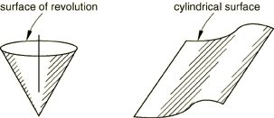
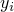
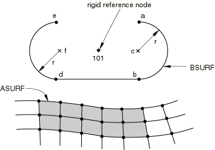
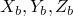
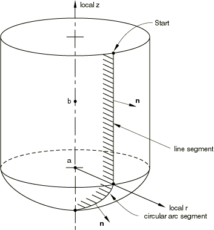

# 2.3.4 解析刚性表面定义


**产品：** Abaqus/Standard  Abaqus/Explicit  Abaqus/CAE  

##### **参考文献**

- ["表面：概述，" 第2.3.1节](pt01ch02s03aus16.md)
- ["接触相互作用分析：概述，" 第36.1.1节](pt09ch36s01abo33.md)
- ["RSURFU，" 《Abaqus用户子程序参考指南》第1.1.16节](../sub/sub-link.md#sub-rtn-ursurfu)
- [*RIGID BODY](../key/key-link.md#usb-kws-mrigidbody)
- [*SURFACE](../key/key-link.md#usb-kws-msurface)

### 概述

解析刚性表面：
- 可以是二维或三维的；
- 必须定义为模型数据；
- 可用于无限滑动、小滑动或有限滑动机械接触公式；
- 应定向为解析刚性表面的外法向指向任何可能接触的物体；以及
- 与一个节点（称为刚体参考节点）关联，该节点的运动控制表面的运动。

### 什么是解析刚性表面，为什么使用它们？

解析刚性表面是具有可以用直线和曲线段描述的轮廓的几何表面。这些轮廓可以沿着生成矢量扫过或绕轴旋转以形成三维表面。解析刚性表面与刚体参考节点关联，该节点的运动控制表面的运动。解析刚性表面不贡献于刚体的质量或惯性属性（请参阅["刚体定义，" 第2.4.1节](pt01ch02s04aus22.md)）。刚体参考节点的自由度仅当解析表面用于接触相互作用或当单元（如弹簧单元或质量单元）连接到刚体参考节点时才会激活。

解析刚性表面始终是单侧的，其方向通过其定义指定。因此，接触相互作用仅在解析刚性表面的外边界上被识别。要在薄结构的两个侧面上建模接触，请使用围绕薄结构边界的解析刚性表面。

#### 优点

使用解析刚性表面而不是定义基于单元的刚性表面在接触建模中提供了两个重要优点：
- 由于能够用曲线段参数化表面，许多弯曲几何可以精确地用解析刚性表面建模。结果是更平滑的表面描述，可以减少接触噪声并提供对物理接触约束的更好近似。
- 使用解析刚性表面而不是由单元面形成的刚性表面可能会降低接触算法产生的计算成本。使用曲线段而不是许多线性小平面将减少在接触跟踪操作中花费的时间。由于解析表面的固有二维描述，在三维中可以实现额外的计算节省。

#### 缺点

使用解析刚性表面进行接触建模也有一些缺点：
- 解析刚性表面在接触相互作用中必须始终作为主表面。因此，不能在两个解析刚性表面之间建模接触。
- 无法在解析刚性表面上绘制接触力和压力的等值线。但是，可以在从表面上绘制接触力和压力。
- 使用大量（数千个）线段定义解析刚性表面可能会降低性能。在大多数情况下，不需要使用大量线段来定义解析刚性表面，因为允许使用弯曲线段类型。在极少数情况下，如果需要大量线段，则使用基于单元的刚性表面可能更有效（请参阅["基于单元的表面定义，" 第2.3.2节](pt01ch02s03aus17.md)）。
- 解析刚性表面不贡献于与其关联的刚体的质量和转动惯性属性。因此，如果需要在解析刚性表面上考虑质量分布，必须通过使用MASS和ROTARYI单元为刚体定义等效质量和转动惯性属性，或者应使用表面的有限元离散化而不是解析刚性表面（请参阅["刚体定义，" 第2.4.1节](pt01ch02s04aus22.md)）。
- 在Abaqus/Explicit中，包含解析刚表面的刚体的反作用力输出仅针对在参考节点处活跃的约束计算（例如，指定为边界条件的约束）。如果需要与未约束自由度对应的刚体上的净接触力，必须从刚体的加速度和质量计算。

### 创建解析刚性表面

您可以定义以下类型的简单二维或三维几何解析表面：
- 平面（二维）表面，
- 三维圆柱（拉伸）表面，以及
- 三维旋转表面。

在Abaqus/Standard中，如果这些表面都不合适，您可以使用用户子程序[`RSURFU`](../sub/sub-link.md#sub-xsl-rsurfu)定义更通用的解析表面。

当表面的横截面可以由直线和曲线段表示时，解析刚性表面很有用。曲线段可以是圆弧或抛物线弧。在二维模拟中，线段在可变形模型的全局坐标系中定义。在三维模拟中，必须创建局部二维坐标系，然后在该系统中定义线段。可用的两种标准三维解析刚性表面如图2.3.4-1所示。

**图2.3.4-1** 三维刚性表面示例。



您必须指示正在创建的解析表面类型（平面、圆柱或旋转）并为表面分配名称。此外，您必须通过指定解析表面的名称以及将在刚体定义中控制表面运动的刚体参考节点，将解析表面定义为刚体的一部分。

Abaqus模型可以以部件实例装配的形式定义（请参阅["定义装配，" 第2.10.1节](pt01ch02s10aus28.md)）。部件只能包含一个解析表面。包含解析表面定义的部件也不能包含单元。

| **输入文件用法：** | 使用以下两个选项来创建解析刚性表面： |
| --- | --- |
|  | ``` [*SURFACE](../key/key-link.md#usb-kws-msurface), TYPE=*analytical_surface_type*, NAME=*name* [*RIGID BODY](../key/key-link.md#usb-kws-mrigidbody), ANALYTICAL SURFACE=*name*, REF NODE=*n* ``` |

| **Abaqus/CAE用法：** | 部件模块： **创建部件**： **名称：** *analytical_rigid_part*：选择**解析刚性**作为**类型** |
| --- | --- |
|  | 然后执行以下操作之一：除Sketch、Job和Visualization外的任何模块：****工具****表面****创建****：选择*analytical_rigid_part* 相互作用模块： **创建约束**： **刚体**： **解析表面**： **编辑**：选择*analytical_rigid_part* 相互作用模块： **创建相互作用**： *任何有效类型*：选择*analytical_rigid_part*作为接触中涉及的区域之一 |

#### 定义表面轮廓

表面轮廓是定义表面横截面的一系列线段。表面类型决定轮廓是拉伸（圆柱表面）、旋转（旋转表面），还是在二维情况下原样使用（平面表面）。

您通过提供轮廓中每个线段的端点来构建轮廓；起点始终是前一段的端点，或者对于第一段，是指定为起点的点。必须给出圆弧的中心点。Abaqus只能定义小于179.74的弧；因此，它将使用数据提供的较短弧（使用两个相邻弧来定义更长的弧）。对于抛物线弧，必须给出位于抛物线上且在弧内的第三点。

#### 二维刚性表面

要定义平面刚性表面，请在全局坐标系中指定形成刚性表面轮廓的线段。如果解析表面在部件内部定义，请在局部部件坐标系中指定线段。

| **输入文件用法：** | ``` [*SURFACE](../key/key-link.md#usb-kws-msurface), TYPE=SEGMENTS, NAME=*name* *data lines to define the line segments forming the surface* ``` |
| --- | --- |
|  | 例如，图2.3.4-2所示的二维刚性表面的定义是 ``` [*SURFACE](../key/key-link.md#usb-kws-msurface), TYPE=SEGMENTS, NAME=BSURF START, ,  CIRCL, , , ,  LINE, ,  CIRCL, , , ,  [*RIGID BODY](../key/key-link.md#usb-kws-mrigidbody), ANALYTICAL SURFACE=BSURF, REF NODE=101 ``` 其中和是图2.3.4-2中所示点的全局坐标。 |

| **Abaqus/CAE用法：** | 部件模块： **创建部件**： **名称：** *analytical_rigid_part*：选择**2D平面**或**轴对称**作为**建模空间**和**解析刚性**作为**类型** |
| --- | --- |

**图2.3.4-2** 接触可变形体的二维解析刚性表面。



#### 三维圆柱刚性表面

要在不是以部件实例装配形式定义的模型中定义圆柱刚性表面，请指定定义局部坐标系的点*a*、*b*和*c*，如图2.3.4-3所示。

**图2.3.4-3** 圆柱刚性表面。


在默认全局坐标系中给出这些点的坐标——()、()和()。如图2.3.4-3所示，点*a*定义局部系统的原点；点*b*定义局部*x*轴；点*c*定义生成矢量，即局部*z*轴的负方向。如果线段不垂直于，Abaqus将自动在由点*a*、*b*和*c*定义的平面内调整点*c*，使它们垂直。形成刚性表面轮廓的线段在局部*x*–*y*平面中定义。三维表面通过沿着生成矢量扫过此轮廓形成。生成的表面在生成矢量的正方向和负方向上延伸到无穷。

要在部件内定义圆柱刚性表面，请在部件坐标系中指定形成刚性表面轮廓的线段。对于在部件（或部件实例）内定义的解析表面，点*a*位于部件坐标系的原点，点*b*位于部件*x*轴上，点*c*位于部件*z*轴的负方向上。如果线段不垂直于，Abaqus将自动在由点*a*、*b*和*c*定义的平面内调整点*c*，使它们垂直。您不能重新定义此解析表面坐标系；相反，您可以在实例化部件时通过给出定位数据在模型中定位表面（请参阅["定义装配，" 第2.10.1节](pt01ch02s10aus28.md)）。

| **输入文件用法：** | ``` [*SURFACE](../key/key-link.md#usb-kws-msurface), TYPE=CYLINDER, NAME=*name*   *data lines to define the line segments forming the surface* ``` |
| --- | --- |
|  | 例如，以下输入（在局部坐标系中点和是点）将定义在不是以部件实例装配形式定义的模型中如图2.3.4-3所示的刚性表面（参考节点未在图中显示）： ``` [*SURFACE](../key/key-link.md#usb-kws-msurface), TYPE=CYLINDER, NAME=CSURF , , , , ,  , ,  START, ,  LINE, ,  CIRCL, … … [*RIGID BODY](../key/key-link.md#usb-kws-mrigidbody), ANALYTICAL SURFACE=CSURF, REF NODE=*n* ``` 保留前两行数据空白以在部件内定义圆柱刚性表面。 |

| **Abaqus/CAE用法：** | 部件模块： **创建部件**： **名称：** *analytical_rigid_part*：选择**3D**作为**建模空间**，**解析刚性**作为**类型**，和**拉伸壳**作为**基础特征** |
| --- | --- |

#### 三维旋转表面

要在不是以部件实例装配形式定义的模型中定义旋转刚性表面，请指定定义局部坐标系的点*a*和*b*，如图2.3.4-4所示。

**图2.3.4-4** 旋转刚性表面。



在默认全局坐标系中给出这些点的坐标——()和()。如图2.3.4-4所示，点*a*定义局部系统的原点，从*a*到*b*的矢量定义局部*z*轴，即圆柱坐标系统的轴。形成旋转表面轮廓的线段在局部*r*–*z*平面中定义，其中局部*r*轴与圆柱坐标系的径向轴对齐。三维表面通过绕圆柱系统的轴（局部*z*轴）旋转此轮廓形成。

要在部件内定义旋转刚性表面，请在局部部件坐标系中指定形成刚性表面横截面的线段。对于在部件（或部件实例）内定义的解析表面，点*a*位于部件坐标系的原点，部件*x*轴与圆柱坐标系的径向轴对齐，点*b*位于部件*y*轴上。您不能重新定义此局部轴；相反，您可以在实例化部件时通过给出定位数据在模型中定位表面（请参阅["定义装配，" 第2.10.1节](pt01ch02s10aus28.md)）。

| **输入文件用法：** | ``` [*SURFACE](../key/key-link.md#usb-kws-msurface), TYPE=REVOLUTION, NAME=*name*  *data lines to define the line segments forming the surface* ``` |
| --- | --- |
|  | 例如，以下输入将定义如图2.3.4-4所示的刚性表面（参考节点未在图中显示）： ``` [*SURFACE](../key/key-link.md#usb-kws-msurface), TYPE=REVOLUTION, NAME=REVSURF , , , , ,  START, ,  LINE, … CIRCL, … … [*RIGID BODY](../key/key-link.md#usb-kws-mrigidbody), ANALYTICAL SURFACE=REVSURF, REF NODE=999 ``` 保留第一行数据空白以在部件内定义旋转刚性表面。 |

| **Abaqus/CAE用法：** | 部件模块： **创建部件**： **名称：** *analytical_rigid_part*：选择**3D**作为**建模空间**，**解析刚性**作为**类型**，和**旋转壳**作为**基础特征** |
| --- | --- |

#### 定义表面法向

解析刚性表面的外表面法向由形成表面轮廓的线段方向决定。线段序列定义了一个矢量，沿刚性表面从第一段的起点到最后一段的终点。外表面法向通过取矢量（表面所定义平面的单位法向）与矢量（表面的切线）的叉积创建：。图2.3.4-5显示了解析刚性表面定义平面中的矢量被定义为使得、和形成右手正交坐标系。平面内坐标方向和取决于所定义的解析刚性表面类型。对于二维解析刚性表面，它们在平面模型中对应于全局*X*-和*Y*轴，在轴对称模型中对应于*r*-和*z*轴。对于圆柱刚性表面，它们对应于局部*x*-和*y*-轴，对于旋转刚性表面，它们对应于局部*r*-和*z*-轴。圆柱刚性表面和旋转刚性表面的外法向分别如图2.3.4-3和图2.3.4-4所示。

如果线段以错误的顺序指定，刚性表面的表面法向将出现在与预期完全相反的方向上。这种错误只能通过以相反顺序指定线段来纠正。

#### 平滑解析刚性表面

在许多情况下，平滑表面以更准确地表示表面几何可能是有益的。特别是，如果主表面没有连续的法和表面切线矢量，在有限滑动Abaqus/Standard模拟中可能很难获得收敛解（请参阅["Abaqus/Standard中的接触公式，" 第38.1.1节](pt09ch38s01aus177.md)）；因此，平滑主表面上的任何尖角以消除这些矢量中的不连续性是很重要的。

默认情况下，Abaqus不会平滑作为解析刚性表面的主表面。相邻线段之间的平滑过渡总是可以通过手动插入额外的曲线线段来创建。或者，可以由Abaqus自动生成平滑表面。您可以指定曲率半径*r*，以模型中使用的长度单位，Abaqus将使用它来在任何形成刚性表面的不连续线段之间构造平滑过渡。默认值为零，不对表面进行平滑。

填充半径对相邻线段以及相邻线和圆弧段的影响如图2.3.4-6所示。

**图2.3.4-6** 解析刚性表面上填充半径的效果。


尖角已使用填充半径平滑，使得法向和切线表面矢量沿着整个主表面连续。可以在模型中使用任何值*r*。但是，如果*r*大于两个相邻段中任一个的长度，则不会发生平滑。因此，*r*大小的实际限制是形成表面的最小线段的长度。

| **输入文件用法：** | ``` [*SURFACE](../key/key-link.md#usb-kws-msurface), TYPE=*analytical_surface_type*, NAME=*name*, FILLET RADIUS=*r* ``` |
| --- | --- |

| **Abaqus/CAE用法：** | 当您在Abaqus/CAE中创建解析刚性部件时，您可以在段之间创建填充半径或使用弧连接段。请参阅["绘制简单对象，" 《Abaqus/CAE用户指南》第20.10节](../usi/usi-link.md#usi-ske-drawing)。 |
| --- | --- |

#### 表面切线约定

Abaqus形成解析刚性表面，使得第一表面切线始终沿着形成表面的线段方向。第二表面切线被定义为使得外表面法向和两个表面切线形成右手正交系统，如图2.3.4-7所示。

**图2.3.4-7** 解析刚性表面的表面切线和外法向定义。


### 在用户子程序中创建解析刚性表面

更复杂的解析刚性表面可以通过用户子程序[`RSURFU`](../sub/sub-link.md#sub-xsl-rsurfu)在Abaqus/Standard中定义。编写子程序[`RSURFU`](../sub/sub-link.md#sub-xsl-rsurfu)来创建平滑表面通常很困难，收敛问题通常由该子程序中不充分的表面定义引起。当使用[`RSURFU`](../sub/sub-link.md#sub-xsl-rsurfu)时，确保外表面法向和两个表面切线形成右手正交系统。在二维情况下，第二表面切线始终为(0, 0, 1)。您还必须确保表面在有限滑动模拟中是平滑的，并且刚性表面相对于可变形表面的方向是合理的（即，刚性表面不能在可变形表面内部）。

| **输入文件用法：** | ``` [*SURFACE](../key/key-link.md#usb-kws-msurface), TYPE=USER, NAME=*name* ``` |
| --- | --- |

| **Abaqus/CAE用法：** | 用户子程序[`RSURFU`](../sub/sub-link.md#sub-xsl-rsurfu)在Abaqus/CAE中不受支持。 |
| --- | --- |

### 当使用拖链或刚性表面单元时定义解析刚性表面

当使用三维拖链单元（仅在Abaqus/Standard中可用）时，必须使用替代方法来定义海底表面。当使用刚性表面单元时，也必须使用此替代方法；这些单元仅当CAXA或SAXA单元接触刚性表面时才需要。对于这种方法，刚性表面必须平坦且平行于*x*–*y*平面。

在以部件实例装配形式定义的模型中，刚性表面定义必须出现在与拖链或刚性表面单元相同的部件定义内。

您必须指示正在创建的解析表面类型（平面、圆柱或用户定义）。圆柱刚性表面对CAXA或SAXA单元无效。此外，您必须为表面分配名称，并标识将控制表面运动的刚体参考节点。

| **输入文件用法：** | ``` [*RIGID SURFACE](../key/key-link.md#usb-kws-mrigidsurf), TYPE=*surface_type*, NAME=*name*, REF NODE=*n* ``` |
| --- | --- |

| **Abaqus/CAE用法：** | 拖链和刚性表面单元在Abaqus/CAE中不受支持。 |
| --- | --- |

#### 二维刚性表面

要定义平面刚性表面，请在全局坐标系中定义形成刚性表面横截面的线段。您必须提供每个线段的端点；起点始终是前一段的端点，或者对于第一段，是指定为起点的点。圆弧的中心（图中2.3.4-2中的点*c*和*f*）必须给出。Abaqus只能定义小于但不等于179.74的弧；因此，它将使用数据提供的较短弧（使用两个相邻弧来定义更长的弧）。对于抛物线弧，必须给出位于抛物线上且在弧内的第三点。

| **输入文件用法：** | ``` [*RIGID SURFACE](../key/key-link.md#usb-kws-mrigidsurf), TYPE=SEGMENTS, NAME=*name*, REF NODE=*n* START, *starting point **X**- or **r**-coordinate, starting point **Y**- or **z**-coordinate* *data lines to define the endpoints of the line segments forming the surface, beginning with the word LINE (for straight line segments), CIRCL (for circular arc segments), or PARAB (for parabolic arc segments)* ``` |
| --- | --- |

| **Abaqus/CAE用法：** | 拖链和刚性表面单元在Abaqus/CAE中不受支持。 |
| --- | --- |

#### 三维圆柱刚性表面

要定义圆柱刚性表面，请指定定义局部坐标系的点*a*、*b*和*c*，如图2.3.4-3所示。在默认全局坐标系中给出这些点的坐标——()、()和()。如图2.3.4-3所示，点*a*定义局部系统的原点；点*b*定义局部*x*轴；点*c*定义生成矢量，即局部*z*轴的负方向。形成刚性表面横截面的线段在局部*x*–*y*平面中定义。三维表面通过沿着生成矢量扫过此横截面形成。生成的表面在生成矢量的正方向和负方向上延伸到无穷。

| **输入文件用法：** | ``` [*RIGID SURFACE](../key/key-link.md#usb-kws-mrigidsurf), TYPE=CYLINDER, NAME=*name*, REF NODE=*n*   START, *starting point **x**-coordinate, starting point **y**-coordinate* *data lines to define the endpoints of the line segments forming the surface, beginning with the word LINE (for straight line segments), CIRCL (for circular arc segments), or PARAB (for parabolic arc segments)* ``` |
| --- | --- |

| **Abaqus/CAE用法：** | 拖链和刚性表面单元在Abaqus/CAE中不受支持。 |
| --- | --- |

