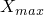
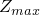

# 2.3.6 表面操作


**产品：** Abaqus/Standard  Abaqus/Explicit  

##### **参考文献**

- ["表面：概述，" 第2.3.1节](pt01ch02s03aus16.md)
- ["耦合约束，" 第35.3.2节](pt08ch35s03aus133.md)
- ["网格无关紧固件，" 第35.3.4节](pt08ch35s03aus135.md)
- ["在Abaqus/Explicit中定义通用接触相互作用，" 第36.4.1节](pt09ch36s04aus155.md)
- [*SURFACE](../key/key-link.md#usb-kws-msurface)

### 概述

组合表面：
- 通过对现有表面执行布尔运算（并集、交集或差集）创建；
- 可以由基于单元的表面或基于节点的表面形成；
- 不能由欧拉表面形成；
- 可以像Abaqus/Standard中的其他基于单元的或基于模式的表面一样使用；以及
- 不能与Abaqus/Explicit中的接触对一起使用（但可以与Abaqus/Explicit中的通用接触一起使用）。

裁剪表面：
- 通过裁剪现有表面并仅保留封闭在指定矩形框中的表面部分创建；
- 可以由基于单元的表面或基于节点的表面形成；
- 不能由欧拉表面形成；
- 可以像Abaqus/Standard中的其他基于单元的或基于模式的表面一样使用；以及
- 不能与Abaqus/Explicit中的接触对一起使用（但可以与Abaqus/Explicit中的通用接触一起使用）。

### 创建组合表面

您必须为组合表面分配一个名称；此名称可用于引用表面的其他功能。

在以部件实例装配形式定义的模型中，所有表面必须属于部件、部件实例或装配。表面可以在部件级别创建并在装配级别组合。附加规则在["定义装配，" 第2.10.1节](pt01ch02s10aus28.md)中给出。

被组合的表面必须是相同类型；即，基于单元的表面可以与另一个基于单元的表面组合，但不能与基于节点的表面组合。组合表面可用于创建另一个组合表面。

#### 现有表面的并集

任意数量的现有表面可以组合创建新表面。如果被组合的表面是基于单元的表面，则新表面也将是基于单元的表面，任何表面重叠将被合并。类似地，如果被组合的表面是基于节点的表面，则新表面将是基于节点的表面，任何重叠将被合并。

| **输入文件用法：** | ``` [*SURFACE](../key/key-link.md#usb-kws-msurface), NAME=*name*, COMBINE=UNION *list of surface names* ``` |
| --- | --- |

#### 现有表面的交集或差集

两个现有表面的交集或差集可用于创建新表面。差集操作从第一表面减去第二表面。当在基于单元的表面上执行交集或差集操作时，它们仅对面起作用。如果交集操作导致空表面，则会发出警告消息。

| **输入文件用法：** | 使用以下选项基于两个现有表面的交集创建新表面： |
| --- | --- |
|  | ``` [*SURFACE](../key/key-link.md#usb-kws-msurface), NAME=*name*, COMBINE=INTERSECTION *first surface name, second surface name* ``` 使用以下选项基于两个现有表面的差集创建新表面： ``` [*SURFACE](../key/key-link.md#usb-kws-msurface), NAME=*name*, COMBINE=DIFFERENCE *first surface name, second surface name* ``` |

### 创建裁剪表面

您可以创建仅包含现有表面中位于指定裁剪框内节点的面组成的新表面。对于基于节点的表面，新表面将仅包含位于裁剪框内的节点。如果面至少有一个节点在框内，则整个面被视为有效。您必须为新表面分配名称并指定要从中生成新表面的现有表面的名称。只能指定一个表面。

要定义框的位置，请指定框的下角坐标（、、）和框的对角（上角）坐标（、、）。如果定义了可选旋转，则切割框可以绕下角（、、）旋转。定义旋转的两个点*a*和*b*的坐标在未旋转的系统中给出。这些点应定义为使得点*a*位于旋转*X*轴上，点*b*位于*X*–*Y*平面并接近*Y*轴。

| **输入文件用法：** | ``` [*SURFACE](../key/key-link.md#usb-kws-msurface), NAME=*name*, CROP *old_surface_name* *, , , , , * *, , , , , * ``` |
| --- | --- |
|  | 例如，要裁剪包含模型中所有暴露面的表面，请使用以下输入： ``` [*SURFACE](../key/key-link.md#usb-kws-msurface), TYPE=ELEMENT, NAME=*entire_surface* , [*SURFACE](../key/key-link.md#usb-kws-msurface), NAME=*name*, CROP *entire_surface* , , , , ,  , , , , ,  ``` |

