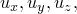
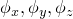
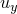
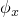

# 2.4.1 刚体定义


**产品：** Abaqus/Standard  Abaqus/Explicit  Abaqus/CAE

##### **参考文献**

- ["表面：概述，" 第2.3.1节](pt01ch02s03aus16.md)
- ["基于单元的表面定义，" 第2.3.2节](pt01ch02s03aus17.md)
- ["解析刚性表面定义，" 第2.3.4节](pt01ch02s03aus19.md)
- ["刚性单元，" 第30.3.1节](pt06ch30s03alm23.md)
- [*RIGID BODY](../key/key-link.md#usb-kws-mrigidbody)
- ["定义刚体约束，" Abaqus/CAE用户指南第15.15.2节](../usi/usi-link.md#usi-itn-helptopic-rigid)

### 概述

刚体：
- 可以是二维平面、轴对称或三维；
- 与一个节点关联，该节点称为刚体参考节点，其运动控制整个刚体的运动；
- 可以由节点、单元和表面组成；
- 可以作为约束方法；
- 可用于多体动力学模拟中的连接器单元；
- 可用于规定刚性表面的运动以进行接触建模；
- 可以计算效率高，在Abaqus/Explicit中不影响全局时间增量；以及
- 在考虑热相互作用的完全耦合温度-位移分析中，可以具有温度梯度或等温。

### 什么是刚体？

刚体是节点、单元和/或表面的集合，其运动受单个节点（称为刚体参考节点）运动的控制。作为刚体一部分的节点和单元的相对位置在整个模拟过程中保持不变。因此，组成单元不会变形，但可以经历大的刚体运动。刚体的质量和惯性可以根据其单元的贡献计算，也可以直接指定。解析表面也可以成为刚体的一部分，而基于刚体节点或单元的任何表面会自动与刚体关联。

刚体的运动可以通过在刚体参考节点上施加边界条件来规定。刚体上的载荷由施加到节点上的集中载荷和施加到作为刚体一部分的单元上的分布载荷生成。刚体以多种方式与模型的其他部分相互作用。刚体可以在节点处连接到变形单元，定义在刚体上的表面可以在这些变形单元上继续，只要使用兼容的单元类型即可。刚体也可以通过连接器单元连接到其他刚体（请参阅["连接器：概述，" 第31.1.1节](pt06ch31s01abo28.md)）。定义在刚体上的表面可以与模型中定义在其他实体上的表面接触。

### 确定何时使用刚体

刚体可用于模拟非常硬的部件，可以是固定的或经历大运动的。例如，刚体非常适合模拟模具（即冲头、模具、拉延筋、压料板、滚轮等）。它们也可用于模拟变形部件之间的约束，并提供了一种方便的方法来指定某些接触相互作用。刚体可与连接器单元一起使用，以模拟各种多体动力学问题。

出于模型验证目的，将模型的某些部分设为刚体可能很有用。例如，在复杂模型中，远离感兴趣区域的单元可以作为刚体的一部分包含，从而在模型开发阶段获得更快的运行时间。当您对模型满意后，可以移除刚体定义，并在整个模型中纳入准确的变形有限元表示。

在多体动力学模拟中，刚体由于许多原因很有用。虽然刚体的运动由参考节点处的六个自由度控制，但刚体允许准确表示刚体的几何形状、质量和转动惯量。此外，刚体提供准确的模型可视化和后处理。

使用刚体而非变形有限元表示模型部分的主要优势是计算效率。不会对作为刚体一部分的单元执行单元级计算。虽然更新刚体节点运动和组装集中和分布载荷需要一些计算，但刚体的运动完全由参考节点最多六个自由度决定。

刚体在Abaqus/Explicit中建模模型中相对硬的部分特别有效，因为这些部分不需要跟踪波和应力分布。硬区域中的单元稳定时间增量估计可能导致非常小的全局时间增量。由于作为刚体一部分的刚体和单元不影响全局时间增量，因此在硬区域中使用刚体而不是变形有限元表示可以获得更大的全局时间增量，而不会显著影响解的整体精度。

### 创建刚体

您必须为刚体分配一个刚体参考节点。

| **输入文件用法：** | ``` [*RIGID BODY](../key/key-link.md#usb-kws-mrigidbody), REF NODE=*n* ``` |
| --- | --- |

| **Abaqus/CAE用法：** | 相互作用模块：****工具****参考点****：选择一个点作为参考点 **创建约束**：**刚体**：**点：编辑**：选择参考点区域 |
| --- | --- |

#### 刚体参考节点

刚体参考节点具有平动和转动自由度，必须为每个刚体定义。如果参考节点未分配坐标，Abaqus默认将其分配到全局原点的坐标。或者，您可以指定将参考节点放置在刚体的质心处。在完全耦合温度-位移分析中，如果将刚体视为等温的，则描述刚体温度的单个温度自由度存在于刚体参考节点处。刚体参考节点：
- 可以连接到质量、转动惯量、电容或变形单元；
- 不能是另一个刚体的刚体参考节点；以及
- 如果物体是等温刚体，则可以具有温度自由度。

##### 将参考节点定位在质心处

刚体参考节点相对于刚体其余部分或其质心的特定位置很重要，如果要对刚体施加非零边界条件或要在参考节点施加集中载荷。在许多刚体动力学问题中，可能需要将载荷和边界条件施加到刚体的质心。此外，出于输出目的，监控刚体在质心处的配置可能很有用。然而，当刚体质量和惯性属性（见下文）包含来自有限元离散化或MASS和ROTARYI单元的复杂排列时，可能很难预先定位质心。

默认情况下，刚体参考节点不会被重新定位。您可以指定将其重新定位在计算质心处。在这种情况下，如果在刚体参考节点处定义了MASS单元，则用于重新定位的计算质心包括除参考节点处质量之外的所有质量贡献。然后将MASS单元重新定位到质心处，并包含在刚体的质量属性中。如果刚体唯一的质量贡献来自在刚体参考节点处定义的MASS单元，则参考节点不会被重新定位。

| **输入文件用法：** | 使用以下选项指示参考节点不应被重新定位（默认）： |
| --- | --- |
|  | ``` [*RIGID BODY](../key/key-link.md#usb-kws-mrigidbody), REF NODE=*n*, POSITION=INPUT ``` 使用以下选项指定应将刚体参考节点重新定位到计算质心处： ``` [*RIGID BODY](../key/key-link.md#usb-kws-mrigidbody), REF NODE=*n*, POSITION=CENTER OF MASS ``` |

| **Abaqus/CAE用法：** | 相互作用模块：**创建约束**：**刚体**：切换**在分析开始时将点调整到质心** |
| --- | --- |

#### 构成刚体的节点集合

除了刚体参考节点外，刚体还包括通过将单元和节点分配给刚体而生成的节点集合。这些节点提供与其他单元的连接。作为刚体一部分的节点有两种类型：
- 销节点，只有与刚体关联的平动自由度，或
- 绑定节点，同时具有与刚体关联的平动和转动自由度。

刚体节点类型由该节点所连接的刚体上单元的类型决定。您也可以在直接将节点分配给刚体时指定节点类型。对于销节点，只有平动自由度是刚体的一部分，这些自由度的运动受刚体参考节点运动的约束。对于绑定节点，平动和转动自由度都是刚体的一部分，并受刚体参考节点运动的约束。

节点类型在节点连接到转动惯量单元、变形结构单元或连接器单元时，或当节点承受集中力矩或随动载荷时，具有重要意义。转动惯量单元和施加的集中力矩仅在与绑定节点关联时才影响刚体。刚体与变形单元的连接始终涉及平动自由度；如果连接在绑定节点，则刚体与变形壳、梁、管和连接器单元的连接也涉及转动自由度。两种连接类型的行为如图2.4.1-1所示，该图显示了一个八边形刚体通过相对两端的节点连接到两个变形壳单元，并承受施加的转动速度。

**图2.4.1–1** 具有绑定节点和销节点连接的刚体。


壳单元假定是刚性的（图中显示的弯曲可以忽略）。当刚体和壳单元的公共节点是绑定节点时，施加到刚体的旋转直接传递到壳单元。当公共节点是销节点时，刚体旋转不会直接传递到壳单元，这可能导致刚体与相邻壳结构之间的大相对运动。

#### 将单元分配给刚体

要将单元包含在刚体定义中，您需要指定包含作为刚体一部分的所有单元的模型区域。此区域中的单元和连接到该区域中单元的节点不能属于任何其他刚体。[表2.4.1-1](pt01ch02s04aus22.md#table-arigidoverview-valid-elems)列出了可以包含在刚体中的连续体、结构、和刚性单元类型，以及在刚体中生成的相应节点类型。

**表2.4.1–1** 可以包含在刚体中的有效单元列表（*表示以前缀开头的所有单元）。
| 刚体几何 | 单元 | 节点自由度 |
| --- | --- | --- |
| 生成销节点 | 生成绑定节点 | 销节点 | 绑定节点 |
| 平面 | CPE3*、CPE4*、CPE6*、CPE8*、CPS3、CPS4*、CPS6*、CPS8*、GK2D2、GKPS*、GKPE*、R2D2、T2D2* | B21*、B22*、B23*、FRAME2D、PIPE2*、RB2D2 |  |  |
| 轴对称 | CAX3、CAX4*、CAX6*、CAX8*、GKAX*、MAX*、RAX2 | CGAX*、MGAX*、SAX1、SAX2* |  |  |
| 三维 | C3D4*、C3D6*、C3D8*、C3D10*、C3D15*、C3D20*、C3D27*、GK3D*、M3D3、M3D4*、M3D6、M3D8*、M3D9*、SFM3D*、SFMAX*、SFMGAX*、R3D3、R3D4、T3D2*、CCL*、MCL*、SFMCL* | B31*、B32*、B33*、FRAME3D、PIPE*、RB3D2、S3*、S4*、S8*、S9* |  |   |

当连接器单元包含在刚体中时，生成的节点类型取决于其连接类型是否激活了转动自由度。如果包含在刚体中的连接器单元在节点处激活了材料流自由度，则该自由度约束的材料和流动随刚体运动。

以下单元不能声明为刚性的：
- 声学单元
- 轴对称-非对称连续体和壳单元
- 耦合热-电单元
- 扩散热传递/质量扩散单元和强制对流/扩散单元
- 欧拉单元
- 广义平面应变单元
- 具有厚度方向行为的垫片单元
- 热容单元
- 惯性单元（质量和转动惯量）
- 无限单元
- 压电单元
- 专用单元
- 子结构
- 热-电-结构单元
- 用户定义单元

如果一种以上类型或截面定义的单元是刚体的一部分，则指定区域将包含具有不同截面定义的单元。当连续体或结构单元分配给刚体时，它们不再是变形的，其运动受刚体参考节点运动的控制。不会对这些单元执行单元刚度计算，它们在Abaqus/Explicit中不影响全局时间增量。但是，刚体的质量和惯性包括根据其截面和材料密度定义计算的这些单元的贡献（请参阅[第六部分，"单元"](pt06.md)"）。质量单元和转动惯量单元以及点热容单元不应包含在指定区域中。当这些单元连接到作为刚体一部分的节点时，来自质量、转动惯量和热容单元对刚体的贡献会自动计算。

当您将单元分配给刚体时，会自动生成作为刚体一部分的节点列表。节点列表构造为唯一列表，包括连接到指定区域中单元的所有节点。此列表中的节点不能属于任何其他刚体。每个节点类型（销或绑定）由与其连接的刚体上单元的类型决定。壳、梁、管和刚性梁单元生成绑定节点；实体、膜、桁架和刚性（非梁）单元生成销节点（请参阅[表2.4.1-1](pt01ch02s04aus22.md#table-arigidoverview-valid-elems)）。对于同时连接到生成销节点的单元和生成绑定节点的单元的节点，公共节点定义为绑定类型。

作为刚体一部分的所有单元必须具有相似的几何形状。因此，包含在指定区域中的单元必须是平面、轴对称或三维的。单元的几何形状决定了刚体的几何形状，如[表2.4.1-1](pt01ch02s04aus22.md#table-arigidoverview-valid-elems)所示。

| **输入文件用法：** | 使用以下选项将单元分配给刚体： |
| --- | --- |
|  | ``` [*RIGID BODY](../key/key-link.md#usb-kws-mrigidbody), REF NODE=*n*, ELSET=*name* ``` |

| **Abaqus/CAE用法：** | 相互作用模块：**创建约束**：**刚体**：**体（单元）**：**编辑**：选择体区域 |
| --- | --- |

#### 将节点分配给刚体

要将节点直接分配给刚体，您需要分别指定所有所需的销节点和所有绑定节点。这些节点成为刚体的一部分，以及从分配给刚体的单元自动生成的任何节点。在直接将节点分配给刚体时，以下规则适用：
- 刚体参考节点不能包含在销节点集或绑定节点集中。
- 作为销节点集一部分的节点也不能包含在绑定节点集中。
- 包含在销节点集或绑定节点集中的节点不能属于任何其他刚体定义。
- 从分配给刚体的单元自动生成的节点，如果也包含在销节点集中，则被分类为销节点，无论其单元连接如何。
- 从分配给刚体的单元自动生成的节点，如果也包含在绑定节点集中，则被分类为绑定节点，无论其单元连接如何。

因此，通过直接将节点分配给刚体，可以覆盖由包含在刚体中的单元生成的节点类型，从而使您能够更灵活地通过轻松指定刚体与其连接的变形有限元之间的连接类型来定义约束。

| **输入文件用法：** | 使用以下选项将节点分配给刚体： |
| --- | --- |
|  | ``` [*RIGID BODY](../key/key-link.md#usb-kws-mrigidbody), REF NODE=*n*, PIN NSET=*name*, TIE NSET=*name* ``` |

| **Abaqus/CAE用法：** | 相互作用模块：**创建约束**：**刚体**：**销（节点）**：**编辑**：选择销区域，**绑定（节点）**：**编辑**：选择绑定区域 |
| --- | --- |

#### 将解析表面分配给刚体

您可以将解析表面分配给刚体。创建和命名解析刚性表面的过程在["解析刚性表面定义，" 第2.3.4节](pt01ch02s03aus19.md)中描述。只能将一个解析表面定义为刚体定义的一部分。

| **输入文件用法：** | 使用以下选项将解析刚性表面分配给刚体： |
| --- | --- |
|  | ``` [*RIGID BODY](../key/key-link.md#usb-kws-mrigidbody), REF NODE=*n* or *name*, ANALYTICAL SURFACE=*name* ``` |

| **Abaqus/CAE用法：** | 相互作用模块：**创建约束**：**刚体**：**解析表面**：**编辑**：选择解析表面区域 |
| --- | --- |

#### 在以部件实例装配形式定义的模型中定义刚体

Abaqus模型可以定义为部件实例的装配（请参阅["定义装配，" 第2.10.1节](pt01ch02s10aus28.md)）。在这种模型中，刚体可以由部件级别或装配级别的变形单元创建。在任何一种情况下，所有节点和单元定义都必须属于一个或多个部件。如果构成刚体的所有节点属于同一部件，则通过在部件级别定义刚体来创建刚性部件。

可以通过创建跨越部件实例的装配级节点或单元集，然后在装配级别定义刚体以引用该集，从而将多个变形部件实例组合成单个刚体。如果需要，刚体参考节点也可以在装配级别定义。

### 刚体的质量和惯性属性

当刚体未完全约束时，刚体的质量和惯性属性对其动态响应很重要。在Abaqus/Explicit中，如果对于未约束自由度没有质量（或转动惯量），将发出错误消息。Abaqus自动计算每个刚体的质量、质心和转动惯量，并在请求模型定义数据时将结果打印到数据（`.dat`）文件中（请参阅["控制在数据文件中写入的分析输入文件处理器信息量"中的"输出，" 第4.1.1节](pt02ch04s01aus38.md#usb-out-ooutput-data-control)）。以下规则用于确定刚体的质量和惯性：
- 作为刚体一部分的每个连续体、结构和刚性单元对刚体的质量、质心和转动惯量属性有贡献。
- 连接到作为刚体一部分的任何节点或刚体参考节点的质量点单元对刚体的质量、质心和转动惯量属性有贡献。
- 连接到任何绑定节点或刚体参考节点的转动惯量单元对刚体的转动惯量属性有贡献。

由于销节点处的转动自由度不是刚体的一部分，因此连接到销节点的转动惯量单元不对刚体惯性有贡献，而是与节点的独立旋转相关。

#### 通过离散化定义质量和惯性属性

在许多情况下，希望对质量和质心及转动惯量不易获得的刚性部件进行建模。在Abaqus中，不需要直接定义刚体的质量和惯性属性。相反，可以使用有限元离散化来建模刚性部件，Abaqus将从离散化自动计算属性。具有一维杆或梁几何形状的刚性结构可以用梁或桁架单元建模，包含二维表面几何形状的结构可以用壳或膜单元建模，实体几何形状可以用实体单元建模。对于每个单元，对刚体的质量贡献基于该单元的截面属性（请参阅[第六部分，"单元"](pt06.md)"）和材料密度（请参阅["密度，" 第21.2.1节](pt05ch21s02abm01.md)）。虽然给定相似的截面和密度定义，刚体中的壳和膜单元可以产生相似的质量贡献，但它们会生成不同的节点类型（壳单元生成绑定节点，膜单元生成销节点），这可能会影响整体结果。梁和桁架单元也是如此。

在某些情况下，刚性部件的一部分可以用有限元离散化建模，但其他部分不方便这样做，此时可以使用点质量和转动惯量单元来表示这些其他部分的质量分布。然后，刚体的质量、质心和转动惯量将包括来自有限元以及点质量和转动惯量单元的贡献。

Abaqus对低阶单元使用集中质量公式。因此，二阶质量矩可能偏离理论值，特别是对于粗网格。可以通过添加具有正确惯性属性的点质量和转动惯量单元并消除实体单元的质量贡献来避免这种不准确性。或者，可以在Abaqus/Standard中使用二阶单元。

#### 直接定义质量和惯性属性

当实际刚性部件的质量、质心和转动惯量属性已知或可以近似时，不需要使用有限元离散化或使用一系列点质量来生成刚体属性。您可以通过将刚体参考节点定位在质心处（请参阅["将参考节点定位在质心处](pt01ch02s04aus22.md#usb-int-arigadoverview-refnode-centerofmass)"）并直接在参考节点指定刚体质量和转动惯量来直接分配这些属性（请参阅["点质量，" 第30.1.1节](pt06ch30s01alm21.md)和["转动惯量，" 第30.2.1节](pt06ch30s02alm22.md)）。

也可能需要在质心处直接输入质量属性，但要在不同于质心的位置指定边界条件。在这种情况下，您应该将刚体参考节点放置在所需的边界条件位置。此外，您必须在刚体质心处定义一个绑定节点，方法是正确指定其坐标以与刚体质心的坐标重合，然后将其分配给刚体定义中的绑定节点集。然后，您可以在该绑定节点上定义刚体质量和转动惯量。

对于大多数直接输入质量属性的应用程序，可能需要向刚体分配额外的单元或节点，以便刚体可以与模型的其余部分相互作用。例如，接触对定义可能需要用刚体上的单元面形成的刚性表面，并且可能需要额外的销或绑定节点来提供与连接到刚体的变形单元的所需约束。Abaqus将考虑来自刚体上所有单元的质量和转动惯量贡献；因此，如果您想直接分配刚体质量属性，应注意确保作为刚体一部分的其他单元类型的贡献不会影响所需的输入质量属性。如果刚性单元是刚体定义的一部分，您可以通过不为这些单元指定密度来将其质量贡献设为零。如果使用其他单元类型来定义刚体，则应将其密度设为零。

### 刚体运动学

刚体的运动完全由其参考节点的运动定义。参考节点处的活动自由度取决于刚体的几何形状（请参阅["约定，" 第1.2.2节](pt01ch02s01aus02.md)）。刚体的几何形状是平面、轴对称或三维的，由分配给刚体的单元类型决定。在没有为刚体分配单元的情况下，刚体的几何形状假定为三维。

如果请求模型定义数据，则每个刚体所有活动自由度的计算质量和转动惯量属性将打印到数据（`.dat`）文件中（请参阅["控制在数据文件中写入的分析输入文件处理器信息量"中的"输出，" 第4.1.1节](pt02ch04s01aus38.md#usb-out-ooutput-data-control)）。这些属性包括来自作为刚体一部分的单元以及刚体节点上点质量和转动惯量单元的贡献。

虽然这个计算的质量代表刚体的真实质量，但Abaqus/Explicit实际上在运动方程积分中使用了一种增强质量，这在概念上类似于附加质量 formulation。本质上，刚体的计算质量和转动惯量与所有连接变形单元的质量贡献相结合，创建了更大的增强质量和转动惯量。如果节点连接在绑定节点处，则相邻变形单元的转动惯量贡献也包含在增强转动惯量中。

#### 刚体运动

刚体可以在其每个活动平动自由度以及每个活动转动自由度上经历自由刚体运动。

#### 边界条件

刚体的边界条件应按照["Abaqus/Standard和Abaqus/Explicit中的边界条件，" 第34.3.1节](pt07ch34s03aus118.md)中的描述在刚体参考节点处定义。可以在参考节点处约束的所有自由度上恢复反作用力和力矩。如果在刚体参考节点处定义了节点转换，则边界条件应用于局部系统（请参阅["转换坐标系统，" 第2.1.5节](pt01ch02s01aus09.md)）。

在Abaqus/Standard中，如果边界条件施加到刚体上除刚体参考节点以外的任何节点，Abaqus将尝试将这些边界条件转移到参考节点。如果成功，您将收到有关此转移的警告。否则，将产生错误消息（请参阅["过约束检查，" 第35.6.1节](pt08ch35s06aus138.md)，了解更多详细信息）。

在Abaqus/Explicit中，如果边界条件施加到刚体上除刚体参考节点以外的任何节点，这些边界条件将被忽略，但对称型边界条件除外，这些边界条件可能影响Abaqus/Explicit接触对算法中表面周界处的接触逻辑（请参阅["Abaqus/Explicit中接触对的接触公式，" 第38.2.2节](pt09ch38s02aus181.md)和["使用接触对进行接触建模的常见困难，" 第39.2.2节](pt09ch39s02aus186.md)）。

#### 约束

在Abaqus/Standard中，刚体上的节点（不包括刚体参考节点）不能用于多点约束或线性约束方程定义。

在Abaqus/Explicit中，可以为刚体上的任何节点（包括参考节点）定义多点约束或线性约束方程。

#### 连接器单元

连接器单元可用于刚体的任何节点（包括参考节点），以定义刚体之间、刚体与变形体之间或从刚体到地面的连接。连接器单元便于在刚体上提供多个附着点；建模复杂的非线性运动约束；在刚体上非参考节点处指定零或非零边界条件；施加力驱动；以及建模离散相互作用，如弹簧、阻尼器、节点对节点接触、摩擦、锁定机构和失效接头。与多点约束或线性约束方程不同，连接器单元在连接中保留自由度，从而允许输出与连接相关的信息（如约束力和力矩、相对位移、速度、加速度等）。有关连接器单元的详细说明，请参阅["连接器单元，" 第31.1.2节](pt06ch31s01alm25.md)。

#### 平面刚体

具有平面几何形状的刚体有三个活动自由度：1、2和6（、和）。这里，x和y方向分别与全局X和Y方向重合。如果在刚体参考节点处定义了节点转换，则x和y方向与用户定义的局部方向重合。在参考节点处定义的坐标转换必须与几何形状一致；局部方向必须保持在全局X-Y平面内。作为平面刚体一部分的所有节点和单元应位于全局X-Y平面内。

平面刚体应仅连接到平面变形单元。要将具有平面几何形状的刚性部件与三维变形单元连接，请将平面刚性部件建模为由适当三维单元组成的三维刚体。

#### 轴对称刚体

具有轴对称几何形状的刚体在Abaqus中有三个活动自由度：1、2和6（、、）。经典轴对称理论只允许一种刚体模式，即z方向的位移。为了最大化使用刚体进行轴对称分析的灵活性，Abaqus允许三个活动自由度，尽管只有轴向位移是刚体模式。

r和z方向分别与全局X和Y方向重合。如果在刚体参考节点处定义了节点转换，则r和z方向与用户定义的局部方向重合。在参考节点处定义的坐标转换必须与几何形状一致；局部方向必须保持在全局X-Y平面内。作为轴对称刚体一部分的所有节点和单元应位于全局X-Y平面内。

r方向的平动与径向模式相关，r-z平面内的转动与旋转模式相关（请参阅[图2.4.1-2](pt01ch02s04aus22.md#arigidbody-axi-modes)）。对于Abaqus中的轴对称刚体，这些模式都不会产生周向应力，但为这些自由度计算的质量和惯性代表与其模式运动相关的模态质量。因此，轴对称刚体的质量属性基于初始配置计算，假设如下：
- 定义在刚体节点上的点质量（请参阅["点质量，" 第30.1.1节](pt06ch30s01alm21.md)）假定 accounted for the entire mass around the circumference of the body.
- 分配给刚体的轴对称单元的质量贡献包括沿圆周积分的值。
- 刚体的质心位于圆周切片的质心处，如图2.4.1-2所示。**图2.4.1-2** 轴对称刚体模式。

如果刚体参考节点位于质心处，则轴对称刚体的参考节点将被重新定位到圆周切片的质心处。

这些假设与Abaqus处理其他轴对称特征的方式一致，但因此处偏离经典刚体理论而予以说明。

轴对称刚体应仅连接到轴对称变形单元。要将具有轴对称几何形状的刚性部件与三维变形单元连接，请将轴对称刚性部件建模为由适当三维单元组成的三维刚体。

#### 三维刚体

具有三维几何形状的刚体有六个活动自由度：1、2、3、4、5和6（、、、、、）。这里，x-、y-和z方向分别与全局X-、Y-和Z-方向重合。如果在刚体参考节点处定义了节点转换，则x-、y-和z方向与用户定义的局部方向重合。

一般来说，三维刚体将拥有完整的、各向异性的惯性张量，当它们绕非主惯性轴旋转时，可能表现得不直观。经典刚体动力学现象（如进动、陀螺力矩等）可以使用Abaqus中的三维刚体进行模拟。

在大多数情况下，三维刚体应仅连接到三维变形单元。如果物理上相关，三维刚体可以连接到二维平面应力、平面应变或轴对称单元；但是，您应始终约束刚体的z位移、x轴转动和y轴转动。上述过程在将二维平面应变近似纳入模型的一个区域而将三维离散化纳入另一个区域时很有用。刚体可用于约束两个有限元几何在其界面处的连接，如图2.4.1-3所示。在界面沿线每个节点处应使用一个独特的刚体来正确处理约束。

**图2.4.1–3** 用于连接二维和三维网格的刚体节点。


### 在刚体上定义载荷

刚体上的载荷从作为刚体一部分的所有节点和单元上的载荷贡献组装而成。在与节点和单元不在刚体中时指定的方式相同的方式下，指定作为刚体一部分的节点和单元上的载荷。贡献包括：
- 施加到销节点、绑定节点和刚体参考节点上的集中力；
- 施加到绑定节点和刚体参考节点上的集中力矩；以及
- 施加到作为刚体一部分的所有单元和表面上的分布载荷。

除非作用点通过刚体质心，否则这些载荷都会在质心处产生力和扭矩，这会使未约束的刚体旋转。如果在任何刚体节点处定义了节点转换，则在这些节点处定义的集中载荷在局部系统中解释。节点转换定义的局部系统不随刚体旋转。

在销节点上定义的集中力矩不对刚体有载荷贡献，而是与该节点的独立旋转相关。销节点的独立旋转仅在其连接到具有转动自由度的变形单元或转动惯量单元时存在。如果独立旋转存在，则可以在销节点处定义随动载荷（请参阅["指定集中随动载荷"中的"集中载荷，" 第34.4.2节](pt07ch34s04aus121.md#usb-prc-ploadgeneral-follow)）。但是，结果可能不直观，因为力的方向由独立旋转决定，即使随动载荷作用在刚体上。

### 具有温度自由度的刚体

只有包含耦合温度-位移单元的刚体才有温度自由度。如果可以合理假设用于完全耦合温度-位移分析中的刚体具有均匀温度，则可以将刚体定义为等温的。涉及等温刚体的瞬态热传递过程假定，体内对热的内部阻力与外部阻力相比可以忽略不计。因此体温度可以是时间的函数，但不能是位置的函数。在刚体参考节点处创建的温度自由度描述了体的温度。

具有解析刚性表面的刚体的热相互作用仅在Abaqus/Explicit中可用，并通过指定刚体是等温的来激活。

默认情况下，刚体不被视为等温的，连接到耦合温度-位移单元的刚体上的所有节点将具有独立的温度自由度。节点是刚体一部分这一事实不影响耦合单元在刚体内传导热的能力。然而，机械响应将是刚性的。

如果由具有定义比热和密度属性的耦合温度-位移单元组成，则等温体的与刚体参考节点相关的集中热容会自动计算。否则，您应为刚体指定点热容（请参阅["点电容，" 第30.4.1节](pt06ch30s04alm24.md)。在Abaqus/Explicit中，如果等温刚体没有与热容相关联且温度未在参考节点处规定，将发出错误消息。
- 作为刚体一部分的每个耦合温度-位移单元对等温刚体的电容有贡献。对于轴对称等温刚体，分配给刚体的轴对称单元的电容贡献包括沿圆周积分的值。
- 连接到作为刚体一部分的任何节点或刚体参考节点的HEATCAP单元对等温刚体的电容有贡献。对于轴对称等温刚体，定义在刚体节点上的点电容假定 accounted for the capacitance integrated around the circumference of the body.

作用在等温体参考节点上的热载荷从作为刚体一部分的所有节点和单元上的热载荷贡献组装而成。在接触期间以及当体不接触时（如果定义了间隙热传导和间隙辐射），变形体和等温刚体之间可以发生热传递（请参阅["热接触属性，" 第37.2.1节](pt09ch37s02aus174.md)）。两个等温刚体之间的热传递只能通过间隙热传导和间隙辐射进行。

| **输入文件用法：** | ``` [*RIGID BODY](../key/key-link.md#usb-kws-mrigidbody), ISOTHERMAL=YES ``` |
| --- | --- |

| **Abaqus/CAE用法：** | 相互作用模块：**创建约束**：**刚体**：切换打开**约束选定区域为等温** |
| --- | --- |

### 使用刚体建模接触

与刚体的接触通过指定由刚性表面和定义在另一个体上的表面组成的接触相互作用来建模（请参阅["在Abaqus/Standard中定义接触对，" 第36.3.1节](pt09ch36s03aus145.md)；["在Abaqus/Explicit中定义通用接触相互作用，" 第36.4.1节](pt09ch36s04aus155.md)；或["在Abaqus/Explicit中定义接触对，" 第36.5.1节](pt09ch36s05aus160.md)）。刚性表面可以由节点、单元面或解析表面形成（请参阅["基于节点的表面定义，" 第2.3.3节](pt01ch02s03aus18.md)；["基于单元的表面定义，" 第2.3.2节](pt01ch02s03aus17.md)；和["解析刚性表面定义，" 第2.3.4节](pt01ch02s03aus19.md)）。

接触建模可能是选择适当刚体几何形状时的主要因素。接触相互作用应由相似几何形状的表面形成。例如，平面刚体应用于通过二维平面应力或平面应变单元形成的变形表面建模接触，或通过具有二维梁、管或桁架单元的基于节点的表面。类似地，轴对称刚体应用于通过轴对称单元形成的表面建模接触，三维刚体应用于通过三维单元面形成的表面建模接触，或通过具有三维梁、管或桁架单元的基于节点的表面。

刚体必须仅包含二维或仅包含三维单元。两个刚体之间不能共享节点。不能建模两个解析刚性表面之间或解析刚性表面与其自身之间的接触。

#### Abaqus/Standard中的限制

如果从属表面属于已声明为刚性的弹性体，则允许刚体之间的接触。在这种情况下，应规定软化接触以避免可能的过约束。

不允许使用刚性单元定义的刚性表面之间的接触。

刚性梁和桁架不能包含在接触对定义中，因为来自梁和桁架的表面只能是基于节点的表面。基于节点的表面必须是 slave surface，而作为刚体一部分的单元必须是接触对中的主表面。

#### Abaqus/Explicit中的限制

在Abaqus/Explicit中，只能在使用惩罚接触对算法或通用接触算法时建模两个刚性表面之间的接触；不能将运动学接触对用于刚性对刚性接触。因此，当将模型的两个变形区域转换为两个不同的刚体以进行模型开发时，这些刚体之间的任何接触相互作用定义必须使用惩罚接触对或通用接触。

对于涉及解析刚性表面的刚性对刚性接触，至少有一个刚性表面必须由单元面形成，因为在Abaqus中无法建模两个解析刚性表面之间的接触。

如果为刚体上的节点定义了方程约束、多点约束、绑定约束或连接器单元，则必须对涉及刚体的所有接触相互作用使用惩罚接触对算法（通过使用惩罚弹簧引入数值软化进行接触强制）或通用接触算法。

刚性梁和桁架不能包含在运动学接触对定义中，因为来自梁和桁架的表面只能是基于节点的表面。基于节点的表面必须是 slave surface，而作为刚体一部分的单元必须是运动学接触对中的主表面。

当刚性表面在惩罚接触对或通用接触中作为 slave surface 时，刚性 slave 节点侵入主表面的初始穿透将不会使用无应变校正进行校正（请参阅["调整Abaqus/Explicit中接触对的初始表面位置和指定初始间隙，" 第36.5.4节](pt09ch36s05aus163.md)和["控制Abaqus/Explicit中通用接触的初始接触状态，" 第36.4.4节](pt09ch36s04aus158.md)）。对于接触对，此类初始穿透可能在初始增量中导致人为大的接触力。对于通用接触，这些初始穿透被存储为接触偏移。

### 在几何线性Abaqus/Standard分析中使用刚体

如果在几何线性Abaqus/Standard分析中使用刚体（请参阅["一般和线性摄动过程，" 第6.1.3节](pt03ch06s01aus44.md)），刚体约束被线性化。因此，除了解析刚性表面外，属于刚体的任意两个节点之间的距离可能在旋转幅度不小的情况下在分析过程中不保持恒定。


