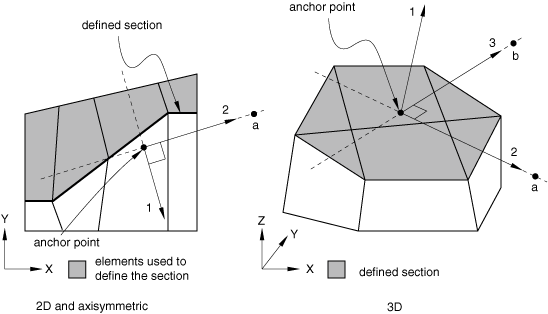

# 2.5.1 集成输出截面定义


**产品：** Abaqus/Explicit  Abaqus/CAE

##### **参考文献**

- ["输出到输出数据库，" 第4.1.3节](pt02ch04s01aus40.md)
- [*INTEGRATED OUTPUT SECTION](../key/key-link.md#usb-kws-mintegratedoutputsect)
- [*INTEGRATED OUTPUT](../key/key-link.md#usb-kws-hintegratedoutput)
- [*SURFACE](../key/key-link.md#usb-kws-msurface)
- ["定义集成输出截面，" Abaqus/CAE用户指南第14.13.1节](../usi/usi-link.md#usi-sim-odb-integratedoutput)

### 概述

集成输出截面：
- 可以是二维或三维；
- 可用于跟踪表面的平均运动；
- 可与集成输出请求结合使用来研究模型中的"力流"；以及
- 不会对表面的运动施加任何约束。

### 引言

集成输出截面是将表面与坐标系和/或参考节点关联的一种方法，用于以下一个或两个目的：
- 跟踪表面的平均运动；和/或
- 在局部坐标系中表达通过表面传递的力和力矩，力矩关于随表面移动的点。

表面的平均运动可以作为集成输出截面定义上参考节点处的位移和/或旋转历史获得。您必须定义一个未连接到有限元模型任何其他部分的参考节点，并选择参考节点是仅跟随表面的平均平移，还是同时跟随平移和旋转。由于参考节点未连接到模型的其余部分，用于跟踪平均表面运动的集成输出截面定义不会对模型中任何节点的运动形成约束。

可以通过在穿过模型各个部分的多个内部横截面状表面上定义集成输出来研究复杂模型中的"力流"。对接触中的外表面求和或对通过表面之间的绑定约束传递的力求和同样有用，这是通过将集成输出截面定义与集成输出请求关联来完成的。通过在集成输出截面定义上指定方向，可以将矢量输出量表示在选定的坐标系中。该坐标系可以随参考节点处转动自由度的量旋转。此外，集成弯矩的输出可以关于一个位置获取，该位置可以随参考节点处平动自由度的量平移。通过在同一表面上使用多个集成输出截面定义，可以使用不同的坐标系和参考节点请求给定表面上的集成输出。

### 创建集成输出截面

您必须为每个集成输出截面分配一个名称。此名称用于将截面与集成输出请求关联。此外，您必须标识定义截面的表面（请参阅["基于单元的表面定义，" 第2.3.2节](pt01ch02s03aus17.md)）。

| **输入文件用法：** | ``` [*INTEGRATED OUTPUT SECTION](../key/key-link.md#usb-kws-mintegratedoutputsect), NAME=*section_name*, SURFACE=*surface_name* ``` |
| --- | --- |

| **Abaqus/CAE用法：** | 步骤模块：****输出****集成输出截面****创建****：**名称：** *section_name*：选择表面区域 |
| --- | --- |

#### 创建内部横截面表面

要研究通过模型中各种路径的"力流"，您必须创建穿过一个或多个区域的内部表面（类似于横截面），以便可以请求对这些表面传递的总力和力矩的集成输出。您可以通过用平面切割模型的一个或多个区域来简单地基于单元面、边或端创建此类内部表面；有关更多信息，请参阅["基于单元的表面定义"中的"创建内部横截面表面，" 第2.3.2节](pt01ch02s03aus17.md#usb-int-adeformablesurf-intsect)。

#### 集成输出截面参考节点

参考节点可以与集成输出截面关联，用于以下一个或两个目的：
- 跟踪表面的平均运动；和/或
- 在随参考节点运动移动的坐标系中计算集成输出请求的变量。

如果必须跟踪表面平均运动，您必须定义一个未连接到有限元模型任何其他部分的参考节点，并选择参考节点是仅跟随表面的平均平移，还是同时跟随平移和旋转。如果选择跟随表面的平均旋转，则除平动自由度外，参考节点处还将激活转动自由度。此外，参考节点的初始位置可以自动调整到表面中心。

当具有参考节点的集成输出截面与集成输出请求关联时，通过截面传递的总力矩将相对于参考节点的当前位置计算。如果参考节点具有活动的转动自由度，则用于表示集成输出变量的坐标系随参考节点的旋转而旋转。

##### 将参考节点定位在表面中心

当参考节点未连接到模型其余部分时，可以自动将参考节点重新定位到初始配置中表面的中心。

默认是使参考节点保持在其指定位置。

| **输入文件用法：** | 使用以下选项将参考节点定位在表面中心： |
| --- | --- |
|  | ``` [*INTEGRATED OUTPUT SECTION](../key/key-link.md#usb-kws-mintegratedoutputsect), REF NODE=*n*, POSITION=CENTER ``` |

| **Abaqus/CAE用法：** | 步骤模块：集成输出截面编辑器：**锚定在参考点：编辑**：选择参考点：**将点移动到表面中心** |
| --- | --- |

##### 设置参考节点以跟踪表面的平均运动

使用随表面平均运动移动的坐标系和点获取表面上的集成输出通常是有意义的。当参考节点未连接到模型其余部分时，可以指定其随表面的平均平移而平移（无旋转），或同时随表面的平均运动平移和旋转。平均运动基于表面上不属于任何刚体的各个节点的质量加权运动。

默认情况下，参考节点不跟踪表面的平均运动。

| **输入文件用法：** | 如果参考节点必须随表面的平均平移而平移，请使用以下选项： |
| --- | --- |
|  | ``` [*INTEGRATED OUTPUT SECTION](../key/key-link.md#usb-kws-mintegratedoutputsect), REF NODE=*n*, REF NODE MOTION=AVERAGE TRANSLATION ``` 如果参考节点必须同时随表面的平均平移和平移旋转，请使用以下选项： ``` [*INTEGRATED OUTPUT SECTION](../key/key-link.md#usb-kws-mintegratedoutputsect), REF NODE=*n*, REF NODE MOTION=AVERAGE ``` |

| **Abaqus/CAE用法：** | 步骤模块：集成输出截面编辑器：**锚定在参考点：编辑**：选择参考点：**点运动：平均平移和旋转**或**平均平移** |
| --- | --- |

#### 集成输出截面局部坐标系

您可以在集成输出截面上定义局部坐标系，并将截面与集成输出请求关联，以在局部坐标系中表示集成输出变量。您可以指定方向作为局部坐标系，并可能进一步将其投影到表面上。或者，您可以通过遵循Abaqus约定将全局坐标系投影到表面上来形成局部坐标系（请参阅["约定，" 第1.2.2节](pt01ch01s02aus02.md)）。如果未明确定义局部系统，则局部系统将初始化为全局坐标系。

如果指定了参考节点且该参考节点具有活动的转动自由度，则初始坐标系（无论是明确定义的还是初始化为全局坐标系的）将随变形而旋转。如果参考节点未连接到模型其余部分且其运动基于表面的平均平移和旋转，则参考节点处将激活转动和平动自由度。

| **输入文件用法：** | 使用以下选项定义截面的初始坐标系： |
| --- | --- |
|  | ``` [*INTEGRATED OUTPUT SECTION](../key/key-link.md#usb-kws-mintegratedoutputsect), ORIENTATION=*orientation_name* ``` |

| **Abaqus/CAE用法：** | 步骤模块：集成输出截面编辑器：**坐标系：编辑**：选择方向 |
| --- | --- |

##### 将坐标系投影到截面表面上

由指定方向定义的坐标系或全局坐标系都可以投影到截面表面上以获得局部坐标系。投影到表面基于表面的平均法向；局部1方向垂直于表面形成（请参阅[图2.5.1-1](pt01ch02s05aus23.md#oprintfile-localsys-usb-int-aintegratedoutputsect)）。

| **输入文件用法：** | 使用以下选项将坐标系投影到截面表面： |
| --- | --- |
|  | ``` [*INTEGRATED OUTPUT SECTION](../key/key-link.md#usb-kws-mintegratedoutputsect), PROJECT ORIENTATION=YES ``` |

| **Abaqus/CAE用法：** | 步骤模块：集成输出截面编辑器：**将方向投影到表面上** |
| --- | --- |

**图2.5.1-1** 用户定义的局部坐标系。



#### 将集成输出截面与集成输出请求关联

集成输出请求用于获取诸如通过表面传递的总力等变量的历史输出（请参阅["输出到输出数据库"中的"Abaqus/Explicit中的集成输出，" 第4.1.3节](pt02ch04s01aus40.md#usb-out-odboutput-integrated)）。此类请求可以引用集成输出截面定义来标识需要输出的表面，并提供局部坐标系和/或参考节点作为计算通过表面传递的总力矩的点。

| **输入文件用法：** | 使用以下两个选项将集成输出截面与集成输出请求关联： |
| --- | --- |
|  | ``` [*INTEGRATED OUTPUT SECTION](../key/key-link.md#usb-kws-mintegratedoutputsect), NAME=*section_name* [*INTEGRATED OUTPUT](../key/key-link.md#usb-kws-hintegratedoutput), SECTION=*section_name* ``` |

| **Abaqus/CAE用法：** | 步骤模块： |
| --- | --- |
|  | ****输出****集成输出截面****创建****：**名称：** *section_name* 历史输出请求编辑器：**域：集成输出截面：** *section_name* |

#### 限制

集成输出截面受以下限制：
- 与集成输出截面关联的表面不能是解析刚性表面。
- 与集成输出截面关联的表面可以包含刚性或轴对称单元上的面。但是，此类集成输出截面不能与集成输出请求关联（请参阅["输出到输出数据库，" 第4.1.3节](pt02ch04s01aus40.md)。


