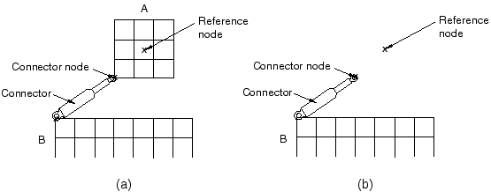

# 2.9.1 显示体定义


**产品：** Abaqus/Standard  Abaqus/Explicit  Abaqus/CAE

##### **参考文献**

- [*DISPLAY BODY](../key/key-link.md#usb-kws-mdisplaybody)
- ["定义显示体约束，" Abaqus/CAE用户指南第15.15.3节](../usi/usi-link.md#usi-itn-helptopic-display)

### 概述

显示体：
- 可以是二维平面、轴对称或三维；
- 与部件实例关联，最多有三个参考节点，使得部件实例的运动受参考节点运动的控制；
- 仅用于显示目的，不参与分析；
- 可用于在改善分析结果可视化的同时提高分析效率；以及
- 对于机构或多体动力学分析特别有用。

### 什么是显示体？

显示体是仅用于显示的部件实例。该实例的节点和单元都不参与分析，但它们在后处理期间仍然可用。显示体的运动受关联参考节点（如果有）的运动控制。它表现得像刚体，因为部件实例的节点和单元的相对位置在整个模拟过程中保持不变。部件实例的节点和单元不能用于定义规定条件、相互作用、约束等。不必为单元分配截面属性。

当物理模型与用于分析的理想化模型不同时，显示体非常有用。理想化模型可能难以可视化；为了真实的后处理目的，在模型中包含更多细节可能会有所帮助。显示体允许这样做而不会增加分析时间。

显示体在刚体通过连接器相互作用的机构或多体动力学问题中特别有用。在这种情况下，一个部件可以由一个非常简单的刚体和一个更复杂的显示体表示。在这种情况下，刚体可以像只有一个节点一样简单，以及附加到该节点的质量和转动惯量单元。

显示体也可用于对不参与分析但有助于可视化的静止物体进行建模。

### 创建显示体

您必须指定要作为显示体的部件实例。

| **输入文件用法：** | ``` [*DISPLAY BODY](../key/key-link.md#usb-kws-mdisplaybody), INSTANCE=*name* ``` |
| --- | --- |

| **Abaqus/CAE用法：** | 相互作用模块：**创建约束**：**显示体**：选择部件实例 |
| --- | --- |

#### 参考节点

如果显示体未与任何参考节点关联，它将在分析期间保持固定在空间中。但是，您可以指定显示体的运动应受选定参考节点运动的控制。这些节点必须属于装配中的另一个部件实例。它们不能属于另一个显示体定义。如果您仅指定一个参考节点，显示体将根据分析期间该节点的平移和旋转进行平移和旋转。如果参考节点没有转动自由度，显示体在分析期间将不会旋转。

如果您指定三个参考节点，显示体将根据所有三个节点的平移进行平移和旋转。部件实例在任何时刻的新位置将从由三个参考节点定义的坐标系的新位置和方向计算：第一个节点是原点，第二个节点是x方向上的一个点，第三个节点是X-Y平面中的一个点。在指定这三个节点时应小心，以确保它们在分析的任何阶段都不会共线。如果发生这种情况，部件实例的位置可能会在该增量中突然改变。

| **输入文件用法：** | ``` [*DISPLAY BODY](../key/key-link.md#usb-kws-mdisplaybody), INSTANCE=*name* *first reference node number, second reference node number, third reference node number* ``` |
| --- | --- |

| **Abaqus/CAE用法：** | 相互作用模块：**创建约束**：**显示体**：选择部件实例，选择**跟随单点**或**跟随三点**，单击**编辑**，然后选择参考点 |
| --- | --- |

### 将显示体与连接器一起使用

显示体可用于有效建模包含使用连接器单元相互作用的刚性部件实例的模型。这样的模型需要刚体和显示体。刚体应包含连接器使用的节点、用于定义质量和惯性属性的节点，以及用于施加载荷或边界条件的节点。显示体应包含表示物理部件的节点和单元。应小心确保刚体中的节点不是显示体的一部分。显示体的参考节点通常与刚体参考节点相同。

[图2.9.1-1](pt01ch02s09aus27.md#usb-int-displaybody-a)(a)展示了一个包含刚体和显示体的模型。

**图2.9.1-1** 显示体示例。



部件实例A包含在显示体定义中。[图2.9.1-1](pt01ch02s09aus27.md#usb-int-displaybody-a)(b)显示没有显示体的相同模型。此模型实际上将参与分析。连接器节点和参考节点形成一个刚体，代表部件实例A的分析版本。这两个节点都是装配级节点，不包含在显示体中。

### 输入文件模板

以下输入显示了如何在具有刚性部件实例和连接器的模型中使用显示体：

```
*ASSEMBLY
...
*INSTANCE, NAME=INST1
...
*END INSTANCE
*NODE, NSET=INST1-REFNODE
1001, -10, 0, 0
*NODE, NSET=INST1-CONNECTOR-NODE
1002, -5, -5, 0
*RIGID BODY, TIE NSET=INST1-CONNECTOR-NODE, 
REF NODE=INST1-REFNODE
*DISPLAY BODY, INSTANCE=INST1
1001
...
*END ASSEMBLY
```


