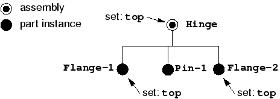
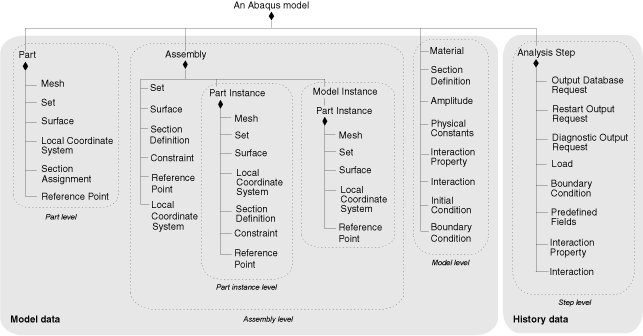
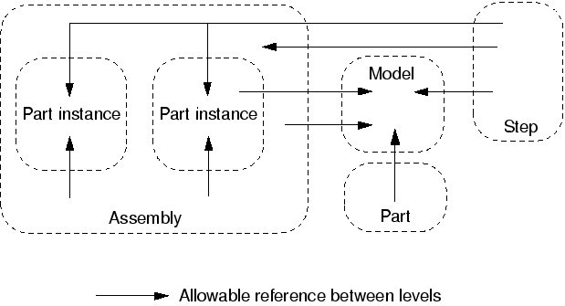
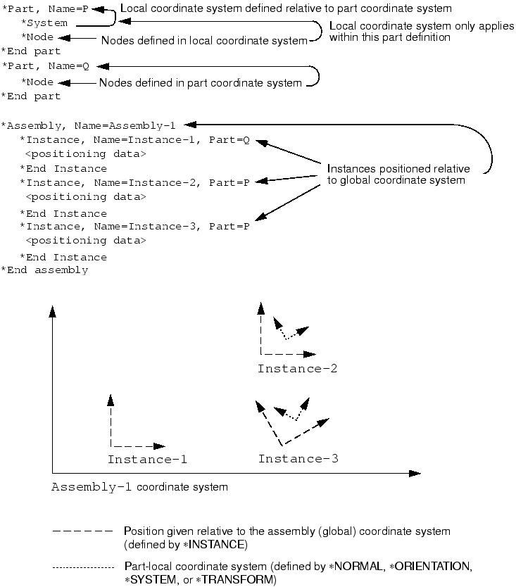

# 2.10.1 定义装配


**产品：** Abaqus/Standard  Abaqus/Explicit

##### **参考文献**

- [*ASSEMBLY](../key/key-link.md#usb-kws-massembly)
- [*INSTANCE](../key/key-link.md#usb-kws-minstance)
- [*PART](../key/key-link.md#usb-kws-mpart)

### 概述

Abaqus中的有限元模型可以定义为部件实例的装配。这种模型的组织方式：
- 与Abaqus/CAE生成的模型一致，并在可视化模块（Abaqus/Viewer）中显示；以及
- 允许重复使用部件定义，这对于创建大型复杂模型很有价值。

默认情况下，Abaqus/CAE编写的输入文件以部件实例装配的形式编写。对于不是由Abaqus/CAE编写的输入文件，部件和装配定义在输入文件中的使用当前是可选的。但是，由于可视化模块以部件实例装配的形式显示结果，如果输入文件中未定义装配和至少一个部件实例，则分析输入文件处理器将自动创建它们。

### 引言

物理模型通常通过组装各种组件来创建。Abaqus中的装配界面允许分析师使用与物理装配平行的组织方案创建有限元网格。在Abaqus中，组装在一起的组件称为*部件实例*。本节说明如何通过部件实例的装配来组织Abaqus有限元模型。

网格通过定义部件然后组装每个部件的实例来创建。每个部件可以使用（实例化）一次或多次，每个部件实例在装配中有自己的位置。这种模型定义组织方式与在Abaqus/CAE中创建模型的方式相匹配，其中装配可以交互创建或从输入文件导入（请参阅[Abaqus/CAE用户指南](../usi/usi-link.md#usi)）。

#### 术语

**

装配

**

装配是定位部件实例的集合。通过为装配定义边界条件、约束、相互作用和载荷历史来进行分析。

**

部件

**

部件是对象的有限元理想化。部件是装配的构建块，可以是刚性的或变形的。部件是可重用的；可以在装配中实例化多次。部件不直接进行分析；部件就像其实例的蓝图。

**

部件实例

**

部件实例是部件在装配中的使用。为部件定义的所有特征（如网格和截面定义）都成为该部件每个实例的特征——它们被部件实例*继承*。每个部件实例在装配中独立定位。

#### 示例

如图2.10.1-1所示，铰链可以使用两个法兰和一个销来建模。法兰几何形状通过创建部件来定义，该部件在铰链接头中实例化两次。另一个部件（销）被创建并实例化一次。销被建模为由解析表面创建的刚体（请参阅["解析刚性表面定义，" 第2.3.4节](pt01ch02s03aus19.md)）。

**图2.10.1-1** 铰链接头。


本节中使用此铰链示例来说明部件和装配的关键字界面。此示例也用于说明交互式装配过程（请参阅["Abaqus入门：交互版"](../gsa/gsa-link.md#gsa)）。

### 定义部件、部件实例和装配

在部件、实例或装配内定义的所有内容对该部件、实例或装配都是局部的。这意味着节点/单元标识符和名称（如集合和表面名称）在整个模型中不必唯一；它们只需要在定义它们的部件、实例或装配中是唯一的（请参阅["输出"中的"查看数据文件中的部件和装配信息，" 第4.1.1节](pt02ch04s01aus38.md#usb-out-ooutput-dat-partassy)）。名称不应使用下划线连接部件实例名称与单元集、节点集、方向名称或分布名称，因为这些名称可能与Abaqus使用的内部名称冲突。

例如，参见[图2.10.1-2](pt01ch02s10aus28.md#ipartassy-hinge-hierarchy)。在此模型中，装配（`Hinge`）包含三个部件实例（`Flange-1`、`Flange-2`和`Pin-1`）。可以定义多个名为`top`的集合：在本例中，一个在装配级别定义，一个在每个`Flange`部件实例中定义。集合名称`top`可以重复使用，每个名为`top`的集合都独立于其他集合。

**图2.10.1-2** `Hinge`装配的组织。



| **输入文件用法：** | 使用以下选项开始和结束每个部件、实例和装配定义： |
| --- | --- |
|  | ``` [*PART](../key/key-link.md#usb-kws-mpart)/[*END PART](../key/key-link.md#usb-kws-mendpart) [*INSTANCE](../key/key-link.md#usb-kws-minstance)/[*END INSTANCE](../key/key-link.md#usb-kws-mendinstance) [*ASSEMBLY](../key/key-link.md#usb-kws-massembly)/[*END ASSEMBLY](../key/key-link.md#usb-kws-mendassembly) ``` 如果这些选项中的任何一个出现在输入文件中，则必须全部出现，除非您从先前分析导入部件实例；在这种情况下，不需要[*PART](../key/key-link.md#usb-kws-mpart)和[*END PART](../key/key-link.md#usb-kws-mendpart)。模型必须始终如一地定义为部件实例的装配。 |

#### 定义部件

部件定义必须出现在装配定义之外。可以在模型中定义多个部件；每个部件必须有一个唯一名称。

| **输入文件用法：** | 使用以下选项定义部件： |
| --- | --- |
|  | ``` [*PART](../key/key-link.md#usb-kws-mpart), NAME=*PartName* *Node, element, section, set, and surface definitions* [*END PART](../key/key-link.md#usb-kws-mendpart) ``` |

#### 定义部件实例

部件实例定义必须出现在装配定义内。如果部件实例不是从先前分析导入的，则每个部件实例必须有一个唯一名称并引用部件名称。不允许使用`Assembly`作为部件实例名称。此外，您可以指定用于在装配中定位实例的数据。给出相对于装配（全局）坐标系原点的部件实例的平移和旋转。

如果部件实例是从先前分析导入的，则每个部件实例必须指定要导入的实例名称。有关使用导入功能定义部件实例的更多信息，请参阅["在Abaqus分析之间传输结果：概述，" 第9.2.1节](pt04ch09s02aus54.md)。

可以在实例级别定义其他集合和表面，如本节后面所述。

| **输入文件用法：** | 使用以下选项实例化不是从先前分析导入的部件： |
| --- | --- |
|  | ``` [*INSTANCE](../key/key-link.md#usb-kws-minstance), NAME=*InstanceName*, PART=*PartName* * <positioning data>* * Additional set and surface definitions (optional)* [*END INSTANCE](../key/key-link.md#usb-kws-mendinstance) ``` 重复这些选项，每次引用相同的部件名称，以多次实例化部件。使用以下选项从先前分析导入部件实例： ``` [*INSTANCE](../key/key-link.md#usb-kws-minstance), INSTANCE=*instance-name* * Additional set and surface definitions (optional)* [*IMPORT](../key/key-link.md#usb-kws-mimport) [*END INSTANCE](../key/key-link.md#usb-kws-mendinstance) ``` |

#### 定义装配

在模型中只能定义一个装配。所有部件实例定义必须出现在装配定义内。

可以通过在装配定义内包含适当的定义来在装配级别定义集合和表面。

| **输入文件用法：** | 使用以下选项创建装配： |
| --- | --- |
|  | ``` [*ASSEMBLY](../key/key-link.md#usb-kws-massembly), NAME=*name* *Part instance definitions* *Set and surface definitions* *Connector and constraint definitions* *Rigid body definitions* [*END ASSEMBLY](../key/key-link.md#usb-kws-mendassembly) ``` |

#### 示例

如图2.10.1-1所示的铰链接头可以使用以下语法在输入文件中定义：

```
[*PART](../key/key-link.md#usb-kws-mpart), NAME=Flange
   [*NODE](../key/key-link.md#usb-kws-mnode), NSET=Flange
    1, ...
    2, ...
    ...
    360, ...
   [*ELEMENT](../key/key-link.md#usb-kws-melement), ELSET=Flange
    1, ...
    2, ...
    ...
    200, ...
   [*SOLID SECTION](../key/key-link.md#usb-kws-msolidsection), ELSET=Flange, MATERIAL=Steel
   [*ELSET](../key/key-link.md#usb-kws-melset), ELSET=Flat, GENERATE
    176, 200, 1
   [*SURFACE](../key/key-link.md#usb-kws-msurface), NAME=Flat
    Flat, S1
[*END PART](../key/key-link.md#usb-kws-mendpart)
[*PART](../key/key-link.md#usb-kws-mpart), NAME=Pin
   [*NODE](../key/key-link.md#usb-kws-mnode), NSET=RefPt
    1, ...
   [*SURFACE](../key/key-link.md#usb-kws-msurface), TYPE=REVOLUTION, NAME=Pin
    ...
   [*RIGID BODY](../key/key-link.md#usb-kws-mrigidbody), REF NODE=1, ANALYTICAL SURFACE=Pin
[*END PART](../key/key-link.md#usb-kws-mendpart)
[*ASSEMBLY](../key/key-link.md#usb-kws-massembly), NAME=Hinge
   [*INSTANCE](../key/key-link.md#usb-kws-minstance), NAME=Flange-1, PART=Flange
    *<positioning data>*
   [*END INSTANCE](../key/key-link.md#usb-kws-mendinstance)
   [*INSTANCE](../key/key-link.md#usb-kws-minstance), NAME=Flange-2, PART=Flange
    *<positioning data>*
   [*END INSTANCE](../key/key-link.md#usb-kws-mendinstance)
   [*INSTANCE](../key/key-link.md#usb-kws-minstance), NAME=Pin-1, PART=Pin
    *<positioning data>*
   [*END INSTANCE](../key/key-link.md#usb-kws-mendinstance)
   [*ELSET](../key/key-link.md#usb-kws-melset), ELSET=Top
    ...
   [*NSET](../key/key-link.md#usb-kws-mnset), NSET=Output
    ...
[*END ASSEMBLY](../key/key-link.md#usb-kws-mendassembly)
[*MATERIAL](../key/key-link.md#usb-kws-mmaterial), NAME=Steel
 ...
```

##### 注释

- 描述`Flange`部件的所有节点和单元都定义在[*PART](../key/key-link.md#usb-kws-mpart)和[*END PART](../key/key-link.md#usb-kws-mendpart)选项之间。截面定义（[*SOLID SECTION](../key/key-link.md#usb-kws-msolidsection)）也必须出现在部件定义内。
- 必须在`Flange`部件内定义至少一个单元集，以便截面定义可以引用它。也可以在部件中定义其他节点和单元集。
- `Flange`部件在`Hinge`装配中实例化两次。因此，模型包含两个名为`Flat`的单元集：一个属于部件实例`Flange-1`，另一个属于部件实例`Flange-2`。
- 当对网格化部件进行实例化时，节点和单元编号在每个部件实例中重复。
- `Pin`部件实例化一次。它是由解析表面创建的刚体（请参阅["解析刚性表面定义，" 第2.3.4节](pt01ch02s03aus19.md)）。
- 关键字可以缩进以帮助澄清每个部件、部件实例和装配的定义。

### 组织模型定义

在传统的没有装配定义的Abaqus模型中，模型的组件分为两类之一：模型数据（步骤独立）和历史数据（步骤相关）。在组织为部件实例装配的Abaqus模型中，所有组件进一步分类，必须落在适当的级别：部件、装配、实例、步骤或模型。步骤级组件对应历史数据；所有步骤相关组件定义必须出现在步骤定义内（请参阅["定义分析，" 第6.1.2节](pt03ch06s01abo05.md)）。模型级数据包括所有不属于部件级、装配级、实例级或步骤级数据的内容（例如，材料定义；请参阅[图2.10.1-3](pt01ch02s10aus28.md#ipartassy-data-model)）。关键字选项必须出现在输入文件中的适当级别在[Abaqus关键字参考指南](../key/key-link.md#key)中每个节的顶部标明。

**图2.10.1-3** 以部件实例装配形式定义的模型的组织。



### 定义装配的规则

通过遵循一些基本规则来实现[图2.10.1-3](pt01ch02s10aus28.md#ipartassy-data-model)中所示的组织。

#### 在级别之间引用项目

创建模型时，通常需要引用当前级别之外的内容；例如，部件内的截面定义必须引用在模型级别定义的材料。在步骤内定义的载荷必须引用装配内的集合。但是，某些级别之间的引用是不允许的；例如，一个部件实例中的集合不能引用另一个部件实例中的节点。允许以下引用：

| 在以下位置内的定义： | 可以引用以下位置内的项目： |
| --- | --- |
| 装配 | 实例 |
|  | 模型 |
| 实例 | 模型 |
| 部件 | 模型 |
| 步骤 | 装配 |
|  | 实例 |
|  | 模型 |

[图2.10.1-4](pt01ch02s10aus28.md#ipartassy-scope)说明了这些规则。

**图2.10.1-4** 级别之间允许的引用。



#### 命名约定

Abaqus命名约定允许模型包含装配。当在部件、实例或装配内定义某些内容并从其级别外部引用时，必须使用完整名称来标识它（例如，装配`Hinge`中实例`Flange-2`的集合`Flat`）。在输入文件中使用"点"表示法给出完整名称：层次结构中的每个名称用"."（句点）分隔。例如，`Hinge`装配中的一些完整名称是

| `Hinge.Flange-2.Flat` | 属于部件实例`Flange-2`的单元集。 |
| --- | --- |
| `Hinge.Output` | 属于装配`Hinge`的节点集。 |

这些名称用于从装配外部引用集合。相同的语法用于引用单个节点或单元。

| `Hinge.Flange-1.3` | 属于部件实例`Flange-1`的节点或单元。 |
| --- | --- |
| `Hinge.Flange-2.11` | 属于部件实例`Flange-2`的节点或单元。 |

与往常一样，上下文决定引用的是节点还是单元。"。"有特殊含义；它用于在完整名称中分隔各个名称。因此，"。"不能在集合和表面名称等标签中使用。例如，

| `[*ELSET](../key/key-link.md#usb-kws-melset), ELSET=Set.1` | 错误 |
| --- | --- |
| `[*ELSET](../key/key-link.md#usb-kws-melset), ELSET=Set1` | 正确 |

完整名称限制为80个字符，包括句点。

但是，当引用未以部件实例装配形式定义的输入文件中的名称时，名称中的"."应替换为下划线。例如，当前分析引用先前分析中的单元集，但当前输入文件不是以部件实例装配形式定义时，就会出现这种情况。

##### 带引号的标签

集合和表面名称的标签可以通过用引号括起标签来定义（请参阅["输入语法规则，" 第1.2.1节](pt01ch01s02aus01.md)）。在完整名称中任何后续使用该标签时也必须用引号括起。例如，

```
[*PART](../key/key-link.md#usb-kws-mpart), NAME=Flange
 ...
[*ELSET](../key/key-link.md#usb-kws-melset), ELSET="Set 1"
 ...
[*END PART](../key/key-link.md#usb-kws-mendpart)
 ...
[*ELEMENT OUTPUT](../key/key-link.md#usb-kws-helementoutput), ELSET=Hinge.Flange-1."Set 1"
```

##### 示例

装配节点集`Top`可以通过以下语法定义：

```
[*ASSEMBLY](../key/key-link.md#usb-kws-massembly), NAME=Hinge
   ...
   [*NSET](../key/key-link.md#usb-kws-mnset), NSET=Top
    Flange-1.2, Flange-1.5, ...
    Flange-2.1, Flange-2.4, ...
[*END ASSEMBLY](../key/key-link.md#usb-kws-mendassembly)
```

由于节点集在装配级别定义，因此数据行上给出的完整名称不包含`Hinge.`。但是，请求此节点集的输出需要前缀`Hinge.`，因为输出请求存在于步骤定义中，而步骤定义在装配级别之外。
```
[*STEP](../key/key-link.md#usb-kws-hstep)
     ...
     [*NODE OUTPUT](../key/key-link.md#usb-kws-hnodeoutput), NSET=Hinge.Top
[*END STEP](../key/key-link.md#usb-kws-hendstep)
```

类似地，边界条件可以应用于为部件实例`Flange-2`定义的集合。
```
[*STEP](../key/key-link.md#usb-kws-hstep)
     ...
     [*BOUNDARY](../key/key-link.md#usb-kws-hboundary)
      Hinge.Flange-2.FixedEnd, 1, 3
[*END STEP](../key/key-link.md#usb-kws-hendstep)
```

#### 网格（节点和单元）

- 网格可以在部件上定义，也可以在该部件的实例上定义（不能同时在两者上定义）。通常，部件被网格化，实例继承该网格，但并非必须。例如，如果您想对一个部件实例使用完全积分单元，对另一个使用减缩积分单元，或者如果您想在一个部件实例上定义比另一个更精细的网格，则必须分别对实例进行网格划分。
- 如果在部件上定义了网格，则该部件的每个实例都继承该网格。
- 如果在部件上定义了网格，则不能在部件实例上重新定义（覆盖）该网格。换句话说，如果节点和单元定义出现在部件定义内，它们就不能出现在该部件的实例定义内。
- 如果在部件上未定义网格，则必须在该部件的每个实例上定义网格。
- 即使未在部件上定义网格，也需要部件定义。在这种情况下，空部件定义仅用于通过实例定义将各个实例相互关联。这允许可视化模块按部件对信息进行分组。
- 钢筋必须与被加固的单元一起在部件内定义。
- 参考节点可以在装配级别创建。
- 只有质量、转动惯量、电容、连接器、弹簧和阻尼器单元可以在部件或装配级别创建。所有其他单元类型必须在部件内（或部件实例内）定义。要定义引用部件级节点的装配级单元，请在定义单元连接性时包含部件实例名称。例如： ``` [*ELEMENT](../key/key-link.md#usb-kws-melement), TYPE=MASS 1, Instance-1.10 ```

#### 截面定义

- 必须在定义网格的位置分配截面（无论是在部件定义内还是在部件的每个实例内）。
- 如果部件被网格化，则该部件的所有实例具有相同的单元类型并由相同的材料制成。
- 截面定义引用的集合必须在与网格和截面定义相同的级别创建。
- 如果部件被网格化，则截面分配不能在实例级别被覆盖。

#### 集合和表面

- 集合和表面（刚性或变形）可以在部件、部件实例或装配内创建。
- 如果在部件上定义了网格，则可以在部件上创建集合和表面。
- 在部件上定义的集合和表面被该部件的每个实例继承。
- 装配级集合，以及Abaqus/Standard中的从属表面，可以跨越部件实例。
- 如果具有相同名称的单元集或节点集定义在同一级别出现多次，则新成员将附加到集合中。
- 表面定义不能在同一级别内以相同表面名称出现多次。
- 可以在部件实例上创建新集合和表面。如果在部件实例上定义了集合或表面，而该名称的集合或表面未在部件上定义，则该集合或表面被添加到实例中。
- 集合和表面不能在部件实例上重新定义。如果在部件实例上定义了集合或表面，而该名称的集合或表面也在部件上定义了，则会产生错误。
- 集合和表面不是步骤相关的。所有集合和表面必须在部件、部件实例或装配内定义。

##### 定义装配级集合

您可以在单元集或节点集定义中引用部件实例，作为在定义装配级集合时使用完整名称的快捷方式。指定包含指定单元或节点的实例名称。要将多个实例中的单元或节点添加到集合中，请重复单元集或节点集定义（有关更多详细信息，请参阅["节点定义，" 第2.1.1节](pt01ch02s01aus05.md)和["单元定义，" 第2.2.1节](pt01ch02s02aus11.md)）。

| **输入文件用法：** | 使用以下选项定义装配级集合： |
| --- | --- |
|  | ``` [*NSET](../key/key-link.md#usb-kws-mnset), NSET=*NsetName*, INSTANCE=*InstanceName* [*ELSET](../key/key-link.md#usb-kws-melset), ELSET=*ElsetName*, INSTANCE=*InstanceName* ``` |

##### 在重启时添加集合和表面

- 现有集合和表面不能在重启时重新定义。
- 解析表面不能在重启时创建。
- 可以在重启时向部件实例或装配添加新集合和表面（不包括解析表面）。要添加集合或表面，请给出完整名称。与原始分析一样，您可以从单元集或节点集定义中引用部件实例名称，以在重启分析中定义装配级集合。例如， ``` [*HEADING](../key/key-link.md#usb-kws-mheading) [*RESTART](../key/key-link.md#usb-kws-mrestart), READ, STEP=1 ** 向装配"Hinge"添加单元集"Bottom"： [*ELSET](../key/key-link.md#usb-kws-melset), ELSET=Hinge.Bottom Flange-1.40, Flange-2.99 ** 向装配"Hinge"添加节点集"Top"： [*NSET](../key/key-link.md#usb-kws-mnset), NSET=Hinge.Top, Instance=Flange-1 21, 22, 23, 24, 26, 28, 31 [*NSET](../key/key-link.md#usb-kws-mnset), NSET=Hinge.Top, Instance=Flange-2 21, 22, 23, 24, 26, 28, 31 ** ** 向部件实例"Flange-2"添加单元集"Right"： [*ELSET](../key/key-link.md#usb-kws-melset), ELSET=Hinge.Flange-2.Right 16, 18, 20, 29 ** ** 向部件实例"Flange-2"添加表面"surfR"： [*SURFACE](../key/key-link.md#usb-kws-msurface), TYPE=ELEMENT, NAME=Hinge.Flange-2.surfR Right, S1 ** [*STEP](../key/key-link.md#usb-kws-hstep) ... [*END STEP](../key/key-link.md#usb-kws-hendstep) ```

#### 刚体

刚体可以在部件级别或装配级别定义。
- 要在部件级别定义刚体，请在部件定义内包含刚体和刚体参考节点定义。
- 刚性单元、变形单元和解析表面不能在同一部件内组合。
- 如果在部件内定义刚体，则该部件中的所有变形、刚性或连接器单元必须属于该刚体。
- 质量、转动惯量、弹簧、阻尼器和热容单元可以包含在包含刚体定义的部件中，但这些单元不能属于刚体。
- 要从解析表面创建部件级刚体，请在部件定义内包含表面定义。每个部件只允许一个解析表面。
- 要在装配级别定义刚体，请在装配定义内包含刚体和参考节点定义。
- 可以在装配级别从刚性单元、变形单元和最多一个解析表面的任意组合创建刚体。
- 刚体定义可以引用装配级或部件级集合。
- 包含刚体定义的部件不能包含在装配级刚体中。
- 您可以独立于刚体定义在部件或装配级别定义离散表面。
- 解析表面定义只能出现在部件定义内，即使刚体是在装配级别定义的。

#### 材料

- 材料在模型级别定义，以便可以重复使用。材料定义不能出现在部件、部件实例或装配内。
- 模型中的所有材料必须具有唯一名称。

#### 相互作用

相互作用是表面之间或表面与其环境之间的关系。Abaqus中的相互作用包括接触、辐射、薄膜条件和单元基础。
- 相互作用在Abaqus/Standard中在模型级别定义，在Abaqus/Explicit中在模型级别或步骤内定义；它们不能在部件、装配或实例内定义。

#### 约束

约束是不可弯曲的耦合机制，如MPC和方程（请参阅["运动约束：概述，" 第35.1.1节](pt08ch35s01abo32.md))。
- 约束可以在部件或装配内定义。如果网格在部件实例内定义，也可以在部件实例内定义约束。如果约束约束一个部件实例相对于另一个部件实例的运动，则应在装配级别定义约束。
- 约束根据为部件实例给出的定位数据进行平移和旋转。

#### 分布

分布用于指定选定单元属性、材料属性、局部坐标系和初始接触间隙的空间变化的任意变化（请参阅["分布定义，" 第2.8.1节](pt01ch02s08aus26.md)。
- 分布应在使用它们的级别定义。例如，如果分布用于定义壳厚度，则应在与引用它的截面定义相同的级别定义分布。如果分布用于定义材料属性，则应与材料定义一起在模型级别定义。

#### 示例

在以下示例中，为了清晰起见，省略了大多数参数和数据行。

| 示例1 |  | 注释 |
| --- | --- | --- |
| [*PART](../key/key-link.md#usb-kws-mpart), NAME=PartA |  |  |
| [*NODE](../key/key-link.md#usb-kws-mnode) ... |  | 网格在部件上定义。 |
| [*ELEMENT](../key/key-link.md#usb-kws-melement) ... |
| [*SOLID SECTION](../key/key-link.md#usb-kws-msolidsection), ELSET=setA, MATERIAL=Mat1 |  | 如果在部件上定义了网格，则截面分配必须出现在部件级别。 |
| [*SURFACE](../key/key-link.md#usb-kws-msurface), NAME=surf1 setB, ... | 错误 | 单元集`setB`未在部件级别定义。 |
| [*ELSET](../key/key-link.md#usb-kws-melset), ELSET=setA |  | 由于网格在部件上定义，因此可以在部件上定义集合和表面。 |
| [*NSET](../key/key-link.md#usb-kws-mnset), NSET=setA |
| [*SURFACE](../key/key-link.md#usb-kws-msurface), NAME=surf2 setA, ... |
| [*END PART](../key/key-link.md#usb-kws-mendpart) |  |  |
| [*ASSEMBLY](../key/key-link.md#usb-kws-massembly), NAME=Assembly-1 |  |  |
| [*INSTANCE](../key/key-link.md#usb-kws-minstance), NAME=I1, PART=PartA |  |  |
| [*NODE](../key/key-link.md#usb-kws-mnode) | 错误 | 如果在部件上定义了网格和截面分配，则不能在实例上定义。 |
| [*ELEMENT](../key/key-link.md#usb-kws-melement) | 错误 |
| [*SOLID SECTION](../key/key-link.md#usb-kws-msolidsection) | 错误 |
| [*ELSET](../key/key-link.md#usb-kws-melset), ELSET=setA | 错误 | 集合和表面不能在实例上重新定义。 |
| [*NSET](../key/key-link.md#usb-kws-mnset), NSET=setA | 错误 |
| [*SURFACE](../key/key-link.md#usb-kws-msurface), NAME=surf2 | 错误 |
| [*ELSET](../key/key-link.md#usb-kws-melset), ELSET=setB |  | 可以在实例上定义新集合和表面。 |
| [*NSET](../key/key-link.md#usb-kws-mnset), NSET=setB |
| [*SURFACE](../key/key-link.md#usb-kws-msurface), NAME=surf3 setA, ... |  | 集合和表面定义可以引用继承的集合。 |
| [*END INSTANCE](../key/key-link.md#usb-kws-mendinstance) |  |  |
| [*END ASSEMBLY](../key/key-link.md#usb-kws-mendassembly) |  |  |

在第二个示例中，实例被网格化。

| 示例2 |  | 注释 |
| --- | --- | --- |
| [*PART](../key/key-link.md#usb-kws-mpart), NAME=PartB |  | 即使实例被网格化，也需要[*PART](../key/key-link.md#usb-kws-mpart)和[*END PART](../key/key-link.md#usb-kws-mendpart)选项。 |
| [*END PART](../key/key-link.md#usb-kws-mendpart) |
| [*PART](../key/key-link.md#usb-kws-mpart), NAME=PartC |  | 如果在部件上未定义网格，则不能在部件上定义截面。 |
| [*SOLID SECTION](../key/key-link.md#usb-kws-msolidsection), ... | 错误 |
| [*END PART](../key/key-link.md#usb-kws-mendpart) |  |
| [*ASSEMBLY](../key/key-link.md#usb-kws-massembly), NAME=Assembly-1 |  |  |
| [*INSTANCE](../key/key-link.md#usb-kws-minstance), NAME=I1, PART=PartB |  |  |
| [*NODE](../key/key-link.md#usb-kws-mnode) ... |  | 网格在部件实例上定义。 |
| [*ELEMENT](../key/key-link.md#usb-kws-melement) ... |
| [*SOLID SECTION](../key/key-link.md#usb-kws-msolidsection), ELSET=setA, MATERIAL=Mat1 |  | 截面分配必须出现在与网格定义相同的级别。 |
| [*ELSET](../key/key-link.md#usb-kws-melset), ELSET=setA |  | 由于网格在实例上定义，因此集合和表面在实例上定义。 |
| [*NSET](../key/key-link.md#usb-kws-mnset), NSET=setA |
| [*SURFACE](../key/key-link.md#usb-kws-msurface), NAME=surf2 setA, ... |
| [*END INSTANCE](../key/key-link.md#usb-kws-mendinstance) |  |  |
| [*INSTANCE](../key/key-link.md#usb-kws-minstance), NAME=I3, PART=PartC *<positioning data>* | 错误 | 由于部件未网格化，因此必须为每个实例定义网格和截面。 |
| [*END INSTANCE](../key/key-link.md#usb-kws-mendinstance) |
| [*END ASSEMBLY](../key/key-link.md#usb-kws-mendassembly) |  |  |

### 坐标系定义

Abaqus提供了几种定义局部坐标系的方法。

**节点坐标系**

您可以在局部坐标系中定义节点坐标（请参阅["节点定义"中的"指定定义节点的局部坐标系"第2.1.1节](pt01ch02s01aus05.md#usb-int-inode-system-option)）。坐标系可以在部件定义内定义，以定义该部件中的节点。节点坐标系定义保持有效，直到在同一级别内定义另一个节点坐标系或该级别结束。

**节点转换**

节点转换用于施加载荷和边界条件（请参阅["转换坐标系，" 第2.1.5节](pt01ch02s01aus09.md)）。它可以在部件或装配级别定义，以定义用于施加载荷和边界条件或定义线性约束方程的局部坐标系。

**用户定义的方向**

用户定义的方向用于定义材料属性、耦合、连接器和钢筋（请参阅["方向，" 第2.2.5节](pt01ch02s02aus15.md)）。它可以在部件级别定义，以供截面、连接器、钢筋或耦合定义引用。方向定义也可以在装配级别使用，以供连接器或耦合定义引用。

**分布**

分布可用于指定连续体和壳单元局部坐标系的任意空间变化（请参阅["方向，" 第2.2.5节](pt01ch02s02aus15.md)）。由方向使用的分布应在定义方向的同一级别定义。

**节点处法向定义**

法向可以作为梁、管和壳单元节点定义的一部分在节点处定义，或者使用用户指定的法向定义（请参阅["节点处法向定义，" 第2.1.4节](pt01ch02s01aus08.md)）。这些法向可以在部件或装配级别定义。

使用任何这些方法为部件定义的局部坐标系被该部件所有实例继承。

#### 平移和旋转部件实例

装配的坐标系是全局坐标系。您可以通过相对于全局原点给出平移和/或旋转来在装配中定位部件实例。通过给出平移向量来指定平移。通过给出两个点*a*和*b*来定义旋转轴，加上绕该轴的右手角旋转，从而指定旋转。

在部件或部件实例内定义的局部坐标系将根据指定的定位数据进行平移和旋转（如图2.10.1-5所示）。（在此图中，为清晰起见省略了诸如单元和截面定义之类的细节。）在局部坐标系中给出的结果在转换后的局部系统中输出。方程也将根据实例的定位数据进行平移和旋转。部件（或部件实例）定义内的所有数据都相对于部件的局部坐标系定义；定位数据在实例内定义的所有内容之后应用到部件实例。

**图2.10.1-5** 定义局部坐标系。



### 限制

以下功能在以部件实例装配形式定义的模型中不受支持：
- ["节点定义"中的"将节点集从一个坐标系映射到另一个坐标系"第2.1.1节](pt01ch02s01aus05.md#usb-int-inode-nmap)
- ["参数形状变化"中的"使用辅助分析生成形状变化"第2.1.2节](pt01ch02s01aus06.md#usb-int-iparshapevar-auxanal)
- ["对称模型生成，" 第10.4.1节](pt04ch10s04aus63.md)
- ["从对称网格或部分三维网格向完整三维网格传输结果，" 第10.4.2节](pt04ch10s04aus64.md)
- ["用户定义单元"中的"从Abaqus/Standard结果文件读取单元矩阵"第32.15.1节](pt06ch32s15alm60.md#usb-elm-euserelem-linear-resultsfile)

子结构库不是以部件实例装配的形式组织的，因此不能从定义了装配的模型生成子结构。在定义了装配的模型中不支持子结构选项。

### 输入文件模板

此模板显示以此分析中定义的部件和装配形式编写的输入文件。有关如何从先前分析导入部件实例以传输模型数据和结果的模板，请参阅["在Abaqus/Explicit和Abaqus/Standard之间传输结果，" 第9.2.2节](pt04ch09s02aus55.md)和["从另一个Abaqus/Standard分析传输结果，" 第9.2.3节](pt04ch09s02aus56.md)。

```
[*HEADING](../key/key-link.md#usb-kws-mheading)
[*PART](../key/key-link.md#usb-kws-mpart), NAME=Part-1
   *Node, element, section, set, and surface definitions*
   *Connector and constraint definitions*
[*END PART](../key/key-link.md#usb-kws-mendpart)
[*PART](../key/key-link.md#usb-kws-mpart), NAME=Part-2
   **The instance is meshed, so the part definition is empty
[*END PART](../key/key-link.md#usb-kws-mendpart)
[*MATERIAL](../key/key-link.md#usb-kws-mmaterial), NAME=mat1
   *Suboptions and data lines to define this material*
[*ASSEMBLY](../key/key-link.md#usb-kws-massembly), NAME=Assembly-1
   [*INSTANCE](../key/key-link.md#usb-kws-minstance), NAME=i1, PART=Part-1
    *<positioning data>*
      *Additional set and surface definitions (optional)*
   [*END INSTANCE](../key/key-link.md#usb-kws-mendinstance)
   [*INSTANCE](../key/key-link.md#usb-kws-minstance), NAME=i2, PART=Part-2
    *<positioning data>*
      *Node, element, section, set, and surface definitions*
      *Connector and constraint definitions*
   [*END INSTANCE](../key/key-link.md#usb-kws-mendinstance)
   *Assembly-level set and surface definitions*
   *Assembly-level connectors and constraints*
   *Assembly-level reference node definitions*
   *Assembly-level rigid body definitions*
[*END ASSEMBLY](../key/key-link.md#usb-kws-mendassembly)
[*MATERIAL](../key/key-link.md#usb-kws-mmaterial), NAME=mat2
   *Suboptions and data lines to define this material*
[*AMPLITUDE](../key/key-link.md#usb-kws-mamplitude)
[*INITIAL CONDITIONS](../key/key-link.md#usb-kws-minitialcond)
[*BOUNDARY](../key/key-link.md#usb-kws-hboundary)
   *Zero-valued boundary conditions*
[*PHYSICAL CONSTANTS](../key/key-link.md#usb-kws-mphysicalconsts)
[*CONNECTOR BEHAVIOR](../key/key-link.md#usb-kws-mconnectorbehavior)
   *Suboptions and data lines to define this connector behavior*
*Interaction and interaction property definitions in Abaqus/Standard or Abaqus/Explicit*
[*STEP](../key/key-link.md#usb-kws-hstep)
   *Loads and boundary conditions*
   *Predefined field definitions*
   *Output requests*
   *Contact interaction definitions in Abaqus/Explicit*
[*END STEP](../key/key-link.md#usb-kws-hendstep)
```


