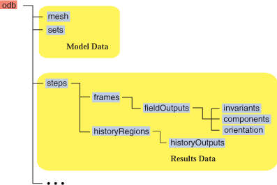

# 3.2.20 生成输出数据库报告


**产品：** Abaqus/Standard  Abaqus/Explicit  

##### **参考**

- ["Abaqus执行程序：概述，" 第3.1.1节](pt01ch03s01abo02.md)
- ["输出数据库的对象模型，" Abaqus脚本用户指南第10.5节](../cmd/cmd-link.md#cmd-odb-intro-structure-cpp)

### 概述

输出数据库报告实用工具将信息从Abaqus输出数据库(`.odb`)文件打印到格式化报告中。默认情况下，报告以纯文本格式打印；但是，您也可以创建HTML和CSV（逗号分隔值）格式的报告。

### 输出数据库结构

每个输出数据库由两个主要部分组成：模型数据和结果数据。数据库进一步细分为容器的层次结构，如[图3.2.20-1](pt01ch03s02abx20.md#odb-reportstructure)所示。

**图3.2.20-1** 输出数据库的结构



可以出现在报告中的数据位于每个分支最右侧的容器中。这些容器可用于对输出数据库的四个主要分支进行分类：
- **mesh**分支以包含模型节点坐标和元素连接信息的容器终止。
- **sets**分支以包含模型中集合和表面的名称及节点或元素标签的容器终止。
- **fieldOutputs**分支以包含分析中字段输出变量值的容器终止。这些值进一步细分为其向量或张量属性：**invariants**、**components**和**orientation**。
- **historyOutputs**分支以包含分析中历史输出变量值的容器终止。

树模型数据部分的容器是单数容器：每个模型有一个容器用于网格信息，一个容器用于集合信息。树结果部分的容器表示多个容器的聚合。对于多步分析，输出数据库将为分析的每一步提供一个单独的**step**容器。在每个**step**容器内有多个**frames**和**historyRegions**容器。在每个单独的**frames**容器内有多个**fieldOutputs**容器，依此类推。输出数据库为这些单独的容器分配名称或值，以帮助区分和识别它们。

有关输出数据库结构的更详细讨论，请参阅["输出数据库的对象模型，" Abaqus脚本用户指南第10.5节](../cmd/cmd-link.md#cmd-odb-intro-structure-cpp)。

### 生成摘要报告

如果您仅使用必需的文件和文件格式命令行选项生成报告，则报告将是输出数据库的简要摘要。此摘要包含以下信息的列表：
- 部件实例名称
- 模型中的节点数和元素数
- 集合和表面的名称
- 步骤和荷载情况的名称
- 步骤中的帧数
- 字段和历史输出变量的名称

此摘要中的信息可以帮助您确定输出数据库中容器的名称和值。

### 向报告添加信息

您可以使用其他命令行选项创建更全面的报告。这些选项大多数对应于[图3.2.20-1](pt01ch03s02abx20.md#odb-reportstructure)中概述的输出数据库结构中的容器。使用这些选项指定容器的名称或值会指示实用工具提取在该容器中找到的数据，并将其添加到生成的报告中。容器名称和值并不总是唯一的，可能在输出数据库中出现多次。例如，对应于帧1的容器可能会出现在多步分析的每个单独步骤容器中；类似地，包含特定字段输出变量的容器通常出现在该步骤的每一帧中。实用工具会将所有这些容器实例添加到报告中。

为了细化容器选择，您可以组合选项。当在命令行上指示来自同一分支的多个容器时，实用工具仅报告两个容器共有的数据。例如，如果两个选项指定第1步的容器和第3帧的容器，实用工具将仅把第一步骤第三帧的结果数据添加到报告中。如果指定来自不同分支的容器，则每个容器的数据都会被添加到报告中。例如，如果两个选项指定集合容器和历史区域容器，则集合数据和历史输出数据都会被添加到报告中。

您可以通过将相关选项设置为该容器的名称或值来识别特定容器。若要包含多个相同类型的容器，请将选项设置为一串用逗号分隔的列表。名称区分大小写。如果名称包含空格，则必须将整个值放在双引号内（`"*container name*"`）。

### 其他选项

输出数据库报告实用工具提供了一些额外的选项来控制报告的组织 和详细信息。这些选项除非与其他"容器"选项结合使用，否则不起作用。

### 命令摘要

| **abaqus odbreport** | **[**[**job**](pt01ch03s02abx20.md#job1-usb-int-dodbreportproc)=*job-name***]** |
| --- | --- |
|  | **[**[**odb**](pt01ch03s02abx20.md#odb2-usb-int-dodbreportproc)=*output-database-file***]** **[**[**mode**](pt01ch03s02abx20.md#mode3-usb-int-dodbreportproc)=**{**`HTML`** | **`CSV`**}****]** **[**[**all**](pt01ch03s02abx20.md#all4-usb-int-dodbreportproc)**]** **[**[**mesh**](pt01ch03s02abx20.md#mesh5-usb-int-dodbreportproc)**]** **[**[**sets**](pt01ch03s02abx20.md#sets6-usb-int-dodbreportproc)**]** **[**[**results**](pt01ch03s02abx20.md#results7-usb-int-dodbreportproc)**]** **[**[**step**](pt01ch03s02abx20.md#step8-usb-int-dodbreportproc)=**{***step-name*** | **`_LAST_`**}****]** **[**[**frame**](pt01ch03s02abx20.md#frame9-usb-int-dodbreportproc)=**{***number*** | ***load-case-name*** | ***description*** | **`_LAST_`**}****]** **[**[**framevalue**](pt01ch03s02abx20.md#framevalue10-usb-int-dodbreportproc)=**{***time*** | ***mode*** | ***frequency***}****]** **[**[**field**](pt01ch03s02abx20.md#field11-usb-int-dodbreportproc)=[*field-variable*]**]** **[**[**components**](pt01ch03s02abx20.md#components12-usb-int-dodbreportproc)**]** **[**[**invariants**](pt01ch03s02abx20.md#invariants13-usb-int-dodbreportproc)**]** **[**[**orientation**](pt01ch03s02abx20.md#orientation14-usb-int-dodbreportproc)**]** **[**[**histregion**](pt01ch03s02abx20.md#histregion15-usb-int-dodbreportproc)=*region-name***]** **[**[**history**](pt01ch03s02abx20.md#history16-usb-int-dodbreportproc)=[*history-variable*]**]** **[**[**instance**](pt01ch03s02abx20.md#instance17-usb-int-dodbreportproc)=**{***instance-name*** | **`_NONE_`**}****]** **[**[**blocked**](pt01ch03s02abx20.md#blocked18-usb-int-dodbreportproc)**]** **[**[**extrema**](pt01ch03s02abx20.md#extrema19-usb-int-dodbreportproc)**]** |

### 命令行选项

#### 必需选项

执行`abaqus odbreport`时必须包含以下选项之一。它们告诉实用工具在哪里找到输出数据库以及在哪里打印报告。将两个选项一起使用可以使报告的文件名与输出数据库名称不同。

**job**

此选项用于指定生成报告的文件名。如果省略此选项，实用工具将报告打印到标准输出设备。

**odb**

此选项用于指定要从中生成报告的输出数据库(`.odb`)文件。如果省略此选项，实用工具会在当前目录中查找名为`*job-name*.odb`的输出数据库。

#### 文件格式选项

**mode**

此选项指定生成报告的文件格式。如果省略此选项，报告为纯文本格式，文件扩展名为`.rep`。如果**mode**=`HTML`，则报告为HTML格式，文件扩展名为`.htm`。如果**mode**=`CSV`，则报告为逗号分隔值格式，文件扩展名为`.csv`。

#### 生成完整输出数据库报告的选项

**all**

此选项用于报告分析中每一步的所有可用模型信息和结果信息；每一步基态（零增量帧）的数据不包含在报告中。对于大型输出数据库，报告会非常长。

#### 报告模型数据的选项

以下选项从输出数据库的模型数据部分提取信息。

**mesh**

此选项用于报告与模型网格相关的节点坐标和元素连接信息。

**sets**

此选项用于报告与模型相关的所有集合和表面的名称和内容。

#### 报告结果数据的选项

以下选项从输出数据库的结果数据部分提取信息。

**results**

此选项用于报告输出数据库中的所有字段和历史输出变量值。如果您包含任何其他对应于特定结果容器的选项，则忽略此选项。

**step**

此选项用于报告指定步骤的字段和历史输出变量值。调用此选项时，必须将其设置为一个或多个步骤名称。如果**step**=`_LAST_`，则报告仅包含分析最后一步的结果。

**steps**容器在输出数据库的**fieldOutputs**和**historyOutputs**分支中都存在。如果将**step**选项与字段输出变量选项组合，则报告中仅显示字段输出变量数据。类似地，如果将**step**选项与历史输出变量选项组合，则报告中仅显示历史输出变量数据。如果将**step**选项与字段和历史输出变量选项组合，则两种类型的变量数据都会显示在报告中。

#### 报告字段输出变量的选项

以下选项从输出数据库**fieldOutputs**分支中的容器提取信息。

**frame**

此选项用于报告指定帧的字段输出变量值。调用此选项时，必须将其设置为一个或多个帧号、荷载情况名称或帧描述。初始（或"零增量"）帧只能通过设置**frame**=`0`来标识。如果**frame**=`_LAST_`，则报告仅包含每个包含步骤最后帧的结果。

**framevalue**

此选项用于报告指定帧值的字段输出变量值。每个帧可以通过与帧号唯一的帧值来标识。帧值是与帧关联的时间、特征模式号或频率点。

此选项可用作**frame**选项的替代或补充。调用此选项时，必须将其设置为一个或多个帧值。您提供的值不需要精确；实用工具将找到具有最接近帧值的帧。

**field**

此选项用于报告指定的字段输出变量值。如果调用此选项时未设置为任何变量名称，则报告中将包含所有字段变量容器。

#### 报告不同字段变量属性的选项

如果未调用以下任何选项，实用工具会自动为每个字段变量报告分量（以及如适用，方向）。否则，实用工具仅报告这些选项指定的属性。不干于所有字段变量都提供不变量和方向。

**components**

此选项用于报告所有字段输出变量的分量。

**invariants**

此选项用于报告所有字段输出变量的不变量值。

**orientation**

此选项用于报告每个字段输出变量的局部坐标系。

#### 报告历史输出变量的选项

以下选项从输出数据库**historyOutputs**分支中的容器提取信息。

**histregion**

此选项用于报告指定历史区域的历史输出变量值。调用此选项时，必须将其设置为一个或多个历史区域名称。

**history**

此选项用于报告指定的历史输出变量值。如果调用此选项时未设置为任何变量名称，则报告中将包含所有历史变量容器。

#### 其他选项

以下选项为报告添加了额外的控制级别和详细信息。它们不直接与输出数据库结构关联，不会向报告添加数据库信息。它们必须与前面描述的选项结合使用。

**instance**

此选项用于将报告的模型和结果数据限制为模型中的特定部件或装配实例。它不直接与任何输出数据库容器关联，也不会向报告添加任何数据。

调用此选项时，必须将其设置为一个或多个实例名称。如果**instance**=`_NONE_`，则报告包括整个装配和模型的数据。

**blocked**

此选项用于根据部件实例、元素类型和截面点将字段输出变量表细分为块。如果您对将大型模型不同区域的输出分开感兴趣，则此选项非常有用。默认情况下，表按变量名称和帧组织。

此选项指示报告实用工具使用字段批量数据API访问输出数据库。有关字段批量数据API如何操作的详细信息，请参阅["使用批量数据访问输出数据库，" Abaqus脚本用户指南第10.10.7节](../cmd/cmd-link.md#cmd-odb-intro-bulkdata-cpp)。此选项的另一个好处是在处理大量字段变量时提高实用工具的性能，从而加快报告生成。当报告中没有字段输出变量时，或者当也指定了**invariants**选项时，此选项不起作用。

**extrema**

此选项用于在每个节点坐标和字段输出变量表末尾报告最大值和最小值。默认情况下，这些极值不出现在报告中。如果报告中没有节点坐标或字段输出变量，此选项将不起作用。

### 示例

以下示例说明了**odbreport**执行程序的功能以及不同选项组合的效果。

#### 文件命名和格式化

以下命令在名为`beam.rep`的纯文本文件中生成输出数据库`beam.odb`的简要摘要：

```
abaqus odbreport job=beam
```

要创建相同格式的HTML格式报告，名称为`beamreport.htm`，请执行以下命令：
```
abaqus odbreport job=beamreport odb=beam mode=html
```

#### 向报告添加信息

使用其他命令行选项将指定容器中的数据添加到报告中。以下命令创建一个报告，列出模型中来自名为**Apply weight**的步骤的所有输出变量值的节点坐标和元素连接信息：

```
abaqus odbreport job=beam mesh step="Apply weight"
```

您可以使用选项组合来细化列出的结果数据。在以下示例中，实用工具仅报告在**Apply weight**步骤中从名为**Node350**的历史区域输出的历史输出变量值：
```
abaqus odbreport job=beam step="Apply weight" 
   histregion=Node350
```

如果容器由不唯一的名称或值标识，生成的报告将包含该容器的所有出现。以下命令创建一个报告，列出在每个单独步骤的第三帧中输出的字段变量RF的值：
```
abaqus odbreport job=beam frame=3 field=RF
```

要报告RF的大小而不是其分量，请使用**invariants**选项：
```
abaqus odbreport job=beam frame=3 field=RF invariants
```

要向报告中添加多个相同类型的容器，您可以将选项设置为一串用逗号分隔的列表。以下命令报告在**Apply weight**和**Side load**步骤期间输出的字段输出变量U和S的所有值：
```
abaqus odbreport job=beam step="Apply weight","Side load"
   field=U,S
```

#### 其他选项

使用**instance**选项可将报告的信息限制为模型的特定部分。以下命令报告集合名称和节点，以及来自数据库`motor.odb`每一步最后帧中S的值。但是，仅显示与部件实例**pistonA**相关的信息：

```
abaqus odbreport job=motor sets frame=_LAST_ field=S 
   instance=pistonA
```

#### 选择帧

**frame**和**framevalue**选项可以接受多种值类型，使它们成为强大的报告构建选项。由于这种多样性，有时需要调用两个选项来指定特定的帧。例如，考虑输出数据库`plate.odb`，它是稳态动态分析的结果。分析研究了板在三种不同荷载情况下在20个不同频率范围内的响应。因此，输出数据库在每个频率下包含三种不同荷载情况的结果。您对荷载情况**lc2**下45 Hz时的响应感兴趣。设置**frame**=`lc2`将报告荷载情况**lc2**在每个频率（总共20帧）的字段变量。设置**framevalue**=`45`将报告与45 Hz频率关联的每个荷载情况的字段变量（总共三帧）。要将报告限制为感兴趣的单个帧，必须同时调用两个选项：

```
abaqus odbreport job=plate frame=lc2 framevalue=45
```
