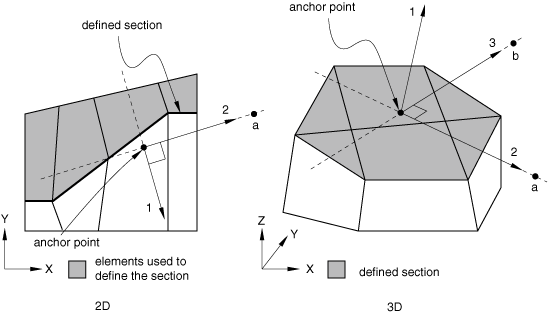
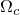
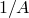

# 4.1.3 输出到输出数据库

**产品：** Abaqus/Standard  Abaqus/Explicit  Abaqus/CFD  Abaqus/CAE

##### **参考文献**

- ["基于元素的表面定义，" 第2.3.2节](pt01ch02s03aus17.md)
- ["积分输出截面定义，" 第2.5.1节](pt01ch02s05aus23.md)
- ["输出，" 第4.1.1节](pt02ch04s01aus38.md)
- ["后处理计算器，" 第4.3.1节](pt02ch04s03aus42.md)
- [*OUTPUT](../key/key-link.md#usb-kws-houtput)
- [*FILTER](../key/key-link.md#usb-kws-mfilter)
- [*CONTACT OUTPUT](../key/key-link.md#usb-kws-hcontactoutput)
- [*ELEMENT OUTPUT](../key/key-link.md#usb-kws-helementoutput)
- [*ENERGY OUTPUT](../key/key-link.md#usb-kws-henergyoutput)
- [*INTEGRATED OUTPUT](../key/key-link.md#usb-kws-hintegratedoutput)
- [*INCREMENTATION OUTPUT](../key/key-link.md#usb-kws-hincrementationoutput)
- [*MODAL OUTPUT](../key/key-link.md#usb-kws-hmodaloutput)
- [*NODE OUTPUT](../key/key-link.md#usb-kws-hnodeoutput)
- [*RADIATION OUTPUT](../key/key-link.md#usb-kws-hradiationoutput)
- [*SURFACE OUTPUT](../key/key-link.md#usb-kws-hsurfaceoutput)
- ["理解输出请求，" Abaqus/CAE User's Guide第14.4节](../usi/usi-link.md#usi-sim-concepts-output)

### 概述

输出变量可用于：
- 元素积分点、元素截面点、整个元素和元素集；
- Abaqus/Explicit和Abaqus/CFD中的表面；
- Abaqus/Explicit中的积分输出截面；
- 节点；和
- 整个模型。

所有输出变量定义在["Abaqus/Standard输出变量标识符，" 第4.2.1节](pt02ch04s02abv01.md)、["Abaqus/Explicit输出变量标识符，" 第4.2.2节](pt02ch04s02xbv01.md)和["Abaqus/CFD输出变量标识符，" 第4.2.3节](pt02ch04s02cbv01.md)中。

模型信息和分析结果以部件实例的装配形式存储（参见["定义装配，" 第2.10.1节](pt01ch02s10aus28.md)）。

有关使用Abaqus脚本接口或C++访问输出数据库的说明，请参见[Abaqus Scripting User's Guide](../cmd/cmd-link.md#cmd)。

### 请求输出到输出数据库

在Abaqus/Standard和Abaqus/Explicit中，输出数据库中存储三种类型的信息："场"输出、"历史"输出和诊断信息。在Abaqus/CFD中，输出数据库中存储四种类型的信息：节点场输出、表面场输出、元素历史输出和表面历史输出。场输出和历史输出通过输出数据库请求进行控制，如本节所述。写入Abaqus/Standard分析的消息文件和Abaqus/Explicit分析的状态和消息文件的诊断信息子集包含在输出数据库中。
- 场输出适用于对模型的大部分进行不频繁的请求，可用于在Abaqus/CAE中生成等值线图、动画、符号图、*X--Y*图和变形形状图。只能将完整的基变量集（例如，所有应力或应变分量）请求为场输出。
- 历史输出适用于对模型小部分进行相对频繁的输出请求，在Abaqus/CAE中显示为*X--Y*数据图。可以请求单个变量（如特定的应力分量）。
- Abaqus/Standard和Abaqus/Explicit中的诊断信息旨在提供分析警告和/或错误信息以及收敛信息，供Abaqus/CAE中使用。

输出数据库请求可以在一个步骤中根据需要重复多次，以在多个频率生成场和历史输出。

#### 请求场输出

在Abaqus/Standard和Abaqus/Explicit中，接触表面输出、元素输出、节点输出和辐射输出可用作场输出。在Abaqus/CFD中，节点、元素和表面输出可用作场输出。

| **输入文件用法：** | 使用第一个选项与一个或多个后续选项结合使用，请求输出到输出数据库的场输出： |
| --- | --- |
|  | ``` [*OUTPUT](../key/key-link.md#usb-kws-houtput), FIELD [*CONTACT OUTPUT](../key/key-link.md#usb-kws-hcontactoutput) [*ELEMENT OUTPUT](../key/key-link.md#usb-kws-helementoutput) [*NODE OUTPUT](../key/key-link.md#usb-kws-hnodeoutput) [*RADIATION OUTPUT](../key/key-link.md#usb-kws-hradiationoutput) [*SURFACE OUTPUT](../key/key-link.md#usb-kws-hsurfaceoutput) ``` 以下详细讨论这些选项。 |

| **Abaqus/CAE用法：** | Step模块：场输出请求编辑器 |
| --- | --- |

#### 请求历史输出

在Abaqus/Standard和Abaqus/Explicit中，接触表面输出、元素输出、能量输出、积分输出、时间增量输出、模态输出、节点输出和辐射输出可用作历史输出。在Abaqus/CFD中，元素输出和表面输出可用作历史输出。

请求大量历史输出（超过1000个输出请求）可能导致Abaqus/Standard性能下降，并可能导致Abaqus/Explicit和Abaqus/CFD性能下降。对于向量或张量值输出变量，每个分量被视为一个单独的请求。对于元素变量，历史输出将在每个积分点生成。例如，请求C3D10M元素张量变量S（应力）的历史输出将生成24个历史输出请求：（6个分量）×（4个积分点）。当请求向量和张量变量的历史输出时，建议选择各个分量（如果有）。

| **输入文件用法：** | 使用第一个选项与一个或多个后续选项结合使用，请求输出到输出数据库的历史输出： |
| --- | --- |
|  | ``` [*OUTPUT](../key/key-link.md#usb-kws-houtput), HISTORY [*CONTACT OUTPUT](../key/key-link.md#usb-kws-hcontactoutput) [*ELEMENT OUTPUT](../key/key-link.md#usb-kws-helementoutput) [*ENERGY OUTPUT](../key/key-link.md#usb-kws-henergyoutput) [*INTEGRATED OUTPUT](../key/key-link.md#usb-kws-hintegratedoutput) [*INCREMENTATION OUTPUT](../key/key-link.md#usb-kws-hincrementationoutput) [*MODAL OUTPUT](../key/key-link.md#usb-kws-hmodaloutput) [*NODE OUTPUT](../key/key-link.md#usb-kws-hnodeoutput) [*RADIATION OUTPUT](../key/key-link.md#usb-kws-hradiationoutput) [*SURFACE OUTPUT](../key/key-link.md#usb-kws-hsurfaceoutput) ``` 以下详细讨论这些选项。 |

| **Abaqus/CAE用法：** | Step模块：历史输出请求编辑器 |
| --- | --- |

#### 在Abaqus/Standard和Abaqus/Explicit中请求诊断信息

默认情况下，写入Abaqus/Standard分析的消息文件和Abaqus/Explicit分析的状态和消息文件的诊断信息子集也写入输出数据库。您可以使用Abaqus/CAE的Visualization模块交互式地查看此诊断信息，在模型视图上突出显示问题区域，并使用它们来解决分析中的错误和警告。有关更多信息，请参见["Abaqus/Standard和Abaqus/Explicit中的消息文件"中的"输出，" 第4.1.1节](pt02ch04s01aus38.md#usb-out-ooutput-message)，以及[Abaqus/CAE User's Guide第41章，"查看诊断输出"](../usi/usi-link.md#usv-output)。

| **输入文件用法：** | 使用以下选项将诊断信息写入输出数据库： |
| --- | --- |
|  | ``` [*OUTPUT](../key/key-link.md#usb-kws-houtput), DIAGNOSTICS=YES ``` 使用以下选项排除诊断信息： ``` [*OUTPUT](../key/key-link.md#usb-kws-houtput), DIAGNOSTICS=NO ``` |

| **Abaqus/CAE用法：** | 您无法在Abaqus/CAE内从输出数据库中排除诊断信息。使用以下选项查看保存的诊断信息： |
| --- | --- |
|  | Visualization模块：****Tools****Job Diagnostics**** |

### 控制输出频率

输出到输出数据库的频率在Abaqus/Standard、Abaqus/Explicit和Abaqus/CFD中的控制方式不同。Abaqus/Explicit中输出频率的控制取决于选择的是场输出还是历史输出。

#### 在Abaqus/Standard中控制输出频率

Abaqus/Standard提供了几种控制输出频率的选项，具体取决于分析是在时域（如静力学）、频域（如稳态动力学）还是模态域（如固有频率提取）中。这些选项可用于减少写入的输出量，从而与默认输出相比提高性能和磁盘空间使用。

Abaqus/Standard中的历史输出被缓冲，只有在每10个历史数据输出增量后或在一个步骤完成时才写入磁盘。因此，历史结果可能不会立即可用于后处理。

##### 默认输出频率

如果您未指定输出频率，对于除动态和模态动态分析之外的所有分析类型，场和历史输出将在分析的每个增量写入；对于动态和模态动态分析，输出将每10个增量写入一次。

##### 在频域分析中控制输出频率

在频域分析中，您只能通过指定增量的输出频率来控制输出频率。数据将以此频率写入，也会在每个步骤结束时写入。指定输出频率为零以禁止输出。

| **输入文件用法：** | ``` [*OUTPUT](../key/key-link.md#usb-kws-houtput), FREQUENCY=*n* ``` |
| --- | --- |

| **Abaqus/CAE用法：** | Step模块：场或历史输出请求编辑器：**Frequency**：**Every *n* increments**：*n* |
| --- | --- |

##### 在模态域分析中控制输出频率

在特征值提取或特征值屈曲分析中，您可以选择需要输出的模态。如果您未指定模态列表，则会为所有模态生成输出。

| **输入文件用法：** | ``` [*OUTPUT](../key/key-link.md#usb-kws-houtput), FIELD, MODE LIST ``` |
| --- | --- |

| **Abaqus/CAE用法：** | Step模块：场输出请求编辑器：**Frequency**：**Specify modes**：*模态列表* |
| --- | --- |

##### 在时域分析中控制输出频率

在时域分析中，您可以通过指定增量的输出频率、步骤期间的间隔数、整个步骤中的规则时间间隔大小或整个步骤中的时间点来控制输出频率。以下详细描述不同的选项。

无论选择哪种选项，输出始终在零增量和分析的最后增量写入；对于低周疲劳分析，还在每个循环结束时写入。零增量输出表示当前分析步骤的初始状态，对于顺序热应力分析和涉及子模型的分析至关重要，因为需要完整解决方案历史（包括步骤开始时的解决方案状态）来确保正确的时间插值。零增量状态在步骤开始时写入，在步骤的增量非线性有限元方程求解开始之前写入，因此通常不是平衡解决方案。解决方案不平衡的特定示例包括：定义了初始应力状态的分析的第一步，以及步骤之间负载或边界条件不连续的情况。

通常，任何步骤中的零增量输出对应于基态，即上一个通用步骤结束时模型的状态。例外情况是模态瞬态动态分析，其中零增量输出表示时间零处的线性扰动响应。

默认情况下，当在通用步骤中遇到收敛困难时，会为最后一个收敛增量写入输出。要恢复此最后收敛增量的请求结果变量，将执行新的尝试。不会向状态文件或消息文件写入任何消息来显示此额外尝试。在输出数据库（`.odb`）文件中，您将看到一个额外的尝试和一个额外的帧。如果之前的增量已写入输出数据库，并且在当前增量期间遇到收敛困难，则最后一个收敛增量仍会写入输出数据库，这将导致在分析结束时出现重复的输出帧。

##### 时域分析：按增量指定输出频率

您可以按增量指定输出频率。指定输出频率为零以禁止输出。

| **输入文件用法：** | ``` [*OUTPUT](../key/key-link.md#usb-kws-houtput), FREQUENCY=*n* ``` |
| --- | --- |

| **Abaqus/CAE用法：** | Step模块：场或历史输出请求编辑器：**Frequency**：**Every *n* increments**：*n* |
| --- | --- |

##### 时域分析：按间隔数指定输出频率

您可以按间隔数*n*指定输出频率。指定的间隔数必须为正整数。

默认情况下，Abaqus/Standard调整时间增量（在某些情况下，Abaqus/Standard可能会违反指定的最小时间增量）以确保数据在精确计算的时间写入，即在将步骤分成*n*个相等间隔的时间写入。或者，您可以指定在每个时间标记后立即写入数据。在这种情况下，不需要调整时间增量。

| **输入文件用法：** | 使用以下选项在精确时间间隔请求结果： |
| --- | --- |
|  | ``` [*OUTPUT](../key/key-link.md#usb-kws-houtput), NUMBER INTERVAL=*n*, TIME MARKS=YES ``` 使用以下选项在每个时间间隔结束后的增量请求结果： ``` [*OUTPUT](../key/key-link.md#usb-kws-houtput), NUMBER INTERVAL=*n*, TIME MARKS=NO ``` |

| **Abaqus/CAE用法：** | 使用以下选项在精确时间间隔请求结果： |
| --- | --- |
|  | Step模块：场或历史输出请求编辑器：**Frequency**：**Evenly spaced time intervals**，**Interval**：*n*，**Timing**：**Output at exact times** 使用以下选项在每个时间间隔结束后的增量请求结果：Step模块：场或历史输出请求编辑器：**Frequency**：**Evenly spaced time intervals**，**Interval**：*n*，**Timing**：**Output at approximate times** |

##### 时域分析：按规则时间间隔大小指定输出频率

您可以在整个步骤中以指定规则间隔写入结果，也可以在步骤结束时写入。

默认情况下，Abaqus/Standard将调整时间增量（在某些情况下，Abaqus/Standard可能会违反指定的最小时间增量）以确保数据在精确时间写入，即由时间间隔*t*的倍数定义的时间。或者，数据可以在每个时间标记后立即写入。在这种情况下，不需要调整时间增量。

| **输入文件用法：** | 使用以下选项在精确时间间隔请求结果： |
| --- | --- |
|  | ``` [*OUTPUT](../key/key-link.md#usb-kws-houtput), TIME INTERVAL=*t* , TIME MARKS=YES ``` 使用以下选项在每个时间间隔结束后的增量请求结果： ``` [*OUTPUT](../key/key-link.md#usb-kws-houtput), TIME INTERVAL=*t* , TIME MARKS=NO ``` |

| **Abaqus/CAE用法：** | 使用以下选项在精确时间间隔请求结果： |
| --- | --- |
|  | Step模块：场或历史输出请求编辑器：**Frequency**：**Every *x* units of time**：*t*，**Timing**：**Output at exact times** 使用以下选项在每个时间间隔结束后的增量请求结果：Step模块：场或历史输出请求编辑器：**Frequency**：**Every *x* units of time**：*t*，**Timing**：**Output at approximate times** |

##### 时域分析：按时间点指定输出频率

您可以在整个步骤中的指定时间点写入结果。

默认情况下，Abaqus/Standard调整时间增量（在某些情况下，Abaqus/Standard可能会违反指定的最小时间增量）以确保数据在精确指定的时间点写入。或者，您可以指定在每个时间点后立即写入数据。在这种情况下，不需要调整时间增量。

| **输入文件用法：** | 使用以下选项在精确时间点请求结果： |
| --- | --- |
|  | ``` [*TIME POINTS](../key/key-link.md#usb-kws-htimepoints), NAME=*time points name* [*OUTPUT](../key/key-link.md#usb-kws-houtput), TIME POINTS=*time points name*, TIME MARKS=YES ``` 使用以下选项在每个时间点结束后的增量请求结果： ``` [*TIME POINTS](../key/key-link.md#usb-kws-htimepoints), NAME=*time points name* [*OUTPUT](../key/key-link.md#usb-kws-houtput), TIME POINTS=*time points name*, TIME MARKS=NO ``` |

| **Abaqus/CAE用法：** | 使用以下选项在精确时间点请求结果： |
| --- | --- |
|  | Step模块：场或历史输出请求编辑器：**From time points**，**Name**：*time points name*，**Timing**：**Output at exact times** 使用以下选项在每个时间点结束后的增量请求结果：Step模块：场或历史输出请求编辑器：**From time points**，**Name**：*time points name*，**Timing**：**Output at approximate times** |

##### 时域分析：时间增量

如果输出频率在精确时间、指定间隔数、规则时间间隔或时间点中指定，Abaqus/Standard调整时间增量以确保数据在精确时间点写入。在某些情况下，Abaqus可能会在使用时间点之前的增量中使用小于步骤中允许的最小时间增量的时间增量。但是，Abaqus不会违反固结、瞬态质量扩散、瞬态热传递、瞬态耦合热电、瞬态耦合温度-位移和瞬态耦合热电结构分析的最小允许时间增量。对于这些过程，如果需要小于最小时间增量的时间增量，Abaqus将使用步骤中允许的最小时间增量，并在时间点之后的第一个增量写入输出数据。

当输出频率在精确时间和指定间隔数、规则时间间隔或时间点中指定时，完成分析所需的增量数可能会增加，这可能会对性能产生不利影响。

#### 在Abaqus/Explicit中控制场输出的输出频率

场输出数据总是在输出请求活跃的每个步骤的开始和结束时写入。此外，您可以按步骤期间的间隔数、整个步骤中的规则时间间隔大小或时间点指定输出频率。写入结果的时间称为时间标记。

##### 按间隔数指定场输出频率

您可以按间隔数*n*指定输出频率。指定的间隔数必须为正整数。例如，如果指定的间隔数为10，Abaqus/Explicit将写入11次场数据：步骤开始时的值和整个步骤中10个相等时间间隔结束时的值。

默认情况下，场数据将在每个时间标记结束后的增量写入。或者，当您按间隔数指定输出频率时，可以选择调整时间增量大小，使增量正好在每个计算的时间标记处结束，即将步骤分成*n*个相等间隔。

| **输入文件用法：** | 使用以下选项在每个时间间隔结束后的增量请求结果： |
| --- | --- |
|  | ``` [*OUTPUT](../key/key-link.md#usb-kws-houtput), FIELD, NUMBER INTERVAL=*n*, TIME MARKS=NO ``` 使用以下选项在精确时间间隔请求结果： ``` [*OUTPUT](../key/key-link.md#usb-kws-houtput), FIELD, NUMBER INTERVAL=*n*, TIME MARKS=YES ``` |

| **Abaqus/CAE用法：** | 使用以下选项在每个时间间隔结束后的增量请求结果： |
| --- | --- |
|  | Step模块：场输出请求编辑器：**Frequency**：**Evenly spaced time intervals**，**Interval**：*n*，**Timing**：**Output at approximate times** 使用以下选项在精确时间间隔请求结果：Step模块：场输出请求编辑器：**Frequency**：**Evenly spaced time intervals**，**Interval**：*n*，**Timing**：**Output at exact times** |

##### 按规则时间间隔大小指定场输出频率

或者，您可以在整个步骤中以指定规则间隔写入结果，也可以在步骤的开始和结束时写入。时间增量大小不会调整以满足指定的时间标记；结果将在每个时间标记结束后的增量写入，由时间间隔*t*的倍数定义。

| **输入文件用法：** | ``` [*OUTPUT](../key/key-link.md#usb-kws-houtput), FIELD, TIME INTERVAL=*t* ``` |
| --- | --- |

| **Abaqus/CAE用法：** | Step模块：场输出请求编辑器：**Frequency**：**Every *x* units of time**：*t* |
| --- | --- |

##### 按时间点指定场输出频率

您可以在整个步骤中的指定时间点写入结果。时间点之间不需要规则的时间间隔；您可以指定任何需要写入场输出的时间点。

| **输入文件用法：** | 使用以下选项在精确时间点请求结果： |
| --- | --- |
|  | ``` [*TIME POINTS](../key/key-link.md#usb-kws-htimepoints), NAME=*time points name* [*OUTPUT](../key/key-link.md#usb-kws-houtput), FIELD, TIME POINTS=*time points name*, TIME MARKS=YES ``` 使用以下选项在每个时间点结束后的增量请求结果： ``` [*TIME POINTS](../key/key-link.md#usb-kws-htimepoints), NAME=*time points name* [*OUTPUT](../key/key-link.md#usb-kws-houtput), FIELD, TIME POINTS=*time points name*, TIME MARKS=NO ``` |

| **Abaqus/CAE用法：** | 使用以下选项在精确时间点请求结果： |
| --- | --- |
|  | Step模块：场输出请求编辑器：**Frequency**：**From time points**，**Name**：*time points name*，**Timing**：**Output at exact times** 使用以下选项在每个时间点结束后的增量请求结果：Step模块：场输出请求编辑器：**Frequency**：**From time points**，**Name**：*time points name*，**Timing**：**Output at approximate times** |

##### 默认场输出

如果您未指定输出频率（无论是间隔数、时间间隔大小还是时间点），场输出将在整个步骤中以20个相等间隔写入。

#### 在Abaqus/Explicit中控制历史输出的输出频率

如果选择了历史输出，您可以按增量或整个步骤中的规则间隔指定输出频率。

##### 按增量指定历史输出频率

您可以按增量指定输出频率。数据将以此频率写入，也会在每个步骤结束时写入。

| **输入文件用法：** | ``` [*OUTPUT](../key/key-link.md#usb-kws-houtput), HISTORY, FREQUENCY=*n* ``` |
| --- | --- |

| **Abaqus/CAE用法：** | Step模块：历史输出请求编辑器：**Frequency**：**Every *n* time increments**：*n* |
| --- | --- |

##### 按规则时间间隔大小指定历史输出频率

或者，您可以在整个步骤中以指定规则间隔写入结果，也可以在步骤结束时写入。时间增量大小不会调整以满足指定的时间标记；结果将在每个时间标记结束后的增量写入，由时间间隔*t*的倍数定义。

| **输入文件用法：** | ``` [*OUTPUT](../key/key-link.md#usb-kws-houtput), HISTORY, TIME INTERVAL=*t* ``` |
| --- | --- |

| **Abaqus/CAE用法：** | Step模块：历史输出请求编辑器：**Frequency**：**Every *x* units of time**：*t* |
| --- | --- |

##### 默认历史输出

如果您未指定输出频率（无论是增量还是时间间隔大小），历史输出将在整个步骤中以200个相等间隔写入。

#### 在Abaqus/CFD中控制场输出的输出频率

场输出数据总是在输出请求活跃的每个步骤的开始和结束时写入。此外，您可以按增量、步骤期间的间隔数或整个步骤中的规则时间间隔大小指定输出频率。默认情况下，场输出将在整个步骤中以20个相等间隔写入。

##### 按增量指定场输出频率

您可以按增量指定输出频率。数据将以此频率写入，也会在每个步骤的开始和结束时写入。

| **输入文件用法：** | ``` [*OUTPUT](../key/key-link.md#usb-kws-houtput), FIELD, FREQUENCY=*n* ``` |
| --- | --- |

| **Abaqus/CAE用法：** | Step模块：场输出请求编辑器：**Frequency**：**Every *n* time increments**：*n* |
| --- | --- |

##### 按间隔数指定场输出频率

您可以按间隔数*n*指定输出频率。指定的间隔数必须为正整数。例如，如果指定的间隔数为10，Abaqus/CFD将写入11次场数据：步骤开始时的值和整个步骤中10个相等时间间隔结束时的值。

| **输入文件用法：** | ``` [*OUTPUT](../key/key-link.md#usb-kws-houtput), FIELD, NUMBER INTERVAL=*n* ``` |
| --- | --- |

| **Abaqus/CAE用法：** | Step模块：场输出请求编辑器：**Frequency**：**Evenly spaced time intervals**，**Interval**：*n* |
| --- | --- |

##### 按规则时间间隔大小指定场输出频率

或者，您可以在整个步骤中以指定规则间隔写入结果，也可以在步骤的开始和结束时写入。时间增量大小不会调整以满足指定的时间标记；结果将在每个时间标记结束后的增量写入，由时间间隔*t*的倍数定义。

| **输入文件用法：** | ``` [*OUTPUT](../key/key-link.md#usb-kws-houtput), FIELD, TIME INTERVAL=*t* ``` |
| --- | --- |

| **Abaqus/CAE用法：** | Step模块：场输出请求编辑器：**Frequency**：**Every *x* units of time**：*t* |
| --- | --- |

#### 在Abaqus/CFD中控制历史输出的输出频率

您可以按增量、步骤期间的间隔数或整个步骤中的规则间隔指定输出频率。默认情况下，不会自动向输出数据库写入历史输出。

##### 按增量指定历史输出频率

您可以按增量指定输出频率。数据将以此频率写入，也会在每个步骤的开始和结束时写入。

| **输入文件用法：** | ``` [*OUTPUT](../key/key-link.md#usb-kws-houtput), HISTORY, FREQUENCY=*n* ``` |
| --- | --- |

| **Abaqus/CAE用法：** | Step模块：历史输出请求编辑器：**Frequency**：**Every *n* time increments**：*n* |
| --- | --- |

##### 按间隔数指定历史输出频率

您可以按间隔数*n*指定输出频率。指定的间隔数必须为正整数。例如，如果指定的间隔数为10，Abaqus/CFD将写入11次历史数据：步骤开始时的值和整个步骤中10个相等时间间隔结束时的值。

| **输入文件用法：** | ``` [*OUTPUT](../key/key-link.md#usb-kws-houtput), HISTORY, NUMBER INTERVAL=*n* ``` |
| --- | --- |

| **Abaqus/CAE用法：** | Step模块：历史输出请求编辑器：**Frequency**：**Evenly spaced time intervals**，**Interval**：*n* |
| --- | --- |

##### 按规则时间间隔大小指定历史输出频率

或者，您可以在整个步骤中以指定规则间隔写入结果，也可以在步骤结束时写入。时间增量大小不会调整以满足指定的时间标记；结果将在每个时间标记结束后的增量写入，由时间间隔*t*的倍数定义。

| **输入文件用法：** | ``` [*OUTPUT](../key/key-link.md#usb-kws-houtput), HISTORY, TIME INTERVAL=*n* ``` |
| --- | --- |

| **Abaqus/CAE用法：** | Step模块：历史输出请求编辑器：**Frequency**：**Every *x* units of time**：*t* |
| --- | --- |

### 在多个步骤中请求输出

输出请求适用于定义它们的步骤，以及在重新指定之前的所有后续步骤。

唯一的例外是步骤类型从通用步骤变为线性扰动步骤时（仅在Abaqus/Standard中可用）。在通用步骤中定义的输出请求仅适用于后续的通用步骤；在线性扰动步骤中定义的输出请求仅适用于后续连续的线性扰动步骤。换句话说，通用步骤中定义的输出与线性扰动步骤中定义的输出相互独立。线性扰动步骤之间的传播仅适用于连续的线性扰动步骤。如果在扰动步骤之间发生通用分析步骤，则第一个扰动步骤中定义的输出不会传播到下一个扰动步骤。

在任何给定步骤中，您可以添加或选择性地替换从先前步骤延续的输出请求。或者，您可以停止从先前步骤的所有请求，并请求一组全新的输出。预选的场变量和预选的历史输出变量（参见下面的["预选输出请求"](pt02ch04s01aus40.md#usb-out-odboutput-preselect)"）在分析的第一步默认请求；您可以像在任何其他步骤中一样修改此请求。

#### 指定新的输出请求

默认情况下，在定义新请求时，会删除先前步骤中定义的所有输出请求，无论正在定义的输出请求类型如何。换句话说，步骤中的新场输出请求会删除先前步骤中定义的所有场和历史输出请求。

由于在步骤中定义新请求时会删除所有现有输出请求，因此同一步骤中的所有输出请求都被视为新的（即，附加输出请求或替换输出请求与新输出请求等效）。

| **输入文件用法：** | 使用以下选项之一删除所有现有输出请求并指定新请求： |
| --- | --- |
|  | ``` [*OUTPUT](../key/key-link.md#usb-kws-houtput), FIELD, OP=NEW [*OUTPUT](../key/key-link.md#usb-kws-houtput), HISTORY, OP=NEW ``` |

| **Abaqus/CAE用法：** | Step模块：**Create Field Output Request**或**Create History Output Request** |
| --- | --- |
|  | Abaqus/CAE在创建新请求时会自动重新指定所有先前定义的输出请求。 |

#### 指定附加输出请求

或者，您可以指定附加输出请求，而不删除所有默认和先前定义的输出请求。

| **输入文件用法：** | 使用以下选项之一在不删除所有默认和先前定义的输出请求的情况下指定附加输出请求： |
| --- | --- |
|  | ``` [*OUTPUT](../key/key-link.md#usb-kws-houtput), FIELD, OP=ADD [*OUTPUT](../key/key-link.md#usb-kws-houtput), HISTORY, OP=ADD ``` |

| **Abaqus/CAE用法：** | Step模块：**Create Field Output Request**或**Create History Output Request** |
| --- | --- |
|  | Abaqus/CAE在创建新请求时会自动重新指定所有先前定义的输出请求。 |

#### 替换或删除输出请求

您可以用新请求替换相同类型（如场或历史）和频率的输出请求。不会影响任何其他先前定义的请求。

您不能替换输出请求来更改其频率。如果找不到匹配的请求，则简单地将指定的请求添加到步骤中。

要删除先前定义的请求，您可以替换输出请求而不指定任何新的输出变量。

| **输入文件用法：** | 使用以下选项之一用新请求替换输出请求： |
| --- | --- |
|  | ``` [*OUTPUT](../key/key-link.md#usb-kws-houtput), FIELD, OP=REPLACE [*OUTPUT](../key/key-link.md#usb-kws-houtput), HISTORY, OP=REPLACE ``` |

| **Abaqus/CAE用法：** | Step模块：**Field Output Requests Manager**或**History Output Requests Manager**：**Edit**或**Delete** |
| --- | --- |

#### 禁止先前步骤中定义的输出请求

要完全禁止先前步骤中定义的所有输出请求，您可以指定输出频率为0。

### 预选输出请求

有两种快速简单地定义输出变量请求的方法。这两种方法都适用于场和历史输出请求，以及用于请求特定变量类型（如节点、元素）的各个输出请求。对于Abaqus/CFD中的表面输出请求，没有预选输出变量。将这些方法与特定变量类型的各个输出请求结合使用的详细内容将在本节后面详细解释。

#### 请求特定于程序的预选输出请求

您可以激活特定于程序的常用输出变量集。请参阅[表4.1.3-1](pt02ch04s01aus40.md#table-odboutput-defaults)获取程序类型及其伴随的预选变量列表。写入输出数据库的变量可能会在步骤之间更改程序类型时更改。

如果您请求预选场或历史输出，并使用特定变量类型的各个输出请求请求额外的输出变量，则请求的变量将附加到预选列表中包含的变量。

对于Abaqus/Standard中的几何非线性分析，E不可用于输出，默认输出LE。对于Abaqus/Standard中的线性扰动分析和几何线性分析，LE和NE应变输出请求产生与E相同的输出。对于Abaqus/Explicit中的几何线性分析，输出LE。

如果预选变量不适用于用于网格划分模型的元素类型，或者其他因素使变量不适合分析，Abaqus可能会从分析结果中省略某些预选变量。对于Abaqus/CFD分析，表面输出没有预选变量。

| **输入文件用法：** | 使用以下选项之一： |
| --- | --- |
|  | ``` [*OUTPUT](../key/key-link.md#usb-kws-houtput), FIELD, VARIABLE=PRESELECT [*OUTPUT](../key/key-link.md#usb-kws-houtput), HISTORY, VARIABLE=PRESELECT ``` |

| **Abaqus/CAE用法：** | Step模块：场或历史输出请求编辑器：**Preselected defaults** |
| --- | --- |

**表4.1.3-1** 各种程序类型的预选变量列表。
| 程序类型 | 预选元素变量（场；Abaqus/CFD的历史） | 预选节点和表面变量（场） | 预选能量变量（历史） |
| --- | --- | --- | --- |
| 退火 | 无 | 无 | 无 |
| 复频率提取 | 无 | U | 无 |
| 耦合孔隙流体扩散/应力 | S, E, VOIDR, SAT, POR | U, RF, CF, PFL, PFLA, PTL, PTLA, TPFL, TPTL | ALLAE, ALLCCDW, ALLCCE, ALLCCEN, ALLCCET, ALLCCSD, ALLCCSDN, ALLCCSDT, ALLCD, ALLFD, ALLIE, ALLKE, ALLPD, ALLSE, ALLVD, ALLDMD, ALLWK, ALLKL, ALLQB, ALLEE, ALLJD, ALLSD, ETOTAL |
| 耦合热电 | HFL, EPG | NT, RFL, EPOT | ALLAE, ALLCCDW, ALLCCE, ALLCCEN, ALLCCET, ALLCCSD, ALLCCSDN, ALLCCSDT, ALLCD, ALLFD, ALLIE, ALLKE, ALLPD, ALLSE, ALLVD, ALLDMD, ALLWK, ALLKL, ALLQB, ALLEE, ALLJD, ALLSD, ETOTAL |
| 直接循环 | S, E, PE, PEEQ, PEMAG | U, RF, CF | ALLAE, ALLCCDW, ALLCCE, ALLCCEN, ALLCCET, ALLCCSD, ALLCCSDN, ALLCCSDT, ALLCD, ALLFD, ALLIE, ALLKE, ALLPD, ALLSE, ALLVD, ALLDMD, ALLWK, ALLKL, ALLQB, ALLEE, ALLJD, ALLSD, ETOTAL |
| 直接积分隐式动态（输出频率为10） | S, E, PE, PEEQ, PEMAG | U, V, A, RF, CF, CSTRESS, CDISP | ALLAE, ALLCCDW, ALLCCE, ALLCCEN, ALLCCET, ALLCCSD, ALLCCSDN, ALLCCSDT, ALLCD, ALLFD, ALLIE, ALLKE, ALLPD, ALLSE, ALLVD, ALLDMD, ALLWK, ALLKL, ALLQB, ALLEE, ALLJD, ALLSD, ETOTAL |
| 直接解稳态动态 | S, E | U, V, A, RF, CF | ALLKE, ALLSE, ALLVD, ALLWK |
| 特征频率提取 | 无 | U | 无 |
| 特征值屈曲预测 | 无 | U | 无 |
| 显式动态 | S, LE, PE, PEEQ, EVF, SVAVG, PEVAVG, PEEQVAVG | U, V, A, RF, CSTRESS | ALLKE, ALLSE, ALLWK, ALLPD, ALLCD, ALLVD, ALLDMD, ALLAE, ALLIE, ALLFD, ETOTAL |
| Abaqus/Standard中完全耦合热电结构 | S, E, PE, PEEQ, PEMAG, HFL, EPG | U, RF, CF, NT, RFL, CSTRESS, CDISP, EPOT | ALLAE, ALLCCDW, ALLCCE, ALLCCEN, ALLCCET, ALLCCSD, ALLCCSDN, ALLCCSDT, ALLCD, ALLFD, ALLIE, ALLKE, ALLPD, ALLSE, ALLVD, ALLDMD, ALLWK, ALLKL, ALLQB, ALLEE, ALLJD, ALLSD, ETOTAL |
| Abaqus/Standard中完全耦合热应力 | S, E, PE, PEEQ, PEMAG, HFL | U, RF, CF, NT, RFL, CSTRESS, CDISP | ALLAE, ALLCCDW, ALLCCE, ALLCCEN, ALLCCET, ALLCCSD, ALLCCSDN, ALLCCSDT, ALLCD, ALLFD, ALLIE, ALLKE, ALLPD, ALLSE, ALLVD, ALLDMD, ALLWK, ALLKL, ALLQB, ALLEE, ALLJD, ALLSD, ETOTAL |
| Abaqus/Explicit中完全耦合热应力 | S, LE, PE, PEEQ, HFL | U, V, A, RF, CSTRESS, NT, RFL | ALLKE, ALLSE, ALLWK, ALLPD, ALLCD, ALLVD, ALLDMD, ALLAE, ALLIE, ALLFD, ALLIHE, ALLHF, ETOTAL |
| 地静应力场 | S, E, POR, SAT, VOIDR | U, RF, CF, CSTRESS, CDISP | ALLAE, ALLCCDW, ALLCCE, ALLCCEN, ALLCCET, ALLCCSD, ALLCCSDN, ALLCCSDT, ALLCD, ALLFD, ALLIE, ALLKE, ALLPD, ALLSE, ALLVD, ALLDMD, ALLWK, ALLKL, ALLQB, ALLEE, ALLJD, ALLSD, ETOTAL |
| 热传递 | HFL | NT, RFL | 无 |
| Abaqus/CFD中不可压缩流体动力学 | V, PRESSURE, TEMP, TURBNU | U, V, PRESSURE, TEMP, TURBNU | 无 |
| 线性静态扰动 | S, E | U, RF, CF | ALLAE, ALLCCDW, ALLCCE, ALLCCEN, ALLCCET, ALLCCSD, ALLCCSDN, ALLCCSDT, ALLCD, ALLFD, ALLIE, ALLKE, ALLPD, ALLSE, ALLVD, ALLDMD, ALLWK, ALLKL, ALLQB, ALLEE, ALLJD, ALLSD, ETOTAL |
| 质量扩散 | CONC, MFL | NNC, RFL | 无 |
| 模态动态（输出频率为10） | S, E | U, V, A, RF, CF | ALLAE, ALLCD, ALLFD, ALLIE, ALLKE, ALLPD, ALLSE, ALLVD, ALLDMD, ALLWK, ALLKL, ALLQB, ALLEE, ALLJD, ALLSD, ETOTAL |
| 基于SIM的模态动态 | 无 | 无 | 无 |
| 准静态 | S, E, PE, PEEQ, PEMAG, CE, CEEQ, CEMAG | U, RF, CF, CSTRESS, CDISP | ALLAE, ALLCCDW, ALLCCE, ALLCCEN, ALLCCET, ALLCCSD, ALLCCSDN, ALLCCSDT, ALLCD, ALLFD, ALLIE, ALLKE, ALLPD, ALLSE, ALLVD, ALLDMD, ALLWK, ALLKL, ALLQB, ALLEE, ALLJD, ALLSD, ETOTAL |
| 随机响应 | S, E | U, V, A | 无 |
| 反应谱 | S, E | U, RF, CF | ALLKE, ALLSE, ALLWK |
| 静态 | S, E, PE, PEEQ, PEMAG | U, RF, CF, CSTRESS, CDISP | ALLAE, ALLCCDW, ALLCCE, ALLCCEN, ALLCCET, ALLCCSD, ALLCCSDN, ALLCCSDT, ALLCD, ALLFD, ALLIE, ALLKE, ALLPD, ALLSE, ALLVD, ALLDMD, ALLWK, ALLKL, ALLQB, ALLEE, ALLJD, ALLSD, ETOTAL |
| 稳态动态 | S, E | U, V, A, RF, CF | ALLKE, ALLSE, ALLWK |
| 基于SIM的稳态动态 | 无 | 无 | 无 |
| 稳态传输 | S, E | U, RF, CF, CSTRESS, CDISP | ALLAE, ALLCCDW, ALLCCE, ALLCCEN, ALLCCET, ALLCCSD, ALLCCSDN, ALLCCSDT, ALLCD, ALLFD, ALLIE, ALLKE, ALLPD, ALLSE, ALLVD, ALLDMD, ALLWK, ALLKL, ALLQB, ALLEE, ALLJD, ALLSD, ETOTAL |
| 基于子空间的稳态动态 | S, E | U, V, A, RF, CF | ALLKE, ALLSE, ALLVD, ALLWK |

#### 在Abaqus/Standard和Abaqus/Explicit中请求当前程序和材料类型的所有适用变量

您可以请求当前程序和材料类型的所有适用变量。在这种情况下，任何特定变量类型的各个输出请求都将被忽略。

| **输入文件用法：** | 使用以下选项之一： |
| --- | --- |
|  | ``` [*OUTPUT](../key/key-link.md#usb-kws-houtput), FIELD, VARIABLE=ALL [*OUTPUT](../key/key-link.md#usb-kws-houtput), HISTORY, VARIABLE=ALL ``` |

| **Abaqus/CAE用法：** | Step模块：场或历史输出请求编辑器：**All** |
| --- | --- |

### 默认输出

在Abaqus/Standard和Abaqus/Explicit中，如果未指定输出数据库请求，预选场和历史输出变量将自动写入输出数据库。在Abaqus/Standard中，默认变量对所有程序类型的场和历史输出每增量写入一次，但动态和模态动态分析除外，这些程序类型的默认频率为每10个增量一次。在Abaqus/Explicit中，默认变量以20个间隔写入场输出，以200个间隔写入历史输出。在Abaqus/CFD中，默认变量以20个间隔写入场输出。

您可以使用**odb_output_by_default**环境文件参数关闭Abaqus/Standard和Abaqus/Explicit中分析的这些默认值；详见["使用Abaqus环境设置，" 第3.3.1节](pt01ch03s03aus30.md)。此外，在步骤中指定新的输出数据库请求（参见["指定新的输出请求"](pt02ch04s01aus40.md#usb-out-odboutput-new)"）会覆盖该步骤的默认场和历史输出请求。对于大型模型，输出到输出数据库的默认输出可能会大大增加解决方案时间和所需的磁盘空间。在这种情况下，强烈建议您仔细审查拟议分析的默认输出变量的相关性。一个C++程序可用于通过仅从选定的帧复制数据来创建大型输出数据库的较小副本；有关更多信息，请参见[Abaqus Scripting User's Guide第10.15.4节，"通过在特定帧保留数据减少输出数据库中的数据量"](../cmd/cmd-link.md#cmd-odb-intro-exa-odbfilter-cpp)。

**odb_output_by_default**环境文件参数在重启分析中被忽略。如果在重启分析中未定义任何输出请求，则输出请求是从原始分析延续的请求。

#### 由于分析终止导致的Abaqus/Explicit输出

当Abaqus/Explicit分析在增量中遇到致命错误时，适用于当前程序的预选变量将自动作为场数据写入输出数据库。分析将在写入这些数据之前使用零时间增量大小进行额外的增量。

### 元素输出

您可以请求将元素变量（应力、应变、截面力、元素能量等）写入输出数据库。输出请求可以根据需要重复多次，以定义不同类型元素变量、不同元素集等的输出。相同的元素（或元素集）可以出现在多个输出请求中。不支持将元素输出到用户元素的输出数据库。

#### 选择元素输出变量

为定义输出目的，识别以下类型的元素变量：
- "元素积分点"变量与执行材料计算的积分点相关联（例如，应力和应变的分量）。
- "元素截面点"变量与梁、管道或壳的横截面相关联（例如，截面上的弯矩和膜力）；这些变量在Abaqus/CFD中不可用。
- "元素面"变量与壳或实体的面相关联（例如，面上均匀分布的压力载荷）。
- "整个元素"变量是整个元素的属性（例如，元素的总能量含量）。
- "整个元素集"变量是整个元素集的属性（例如，质心中心的当前坐标）；这些变量在Abaqus/Standard和Abaqus/Explicit中可用。

可以写入输出数据库的元素变量定义在["Abaqus/Standard输出变量标识符，" 第4.2.1节](pt02ch04s02abv01.md)、["Abaqus/Explicit输出变量标识符，" 第4.2.2节](pt02ch04s02xbv01.md)和["Abaqus/CFD输出变量标识符，" 第4.2.3节](pt02ch04s02cbv01.md)中。

| **输入文件用法：** | ``` [*ELEMENT OUTPUT](../key/key-link.md#usb-kws-helementoutput) *输出变量列表* ``` |
| --- | --- |

| **Abaqus/CAE用法：** | Step模块：场或历史输出请求编辑器：**Select from list below** |
| --- | --- |

#### 选择需要输出的元素

对于历史输出，您必须指定请求输出的元素集（或在Abaqus/Explicit中为追踪器集）。对于场输出，指定元素集或追踪器集是可选的；如果未指定元素集或追踪器集，将为模型中的所有元素写入输出。

| **输入文件用法：** | ``` [*ELEMENT OUTPUT](../key/key-link.md#usb-kws-helementoutput), ELSET=*element_set_name* ``` |
| --- | --- |

| **Abaqus/CAE用法：** | Step模块：场或历史输出请求编辑器：**Domain: Set:** *set_name* |
| --- | --- |

##### 在Abaqus/Standard和Abaqus/Explicit中请求模型外部元素的场输出

您可以选择输出由模型中所有外部三维元素组成的元素集。此元素集由Abaqus内部生成。

| **输入文件用法：** | ``` [*ELEMENT OUTPUT](../key/key-link.md#usb-kws-helementoutput), EXTERIOR ``` |
| --- | --- |

| **Abaqus/CAE用法：** | Step模块：场输出请求编辑器：**Domain**：**Whole model**；切换**Exterior only** |
| --- | --- |

##### 在Abaqus/Standard和Abaqus/Explicit中指定梁、管道、壳和分层实体元素中的截面点

对于梁、管道、壳或分层实体，默认在截面点提供输出。您可以指定非默认输出点。

| **输入文件用法：** | ``` [*ELEMENT OUTPUT](../key/key-link.md#usb-kws-helementoutput) *输出点列表* *输出变量列表* ``` |
| --- | --- |

| **Abaqus/CAE用法：** | Step模块：场或历史输出请求编辑器：**Output at shell, beam, and layered section points: Specify:** *输出点列表* |
| --- | --- |

##### 在Abaqus/Standard和Abaqus/Explicit中请求增强模型中钢筋的输出

您可以请求钢筋的输出（["定义增强，" 第2.2.3节](pt01ch02s02aus13.md)）。如果您没有在有钢筋的模型中明确请求钢筋输出，则元素输出请求仅控制基体材料的输出（截面力除外，其中钢筋中的力包含在力计算中）。您可以请求特定钢筋的输出。如果未指定钢筋名称，则将为指定元素集（或整个模型，如果未指定元素集）中的所有钢筋提供输出。

钢筋输出仅在膜、壳或表面元素的积分点和元素质心可用。

| **输入文件用法：** | 使用以下选项： |
| --- | --- |
|  | ``` [*OUTPUT](../key/key-link.md#usb-kws-houtput), FIELD [*ELEMENT OUTPUT](../key/key-link.md#usb-kws-helementoutput), REBAR=*rebar_name*, ELSET=*element_set_name* [*OUTPUT](../key/key-link.md#usb-kws-houtput), HISTORY [*ELEMENT OUTPUT](../key/key-link.md#usb-kws-helementoutput), REBAR=*rebar_name*, ELSET=*element_set_name* ``` |

| **Abaqus/CAE用法：** | 使用以下选项除了基体材料的输出外还请求钢筋的输出： |
| --- | --- |
|  | Step模块：场或历史输出请求编辑器：**Output for rebar: Include** 使用以下选项仅请求钢筋的输出：Step模块：场或历史输出请求编辑器：**Output for rebar: Only** 您无法在Abaqus/CAE中请求特定钢筋的输出；如果请求钢筋输出，则为指定输出域中所有钢筋提供输出。 |

#### 选择元素积分点和截面点输出的位置

在Abaqus/Standard和Abaqus/Explicit中，积分点变量和截面变量可以作为场输出以三种不同位置写入输出数据库：积分点、质心或节点。默认情况下，在积分点提供输出。

在大多数情况下，Abaqus仅将积分点数据写入输出数据库。在Abaqus/Standard和Abaqus/Explicit中，结果从积分点传输到用户指定位置由后处理计算器完成。详见["后处理计算器，" 第4.3.1节](pt02ch04s03aus42.md)。

在Abaqus/Standard中，对于三个常用请求输出变量提供了替代程序：应力分量、Mises等效应力和等效压力应力。要激活Mises等效应力和等效压力应力的替代程序，必须请求输出变量MISESONLY和PRESSONLY。如果使用输出变量MISES和PRESS，则调用旧程序。如果为任何这些变量请求在节点或质心处的输出，则在分析中一旦在积分点获得应力，就执行插值和外推。这消除了在积分点存储应力分量的需要，并减少了输出数据库的大小。当请求任何支持变量的输出时，此程序会自动调用。

元素历史输出到输出数据库总是在积分点提供。

##### 在Abaqus/Standard和Abaqus/Explicit中获取积分点处的输出

默认情况下，变量在其计算的积分点处输出。在Abaqus/Standard中，您可以使用输出变量COORD获取积分点的位置（参见["Abaqus/Standard输出变量标识符，" 第4.2.1节](pt02ch04s02abv01.md)）。

| **输入文件用法：** | ``` [*ELEMENT OUTPUT](../key/key-link.md#usb-kws-helementoutput), POSITION=INTEGRATION POINTS ``` |
| --- | --- |

| **Abaqus/CAE用法：** | 您无法在Abaqus/CAE中选择元素输出的位置；它总是在积分点给出。 |
| --- | --- |

##### 在Abaqus/Standard和Abaqus/Explicit中获取每个元素质心处的输出

您可以选择在每个元素的质心处输出变量（梁或管道元素的端点中点）。如果元素的积分方案不包括质心积分点，则通过插值积分点值获得质心值。在子结构内恢复结果时，元素质心值输出不可用；有关更多信息，请参见["使用子结构，" 第10.1.1节](pt04ch10s01aus58.md)。

| **输入文件用法：** | ``` [*ELEMENT OUTPUT](../key/key-link.md#usb-kws-helementoutput), POSITION=CENTROIDAL ``` |
| --- | --- |

| **Abaqus/CAE用法：** | 您无法在Abaqus/CAE中选择元素输出的位置；它总是在积分点给出。 |
| --- | --- |

##### 在Abaqus/Standard和Abaqus/Explicit中获取外推到节点的元素输出

您可以选择将元素积分点变量独立外推到每个元素的节点，而不对相邻元素的结果进行平均。在子结构内恢复结果时，元素节点处的输出不可用；有关更多信息，请参见["使用子结构，" 第10.1.1节](pt04ch10s01aus58.md)。

| **输入文件用法：** | ``` [*ELEMENT OUTPUT](../key/key-link.md#usb-kws-helementoutput), POSITION=NODES ``` |
| --- | --- |

| **Abaqus/CAE用法：** | 您无法在Abaqus/CAE中选择元素输出的位置；它总是在积分点给出。 |
| --- | --- |

##### 在Abaqus/Standard和Abaqus/Explicit中元素输出变量的外推和插值

后处理计算器使用元素的形函数来进行输出变量的外推和插值。外推值通常不如在积分点计算的值准确，特别是在高应力梯度区域（对于修改的三角形和四面体尤其如此）。因此，在需要此类元素结果的准确节点值的节点周围，需要足够详细的网格划分。如果为元素定义了圆柱或球坐标系统（参见["方向，" 第2.2.5节](pt01ch02s02aus15.md)），则每个积分点处的方向可能不同。当积分点处的值外推到节点时，不考虑方向差异；因此，如果连接到节点的元素上的方向差异很大，则外推值不太准确。如果材料方向在模型区域中发生显著的空间变化，而该区域中材料行为确实是各向异性的，则需要更细的网格来即使在积分点也能获得准确的结果。在这种情况下，一旦整体解决方案相对于网格密度收敛，可以假设远离积分点的插值或外推也是相当准确的。在解释具有位于四分点区域外部的边中节点（例如，在二维中一个边缘塌陷或在三维中一个面塌陷）的二阶元素的外推到节点的输出变量时，您还应特别小心。

对于派生变量（如Mises等效应力），首先外推或插值各个分量。然后从外推或插值的分量计算派生值。然而，在线性模态动态分析程序中，派生值作为模态响应幅值的非线性组合获得（["随机响应分析，" 第6.3.11节](pt03ch06s03at16.md)和["反应谱分析，" 第6.3.10节](pt03ch06s03at15.md)），首先在积分点计算非线性组合。然后将这些派生值外推到节点或插值到质心。

#### 控制输出频率

元素输出的频率按上述["控制输出频率"](pt02ch04s01aus40.md#usb-out-odboutput-frequency)中的描述进行控制。

#### 请求预选输出

您可以请求[表4.1.3-1](pt02ch04s01aus40.md#table-odboutput-defaults)中描述的预选、特定于程序的元素输出变量。在这种情况下，您可以将其他变量指定为输出请求的一部分。

或者，您可以请求当前程序和材料类型的所有元素变量。在这种情况下，您指定的任何其他变量都将被忽略。

| **输入文件用法：** | 使用以下选项请求预选元素输出变量： |
| --- | --- |
|  | ``` [*ELEMENT OUTPUT](../key/key-link.md#usb-kws-helementoutput), VARIABLE=PRESELECT ``` 使用以下选项请求所有适用的元素输出变量： ``` [*ELEMENT OUTPUT](../key/key-link.md#usb-kws-helementoutput), VARIABLE=ALL ``` |

| **Abaqus/CAE用法：** | Step模块：场或历史输出请求编辑器：**Preselected defaults**或**All** |
| --- | --- |

#### 在Abaqus/Standard和Abaqus/Explicit中指定元素输出的方向

对于应力、应变和类似材料变量的分量，1、2和3指的是正交坐标系统的方向。如果元素没有定义局部方向，则应力/应变分量在["方向，" 第2.2.5节](pt01ch02s02aus15.md)给出的默认方向中：实体元素为全局方向，壳和膜元素为表面方向，梁和管道元素为轴向和横向方向。

默认情况下，元素材料方向写入输出数据库。如果元素关联了局部方向，默认情况下在Abaqus/CAE中显示的结果以局部方向定义的方向表示。可以通过在Abaqus/CAE的Visualization模块中选择****Plot****Material Orientations****来可视化这些方向。您可以选择禁止向输出数据库写入方向输出。

| **输入文件用法：** | 使用以下选项指示不应将元素材料方向写入输出数据库： |
| --- | --- |
|  | ``` [*ELEMENT OUTPUT](../key/key-link.md#usb-kws-helementoutput), DIRECTIONS=NO ``` |

| **Abaqus/CAE用法：** | Step模块：场输出请求编辑器：切换关闭**Include local coordinate directions when available** |
| --- | --- |

### 节点输出

您可以将节点变量（位移、反作用力等）输出到输出数据库。输出请求可以根据需要重复多次，以定义不同节点集的输出。相同的节点（或节点集）可以出现在多个输出请求中。

#### 选择节点输出变量

可以写入输出数据库的节点变量定义在["Abaqus/Standard输出变量标识符，" 第4.2.1节](pt02ch04s02abv01.md)、["Abaqus/Explicit输出变量标识符，" 第4.2.2节](pt02ch04s02xbv01.md)和["Abaqus/CFD输出变量标识符，" 第4.2.3节](pt02ch04s02cbv01.md)的"节点变量"部分。

| **输入文件用法：** | ``` [*NODE OUTPUT](../key/key-link.md#usb-kws-hnodeoutput) *输出变量列表* ``` |
| --- | --- |

| **Abaqus/CAE用法：** | Step模块：场或历史输出请求编辑器：**Select from list below** |
| --- | --- |

#### 选择需要输出的节点

对于历史输出，您必须指定请求输出的节点集（或在Abaqus/Explicit中为追踪器集）。对于场输出，指定节点集或追踪器集是可选的；如果未指定节点集或追踪器集，将为模型中的所有节点写入输出。

| **输入文件用法：** | ``` [*NODE OUTPUT](../key/key-link.md#usb-kws-hnodeoutput), NSET=*node_set_name* ``` |
| --- | --- |

| **Abaqus/CAE用法：** | Step模块：场或历史输出请求编辑器：**Domain: Set:** *set_name* |
| --- | --- |

##### 在Abaqus/Standard和Abaqus/Explicit中请求模型外部节点的场输出

您可以选择输出由模型中所有外部节点组成的节点集。此节点集由Abaqus内部生成，包括属于外部三维元素的所有节点。

| **输入文件用法：** | ``` [*NODE OUTPUT](../key/key-link.md#usb-kws-hnodeoutput), EXTERIOR ``` |
| --- | --- |

| **Abaqus/CAE用法：** | Step模块：场输出请求编辑器：**Domain**：**Whole model**；切换**Exterior only** |
| --- | --- |

#### 控制输出频率

节点输出的频率按上述["控制输出频率"](pt02ch04s01aus40.md#usb-out-odboutput-frequency)中的描述进行控制。

#### 在Abaqus/Standard和Abaqus/Explicit中控制精度

您可以控制分析的节点输出精度。

| **输入文件用法：** | 使用以下命令行选项请求单精度节点输出： |
| --- | --- |
|  | **abaqus** **job**=*job-name* **output_precision**=`single` 使用以下命令行选项请求双精度节点输出：**abaqus** **job**=*job-name* **output_precision**=`full` |

| **Abaqus/CAE用法：** | Job模块：job编辑器：**Precision**：**Nodal output precision: Single**或**Full** |
| --- | --- |

#### 请求预选输出

您可以请求[表4.1.3-1](pt02ch04s01aus40.md#table-odboutput-defaults)中描述的预选、特定于程序的节点输出变量。在这种情况下，您可以将其他变量指定为输出请求的一部分。

或者，您可以请求当前程序类型的所有节点变量。在这种情况下，您指定的任何其他变量都将被忽略。

| **输入文件用法：** | 使用以下选项请求预选节点输出变量： |
| --- | --- |
|  | ``` [*NODE OUTPUT](../key/key-link.md#usb-kws-hnodeoutput), VARIABLE=PRESELECT ``` 使用以下选项请求所有适用的节点输出变量： ``` [*NODE OUTPUT](../key/key-link.md#usb-kws-hnodeoutput), VARIABLE=ALL ``` |

| **Abaqus/CAE用法：** | Step模块：场或历史输出请求编辑器：**Preselected defaults**或**All** |
| --- | --- |

#### 在Abaqus/Standard和Abaqus/Explicit中指定节点场输出的方向

对于节点变量，1、2和3分别指全局方向*X*、*Y*和*Z*。对于轴对称元素，1和2指全局方向*r*和*z*。节点场结果以全局方向写入输出数据库。如果在节点处定义了局部坐标系统（参见["变换坐标系统，" 第2.1.5节](pt01ch02s01aus09.md)），局部节点变换也会写入输出数据库。您可以在Abaqus/CAE的Visualization模块中应用这些变换来查看局部系统中的分量。

#### 在Abaqus/Standard和Abaqus/Explicit中指定节点历史输出的方向

对于节点变量，1、2和3分别指全局方向*X*、*Y*和*Z*。对于轴对称元素，1和2指全局方向*r*和*z*。节点历史结果以全局方向写入输出数据库，除非在节点处定义了局部坐标系统（参见["变换坐标系统，" 第2.1.5节](pt01ch02s01aus09.md)）。在这种情况下，您可以指定是以全局方向还是局部方向输出。

##### 获取全局方向的节点历史输出

您可以全局方向请求向量值节点变量，这是节点历史输出请求到输出数据库的默认设置，因为大多数后处理器假定分量在全局系统中给出。

| **输入文件用法：** | ``` [*NODE OUTPUT](../key/key-link.md#usb-kws-hnodeoutput), GLOBAL=YES ``` |
| --- | --- |

| **Abaqus/CAE用法：** | Step模块：历史输出请求编辑器：**Domain**：**Set**：切换**Use global directions for vector-valued output** |
| --- | --- |

##### 获取由节点变换定义的局部方向的节点历史输出

您可以请求以由节点变换定义的局部方向的向量值节点变量。

| **输入文件用法：** | ``` [*NODE OUTPUT](../key/key-link.md#usb-kws-hnodeoutput), GLOBAL=NO ``` |
| --- | --- |

| **Abaqus/CAE用法：** | Step模块：历史输出请求编辑器：**Domain**：**Set**：切换关闭**Use global directions for vector-valued output** |
| --- | --- |

#### 可视化边界条件

可以通过在Abaqus/CAE的Visualization模块中选择****View****ODB Display Options****来可视化边界条件。单击出现的对话框中的**Entity Display**选项卡。

在Abaqus/Standard分析中，只有当某些节点输出变量被请求为场输出时，边界条件信息才会写入输出数据库。

### 来自Abaqus/Explicit的追踪器粒子输出

在Abaqus/Explicit中，追踪器粒子可用于在特定材料点获取输出，这些点可能不对应于网格中的固定位置（如果使用自适应网格划分）。追踪器粒子在分析过程中跟随材料运动，而不考虑网格运动，这使它们成为自适应网格划分的理想选择（参见["在Abaqus/Explicit中定义ALE自适应网格域，" 第12.2.2节](pt04ch12s02aus78.md)）。可以在追踪器粒子获取节点和元素输出。

#### 定义追踪器粒子

您定义每个追踪器粒子的初始位置与某个节点重合，该节点称为"父节点"。这些父节点被分组为一个追踪器集；定义追踪器粒子时，必须为追踪器集分配一个名称。

| **输入文件用法：** | ``` [*TRACER PARTICLE](../key/key-link.md#usb-kws-htracerparticle), TRACER SET=*tracer_set_name* *父节点列表（节点编号或节点集标签）* ``` |
| --- | --- |

| **Abaqus/CAE用法：** | 追踪器粒子在Abaqus/CAE中不受支持。 |
| --- | --- |

#### 粒子诞生阶段

追踪器粒子集可以在步骤中的多个时间从父节点的当前位置释放。每次释放追踪器粒子称为"粒子诞生"。粒子诞生后，追踪器粒子跟随关联材料的运动，而不考虑网格的运动。您可以指示步骤中的粒子诞生阶段数*n*。一个粒子诞生将发生在步骤开始时，其余阶段将在步骤中均匀分布。如果未指定粒子诞生阶段数，则将在步骤开始时发生单个粒子诞生。

| **输入文件用法：** | ``` [*TRACER PARTICLE](../key/key-link.md#usb-kws-htracerparticle), TRACER SET=*tracer_set_name*, PARTICLE BIRTH STAGES=*n* ``` |
| --- | --- |

| **Abaqus/CAE用法：** | 追踪器粒子在Abaqus/CAE中不受支持。 |
| --- | --- |

#### 输出数据库中的追踪器粒子

追踪器集将作为节点集和元素集出现在输出数据库中。如果追踪器集有多个粒子诞生阶段，则会创建额外的节点集和元素集，将与给定诞生阶段关联的所有追踪器粒子分组。这些子集的名称是在追踪器集名称后附加诞生阶段号。例如，如果定义了一个名为`INLET`的追踪器集，具有两个粒子诞生阶段，则将在输出数据库中创建三个节点集和三个元素集：`INLET Stage 1`、`INLET Stage 2`和`INLET`（包含来自`INLET Stage 1`和`INLET Stage 2`的所有节点/元素）。

自动为请求的输出变量生成内部场输出请求，用于完全定义可能追踪器粒子位置空间的所有元素或节点。该区域由Abaqus/Explicit确定，通常对应于连接到父节点及其任何相交自适应网格域的元素。后处理计算器（参见["后处理计算器，" 第4.3.1节](pt02ch04s03aus42.md)）将通过在输出时间从包含粒子的元素插值结果来计算追踪器粒子上任何请求输出量的值。

#### 在追踪器粒子处请求输出

您可以为特定追踪器集请求元素或节点输出。将为与指定追踪器集名称关联的所有追踪器粒子提供输出。

| **输入文件用法：** | 使用以下选项之一： |
| --- | --- |
|  | ``` [*NODE OUTPUT](../key/key-link.md#usb-kws-hnodeoutput), TRACER SET=*tracer_set_name* [*ELEMENT OUTPUT](../key/key-link.md#usb-kws-helementoutput), TRACER SET=*tracer_set_name* ``` |

| **Abaqus/CAE用法：** | 追踪器粒子输出在Abaqus/CAE中不受支持。 |
| --- | --- |

##### 追踪器粒子处的场输出

位移是追踪器粒子的唯一有效场请求。您可以通过请求位移作为节点场输出来获取特定追踪器集中追踪器粒子的位置。如果为整个模型请求位移输出，则自动输出追踪器粒子位移。您可以使用输出数据库中为追踪器粒子创建的节点集和元素集来控制Abaqus/CAE的Visualization模块中追踪器粒子的显示。

| **输入文件用法：** | 使用以下两个选项： |
| --- | --- |
|  | ``` [*OUTPUT](../key/key-link.md#usb-kws-houtput), FIELD [*NODE OUTPUT](../key/key-link.md#usb-kws-hnodeoutput), TRACER SET=*tracer_set_name* U ``` |

| **Abaqus/CAE用法：** | 追踪器粒子输出在Abaqus/CAE中不受支持。 |
| --- | --- |

##### 追踪器粒子处的历史输出

请求追踪器粒子的历史输出与请求元素和节点的历史输出类似。可以请求任何有效的元素积分点变量。U、V、A和COORD是唯一有效的节点请求。无法请求整个元素变量和元素截面变量。追踪器粒子的历史数据仅在其诞生后才可用。

追踪器粒子历史输出请求为完全定义可能追踪器粒子位置空间的所有元素或节点触发请求变量的内部场输出请求。

| **输入文件用法：** | 使用以下选项： |
| --- | --- |
|  | ``` [*OUTPUT](../key/key-link.md#usb-kws-houtput), HISTORY [*NODE OUTPUT](../key/key-link.md#usb-kws-hnodeoutput), TRACER SET=*tracer_set_name* [*ELEMENT OUTPUT](../key/key-link.md#usb-kws-helementoutput), TRACER SET=*tracer_set_name* ``` |

| **Abaqus/CAE用法：** | 追踪器粒子输出在Abaqus/CAE中不受支持。 |
| --- | --- |

#### 多步骤中的追踪器粒子传播

一旦定义，所有追踪器粒子在后续步骤中保持活跃。但是，在追踪器集定义之后的步骤中不会发生进一步的粒子诞生。您可以在后续步骤中通过指定新的追踪器集名称来定义新的追踪器粒子。相同的追踪器集名称在一次分析中不能使用多次。

#### 追踪器粒子停用

如果追踪器粒子通过欧拉边界流出网格，或者当前跟踪位于已从网格中删除的失败元素内的材料点，则单个追踪器粒子将停用。停用后，追踪器粒子的历史数据始终为零。

#### 控制追踪器粒子的输出频率

追踪器粒子输出的频率按上述["控制输出频率"](pt02ch04s01aus40.md#usb-out-odboutput-frequency)中的描述进行控制。

**警告：**以高频率请求追踪器集历史输出可能导致输出数据库（`.odb`）变得很大。存储场数据所需的磁盘空间与自适应网格域的大小和追踪器集的数量成正比。磁盘空间使用与追踪器集中追踪器粒子的数量无关。执行后分析计算后，输出数据库文件大小会减小。

### Abaqus/Explicit中的积分输出

可以针对表面或元素集请求积分输出。积分输出请求用于写入变量的时间历史，如表面上传输的总力、元素集的总质量或元素集总质量的百分比变化。

#### 选择积分输出变量

可以写入输出数据库的积分变量定义在["Abaqus/Explicit输出变量标识符，" 第4.2.2节](pt02ch04s02xbv01.md)的"积分变量"部分。

| **输入文件用法：** | ``` [*INTEGRATED OUTPUT](../key/key-link.md#usb-kws-hintegratedoutput) *输出变量列表* ``` |
| --- | --- |

| **Abaqus/CAE用法：** | Step模块：历史输出请求编辑器：**Select from list below** |
| --- | --- |

#### 选择需要积分输出的表面

您可以直接为积分输出请求指定表面。或者，您可以将识别表面的积分输出截面（参见["积分输出截面定义，" 第2.5.1节](pt01ch02s05aus23.md)）与积分输出请求关联。

可以为包含各种变形元素的面、边缘或端部的表面请求积分输出。表面可以包括三维实体元素和连续壳元素的面；二维实体元素、膜元素、传统壳和表面元素的边缘；以及梁元素、管道元素和桁架元素的端部。

##### 直接指定积分输出的表面

如果您直接为积分输出请求指定表面，则任何向量输出变量以固定全局坐标系统给出，表面上传输的总力矩SOM关于固定全局原点计算。有关定义基于元素的表面的信息，请参见["基于元素的表面定义，" 第2.3.2节](pt01ch02s03aus17.md)。

| **输入文件用法：** | 使用以下两个选项： |
| --- | --- |
|  | ``` [*SURFACE](../key/key-link.md#usb-kws-msurface), NAME=*surface_name*, TYPE=ELEMENT [*INTEGRATED OUTPUT](../key/key-link.md#usb-kws-hintegratedoutput), SURFACE=*surface_name* ``` |

| **Abaqus/CAE用法：** | 您无法在Abaqus/CAE中直接为积分输出请求指定表面；您必须创建积分输出截面，如下所述。 |
| --- | --- |

##### 通过积分输出截面定义指定表面

如果您将积分输出截面定义与积分输出请求关联，则积分输出变量可以在可以随变形平移和/或旋转的局部坐标系统中获得（参见[图4.1.3-1](pt02ch04s01aus40.md#odbintegrated-localsys)）。此外，表面上传输的总力矩SOM可以关于移动位置计算。

**图4.1.3-1** 用户定义的局部坐标系统。



| **输入文件用法：** | 使用以下两个选项： |
| --- | --- |
|  | ``` [*INTEGRATED OUTPUT SECTION](../key/key-link.md#usb-kws-mintegratedoutputsect), NAME=*section_name*, SURFACE=*surface_name* [*INTEGRATED OUTPUT](../key/key-link.md#usb-kws-hintegratedoutput), SECTION=*section_name* ``` |

| **Abaqus/CAE用法：** | Step模块： |
| --- | --- |
|  | ****Output****Integrated Output Sections****Create****：**Name：** *section_name*：为表面选择区域历史输出请求编辑器：**Domain: Integrated output section：** *section_name* |

#### 请求"力流"研究的积分输出

要研究模型中各种路径的"力流"，您必须创建穿过一个或多个区域的内部表面（类似于横截面），以便您可以请求这些表面上传输的总力的积分输出。您可以通过简单地用平面切割模型的一个或多个区域来在元素面、边缘或端部上创建此类内部表面；有关更多信息，请参见["创建内部横截面表面"中的"基于元素的表面定义，" 第2.3.2节](pt01ch02s03aus17.md#usb-int-adeformablesurf-intsect)。

| **输入文件用法：** | 使用以下两个选项： |
| --- | --- |
|  | ``` [*SURFACE](../key/key-link.md#usb-kws-msurface), NAME=*surface_name*, TYPE=CUTTING SURFACE [*INTEGRATED OUTPUT](../key/key-link.md#usb-kws-hintegratedoutput), SURFACE=*surface_name* ``` |

| **Abaqus/CAE用法：** | 您无法在Abaqus/CAE中直接为积分输出请求指定表面；您必须创建积分输出截面，如上所述。 |
| --- | --- |

#### 请求元素集的积分输出

您可以请求元素集的积分输出，以输出其总质量、总质量的百分比变化、其平均刚体运动或这些变量的任意组合。元素集必须先前已定义，它可以包含任何类型的元素。

| **输入文件用法：** | 使用以下选项请求元素集的积分输出： |
| --- | --- |
|  | ``` [*INTEGRATED OUTPUT](../key/key-link.md#usb-kws-hintegratedoutput), ELSET=*element set name* ``` |

| **Abaqus/CAE用法：** | 在Abaqus/CAE中不支持请求元素集的积分输出。 |
| --- | --- |

#### 控制输出频率

积分输出的频率按上述["在Abaqus/Explicit中控制历史输出的输出频率"](pt02ch04s01aus40.md#usb-out-odboutput-freq-exp-hist)中的描述进行控制。

#### 请求预选输出

仅在针对表面请求积分输出时，才提供预选输出变量。如果针对元素集请求积分输出，则必须在数据行上指定变量。

如果针对表面请求积分输出，您可以请求预选积分输出变量SOF和SOM。在这种情况下，您还可以将其他变量指定为输出请求的一部分。或者，您可以请求当前程序类型的所有积分变量。在这种情况下，您指定的任何其他变量都将被忽略。如果不请求预选变量或所有变量，则必须单独指定变量。

| **输入文件用法：** | 使用以下选项请求预选积分输出变量： |
| --- | --- |
|  | ``` [*INTEGRATED OUTPUT](../key/key-link.md#usb-kws-hintegratedoutput), VARIABLE=PRESELECT *可选的附加变量* ``` 使用以下选项请求当前程序类型的所有积分输出变量： ``` [*INTEGRATED OUTPUT](../key/key-link.md#usb-kws-hintegratedoutput), VARIABLE=ALL ``` 使用以下选项指定各个积分输出变量： ``` [*INTEGRATED OUTPUT](../key/key-link.md#usb-kws-hintegratedoutput) *各个变量* ``` |

| **Abaqus/CAE用法：** | Step模块：历史输出请求编辑器：**Preselected defaults**或**All** |
| --- | --- |

#### 使用积分输出请求时的限制

针对表面的积分输出请求受以下限制：
- 可以为包含各种变形元素的面、边缘或端部的表面请求积分输出。表面可以包括三维实体元素和连续壳元素的面；二维实体元素、膜元素、传统壳和表面元素的边缘；以及梁元素、管道元素和桁架元素的端部。表面不应包含轴对称元素的面或刚性元素的面。
- 定义表面时，只能使用表面一侧的元素。Abaqus/Explicit使用表面下方元素中的应力和沙漏模式力计算积分输出变量，就像在自由体图上一样。
- 定义的表面必须完全穿过网格，形成封闭表面，或位于物体外部。[图4.1.3-2](pt02ch04s01aus40.md#odbintegrated-valid)展示了一些典型的有效表面情况。如果表面仅部分穿过网格，则无法隔离有效的自由体图（参见[图4.1.3-3](pt02ch04s01aus40.md#odbintegrated-invalid)），可能会计算出不正确的答案。**图4.1.3-2** 有效的截面定义。**图4.1.3-3** 无效的截面定义。
- 连接到表面的元素可以在表面的任一侧，但不得跨越定义的表面。[图4.1.3-3](pt02ch04s01aus40.md#odbintegrated-invalid)展示了一些无效情况。
- 截面中的总力和总力矩仅基于识别元素中的应力（内力）计算。因此，如果这些元素中存在分布体积载荷，则可能会获得不准确的结果，因为其对截面总力的影响不包括在内。常见示例是动态分析中的惯性载荷、重力载荷、分布体积力和离心载荷。在这些情况下，截面中的总力可能取决于用于定义截面的元素选择，如[图4.1.3-4](pt02ch04s01aus40.md#odbintegrated-distload)(a)所示。假设重力载荷是唯一的活动载荷，两个元素中的元素应力将不同。因此，如果首先使用元素1然后使用元素2定义相同表面，则会获得总力的不同答案。类似地，识别元素中规定的任何分布体积通量（热、电等）的影响也不包括在内。
- 根据用于定义截面的表面一侧，在类似于[图4.1.3-4](pt02ch04s01aus40.md#odbintegrated-distload)(b)所示的分析中会获得不同的答案。假设所示集中载荷是唯一活动载荷的准静态分析，如果使用元素1定义表面，则报告的总力为零；如果使用元素2定义表面，则获得等于集中载荷之和的非零力。

### 总能量输出

您可以将模型或特定元素集的总能量输出到输出数据库。能量输出仅作为历史输出可用。对于以下程序，能量输出请求不可用：
- ["特征值屈曲预测，" 第6.2.3节](pt03ch06s02at02.md)
- ["固有频率提取，" 第6.3.5节](pt03ch06s03at10.md)
- ["复特征值提取，" 第6.3.6节](pt03ch06s03at11.md)

#### 选择能量输出变量

可以写入输出数据库的能量变量定义在["Abaqus/Standard输出变量标识符，" 第4.2.1节](pt02ch04s02abv01.md)的"总能量输出量"部分；["Abaqus/Explicit输出变量标识符，" 第4.2.2节](pt02ch04s02xbv01.md)；和["Abaqus/CFD输出变量标识符，" 第4.2.3节](pt02ch04s02cbv01.md)。

| **输入文件用法：** | ``` [*ENERGY OUTPUT](../key/key-link.md#usb-kws-henergyoutput) *输出变量列表* ``` |
| --- | --- |

| **Abaqus/CAE用法：** | Step模块：历史输出请求编辑器：**Select from list below** |
| --- | --- |

#### 选择需要总能量输出的元素集

您可以指定需要总能量输出的元素集。在这种情况下，能量为指定集合中所有元素的总和。对于以下程序，您不能指定元素集：
- ["瞬态模态动态分析，" 第6.3.7节](pt03ch06s03at12.md)
- ["基于模态的稳态动态分析，" 第6.3.8节](pt03ch06s03at13.md)
- ["反应谱分析，" 第6.3.10节](pt03ch06s03at15.md)
- ["随机响应分析，" 第6.3.11节](pt03ch06s03at16.md)

以下能量不可作为元素集量使用：ALLCCDW、ALLCCE、ALLCCEN、ALLCCET、ALLCCSD、ALLCCSDN、ALLCCSDT、ALLFC、ALLFD、ALLKL、ALLQB、ALLWK和ETOTAL。

如果您未指定元素集，则将输出整个模型的总能量。如果需要整个模型和不同元素集的总能量输出，则必须重复能量输出请求：一次不指定元素集以请求整个模型的总能量输出，然后为每个指定元素集请求一次。

| **输入文件用法：** | ``` [*ENERGY OUTPUT](../key/key-link.md#usb-kws-henergyoutput), ELSET=*element_set_name* ``` |
| --- | --- |

| **Abaqus/CAE用法：** | Step模块：历史输出请求编辑器：**Domain: Set:** *set_name* |
| --- | --- |

#### 控制输出频率

能量输出的频率按上述["控制输出频率"](pt02ch04s01aus40.md#usb-out-odboutput-frequency)中的描述进行控制。

#### 请求预选输出

您可以请求[表4.1.3-1](pt02ch04s01aus40.md#table-odboutput-defaults)中描述的预选、特定于程序的能量输出变量。在这种情况下，您可以将其他变量指定为输出请求的一部分。

或者，您可以请求当前程序和材料类型的所有能量变量。在这种情况下，您指定的任何其他变量都将被忽略。

| **输入文件用法：** | 使用以下选项请求预选能量输出变量： |
| --- | --- |
|  | ``` [*ENERGY OUTPUT](../key/key-link.md#usb-kws-henergyoutput), VARIABLE=PRESELECT ``` 使用以下选项请求所有适用的能量输出变量： ``` [*ENERGY OUTPUT](../key/key-link.md#usb-kws-henergyoutput), VARIABLE=ALL ``` |

| **Abaqus/CAE用法：** | Step模块：历史输出请求编辑器：**Preselected defaults**或**All** |
| --- | --- |

### Abaqus/Standard和Abaqus/Explicit中的传感器定义

对于节点和连接器元素输出变量，历史输出请求可用于定义传感器。传感器是命名的实体，旨在用于对物理传感器进行建模，如液压活塞的总力或位移、结构上给定点的运动或加速度计测量的加速度。传感器值可以反馈到模型中以产生作为传感器量值函数的致动，从而允许对系统的控制工程方面进行建模。

您可以在用户子程序[`UAMP`](../sub/sub-link.md#sub-xsl-uamp)或[`VUAMP`](../sub/sub-link.md#sub-xsl-vuamp)中使用传感器，如["VUAMP，" Abaqus User Subroutines Reference Guide第1.2.8节](../sub/sub-link.md#sub-rtn-uexpamp)所示，并在["曲柄机构，" Abaqus Example Problems Guide第4.1.2节](../exa/exa-link.md#exa-mec-crank)的示例中说明，定义作为上一增量结束时传感器值函数的自定义振幅。或者，您可以在与逻辑建模程序Dymola的协同仿真分析中使用传感器值。Abaqus将传感器信息导出到Dymola并导入计算的致动信息；即振幅函数的当前振幅值（参见["结构到逻辑的协同仿真，" 第17.4.1节](pt04ch17s04aus103.md)）。在这种情况下，振幅函数可用于致动任何可以引用振幅的Abaqus功能，如集中载荷、边界条件、连接器运动/载荷、分布压力和通过场变量的材料属性。

传感器必须唯一地与特定标量输出变量（U1、CTF3等）关联，并且可以使用历史输出请求通过遵循一些简单规则来定义。传感器名称在历史输出定义中指定，并且对于每个传感器定义只能指定一个节点输出或元素输出请求。由于命名传感器在给定时间必须指向一个唯一的实数，因此定义中使用的节点集或元素集只能包含一个成员。此外，无论用户指定的输出频率如何，传感器在分析期间的每个增量都会计算。但是，它们根据用户指定的频率写入输出数据库。

| **输入文件用法：** | 使用以下选项使用元素输出指定传感器定义： |
| --- | --- |
|  | ``` [*OUTPUT](../key/key-link.md#usb-kws-houtput), HISTORY, SENSOR, NAME=*name* [*ELEMENT OUTPUT](../key/key-link.md#usb-kws-helementoutput) *元素输出变量* ``` 使用以下选项使用节点输出指定传感器定义： ``` [*OUTPUT](../key/key-link.md#usb-kws-houtput), HISTORY, SENSOR, NAME=*name* [*NODE OUTPUT](../key/key-link.md#usb-kws-hnodeoutput) *节点输出变量* ``` |

| **Abaqus/CAE用法：** | Step模块：历史输出请求编辑器：**Domain: Set:** *name*，切换**Include sensor when available** |
| --- | --- |

### 在Abaqus/Explicit中过滤输出和操作输出

您可以在写入输出数据库之前对元素和节点场输出以及元素、节点、接触、积分和紧固件相互作用历史输出进行预过滤。您还可以对过滤或未过滤（原始）输出数据进行操作，以提取输出变量随时间的最大值、最小值或绝对最大值。此外，您可以为输出变量设置限制值，并且可以在达到此限制时停止分析。对于场输出，默认情况下会输出每个输出变量达到最大值、最小值和绝对最大值的时间或达到限制的时间。

如果您过滤包含许多输出变量并适用于整个模型的场输出请求，则内存需求和运行时间都会增加。对于由少量元素输出变量和少量节点输出变量组成的常见输出请求，内存需求和运行时间不会大幅增加。

#### 定义低通无限脉冲响应数字滤波器

您可以将三种类型的低通无限脉冲响应滤波器定义为模型定义的一部分。[图4.1.3-5](pt02ch04s01aus40.md#filter-magnitude-curves)展示了模拟类型滤波器的典型幅值曲线，其中表示归一化截止频率，即截止频率与采样频率（采样频率是时间增量的倒数）的比值。

**图4.1.3-5** 低通滤波器的典型幅值曲线。


Butterworth滤波器非常常见；其通带中的响应称为最大平坦。I型Chebyshev滤波器在通带和阻带之间具有更尖锐的过渡，但它在通带中有纹波。II型Chebyshev滤波器在通带和阻带之间也具有比相同阶数的Butterworth滤波器更尖锐的过渡，但它在阻带中有纹波。滤波器阶数越高，过渡带越窄。然而，计算成本随着阶数的增加而增加。此外，对于高阶滤波器，相位滞后（即过滤信号与未过滤信号之间的时间延迟）可能变得显著。对于大多数应用，二阶或四阶滤波器足够准确。

要定义Butterworth滤波器，必须指定截止频率和滤波器阶数*N*。由于滤波器的实现使用二阶节的级联，Abaqus期望滤波器阶数为偶数。如果您指定奇数作为阶数，则阶数将在内部增加到下一个偶数。默认值是二阶，可以规定的最高阶数是二十。对于Chebyshev滤波器，还必须指定一个附加参数，即纹波因子。对于I型Chebyshev滤波器，纹波因子等于；对于II型Chebyshev滤波器，纹波因子等于（参见[图4.1.3-5](pt02ch04s01aus40.md#filter-magnitude-curves)）。

不会执行检查以确保截止频率适当；例如，Abaqus不检查是否仅消除了信号中的噪声。您需要知道解决方案中预期的物理频率范围，并且必须规定大于这些频率的截止频率。此外，截止频率应小于采样频率的一半；否则，不会执行过滤。Abaqus在内部重新映射（使用二次插值）输出原始数据，以便过滤可以满足恒定时间增量（采样）要求。

您必须为每个滤波器定义分配一个名称，以便从输出请求中引用该滤波器。

| **输入文件用法：** | 使用以下选项之一定义滤波器： |
| --- | --- |
|  | ``` [*FILTER](../key/key-link.md#usb-kws-mfilter), NAME=*filter_name*, TYPE=BUTTERWORTH [*FILTER](../key/key-link.md#usb-kws-mfilter), NAME=*filter_name*, TYPE=CHEBYS1 [*FILTER](../key/key-link.md#usb-kws-mfilter), NAME=*filter_name*, TYPE=CHEBYS2 ``` |

| **Abaqus/CAE用法：** | Step模块：****Tools****Filter****Create****：**Name：** *filter_name*；**Butterworth**、**Type I Chebyshev**或**Type II Chebyshev** |
| --- | --- |

##### 滤波器的启动条件

默认情况下，时间零（零增量）处的变量值用作初始条件（或启动条件）；但是，您可以更改此初始值。

| **输入文件用法：** | 使用以下选项使用默认初始条件： |
| --- | --- |
|  | ``` [*FILTER](../key/key-link.md#usb-kws-mfilter), NAME=*filter_name*, TYPE=*filter_type*, START CONDITION=DC ``` 使用以下选项指定初始变量值： ``` [*FILTER](../key/key-link.md#usb-kws-mfilter), NAME=*filter_name*, TYPE=*filter_type*, START CONDITION=USER DEFINED ``` |

| **Abaqus/CAE用法：** | 您无法在Abaqus/CAE中指定初始变量值。 |
| --- | --- |

#### 使用低通无限脉冲响应滤波器进行过滤

要根据您定义的低通无限脉冲响应滤波器之一对元素、节点、接触或积分历史输出或元素和节点场输出进行预过滤，您可以从输出请求中按名称引用此滤波器。

| **输入文件用法：** | 使用以下选项将滤波器应用于输出请求： |
| --- | --- |
|  | ``` [*OUTPUT](../key/key-link.md#usb-kws-houtput), FILTER=*filter_name* ``` |

| **Abaqus/CAE用法：** | Step模块：场或历史输出请求编辑器：**Apply filter:** *filter_name* |
| --- | --- |

#### 基于时间间隔过滤输出

对于历史输出，您可以请求Abaqus/Explicit创建一个抗混叠滤波器，该滤波器在内部基于输出请求中指定的时间间隔。截止频率被内部设置为时间频率的六分之一（时间频率是用于历史输出的时间间隔*t*的倒数）。如果未指定时间间隔，则使用默认的历史输出间隔数来创建滤波器的截止频率。对于场输出请求，您也可以使用抗混叠滤波器，但在这种情况下，如果请求的场帧少于200个，则截止频率设置为对应于每步骤200个时间间隔的时间频率的六分之一。如果请求超过200个帧，则截止频率设置为请求时间频率的六分之一。抗混叠滤波器是二阶Butterworth类型，不需要滤波器定义。

Abaqus/Explicit不检查为历史输出指定的时间间隔是否提供适当的截止频率来构建内部滤波器。您应该知道准确描述历史曲线（或信号）所需的数据点数大约是多少，Abaqus/Explicit将为您在该数据点数下提供信号的最物理（无混叠）表示。同样对于场输出，Abaqus/Explicit不检查对应于200个采样间隔或更多（如果您请求超过200个帧）的截止频率是否适合您的分析。如果需要更低（或更高）的截止频率，您应该在模型数据中定义滤波器。

##### 过滤按时间间隔写入的场输出或历史输出

您可以将滤波器应用于在场输出请求或历史输出请求中写入的分析时间间隔的滤波器。

| **输入文件用法：** | 使用以下选项之一： |
| --- | --- |
|  | ``` [*OUTPUT](../key/key-link.md#usb-kws-houtput), FIELD, FILTER=ANTIALIASING, TIME INTERVAL=*t* ``` ``` [*OUTPUT](../key/key-link.md#usb-kws-houtput), HISTORY, FILTER=ANTIALIASING, TIME INTERVAL=*t* ``` |

| **Abaqus/CAE用法：** | Step模块：场或历史输出请求编辑器：**Frequency**：**Every *x* units of time**：*t*，**Apply filter**：**Antialiasing** |
| --- | --- |

##### 过滤以均匀分布时间间隔写入的场输出

您可以将滤波器应用于在分析中以均匀分布的时间间隔写入的场输出请求。

| **输入文件用法：** | ``` [*OUTPUT](../key/key-link.md#usb-kws-houtput), FIELD, FILTER=ANTIALIASING, NUMBER INTERVAL=*n* ``` |
| --- | --- |

| **Abaqus/CAE用法：** | Step模块：场输出请求编辑器：**Frequency**：**Evenly spaced time intervals**，**Interval**：*n*，**Apply filter**：**Antialiasing** |
| --- | --- |

#### 请求输出请求的最大值、最小值或绝对最大值

您可以将滤波器应用于场输出请求或历史输出请求，以获取输出请求中每个变量的最大值、最小值或绝对最大值。绝对最大值选项使您能够获取输出请求中每个变量的最大绝对值，无论是负还是正。Abaqus在分析期间的每个增量评估最大值、最小值或绝对最大值，并在输出请求中指定的输出时间报告这些值。对于场输出请求，最后一个输出帧将包含整个步骤的最大值（或绝对最大值）和最小值；中间帧将显示到该帧时间为止的最大值、最小值或绝对最大值。为每个请求的输出变量自动输出达到最大值、最小值或绝对最大值的时间。此时间输出是默认写入的（无法抑制）。

对于场输出请求，Abaqus默认独立过滤输出变量的张量和向量量的每个分量，并为变量的每个分量提供单独的最大值、最小值或绝对最大值。但是，您可以请求对元素输出的不变量（如Mises应力）或节点输出的幅值应用最大值或最小值，或将限制值应用于不变量（参见下面的["对不变量应用限制值"](pt02ch04s01aus40.md#usb-out-odboutput-invariant)")。

##### 为过滤输出请求最大值、最小值或绝对最大值

您可以定义返回一个低通数字滤波器，该滤波器返回应用该滤波器的输出请求的最大值、最小值或绝对最大值。

| **输入文件用法：** | 使用以下选项之一： |
| --- | --- |
|  | ``` [*FILTER](../key/key-link.md#usb-kws-mfilter), TYPE=*filter_type*, OPERATOR=MAX [*FILTER](../key/key-link.md#usb-kws-mfilter), TYPE=*filter_type*, OPERATOR=MIN [*FILTER](../key/key-link.md#usb-kws-mfilter), TYPE=*filter_type*, OPERATOR=ABSMAX ``` |

| **Abaqus/CAE用法：** | Step模块：****Tools****Filter****Create****：**Butterworth**、**Type I Chebyshev**或**Type II Chebyshev**：**Determine bounding value**：**Maximum**、**Minimum**或**Absolute maximum** |
| --- | --- |

##### 为未过滤输出请求最大值、最小值或绝对最大值

您可以定义一个滤波器，该滤波器在应用该滤波器的输出请求上返回最大值、最小值或绝对最大值，而不执行任何数字过滤。

| **输入文件用法：** | 使用以下选项之一： |
| --- | --- |
|  | ``` [*FILTER](../key/key-link.md#usb-kws-mfilter), OPERATOR=MAX [*FILTER](../key/key-link.md#usb-kws-mfilter), OPERATOR=MIN [*FILTER](../key/key-link.md#usb-kws-mfilter), OPERATOR=ABSMAX ``` |

| **Abaqus/CAE用法：** | Step模块：****Tools****Filter****Create****：**Type**：**Operator**：**Determine bounding value：** **Maximum**、**Minimum**或**Absolute maximum** |
| --- | --- |

#### 设置输出请求中变量的上限或下限

您可以将滤波器应用于场输出请求或历史输出请求，以规定输出请求中变量的限制值。如果输出请求中的任何变量达到高于最大限制的值、低于最小限制的值或大于绝对最大限制的值，Abaqus返回限制值。达到限制的时间单独为每个请求的变量输出。此时间输出是默认写入的（无法抑制）。

##### 为过滤输出设置上限或下限

您可以定义一个低通数字滤波器，该滤波器对应用该滤波器的输出请求中的变量强制执行上限或下限。

| **输入文件用法：** | ``` [*FILTER](../key/key-link.md#usb-kws-mfilter), TYPE=*filter_type*, OPERATOR=*operator_type*, LIMIT=*value* ``` |
| --- | --- |

| **Abaqus/CAE用法：** | Step模块：****Tools****Filter****Create****：**Type**：**Butterworth**、**Type I Chebyshev**或**Type II Chebyshev**：**Determine bounding value：** **Maximum**、**Minimum**或**Absolute maximum**：切换**Bounding value limit：** *value* |
| --- | --- |

##### 为未过滤输出设置上限或下限

您可以定义一个滤波器，该滤波器对应用该滤波器的输出请求中的变量强制执行上限或下限，但不执行任何Butterworth或Chebyshev过滤。

| **输入文件用法：** | ``` [*FILTER](../key/key-link.md#usb-kws-mfilter), OPERATOR=*operator_type*, LIMIT=*value* ``` |
| --- | --- |

| **Abaqus/CAE用法：** | Step模块：****Tools****Filter****Create****：**Type**：**Operator**：**Determine bounding value：** **Maximum**、**Minimum**或**Absolute maximum**：切换**Bounding value limit：** *value* |
| --- | --- |

#### 当输出变量达到规定限制时停止分析

您可以将滤波器应用于场输出请求或历史输出请求，该请求在任何输出变量达到指定上限或下限时停止分析。

##### 当过滤输出的变量达到规定限制时停止分析

您可以定义一个低通数字滤波器，如果应用该滤波器的输出请求中的任何变量达到规定限制，则停止分析。

| **输入文件用法：** | ``` [*FILTER](../key/key-link.md#usb-kws-mfilter), TYPE=*filter_type*, OPERATOR=*operator_type*, LIMIT=*value*, HALT ``` |
| --- | --- |

| **Abaqus/CAE用法：** | Step模块：****Tools****Filter****Create****：**Butterworth**、**Type I Chebyshev**或**Type II Chebyshev**：**Determine bounding value：** **Maximum**、**Minimum**或**Absolute maximum**：切换**Bounding value limit**：*value*：切换**Stop analysis upon reaching limit** |
| --- | --- |

##### 当未过滤输出的变量达到规定限制时停止分析

您可以定义一个滤波器，该滤波器不执行任何Butterworth或Chebyshev过滤，如果应用该滤波器的输出请求中的任何变量达到规定限制，则停止分析。

| **输入文件用法：** | ``` [*FILTER](../key/key-link.md#usb-kws-mfilter), OPERATOR=*operator_type*, LIMIT=*value*, HALT ``` |
| --- | --- |

| **Abaqus/CAE用法：** | Step模块：****Tools****Filter****Create****：**Type**：**Operator**：**Determine bounding value：** **Maximum**、**Minimum**或**Absolute maximum**：切换**Bounding value limit**：*value*：切换**Stop analysis upon reaching limit** |
| --- | --- |

#### 对不变量应用限制值

默认情况下，张量或向量量的每个分量被单独过滤，最大值、最小值或绝对最大值以及限制值分别报告每个分量。但是，您可以直接对不变量应用滤波器。在这种情况下，Abaqus在内部监控您指定的不变量。Abaqus仍然将分量写入输出数据库，但这些分量对应于不变量的最大值、最小值或限制值。[表4.1.3-2](pt02ch04s01aus40.md#table-odboutput-filter-invariant)显示了哪些不变量可用于输出变量类别。

**表4.1.3-2** 可用于输出变量类别的不变量。
| 类别 | 第一不变量 | 第二不变量 | MaxP | IntermP | MinP |
| --- | --- | --- | --- | --- | --- |
| 所有节点向量输出 | 幅值 | -- | --- | --- | --- |
| 应力元素输出 | Mises | Press | SP3 | SP2 | SP1 |

##### 对过滤输出的不变量应用限制值

您可以定义过滤不变量的低通数字滤波器。

| **输入文件用法：** | ``` [*FILTER](../key/key-link.md#usb-kws-mfilter), TYPE=*filter_type*, OPERATOR=*operator_type*, LIMIT=*value*, INVARIANT=FIRST, SECOND, MAXP, INTERMP, or MINP ``` |
| --- | --- |

| **Abaqus/CAE用法：** | Step模块：****Tools****Filter****Create****：**Type**：**Butterworth**、**Type I Chebyshev**或**Type II Chebyshev**；切换**Bounding value limit**：*value*：**Invariant**：**First**或**Second** |
| --- | --- |
|  | 您无法在Abaqus/CAE中为不变量请求最大值、中间值和最小主应力。 |

##### 对未过滤输出的不变量应用限制值

您可以定义不执行任何Butterworth或Chebyshev过滤并过滤不变量的滤波器。

| **输入文件用法：** | ``` [*FILTER](../key/key-link.md#usb-kws-mfilter), OPERATOR=*operator_type*, LIMIT=*value*, INVARIANT= FIRST or SECOND ``` |
| --- | --- |

| **Abaqus/CAE用法：** | Step模块：****Tools****Filter****Create****：**Type**：**Operator**；切换**Bounding value limit**：*value*：**Invariant**：**First**或**Second** |
| --- | --- |

#### 可用于过滤的输出变量

低通无限脉冲响应滤波器（如Butterworth和Chebyshev滤波器）旨在过滤容易受噪声影响的输出变量，如加速度和反作用力，或在较小程度上如应力和应变。但是，允许对大多数元素和节点输出变量进行数字过滤，您可以对几乎所有元素和节点输出变量应用未过滤数据的限制值。[表4.1.3-3](pt02ch04s01aus40.md#table-odboutput-filter-operatoronly)显示了不能进行数字过滤但可以应用限制值的输出变量集，[表4.1.3-4](pt02ch04s01aus40.md#table-odboutput-nofilter)显示了既不能进行数字过滤也不能用限制值修改的输出变量集。

**表4.1.3-3** 可以应用限制值但不能进行数字过滤的输出变量。
| 类别 | 输出变量 |
| --- | --- |
| 张量和不变量 | PEEQ |
| 状态和场变量 | TEMP, FV |
| 能量密度 | ENER, SENER, PENER, CENER, VENER, DMENER |
| 其他塑性量 | PEQC |
| 裂纹模型量 | CKSTAT |
| 整个元素变量 | EDT, EMSF, ELEDEN, ESEDEN, EPDDEN, ECDDEN, EVDDEN, EASEDEN, EIHEDEN, EDMDDEN, ELEN, ELSE, ELCD, ELPD, ELVD, ELASE, ELIHE, ELDMD, ELDC, STATUS |
| 节点输出变量 | NT, COORD |

**表4.1.3-4** 不能进行数字过滤或用限制值修改的输出变量。
| 类别 | 输出变量 |
| --- | --- |
| 裂纹模型量 | CRACK |
| 元素面变量 | STAGP, TRNOR, TRSHR |
| 整个元素变量 | GRAV, BF, SBF, P |
| 节点输出变量 | CF |

### 来自Abaqus/Standard的模态输出

您可以在模态动态过程中输出广义坐标（模态幅值和相位）值（有关Abaqus/Standard中可用的模态动态程序的概述，请参见["动态分析程序：概述，" 第6.3.1节](pt03ch06s03abo07.md)）到输出数据库。模态输出仅作为历史输出可用。

#### 控制输出频率

模态输出的频率按上述["在Abaqus/Standard中控制输出频率"](pt02ch04s01aus40.md#usb-out-odboutput-freq-std)中的描述进行控制。

#### 请求输出

您可以选择请求当前程序和材料类型的所有模态变量。在这种情况下，您指定的任何其他变量都将被忽略。

| **输入文件用法：** | ``` [*MODAL OUTPUT](../key/key-link.md#usb-kws-hmodaloutput), VARIABLE=ALL ``` |
| --- | --- |

| **Abaqus/CAE用法：** | Step模块：历史输出请求编辑器：**All** |
| --- | --- |

### Abaqus/Standard和Abaqus/Explicit中的表面输出

您可以将与接触中的表面、耦合热电结构（Abaqus/Standard仅）、耦合温度位移（Abaqus/Standard仅）、耦合热电和裂纹扩展问题相关的变量写入输出数据库。多个输出请求可用于自定义交互、表面或节点集之间的请求。

对于与腔体辐射相关的表面变量，请参见下面的["Abaqus/Standard中的腔体辐射输出"](pt02ch04s01aus40.md#usb-out-odboutput-radiation)"。

使用元素输出请求（参见["元素输出"](pt02ch04s01aus40.md#usb-out-odboutput-elementoutput)"）获取接触元素（如间隙元素；参见["间隙接触元素，" 第40.2.1节](pt09ch40s02alm64.md)）的数据库输出。

在Abaqus/Standard中，接触历史输出不能保存在具有频率提取的线性扰动步骤中。

在Abaqus/Explicit中请求表面输出时，会自动生成位移节点输出。

#### 选择表面输出变量

可以写入输出数据库的表面变量列在["Abaqus/Standard输出变量标识符，" 第4.2.1节](pt02ch04s02abv01.md)和["Abaqus/Explicit输出变量标识符，" 第4.2.2节](pt02ch04s02xbv01.md)的"表面变量"部分。

| **输入文件用法：** | ``` [*CONTACT OUTPUT](../key/key-link.md#usb-kws-hcontactoutput) *输出变量列表* ``` |
| --- | --- |

| **Abaqus/CAE用法：** | Step模块：场或历史输出请求编辑器：**Select from list below** |
| --- | --- |

#### 在Abaqus/Standard中限制表面输出请求的范围

在Abaqus/Standard中，输出请求默认适用于模型中的通用接触和所有接触对交互。以下讨论限制输出请求到某些交互的选项。

##### 在Abaqus/Standard中限制输出到节点集

您可以将表面输出请求限制为适用于Abaqus/Standard中接触对或通用接触中涉及的部分表面节点。

| **输入文件用法：** | ``` [*CONTACT OUTPUT](../key/key-link.md#usb-kws-hcontactoutput), NSET=*node_set_name* ``` |
| --- | --- |

| **Abaqus/CAE用法：** | Step模块：场或历史输出请求编辑器：**Domain：** **Interaction：** *contact_interaction_name* |
| --- | --- |

##### 在Abaqus/Standard中基于从属和主表面名称限制接触对的输出

您可以基于表面名称将输出限制为某些接触对。如果同时指定从属和主表面名称，则输出请求仅限于特定接触对。如果指定从属表面但未指定主表面，则为涉及指定从属表面的所有接触对写入输出。如果还指定了节点集，则输出请求的适用性进一步受限（即，输出请求仅对特定接触对（或多个接触对）的某些节点生成输出）。具有特定从属和/或主表面角色的输出请求不会为通用接触生成输出。

| **输入文件用法：** | ``` [*CONTACT OUTPUT](../key/key-link.md#usb-kws-hcontactoutput), MASTER=*master*, SLAVE=*slave*, NSET=*node_set_name* ``` |
| --- | --- |

| **Abaqus/CAE用法：** | Step模块：场或历史输出请求编辑器：**Domain：** **Interaction：** *contact_interaction_name* |
| --- | --- |

##### 在Abaqus/Standard中基于表面名称限制增强元素中裂纹表面的输出

您可以将输出请求限制为基于表面名称的增强元素中的某些裂纹表面。

| **输入文件用法：** | ``` [*CONTACT OUTPUT](../key/key-link.md#usb-kws-hcontactoutput), SURFACE=*surface_name* ``` |
| --- | --- |

| **Abaqus/CAE用法：** | 您无法在Abaqus/CAE中限制增强元素中裂纹表面的场输出。 |
| --- | --- |

#### 在Abaqus/Explicit中限制表面场输出请求的范围

在Abaqus/Explicit中，场输出请求默认适用于模型中的通用接触和所有接触对交互。以下讨论将表面场输出请求限制为某些交互的选项。

##### 在Abaqus/Explicit中将表面场输出限制为接触对集

在Abaqus/Explicit中，您可以选择需要表面场输出的接触对。表面输出是接触对特定的，因此如果表面涉及多个接触对，则特定表面涉及特定接触对的接触输出将仅包括该接触对的贡献。表面输出仅适用于离散（基于节点或基于元素）的表面；它不适用于接触对中的任何解析表面。

| **输入文件用法：** | 使用以下选项请求特定接触对集的表面场输出： |
| --- | --- |
|  | ``` [*CONTACT OUTPUT](../key/key-link.md#usb-kws-hcontactoutput), CPSET=*contact_pair_set_name* ``` |

| **Abaqus/CAE用法：** | Step模块：场输出请求编辑器：**Domain：** **Interaction：** *contact_interaction_name* |
| --- | --- |

##### 在Abaqus/Explicit中将表面场输出限制为通用接触

您可以将表面场输出请求限制为仅适用于Abaqus/Explicit中的通用接触，但您无法进一步将其限制为通用接触域的子集。

| **输入文件用法：** | ``` [*CONTACT OUTPUT](../key/key-link.md#usb-kws-hcontactoutput), GENERAL CONTACT ``` |
| --- | --- |

| **Abaqus/CAE用法：** | 您无法在Abaqus/CAE中将表面场输出限制为通用接触。 |
| --- | --- |

##### 在Abaqus/Explicit中将表面场输出限制为单个表面

您可以将表面场输出请求限制为Abaqus/Explicit中通用接触域中的单个表面。指定表面的接触输出将包括与该表面相互作用的所有其他接触表面的贡献。

| **输入文件用法：** | ``` [*CONTACT OUTPUT](../key/key-link.md#usb-kws-hcontactoutput), SURFACE=*surface_name* ``` |
| --- | --- |

| **Abaqus/CAE用法：** | 您无法在Abaqus/CAE中将单个表面输出限制为通用接触。 |
| --- | --- |

##### 在Abaqus/Explicit中将表面场输出限制为成对表面

您可以指定Abaqus/Explicit中通用接触域中的一对表面，与另一个表面接触的一个表面上的相互作用将被输出。此类型输出不能用于涉及欧拉区域的表面。

| **输入文件用法：** | ``` [*CONTACT OUTPUT](../key/key-link.md#usb-kws-hcontactoutput), SURFACE=*first_surface_name*, SECOND SURFACE=*second_surface_name* ``` |
| --- | --- |

| **Abaqus/CAE用法：** | 您无法在Abaqus/CAE中将成对表面输出限制为通用接触。 |
| --- | --- |

#### 在Abaqus/Explicit中指定表面历史输出区域

您必须使用以下讨论的方法之一指定表面历史输出请求适用的交互。

##### 在Abaqus/Explicit中通过接触对集指定表面历史输出

在Abaqus/Explicit中，您可以选择需要表面历史输出的接触对。表面输出是接触对特定的，因此如果表面涉及多个接触对，则特定表面涉及特定接触对的接触输出将仅包括该接触对的贡献。表面输出仅适用于离散（基于节点或基于元素）的表面；它不适用于接触对中的任何解析表面。

| **输入文件用法：** | 使用以下选项请求特定接触对的表面历史输出： |
| --- | --- |
|  | ``` [*CONTACT OUTPUT](../key/key-link.md#usb-kws-hcontactoutput), CPSET=*contact_pair_set_name* ``` |

| **Abaqus/CAE用法：** | Step模块：历史输出请求编辑器：**Domain：** **Interaction：** *contact_interaction_name* |
| --- | --- |

##### 在Abaqus/Explicit中指定整个表面历史输出

您可以指定通用接触域中的表面，将输出该表面的整个表面接触力求和。通用接触域中表面的整个表面接触力求和仅作为历史输出可用。

| **输入文件用法：** | ``` [*CONTACT OUTPUT](../key/key-link.md#usb-kws-hcontactoutput), SURFACE=*surface_name* ``` |
| --- | --- |

| **Abaqus/CAE用法：** | Step模块：历史输出请求编辑器：**Domain: General contact surface:** *surface_name* |
| --- | --- |

##### 在Abaqus/Explicit中指定成对表面历史输出

您可以指定通用接触域中的一对表面，将输出作用在一个表面上的由于与另一个表面接触而产生的合接触力求和。在这种情况下，合接触力求和仅考虑两个指定表面之间的接触相互作用。此类型输出不能为涉及欧拉区域的表面请求。

| **输入文件用法：** | ``` [*CONTACT OUTPUT](../key/key-link.md#usb-kws-hcontactoutput), SURFACE=*first_surface_name*, SECOND SURFACE=*second_surface_name* ``` |
| --- | --- |

| **Abaqus/CAE用法：** | 您无法在Abaqus/CAE中为一对表面请求表面历史输出。 |
| --- | --- |

##### 在Abaqus/Explicit中通过紧固节点集指定表面历史输出

您可以选择需要结合历史输出的紧固节点集：

| **输入文件用法：** | 使用以下选项请求特定紧固节点集的表面历史输出： |
| --- | --- |
|  | ``` [*CONTACT OUTPUT](../key/key-link.md#usb-kws-hcontactoutput), NSET=*node_set_name* ``` |

| **Abaqus/CAE用法：** | 您无法在Abaqus/CAE中为特定紧固节点集请求表面历史输出。 |
| --- | --- |

#### 控制输出频率

表面输出的频率按上述["控制输出频率"](pt02ch04s01aus40.md#usb-out-odboutput-frequency)中的描述进行控制。

#### 请求预选输出

您可以请求[表4.1.3-1](pt02ch04s01aus40.md#table-odboutput-defaults)中描述的预选、特定于程序的表面输出变量。在这种情况下，您可以将其他变量指定为输出请求的一部分。

或者，您可以请求当前程序的所有表面变量。在这种情况下，您指定的任何其他变量都将被忽略。

| **输入文件用法：** | 使用以下选项请求预选表面输出变量： |
| --- | --- |
|  | ``` [*CONTACT OUTPUT](../key/key-link.md#usb-kws-hcontactoutput), VARIABLE=PRESELECT ``` 使用以下选项请求所有适用的表面输出变量： ``` [*CONTACT OUTPUT](../key/key-link.md#usb-kws-hcontactoutput), VARIABLE=ALL ``` |

| **Abaqus/CAE用法：** | Step模块：场或历史输出请求编辑器：**Preselected defaults**或**All** |
| --- | --- |

### Abaqus/CFD中的表面输出

您可以将与Abaqus/CFD分析中的表面相关的场和历史输出变量写入输出数据库。

#### 选择表面输出变量

可以写入输出数据库的表面变量列在["Abaqus/CFD输出变量标识符，" 第4.2.3节](pt02ch04s02cbv01.md)的"表面变量"部分。

| **输入文件用法：** | ``` [*SURFACE OUTPUT](../key/key-link.md#usb-kws-hsurfaceoutput), SURFACE=*surface_set_name* *输出变量列表* ``` |
| --- | --- |

| **Abaqus/CAE用法：** | 您无法在Abaqus/CAE中请求表面输出。 |
| --- | --- |

#### 控制输出频率

表面输出的频率按上述["控制输出频率"](pt02ch04s01aus40.md#usb-out-odboutput-frequency)中的描述进行控制。

### Abaqus/Explicit中的时间增量输出

您可以将Abaqus/Explicit分析的时间增量变量输出到输出数据库。增量输出仅作为历史输出可用。

#### 选择增量输出变量

可用的增量输出变量是Abaqus/Explicit时间增量大小DT；由于质量缩放导致的模型质量百分比变化DMASS；以及稳态检测变量SSPEEQ、SSSPRD、SSFORC和SSTORQ。

| **输入文件用法：** | ``` [*INCREMENTATION OUTPUT](../key/key-link.md#usb-kws-hincrementationoutput) *输出变量列表* ``` |
| --- | --- |

| **Abaqus/CAE用法：** | Step模块：历史输出请求编辑器：**Select from list below** |
| --- | --- |

#### 控制输出频率

增量输出的频率按上述["在Abaqus/Explicit中控制历史输出的输出频率"](pt02ch04s01aus40.md#usb-out-odboutput-freq-exp-hist)中的描述进行控制。

#### 请求预选输出

您可以请求预选、特定于程序的增量输出变量。在这种情况下，您可以将其他变量指定为输出请求的一部分。

或者，您可以请求当前程序类型的所有增量变量。在这种情况下，您指定的任何其他变量都将被忽略。

| **输入文件用法：** | 使用以下选项请求预选增量输出变量： |
| --- | --- |
|  | ``` [*INCREMENTATION OUTPUT](../key/key-link.md#usb-kws-hincrementationoutput), VARIABLE=PRESELECT ``` 使用以下选项请求所有适用的增量输出变量： ``` [*INCREMENTATION OUTPUT](../key/key-link.md#usb-kws-hincrementationoutput), VARIABLE=ALL ``` |

| **Abaqus/CAE用法：** | Step模块：历史输出请求编辑器：**Preselected defaults**或**All** |
| --- | --- |

### Abaqus/Standard中的腔体辐射输出

您可以请求将腔体、元素或表面相关的输出（如辐射通量、面的视角因子总和以及来自Abaqus/Standard分析的面的温度）写入输出数据库。输出请求可以根据需要重复多次，以定义不同变量、不同腔体、不同元素集、不同表面等的输出。

#### 选择辐射输出变量

可以写入输出数据库的辐射输出变量列在["Abaqus/Standard输出变量标识符，" 第4.2.1节](pt02ch04s02abv01.md)的"腔体辐射变量"部分。

| **输入文件用法：** | ``` [*RADIATION OUTPUT](../key/key-link.md#usb-kws-hradiationoutput) *输出变量列表* ``` |
| --- | --- |

| **Abaqus/CAE用法：** | 腔体辐射输出请求在Abaqus/CAE中不受支持。 |
| --- | --- |

#### 选择需要辐射输出的模型区域

您可以指定需要辐射输出的腔体、元素集或表面。每个辐射输出请求只能应用于一种类型的区域。如果您未指定模型区域，则将为模型中的所有腔体输出辐射变量。

| **输入文件用法：** | 使用以下选项之一： |
| --- | --- |
|  | ``` [*RADIATION OUTPUT](../key/key-link.md#usb-kws-hradiationoutput), CAVITY=*cavity_name* [*RADIATION OUTPUT](../key/key-link.md#usb-kws-hradiationoutput), ELSET=*element_set_name* [*RADIATION OUTPUT](../key/key-link.md#usb-kws-hradiationoutput), SURFACE=*surface_name* ``` |

| **Abaqus/CAE用法：** | 腔体辐射输出请求在Abaqus/CAE中不受支持。 |
| --- | --- |

#### 控制输出频率

辐射输出的频率按上述["控制输出频率"](pt02ch04s01aus40.md#usb-out-odboutput-frequency)中的描述进行控制。

#### 请求输出

您可以请求当前程序的所有辐射变量。在这种情况下，您指定的任何其他变量都将被忽略。

| **输入文件用法：** | ``` [*RADIATION OUTPUT](../key/key-link.md#usb-kws-hradiationoutput), VARIABLE=ALL ``` |
| --- | --- |

| **Abaqus/CAE用法：** | 腔体辐射输出请求在Abaqus/CAE中不受支持。 |
| --- | --- |

### 示例

以下示例说明如何在Abaqus/Standard和Abaqus/Explicit中在多个步骤中请求多种类型的输出。

#### Abaqus/Standard示例

以下输入清单将为步骤1生成场和历史输出。场输出将每2个增量写入一次。此场输出请求包括整个模型的预选元素变量以及变量PEQC。此外，将为元素集`SMALL`写出塑性应变，并为节点集`NSMALL`将节点变量U和RF写入输出数据库。历史输出将每增量写入一次。将为整个模型写入变量ALLKE、ALLSE和ALLWK。此外，将为元素集`SMALL`写入ALLPD。

在步骤2中，将用为元素集`SMALL`的能量变量ALLKE、ALLPD和ALLSE替换步骤1中定义的历史输出请求。步骤1中定义的历史输出请求被删除。步骤1中定义的场输出请求保持不变地传递到步骤2，但添加了另一个每增量写入一次元素能量的场输出请求。

```
[*STEP](../key/key-link.md#usb-kws-hstep)
[*STATIC](../key/key-link.md#usb-kws-hstatic)
...
...
[*OUTPUT](../key/key-link.md#usb-kws-houtput), FIELD, FREQUENCY=2
[*ELEMENT OUTPUT](../key/key-link.md#usb-kws-helementoutput), VARIABLE=PRESELECT
PEQC,
[*ELEMENT OUTPUT](../key/key-link.md#usb-kws-helementoutput), ELSET=SMALL
PE,
[*NODE OUTPUT](../key/key-link.md#usb-kws-hnodeoutput), NSET=NSMALL
U, RF
[*OUTPUT](../key/key-link.md#usb-kws-houtput), HISTORY, FREQUENCY=1
[*ENERGY OUTPUT](../key/key-link.md#usb-kws-henergyoutput)
ALLKE, ALLSE, ALLWK
[*ENERGY OUTPUT](../key/key-link.md#usb-kws-henergyoutput), ELSET=SMALL
ALLPD
[*END STEP](../key/key-link.md#usb-kws-hendstep)
[*STEP](../key/key-link.md#usb-kws-hstep)
[*STATIC](../key/key-link.md#usb-kws-hstatic)
...
...
[*OUTPUT](../key/key-link.md#usb-kws-houtput), HISTORY, OP=REPLACE, FREQUENCY=1
[*ENERGY OUTPUT](../key/key-link.md#usb-kws-henergyoutput), ELSET=SMALL
ALLKE, ALLPD, ALLSE
[*OUTPUT](../key/key-link.md#usb-kws-houtput), FIELD, OP=ADD, FREQUENCY=1
[*ELEMENT OUTPUT](../key/key-link.md#usb-kws-helementoutput)
ELEN
[*END STEP](../key/key-link.md#usb-kws-hendstep)
```

#### Abaqus/Explicit示例

以下输入清单将为步骤1生成场和历史输出。场输出将以5个相等间隔写入，时间标记将准确达到。此场输出请求包括整个模型的预选元素变量以及变量PEQC。此外，塑性应变将为元素集`SMALL`写出，节点变量U和RF将为节点集`NSMALL`写入输出数据库。历史输出将以0.005的时间间隔写入。Abaqus/Explicit时间增量DT将被写入，以及整个模型的变量ALLKE、ALLSE和ALLWK。表面`CROSS_SECTION1`上积分的输出变量SOAREA和SOF将被写入。在由积分输出截面`SECTION1`定义的表面`CROSS_SECTION2`上，以局部坐标系统`LOCALSYSTEM`积分的预选变量SOF和SOM将被写入。此外，将为元素集`SMALL`写入ALLPD。

在步骤2中，将用为元素集`SMALL`的能量变量ALLKE、ALLPD和ALLSE替换步骤1中定义的历史输出请求。步骤1中定义的历史输出请求被删除。步骤1中定义的场输出请求保持不变地传递到步骤2，但添加了另一个以10个相等间隔写入元素能量的场输出请求。

```
[*STEP](../key/key-link.md#usb-kws-hstep)
[*DYNAMIC](../key/key-link.md#usb-kws-hdynamic), EXPLICIT,.1...
...
[*OUTPUT](../key/key-link.md#usb-kws-houtput), FIELD, NUMBER INTERVAL=5, TIME MARKS=YES
[*ELEMENT OUTPUT](../key/key-link.md#usb-kws-helementoutput), VARIABLE=PRESELECT
PEQC,
[*ELEMENT OUTPUT](../key/key-link.md#usb-kws-helementoutput), ELSET=SMALL
PE,
[*NODE OUTPUT](../key/key-link.md#usb-kws-hnodeoutput), NSET=NSMALL
U, RF
[*OUTPUT](../key/key-link.md#usb-kws-houtput), HISTORY, TIME INTERVAL=0.005
[*INCREMENTATION OUTPUT](../key/key-link.md#usb-kws-hincrementationoutput)
DT
[*ENERGY OUTPUT](../key/key-link.md#usb-kws-henergyoutput)
ALLKE, ALLSE, ALLWK
[*ENERGY OUTPUT](../key/key-link.md#usb-kws-henergyoutput), ELSET=SMALL
ALLPD
[*INTEGRATED OUTPUT](../key/key-link.md#usb-kws-hintegratedoutput), SURFACE=CROSS_SECTION1
SOF, SOAREA
[*INTEGRATED OUTPUT SECTION](../key/key-link.md#usb-kws-mintegratedoutputsect), NAME=SECTION1, 
SURFACE=CROSS_SECTION2, ORIENTATION=LOCALSYSTEM 
[*INTEGRATED OUTPUT](../key/key-link.md#usb-kws-hintegratedoutput), SECTION=SECTION1, VARIABLE=PRESELECT 
[*END STEP](../key/key-link.md#usb-kws-hendstep)
[*STEP](../key/key-link.md#usb-kws-hstep)
[*DYNAMIC](../key/key-link.md#usb-kws-hdynamic), EXPLICIT,.1...
...
[*OUTPUT](../key/key-link.md#usb-kws-houtput), HISTORY, OP=REPLACE, TIME INTERVAL=0.005
[*ENERGY OUTPUT](../key/key-link.md#usb-kws-henergyoutput), ELSET=SMALL
ALLKE, ALLPD, ALLSE
[*OUTPUT](../key/key-link.md#usb-kws-houtput), FIELD, OP=ADD, NUMBER INTERVAL=10
[*ELEMENT OUTPUT](../key/key-link.md#usb-kws-helementoutput)
ELEN
[*END STEP](../key/key-link.md#usb-kws-hendstep)
```
