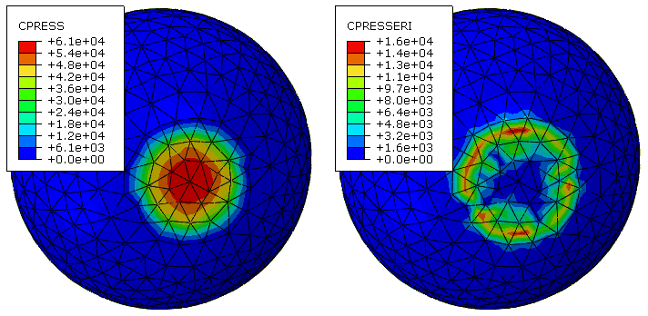
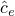
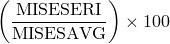

# 4.1.4 误差指示器输出

**产品：** Abaqus/Standard  Abaqus/CAE

**警告：**误差指示器输出变量是近似值，并不代表解决方案误差的准确或保守估计。如果网格粗糙，误差指示器的质量可能特别差。误差指示器质量随着网格细化而提高；但是，您不应将这些变量解释为表示在进一步细化网格时解决方案变量的值。

##### **参考文献**

- ["Abaqus/Standard输出变量标识符，" 第4.2.1节](pt02ch04s02abv01.md)
- ["自适应网格划分：概述，" 第12.3.1节](pt04ch12s03abo15.md)
- ["影响自适应网格划分的误差指示器选择，" 第12.3.2节](pt04ch12s03aus84.md)
- [*CONTACT OUTPUT](../key/key-link.md#usb-kws-hcontactoutput)
- [*ELEMENT OUTPUT](../key/key-link.md#usb-kws-helementoutput)

### 概述

误差指示器输出变量：
- 指示解决方案量（基本解决方案）中的离散误差，具有基本解决方案的单位；
- 可以使用元素输出或接触输出选项请求，或作为自适应网格划分规则的一部分；
- 可以通过基本解决方案的形式进行归一化，以获得无量纲的（如百分比）误差指示器；
- 在某些情况下可能会显著增加分析解决方案时间；和
- 在Abaqus/Standard中可用，但在Abaqus/Explicit中不可用。

### 解决方案准确性

有限元分析对物理行为进行有用预测的能力取决于许多因素，包括：
- 几何、材料行为、载荷历史和各种其他与描述问题相关的建模方面的表示；
- 空间和时间离散化（网格细化和增量）；和
- 收敛容差。

本节的主要重点是空间离散化误差。帮助理解和控制其他潜在误差源的讨论出现在["非线性问题的收敛准则，" 第7.2.3节](pt03ch07s02aus51.md)、["瞬态问题中的时间积分准确性，" 第7.2.4节](pt03ch07s02aus52.md)、["评估超弹性和粘弹性材料行为，" Abaqus/CAE User's Guide第12.4.7节](../usi/usi-link.md#usi-prp-editor-evaluate)，以及Abaqus文档的其他部分。作为任何误差评估的一部分，您应该对分析方法和建议进行详细研究。

#### 空间离散化误差

模型域的有限元离散化产生了一个近似解，适用于除 trivial 分析之外的所有分析。为了帮助您理解有限元解决方案中离散化误差的范围和空间分布，Abaqus/Standard提供了一组误差指示器输出变量。理想情况下，误差指示器输出变量应该通过其他技术（如网格细化研究）进行补充，以增强信心：离散化误差不会显著降低有限元分析进行有用预测的能力。事实上，误差指示器可以通过Abaqus/CAE的自适应网格划分功能帮助自动化网格细化研究；误差指示器变量被此功能用于确定在哪里细化或粗化网格（参见["自适应网格划分：概述，" 第12.3.1节](pt04ch12s03abo15.md)）。

### Abaqus/Standard中可用的误差指示器和基本解决方案变量

Abaqus误差指示器变量提供了由网格离散化引起的局部误差的度量。每个误差指示器提供对特定基本解决方案变量的误差指示。例如，Mises应力误差指示器MISESERI提供对Mises应力变量MISESAVG的误差指示。[表4.1.4-1](pt02ch04s01aus41.md#usb-anl-aadperrorindicators-table)显示了可用的误差指示器变量和相应的基本解决方案变量。

**表4.1.4-1** 误差指示器变量及其相应的基本解决方案变量。
| 解决方案量 | 误差指示器变量 () | 基本解决方案变量 () |
| --- | --- | --- |
| 元素能量密度 | ENDENERI | ENDEN |
| Mises应力 | MISESERI | MISESAVG |
| 接触压力 | CPRESSERI | CPRESS |
| 接触剪切应力 | CSHEARERI | CSHEAR |
| 等效塑性应变 | PEEQERI | PEEQAVG |
| 塑性应变 | PEERI | PEAVG |
| 蠕变应变 | CEERI | CEAVG |
| 热通量 | HFLERI | HFLAVG |
| 电通量 | EFLERI | EFLAVG |
| 电势梯度 | EPGERI | EPGAVG |

Abaqus/CAE用于修改自适应网格划分功能的网格种子大小的算法同时考虑误差指示器值和相应的基本解决方案值。当您创建网格划分规则并请求特定误差指示器时，Abaqus自动将误差指示器和相应的基本解决方案变量写入输出数据库。

| **输入文件用法：** | ``` [*OUTPUT](../key/key-link.md#usb-kws-houtput), FIELD, ELSET=*ElsetName* [*ELEMENT OUTPUT](../key/key-link.md#usb-kws-helementoutput) [*CONTACT OUTPUT](../key/key-link.md#usb-kws-hcontactoutput) ``` |
| --- | --- |

| **Abaqus/CAE用法：** | Step模块：****Output****Field Output Request**** |
| --- | --- |
|  | 或者，如果您使用以下选项指定自适应网格划分规则，则默认会发生关联的误差指示器和基本解决方案输出：Mesh模块：**Create Remeshing Rule**：**Step and Indicator** |

#### 误差指示器输出请求对解决方案时间的影响

Abaqus/Standard基于基本解决方案的平滑和非平滑分布之间的差异确定误差指示器变量，使用诸如Zienkiewicz和Zhu（1987）的补丁恢复技术的平滑技术。平滑计算偶尔会明显增加分析时间。如果您发现添加误差指示器输出请求显著增加了分析时间，减少此影响的策略包括减少输出频率并将输出请求限制到特定感兴趣区域。大多数误差指示器变量的计算仅在将误差指示器变量写入输出数据库之前进行，因此减少输出频率将倾向于减少计算时间；但是对于元素能量密度误差指示器情况并非如此，因为无论是否在给定增量输出此误差指示器，其贡献都在每个增量中累积。

#### 元素误差指示器变量输出请求范围的附加考虑

当您请求元素误差指示器输出时，请求仅应适用于支持误差指示器输出的元素。

用于计算元素误差指示器变量的补丁恢复技术假设解决方案应该在指定的元素集上是连续的。Abaqus/Standard通过检查误差指示器域内的截面属性引用来确认您的误差指示器输出规范与此假设一致，如果提供元素集中的元素引用了不同的截面定义，则发出警告消息。如果截面属性相同，您可以安全地忽略此警告。

### 解释误差指示器输出

在解释误差指示器输出时，您应该记住误差指示器是基本解决方案中局部误差的近似度量，其本身也受离散化误差的影响。误差估计的准确性往往随着网格细化而提高。每个误差指示器变量具有与相应基本解决方案变量相同的单位，这有利于将误差幅值的局部估计与基本解决方案的局部估计进行比较。

#### 基本解决方案及其相应误差指示器的感兴趣区域

并排查看基本解决方案变量和相应误差指示器变量的等值线图可以提供对解决方案准确性的有用视角。例如，如果基本解决方案以应力单位表示，则相应的误差指示器也以应力单位表示。[图4.1.4-1](pt02ch04s01aus41.md#aerror-hertz-cpress)显示了一个球压入刚性板的分析的CPRESS和CPRESSERI等值线图。这些图可以解释如下：
- 接触压力解决方案在活跃接触区域的中心附近相当准确，那里接触压力最大，因为该区域的误差指示器是基本解决方案的一小部分。
- 接触压力解决方案在活跃接触区域周边不太准确，那里接触压力解决方案的局部变化最大（但接触压力显著小于最大值），因为与该区域的基本解决方案相比，误差指示器相当大。

在这种情形下，如果主要感兴趣的是最大接触压力，则分析师可以判断网格细化水平是足够的。如果活跃接触区域显著小于[图4.1.4-1](pt02ch04s01aus41.md#aerror-hertz-cpress)所示，则需要局部网格细化来准确预测最大接触压力。

**图4.1.4-1** 可变形球与刚性板之间接触的CPRESS和CPRESSERI等值线图。



如果网格相对于局部解决方案变化粗糙，或者所提问题的精确解涉及应力奇点，则误差指示器往往会对精确解的偏差给出粗略的、非保守的近似。以下对误差指示器结果超过基本解决方案结果约10%的定性解释通常是适当的：
- "该区域存在解决方案不准确的重要可能性。"
- "网格可能太粗糙，无法对该区域的解决方案误差给出良好估计。"
- "也许这个角落存在应力奇点。"

#### 计算解决方案误差的归一化度量

您可以使用相应的误差指示器和基本解决方案变量（即分别为和）来计算局部归一化误差指示器场：


其中是归一化误差度量。例如，



提供了基于Mises应力的误差指示器的百分比形式；但是，此归一化误差度量可能不是特别有用，因为它：
-往往会吸引人们关注基本解决方案值较小的区域，这些区域通常不是设计的关键区域；和
- 在基本解决方案值为零的地方会有除以零的问题。

其他归一化方法（如基于基本解决方案变量的全局范数或您选择的常量值（如设计中允许的基本解决方案的最大值）进行归一化）可能更有效。

误差指示器的归一化形式不能直接通过误差指示器输出变量获得；但是，您可以使用Abaqus/CAE的Visualization模块（Abaqus/Viewer）对场输出数据进行操作来计算归一化度量。有关更多信息，请参见["构建有效的场输出表达式，" Abaqus/CAE User's Guide第42.7.1节](../usi/usi-link.md#usv-res-validexpression)。或者，您可以使用Abaqus脚本接口从输出数据库读取误差指示器和基本解决方案，并计算归一化形式。有关更多信息，请参见[Abaqus Scripting User's Guide第9章，"使用Abaqus脚本接口访问输出数据库"](../cmd/cmd-link.md#cmd-odb-api-pyc)。

### 限制

仅以下元素类型支持误差指示器计算：
- 平面连续体三角形和四边形
- 壳三角形和四边形
- 四面体
- 六面体

不支持具有变量节点的元素。

在以下情况下不支持误差指示器输出：
- 导入分析
- 重启分析
- 后输出分析
- 映射解决方案分析
- 对称模型生成分析

#### 附加参考

- Zienkiewicz, O. C., and J. Z. Zhu, "A Simple Error Estimator and Adaptive Procedure for Practical Engineering Analysis," International Journal for Numerical Methods in Engineering, vol. 24, pp. 337--357, 1987.
