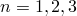
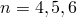

#### 稳态动力学分析

以下变量（以P开头）仅适用于稳态（频域）动力学分析。这些变量包括所有分量的幅值和相位角。相位角以度为单位。在数据文件中，每个请求有两行输出。第一行包含幅值，第二行（由SSD脚注指示）包含相位角。在结果文件中，所有分量的幅值在前，所有分量的相位角在后。
**PHS**

所有应力分量的幅值和相位角。
.dat: 是    .fil: 是    .odb Field: 否    .odb History: 否
**PHS*ij***

应力的分量的幅值和相位角（）。
.dat: 是    .fil: 否    .odb Field: 否    .odb History: 否
**PHE**

所有应变分量的幅值和相位角。
.dat: 是    .fil: 是    .odb Field: 否    .odb History: 否
**PHE*ij***

应变的分量的幅值和相位角（）。
.dat: 是    .fil: 否    .odb Field: 否    .odb History: 否
**PHEPG**

电势梯度向量的幅值和相位角。
.dat: 是    .fil: 是    .odb Field: 否    .odb History: 否
**PHEPG*n***

电势梯度第*n*分量的幅值和相位角（）。
.dat: 是    .fil: 否    .odb Field: 否    .odb History: 否
**PHEFL**

电通量向量的幅值和相位角。
.dat: 是    .fil: 是    .odb Field: 否    .odb History: 否
**PHEFL*n***

电通量向量第*n*分量的幅值和相位角（）。
.dat: 是    .fil: 否    .odb Field: 否    .odb History: 否
**PHMFL**

质量流率的幅值和相位角。仅适用于流体链接单元。
.dat: 是    .fil: 是    .odb Field: 否    .odb History: 否
**PHMFT**

总质量流的幅值和相位角。仅适用于流体链接单元。
.dat: 是    .fil: 是    .odb Field: 否    .odb History: 否
**PHCTF**

连接器总力和弯矩所有分量的幅值和相位。
.dat: 是    .fil: 是    .odb Field: 否    .odb History: 否
**PHCTF*n***

连接器总力第*n*分量的幅值和相位（）。
.dat: 是    .fil: 否    .odb Field: 否    .odb History: 否
**PHCTM*n***

连接器总弯矩第*n*分量的幅值和相位（）。
.dat: 是    .fil: 否    .odb Field: 否    .odb History: 否
**PHCEF**

连接器弹性力和弯矩所有分量的幅值和相位。
.dat: 是    .fil: 是    .odb Field: 否    .odb History: 否
**PHCEF*n***

连接器弹性力第*n*分量的幅值和相位（）。
.dat: 是    .fil: 否    .odb Field: 否    .odb History: 否
**PHCEM*n***

连接器弹性弯矩第*n*分量的幅值和相位（）。
.dat: 是    .fil: 否    .odb Field: 否    .odb History: 否
**PHCVF**

连接器粘性力和弯矩所有分量的幅值和相位。
.dat: 是    .fil: 是    .odb Field: 否    .odb History: 否
**PHCVF*n***

连接器粘性力第*n*分量的幅值和相位（）。
.dat: 是    .fil: 否    .odb Field: 否    .odb History: 否
**PHCVM*n***

连接器粘性弯矩第*n*分量的幅值和相位（）。
.dat: 是    .fil: 否    .odb Field: 否    .odb History: 否
**PHCRF**

连接器反作用力和弯矩所有分量的幅值和相位。
.dat: 是    .fil: 是    .odb Field: 否    .odb History: 否
**PHCRF*n***

连接器反作用力第*n*分量的幅值和相位（）。
.dat: 是    .fil: 否    .odb Field: 否    .odb History: 否
**PHCRM*n***

连接器反作用弯矩第*n*分量的幅值和相位（）。
.dat: 是    .fil: 否    .odb Field: 否    .odb History: 否
**PHCSF**

连接器摩擦力和弯矩所有分量的幅值和相位。
.dat: 是    .fil: 是    .odb Field: 否    .odb History: 否
**PHCSF*n***

连接器摩擦力第*n*分量的幅值和相位（）。
.dat: 是    .fil: 否    .odb Field: 否    .odb History: 否
**PHCSM*n***

连接器摩擦弯矩第*n*分量的幅值和相位（）。
.dat: 是    .fil: 否    .odb Field: 否    .odb History: 否
**PHCSFC**

瞬时滑移方向上连接器摩擦力的幅值和相位。仅在滑移方向定义了摩擦时可用。
.dat: 是    .fil: 否    .odb Field: 否    .odb History: 否
**PHCU**

连接器相对位移和转角所有分量的幅值和相位。
.dat: 是    .fil: 是    .odb Field: 否    .odb History: 否
**PHCU*n***

*n*方向上连接器相对位移的幅值和相位（）。
.dat: 是    .fil: 否    .odb Field: 否    .odb History: 否
**PHCUR*n***

*n*方向上连接器相对转角的幅值和相位（）。
.dat: 是    .fil: 否    .odb Field: 否    .odb History: 否
**PHCCU**

连接器构成位移和转角所有分量的幅值和相位。
.dat: 是    .fil: 是    .odb Field: 否    .odb History: 否
**PHCCU*n***

*n*方向上连接器构成位移的幅值和相位（）。
.dat: 是    .fil: 否    .odb Field: 否    .odb History: 否
**PHCCUR*n***

*n*方向上连接器构成转角的幅值和相位（）。
.dat: 是    .fil: 否    .odb Field: 否    .odb History: 否
**PHCV**

连接器相对速度所有分量的幅值和相位。
.dat: 是    .fil: 是    .odb Field: 否    .odb History: 否
**PHCV*n***

*n*方向上连接器相对速度的幅值和相位（）。
.dat: 是    .fil: 否    .odb Field: 否    .odb History: 否
**PHCVR*n***

*n*方向上连接器相对角速度的幅值和相位（）。
.dat: 是    .fil: 否    .odb Field: 否    .odb History: 否
**PHCA**

连接器相对加速度所有分量的幅值和相位。
.dat: 是    .fil: 是    .odb Field: 否    .odb History: 否
**PHCA*n***

*n*方向上连接器相对加速度的幅值和相位（）。
.dat: 是    .fil: 否    .odb Field: 否    .odb History: 否
**PHCAR*n***

*n*方向上连接器相对角加速度的幅值和相位（）。
.dat: 是    .fil: 否    .odb Field: 否    .odb History: 否
**PHCNF**

连接器摩擦产生接触力和弯矩所有分量的幅值和相位。
.dat: 是    .fil: 是    .odb Field: 否    .odb History: 否
**PHCNF*n***

连接器摩擦产生接触力第*n*分量的幅值和相位（）。
.dat: 是    .fil: 否    .odb Field: 否    .odb History: 否
**PHCNM*n***

连接器摩擦产生接触弯矩第*n*分量的幅值和相位（）。
.dat: 是    .fil: 否    .odb Field: 否    .odb History: 否
**PHCNFC**

瞬时滑移方向上连接器摩擦产生接触力的幅值和相位。仅在滑移方向定义了摩擦时可用。
.dat: 是    .fil: 否    .odb Field: 否    .odb History: 否
**PHCIVC**

瞬时滑移方向上连接器瞬时速度的幅值和相位。仅在滑移方向定义了摩擦时可用。
.dat: 是    .fil: 是    .odb Field: 否    .odb History: 否

#### 渐进损伤失效

**SDEG**

标量刚度退化变量。
.dat: 否    .fil: 否    .odb Field: 是    .odb History: 是
**DMICRT**

损坏起始准则的所有活跃分量。
.dat: 否    .fil: 否    .odb Field: 是    .odb History: 是
**DUCTCRT**

韧性损坏起始准则。
.dat: 否    .fil: 否    .odb Field: 否    .odb History: 是
**SHRCRT**

剪切损坏起始准则。
.dat: 否    .fil: 否    .odb Field: 否    .odb History: 是
**FLDCRT**

成形极限图（FLD）损坏起始准则。
.dat: 否    .fil: 否    .odb Field: 否    .odb History: 是
**FLSDCRT**

成形极限应力图（FLSD）损坏起始准则。
.dat: 否    .fil: 否    .odb Field: 否    .odb History: 是
**MSFLDCRT**

Mschenborn-Sonne成形极限应力图（MSFLD）损坏起始准则。
.dat: 否    .fil: 否    .odb Field: 否    .odb History: 是
**ERPRATIO**

用于MSFLD损坏起始准则的主应变率比，。
.dat: 否    .fil: 否    .odb Field: 是    .odb History: 是
**SHRRATIO**

用于剪切损坏起始准则的剪切应力比，。
.dat: 否    .fil: 否    .odb Field: 是    .odb History: 是

#### 纤维增强材料损坏

**HSNFTCRT**

Hashin纤维拉伸损坏起始准则。
.dat: 是    .fil: 否    .odb Field: 是    .odb History: 是
**HSNFCCRT**

Hashin纤维压缩损坏起始准则。
.dat: 是    .fil: 否    .odb Field: 是    .odb History: 是
**HSNMTCRT**

Hashin基体拉伸损坏起始准则。
.dat: 是    .fil: 否    .odb Field: 是    .odb History: 是
**HSNMCCRT**

Hashin基体压缩损坏起始准则。
.dat: 是    .fil: 否    .odb Field: 是    .odb History: 是
**DMICRT**

损坏起始准则的所有活跃分量。
.dat: 是    .fil: 是    .odb Field: 是    .odb History: 是
**DAMAGEFT**

纤维拉伸损坏变量。
.dat: 是    .fil: 是    .odb Field: 是    .odb History: 是
**DAMAGEFC**

纤维压缩损坏变量。
.dat: 是    .fil: 是    .odb Field: 是    .odb History: 是
**DAMAGEMT**

基体拉伸损坏变量。
.dat: 是    .fil: 是    .odb Field: 是    .odb History: 是
**DAMAGEMC**

基体压缩损坏变量。
.dat: 是    .fil: 是    .odb Field: 是    .odb History: 是
**DAMAGESHR**

剪切损坏变量。
.dat: 是    .fil: 是    .odb Field: 是    .odb History: 是
**STATUS**

单元的状态（如果单元是活跃的，则状态为1.0；如果单元不活跃，则为0.0）。
.dat: 是    .fil: 是    .odb Field: 是    .odb History: 是

### 元素形心变量

对于电磁单元，元素输出在单元的形心处，而不是在积分点处。这些变量在[第六部分，"单元"](pt06.md)的单元描述中以及["涡流分析，" 第6.7.5节](pt03ch06s07at24.md)和["静磁分析，" 第6.7.6节](pt03ch06s07at25.md)中定义。

**EMB**

磁通密度向量的所有分量。
.dat: 否    .fil: 否    .odb Field: 是    .odb History: 是
**EMH**

磁场向量的所有分量。
.dat: 否    .fil: 否    .odb Field: 是    .odb History: 是
**EME**

电场向量的所有分量。
.dat: 否    .fil: 否    .odb Field: 是    .odb History: 是
**EMCD**

导电区域中涡流密度向量的所有分量。
.dat: 否    .fil: 否    .odb Field: 是    .odb History: 是
**EMCDA**

施加体积电流密度向量的幅值和分量。
.dat: 否    .fil: 否    .odb Field: 是    .odb History: 是
**EMJH**

导体区域中Joule热耗散速率（每单位体积每单位时间消耗的热量）。
.dat: 否    .fil: 否    .odb Field: 是    .odb History: 是
**EMBF**

导体区域中磁体力的强度（每单位体积的力）向量。
.dat: 否    .fil: 否    .odb Field: 是    .odb History: 是
**EMBFC**

时间谐波涡流分析中导体区域复磁体力强度（每单位体积的力）向量。
.dat: 否    .fil: 否    .odb Field: 是    .odb History: 是

### 元素截面变量

您可以请求元素截面变量输出到数据、结果或输出数据库文件（参见["元素输出" in "输出到数据和结果文件，" 第4.1.2节](pt02ch04s01aus39.md#usb-out-oprintfile-elementoutput)，和["元素输出" in "输出到输出数据库，" 第4.1.3节](pt02ch04s01aus40.md#usb-out-odboutput-elementoutput)）。这些变量仅适用于梁和壳单元，但STH也可用于膜单元。它们在[第六部分，"单元"](pt06.md)的特定单元描述中定义。

**SF**

所有截面力和弯矩分量。
.dat: 是    .fil: 是    .odb Field: 是    .odb History: 是
**SF*n***

第*n*分量每单位宽度的截面力（对于常规壳：；对于连续壳：；对于梁：）。
.dat: 是    .fil: 否    .odb Field: 否    .odb History: 是
**SM*n***

第*n*分量每单位宽度的截面弯矩（）。
.dat: 是    .fil: 否    .odb Field: 否    .odb History: 是
**SORIENT**

复合壳截面方向。
.dat: 否    .fil: 否    .odb Field: 是    .odb History: 否
**BIMOM**

梁横截面的双力矩。仅适用于开口截面梁单元。
.dat: 是    .fil: 否    .odb Field: 否    .odb History: 是
**ESF1**

承受压力载荷的梁和管的的有效轴向力。除响应谱和随机响应外，适用于所有应力/位移过程类型。
.dat: 是    .fil: 是    .odb Field: 是    .odb History: 是
**SSAVG**

所有平均壳截面应力分量。
.dat: 是    .fil: 是    .odb Field: 是    .odb History: 否
**SSAVG*n***

平均壳截面应力分量*n*（）。
.dat: 是    .fil: 否    .odb Field: 否    .odb History: 是
**SE**

所有截面应变、曲率变化和扭曲分量。
.dat: 是    .fil: 是    .odb Field: 是    .odb History: 是
**SE*n***

截面应变分量*n*（对于壳：；对于梁：）。
.dat: 是    .fil: 否    .odb Field: 否    .odb History: 是
**SK*n***

截面曲率变化或扭曲*n*（）。
.dat: 是    .fil: 否    .odb Field: 否    .odb History: 是
**BICURV**

梁横截面的双曲率。仅适用于开口截面梁单元。
.dat: 是    .fil: 否    .odb Field: 否    .odb History: 是
**MAXSS**

截面上的最大轴向应力。（此变量可与以下通用梁截面定义类型一起使用：标准库截面、线性广义截面或具有指定输出截面点的网格化截面。如果指定了输出截面点，MAXSS输出将是用户指定点处应力的最大值。）
.dat: 是    .fil: 是    .odb Field: 否    .odb History: 否
**COORD**

截面点的坐标。如果使用大位移公式，则是当前坐标。
.dat: 是    .fil: 是    .odb Field: 是    .odb History: 是
**STH**

截面厚度（对于SAX1、SAX2、SAX2T、S3/S3R、S4、S4R、SAXA1*N*、SAXA2*N*和所有膜单元，如果使用大位移公式，则为当前厚度；对于所有其他情况，为初始厚度）。
.dat: 是    .fil: 是    .odb Field: 是    .odb History: 是
**SVOL**

积分截面体积。（不适用于特征值提取、特征值屈曲预测、复特征值提取或线性动力学过程。仅适用于不使用通用梁或壳截面定义的连续和结构单元。）
.dat: 是    .fil: 是    .odb Field: 是    .odb History: 是
**SPE**

所有广义塑性应变分量。仅适用于通用梁截面中的非弹性非线性响应。
.dat: 是    .fil: 是    .odb Field: 是    .odb History: 是
**SPE*n***

广义塑性应变分量*n*（）。表示轴向塑性应变、关于局部1轴的曲率变化、关于局部2轴的曲率变化和梁的扭曲。仅适用于通用梁截面中的非弹性非线性响应。
.dat: 是    .fil: 否    .odb Field: 否    .odb History: 是
**SEPE**

所有等效塑性应变。仅适用于通用梁截面中的非弹性非线性响应。
.dat: 是    .fil: 是    .odb Field: 是    .odb History: 是
**SEPE*n***

等效塑性应变分量*n*（）。表示轴向塑性应变、关于局部1轴的曲率变化、关于局部2轴的曲率变化和梁的扭曲。仅适用于通用梁截面中的非弹性非线性响应。
.dat: 是    .fil: 否    .odb Field: 否    .odb History: 是

#### 框架单元

**SEE**

所有弹性截面轴向、曲率和扭曲应变分量。
.dat: 是    .fil: 是    .odb Field: 是    .odb History: 是
**SEE1**

弹性轴向应变分量。
.dat: 是    .fil: 否    .odb Field: 否    .odb History: 是
**SKE*n***

弹性截面曲率或扭曲应变分量（）。
.dat: 是    .fil: 否    .odb Field: 否    .odb History: 是
**SEP**

单元端部的所有塑性轴向位移和转角。此标识符还提供一个是/否标志，指示框架单元端部截面当前是否屈服（AC YIELD："主动屈服"；即塑性应变在增量期间发生变化），以及一个是/否/否适用标志，指示压杆响应中是否发生了屈曲（AC BUCKL）或不适用。AC YIELD和AC BUCKL在输出数据库中不可用。
.dat: 是    .fil: 是    .odb Field: 是    .odb History: 是
**SEP1**

单元端部的塑性轴向位移。
.dat: 是    .fil: 否    .odb Field: 否    .odb History: 是
**SKP*n***

单元端部的塑性转角，弯曲或扭转（）。
.dat: 是    .fil: 否    .odb Field: 否    .odb History: 是
**SALPHA**

单元端部的所有广义背应力分量。
.dat: 是    .fil: 是    .odb Field: 是    .odb History: 是
**SALPHA*n***

单元端部的广义背应力（）。第一个分量是轴向截面背应力，其次是两个弯曲背应力分量和扭曲背应力分量。
.dat: 是    .fil: 否    .odb Field: 否    .odb History: 是

### 整体元素变量

您可以请求整体元素变量输出到数据、结果或输出数据库文件（参见["元素输出" in "输出到数据和结果文件，" 第4.1.2节](pt02ch04s01aus39.md#usb-out-oprintfile-elementoutput)，和["元素输出" in "输出到输出数据库，" 第4.1.3节](pt02ch04s01aus40.md#usb-out-odboutput-elementoutput)）。

**LOADS**

分布载荷的当前值（不适用于非均匀载荷）。
.dat: 是    .fil: 是    .odb Field: 否    .odb History: 否
**FOUND**

基础压力的当前值。
.dat: 是    .fil: 是    .odb Field: 否    .odb History: 否
**FLUXS**

分布（热或浓度）通量的当前值（不适用于非均匀通量），包括使用HFL协同仿真场ID导入的通量。
.dat: 是    .fil: 是    .odb Field: 是    .odb History: 否
**CHRGS**

分布电荷的当前值。
.dat: 是    .fil: 是    .odb Field: 否    .odb History: 否
**ECURS**

分布电流的当前值。
.dat: 是    .fil: 是    .odb Field: 否    .odb History: 否
**ELEN**

单元中所有能量大小。在基于模态的过程中没有能量可用；对于直接解稳态动力学和基于子空间的稳态动力学分析，它们中的有限数量可用。在稳态动力学中，所有能量量是净每周期值，除非另有说明。
.dat: 是    .fil: 是    .odb Field: 是    .odb History: 是
**ELKE**

单元中的总动能。在稳态动力学分析中，这是循环平均值。
.dat: 是    .fil: 否    .odb Field: 是    .odb History: 是
**ELSE**

单元中的总弹性应变能。当使用超弹性材料对Mullins效应进行建模时，此量表示单元中能量的可恢复部分。这是特征值提取过程中数据文件中唯一可用的能量请求；要获取结果文件或输出数据库中场输出的此量，请请求ELEN。在稳态动力学分析中，这是循环平均值。
.dat: 是    .fil: 否    .odb Field: 是    .odb History: 是
**ELPD**

单元中由于与速率无关和与速率相关的塑性变形而消耗的总能量。不适用于稳态动力学分析。
.dat: 是    .fil: 否    .odb Field: 是    .odb History: 是
**ELCD**

单元中由于蠕变、肿胀和粘弹性而消耗的总能量。不适用于稳态动力学分析。
.dat: 是    .fil: 否    .odb Field: 是    .odb History: 是
**ELVD**

单元中由于粘性效应而消耗的总能量，不包括静态稳定或粘弹性消耗的能量。
.dat: 是    .fil: 否    .odb Field: 是    .odb History: 是
**ELSD**

单元中由于自动静态稳定而消耗的总能量。不适用于稳态动力学分析。
.dat: 是    .fil: 否    .odb Field: 是    .odb History: 是
**ELCTE**

单元中的总静电能量。不适用于稳态动力学分析。
.dat: 是    .fil: 否    .odb Field: 是    .odb History: 是
**ELJD**

由于电流流动而消耗的总电能。不适用于稳态动力学分析。
.dat: 是    .fil: 否    .odb Field: 是    .odb History: 是
**ELASE**

单元中的总"人工"应变能（与用于消除奇异模式的约束相关的能量，如小时glass控制，以及用于使钻孔旋转跟随壳单元面内旋转的约束相关的能量）。不适用于稳态动力学分析。
.dat: 是    .fil: 否    .odb Field: 是    .odb History: 是
**ELDMD**

单元中由于损坏而消耗的总能量。不适用于稳态动力学分析。
.dat: 是    .fil: 否    .odb Field: 是    .odb History: 是
**NFORC**

单元节点上的力，来自该单元的小小时glass模式和常规变形模式（全局坐标系中内力的负值）。数据文件和结果文件请求中指定的位置被忽略。
.dat: 是    .fil: 是    .odb Field: 是    .odb History: 是
**NFORCSO**

由梁单元中应力结果引起的节点上的力（梁截面方向坐标系中的内力）。
.dat: 否    .fil: 否    .odb Field: 是    .odb History: 是
**GRAV**

均匀分布的重力载荷。
.dat: 否    .fil: 否    .odb Field: 是    .odb History: 否
**BF**

均匀分布的体力。
.dat: 否    .fil: 否    .odb Field: 是    .odb History: 否
**CORIOMAG**

Coriolis载荷的大小。
.dat: 否    .fil: 否    .odb Field: 是    .odb History: 否
**ROTAMAG**

旋转加速度载荷的大小。
.dat: 否    .fil: 否    .odb Field: 是    .odb History: 否
**CENTMAG**

离心载荷的大小（测量为，其中是每单位体积的质量密度，是角速度）。
.dat: 否    .fil: 否    .odb Field: 是    .odb History: 否
**CENTRIFMAG**

离心载荷的大小（测量为，其中是角速度）。
.dat: 否    .fil: 否    .odb Field: 是    .odb History: 否
**HBF**

热体通量。
.dat: 否    .fil: 否    .odb Field: 是    .odb History: 否
**NFLUX**

由单元中的热传导或质量扩散引起的节点上的通量（内部通量）。（数据文件和输出数据库文件请求的指定位置被忽略。）
.dat: 是    .fil: 是    .odb Field: 是    .odb History: 是
**NFL*n***

由单元中的热传导或质量扩散引起的节点上的通量*n*（）。（数据文件和输出数据库文件请求的指定位置被忽略。）
.dat: 是    .fil: 否    .odb Field: 否    .odb History: 是
**NCURS**

由单元中的电传导引起的节点的电流。
.dat: 是    .fil: 是    .odb Field: 是    .odb History: 是
**FILM**

膜条件的当前值（不适用于非均匀膜）。
.dat: 是    .fil: 是    .odb Field: 否    .odb History: 否
**RAD**

辐射条件的当前值。
.dat: 是    .fil: 是    .odb Field: 否    .odb History: 否
**EVOL**

当前单元体积。（不适用于特征值提取、特征值屈曲预测、复特征值提取或线性动力学过程。仅适用于不使用通用梁或壳截面定义的连续和结构单元。）
.dat: 是    .fil: 是    .odb Field: 是    .odb History: 是
**ESOL**

单元中的溶质量，计算为单元中所有积分点上ISOL（积分点处的溶质量）的总和。
.dat: 是    .fil: 是    .odb Field: 是    .odb History: 是

#### 增强单元

**STATUSXFEM**

增强单元的状态。（如果单元完全开裂，则增强单元的状态为1.0；如果单元未开裂，则为0.0。如果单元部分开裂，则值介于1.0和0.0之间。）
.dat: 否    .fil: 否    .odb Field: 是    .odb History: 是

**LOADSXFEM**

施加到XFEA基裂纹表面的分布压力载荷。
.dat: 否    .fil: 否    .odb Field: 是    .odb History: 是

#### 使用XFEA基LEFM方法的增强单元

**ENRRTXFEM**

应变能释放率的所有分量。
.dat: 否    .fil: 否    .odb Field: 是    .odb History: 是

#### 低循环疲劳分析中的增强单元

**CYCLEINIXFEM**

在增强单元处初始化裂纹的循环次数。
.dat: 否    .fil: 否    .odb Field: 是    .odb History: 是

#### 具有孔隙压力自由度的增强单元

**GFVRXFEM**

增强单元的间隙流体体积率。
.dat: 否    .fil: 否    .odb Field: 是    .odb History: 是
**PFOPENXFEM**

增强单元的裂缝开口。
.dat: 否    .fil: 否    .odb Field: 是    .odb History: 是
**PORPRES**

增强单元的流体压力。
.dat: 否    .fil: 否    .odb Field: 是    .odb History: 是
**LEAKVRTXFEM**

增强单元顶部裂纹表面的泄漏流率。
.dat: 否    .fil: 否    .odb Field: 是    .odb History: 是
**LEAKVRBXFEM**

增强单元底部裂纹表面的泄漏流率。
.dat: 否    .fil: 否    .odb Field: 是    .odb History: 是
**ALEAKVRTXFEM**

增强单元顶部裂纹表面的累积泄漏流率体积。
.dat: 否    .fil: 否    .odb Field: 是    .odb History: 是
**ALEAKVRBXFEM**

增强单元底部裂纹表面的累积泄漏流率体积。
.dat: 否    .fil: 否    .odb Field: 是    .odb History: 是

#### 连接器单元

**CTF**

连接器总力和弯矩的所有分量。
.dat: 是    .fil: 是    .odb Field: 是    .odb History: 是
**CTF*n***

连接器总力第*n*分量（）。
.dat: 是    .fil: 否    .odb Field: 否    .odb History: 是
**CTM*n***

连接器总弯矩第*n*分量（）。
.dat: 是    .fil: 否    .odb Field: 否    .odb History: 是
**CEF**

连接器弹性力和弯矩的所有分量。
.dat: 是    .fil: 是    .odb Field: 是    .odb History: 是
**CEF*n***

连接器弹性力第*n*分量（）。
.dat: 是    .fil: 否    .odb Field: 否    .odb History: 是
**CEM*n***

连接器弹性弯矩第*n*分量（）。
.dat: 是    .fil: 否    .odb Field: 否    .odb History: 是
**CUE**

所有方向上的弹性位移和转角。
.dat: 是    .fil: 是    .odb Field: 是    .odb History: 是
**CUE*n***

*n*方向上的弹性位移（）。
.dat: 是    .fil: 否    .odb Field: 否    .odb History: 是
**CURE*n***

*n*方向上的弹性转角（）。
.dat: 是    .fil: 否    .odb Field: 否    .odb History: 是
**CUP**

所有方向上的塑性相对位移和转角。
.dat: 是    .fil: 是    .odb Field: 是    .odb History: 是
**CUP*n***

*n*方向上的塑性相对位移（）。
.dat: 是    .fil: 否    .odb Field: 否    .odb History: 是
**CURP*n***

*n*方向上的塑性相对转角（）。
.dat: 是    .fil: 否    .odb Field: 否    .odb History: 是
**CUPEQ**

所有方向上的等效塑性相对位移和转角。
.dat: 是    .fil: 是    .odb Field: 否    .odb History: 是
**CUPEQ*n***

*n*方向上的等效塑性相对位移（）。
.dat: 是    .fil: 否    .odb Field: 否    .odb History: 是
**CURPEQ*n***

*n*方向上的等效塑性相对转角（）。
.dat: 是    .fil: 否    .odb Field: 否    .odb History: 是
**CUPEQC**

耦合塑性定义的等效塑性相对运动。
.dat: 是    .fil: 否    .odb Field: 否    .odb History: 是
**CALPHAF**

连接器运动硬化偏移力和弯矩的所有分量。
.dat: 是    .fil: 是    .odb Field: 否    .odb History: 是
**CALPHAF*n***

连接器运动硬化偏移力第*n*分量（）。
.dat: 是    .fil: 否    .odb Field: 否    .odb History: 是
**CALPHAM*n***

连接器运动硬化偏移弯矩第*n*分量（）。
.dat: 是    .fil: 否    .odb Field: 否    .odb History: 是
**CVF**

连接器粘性力和弯矩的所有分量。
.dat: 是    .fil: 是    .odb Field: 否    .odb History: 是
**CVF*n***

连接器粘性力第*n*分量（）。
.dat: 是    .fil: 否    .odb Field: 否    .odb History: 是
**CVM*n***

连接器粘性弯矩第*n*分量（）。
.dat: 是    .fil: 否    .odb Field: 否    .odb History: 是
**CSF**

连接器摩擦力和弯矩的所有分量。
.dat: 是    .fil: 是    .odb Field: 否    .odb History: 是
**CSF*n***

连接器摩擦力第*n*分量（）。
.dat: 是    .fil: 否    .odb Field: 否    .odb History: 是
**CSM*n***

连接器摩擦弯矩第*n*分量（）。
.dat: 是    .fil: 否    .odb Field: 否    .odb History: 是
**CSFC**

瞬时滑移方向上的连接器摩擦力。仅在滑移方向定义了摩擦时可用。
.dat: 是    .fil: 否    .odb Field: 否    .odb History: 是
**CNF**

连接器摩擦产生接触力和弯矩的所有分量。
.dat: 是    .fil: 是    .odb Field: 否    .odb History: 是
**CNF*n***

连接器摩擦产生接触力第*n*分量（）。
.dat: 是    .fil: 否    .odb Field: 否    .odb History: 是
**CNM*n***

连接器摩擦产生接触弯矩第*n*分量（）。
.dat: 是    .fil: 否    .odb Field: 否    .odb History: 是
**CNFC**

瞬时滑移方向上的连接器摩擦产生接触力。仅在滑移方向定义了摩擦时可用。
.dat: 是    .fil: 否    .odb Field: 否    .odb History: 是
**CDMG**

总体损坏变量的所有分量。
.dat: 是    .fil: 是    .odb Field: 否    .odb History: 是
**CDMG*n***

总体损坏变量第*n*分量（）。
.dat: 是    .fil: 否    .odb Field: 否    .odb History: 是
**CDMGR*n***

总体损坏变量第*n*分量（）。
.dat: 是    .fil: 否    .odb Field: 否    .odb History: 是
**CDIF**

所有方向上基于连接器力的损坏起始准则的分量。
.dat: 是    .fil: 是    .odb Field: 否    .odb History: 是
**CDIF*n***

*n*平移方向上基于连接器力的损坏起始准则（）。
.dat: 是    .fil: 否    .odb Field: 否    .odb History: 是
**CDIFR*n***

*n*旋转方向上基于连接器力的损坏起始准则（）。
.dat: 是    .fil: 否    .odb Field: 否    .odb History: 是
**CDIFC**

瞬时滑移方向上基于连接器力的损坏起始准则。
.dat: 是    .fil: 否    .odb Field: 否    .odb History: 是
**CDIM**

所有方向上基于连接器运动的损坏起始准则的分量。
.dat: 是    .fil: 是    .odb Field: 否    .odb History: 是
**CDIM*n***

*n*平移方向上基于连接器运动的损坏起始准则（）。
.dat: 是    .fil: 否    .odb Field: 否    .odb History: 是
**CDIMR*n***

*n*旋转方向上基于连接器运动的损坏起始准则（）。
.dat: 是    .fil: 否    .odb Field: 否    .odb History: 是
**CDIMC**

瞬时滑移方向上基于连接器运动的损坏起始准则。
.dat: 是    .fil: 否    .odb Field: 否    .odb History: 是
**CDIP**

所有方向上基于连接器塑性运动的损坏起始准则的分量。
.dat: 是    .fil: 是    .odb Field: 否    .odb History: 是
**CDIP*n***

*n*平移方向上基于连接器塑性运动的损坏起始准则（）。
.dat: 是    .fil: 否    .odb Field: 否    .odb History: 是
**CDIPR*n***

*n*旋转方向上基于连接器塑性运动的损坏起始准则（）。
.dat: 是    .fil: 否    .odb Field: 否    .odb History: 是
**CDIPC**

瞬时滑移方向上基于连接器塑性运动的损坏起始准则。
.dat: 是    .fil: 否    .odb Field: 否    .odb History: 是
**CSLST**

连接器停止和连接器锁状态的所有标志。
.dat: 是    .fil: 是    .odb Field: 否    .odb History: 是
**CSLST*i***

*i*方向上连接器停止和连接器锁状态的标志（）。
.dat: 是    .fil: 否    .odb Field: 否    .odb History: 是
**CASU**

所有方向上累积滑移的分量。
.dat: 是    .fil: 是    .odb Field: 否    .odb History: 是
**CASU*n***

*n*方向上连接器累积滑移（）。
.dat: 是    .fil: 否    .odb Field: 否    .odb History: 是
**CASUR*n***

*n*方向上连接器角度累积滑移（）。
.dat: 是    .fil: 否    .odb Field: 否    .odb History: 是
**CASUC**

瞬时滑移方向上的连接器累积滑移。仅在滑移方向定义了摩擦时可用。
.dat: 是    .fil: 否    .odb Field: 否    .odb History: 是
**CIVC**

瞬时滑移方向上的连接器瞬时速度。仅在滑移方向定义了摩擦时可用。
.dat: 是    .fil: 是    .odb Field: 否    .odb History: 是
**CRF**

连接器反作用力和弯矩的所有分量。
.dat: 是    .fil: 是    .odb Field: 否    .odb History: 是
**CRF*n***

连接器反作用力第*n*分量（）。
.dat: 是    .fil: 否    .odb Field: 否    .odb History: 是
**CRM*n***

连接器反作用弯矩第*n*分量（）。
.dat: 是    .fil: 否    .odb Field: 否    .odb History: 是
**CCF**

连接器集中力和弯矩的所有分量。
.dat: 是    .fil: 是    .odb Field: 否    .odb History: 是
**CCF*n***

连接器集中力第*n*分量（）。
.dat: 是    .fil: 否    .odb Field: 否    .odb History: 是
**CCM*n***

连接器集中弯矩第*n*分量（）。
.dat: 是    .fil: 否    .odb Field: 否    .odb History: 是
**CP**

所有方向上的相对位置。
.dat: 是    .fil: 是    .odb Field: 否    .odb History: 是
**CP*n***

*n*方向上的相对位置（）。
.dat: 是    .fil: 否    .odb Field: 否    .odb History: 是
**CPR*n***

*n*方向上的相对角位置（）。
.dat: 是    .fil: 否    .odb Field: 否    .odb History: 是
**CU**

所有方向上的相对位移和转角。
.dat: 是    .fil: 是    .odb Field: 是    .odb History: 是
**CU*n***

*n*方向上的相对位移（）。
.dat: 是    .fil: 否    .odb Field: 否    .odb History: 是
**CUR*n***

*n*方向上的相对转角（）。
.dat: 是    .fil: 否    .odb Field: 否    .odb History: 是
**CCU**

所有方向上的构成位移和转角。
.dat: 是    .fil: 是    .odb Field: 否    .odb History: 是
**CCU*n***

*n*方向上的构成位移（）。
.dat: 是    .fil: 否    .odb Field: 否    .odb History: 是
**CCUR*n***

*n*方向上的构成转角（）。
.dat: 是    .fil: 否    .odb Field: 否    .odb History: 是
**CV**

所有方向上的相对速度。
.dat: 是    .fil: 是    .odb Field: 否    .odb History: 是
**CV*n***

*n*方向上的相对速度（）。
.dat: 是    .fil: 否    .odb Field: 否    .odb History: 是
**CVR*n***

*n*方向上的相对角速度（）。
.dat: 是    .fil: 否    .odb Field: 否    .odb History: 是
**CA**

所有方向上的相对加速度。
.dat: 是    .fil: 是    .odb Field: 否    .odb History: 是
**CA*n***

*n*方向上的相对加速度（）。
.dat: 是    .fil: 否    .odb Field: 否    .odb History: 是
**CAR*n***

*n*方向上的相对角加速度（）。
.dat: 是    .fil: 否    .odb Field: 否    .odb History: 是
**CFAILST**

连接器失效状态的所有标志。
.dat: 是    .fil: 是    .odb Field: 否    .odb History: 是
**CFAILST*i***

*i*方向上连接器失效状态的标志（）。
.dat: 是    .fil: 否    .odb Field: 否    .odb History: 是

### 元素面变量

您可以请求元素面变量输出到输出数据库（参见["元素输出" in "输出到输出数据库，" 第4.1.3节](pt02ch04s01aus40.md#usb-out-odboutput-elementoutput)）。这些变量仅适用于壳、膜和实体单元。

**P**

单元面上的均匀分布压力载荷，包括使用PRESS协同仿真场ID导入的压力。当使用[*DLOAD](../key/key-link.md#usb-kws-hdload)定义压力时，变量名会自动更改为PDLOAD。当在壳或膜单元上使用[*DLOAD](../key/key-link.md#usb-kws-hdload)定义压力时，Abaqus会更改其值的符号，以使其与使用[*DSLOAD](../key/key-link.md#usb-kws-hdsload)定义的压力一致。
.dat: 否    .fil: 否    .odb Field: 是    .odb History: 否
**HP**

单元面上的静水压力载荷。当使用[*DLOAD](../key/key-link.md#usb-kws-hdload)定义压力时，变量名会自动更改为HPDLOAD。当在壳或膜单元上使用[*DLOAD](../key/key-link.md#usb-kws-hdload)定义压力时，Abaqus会更改其值的符号，以使其与使用[*DSLOAD](../key/key-link.md#usb-kws-hdsload)定义的压力一致。
.dat: 否    .fil: 否    .odb Field: 是    .odb History: 否
**TRNOR**

单元面上牵引载荷的法向分量（沿面法向的分量）。
.dat: 否    .fil: 否    .odb Field: 是    .odb History: 否
**TRSHR**

单元面上牵引载荷的剪切分量（沿面切向的分量）。
.dat: 否    .fil: 否    .odb Field: 是    .odb History: 否
**FLUXS**

单元面上的均匀分布热通量。
.dat: 否    .fil: 否    .odb Field: 是    .odb History: 否
**FILMCOEF**

单元面上的参考膜系数值。
.dat: 否    .fil: 否    .odb Field: 是    .odb History: 否
**SINKTEMP**

单元面上的参考汇温度。
.dat: 否    .fil: 否    .odb Field: 是    .odb History: 否

### 整体元素能量密度变量

以下能量密度输出变量写入重启（`.res`）文件和输出数据库（`.odb`）文件（参见["能量平衡，" Abaqus Theory Guide第1.5.5节](../stm/stm-link.md#stm-int-energybalance)）：

**ELEDEN**

所有能量密度分量。在基于模态的过程中没有能量可用；对于直接解稳态动力学和基于子空间的稳态动力学分析，它们中的有限数量可用。在稳态动力学中，所有能量量是净每周期值，除非另有说明。
.dat: 否    .fil: 否    .odb Field: 是    .odb History: 否
**EKEDEN**

单元中的动能密度。在稳态动力学分析中，这是循环平均值。
.dat: 否    .fil: 否    .odb Field: 是    .odb History: 是
**ESEDEN**

单元中的总弹性应变能量密度。当使用超弹性材料对Mullins效应进行建模时，此量表示单元中能量密度的可恢复部分。此变量在特征值提取过程中不可用。在稳态动力学分析中，这是循环平均值。
.dat: 否    .fil: 否    .odb Field: 是    .odb History: 是
**EPDDEN**

单元中由于与速率无关和与速率相关的塑性变形而每单位体积消耗的总能量。不适用于稳态动力学分析。
.dat: 否    .fil: 否    .odb Field: 是    .odb History: 是
**ECDDEN**

单元中由于蠕变、肿胀和粘弹性而每单位体积消耗的总能量。不适用于稳态动力学分析。
.dat: 否    .fil: 否    .odb Field: 是    .odb History: 是
**EVDDEN**

单元中由于粘性效应而每单位体积消耗的总能量，不包括通过静态稳定或粘弹性的能量耗散。
.dat: 否    .fil: 否    .odb Field: 是    .odb History: 是
**ESDDEN**

单元中由于静态稳定而每单位体积消耗的总能量。不适用于稳态动力学分析。
.dat: 否    .fil: 否    .odb Field: 是    .odb History: 是
**ECTEDEN**

单元中的总静电能量密度。不适用于稳态动力学分析。
.dat: 否    .fil: 否    .odb Field: 是    .odb History: 是
**EASEDEN**

单元中的总"人工"应变能量密度（与用于消除奇异模式的约束相关的能量密度，如小时glass控制，以及用于使钻孔旋转跟随壳单元面内旋转的约束相关的能量密度）。不适用于稳态动力学分析。
.dat: 否    .fil: 否    .odb Field: 是    .odb History: 是
**EDMDDEN**

单元中由于损坏而每单位体积消耗的总能量。不适用于稳态动力学分析。
.dat: 否    .fil: 否    .odb Field: 是    .odb History: 是

### 整体元素误差指示器变量

您可以请求以下误差指示器变量和元素平均变量仅输出到输出数据库（`.odb`）文件（参见["影响自适应网格划分的误差指示器选择，" 第12.3.2节](pt04ch12s03aus84.md)）。

**ENDEN**

元素能量密度，包括塑性耗散和蠕变耗散（如果存在）。
.dat: 否    .fil: 否    .odb Field: 是    .odb History: 否
**ENDENERI**

元素能量密度误差指示器，包括塑性耗散误差和蠕变耗散误差（如果存在）。
.dat: 否    .fil: 否    .odb Field: 是    .odb History: 否
**MISESAVG**

元素平均Mises等效应力。
.dat: 否    .fil: 否    .odb Field: 是    .odb History: 否
**MISESERI**

元素Mises等效应力误差指示器。
.dat: 否    .fil: 否    .odb Field: 是    .odb History: 否
**PEEQAVG**

元素平均等效塑性应变。
.dat: 否    .fil: 否    .odb Field: 是    .odb History: 否
**PEEQERI**

元素等效塑性应变误差指示器。
.dat: 否    .fil: 否    .odb Field: 是    .odb History: 否
**PEAVG**

元素平均塑性应变。
.dat: 否    .fil: 否    .odb Field: 是    .odb History: 否
**PEERI**

元素塑性应变误差指示器。
.dat: 否    .fil: 否    .odb Field: 是    .odb History: 否
**CEAVG**

元素平均蠕变应变。
.dat: 否    .fil: 否    .odb Field: 是    .odb History: 否
**CEERI**

元素蠕变应变误差指示器。
.dat: 否    .fil: 否    .odb Field: 是    .odb History: 否
**HFLAVG**

元素平均热通量。
.dat: 否    .fil: 否    .odb Field: 是    .odb History: 否
**HFLERI**

元素热通量误差指示器。
.dat: 否    .fil: 否    .odb Field: 是    .odb History: 否
**EFLAVG**

元素平均电通量。
.dat: 否    .fil: 否    .odb Field: 是    .odb History: 否
**EFLERI**

元素电通量误差指示器。
.dat: 否    .fil: 否    .odb Field: 是    .odb History: 否
**EPGAVG**

元素平均电势梯度。
.dat: 否    .fil: 否    .odb Field: 是    .odb History: 否
**EPGERI**

元素电势梯度误差指示器。
.dat: 否    .fil: 否    .odb Field: 是    .odb History: 否

### 节点变量

您可以请求节点变量输出到数据、结果或输出数据库文件（参见["节点输出" in "输出到数据和结果文件，" 第4.1.2节](pt02ch04s01aus39.md#usb-out-oprintfile-nodaloutput)，和["节点输出" in "输出到输出数据库，" 第4.1.3节](pt02ch04s01aus40.md#usb-out-odboutput-nodaloutput)）。

**U**

所有物理位移分量，包括具有旋转自由度的节点处的旋转（对于输出到输出数据库，只有场型输出包括旋转）。
.dat: 是    .fil: 是    .odb Field: 是    .odb History: 是
**UT**

所有平移位移分量。
.dat: 否    .fil: 否    .odb Field: 是    .odb History: 是
**UR**

所有旋转位移分量。
.dat: 否    .fil: 否    .odb Field: 是    .odb History: 是
**U*n***

位移分量（）。
.dat: 是    .fil: 否    .odb Field: 否    .odb History: 是
**UR*n***

旋转分量（）。
.dat: 是    .fil: 否    .odb Field: 否    .odb History: 是
**WARP**

翘曲量。仅适用于开口截面梁单元。
.dat: 是    .fil: 否    .odb Field: 否    .odb History: 是
**V**

所有速度分量，包括具有旋转自由度的节点处的旋转速度（对于输出到输出数据库，只有场型输出包括旋转速度）。
.dat: 是    .fil: 是    .odb Field: 是    .odb History: 是
**VT**

所有平移速度分量。
.dat: 否    .fil: 否    .odb Field: 是    .odb History: 是
**VR**

所有旋转速度分量。
.dat: 否    .fil: 否    .odb Field: 是    .odb History: 是
**V*n***

速度分量（）。
.dat: 是    .fil: 否    .odb Field: 否    .odb History: 是
**VR*n***

旋转速度分量（）。
.dat: 是    .fil: 否    .odb Field: 否    .odb History: 是
**A**

所有加速度分量，包括具有旋转自由度的节点处的旋转加速度（对于输出到输出数据库，只有场型输出包括旋转加速度）。
.dat: 是    .fil: 是    .odb Field: 是    .odb History: 是
**AT**

所有平移加速度分量。
.dat: 否    .fil: 否    .odb Field: 是    .odb History: 是
**AR**

所有旋转加速度分量。
.dat: 否    .fil: 否    .odb Field: 是    .odb History: 是
**A*n***

加速度分量（）。
.dat: 是    .fil: 否    .odb Field: 否    .odb History: 是
**AR*n***

旋转加速度分量（）。
.dat: 是    .fil: 否    .odb Field: 否    .odb History: 是
**POR**

节点处的孔隙或声压。
.dat: 是    .fil: 是    .odb Field: 是    .odb History: 是
**CFF**

节点处的集中流体流量，包括使用CFLOW协同仿真场ID导入的流量。
.dat: 是    .fil: 是    .odb Field: 是    .odb History: 是
**NT**

节点处的所有温度值，包括使用TEMP协同仿真场ID导入的温度值。如果热传递单元连接到节点，则这些将是定义为自由度的温度；如果节点仅连接到没有温度自由度的应力或质量扩散单元，则这些是预定义的温度。
.dat: 是    .fil: 是    .odb Field: 是    .odb History: 是
**NT*n***

节点处温度自由度*n*（）。
.dat: 是    .fil: 否    .odb Field: 否    .odb History: 是
**EPOT**

节点处的所有电势自由度。
.dat: 是    .fil: 是    .odb Field: 是    .odb History: 是
**NNC**

节点处的所有归一化浓度值。
.dat: 是    .fil: 是    .odb Field: 是    .odb History: 是
**NNC*n***

节点处归一化浓度自由度*n*（）。
.dat: 是    .fil: 否    .odb Field: 否    .odb History: 是
**RF**

反作用力的所有分量，包括具有旋转自由度的节点处反作用弯矩的分量（与规定位移和旋转共轭）。对于输出到输出数据库，只有场型输出包括具有旋转自由度的节点处反作用弯矩的分量。
.dat: 是    .fil: 是    .odb Field: 是    .odb History: 是
**RT**

所有反作用力分量。
.dat: 否    .fil: 否    .odb Field: 是    .odb History: 是
**RM**

所有反作用弯矩分量。
.dat: 否    .fil: 否    .odb Field: 是    .odb History: 是
**RF*n***

反作用力第*n*分量（）（与规定位移共轭）。
.dat: 是    .fil: 否    .odb Field: 否    .odb History: 是
**RM*n***

反作用弯矩第*n*分量（）（与规定旋转共轭）。
.dat: 是    .fil: 否    .odb Field: 否    .odb History: 是
**RWM**

自由度7中的反作用双力矩，与规定的翘曲幅值共轭。仅适用于开口截面梁单元。
.dat: 是    .fil: 否    .odb Field: 否    .odb History: 是
**CF**

点载荷和集中弯矩的所有分量，包括使用CF协同仿真场ID导入的载荷。
.dat: 是    .fil: 是    .odb Field: 是    .odb History: 是
**CF*n***

点载荷第*n*分量（）。
.dat: 是    .fil: 否    .odb Field: 否    .odb History: 是
**CM*n***

点弯矩第*n*分量（）。
.dat: 是    .fil: 否    .odb Field: 否    .odb History: 是
**CW**

自由度7中的载荷分量。仅适用于开口截面梁单元。
.dat: 是    .fil: 否    .odb Field: 否    .odb History: 是
**TF**

总力的所有分量，包括具有旋转自由度的节点处总弯矩的分量。总力是反作用力和点载荷之和。对于输出到输出数据库，只有场型输出包括具有旋转自由度的节点处总弯矩的分量。
.dat: 是    .fil: 是    .odb Field: 是    .odb History: 是
**TF*n***

总力第*n*分量（）。
.dat: 是    .fil: 否    .odb Field: 否    .odb History: 是
**TM*n***

总弯矩第*n*分量（）。
.dat: 是    .fil: 否    .odb Field: 否    .odb History: 是
**VF**

由于静态稳定而产生的粘性力和弯矩的所有分量。
.dat: 是    .fil: 是    .odb Field: 是    .odb History: 是
**VF*n***

稳定粘性力第*n*分量（）。
.dat: 是    .fil: 否    .odb Field: 否    .odb History: 是
**VM*n***

稳定粘性弯矩第*n*分量（）。
.dat: 是    .fil: 否    .odb Field: 否    .odb History: 是
**COORD**

节点的坐标。如果使用大位移公式，则是当前坐标。
.dat: 是    .fil: 是    .odb Field: 是    .odb History: 是
**COOR*n***

坐标*n*（）。
.dat: 是    .fil: 否    .odb Field: 否    .odb History: 是
**STRAINFREE**

初始节点位置的无应变调整（调整后的位置减去未调整的位置；仅在零时刻的原始场输出帧写入输出数据库（`.odb`）文件）。
.dat: 否    .fil: 否    .odb Field: 是    .odb History: 否
**RCHG**

反应电节点电荷（与规定电势共轭）。
.dat: 是    .fil: 是    .odb Field: 是    .odb History: 是
**CECHG**

集中电节点电荷。
.dat: 是    .fil: 是    .odb Field: 是    .odb History: 是
**RECUR**

反应电节点电流（与规定电势共轭）。
.dat: 是    .fil: 是    .odb Field: 是    .odb History: 是
**CECUR**

集中电节点电流。
.dat: 是    .fil: 是    .odb Field: 是    .odb History: 是
**PCAV**

静水流体表压（总压力 = 环境压力 + 静水流体表压）。
.dat: 是    .fil: 是    .odb Field: 否    .odb History: 是
**CVOL**

静水流体空腔体积。
.dat: 是    .fil: 是    .odb Field: 否    .odb History: 是
**MOT**

空腔辐射热传递分析中的运动所有分量。
.dat: 是    .fil: 是    .odb Field: 是    .odb History: 是
**MOT*n***

空腔辐射热传递分析中运动第*n*分量（）（）。
.dat: 是    .fil: 否    .odb Field: 否    .odb History: 是

#### 声学量

**POR**

声压。
.dat: 是    .fil: 是    .odb Field: 是    .odb History: 是
**INFR**

声学无限单元"半径"，用于这些单元的坐标映射。仅在使用稳态动力学过程时可用，且仅适用于连接到声学无限单元的节点。
.dat: 否    .fil: 否    .odb Field: 是    .odb History: 否
**INFC**

声学无限单元"余弦"，用于这些单元的坐标映射。仅在使用稳态动力学过程时可用，且仅适用于连接到声学无限单元的节点。
.dat: 否    .fil: 否    .odb Field: 是    .odb History: 否
**INFN**

声学无限单元法向量。仅在使用稳态动力学过程时可用，且仅适用于连接到声学无限单元的节点。
.dat: 否    .fil: 否    .odb Field: 是    .odb History: 否
**PINF**

声学无限单元高阶基函数的脸压系数。仅在使用稳态动力学过程时可用，且仅适用于声学无限单元。
.dat: 否    .fil: 否    .odb Field: 是    .odb History: 否
**SPL**

节点处的声压级。
.dat: 否    .fil: 否    .odb Field: 是    .odb History: 是

#### 增强单元量

**PHILSM**

描述裂纹表面的带符号距离函数。
.dat: 否    .fil: 否    .odb Field: 是    .odb History: 是
**PSILSM**

描述初始裂纹前缘的带符号距离函数。
.dat: 否    .fil: 否    .odb Field: 是    .odb History: 是

#### 热或质量通量

以下变量对应于温度分析中的热通量或质量扩散分析中的浓度体积通量：
**RFL**

所有反应通量值（与规定温度或归一化浓度共轭）。
.dat: 是    .fil: 是    .odb Field: 是    .odb History: 是
**RFL*n***

节点处反应通量值*n*（）（与规定温度或归一化浓度共轭）。
.dat: 是    .fil: 否    .odb Field: 否    .odb History: 是
**CFL**

所有集中通量值，包括使用CFL协同仿真场ID导入的值。
.dat: 是    .fil: 是    .odb Field: 是    .odb History: 是
**CFL*n***

节点处集中通量值*n*（）。
.dat: 是    .fil: 否    .odb Field: 否    .odb History: 是
**RFLE**

节点处的总通量（包括通过对流单元通过对流的通量），不包括外部通量（由于集中通量、分布通量、膜条件、辐射条件和辐射视角因子）。因此，RFLE等于并相反于所有施加通量之和。
.dat: 是    .fil: 是    .odb Field: 是    .odb History: 是
**RFLE*n***

节点处不包括外部施加通量载荷的通量值*n*（）。
.dat: 是    .fil: 否    .odb Field: 否    .odb History: 是

#### 稳态动力学分析

以下变量仅适用于稳态（频域）动力学分析（模态和直接）。这些变量包括所有分量的幅值和相位角。相位角以度为单位。在数据文件中，每个请求有两行输出。第一行包含实部，第二行（由SSD脚注指示）包含虚部。在结果文件中，所有分量的实部在前，所有分量的虚部在后。
**PU**

节点处所有位移分量的幅值和相位角，以及具有旋转自由度的节点处旋转的幅值和相位角。
.dat: 是    .fil: 是    .odb Field: 否    .odb History: 否
**PU*n***

位移第*n*分量的幅值和相位角（）。
.dat: 是    .fil: 否    .odb Field: 否    .odb History: 否
**PUR*n***

旋转第*n*分量的幅值和相位角（）。
.dat: 是    .fil: 否    .odb Field: 否    .odb History: 否
**PPOR**

节点处流体、孔隙或声压的幅值和相位角。
.dat: 是    .fil: 是    .odb Field: 否    .odb History: 否
**PHPOT**

节点处电势的幅值和相位角。
.dat: 是    .fil: 是    .odb Field: 否    .odb History: 否
**PRF**

节点处反作用力的幅值和相位角，以及具有旋转自由度的节点处反作用弯矩的幅值和相位角。
.dat: 是    .fil: 是    .odb Field: 否    .odb History: 否
**PRF*n***

反作用力第*n*分量的幅值和相位角（）。
.dat: 是    .fil: 否    .odb Field: 否    .odb History: 否
**PRM*n***

反作用弯矩第*n*分量的幅值和相位角（）。
.dat: 是    .fil: 否    .odb Field: 否    .odb History: 否
**PHCHG**

节点处反应电荷的幅值和相位角。
.dat: 是    .fil: 是    .odb Field: 否    .odb History: 否

#### 模态动力学、稳态和随机响应分析

以下变量仅适用于模态动力学、稳态（频域）和随机响应分析。"相对"值是相对于主基准的运动测量的；"总"值包括主基准的运动。对于打印到数据文件的稳态动力学输出，每个请求打印两行；第一行包含变量的实部，第二行（由SSD脚注指示）包含虚部。
**TU**

节点处总位移的所有分量，以及具有旋转自由度的节点处总旋转的所有分量。
.dat: 是    .fil: 是    .odb Field: 是    .odb History: 是
**TU*n***

总位移第*n*分量（）。
.dat: 是    .fil: 否    .odb Field: 否    .odb History: 是
**TUR*n***

总旋转第*n*分量（）。
.dat: 是    .fil: 否    .odb Field: 否    .odb History: 是
**TV**

节点处总速度的所有分量，包括具有旋转自由度的节点处的旋转速度。
.dat: 是    .fil: 是    .odb Field: 是    .odb History: 是
**TV*n***

总速度第*n*分量（）。
.dat: 是    .fil: 否    .odb Field: 否    .odb History: 是
**TVR*n***

总旋转速率第*n*分量（）。
.dat: 是    .fil: 否    .odb Field: 否    .odb History: 是
**TA**

节点处总加速度的所有分量，包括具有旋转自由度的节点处的旋转加速度。
.dat: 是    .fil: 是    .odb Field: 是    .odb History: 是
**TA*n***

总加速度第*n*分量（）。
.dat: 是    .fil: 否    .odb Field: 否    .odb History: 是
**TAR*n***

总旋转加速度第*n*分量（）。
.dat: 是    .fil: 否    .odb Field: 否    .odb History: 是

#### 基于模态的稳态动力学分析

以下变量仅适用于基于模态叠加的稳态（频域）动力学分析。"总"值包括基准运动。
**PTU**

节点处总位移分量的幅值和相位角，以及具有旋转自由度的节点处总旋转的幅值和相位角。
.dat: 是    .fil: 是    .odb Field: 否    .odb History: 否
**PTU*n***

总位移第*n*分量的幅值和相位角（）。
.dat: 是    .fil: 否    .odb Field: 否    .odb History: 否
**PTUR*n***

总旋转第*n*分量的幅值和相位角（）。
.dat: 是    .fil: 否    .odb Field: 否    .odb History: 否

#### 孔隙压力分析

以下变量对应于孔隙压力分析中的流体体积通量。
**RVF**

由于规定压力而产生的反应流体体积通量。此通量是流体 volume流入或流出模型以维持规定压力边界条件的速率。RVF为正值表示流体正在流入模型。
.dat: 是    .fil: 是    .odb Field: 是    .odb History: 是
**RVT**

反应流体总体积（仅在瞬态耦合孔隙流体扩散/应力分析中计算）。此值是RVF的时间积分值。
.dat: 是    .fil: 是    .odb Field: 是    .odb History: 是

#### 随机响应分析

以下变量仅适用于随机响应动力学分析。"相对"值是相对于基准运动测量的；"总"值包括基准运动。
**RU**

节点处相对位移所有分量的均方根值，以及具有旋转自由度的节点处旋转分量的均方根值。
.dat: 是    .fil: 是    .odb Field: 是    .odb History: 是
**RU*n***

相对位移第*n*分量的均方根值（）。
.dat: 是    .fil: 否    .odb Field: 否    .odb History: 是
**RUR*n***

相对旋转第*n*分量的均方根值（）。
.dat: 是    .fil: 否    .odb Field: 否    .odb History: 是
**RTU**

节点处总位移所有分量的均方根值，以及具有旋转自由度的节点处总旋转分量的均方根值。
.dat: 是    .fil: 是    .odb Field: 是    .odb History: 是
**RTU*n***

总位移第*n*分量的均方根值（）。
.dat: 是    .fil: 否    .odb Field: 否    .odb History: 是
**RTUR*n***

总旋转第*n*分量的均方根值（）。
.dat: 是    .fil: 否    .odb Field: 否    .odb History: 是
**RV**

节点处相对速度所有分量的均方根值，以及具有旋转自由度的节点处旋转速率分量的均方根值。
.dat: 是    .fil: 是    .odb Field: 是    .odb History: 是
**RV*n***

相对速度第*n*分量的均方根值（）。
.dat: 是    .fil: 否    .odb Field: 否    .odb History: 是
**RVR*n***

相对旋转速率第*n*分量的均方根值（）。
.dat: 是    .fil: 否    .odb Field: 否    .odb History: 是
**RTV**

节点处总速度所有分量的均方根值，以及具有旋转自由度的节点处总旋转分量的均方根值。
.dat: 是    .fil: 是    .odb Field: 是    .odb History: 是
**RTV*n***

总速度第*n*分量的均方根值（）。
.dat: 是    .fil: 否    .odb Field: 否    .odb History: 是
**RTVR*n***

总旋转速率第*n*分量的均方根值（）。
.dat: 是    .fil: 否    .odb Field: 否    .odb History: 是
**RA**

节点处相对加速度所有分量的均方根值，以及具有旋转自由度的节点处旋转加速度分量的均方根值。
.dat: 是    .fil: 是    .odb Field: 是    .odb History: 是
**RA*n***

相对加速度第*n*分量的均方根值（）。
.dat: 是    .fil: 否    .odb Field: 否    .odb History: 是
**RAR*n***

相对旋转加速度第*n*分量的均方根值（）。
.dat: 是    .fil: 否    .odb Field: 否    .odb History: 是
**RTA**

节点处总加速度所有分量的均方根值，以及具有旋转自由度的节点处旋转加速度分量的均方根值。
.dat: 是    .fil: 是    .odb Field: 是    .odb History: 是
**RTA*n***

总加速度第*n*分量的均方根值（）。
.dat: 是    .fil: 否    .odb Field: 否    .odb History: 是
**RTAR*n***

总旋转加速度第*n*分量的均方根值（）。
.dat: 是    .fil: 否    .odb Field: 否    .odb History: 是
**RRF**

反作用力和具有旋转自由度的节点处反作用弯矩所有分量的均方根值。
.dat: 是    .fil: 是    .odb Field: 是    .odb History: 是
**RRF*n***

反作用力第*n*分量的均方根值（）。
.dat: 是    .fil: 否    .odb Field: 否    .odb History: 是
**RRM*n***

反作用弯矩第*n*分量的均方根值（）。
.dat: 是    .fil: 否    .odb Field: 否    .odb History: 是

### 模态变量

您可以请求模态变量输出到数据、结果或输出数据库文件（参见["Abaqus/Standard的模态输出" in "输出到数据和结果文件，" 第4.1.2节](pt02ch04s01aus39.md#usb-out-oprintfile-modal)，和["Abaqus/Standard的模态输出" in "输出到输出数据库，" 第4.1.3节](pt02ch04s01aus40.md#usb-out-odboutput-modal)）。在稳态动力学中，GU等提供模式的幅值。

**GU**

所有模式的广义位移。
.dat: 是    .fil: 是    .odb Field: 否    .odb History: 是
**GU*n***

模式*n*的广义位移。
.dat: 是    .fil: 否    .odb Field: 否    .odb History: 是
**GV**

所有模式的广义速度。
.dat: 是    .fil: 是    .odb Field: 否    .odb History: 是
**GV*n***

模式*n*的广义速度。
.dat: 是    .fil: 否    .odb Field: 否    .odb History: 是
**GA**

所有模式的广义加速度。
.dat: 是    .fil: 是    .odb Field: 否    .odb History: 是
**GA*n***

模式*n*的广义加速度。
.dat: 是    .fil: 否    .odb Field: 否    .odb History: 是
**GPU**

所有模式的广义位移相位角。
.dat: 是    .fil: 是    .odb Field: 否    .odb History: 是
**GPU*n***

模式*n*的广义位移相位角。
.dat: 是    .fil: 否    .odb Field: 否    .odb History: 是
**GPV**

所有模式的广义速度相位角。
.dat: 是    .fil: 是    .odb Field: 否    .odb History: 是
**GPV*n***

模式*n*的广义速度相位角。
.dat: 是    .fil: 否    .odb Field: 否    .odb History: 是
**GPA**

所有模式的广义加速度相位角。
.dat: 是    .fil: 是    .odb Field: 否    .odb History: 是
**GPA*n***

模式*n*的广义加速度相位角。
.dat: 是    .fil: 否    .odb Field: 否    .odb History: 是
**SNE**

整个模型每个模式的弹性应变能（不适用于随机响应分析）。
.dat: 是    .fil: 是    .odb Field: 否    .odb History: 是
**SNE*n***

整个模型模式*n*的弹性应变能（不适用于随机响应分析）。
.dat: 是    .fil: 否    .odb Field: 否    .odb History: 是
**KE**

整个模型每个模式的动能（不适用于随机响应分析）。
.dat: 是    .fil: 是    .odb Field: 否    .odb History: 是
**KE*n***

整个模型模式*n*的动能（不适用于随机响应分析）。
.dat: 是    .fil: 否    .odb Field: 否    .odb History: 是
**T**

整个模型每个模式的外部功（不适用于随机响应分析）。
.dat: 是    .fil: 是    .odb Field: 否    .odb History: 是
**T*n***

整个模型模式*n*的外部功（不适用于随机响应分析）。
.dat: 是    .fil: 否    .odb Field: 否    .odb History: 是
**BM**

基准运动（不适用于随机响应或响应谱分析）。
.dat: 是    .fil: 是    .odb Field: 否    .odb History: 是

### 表面变量

您可以请求表面变量输出到数据、结果或输出数据库文件（参见["Abaqus/Standard的表面输出" in "输出到数据和结果文件，" 第4.1.2节](pt02ch04s01aus39.md#usb-out-oprintfile-surface)，和["Abaqus/Standard和Abaqus/Explicit的表面输出" in "输出到输出数据库，" 第4.1.3节](pt02ch04s01aus40.md#usb-out-odboutput-surface)）。有关这些变量的更多信息，请参见["在Abaqus/Standard中定义接触对，" 第36.3.1节](pt09ch36s03aus145.md)和[第37章，"接触属性模型"](pt09ch37.md)。输出变量标识符末尾的字母"M"表示变量的大小。那些在单个主从接触对中的主表面和从表面上输出的变量在下面注明。对于主表面输出的例外情况，请参见["在Abaqus/Standard中定义接触对，" 第36.3.1节](pt09ch36s03aus145.md)。

#### 力学分析——节点量

**CSTRESS**

接触压力（CPRESS）和摩擦剪切应力（CSHEAR）。在单个主从设置中，输出也可用于主表面的`.odb`文件。
.dat: 是    .fil: 是    .odb Field: 是    .odb History: 是
**CSTRESSETOS**

由于边-表面接触约束而产生的接触压力（CPRESSETOS）和摩擦剪切应力（CSHEARETOS）。在单个主从设置中，输出也可用于主表面的`.odb`文件。
.dat: 否    .fil: 否    .odb Field: 是    .odb History: 否
**CSTRESSERI**

接触压力（CPRESSERI）和摩擦剪切应力（CSHEARERI）的误差指示器。在单个主从设置中，输出也可用于主表面的`.odb`文件。
.dat: 否    .fil: 否    .odb Field: 是    .odb History: 否
**CDSTRESS**

粘性压力（CDPRESS）和粘性剪切应力（CDSHEAR）。在单个主从设置中，输出也可用于主表面的`.odb`文件。
.dat: 是    .fil: 是    .odb Field: 是    .odb History: 是
**CDISP**

接触开口（COPEN）和相对切向运动（CSLIP）。
.dat: 是    .fil: 是    .odb Field: 是    .odb History: 是
**CDISPETOS**

边-表面接触约束的接触开口（COPENETOS）和相对切向运动（CSLIPETOS）。
.dat: 否    .fil: 否    .odb Field: 是    .odb History: 否
**CFORCE**

接触正力（CNORMF）和摩擦剪切力（CSHEARF）。在单个主从设置中，输出也可用于主表面的`.odb`文件。
.dat: 否    .fil: 否    .odb Field: 是    .odb History: 否
**CLINELOAD**

由于边-表面约束和径向边-边约束而产生的接触载荷，单位为力每长度。法向（CLINELOADN）和摩擦剪切（CLINELOADT）分量仅适用于通用接触到`.odb`文件。
.dat: 否    .fil: 否    .odb Field: 是    .odb History: 否
**CNAREA**

接触节点面积。在单个主从设置中，输出也可用于主表面的`.odb`文件。
.dat: 否    .fil: 否    .odb Field: 是    .odb History: 否
**CPOINTLOAD**

由于使用交叉公式的边-边约束中的点接触而产生的接触载荷，单位为力。法向（CPOINTLOADN）和摩擦剪切（CPOINTLOADT）分量仅适用于通用接触到`.odb`文件。
.dat: 否    .fil: 否    .odb Field: 是    .odb History: 否
**CRKDISP**

增强单元中裂纹表面上的裂纹开口和相对切向运动。
.dat: 否    .fil: 否    .odb Field: 是    .odb History: 是
**CSTATUS**

接触状态。在单个主从设置中，输出也可用于主表面的`.odb`文件。
.dat: 否    .fil: 否    .odb Field: 是    .odb History: 否
**CSMAXSCRT**

内聚表面的最大应力基损坏起始准则。
.dat: 否    .fil: 否    .odb Field: 是    .odb History: 是
**CSQUADSCRT**

内聚表面的二次应力基损坏起始准则。
.dat: 否    .fil: 否    .odb Field: 是    .odb History: 是
**CSMAXUCRT**

内聚表面的最大分离基损坏起始准则。
.dat: 否    .fil: 否    .odb Field: 是    .odb History: 是
**CSQUADUCRT**

内聚表面的二次分离基损坏起始准则。
.dat: 否    .fil: 否    .odb Field: 是    .odb History: 是
**CSDMG**

内聚表面或增强单元中裂纹表面的损坏变量。
.dat: 否    .fil: 否    .odb Field: 是    .odb History: 是
**PPRESS**

压力渗透分析中的流体压力。
.dat: 是    .fil: 是    .odb Field: 是    .odb History: 是
**SDV**

随解变化的状态变量。
.dat: 是    .fil: 是    .odb Field: 是    .odb History: 是

#### 力学分析——整体表面量

**CFN**

由于接触压力产生的总力（CFN*n*，*n* = 1, 2, 3）。
.dat: 是    .fil: 是    .odb Field: 否    .odb History: 是
**CFNM**

由于接触压力产生的总力的大小。
.dat: 否    .fil: 否    .odb Field: 否    .odb History: 是
**CFS**

由于摩擦应力产生的总力（CFS*n*，*n* = 1, 2, 3）。
.dat: 是    .fil: 是    .odb Field: 否    .odb History: 是
**CFSM**

由于摩擦应力产生的总力的大小。
.dat: 否    .fil: 否    .odb Field: 否    .odb History: 是
**CFT**

由于接触压力和摩擦应力产生的总力（CFT*n*，*n* = 1, 2, 3）。
.dat: 是    .fil: 是    .odb Field: 否    .odb History: 是
**CFTM**

由于接触压力和摩擦应力产生的总力的大小。
.dat: 否    .fil: 否    .odb Field: 否    .odb History: 是
**CMN**

关于原点由于接触压力产生的总弯矩（CMN*n*，*n* = 1, 2, 3）。
.dat: 是    .fil: 是    .odb Field: 否    .odb History: 是
**CMNM**

关于原点由于接触压力产生的总弯矩的大小。
.dat: 否    .fil: 否    .odb Field: 否    .odb History: 是
**CMS**

关于原点由于摩擦应力产生的总弯矩（CMS*n*，*n* = 1, 2, 3）。
.dat: 是    .fil: 是    .odb Field: 否    .odb History: 是
**CMSM**

关于原点由于摩擦应力产生的总弯矩的大小。
.dat: 否    .fil: 否    .odb Field: 否    .odb History: 是
**CMT**

关于原点由于接触压力和摩擦应力产生的总弯矩（CMT*n*，*n* = 1, 2, 3）。
.dat: 是    .fil: 是    .odb Field: 否    .odb History: 是
**CMTM**

关于原点由于接触压力和摩擦应力产生的总弯矩的大小。
.dat: 否    .fil: 否    .odb Field: 否    .odb History: 是
**CAREA**

接触的总面积。
.dat: 是    .fil: 是    .odb Field: 否    .odb History: 是
**CTRQ**

在摩擦系数为1的轴对称分析中，接触表面可以传递的关于*z*轴的最大扭矩。
.dat: 是    .fil: 是    .odb Field: 否    .odb History: 是
**XN**

由于接触压力产生的总力的中心（XN*n*，*n* = 1, 2, 3）。
.dat: 是    .fil: 是    .odb Field: 否    .odb History: 是
**XS**

由于摩擦应力产生的总力的中心（XS*n*，*n* = 1, 2, 3）。
.dat: 是    .fil: 是    .odb Field: 否    .odb History: 是
**XT**

由于接触压力和摩擦应力产生的总力的中心（XT*n*，*n* = 1, 2, 3）。
.dat: 是    .fil: 是    .odb Field: 否    .odb History: 是

#### 热传递分析

**HFL**

离开从表面的每单位面积热通量。
.dat: 是    .fil: 是    .odb Field: 是    .odb History: 是
**HFLA**

HFL乘以节点面积。
.dat: 是    .fil: 是    .odb Field: 是    .odb History: 是
**HTL**

时间积分的HFL。
.dat: 是    .fil: 是    .odb Field: 是    .odb History: 是
**HTLA**

时间积分的HFLA。
.dat: 是    .fil: 是    .odb Field: 是    .odb History: 是

#### 耦合热电分析

**ECD**

每单位面积的电流。
.dat: 是    .fil: 是    .odb Field: 是    .odb History: 是
**ECDA**

ECD乘以节点面积。
.dat: 是    .fil: 是    .odb Field: 是    .odb History: 是
**ECDT**

时间积分的ECD。
.dat: 是    .fil: 是    .odb Field: 是    .odb History: 是
**ECDTA**

时间积分的ECDA。
.dat: 是    .fil: 是    .odb Field: 是    .odb History: 是
**HFL**

离开从表面的每单位面积热通量。
.dat: 是    .fil: 是    .odb Field: 是    .odb History: 是
**HFLA**

HFL乘以节点面积。
.dat: 是    .fil: 是    .odb Field: 是    .odb History: 是
**HTL**

时间积分的HFL。
.dat: 是    .fil: 是    .odb Field: 是    .odb History: 是
**HTLA**

时间积分的HFLA。
.dat: 是    .fil: 是    .odb Field: 是    .odb History: 是
**SJD**

由于电流每单位面积的熱通量。
.dat: 是    .fil: 是    .odb Field: 是    .odb History: 是
**SJDA**

SJD乘以节点面积。
.dat: 是    .fil: 是    .odb Field: 是    .odb History: 是
**SJDT**

时间积分的SJD。
.dat: 是    .fil: 是    .odb Field: 是    .odb History: 是
**SJDTA**

时间积分的SJDA。
.dat: 是    .fil: 是    .odb Field: 是    .odb History: 是
**WEIGHT**

界面表面之间热量分布的加权因子。
.dat: 是    .fil: 是    .odb Field: 是    .odb History: 是

#### 完全耦合温度-位移分析

**HFL**

离开从表面的每单位面积热通量。
.dat: 是    .fil: 是    .odb Field: 是    .odb History: 是
**HFLA**

HFL乘以节点面积。
.dat: 是    .fil: 是    .odb Field: 是    .odb History: 是
**HTL**

时间积分的HFL。
.dat: 是    .fil: 是    .odb Field: 是    .odb History: 是
**HTLA**

时间积分的HFLA。
.dat: 是    .fil: 是    .odb Field: 是    .odb History: 是
**SFDR**

由于摩擦耗散每单位面积的熱通量。
.dat: 是    .fil: 是    .odb Field: 是    .odb History: 是
**SFDRA**

SFDR乘以节点面积。
.dat: 是    .fil: 是    .odb Field: 是    .odb History: 是
**SFDRT**

时间积分的SFDR。
.dat: 是    .fil: 是    .odb Field: 是    .odb History: 是
**SFDRTA**

时间积分的SFDRA。
.dat: 是    .fil: 是    .odb Field: 是    .odb History: 是
**WEIGHT**

界面表面之间热量分布的加权因子。
.dat: 是    .fil: 是    .odb Field: 是    .odb History: 是

#### 完全耦合热电结构分析

**ECD**

每单位面积的电流。
.dat: 是    .fil: 是    .odb Field: 是    .odb History: 是
**ECDA**

ECD乘以节点面积。
.dat: 是    .fil: 是    .odb Field: 是    .odb History: 是
**ECDT**

时间积分的ECD。
.dat: 是    .fil: 是    .odb Field: 是    .odb History: 是
**ECDTA**

时间积分的ECDA。
.dat: 是    .fil: 是    .odb Field: 是    .odb History: 是
**HFL**

离开从表面的每单位面积热通量。
.dat: 是    .fil: 是    .odb Field: 是    .odb History: 是
**HFLA**

HFL乘以节点面积。
.dat: 是    .fil: 是    .odb Field: 是    .odb History: 是
**HTL**

时间积分的HFL。
.dat: 是    .fil: 是    .odb Field: 是    .odb History: 是
**HTLA**

时间积分的HFLA。
.dat: 是    .fil: 是    .odb Field: 是    .odb History: 是
**SFDR**

由于摩擦耗散每单位面积的熱通量。
.dat: 是    .fil: 是    .odb Field: 是    .odb History: 是
**SFDRA**

SFDR乘以节点面积。
.dat: 是    .fil: 是    .odb Field: 是    .odb History: 是
**SFDRT**

时间积分的SFDR。
.dat: 是    .fil: 是    .odb Field: 是    .odb History: 是
**SFDRTA**

时间积分的SFDRA。
.dat: 是    .fil: 是    .odb Field: 是    .odb History: 是
**SJD**

由于电流每单位面积的熱通量。
.dat: 是    .fil: 是    .odb Field: 是    .odb History: 是
**SJDA**

SJD乘以节点面积。
.dat: 是    .fil: 是    .odb Field: 是    .odb History: 是
**SJDT**

时间积分的SJD。
.dat: 是    .fil: 是    .odb Field: 是    .odb History: 是
**SJDTA**

时间积分的SJDA。
.dat: 是    .fil: 是    .odb Field: 是    .odb History: 是
**WEIGHT**

界面表面之间热量分布的加权因子。
.dat: 是    .fil: 是    .odb Field: 是    .odb History: 是

#### 耦合孔隙流体-力学分析——节点量

**PFL**

离开从表面的每单位面积孔隙流体体积通量。
.dat: 是    .fil: 是    .odb Field: 是    .odb History: 是
**PFLA**

PFL乘以节点面积。
.dat: 是    .fil: 是    .odb Field: 是    .odb History: 是
**PTL**

时间积分的PFL。
.dat: 是    .fil: 是    .odb Field: 是    .odb History: 是
**PTLA**

时间积分的PFLA。
.dat: 是    .fil: 是    .odb Field: 是    .odb History: 是

#### 耦合孔隙流体-力学分析——整体表面量

**TPFL**

离开从表面的总孔隙流体体积通量。
.dat: 是    .fil: 是    .odb Field: 否    .odb History: 否
**TPTL**

时间积分的TPFL。
.dat: 是    .fil: 是    .odb Field: 否    .odb History: 否

#### 粘结失效量

**DBT**

粘结失效发生的时间。
.dat: 是    .fil: 是    .odb Field: 是    .odb History: 是
**DBS**

失效粘结中剩余应力的所有分量。
.dat: 是    .fil: 是    .odb Field: 是    .odb History: 是
**DBSF**

粘结失效时保留的应力分数。
.dat: 是    .fil: 是    .odb Field: 是    .odb History: 是
**BDSTAT**

粘结状态（从1.0到0.0变化）。
.dat: 是    .fil: 是    .odb Field: 是    .odb History: 是
**CSDMG**

损坏变量。
.dat: 是    .fil: 是    .odb Field: 是    .odb History: 是
**OPENBC**

满足断裂准则时裂纹后方的相对位移。
.dat: 是    .fil: 是    .odb Field: 是    .odb History: 是
**CRSTS**

失效时临界应力的所有分量。
.dat: 是    .fil: 是    .odb Field: 是    .odb History: 是
**ENRRT**

应变能释放率的所有分量。
.dat: 是    .fil: 是    .odb Field: 是    .odb History: 是
**EFENRRTR**

有效能量释放率比。
.dat: 是    .fil: 是    .odb Field: 是    .odb History: 是

### 空腔辐射变量

以下变量与构成辐射热传递中空腔的小平面（单元的侧面）相关，包括与环境交换的贡献。您可以请求空腔辐射变量输出到数据、结果或输出数据库文件（参见["请求表面变量输出" in "空腔辐射，" 第41.1.1节](pt09ch41s01aus187.md#usb-cni-acavityradiation-outputvars)，和["Abaqus/Standard中的空腔辐射输出" in "输出到输出数据库，" 第4.1.3节](pt02ch04s01aus40.md#usb-out-odboutput-radiation)）。

**RADFL**

每单位面积的辐射通量。
.dat: 是    .fil: 是    .odb Field: 是    .odb History: 是
**RADFLA**

小平面上的辐射通量。
.dat: 是    .fil: 是    .odb Field: 是    .odb History: 是
**RADTL**

每单位面积的时间积分辐射。
.dat: 是    .fil: 是    .odb Field: 是    .odb History: 是
**RADTLA**

小平面上的时间积分辐射。
.dat: 是    .fil: 是    .odb Field: 是    .odb History: 是
**VFTOT**

小平面总的视角因子（视角因子矩阵中对应于该小平面的一行的视角因子值之和）。
.dat: 是    .fil: 是    .odb Field: 是    .odb History: 是
**FTEMP**

小平面温度。
.dat: 是    .fil: 是    .odb Field: 是    .odb History: 是

### 截面变量

您可以请求截面变量输出到数据或结果文件（参见["Abaqus/Standard的截面输出" in "输出到数据和结果文件，" 第4.1.2节](pt02ch04s01aus39.md#usb-out-oprintfile-section)）。默认情况下，所有力和弯矩分量都是相对于全局系统给出的。如果为截面输出请求定义了局部坐标系，则所有分量都相对于局部系统给出。

不同的输出变量可根据分析类型获得。对于耦合分析，可以请求适当的变量组合。例如，在耦合热电分析中，SOH和SOE都是有效的输出请求。截面输出变量不适用于随机响应分析。

#### 所有分析类型

**SOAREA**

定义截面的面积。
.dat: 是    .fil: 是    .odb Field: 否    .odb History: 否

#### 应力/位移分析

**SOF**

截面中的总力。
.dat: 是    .fil: 是    .odb Field: 否    .odb History: 否
**SOM**

截面中的总弯矩。
.dat: 是    .fil: 是    .odb Field: 否    .odb History: 否
**SOCF**

截面中总力的中心。
.dat: 是    .fil: 是    .odb Field: 否    .odb History: 否

#### 热传递分析

**SOH**

与截面相关联的总热通量。
.dat: 是    .fil: 是    .odb Field: 否    .odb History: 否

#### 电分析

**SOE**

与截面相关联的总电流。
.dat: 是    .fil: 是    .odb Field: 否    .odb History: 否

#### 质量扩散分析

**SOD**

与截面相关联的总质量流。
.dat: 是    .fil: 是    .odb Field: 否    .odb History: 否

#### 耦合孔隙流体扩散-应力分析

**SOP**

与截面相关联的总孔隙流体体积通量。
.dat: 是    .fil: 是    .odb Field: 否    .odb History: 否

### 整体和部分模型变量

下面列出的输出变量适用于模型的一部分以及整个模型。

#### 自适应网格域

以下变量仅适用于自适应域（参见["在Abaqus/Standard中定义ALE自适应网格域，" 第12.2.6节](pt04ch12s02aus82.md)）。
**VOLC**

仅由于自适应网格划分而导致的元素集合的面积变化或体积变化。
.dat: 是    .fil: 是    .odb Field: 否    .odb History: 是

#### 等效刚体运动变量

您可以请求等效刚体运动整体元素集变量输出到数据、结果或输出数据库文件（参见["元素输出" in "输出到数据和结果文件，" 第4.1.2节](pt02ch04s01aus39.md#usb-out-oprintfile-elementoutput)，和["元素输出" in "输出到输出数据库，" 第4.1.3节](pt02ch04s01aus40.md#usb-out-odboutput-elementoutput)）。列出的变量仅适用于使用直接积分的隐式动力学分析，除非另有说明。
**XC**

整个集合或整个模型的质心当前坐标。不适用于特征值提取、特征值屈曲预测、复特征值提取或线性动力学过程。也可用于静态分析，但仅从输出数据库。
.dat: 是    .fil: 是    .odb Field: 否    .odb History: 是
**XC*n***

整个集合或整个模型的质心坐标*n*（）。
.dat: 是    .fil: 否    .odb Field: 否    .odb History: 是
**UC**

整个集合或整个模型的质心当前位移。也可用于静态分析，但仅从输出数据库。
.dat: 是    .fil: 是    .odb Field: 否    .odb History: 是
**UC*n***

整个集合或整个模型的质心位移第*n*分量（）。
.dat: 是    .fil: 否    .odb Field: 否    .odb History: 是
**URC*n***

整个集合或整个模型的质心旋转第*n*分量（）。
.dat: 是    .fil: 否    .odb Field: 否    .odb History: 是
**VC**

整个集合或整个模型汇总的等效刚体速度分量。
.dat: 是    .fil: 是    .odb Field: 否    .odb History: 是
**VC*n***

整个集合或整个模型汇总的等效刚体速度第*n*分量（）。
.dat: 是    .fil: 否    .odb Field: 否    .odb History: 是
**VRC*n***

整个集合或整个模型汇总的等效刚体角速度第*n*分量（）。
.dat: 是    .fil: 否    .odb Field: 否    .odb History: 是
**HC**

整个集合或整个模型关于质心的当前角动量。
.dat: 是    .fil: 是    .odb Field: 否    .odb History: 是
**HC*n***

整个集合或整个模型关于质心的角动量第*n*分量（）。
.dat: 是    .fil: 否    .odb Field: 否    .odb History: 是
**HO**

整个集合或整个模型关于原点的当前角动量。
.dat: 是    .fil: 是    .odb Field: 否    .odb History: 是
**HO*n***

整个集合或整个模型关于原点的角动量第*n*分量（）。
.dat: 是    .fil: 否    .odb Field: 否    .odb History: 是
**RI**

整个集合或整个模型关于原点的当前旋转惯性。不适用于特征值提取、特征值屈曲预测、复特征值提取或线性动力学过程。也可用于静态分析，但仅从输出数据库。
.dat: 是    .fil: 是    .odb Field: 否    .odb History: 是
**RI*ij***

整个集合或整个模型关于原点的旋转惯性分量（）。
.dat: 是    .fil: 否    .odb Field: 否    .odb History: 是
**MASS**

整个集合或整个模型的当前质量。也可用于静态分析，但仅从输出数据库。
.dat: 是    .fil: 是    .odb Field: 否    .odb History: 是
**VOL**

整个集合或整个模型的当前体积。也可用于静态分析，但仅从输出数据库。（仅适用于不使用通用梁或壳截面定义的连续和结构单元。）
.dat: 是    .fil: 是    .odb Field: 否    .odb History: 是

#### 惯性relief输出变量

您可以请求惯性relief整体模型变量输出到数据或输出数据库文件（参见["元素输出" in "输出到数据和结果文件，" 第4.1.2节](pt02ch04s01aus39.md#usb-out-oprintfile-elementoutput)，和["元素输出" in "输出到输出数据库，" 第4.1.3节](pt02ch04s01aus40.md#usb-out-odboutput-elementoutput)）。由于这些变量对整个模型具有唯一值，变量输出与指定区域无关。列出的变量仅适用于包含惯性relief载荷的分析（参见["惯性relief，" 第11.1.1节](pt04ch11s01at37.md)）。
**IRX**

参考点的当前坐标。
.dat: 是    .fil: 否    .odb Field: 否    .odb History: 是
**IRX*n***

参考点坐标*n*（）。
.dat: 是    .fil: 否    .odb Field: 否    .odb History: 是
**IRA**

等效刚体加速度分量。
.dat: 是    .fil: 否    .odb Field: 否    .odb History: 是
**IRA*n***

等效刚体加速度第*n*分量（）。
.dat: 是    .fil: 否    .odb Field: 否    .odb History: 是
**IRAR*n***

关于参考点的等效刚体角加速度第*n*分量（）。
.dat: 是    .fil: 否    .odb Field: 否    .odb History: 是
**IRF**

与等效刚体加速度对应的惯性relief载荷。
.dat: 是    .fil: 否    .odb Field: 否    .odb History: 是
**IRF*n***

与等效刚体加速度对应的惯性relief载荷第*n*分量（）。
.dat: 是    .fil: 否    .odb Field: 否    .odb History: 是
**IRM*n***

关于参考点的等效刚体角加速度对应的惯性relief弯矩第*n*分量（）。
.dat: 是    .fil: 否    .odb Field: 否    .odb History: 是
**IRRI**

关于参考点的旋转惯性。
.dat: 是    .fil: 否    .odb Field: 否    .odb History: 是
**IRRI*ij***

关于参考点的旋转惯性分量（）。
.dat: 是    .fil: 否    .odb Field: 否    .odb History: 是
**IRMASS**

整体模型质量。
.dat: 是    .fil: 否    .odb Field: 否    .odb History: 是

#### 质量扩散分析

您可以请求从质量扩散分析（["质量扩散分析，" 第6.9.1节"](pt03ch06s09at28.md)）输出变量到数据、结果或输出数据库文件（参见["元素输出" in "输出到数据和结果文件，" 第4.1.2节](pt02ch04s01aus39.md#usb-out-oprintfile-elementoutput)，和["元素输出" in "输出到输出数据库，" 第4.1.3节](pt02ch04s01aus40.md#usb-out-odboutput-elementoutput)）。如果指定输出区域，则变量在用户指定的区域上计算。如果不指定输出区域，则变量作为总量在整个模型上计算。
**SOL**

元素集合中的溶质量，计算为集合中所有元素的ESOL（每个元素中的溶质量）之和。
.dat: 是    .fil: 是    .odb Field: 否    .odb History: 是

#### 具有时间相关材料行为的分析

**CRPTIME**

蠕变时间，等于具有时间相关材料行为的程序中的总时间（参见["与速率相关的塑性：蠕变和肿胀，" 第23.2.4节](pt05ch23s02abm20.md)）。
.dat: 否    .fil: 否    .odb Field: 否    .odb History: 是

#### 特征值提取

以下变量在频率提取分析期间自动输出（["自然频率提取，" 第6.3.5节"](pt03ch06s03at10.md)）。
**EIGVAL**

特征值。
.dat: 自动    .fil: 否    .odb Field: 否    .odb History: 自动
**EIGFREQ**

特征频率。
.dat: 自动    .fil: 否    .odb Field: 否    .odb History: 自动
**GM**

广义质量。
.dat: 自动    .fil: 否    .odb Field: 否    .odb History: 自动
**CD**

复合阻尼因子。
.dat: 自动    .fil: 否    .odb Field: 否    .odb History: 自动
**PF*n***

模态参与因子1–7（对应位移，对应旋转，对应声压）。
.dat: 自动    .fil: 否    .odb Field: 否    .odb History: 自动
**EM*n***

模态有效质量1–7（对应位移，对应旋转，对应声压）。
.dat: 自动    .fil: 否    .odb Field: 否    .odb History: 自动

#### 复特征值提取

以下变量在复频率提取分析期间自动输出（["复特征值提取，" 第6.3.6节"](pt03ch06s03at11.md)）。
**EIGREAL**

特征值的实部。
.dat: 自动    .fil: 否    .odb Field: 否    .odb History: 自动
**EIGIMAG**

特征值的虚部。
.dat: 自动    .fil: 否    .odb Field: 否    .odb History: 自动
**EIGFREQ**

特征频率。
.dat: 自动    .fil: 否    .odb Field: 否    .odb History: 自动
**DAMPRATIO**

阻尼比。
.dat: 自动    .fil: 否    .odb Field: 否    .odb History: 自动

#### 总能量输出量

如果以下整体模型变量与特定分析相关，您可以请求它们输出到数据、结果或输出数据库文件（参见["总能量输出" in "输出到数据和结果文件，" 第4.1.2节](pt02ch04s01aus39.md#usb-out-oprintfile-energy)，和["总能量输出" in "输出到输出数据库，" 第4.1.3节](pt02ch04s01aus40.md#usb-out-odboutput-energy)）。如果不指定输出区域，则计算整体模型变量。当您指定输出区域时，相关能量总量在用户指定的区域上计算。

这些变量不适用于特征值屈曲预测、特征频率提取或复频率提取分析。您不能为模态动力学、随机响应、响应谱或稳态动力学分析指定输出区域。

有关能量定义的详细信息，请参见["能量平衡，" Abaqus Theory Guide第1.5.5节](../stm/stm-link.md#stm-int-energybalance)和["接触分析中的能量计算，" Abaqus Example Problems Guide第1.1.25节](../exa/exa-link.md#exa-sta-contactenergy)。
**ALLAE**

与用于消除奇异模式的约束相关的"人工"应变能量（如小时glass控制），以及用于使钻孔旋转跟随壳单元面内旋转的约束相关的能量。
.dat: 自动    .fil: 自动    .odb Field: 否    .odb History: 是
**ALLCCDW**

接触约束不连续功。
.dat: 自动    .fil: 否    .odb Field: 否    .odb History: 是
**ALLCCEN**

由于惩罚约束施加而在法向的接触约束弹性能量。
.dat: 自动    .fil: 否    .odb Field: 否    .odb History: 是
**ALLCCET**

由于摩擦惩罚约束施加而在切向的接触约束弹性能量。
.dat: 自动    .fil: 否    .odb Field: 否    .odb History: 是
**ALLCCE**

ALLCCEN和ALLCCET之和。
.dat: 自动    .fil: 否    .odb Field: 否    .odb History: 是
**ALLCCSDN**

法向的接触约束稳定化耗散。
.dat: 自动    .fil: 否    .odb Field: 否    .odb History: 是
**ALLCCSDT**

切向的接触约束稳定化耗散。
.dat: 自动    .fil: 否    .odb Field: 否    .odb History: 是
**ALLCCSD**

ALLCCSDN和ALLCCSDT之和。
.dat: 自动    .fil: 否    .odb Field: 否    .odb History: 是
**ALLCD**

由于蠕变、肿胀、粘弹性以及与内聚单元粘性正则化相关的能量消耗的能量。
.dat: 自动    .fil: 自动    .odb Field: 否    .odb History: 是
**ALLEE**

静电能量。
.dat: 自动    .fil: 自动    .odb Field: 否    .odb History: 是
**ALLFD**

通过摩擦效应消耗的总能量。（仅适用于整个模型。）
.dat: 自动    .fil: 自动    .odb Field: 否    .odb History: 是
**ALLIE**

总应变能量。（ALLIE = ALLSE + ALLPD + ALLCD + ALLAE + ALLQB + ALLEE + ALLDMD。）
.dat: 自动    .fil: 自动    .odb Field: 否    .odb History: 是
**ALLJD**

由于电流流动而消耗的电能。
.dat: 自动    .fil: 自动    .odb Field: 否    .odb History: 是
**ALLKE**

动能。
.dat: 自动    .fil: 自动    .odb Field: 否    .odb History: 是
**ALLKL**

碰撞时动能的损失。（仅适用于整个模型。）
.dat: 自动    .fil: 自动    .odb Field: 否    .odb History: 是
**ALLPD**

由于与速率无关和与速率相关的塑性变形而消耗的能量。
.dat: 自动    .fil: 自动    .odb Field: 否    .odb History: 是
**ALLQB**

通过静边界（无限单元）消耗的能量。（仅适用于整个模型。）
.dat: 自动    .fil: 自动    .odb Field: 否    .odb History: 是
**ALLSD**

由于自动稳定而消耗的能量。这包括体积静态稳定和接触对的自动逼近方法（后者仅包含在整个模型中）。
.dat: 自动    .fil: 自动    .odb Field: 否    .odb History: 是
**ALLSE**

可恢复应变能量。
.dat: 自动    .fil: 自动    .odb Field: 否    .odb History: 是
**ALLVD**

由于粘性效应而消耗的能量，包括粘性正则化（内聚单元除外），不包括自动稳定和粘弹性消耗的能量。
.dat: 自动    .fil: 自动    .odb Field: 否    .odb History: 是
**ALLDMD**

由于损坏而消耗的能量。
.dat: 自动    .fil: 自动    .odb Field: 否    .odb History: 是
**ALLWK**

外部功。（仅适用于整个模型。）
.dat: 自动    .fil: 自动    .odb Field: 否    .odb History: 是
**ETOTAL**

总能量平衡（仅适用于整个模型）。（ETOTAL = ALLKE + ALLIE + ALLVD + ALLSD + ALLKL + ALLFD + ALLJD + ALLCCE + ALLWK + ALLCCDW。）
.dat: 自动    .fil: 自动    .odb Field: 否    .odb History: 是

### 随幅值变化的解变量

随幅值变化的解变量会自动随任何文件输出或输出数据库请求给出。

**LPF**

静态Riks分析中的载荷比例系数。
.dat: 否    .fil: 自动    .odb Field: 否    .odb History: 自动
**AMPCU**

随幅值变化的解的当前值。
.dat: 否    .fil: 自动    .odb Field: 否    .odb History: 自动
**RATIO**

蠕变应变率与目标蠕变应变率的当前最大比值。
.dat: 否    .fil: 自动    .odb Field: 否    .odb History: 自动

### 结构优化变量

结构优化输出变量由优化模块在每个设计周期请求。更多信息，请参见[第13章，"优化技术"](pt04ch13.md)。

#### 拓扑优化

以下变量在拓扑优化期间自动输出（参见["结构优化：概述"中的"拓扑优化"， 第13.1.1节"](pt04ch13s01abo16.md#usb-anl-aoptover-topo)。
**MAT_PROP_NORMALIZED**

基于元素的归一化材料值。
.dat: 否    .fil: 否    .odb Field: 自动    .odb History: 否

#### 形状优化

以下变量在形状优化期间自动输出（参见["结构优化：概述"中的"形状优化"， 第13.1.1节"](pt04ch13s01abo16.md#usb-anl-aoptover-shape)。
**CTRL_INPUT(OPT)**

材料缩放系数。
.dat: 否    .fil: 否    .odb Field: 自动    .odb History: 否
**DISP_OPT_VAL**

优化位移的值。
.dat: 否    .fil: 否    .odb Field: 自动    .odb History: 否
**DISP_OPT**

表示优化位移的向量。
.dat: 否    .fil: 否    .odb Field: 自动    .odb History: 否
