# 4.2.2 Abaqus/Explicit输出变量标识符

**产品：** Abaqus/Explicit

##### **参考文献**

- ["输出，" 第4.1.1节](pt02ch04s01aus38.md)
- ["输出到数据和结果文件，" 第4.1.2节](pt02ch04s01aus39.md)
- ["输出到输出数据库，" 第4.1.3节](pt02ch04s01aus40.md)

### 概述

除了状态文件中的信息外，只能通过后处理从Abaqus/Explicit获取结果。

本节中的表格列出了Abaqus/Explicit中所有可用的输出变量。这些输出变量可以请求输出到结果（`.fil`）文件（参见["输出到数据和结果文件，" 第4.1.2节](pt02ch04s01aus39.md)），或作为场型或历史型输出到输出数据库（`.odb`）文件（参见["输出到输出数据库，" 第4.1.3节](pt02ch04s01aus40.md)）。通常，可以请求作为场型和历史型输出到输出数据库（ODB格式）的输出变量也可以请求以SIM格式输出（参见["输出数据库" in "输出，" 第4.1.1节](pt02ch04s01aus38.md#usb-out-ooutput-formats)）。当请求输出变量到结果文件时，Abaqus/Explicit会首先将这些变量输出到所选结果（`.sel`）文件，然后在分析完成后将所选结果文件转换为结果文件。

### 输出变量描述中使用的符号

变量描述后面的单词`.fil`、`.odb` Field和`.odb` History表示输出变量的可用性。`.fil`指输出到结果文件。如果在类别名称后面出现"yes"，则可以将输出变量写入相应文件；"no"表示该变量不可用于该文件。

### 方向定义

方向定义取决于变量类型。

#### 元素变量的方向定义

对于应力、应变和类似材料变量的分量，1、2和3指的是正交坐标系中的方向。对于实体单元，这些是全局方向；对于壳单元和膜单元，这些是表面方向；对于梁和管单元，这些是轴向和横向方向。但是，如果输出请求所针对的单元关联了局部方向（["方向，" 第2.2.5节](pt01ch02s02aus15.md)），则1、2和3是局部方向。

#### 节点变量的方向定义

对于节点变量，1、2和3指的是全局方向（1=*X*、2=*Y*、3=*Z*，对于轴对称单元为1=*R*、2=*Z*）。即使在节点处定义了局部坐标系（["变换坐标系，" 第2.1.5节](pt01ch02s01aus09.md)），结果文件和所选结果文件中的数据仍以全局方向输出。

如果为具有局部坐标系定义的节点请求节点场输出，则表示从全局方向旋转的四元数将写入输出数据库。Abaqus/CAE自动使用此四元数将节点结果变换到局部方向。写入输出数据库的节点历史数据始终以全局方向存储。

#### 积分变量的方向定义

对于通过在表面上积分获得的总力、总弯矩和类似变量的分量，1、2和3指的是正交坐标系中的方向。如果直接指定表面进行积分输出请求，则使用固定的全局坐标系。如果表面由与积分输出请求相关联的积分输出截面定义标识（参见["积分输出截面定义，" 第2.5.1节](pt01ch02s05aus23.md)）标识，则可以指定初始配置中的局部坐标系，并且可以随变形平移或旋转。

### 分布载荷输出和用户子程序

可以为["载荷，" 第34.4节](pt07ch34s04.md)中讨论的许多分布载荷请求输出。但是，通过用户子程序（参见["Abaqus/Explicit子程序，" 第1.2节](../sub/sub-link.md#sub-rtn-explicit)）定义的这些载荷的贡献不会显示。

### 主值输出

可以为应力、对数应变和名义应变请求主值输出。可以获得所有主值或最小值、中间值或最大值。张量*ABC*的所有主值通过请求*ABC*P获得，最小、中间和最大主值分别通过请求*ABC*P1、*ABC*P2和*ABC*P3获得。对于三维、平面应变和轴对称单元，获得所有三个主值。对于平面应力、膜和壳单元，仅为历史型输出获得平面内主值，不能请求面外主值。对于场型输出，通过Abaqus/CAE获得所有三个主值。不能为梁、管和桁架单元获得主值，也不能请求塑性应变的主值。

如果为场型输出请求主值或不变量，输出请求将被替换为相应张量分量的输出请求。Abaqus/CAE从这些分量计算所有主值和不变量。如果需要作为历史型输出请求主值，则必须明确请求，因为Abaqus/CAE不对历史数据进行计算。

### 张量输出

作为场型输出写入输出数据库的张量变量，作为分量写入，其方向为["方向，" 第2.2.5节](pt01ch02s02aus15.md)中约定的默认方向（实体单元为全局方向，壳单元和膜单元为表面方向，梁和管单元为轴向和横向方向），或用户定义的局部系统。Abaqus/CAE从这些分量计算所有主值和不变量。有关不同类型张量变量的描述，请参见["写入场输出数据，" Abaqus Scripting User's Guide第9.6.4节](../cmd/cmd-link.md#cmd-odb-intro-write-field-pyc)。

张量变量的分量以单精度写入输出数据库。因此，在计算变量主值时可能会发生少量精度舍入误差。例如，当解析为零的值被计算为相对较小的非零值时，可以观察到这种舍入误差。

### 请求输出分量

可以在输出数据库中请求变量的单个分量作为历史型输出，以便在Abaqus/CAE中进行X-Y绘图。不能为场型输出请求单个分量。如果需要在Abaqus/CAE中进行分量的等值线绘制，请请求通用变量（如应力S）的场输出。可以在Abaqus/CAE的Visualization模块中请求此场输出的单个分量的输出。

### 元素积分点变量

您可以请求元素积分点变量输出到结果或输出数据库文件（参见["元素输出" in "输出到数据和结果文件，" 第4.1.2节](pt02ch04s01aus39.md#usb-out-oprintfile-elementoutput)，和["元素输出" in "输出到输出数据库，" 第4.1.3节](pt02ch04s01aus40.md#usb-out-odboutput-elementoutput)）。

#### 张量和不变量

**S**

所有应力分量。
.fil: 是    .odb Field: 是    .odb History: 是
**MISESMAX**

所有截面点中的最大Mises应力。对于壳单元，它表示该层所有截面点中的最大Mises值；对于梁或管单元，它表示横截面上所有截面点中的最大Mises应力；对于实体单元，它表示积分点处的Mises应力。
.fil: 否    .odb Field: 是    .odb History: 否
**S*ij***

应力的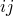分量（）。
.fil: 否    .odb Field: 否    .odb History: 是
**SP**

所有主应力分量。
.fil: 是    .odb Field: 是    .odb History: 是
**SP*n***

最小、中间和最大主应力分量（SP1  SP2  SP3）。
.fil: 否    .odb Field: 否    .odb History: 是
**E**

几何线性分析的所有无穷小应变分量。
.fil: 是    .odb Field: 是    .odb History: 是
**E*ij***

无穷小应变的分量（）。
.fil: 否    .odb Field: 否    .odb History: 是
**LE**

所有对数应变分量。
.fil: 是    .odb Field: 是    .odb History: 是
**LE*ij***

对数应变的分量（）。
.fil: 否    .odb Field: 否    .odb History: 是
**LEP**

所有主对数应变分量。
.fil: 是    .odb Field: 是    .odb History: 是
**LEP*n***

最小、中间和最大主对数应变分量（LEP1  LEP2  LEP3）。
.fil: 否    .odb Field: 否    .odb History: 是
**ER**

所有对数应变率分量。
.fil: 是    .odb Field: 是    .odb History: 是
**ER*ij***

对数应变率的分量（）。
.fil: 否    .odb Field: 否    .odb History: 是
**ERP**

所有主对数应变率分量。
.fil: 是    .odb Field: 是    .odb History: 是
**ERP*n***

最小、中间和最大主应变率分量（ERP1  ERP2  ERP3）。
.fil: 否    .odb Field: 否    .odb History: 是
**NE**

所有名义应变分量。
.fil: 是    .odb Field: 是    .odb History: 是
**NE*ij***

名义应变的分量（）。
.fil: 否    .odb Field: 否    .odb History: 是
**NEP**

所有主名义应变分量。
.fil: 是    .odb Field: 是    .odb History: 是
**NEP*n***

最小、中间和最大主名义应变分量（NEP1  NEP2  NEP3）。
.fil: 否    .odb Field: 否    .odb History: 是
**PE**

所有塑性应变分量。
.fil: 是    .odb Field: 是    .odb History: 是
**PE*ij***

塑性应变的分量（）。
.fil: 否    .odb Field: 否    .odb History: 是
**PEP**

所有主塑性应变。
.fil: 否    .odb Field: 是    .odb History: 是
**PEP*n***

最小、中间和最大主塑性应变。
.fil: 否    .odb Field: 否    .odb History: 是
**ERV**

体积应变率。
.fil: 是    .odb Field: 是    .odb History: 是
**MISES**

Mises等效应力，定义为，其中是偏应力张量，定义为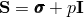，其中是应力，是等效压力应力。
.fil: 是    .odb Field: 是    .odb History: 是
**PRESS**

等效压力应力，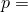 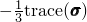。
.fil: 是    .odb Field: 是    .odb History: 是
**TRIAX**

应力三轴度，。
.fil: 否    .odb Field: 是    .odb History: 是
**YIELDS**

屈服应力，，可用于Mises、Johnson-Cook和Hill塑性材料模型。
.fil: 否    .odb Field: 是    .odb History: 是
**MASSADJUST**

在质量调整使用的元素集合中每个元素的调整或重新分布的质量。此输出仅在第一个分析步骤的第一个输出帧中可用。
.fil: 否    .odb Field: 是    .odb History: 否
**ALPHA**

所有总运动硬化偏移张量分量。
.fil: 是    .odb Field: 是    .odb History: 是
**ALPHA*ij***

总偏移张量的分量（）。
.fil: 否    .odb Field: 否    .odb History: 是
**ALPHAP**

总偏移张量的所有主值。
.fil: 是    .odb Field: 是    .odb History: 是
**ALPHAP*n***

总偏移张量的最小、中间和最大主值（ALPHAP1  ALPHAP2  ALPHAP3）。
.fil: 否    .odb Field: 否    .odb History: 是
**PEEQ**

等效塑性应变。

对于多孔金属塑性，PEEQ是基体材料中定义的等效塑性应变，定义为。

对于帽形塑性，PEEQ给出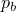（帽形位置）。

对于具有体积硬化的可压碎泡沫塑性，PEEQ给出体积压缩塑性应变，定义为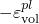。
对于具有各向同性硬化的可压碎泡沫塑性，PEEQ给出等效塑性应变，定义为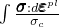，其中是单轴压缩屈服应力。
.fil: 是    .odb Field: 是    .odb History: 是
**PEEQT**

铸铁、单轴拉伸截止和混凝土损坏塑性的拉伸中的等效塑性应变，定义为。
.fil: 否    .odb Field: 是    .odb History: 是
**PEEQR**

等效塑性应变率。
.fil: 否    .odb Field: 是    .odb History: 是
**PEEQMAX**

所有截面点中的最大等效塑性应变PEEQ。对于壳单元，它表示该层所有截面点中的最大PEEQ值；对于梁或管单元，它表示横截面上所有截面点中的最大PEEQ；对于实体单元，它表示积分点处的PEEQ。
.fil: 否    .odb Field: 是    .odb History: 否
**DMICRTMAX**

所有截面点和所有损坏起始准则中的最大损坏起始。

此输出变量生成三个输出量，如下所示：

DMICRTMAXVAL输出最大损坏起始值。

DMICRTPOS输出发生最大损坏起始值的层中的截面点。对于实体单元，输出值为1。

DMICRTTYPE输出一个值，表示在元素中达到最大值的损坏起始准则类型，如下所述：

对于具有渐进损伤失效的单元：1-DUCTCRT、2-SHRCRT、3-JCCRT、4-FLDCRT、5-MSFLDCRT、6-FLSDCRT和7-MKCRT。

对于具有纤维增强材料损坏的单元：11-HSNFTCRT、12-HSNFCCRT、13-HSNMTCRT和14-HSNMCCRT。

对于具有牵引-分离行为的内聚单元：21-MAXSCRT、22-MAXECRT、23-QUADSCRT和24-QUADECRT。
最大损坏起始输出值在请求的输出帧中保留，直到计算出更高的最大损坏起始值。
.fil: 否    .odb Field: 是    .odb History: 否

#### 几何量

**COORD**

实体单元积分点的坐标。如果使用大位移公式，则是当前坐标。
.fil: 否    .odb Field: 是    .odb History: 是
**LOCALDIR*n***

各向异性超弹性材料模型的局部材料方向的方向余弦，或织物材料模型的纱线方向余弦。如果为各向异性超弹性或织物材料请求任何其他元素场输出，将自动输出此变量（参见["输出" in "各向异性超弹性行为，" 第22.5.3节](pt05ch22s05abm09.md#usb-mat-canisohyperelastic-output)，和["输出" in "织物材料行为，" 第23.4.1节](pt05ch23s04abm35.md#usb-mat-cfabric-output)）。
.fil: 否    .odb Field: 自动    .odb History: 否

#### 其他元素应力

**TSHR**

所有三维常规壳单元的横向剪切应力分量。
.fil: 是    .odb Field: 是    .odb History: 是
**TSHR13**

横向剪切应力的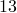分量。
.fil: 否    .odb Field: 否    .odb History: 是
**TSHR23**

横向剪切应力的分量。
.fil: 否    .odb Field: 否    .odb History: 是

#### 能量密度

**ENER**

所有能量密度。
.fil: 是    .odb Field: 是    .odb History: 是
**SENER**

弹性应变能量密度，每单位体积。
.fil: 否    .odb Field: 是    .odb History: 是
**PENER**

由于与速率无关和与速率相关的塑性而每单位体积消耗的能量。
.fil: 否    .odb Field: 是    .odb History: 是
**CENER**

由于粘弹性而每单位体积消耗的能量。（不支持具有线性粘弹性的超弹性材料和超泡沫材料模型。）
.fil: 否    .odb Field: 是    .odb History: 是
**VENER**

由于粘性效应而每单位体积消耗的能量。
.fil: 否    .odb Field: 是    .odb History: 是
**DMENER**

由于损坏而每单位体积消耗的能量。
.fil: 否    .odb Field: 是    .odb History: 是

#### 状态和场变量

**SDV**

随解变化的状态变量。
.fil: 是    .odb Field: 是    .odb History: 是
**SDV*n***

随解变化的状态变量*n*。
.fil: 否    .odb Field: 是    .odb History: 是
**TEMP**

温度。
.fil: 是    .odb Field: 是    .odb History: 是
**DENSITY**

材料密度。
.fil: 否    .odb Field: 是    .odb History: 是
**FV**

场变量。
.fil: 否    .odb Field: 是    .odb History: 是
**FV*n***

场变量*n*。
.fil: 否    .odb Field: 否    .odb History: 是

#### 复合失效测量

**CFAILURE**

所有失效测量分量。
.fil: 否    .odb Field: 是    .odb History: 否
**MSTRS**

最大应力理论失效测量。
.fil: 否    .odb Field: 否    .odb History: 否
**TSAIH**

Tsai-Hill理论失效测量。
.fil: 否    .odb Field: 否    .odb History: 否
**TSAIW**

Tsai-Wu理论失效测量。
.fil: 否    .odb Field: 否    .odb History: 否
**AZZIT**

Azzi-Tsai-Hill理论失效测量。
.fil: 否    .odb Field: 否    .odb History: 否
**MSTRN**

最大应变理论失效测量。
.fil: 否    .odb Field: 否    .odb History: 否

#### 其他塑性量

**PEQC**

当模型有多个屈服/失效面时的所有等效塑性应变。
.fil: 是    .odb Field: 是    .odb History: 是
**PEQC*n***

第*n*个等效塑性应变（）。

对于帽形塑性：PEQC为所有三个可能的屈服/失效面提供等效塑性应变（Drucker-Prager失效面 - PEQC1、帽形面 - PEQC2和过渡面 - PEQC3）以及总体积塑性应变（PEQC4）。所有标识符还提供一个是/否标志（输出数据库上为1/0），指示屈服面当前是否活跃（AC YIELD："主动屈服"）。
当PEQC被请求输出到输出数据库时，每个分量的活跃屈服标志命名为AC YIELD1、AC YIELD2等。
.fil: 否    .odb Field: 否    .odb History: 是

#### 多孔金属塑性量

**VVF**

孔隙体积分数（多孔金属塑性）。
.fil: 是    .odb Field: 是    .odb History: 是
**VVFG**

由于生长导致的孔隙体积分数（多孔金属塑性）。
.fil: 是    .odb Field: 是    .odb History: 是
**VVFN**

由于形核导致的孔隙体积分数（多孔金属塑性）。
.fil: 是    .odb Field: 是    .odb History: 是

#### 混凝土损坏塑性

**DAMAGEC**

压缩损坏变量，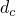。
.fil: 否    .odb Field: 是    .odb History: 是
**DAMAGET**

拉伸损坏变量，。
.fil: 否    .odb Field: 是    .odb History: 是
**SDEG**

标量刚度退化变量，*d*。
.fil: 否    .odb Field: 是    .odb History: 是
**PEEQ**

单轴压缩中的等效塑性应变，定义为。
.fil: 否    .odb Field: 是    .odb History: 是
**PEEQR**

等效塑性应变率。
.fil: 否    .odb Field: 是    .odb History: 是

#### 裂纹模型量

**CKE**

所有裂纹应变分量。
.fil: 是    .odb Field: 否    .odb History: 否
**CKE*ij***

裂纹应变的分量。
.fil: 否    .odb Field: 否    .odb History: 否
**CKLE**

局部裂纹轴中的所有裂纹应变分量。
.fil: 是    .odb Field: 否    .odb History: 否
**CKLE*ij***

局部裂纹轴中裂纹应变的分量。
.fil: 否    .odb Field: 否    .odb History: 否
**CKEMAG**

裂纹应变幅值，定义为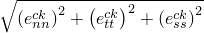。
.fil: 是    .odb Field: 否    .odb History: 否
**CKLS**

局部裂纹轴中的所有应力分量。
.fil: 是    .odb Field: 否    .odb History: 否
**CKLS*ij***

局部裂纹轴中应力的分量。
.fil: 否    .odb Field: 否    .odb History: 否
**CRACK**

裂纹方向。
.fil: 是    .odb Field: 否    .odb History: 否
**CKSTAT**

每个裂纹的裂纹状态。CKSTAT可以为每个裂纹设置以下值：0.0=未开裂、1.0=闭合裂纹、2.0=主动开裂、3.0=裂纹闭合/重新打开。
.fil: 是    .odb Field: 否    .odb History: 否

#### 渐进损伤失效

**DMICRT**

损坏起始准则的所有活跃分量。
.fil: 否    .odb Field: 是    .odb History: 是
**DUCTCRT**

韧性损坏起始准则。
.fil: 否    .odb Field: 否    .odb History: 是
**JCCRT**

Johnson-Cook损坏起始准则。
.fil: 否    .odb Field: 否    .odb History: 是
**SHRCRT**

剪切损坏起始准则。
.fil: 否    .odb Field: 否    .odb History: 是
**FLDCRT**

成形极限图（FLD）损坏起始准则。
.fil: 否    .odb Field: 否    .odb History: 是
**FLSDCRT**

成形极限应力图（FLSD）损坏起始准则。
.fil: 否    .odb Field: 否    .odb History: 是
**MSFLDCRT**

Mschenborn-Sonne成形极限应力图（MSFLD）损坏起始准则。
.fil: 否    .odb Field: 否    .odb History: 是
**MKCRT**

Marciniak-Kuczynski（M-K）损坏起始准则。
.fil: 否    .odb Field: 否    .odb History: 是
**SDEG**

总体标量刚度退化。
.fil: 否    .odb Field: 是    .odb History: 是
**ERPRATIO**

用于MSFLD损坏起始准则的主应变率比，。
.fil: 否    .odb Field: 是    .odb History: 是
**SHRRATIO**

用于剪切损坏起始准则的剪切应力比，。
.fil: 否    .odb Field: 是    .odb History: 是

#### 纤维增强材料损坏

**DMICRT**

损坏起始准则的所有活跃分量。
.fil: 否    .odb Field: 是    .odb History: 是
**HSNFTCRT**

Hashin纤维拉伸损坏起始准则。
.fil: 否    .odb Field: 否    .odb History: 是
**HSNFCCRT**

Hashin纤维压缩损坏起始准则。
.fil: 否    .odb Field: 否    .odb History: 是
**HSNMTCRT**

Hashin基体拉伸损坏起始准则。
.fil: 否    .odb Field: 否    .odb History: 是
**HSNMCCRT**

Hashin基体压缩损坏起始准则。
.fil: 否    .odb Field: 否    .odb History: 是
**DAMAGEFT**

纤维拉伸损坏变量。
.fil: 否    .odb Field: 是    .odb History: 是
**DAMAGEFC**

纤维压缩损坏变量。
.fil: 否    .odb Field: 是    .odb History: 是
**DAMAGEMT**

基体拉伸损坏变量。
.fil: 否    .odb Field: 是    .odb History: 是
**DAMAGEMC**

基体压缩损坏变量。
.fil: 否    .odb Field: 是    .odb History: 是
**DAMAGESHR**

剪切损坏变量。
.fil: 否    .odb Field: 是    .odb History: 是

#### 织物材料

输出变量LOCALDIR（如上所述）会自动为织物材料输出。
**SFABRIC**

所有织物应力分量。
.fil: 否    .odb Field: 是    .odb History: 是
**EFABRIC**

所有织物应变分量。
.fil: 否    .odb Field: 是    .odb History: 是
**SFABRIC*ij***

织物应力的分量（）。
.fil: 否    .odb Field: 否    .odb History: 是
**EFABRIC*ij***

织物应变的分量（）。
.fil: 否    .odb Field: 否    .odb History: 是

#### 状态方程

**BURNF**

点燃和生长材料中燃料的分数。
.fil: 否    .odb Field: 是    .odb History: 是
**DBURNF**

点燃和生长材料的反应速率。
.fil: 否    .odb Field: 是    .odb History: 是
**RHOE**

点燃和生长材料中未反应爆炸物的密度。
.fil: 否    .odb Field: 是    .odb History: 是
**RHOP**

点燃和生长材料中反应气体产物的密度。
.fil: 否    .odb Field: 是    .odb History: 是
**PALPH**

多孔材料的扩张度，，材料为。
.fil: 否    .odb Field: 是    .odb History: 是
**PALPHMIN**

在塑性压实期间，材料为的多孔材料达到的扩张度的最小值，。
.fil: 否    .odb Field: 是    .odb History: 是

#### 钢筋量

**RBFOR**

钢筋中的力。
.fil: 是    .odb Field: 是    .odb History: 是
**RBANG**

钢筋与用户指定的等参方向之间的角度（度）。仅适用于壳和膜单元。
.fil: 是    .odb Field: 是    .odb History: 是
**RBROT**

钢筋与用户指定的等参方向之间角度的变化（度）。仅适用于壳和膜单元。
.fil: 是    .odb Field: 是    .odb History: 是

#### 积分点坐标

**COORD**

元素积分点的坐标。
.fil: 否    .odb Field: 是    .odb History: 是

#### 耦合热应力单元

**HFL**

热通量向量每单位面积的当前大小和分量。
.fil: 是    .odb Field: 是    .odb History: 是
**HFLM**

热通量向量每单位面积的当前大小。
.fil: 否    .odb Field: 否    .odb History: 是
**HFL*n***

热通量向量的第*n*分量（）。
.fil: 否    .odb Field: 否    .odb History: 是

#### 内聚单元

**MAXSCRT**

最大名义应力损坏起始准则。
.fil: 否    .odb Field: 否    .odb History: 是
**MAXECRT**

最大名义应变损坏起始准则。
.fil: 否    .odb Field: 否    .odb History: 是
**QUADSCRT**

二次名义应力损坏起始准则。
.fil: 否    .odb Field: 否    .odb History: 是
**QUADECRT**

二次名义应变损坏起始准则。
.fil: 否    .odb Field: 否    .odb History: 是
**DMICRT**

损坏起始准则的所有活跃分量。
.fil: 否    .odb Field: 是    .odb History: 是
**SDEG**

总体标量刚度退化。
.fil: 否    .odb Field: 是    .odb History: 是
**STATUS**

单元的状态（如果单元是活跃的，则状态为1.0；如果单元不活跃，则为0.0）。
.fil: 否    .odb Field: 是    .odb History: 是
**MMIXDME**

损坏演化过程中的模式混合比。在损坏起始之前，其值为。
.fil: 否    .odb Field: 是    .odb History: 是
**MMIXDMI**

损坏起始时的模式混合比。在损坏起始之前，其值为。
.fil: 否    .odb Field: 是    .odb History: 是

#### Eulerian单元

**EVF**

Eulerian体积分数。输出包括Eulerian截面中定义的每个材料的体积分数数据，以及空隙的体积分数。
.fil: 否    .odb Field: 是    .odb History: 是
**DENSITYVAVG**

密度，计算为元素中所有材料的体积分数加权平均值。
.fil: 否    .odb Field: 是    .odb History: 否
**MISESVAVG**

Mises应力，计算为元素中所有材料的体积分数加权平均值。
.fil: 否    .odb Field: 是    .odb History: 否
**PEVAVG**

塑性应变分量，计算为元素中所有材料的体积分数加权平均值。
.fil: 否    .odb Field: 是    .odb History: 否
**PEEQVAVG**

等效塑性应变，计算为元素中所有材料的体积分数加权平均值。
.fil: 否    .odb Field: 是    .odb History: 否
**PRESSVAVG**

等效压力应力，计算为元素中所有材料的体积分数加权平均值。
.fil: 否    .odb Field: 是    .odb History: 否
**SVAVG**

应力分量，计算为元素中所有材料的体积分数加权平均值。
.fil: 否    .odb Field: 是    .odb History: 否
**TEMPMAVG**

温度，计算为元素中所有材料的质量分数加权平均值。
.fil: 否    .odb Field: 是    .odb History: 否

### 元素截面变量

您可以请求元素截面变量输出到结果或输出数据库文件（参见["元素输出" in "输出到数据和结果文件，" 第4.1.2节](pt02ch04s01aus39.md#usb-out-oprintfile-elementoutput)，和["元素输出" in "输出到输出数据库，" 第4.1.3节](pt02ch04s01aus40.md#usb-out-odboutput-elementoutput)）。这些变量仅适用于梁、管和壳单元，但STH也可用于膜和平面应力单元。它们在[第六部分，"单元"](pt06.md)的特定单元描述中定义。

**STH**

截面厚度（仅适用于壳、膜和平面应力单元）。
.fil: 是    .odb Field: 是    .odb History: 是
**STHIN**

截面变薄或变厚，定义为，其中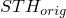是壳、膜和平面应力单元截面定义上指定的原始厚度。
.fil: 是    .odb Field: 是    .odb History: 是
**SF**

所有截面合成分量，包括平移（力）和旋转（弯矩）。
.fil: 是    .odb Field: 是    .odb History: 是
**SF*n***

第*n*分量每单位宽度的截面力，对于常规壳：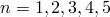；对于连续壳：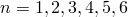；对于梁和管：。
.fil: 否    .odb Field: 否    .odb History: 是
**SM*n***

第*n*分量每单位宽度的截面弯矩，。
.fil: 否    .odb Field: 否    .odb History: 是
**SORIENT**

复合壳截面方向。
.fil: 否    .odb Field: 是    .odb History: 否
**SE**

所有截面名义应变，包括平移和旋转（如壳中的中面应变和曲率）。
.fil: 是    .odb Field: 是    .odb History: 是
**SE*n***

截面名义应变分量*n*，对于壳：；对于梁和管：。
.fil: 否    .odb Field: 否    .odb History: 是
**SK*n***

截面曲率变化或扭曲*n*，。
.fil: 否    .odb Field: 否    .odb History: 是
**SSAVG**

所有平均膜和横向剪切应力分量（仅限壳单元）。
.fil: 是    .odb Field: 是    .odb History: 否
**SSAVG*n***

平均膜或横向剪切应力分量*n*，（仅限壳单元）。
.fil: 否    .odb Field: 否    .odb History: 是

### 整体元素变量

您可以请求整体元素变量输出到结果或输出数据库文件（参见["元素输出" in "输出到数据和结果文件，" 第4.1.2节](pt02ch04s01aus39.md#usb-out-oprintfile-elementoutput)，和["元素输出" in "输出到输出数据库，" 第4.1.3节](pt02ch04s01aus40.md#usb-out-odboutput-elementoutput)）。

**ELEN**

单元中所有能量大小。
.fil: 是    .odb Field: 是    .odb History: 是
**ELSE**

单元中的总弹性应变能量（包括壳中横向剪切变形中的能量）。
.fil: 否    .odb Field: 是    .odb History: 是
**ELCD**

单元中由于粘弹性变形而消耗的总能量。（不支持具有线性粘弹性的超弹性和超泡沫材料模型。）
.fil: 否    .odb Field: 是    .odb History: 是
**ELPD**

单元中由于与速率无关和与速率相关的塑性变形而消耗的总能量。
.fil: 否    .odb Field: 是    .odb History: 是
**ELVD**

单元中由于粘性效应而消耗的总能量。这包括体积粘性和材料阻尼。
.fil: 否    .odb Field: 是    .odb History: 是
**ELASE**

单元中的总"人工"应变能量。这包括小时glass能量和壳中的钻孔刚度能量。
.fil: 否    .odb Field: 是    .odb History: 是
**ELIHE**

单元中的内热能量。
.fil: 否    .odb Field: 是    .odb History: 是
**ELDMD**

单元中由于损坏而消耗的总能量。
.fil: 否    .odb Field: 是    .odb History: 是
**ELDC**

单元中由于失真控制而消耗的总能量。
.fil: 否    .odb Field: 是    .odb History: 是
**ELEDEN**

所有元素能量密度分量。
.fil: 否    .odb Field: 是    .odb History: 否
**ESEDEN**

单元中的总弹性应变能量密度。
.fil: 否    .odb Field: 是    .odb History: 否
**EPDDEN**

单元中由于与速率无关和与速率相关的塑性变形而每单位体积消耗的总能量。
.fil: 否    .odb Field: 是    .odb History: 否
**ECDDEN**

单元中由于粘弹性而每单位体积消耗的总能量。
.fil: 否    .odb Field: 是    .odb History: 否
**EVDDEN**

单元中由于粘性效应而每单位体积消耗的总能量。
.fil: 否    .odb Field: 是    .odb History: 否
**EASEDEN**

单元中的总"人工"应变能量密度（与用于消除奇异模式的约束相关的能量密度，如小时glass控制）。
.fil: 否    .odb Field: 是    .odb History: 否
**EIHEDEN**

单元中的内热能量密度。
.fil: 否    .odb Field: 是    .odb History: 否
**EDMDDEN**

单元中由于损坏而每单位体积消耗的总能量。
.fil: 否    .odb Field: 是    .odb History: 否
**EDCDEN**

单元中由于失真控制而每单位体积消耗的总能量。
.fil: 否    .odb Field: 是    .odb History: 否
**EDT**

单元稳定时间增量。
.fil: 是    .odb Field: 是    .odb History: 是
**EMSF**

单元质量缩放因子。
.fil: 是    .odb Field: 是    .odb History: 是
**STATUS**

元素的状态（具有渐进损伤的材料失效、剪切失效模型、拉力失效模型、多孔失效准则、脆性失效模型、Johnson-Cook塑性模型和[`VUMAT`](../sub/sub-link.md#sub-xsl-vumat)）。如果元素是活跃的，则状态为1.0；如果元素不活跃，则为0.0。
.fil: 是    .odb Field: 是    .odb History: 是
**EVOL**

当前单元体积。（仅适用于不使用通用梁或壳截面定义的连续和结构单元。）
.fil: 否    .odb Field: 是    .odb History: 否
**NFORC**

单元节点上的力，来自该单元的小时glass模式和常规变形模式（全局坐标系中内力的负值）。
.fil: 否    .odb Field: 是    .odb History: 是
**GRAV**

均匀分布的重力载荷。
.fil: 否    .odb Field: 是    .odb History: 否
**SBF**

滞止体力。
.fil: 否    .odb Field: 是    .odb History: 否
**BF**

均匀分布的体力，包括粘性体力。
.fil: 否    .odb Field: 是    .odb History: 否
**EDMICRTMAX**

整个壳单元所有层、所有损坏起始准则以及完全积分单元所有积分点中的最大损坏起始。

此输出变量与固体和梁单元的DMICRT输出相同，但它补充了复合壳单元的DMICRT输出变量，因为它提取所有层中的最大损坏起始。

此输出变量生成四个元素输出量，如下所示：

EDMICRTMAXVAL输出整个元素中的最大损坏起始值。

EDMICRTLAYER输出发生最大损坏起始值的层号。

EDMICRTTYPE输出一个值，表示在元素中达到最大值的损坏起始准则类型，如DMICRTMAX输出变量描述中所述。

EDMICRTINTP输出发生最大损坏值的积分点号。对于减缩积分单元，输出值为1。
最大损坏起始输出值在请求的输出帧中保留，直到计算出更高的最大损坏起始值。
.fil: 否    .odb Field: 是    .odb History: 否

#### 连接器单元

**CTF**

连接器总力和弯矩的所有分量。
.fil: 是    .odb Field: 是    .odb History: 是
**CTF*n***

连接器总力第*n*分量（）。
.fil: 否    .odb Field: 否    .odb History: 是
**CTM*n***

连接器总弯矩第*n*分量（）。
.fil: 否    .odb Field: 否    .odb History: 是
**CEF**

连接器弹性力和弯矩的所有分量。
.fil: 是    .odb Field: 是    .odb History: 是
**CEF*n***

连接器弹性力第*n*分量（）。
.fil: 否    .odb Field: 否    .odb History: 是
**CEM*n***

连接器弹性弯矩第*n*分量（）。
.fil: 否    .odb Field: 否    .odb History: 是
**CUE**

所有方向上的弹性位移和转角。
.fil: 是    .odb Field: 是    .odb History: 是
**CUE*n***

*n*方向上的弹性位移（）。
.fil: 否    .odb Field: 否    .odb History: 是
**CURE*n***

*n*方向上的弹性转角（）。
.fil: 否    .odb Field: 否    .odb History: 是
**CUP**

所有方向上的塑性相对位移和转角。
.fil: 是    .odb Field: 是    .odb History: 是
**CUP*n***

*n*方向上的塑性相对位移（）。
.fil: 否    .odb Field: 否    .odb History: 是
**CURP*n***

*n*方向上的塑性相对转角（）。
.fil: 否    .odb Field: 否    .odb History: 是
**CUPEQ**

所有方向上的等效塑性相对位移和转角，以及耦合塑性定义的等效塑性相对运动。
.fil: 是    .odb Field: 是    .odb History: 是
**CUPEQ*n***

*n*方向上的等效塑性相对位移（）。
.fil: 否    .odb Field: 否    .odb History: 是
**CURPEQ*n***

*n*方向上的等效塑性相对转角（）。
.fil: 否    .odb Field: 否    .odb History: 是
**CUPEQC**

耦合塑性定义的等效塑性相对运动。
.fil: 否    .odb Field: 否    .odb History: 是
**CALPHAF**

连接器运动硬化偏移力和弯矩的所有分量。
.fil: 是    .odb Field: 否    .odb History: 是
**CALPHAF*n***

连接器运动硬化偏移力第*n*分量（）。
.fil: 否    .odb Field: 否    .odb History: 是
**CALPHAM*n***

连接器运动硬化偏移弯矩第*n*分量（）。
.fil: 否    .odb Field: 否    .odb History: 是
**CVF**

连接器粘性力和弯矩的所有分量。
.fil: 是    .odb Field: 是    .odb History: 是
**CVF*n***

连接器粘性力第*n*分量（）。
.fil: 否    .odb Field: 否    .odb History: 是
**CVM*n***

连接器粘性弯矩第*n*分量（）。
.fil: 否    .odb Field: 否    .odb History: 是
**CUF**

连接器单轴力和弯矩的所有分量。
.fil: 否    .odb Field: 是    .odb History: 是
**CUF*n***

连接器单轴力第*n*分量（）。
.fil: 否    .odb Field: 否    .odb History: 是
**CUM*n***

连接器单轴弯矩第*n*分量（）。
.fil: 否    .odb Field: 否    .odb History: 是
**CSF**

连接器摩擦力和弯矩的所有分量。
.fil: 是    .odb Field: 否    .odb History: 是
**CSF*n***

连接器摩擦力第*n*分量（）。
.fil: 否    .odb Field: 否    .odb History: 是
**CSM*n***

连接器摩擦弯矩第*n*分量（）。
.fil: 否    .odb Field: 否    .odb History: 是
**CSFC**

瞬时滑移方向上的连接器摩擦力。仅在滑移方向定义了摩擦时可用。
.fil: 否    .odb Field: 否    .odb History: 是
**CNF**

连接器摩擦产生接触力和弯矩的所有分量。
.fil: 是    .odb Field: 否    .odb History: 是
**CNF*n***

连接器摩擦产生接触力第*n*分量（*n* = 1, 2, 3）。
.fil: 否    .odb Field: 否    .odb History: 是
**CNM*n***

连接器摩擦产生接触弯矩第*n*分量（*n* = 1, 2, 3）。
.fil: 否    .odb Field: 否    .odb History: 是
**CNFC**

瞬时滑移方向上的连接器摩擦产生接触力。仅在滑移方向定义了摩擦时可用。
.fil: 否    .odb Field: 否    .odb History: 是
**CDMG**

总体损坏变量的所有分量。
.fil: 是    .odb Field: 是    .odb History: 是
**CDMG*n***

总体损坏变量第*n*分量（）。
.fil: 否    .odb Field: 否    .odb History: 是
**CDMGR*n***

总体损坏变量第*n*分量（）。
.fil: 否    .odb Field: 否    .odb History: 是
**CDIF**

所有方向上基于连接器力的损坏起始准则的分量。
.fil: 是    .odb Field: 否    .odb History: 是
**CDIF*n***

*n*平移方向上基于连接器力的损坏起始准则（）。
.fil: 否    .odb Field: 否    .odb History: 是
**CDIFR*n***

*n*旋转方向上基于连接器力的损坏起始准则（）。
.fil: 否    .odb Field: 否    .odb History: 是
**CDIFC**

瞬时滑移方向上基于连接器力的损坏起始准则。
.fil: 否    .odb Field: 否    .odb History: 是
**CDIM**

所有方向上基于连接器运动的损坏起始准则的分量。
.fil: 是    .odb Field: 否    .odb History: 是
**CDIM*n***

*n*平移方向上基于连接器运动的损坏起始准则（）。
.fil: 否    .odb Field: 否    .odb History: 是
**CDIMR*n***

*n*旋转方向上基于连接器运动的损坏起始准则（）。
.fil: 否    .odb Field: 否    .odb History: 是
**CDIMC**

瞬时滑移方向上基于连接器运动的损坏起始准则。
.fil: 否    .odb Field: 否    .odb History: 是
**CDIP**

所有方向上基于连接器塑性运动的损坏起始准则的分量（包括瞬时滑移方向）。
.fil: 是    .odb Field: 是    .odb History: 是
**CDIP*n***

*n*平移方向上基于连接器塑性运动的损坏起始准则（）。
.fil: 否    .odb Field: 否    .odb History: 是
**CDIPR*n***

*n*旋转方向上基于连接器塑性运动的损坏起始准则（）。
.fil: 否    .odb Field: 否    .odb History: 是
**CDIPC**

瞬时滑移方向上基于连接器塑性运动的损坏起始准则。
.fil: 否    .odb Field: 否    .odb History: 是
**CSLST**

连接器停止和连接器锁状态的所有标志。
.fil: 是    .odb Field: 否    .odb History: 是
**CSLST*i***

*i*方向上连接器停止和连接器锁状态的标志（）。
.fil: 否    .odb Field: 否    .odb History: 是
**CASU**

所有方向上累积滑移的分量。
.fil: 是    .odb Field: 否    .odb History: 是
**CASU*n***

*n*方向上连接器累积滑移（*n* = 1, 2, 3）。
.fil: 否    .odb Field: 否    .odb History: 是
**CASUR*n***

*n*方向上连接器角度累积滑移（*n* = 1, 2, 3）。
.fil: 否    .odb Field: 否    .odb History: 是
**CASUC**

瞬时滑移方向上的连接器累积滑移。仅在滑移方向定义了摩擦时可用。
.fil: 否    .odb Field: 否    .odb History: 是
**CIVC**

瞬时滑移方向上的连接器瞬时速度。仅在滑移方向定义了摩擦时可用。
.fil: 是    .odb Field: 否    .odb History: 是
**CRF**

连接器反作用力和弯矩的所有分量。
.fil: 是    .odb Field: 否    .odb History: 是
**CRF*n***

连接器反作用力第*n*分量（）。
.fil: 否    .odb Field: 否    .odb History: 是
**CRM*n***

连接器反作用弯矩第*n*分量（）。
.fil: 否    .odb Field: 否    .odb History: 是
**CCF**

连接器集中力和弯矩的所有分量。
.fil: 是    .odb Field: 否    .odb History: 是
**CCF*n***

连接器集中力第*n*分量（）。
.fil: 否    .odb Field: 否    .odb History: 是
**CCM*n***

连接器集中弯矩第*n*分量（）。
.fil: 否    .odb Field: 否    .odb History: 是
**CP**

所有方向上的相对位置。
.fil: 是    .odb Field: 是    .odb History: 是
**CP*n***

*n*方向上的相对位置（）。
.fil: 否    .odb Field: 否    .odb History: 是
**CPR*n***

*n*方向上的相对角位置（）。
.fil: 否    .odb Field: 否    .odb History: 是
**CU**

所有方向上的相对位移和转角。
.fil: 是    .odb Field: 是    .odb History: 是
**CU*n***

*n*方向上的相对位移（）。
.fil: 否    .odb Field: 否    .odb History: 是
**CUR*n***

*n*方向上的相对转角（）。
.fil: 否    .odb Field: 否    .odb History: 是
**CCU**

所有方向上的构成位移和转角。
.fil: 是    .odb Field: 否    .odb History: 是
**CCU*n***

*n*方向上的构成位移（）。
.fil: 否    .odb Field: 否    .odb History: 是
**CCUR*n***

*n*方向上的构成转角（）。
.fil: 否    .odb Field: 否    .odb History: 是
**CV**

所有方向上的相对速度。
.fil: 是    .odb Field: 是    .odb History: 是
**CV*n***

*n*方向上的相对速度（）。
.fil: 否    .odb Field: 否    .odb History: 是
**CVR*n***

*n*方向上的相对角速度（）。
.fil: 否    .odb Field: 否    .odb History: 是
**CA**

所有方向上的相对加速度。
.fil: 是    .odb Field: 是    .odb History: 是
**CA*n***

*n*方向上的相对加速度（）。
.fil: 否    .odb Field: 否    .odb History: 是
**CAR*n***

*n*方向上的相对角加速度（）。
.fil: 否    .odb Field: 否    .odb History: 是
**CFAILST**

连接器失效状态的所有标志。
.fil: 是    .odb Field: 是    .odb History: 是
**CFAILST*i***

*i*方向上连接器失效状态的标志（）。
.fil: 否    .odb Field: 否    .odb History: 是
**CDERU**

连接器导出位移。
.fil: 否    .odb Field: 是    .odb History: 是
**CDERF**

连接器导出力。
.fil: 否    .odb Field: 是    .odb History: 是

### 元素面变量

您可以请求元素面变量输出到输出数据库文件（参见["元素输出" in "输出到输出数据库，" 第4.1.3节](pt02ch04s01aus40.md#usb-out-odboutput-elementoutput)）。这些变量仅适用于壳、膜和实体单元。

**P**

单元面上的均匀分布压力载荷。当使用[*DLOAD](../key/key-link.md#usb-kws-hdload)定义压力时，变量名会自动更改为PDLOAD。
.fil: 否    .odb Field: 是    .odb History: 否
**STAGP**

单元面上的滞止压力载荷。
.fil: 否    .odb Field: 是    .odb History: 否
**VP**

单元面上的粘性压力载荷。
.fil: 否    .odb Field: 是    .odb History: 否
**IWCONWEP**

单元面上CONWEP模型的气爆压力载荷。
.fil: 否    .odb Field: 是    .odb History: 否
**TRNOR**

单元面上牵引载荷的法向分量（沿面法向的分量）。
.fil: 否    .odb Field: 是    .odb History: 否
**TRSHR**

单元面上牵引载荷的剪切分量（沿面切向的分量）。
.fil: 否    .odb Field: 是    .odb History: 否

### 节点变量

您可以请求节点变量输出到结果或输出数据库文件（参见["节点输出" in "输出到数据和结果文件，" 第4.1.2节](pt02ch04s01aus39.md#usb-out-oprintfile-nodaloutput)，和["节点输出" in "输出到输出数据库，" 第4.1.3节](pt02ch04s01aus40.md#usb-out-odboutput-nodaloutput)）。

**COORD**

节点的坐标。如果使用大位移公式，则是当前坐标。
.fil: 是    .odb Field: 是    .odb History: 是
**COOR*n***

坐标*n*（）。
.fil: 否    .odb Field: 否    .odb History: 是
**U**

位移分量。

结果文件和场型输出：平移和旋转。
历史型输出：仅平移。旋转结果应按分量请求。
.fil: 是    .odb Field: 是    .odb History: 是
**UT**

平移位移分量。
.fil: 否    .odb Field: 是    .odb History: 是
**UMAG**

平移位移的大小。
.fil: 否    .odb Field: 否    .odb History: 是
**UR**

旋转位移分量。
.fil: 否    .odb Field: 是    .odb History: 是
**U*n***

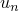位移分量（）。
.fil: 否    .odb Field: 否    .odb History: 是
**UR*n***

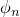旋转分量（）。
.fil: 否    .odb Field: 否    .odb History: 是
**V**

速度分量（平移和旋转）。

结果文件和场型输出：平移和旋转。
历史型输出：仅平移。旋转结果应按分量请求。
.fil: 是    .odb Field: 是    .odb History: 是
**VT**

平移速度分量。
.fil: 否    .odb Field: 是    .odb History: 是
**VMAG**

平移速度的大小。
.fil: 否    .odb Field: 否    .odb History: 是
**VR**

旋转速度分量。
.fil: 否    .odb Field: 是    .odb History: 是
**V*n***

速度分量（）。
.fil: 否    .odb Field: 否    .odb History: 是
**VR*n***

旋转速度分量（）。
.fil: 否    .odb Field: 否    .odb History: 是
**A**

加速度分量（平移和旋转）。

结果文件和场型输出：平移和旋转。
历史型输出：仅平移。旋转结果应按分量请求。
.fil: 是    .odb Field: 是    .odb History: 是
**AT**

平移加速度分量。
.fil: 否    .odb Field: 是    .odb History: 是
**AMAG**

平移加速度的大小。
.fil: 否    .odb Field: 否    .odb History: 是
**AR**

旋转加速度分量。
.fil: 否    .odb Field: 是    .odb History: 是
**A*n***

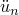加速度分量（）。
.fil: 否    .odb Field: 否    .odb History: 是
**AR*n***

旋转加速度分量（）。
.fil: 否    .odb Field: 否    .odb History: 是
**POR**

节点处的声压。
.fil: 是    .odb Field: 是    .odb History: 是
**PABS**

节点处的声绝对压力。
.fil: 是    .odb Field: 是    .odb History: 是
**NT**

节点处的所有温度值。仅适用于耦合热应力分析。
.fil: 是    .odb Field: 是    .odb History: 是
**NT*n***

节点处温度自由度*n*（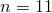）。仅适用于耦合热应力分析。
.fil: 否    .odb Field: 否    .odb History: 是
**RF**

反作用力和弯矩分量。

结果文件和场型输出：平移和旋转。
历史型输出：仅平移。旋转结果应按分量请求。
.fil: 是    .odb Field: 是    .odb History: 是
**RT**

反作用力分量。
.fil: 否    .odb Field: 是    .odb History: 是
**RFMAG**

反作用力的大小。
.fil: 否    .odb Field: 否    .odb History: 是
**RM**

反作用弯矩分量。
.fil: 否    .odb Field: 是    .odb History: 是
**RF*n***

反作用力第*n*分量（）（与规定位移共轭）。
.fil: 否    .odb Field: 否    .odb History: 是
**RFL**

所有反应通量值。仅适用于耦合热应力分析。
.fil: 是    .odb Field: 是    .odb History: 是
**RFL*n***

节点处反应通量值*n*（）。仅适用于耦合热应力分析。
.fil: 否    .odb Field: 是    .odb History: 是
**RM*n***

反作用弯矩第*n*分量（）（与规定旋转共轭）。
.fil: 否    .odb Field: 否    .odb History: 是
**CF**

点载荷和集中弯矩的所有分量。
.fil: 否    .odb Field: 是    .odb History: 是
**CF*n***

点载荷第*n*分量（）。
.fil: 否    .odb Field: 否    .odb History: 是
**CM*n***

点弯矩第*n*分量（）。
.fil: 否    .odb Field: 否    .odb History: 是
**NVF**

节点体积分数。
.fil: 否    .odb Field: 是    .odb History: 否
**STRAINFREE**

初始位置的无应变调整（调整后的位置减去未调整的位置）。仅在零时刻的原始场输出帧写入输出数据库（`.odb`）文件。
.fil: 否    .odb Field: 是    .odb History: 否
**TIEDSTATUS**

约束从属节点的状态（如果从属节点未约束，则状态为2；如果从属节点被约束，则状态为1；对于不参与约束的节点，状态为0）。
.fil: 否    .odb Field: 是    .odb History: 否
**TIEADJUST**

约束从属节点的位置调整向量分量。仅在零时刻的原始场输出帧写入输出数据库（`.odb`）文件。
.fil: 否    .odb Field: 是    .odb History: 否

#### 流体空腔变量

**PCAV**

流体空腔表压。
.fil: 是    .odb Field: 否    .odb History: 是
**CVOL**

流体空腔体积。
.fil: 是    .odb Field: 否    .odb History: 是
**CTEMP**

在绝热条件下使用的理想气体模型的流体空腔温度。
.fil: 否    .odb Field: 否    .odb History: 是
**CSAREA**

流体空腔表面积。
.fil: 否    .odb Field: 否    .odb History: 是
**CLAREA**

流体空腔未阻塞泄漏面积。
.fil: 否    .odb Field: 否    .odb History: 是
**CBLARAT**

阻塞泄漏面积与未阻塞泄漏面积的比值。
.fil: 否    .odb Field: 否    .odb History: 是
**CMASS**

包含在流体空腔中的流体质量。
.fil: 否    .odb Field: 否    .odb History: 是
**APCAV**

多个流体空腔的平均表压。
.fil: 否    .odb Field: 否    .odb History: 是
**TCVOL**

多个流体空腔的总体积。
.fil: 否    .odb Field: 否    .odb History: 是
**ACTEMP**

在绝热条件下使用的理想气体模型多个流体空腔的平均流体空腔温度。
.fil: 否    .odb Field: 否    .odb History: 是
**TCSAREA**

多个流体空腔的总表面积。
.fil: 否    .odb Field: 否    .odb History: 是
**TCMASS**

包含在多个流体空腔中的流体总质量。
.fil: 否    .odb Field: 否    .odb History: 是
**CMF**

包含在流体空腔中的流体物种的分子质量分数。
.fil: 否    .odb Field: 否    .odb History: 是
**CMFL**

流出流体空腔的质量流率。
.fil: 否    .odb Field: 否    .odb History: 是
**CMFLT**

流出流体空腔的累积质量流。
.fil: 否    .odb Field: 否    .odb History: 是
**CEFL**

流出流体空腔的热能量流率。
.fil: 否    .odb Field: 否    .odb History: 是
**CEFLT**

流出流体空腔的累积热能量流。
.fil: 否    .odb Field: 否    .odb History: 是
**MINFL**

流入流体空腔的充气机质量流率。
.fil: 否    .odb Field: 否    .odb History: 是
**MINFLT**

流入流体空腔的累积充气机质量流。
.fil: 否    .odb Field: 否    .odb History: 是
**TINFL**

充气机温度。
.fil: 否    .odb Field: 否    .odb History: 是

### 表面变量

您可以请求表面变量输出到输出数据库文件（参见["Abaqus/Standard和Abaqus/Explicit的表面输出" in "输出到输出数据库，" 第4.1.3节](pt02ch04s01aus40.md#usb-out-odboutput-surface)）；有关这些变量的更多信息，请参见["在Abaqus/Explicit中定义一般接触相互作用，" 第36.4.1节](pt09ch36s04aus155.md)；["在Abaqus/Explicit中定义接触对，" 第36.5.1节](pt09ch36s05aus160.md)；和["热接触属性，" 第37.2.1节](pt09ch37s02aus174.md)。

#### 力学分析——节点量

**CFORCE**

接触正力（CNORMF）和摩擦剪切力（CSHEARF）。
.fil: 否    .odb Field: 是    .odb History: 否
**CSTRESS**

接触压力（CPRESS）和摩擦剪切应力（CSHEAR）。CSHEAR不适用于一般接触分析。
.fil: 否    .odb Field: 是    .odb History: 否
**CTHICK**

一般接触或接触对中的接触厚度。
.fil: 否    .odb Field: 是    .odb History: 否
**CSMAXSCRT**

一般接触中内聚表面的最大应力基损坏起始准则。
.fil: 否    .odb Field: 是    .odb History: 否
**CSQUADSCRT**

一般接触中内聚表面的二次应力基损坏起始准则。
.fil: 否    .odb Field: 是    .odb History: 否
**CSMAXUCRT**

一般接触中内聚表面的最大分离基损坏起始准则。
.fil: 否    .odb Field: 是    .odb History: 否
**CSQUADUCRT**

一般接触中内聚表面的二次分离基损坏起始准则。
.fil: 否    .odb Field: 是    .odb History: 否
**CSDMG**

一般接触中内聚表面的损坏变量。
.fil: 否    .odb Field: 是    .odb History: 否
**FSLIP**

从属节点在接触过程中的接触滑移路径长度（FSLIPEQ），在某些情况下（参见["在Abaqus/Explicit中定义接触对，" 第36.5.1节](pt09ch36s05aus160.md)）为局部切向方向（FSLIP1和FSLIP2）中净接触滑移的分量。当从属节点未接触时，这些变量保持不变。
.fil: 否    .odb Field: 是    .odb History: 否
**FSLIPR**

从属节点在接触过程中的接触滑移率大小（FSLIPR），在某些情况下（参见["在Abaqus/Explicit中定义接触对，" 第36.5.1节](pt09ch36s05aus160.md)）为局部切向方向（FSLIPR1和FSLIPR2）中的接触滑移率分量。当从属节点未接触时，这些变量设为零。
.fil: 否    .odb Field: 是    .odb History: 否
**BONDSTAT**

点焊粘结状态。
.fil: 否    .odb Field: 否    .odb History: 是
**BONDLOAD**

点焊粘结载荷。
.fil: 否    .odb Field: 否    .odb History: 是

#### 裂纹粘结失效量

**DBT**

粘结失效发生的时间。
.fil: 否    .odb Field: 是    .odb History: 否
**DBS**

失效粘结中剩余应力的所有分量。
.fil: 否    .odb Field: 是    .odb History: 否
**DBSF**

粘结失效时保留的应力分数。
.fil: 否    .odb Field: 是    .odb History: 否
**BDSTAT**

粘结状态（如果粘结则为1.0，如果未粘结则为0.0）。
.fil: 否    .odb Field: 是    .odb History: 否
**OPENBC**

满足断裂准则时裂纹后方的相对位移。
.fil: 否    .odb Field: 是    .odb History: 否
**CRSTS**

失效时临界应力的所有分量。
.fil: 否    .odb Field: 是    .odb History: 否
**ENRRT**

应变能释放率的所有分量。
.fil: 否    .odb Field: 是    .odb History: 否
**EFENRRTR**

有效能量释放率比。
.fil: 否    .odb Field: 是    .odb History: 否

#### 力学分析——整体表面量

**CFN**

由于接触压力产生的总力（CFN*n*，*n* = 1, 2, 3）。
.fil: 否    .odb Field: 否    .odb History: 是
**CFNM**

由于接触压力产生的总力的大小。
.fil: 否    .odb Field: 否    .odb History: 是
**CFS**

由于摩擦应力产生的总力（CFS*n*，*n* = 1, 2, 3）。
.fil: 否    .odb Field: 否    .odb History: 是
**CFSM**

由于摩擦应力产生的总力的大小。
.fil: 否    .odb Field: 否    .odb History: 是
**CFT**

由于接触压力和摩擦应力产生的总力（CFT*n*，*n* = 1, 2, 3）。
.fil: 否    .odb Field: 否    .odb History: 是
**CFTM**

由于接触压力和摩擦应力产生的总力的大小。
.fil: 否    .odb Field: 否    .odb History: 是
**CMN**

关于原点由于接触压力产生的总弯矩（CMN*n*，*n* = 1, 2, 3）。
.fil: 否    .odb Field: 否    .odb History: 是
**CMNM**

关于原点由于接触压力产生的总弯矩的大小。
.fil: 否    .odb Field: 否    .odb History: 是
**CMS**

关于原点由于摩擦应力产生的总弯矩（CMS*n*，*n* = 1, 2, 3）。
.fil: 否    .odb Field: 否    .odb History: 是
**CMSM**

关于原点由于摩擦应力产生的总弯矩的大小。
.fil: 否    .odb Field: 否    .odb History: 是
**CMT**

关于原点由于接触压力和摩擦应力产生的总弯矩（CMT*n*，*n* = 1, 2, 3）。
.fil: 否    .odb Field: 否    .odb History: 是
**CMTM**

关于原点由于接触压力和摩擦应力产生的总弯矩的大小。
.fil: 否    .odb Field: 否    .odb History: 是
**CAREA**

接触的总面积。
.fil: 否    .odb Field: 否    .odb History: 是
**XN**

由于接触压力产生的总力的中心（XN*n*，*n* = 1, 2, 3）。
.fil: 否    .odb Field: 否    .odb History: 是
**XS**

由于摩擦应力产生的总力的中心（XS*n*，*n* = 1, 2, 3）。
.fil: 否    .odb Field: 否    .odb History: 是
**XT**

由于接触压力和摩擦应力产生的总力的中心（XT*n*，*n* = 1, 2, 3）。
.fil: 否    .odb Field: 否    .odb History: 是

#### 完全耦合温度-位移分析

**HFL**

离开表面的每单位面积热通量。
.fil: 否    .odb Field: 是    .odb History: 否
**HFLA**

HFL乘以节点面积。
.fil: 否    .odb Field: 是    .odb History: 否
**HTL**

时间积分的HFL。
.fil: 否    .odb Field: 是    .odb History: 否
**HTLA**

HTL乘以节点面积。
.fil: 否    .odb Field: 是    .odb History: 否
**SFDR**

由于摩擦耗散每单位面积的熱通量。
.fil: 否    .odb Field: 是    .odb History: 否
**SFDRA**

SFDR乘以节点面积。
.fil: 否    .odb Field: 是    .odb History: 否
**SFDRT**

时间积分的SFDR。
.fil: 否    .odb Field: 是    .odb History: 否
**SFDRTA**

SFDRT乘以节点面积。
.fil: 否    .odb Field: 是    .odb History: 否

### 积分变量

您可以请求积分变量输出到输出数据库（参见["Abaqus/Explicit中的积分输出" in "输出到输出数据库，" 第4.1.3节](pt02ch04s01aus40.md#usb-out-odboutput-integrated)）。输出量通过在表面上或元素集合上积分来计算，该表面或元素集合可直接在积分输出请求中指定，或通过关联积分输出截面定义（参见["积分输出截面定义，" 第2.5.1节](pt01ch02s05aus23.md)）或元素集合定义与积分输出请求。

当积分输出请求未关联积分输出截面定义时，向量输出变量的分量是相对于全局坐标系给出的。当积分输出截面与积分输出请求关联并且为积分输出截面定义了局部坐标系时，分量在局部系统中给出。如果截面定义中关联了具有旋转自由度的参考节点，局部系统将随变形旋转。

**SOAREA**

投影到平均表面法向量的垂直平面上的表面面积。
.fil: 否    .odb Field: 否    .odb History: 是
**SOF**

通过表面传递的总力。
.fil: 否    .odb Field: 否    .odb History: 是
**SOM**

通过表面传递的总弯矩。如果在积分输出截面上指定了参考节点并且与积分输出请求关联，则弯矩关于参考节点的当前位置计算。如果积分输出请求未关联截面定义，或者关联的截面定义中没有定义参考节点，则弯矩关于全局原点计算。
.fil: 否    .odb Field: 否    .odb History: 是
**MASS**

元素集合的总质量。
.fil: 否    .odb Field: 否    .odb History: 是
**DMASS**

由于质量缩放导致的元素集合质量变化百分比。
.fil: 否    .odb Field: 否    .odb History: 是
**UCOM**

元素集合的等效刚体平移位移。
.fil: 否    .odb Field: 否    .odb History: 是
**VCOM**

元素集合的等效刚体平移速度。
.fil: 否    .odb Field: 否    .odb History: 是
**ACOM**

元素集合的等效刚体平移加速度。
.fil: 否    .odb Field: 否    .odb History: 是
**COORDCOM**

元素集合质心的坐标。
.fil: 否    .odb Field: 否    .odb History: 是
**MASSEUL**

元素集合中每个Eulerian材料实例的总质量。
.fil: 否    .odb Field: 否    .odb History: 是
**VOLEUL**

元素集合中每个Eulerian材料实例的总体积。
.fil: 否    .odb Field: 否    .odb History: 是

### 总能量输出

您可以请求总能量变量输出到结果或输出数据库文件（参见["总能量输出" in "输出到数据和结果文件，" 第4.1.2节](pt02ch04s01aus39.md#usb-out-oprintfile-energy)，和["总能量输出" in "输出到输出数据库，" 第4.1.3节](pt02ch04s01aus40.md#usb-out-odboutput-energy)）。请求总能量输出时，所有这些变量都会被写入。可以向输出数据库请求部分模型以及整个模型的能量历史总量。

**ALLAE**

与用于消除奇异模式的约束相关的"人工"应变能量（如小时glass控制），以及用于使钻孔旋转跟随壳单元面内旋转的约束相关的能量。
.fil: 是    .odb Field: 否    .odb History: 是
**ALLCD**

由于粘弹性而消耗的能量。（不支持具有线性粘弹性的超弹性和超泡沫材料模型。）
.fil: 是    .odb Field: 否    .odb History: 是
**ALLFD**

通过摩擦效应消耗的总能量。（仅适用于整个模型。）
.fil: 是    .odb Field: 否    .odb History: 是
**ALLIE**

总应变能量。（ALLIE=ALLSE + ALLPD + ALLCD + ALLAE + ALLDMD+ ALLDC+ ALLFC。）
.fil: 是    .odb Field: 否    .odb History: 是
**ALLKE**

动能。
.fil: 是    .odb Field: 否    .odb History: 是
**ALLPD**

由于与速率无关和与速率相关的塑性变形而消耗的能量。
.fil: 是    .odb Field: 否    .odb History: 是
**ALLSE**

可恢复应变能量。
.fil: 是    .odb Field: 否    .odb History: 是
**ALLVD**

由于粘性效应而消耗的能量。
.fil: 是    .odb Field: 否    .odb History: 是
**ALLWK**

外部功。（仅适用于整个模型。）
.fil: 是    .odb Field: 否    .odb History: 是
**ALLIHE**

内热能量。
.fil: 是    .odb Field: 否    .odb History: 是
**ALLHF**

通过外部通量的外部热能量。
.fil: 是    .odb Field: 否    .odb History: 是
**ALLDMD**

由于损坏而消耗的能量。
.fil: 是    .odb Field: 否    .odb History: 是
**ALLDC**

由于失真控制而消耗的能量。
.fil: 是    .odb Field: 否    .odb History: 是
**ALLFC**

流体空腔能量，定义为所有流体空腔所做功的负值。（仅适用于整个模型。）
.fil: 否    .odb Field: 否    .odb History: 是
**ALLPW**

接触惩罚所做的功，包括一般接触和惩罚/运动接触对。（仅适用于整个模型。）
.fil: 否    .odb Field: 否    .odb History: 是
**ALLCW**

约束惩罚所做的功。（仅适用于整个模型。）
.fil: 否    .odb Field: 否    .odb History: 是
**ALLMW**

在质量缩放中添加的质量推进中所做的功。（仅适用于整个模型。）
.fil: 否    .odb Field: 否    .odb History: 是
**ETOTAL**

能量平衡定义为：ALLKE + ALLIE + ALLVD + ALLFD + ALLIHE + ALLWK + ALLPW + ALLCW + ALLMW + ALLHF。（仅适用于整个模型。）
.fil: 是    .odb Field: 否    .odb History: 是

### 时间增量和质量输出

当请求任何结果文件输出时，DT和DMASS变量始终被写入（参见["输出到Abaqus/Explicit结果文件" in "输出到数据和结果文件，" 第4.1.2节](pt02ch04s01aus39.md#usb-out-oprintfile-results-exp)）。您可以请求将时间增量和稳态检测变量SSPEEQ、SSSPRD、SSFORC和SSTORQ输出到输出数据库（参见["Abaqus/Explicit中的时间增量输出" in "输出到输出数据库，" 第4.1.3节](pt02ch04s01aus40.md#usb-out-odboutput-incrementation)）。

**DT**

时间增量。
.fil: 是    .odb Field: 否    .odb History: 是
**DMASS**

由于质量缩放导致的模型质量变化百分比。
.fil: 是    .odb Field: 否    .odb History: 是
**SSPEEQ**

稳态等效塑性应变范数。
.fil: 否    .odb Field: 否    .odb History: 是
**SSPEEQ*n***

稳态等效塑性应变范数*n*。
.fil: 否    .odb Field: 否    .odb History: 是
**SSSPRD**

稳态扩展应变范数。
.fil: 否    .odb Field: 否    .odb History: 是
**SSSPRD*n***

稳态扩展范数*n*。
.fil: 否    .odb Field: 否    .odb History: 是
**SSFORC**

稳态力范数。
.fil: 否    .odb Field: 否    .odb History: 是
**SSFORC*n***

稳态力范数*n*。
.fil: 否    .odb Field: 否    .odb History: 是
**SSTORQ**

稳态扭矩范数。
.fil: 否    .odb Field: 否    .odb History: 是
**SSTORQ*n***

稳态扭矩范数*n*。
.fil: 否    .odb Field: 否    .odb History: 是
