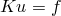
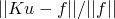
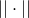

# 6.1.6 迭代线性方程求解器

**产品：** Abaqus/Standard  Abaqus/CAE

##### **参考文献**

- [*STEP*](../key/key-link.md#usb-kws-hstep)
- [*SOLVER CONTROLS*](../key/key-link.md#usb-kws-hsolvercontrols)
- ["Abaqus/Standard中的并行执行，" 第3.5.2节](pt01ch03s05aus33.md)
- ["自定义求解器控制，" Abaqus/CAE User's Guide第14.15.2节](../usi/usi-link.md#usi-sim-other-solvercontrols)

### 概述

Abaqus/Standard中的迭代线性方程求解器：
- 可用于线性和非线性静态、准静态、热传递、地力和耦合孔隙流体扩散和应力分析求解过程；
- 应仅用于大型、良好条件的模型，对于这些模型，直接稀疏求解器（请参见["直接线性方程求解器，" 第6.1.5节"](pt03ch06s01aus46.md)）需要过多（禁止性）的浮点运算；
- 对于大型、良好条件的块状结构，可能比直接方程求解器快得多；
- 完全在核心中运行，比直接稀疏求解器使用更少的存储（内存和磁盘组合）；
- 只能用于三维模型；
- 必须是分析中调用的唯一求解器（即，您不能在一个步骤中使用迭代求解器而在另一个步骤中使用直接求解器）；
- 不能与具有自适应阻尼因子的自动稳定一起使用（请参见["求解非线性问题，" 第7.1.1节中的"自适应自动稳定方案"](pt03ch07s01aus49.md#usb-anl-anonlineareqns-stabilize-adaptive)）；
- 如果需要稳定，可以使用恒定阻尼因子的自动稳定（请参见["求解非线性问题，" 第7.1.1节中的"使用恒定阻尼因子的静态问题自动稳定"](pt03ch07s01aus49.md#usb-anl-anonlineareqns-stabilize)）；
- 如果方程组包括Lagrange乘数自由度（即与分布耦合、混合单元、连接器单元、具有直接强制的接触相关），则不能使用；以及
- 如果用于包含密集线性约束（例如，方程、运动耦合、MPC）的模型，这些约束每个主自由度消除大量从自由度，和/或消除一些从自由度而有利于大量主自由度，则会降低性能。

### 迭代求解器基础

Abaqus/Standard中的迭代求解器可用于求解线性方程组的解，可在线性或非线性静态、准静态、地力、孔隙流体扩散或热传递分析步骤中调用。由于该技术是迭代的，不能保证对给定线性方程组的收敛解。在迭代求解器未能收敛到解的情况下，可能需要修改模型以改善收敛行为。在某些情况下，唯一的选择可能是使用直接求解器获得解。当迭代求解器收敛时，此解的精度取决于所使用的相对容差；默认容差对大多数目的是足够准确的。但是，对特定分析的容差调整可能会提高整体模拟性能。此外，迭代求解器相对于直接稀疏求解器的性能高度依赖于模型几何，有利于块状类型结构（即看起来更像立方体而不是板的模型），具有高程度的网格连通性和相对较低程度的稀疏性。这些类型的模型通常对直接稀疏求解器要求最多的计算和存储资源。具有较低连通性程度（通常说具有较高稀疏性）的模型（如薄壳结构）更适合直接稀疏求解器（请参见["直接线性方程求解器，" 第6.1.5节"](pt03ch06s01aus46.md)）。

| **输入文件用法：** | 使用以下选项调用迭代求解器： |
| --- | --- |
|  | ``` [*STEP](../key/key-link.md#usb-kws-hstep), SOLVER=ITERATIVE ``` |

| **Abaqus/CAE用法：** | 步骤模块：步骤编辑器：**其他**：**方法：迭代** |
| --- | --- |

#### 迭代求解技术

Abaqus/Standard中的迭代求解技术基于使用预条件器的Krylov方法。此求解器使用以下一般策略：

1. Krylov方法求解器在由有限元方法生成的方程组上迭代，同时在每次迭代时应用预条件器。
2. 预条件器在每个线性系统求解开始时仅计算一次，用于加速Krylov方法的收敛。
3. 在并行中，迭代求解过程的所有组件（包括矩阵组装、预条件器设置和使用Krylov方法的实际求解）均在每个核心上本地处理，所有必要的通信通过基于MPI的实现处理。

上述过程在Abaqus/Standard内部完全执行，无需用户干预。

#### 线性方程组的收敛

为了生成线性代数方程组（用矩阵方程表示为，其中*K*是全局刚度矩阵，*f*是载荷向量，*u*是所需的位移解）的解，执行一系列Krylov求解器迭代，由此近似解在每次迭代时更接近精确解。近似解的误差通过线性系统的相对残差来测量，定义为，其中是范数。"收敛"一词用于描述此过程，当相对残差低于指定容差时，近似解被认为是收敛的。默认情况下，此容差对于一般非线性过程为10^3。线性扰动过程具有10^6的默认容差。虽然对于一般非线性过程，默认容差可能看起来较松，但重要的是要注意，线性求解器收敛容差与用于确定分析增量是否收敛的非线性收敛过程（即Newton-Raphson方法）容差无关。后者无论线性方程求解器的选择如何（迭代或直接）都是相同的。

近似解收敛的速度与原始方程组的条件直接相关。良好条件的线性系统将比病态系统收敛得更快。如果残差在最大迭代次数内未收敛到容差，则称迭代求解器遇到不收敛，Abaqus/Standard发出警告消息。但是，分析将继续运行，在某些情况下，增量内的Newton-Raphson迭代可能继续收敛。

#### 设置迭代线性求解器的控制

Abaqus/Standard中提供的默认控制通常就足够了。但是，提供了覆盖默认相对收敛容差和最大求解器迭代次数的方法。

##### 重置求解器控制

您可以指定将求解器控制重置为其默认值。

| **输入文件用法：** | ``` [*SOLVER CONTROLS](../key/key-link.md#usb-kws-hsolvercontrols), RESET ``` |
| --- | --- |

| **Abaqus/CAE用法：** | 步骤模块：****其他****求解器控制****编辑****：**将所有参数重置为系统定义的默认值** |
| --- | --- |

##### 指定相对收敛容差

默认情况下，对于线性扰动以外的过程，此容差为10^3。线性扰动过程具有10^6的默认容差。对于非线性问题，线性解的精度会影响Newton方法的收敛性。在某些情况下，可能需要手动指定迭代求解器相对容差以改善Newton-Raphson方法的收敛性或提高性能。

| **输入文件用法：** | ``` [*SOLVER CONTROLS](../key/key-link.md#usb-kws-hsolvercontrols) *相对收敛容差* ``` |
| --- | --- |

| **Abaqus/CAE用法：** | 步骤模块：****其他****求解器控制****编辑****：**指定**：**相对容差：指定：*相对收敛容差* |
| --- | --- |

##### 指定最大求解器迭代次数

在极少数情况下，线性求解器可能需要超过默认迭代次数才能收敛到所需的精度水平。在这种情况下，您可以增加迭代求解器允许的最大迭代次数（默认值为300）。

| **输入文件用法：** | ``` [*SOLVER CONTROLS](../key/key-link.md#usb-kws-hsolvercontrols) , *最大求解器迭代次数* ``` |
| --- | --- |

| **Abaqus/CAE用法：** | 步骤模块：****其他****求解器控制****编辑****：**指定**：**最大迭代次数：指定：*最大求解器迭代次数* |
| --- | --- |

##### 为土工和地力分析指定不完全因子分解填充级别

用于土工和地力分析的预条件器使用基于因子分解的方法，也称为ILU(k)。在极少数情况下，线性求解器可能需要超过默认的不完全因子分解填充级别数才能收敛到所需的精度水平。矩阵的不完全LU分解是LU分解的稀疏近似。LU分解通常通过添加许多非零条目来改变刚度矩阵的非零结构；不完全LU分解通过限制因子分解过程中引入的非零条目数来近似完全因子分解的矩阵。默认情况下，迭代求解器使用的ILU因子分解填充级别为0，不添加非零条目。您可以增加填充级别（最大值为3），以允许基于刚度矩阵的连通性添加非零条目，并获得对完全因子分解的更好近似，但计算成本增加。

| **输入文件用法：** | ``` [*SOLVER CONTROLS](../key/key-link.md#usb-kws-hsolvercontrols) , , *ILU因子分解填充级别* ``` |
| --- | --- |

| **Abaqus/CAE用法：** | 步骤模块：****其他****求解器控制****编辑****：**指定**：**ILU因子分解填充级别：指定：*ILU因子分解填充级别* |
| --- | --- |

### 决定是否使用迭代求解器

在决定在Abaqus/Standard中使用迭代求解器之前，必须仔细权衡许多因素，例如单元类型、接触和约束方程、材料和几何非线性以及材料属性，所有这些都可能影响稳健性和性能。在模型病态的情况下，迭代求解器可能收敛非常缓慢或无法收敛。例如，如果许多单元具有较差的纵横比，则可能发生这种情况。

除了稳健性问题（主要与收敛速度或停滞有关），迭代求解器预计仅对块状模型（即使模型条件良好）表现优于直接稀疏求解器，这些模型需要非常大量的浮点运算进行因子分解。通常，对于条件良好的实体模型，全局模型中的自由度数量必须大于一百万，迭代求解器才能在运行时间方面与直接求解器相当。

#### 单元类型和模型几何

将影响迭代求解器性能的最基本建模问题是模型几何，这在决定迭代求解器是否适合特定模型时必须仔细考虑。一般来说，本质上呈块状（即看起来更像立方体而不是板）并由实体单元主导的模型将与迭代求解器表现良好。虽然支持梁和壳等结构单元，但具有结构单元的模型不会表现最佳；应改为对这些模型使用直接稀疏求解器。常见的建模技术（如用薄层膜单元包覆实体单元以恢复边界上的准确应力，或用弱弹簧固定刚体运动）可能不适用于迭代求解器。使用局部变换坐标系将载荷或边界条件施加到大型节点集也可能导致收敛困难。所有这些技术都可能导致极慢的收敛或停滞。

可能影响迭代求解器收敛的另一个因素是单元的质量。包含许多具有高纵横比的形状不良单元的块状模型（如发动机缸体）也可能导致迭代求解器收敛不良。在评估迭代求解器性能时，查找有关形状不良单元的警告消息是一个好主意。

目前，混合单元和连接器不支持迭代求解器。

使用带迭代求解器的粘性单元可能导致不收敛。

#### 约束方程

虽然迭代求解器可用于包含约束方程的模型（如多点约束、基于表面的绑定约束、运动耦合等），但在以下情况下可能存在某些限制：
- 包含数千个以上自由度的线性或非线性多点约束；
- 包含共享主自由度的数千个以上线性或非线性多点约束；
- 包含数千个以上自由度的单元刚体定义；或
- 包含数千个以上从自由度运动耦合约束。

如果任何这些条件适用于模型，线性方程组的求解成本将随此类约束的数量线性增长。此外，通常建议收紧迭代求解器容差，并在非线性分析中增加线性迭代求解器的最大迭代次数以实现收敛。因此，建议尽可能将这些约束保持在最少；否则，增加的成本可能抵消使用迭代求解器带来的性能提升。

分布式耦合不支持迭代求解器。

#### 接触

由于接触是一种非线性分析形式，因此在为迭代求解器选择收敛容差时必须特别小心（请参见下面的["非线性分析"](pt03ch06s01aus47.md#usb-anl-aitrsolveroverview-nonlin)）。因此，建议在继续非线性问题之前，通过静态扰动分析运行模型。这将展示迭代求解器在特定模型几何下的表现，而不会增加非线性收敛的困难。

迭代求解器仅适用于具有合理惩罚刚度的基于惩罚的接触公式。如果使用直接强制接触（即Lagrange乘数方法）或具有极高惩罚刚度的惩罚接触，Abaqus/Standard可能无法收敛。迭代求解器不支持孔隙流体接触，无论使用何种接触公式。

#### 材料属性

在决定使用迭代求解器时，应考虑模型中材料属性的变化。具有材料行为非常大不连续性（许多数量级）的模型很可能收敛缓慢并可能停滞。

#### 非线性分析

迭代求解器可用于求解在Newton过程每次迭代时出现的线性代数方程组。但是，非线性问题的收敛将受到迭代线性求解器收敛的影响。实际影响取决于特定模型和存在的非线性类型。在某些情况下，默认迭代求解器容差10^3足以维持Newton方法的收敛；在其他情况下，必须使用更小的线性求解器容差（例如，10^6）。

如果使用迭代求解器的非线性分析未能收敛，通常很难确定这是由于迭代求解器的近似线性方程解还是Newton过程本身未能收敛。如果发生非线性收敛问题，可以使用直接求解器——给定问题由于求解成本可以使用直接求解器解决——来消除近似线性解作为问题的可能来源。
