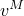
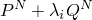
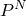

# 6.2.3 特征值屈曲预测

**产品：** Abaqus/Standard  Abaqus/CAE

##### **参考文献**

- ["定义分析，" 第6.1.2节](pt03ch06s01abo05.md)
- ["一般和线性扰动过程，" 第6.1.3节](pt03ch06s01aus44.md)
- ["静态应力分析过程：概述，" 第6.2.1节](pt03ch06s02abo06.md)
- [*BUCKLE*](../key/key-link.md#usb-kws-hbuckle)
- ["配置屈曲过程" in "配置线性扰动分析过程，" Abaqus/CAE User's Guide第14.11.2节](../usi/usi-link.md#usi-sim-configure-buckle)
- ["创建和修改规定条件，" Abaqus/CAE User's Guide第16.4节](../usi/usi-link.md#usi-lbi-edit-editors)

### 概述

特征值屈曲分析：
- 通常用于估计"刚性"结构的临界（分叉）载荷；
- 是一种线性扰动过程；
- 可以是未加载结构分析的第一步，也可以在结构预加载后进行——如果结构已被预加载，则计算预加载状态的屈曲载荷；
- 可用于研究结构对缺陷的敏感性；
- 仅适用于对称矩阵（因此，与随动力相关的载荷刚度等非对称刚度贡献被对称化）；以及
- 不能用于包含子结构的模型。

### 一般特征值屈曲

在特征值屈曲问题中，我们寻找使模型刚度矩阵变为奇异的载荷，使得问题


具有非平凡解。是施加载荷时的切线刚度矩阵，是非平凡位移解。施加的载荷可以包括压力、集中力、非零规定位移和/或热载荷。

特征值屈曲通常用于估计刚性结构（经典特征值屈曲）的临界屈曲载荷。刚性结构主要通过轴向或膜作用而不是弯曲作用来承受设计载荷。它们的响应在屈曲之前通常涉及非常小的变形。刚性结构的一个简单例子是Euler柱，它对压缩轴向载荷的响应非常刚性，直到达到临界载荷，然后突然弯曲并表现出低得多的刚度。然而，即使结构在坍塌之前具有非线性响应，一般特征值屈曲分析也可以提供坍塌模态形状的有用估计。

#### 基础状态

屈曲载荷是相对于结构的基础状态计算的。如果特征值屈曲过程是分析的第一步，则初始条件形成基础状态；否则，基础状态是最后一个一般分析步骤结束时模型的当前状态（请参见["一般和线性扰动过程，" 第6.1.3节"](pt03ch06s01aus44.md)）。因此，基础状态可以包括预载荷（"死"载荷），。在经典特征值屈曲问题中，预载荷通常为零。

如果在特征值屈曲分析之前的一般分析步骤中包含了几何非线性（请参见["一般和线性扰动过程，" 第6.1.3节"](pt03ch06s01aus44.md)），则基础状态几何是最后一个一般分析步骤结束时的变形几何。如果省略了几何非线性，则基础状态几何是物体的原始构型。

### 特征值问题

在特征值屈曲预测步骤中定义了增量载荷模式，。此载荷的大小不重要；它将由特征值问题中找到的载荷乘数，缩放：


其中


是基础状态对应的刚度矩阵，包括预载荷的影响，（如果有的话）；


是由于增量载荷模式，

是特征值；


是屈曲模态形状（特征向量）；

*M*和*N*

指整个模型的自由度*M*和*N*；以及

*i*

指第*i*个屈曲模态。

则临界屈曲载荷为。通常，我们关心的是的最低值。预载荷模式，![](../graphics/usb_eqn00430.gif，和扰动载荷模式，![](../graphics/usb_eqn00431.gif可能不同。例如，![](../graphics/usb_eqn00430.gif可能是由温度变化引起的热载荷，而![](../graphics/usb_eqn00431.gif是由施加压力引起的。

屈曲模态形状，![](../graphics/usb_eqn00428.gif，是归一化向量，不表示临界载荷下实际变形幅度。它们被归一化，使得最大位移分量为1.0。如果所有位移分量都为零，则最大旋转分量归一化为1.0。这些屈曲模态形状通常是特征值分析最有用的结果，因为它们预测了结构的可能失效模式。

Abaqus/Standard只能提取对称矩阵的特征值和特征向量；因此，![](../graphics/usb_eqn00426.gif和![](../graphics/usb_eqn00427.gif被对称化。如果矩阵具有显著的非对称部分，特征问题可能与您预期求解的不完全相同。

#### 选择特征值提取方法

Abaqus/Standard提供Lanczos和子空间迭代特征值提取方法。当需要大量自由度系统的许多特征模态时，Lanczos方法通常更快。当只需要少数（少于20个）特征模态时，子空间迭代方法可能更快。

默认情况下，使用子空间迭代特征求解器。子空间迭代和Lanczos求解器可用于同一分析中的不同步骤；不要求所有适当步骤使用相同的特征求解器。

对于两种特征求解器，您可以指定所需的特征值数量；Abaqus/Standard将为子空间迭代过程选择合适数量的向量，或为Lanczos方法选择合适的块大小（尽管如果需要，您可以覆盖此选择）。显著高估实际特征值数量会产生非常大的文件。如果低估了实际特征值数量，Abaqus/Standard将发出相应的警告消息。

一般来说，Lanczos方法的块大小应尽可能大，即最大特征值多重性（具有相同特征值的最大模态数）。不建议使用大于10的块大小。如果请求的特征值数量为*n*，默认块大小为（7，*n*）中的最小值。块Lanczos步数通常由Abaqus/Standard决定，但您可以在定义特征值屈曲预测步骤时更改它。一般来说，如果特定类型的特征问题收敛缓慢，提供更多块Lanczos步将降低分析成本。另一方面，如果您知道特定类型的问题收敛快速，提供更少的块Lanczos步将减少使用的核心内存量。如果请求的特征值数量为*n*，默认值为

| 块大小 | *n* ≤ 10 | *n* > 10 |
| --- | --- | --- |
| 1 | 40 | 70 |
| 2 | 40 | 60 |
| 3 | 30 | 60 |
| ≥ 4 | 30 | 30 |

如果请求子空间迭代技术，您也可以指定感兴趣的最小特征值；Abaqus/Standard将提取特征值，直到提取到请求数量的特征值或提取的最后一个特征值超过感兴趣的最小特征值。

如果请求Lanczos特征求解器，您也可以指定感兴趣的最小和/或最大特征值；Abaqus/Standard将提取特征值，直到在给定范围内提取了请求数量的特征值或提取了给定范围内的所有特征值。

| **输入文件用法：** | 使用以下选项执行使用子空间迭代方法的特征值屈曲分析： |
| --- | --- |
|  | ``` [*BUCKLE](../key/key-link.md#usb-kws-hbuckle), EIGENSOLVER=SUBSPACE（默认）``` 使用以下选项执行使用Lanczos方法的特征值屈曲分析：``` [*BUCKLE](../key/key-link.md#usb-kws-hbuckle), EIGENSOLVER=LANCZOS ``` |

| **Abaqus/CAE用法：** | 步骤模块：**创建步骤**：**线性扰动**：**屈曲**：**特征求解器：Lanczos**或**子空间** |
| --- | --- |

##### 将Lanczos特征求解器应用于屈曲分析的相关限制

Lanczos特征求解器不能用于刚度矩阵不确定的屈曲分析，如以下情况：
- 包含混合单元或连接器单元的模型。
- 包含分布式耦合约束的模型，这些约束直接定义（["耦合约束，" 第35.3.2节"](pt08ch35s03aus133.md)；["壳到实体耦合，" 第35.3.3节"](pt08ch35s03aus134.md)；或["网格无关紧固件，" 第35.3.4节"](pt08ch35s03aus135.md)）或通过分布式耦合单元（DCOUP2D和DCOUP3D）定义。
- 包含接触对或接触单元的模型。
- 已预加载至分叉（屈曲）载荷以上的模型。
- 具有刚体模态的模型。

在这些情况下，Abaqus/Standard将发出错误消息并终止分析。

#### 刚度矩阵的计算顺序和形成

在特征值屈曲预测步骤中，Abaqus/Standard首先执行静态扰动分析以确定由于）。然后形成对应于。

在屈曲步骤的特征值提取部分，形成对应于基础状态几何的刚度矩阵，）。

### 理解负特征值

有时在特征值屈曲分析中会报告负特征值。在大多数情况下，这种负特征值表明如果载荷在相反方向施加，结构将屈曲。一个经典例子是剪切载荷下的板；板在正负施加剪切载荷下将在相同值下屈曲。在可能不希望的情况下也可能发生反向屈曲。例如，在外部压力下的压力容器可能表现出负特征值（内部压力下的屈曲），这是由于加强件的局部屈曲。这种"物理"负屈曲模态通常在显示后很容易理解，并且通常可以通过在屈曲分析之前施加预载荷来避免。

负特征值有时对应于不能容易地从物理行为角度理解的屈曲模态，特别是如果施加了引起显著几何非线性的预载荷。在这种情况下，应执行几何非线性载荷-位移分析（["不稳定坍塌和后屈曲分析，" 第6.2.4节"](pt03ch06s02at03.md)）。

### 在屈曲分析中包含大几何变化

因为屈曲分析通常针对"刚性"结构进行，所以在建立基础状态的平衡时通常不需要包含几何变化的影响。但是，如果基础状态涉及重大几何变化，并且认为此效应重要，可以通过指定应考虑基础状态步骤的几何非线性来包含（请参见["一般和线性扰动过程，" 第6.1.3节"](pt03ch06s01aus44.md)）。在这些情况下，执行几何非线性载荷-位移分析（Riks分析）来确定坍塌载荷更为现实，特别是对于缺陷敏感结构。

虽然可以在预载荷中包含大变形，但特征值屈曲理论依赖于"活"屈曲载荷，中描述。

### 初始条件

可以为特征值屈曲分析指定应力、温度、场变量和依赖于求解的变量等量的初始值。如果屈曲步骤是分析的第一步，这些初始条件形成结构的基础状态。["Abaqus/Standard和Abaqus/Explicit中的初始条件，" 第34.2.1节"](pt07ch34s02aus116.md)描述了所有可用的初始条件。

### 边界条件

边界条件可以施加于任何位移或旋转自由度（1-6），或开口截面梁单元的翘曲自由度7（["Abaqus/Standard和Abaqus/Explicit中的边界条件，" 第34.3.1节"](pt07ch34s03aus118.md)）。特征值屈曲分析之前的 一般分析步骤中的非零规定边界条件可用于预加载结构。在特征值屈曲步骤中规定的非零边界条件将贡献于增量应力，）不能用于在特征值屈曲分析期间改变规定边界条件的大小。

您可以在特征值屈曲预测步骤中定义扰动载荷和屈曲模态边界条件。

| **输入文件用法：** | 使用以下两个选项之一来定义扰动载荷边界条件： |
| --- | --- |
|  | ``` [*BOUNDARY](../key/key-link.md#usb-kws-hboundary) [*BOUNDARY](../key/key-link.md#usb-kws-hboundary), LOAD CASE=1 ``` 使用以下选项定义屈曲模态边界条件：``` [*BOUNDARY](../key/key-link.md#usb-kws-hboundary), LOAD CASE=2, OP=NEW ``` 当您在特征值屈曲预测步骤中定义屈曲模态边界条件时，需要OP=NEW参数；但是，步骤中的扰动载荷边界条件可以使用OP=NEW或OP=MOD。 |

| **Abaqus/CAE用法：** | 载荷模块：**创建边界条件**：选择**机械**作为**类别**，**对称/反对称/encastre**作为**所选步骤的类型**：选择区域：切换**仅应力扰动**以定义扰动载荷边界条件；切换**仅屈曲模态计算**以定义屈曲模态边界条件；切换**应力扰动和屈曲模态计算**以定义两种类型的边界条件 |
| --- | --- |

#### 组合边界条件

屈曲模态形状取决于基础状态中的应力以及屈曲步骤中扰动载荷引起的增量应力。这些应力受每个步骤中使用的边界条件的影响。在一般特征值屈曲分析中，以下类型的边界条件可以影响应力：

1. 基础状态中的边界条件。
2. 用于计算线性扰动应力的边界条件，。这些边界条件将是：
   1. 特征值屈曲步骤中规定的扰动载荷边界条件；或
   2. 如果特征值屈曲步骤中未规定扰动载荷边界条件，则为基础状态边界条件；或
   3. 如果既没有扰动载荷边界条件也没有基础状态边界条件，则为屈曲模态边界条件。
3. 用于特征值提取的边界条件。这些边界条件将是：
   1. 屈曲模态边界条件；或
   2. 如果特征值屈曲步骤中未规定屈曲模态边界条件，则为扰动载荷边界条件；或
   3. 如果特征值屈曲步骤中未使用边界条件定义，则为基础状态边界条件。

[表6.2.3-1](pt03ch06s02at02.md#aeigenbuckling-bc-table)总结了特征值屈曲步骤不同部分中边界条件的使用。当规定屈曲模态边界条件时，*所有*要在特征值提取期间施加的边界条件都必须被规定。

#### 对称结构的屈曲

承受对称载荷的对称结构的屈曲模态形状要么是对称的，要么是反对称的。在这种情况下，通常只对结构的一部分建模然后对每个对称平面执行两次屈曲分析更有效：一次使用对称边界条件，一次使用反对称边界条件。

活载荷模式通常是对称的，因此需要对称边界条件来计算用于形成初始应力刚度矩阵的扰动应力。边界条件必须切换到反对称以获得反对称模态进行特征值提取。["均匀轴向压力下圆柱壳的屈曲，" Abaqus Benchmarks Guide第1.2.3节](../bmk/bmk-link.md#bmk-anl-bucklecylshell)说明了这情况。

如果模型包含多个对称平面，可能需要研究每个对称平面对称和反对称边界条件的所有排列。

**表6.2.3-1** 特征值屈曲分析不同部分中有效的边界条件。

| 用户定义的边界条件 | Abaqus使用的边界条件 |
| --- | --- |
| 基础状态 | 特征值屈曲预测步骤 | 线性扰动 | 特征值提取 |
| B | 0 | B | B |
| 0 | 1 | 1 | 1 |
| 0 | 2 | 2 | 2 |
| B | 1 | 1 | 1 |
| B | 2 | B | 2 |
| 0 | 1, 2 | 1 | 2 |
| B | 1, 2 | 1 | 2 |
| B = 基础状态边界条件；0 = 未规定边界条件 |
| 1 = 扰动载荷边界条件 |
| 2 = 屈曲模态边界条件 |

##### 轴对称结构的非对称屈曲

承受压缩载荷的轴对称结构通常以非轴对称模态坍塌。这些模态不能用纯粹的轴对称建模（如壳单元SAX1和SAX2（["轴对称壳单元库，" 第29.6.9节"](pt06ch29s06ael19.md)）或连续体单元CAX4或CAX8（["轴对称实体单元库，" 第28.1.6节"](pt06ch28s01ael05.md)）所提供的）找到。此类分析必须使用三维壳或连续体单元进行。

### 载荷

可以在特征值屈曲分析中规定以下类型的载荷：
- 集中节点力可以施加于位移自由度（1-6）；请参见["集中载荷，" 第34.4.2节"](pt07ch34s04aus121.md)。
- 分布压力载荷或体积力可以施加；请参见["分布载荷，" 第34.4.3节"](pt07ch34s04aus122.md)。特定单元可用的分布载荷类型在["单元，" 第VI部分](pt06.md)中描述。

载荷刚度对临界屈曲载荷有显著影响；因此，Abaqus/Standard在求解特征值屈曲问题时将考虑预载荷引起的载荷刚度。重要的是结构不应预加载至临界屈曲载荷以上。

在特征值屈曲分析期间施加的任何载荷称为"活"载荷。此增量载荷，中所述。

随动力（如假定随节点旋转旋转的集中载荷或压力载荷）导致非对称载荷刚度。由于Abaqus/Standard只能对对称矩阵执行特征值提取，因此带有随动力的特征值分析可能不会产生正确的结果。

幅值定义不能在特征值屈曲分析期间使用。["施加载荷：概述，" 第34.4.1节"](pt07ch34s04aus120.md)描述了所有可用的载荷。

如前所述，规定边界条件也可用于在特征值屈曲分析中加载结构。

### 预定义场

在特征值屈曲预测步骤中，可以规定节点温度（请参见["预定义场，" 第34.6.1节"](pt07ch34s06aus128.md)）。如果为材料指定了热膨胀系数（["热膨胀，" 第26.1.2节"](pt05ch26s01abm52.md)），则规定温度将在静态扰动分析期间引起热应变，并将产生增量应力，。

### 输出

特征值，中概述。

屈曲模态形状可以在Abaqus/CAE的Visualization模块中绘制。

### 输入文件模板

以下模板描述了一个非常一般的特征值屈曲问题，其中可以根据需要指定尽可能多的特征值屈曲预测步骤。

对称边界条件在Abaqus/Standard输入的模型定义部分规定，因此属于基础状态（请参见["一般和线性扰动过程，" 第6.1.3节"](pt03ch06s01aus44.md)）。在第一个屈曲步骤中，Abaqus/Standard使用基础状态边界条件来求解扰动应力以及特征值提取。

在第二个屈曲步骤中，基础状态、初始应力计算和特征值提取的边界条件都不同。Abaqus/Standard使用规定的对称边界条件来求解扰动应力，但使用规定的反对称边界条件进行特征值提取。

```
[*HEADING](../key/key-link.md#usb-kws-mheading)
…
[*BOUNDARY](../key/key-link.md#usb-kws-hboundary)
*数据行用于规定有助于基础状态的零值边界条件*
**
[*STEP](../key/key-link.md#usb-kws-hstep), NLGEOM
*由于在此（可选）预载荷步骤中使用了NLGEOM参数，载荷刚度项将包含在特征值屈曲步骤中*
[*STATIC](../key/key-link.md#usb-kws-hstatic)
*数据行用于控制增量*
[*BOUNDARY](../key/key-link.md#usb-kws-hboundary)
*数据行用于规定非零边界条件（死载荷）*
[*CLOAD](../key/key-link.md#usb-kws-hcload) and/or [*DLOAD](../key/key-link.md#usb-kws-hdload) and/or [*TEMPERATURE](../key/key-link.md#usb-kws-htemperature)
*数据行用于规定死载荷*, 
[*END STEP](../key/key-link.md#usb-kws-hendstep)
**
[*STEP](../key/key-link.md#usb-kws-hstep)
[*BUCKLE](../key/key-link.md#usb-kws-hbuckle)
*数据行用于请求所需数量的对称模态*
[*CLOAD](../key/key-link.md#usb-kws-hcload) and/or [*DLOAD](../key/key-link.md#usb-kws-hdload) and/or [*TEMPERATURE](../key/key-link.md#usb-kws-htemperature)
*数据行用于规定扰动载荷*, 
[*END STEP](../key/key-link.md#usb-kws-hendstep)
**
[*STEP](../key/key-link.md#usb-kws-hstep)
[*BUCKLE](../key/key-link.md#usb-kws-hbuckle)
*数据行用于请求所需数量的反对称模态*
[*CLOAD](../key/key-link.md#usb-kws-hcload) and/or [*DLOAD](../key/key-link.md#usb-kws-hdload) and/or [*TEMPERATURE](../key/key-link.md#usb-kws-htemperature)
*数据行用于规定扰动载荷*, 
[*BOUNDARY](../key/key-link.md#usb-kws-hboundary), LOAD CASE=1
*数据行用于规定扰动载荷的所有边界条件*
[*BOUNDARY](../key/key-link.md#usb-kws-hboundary), LOAD CASE=2, OP=NEW
*数据行用于规定特征值提取的所有反对称边界条件*
[*END STEP](../key/key-link.md#usb-kws-hendstep)
```
