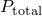
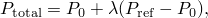

# 6.2.4 不稳定坍塌和后屈曲分析

**产品：** Abaqus/Standard  Abaqus/CAE

##### **参考文献**

- ["定义分析，" 第6.1.2节](pt03ch06s01abo05.md)
- ["静态应力分析过程：概述，" 第6.2.1节](pt03ch06s02abo06.md)
- ["向模型引入几何缺陷，" 第11.3.1节](pt04ch11s03aus67.md)
- [*STATIC*](../key/key-link.md#usb-kws-hstatic)
- [*IMPERFECTION*](../key/key-link.md#usb-kws-mimperfection)
- ["配置静态，Riks过程" in "配置一般分析过程，" Abaqus/CAE User's Guide第14.11.1节](../usi/usi-link.md#usi-sim-configure-riks)

### 概述

Riks方法：
- 通常用于预测结构的几何非线性不稳定坍塌；
- 可以包含非线性材料和边界条件；
- 通常在特征值屈曲分析之后进行，以提供关于结构坍塌的完整信息；以及
- 可用于加速病态或跳跃问题（不表现出不稳定性）的收敛。

### 不稳定响应

几何非线性静态问题有时涉及屈曲或坍塌行为，其中载荷-位移响应显示负刚度，结构必须释放应变能以保持平衡。建模此类行为有几种可能的方法。一种是将屈曲响应动态处理，因此在结构跳跃时实际建模包含惯性效应的响应。当静态求解变得不稳定时，通过重启终止的静态过程（["重新启动分析，" 第9.1.1节"](pt04ch09s01aus53.md)）并切换到动态过程（["使用直接积分的隐式动态分析，" 第6.3.2节"](pt03ch06s03at07.md)），可以轻松完成此方法。在某些简单情况下，即使共轭载荷（反作用力）随位移增加而减小，位移控制也可以提供解。另一种方法是在静态分析期间使用阻尼器来稳定结构。Abaqus/Standard为静态分析过程提供了这种稳定方法的自动化版本（请参见["静态应力分析，" 第6.2.2节"](pt03ch06s02at01.md)；["准静态分析，" 第6.2.5节"](pt03ch06s02at04.md)；["完全耦合热应力分析，" 第6.5.3节"](pt03ch06s05at19.md)；或["耦合孔隙流体扩散和应力分析，" 第6.8.1节"](pt03ch06s08at26.md)）。

或者，可以通过使用"改进Riks方法"找到响应不稳定阶段期间的静态平衡状态。此方法用于载荷成比例的情况；即，载荷幅度由单个标量参数控制。该方法即使在复杂的不稳定响应情况下也能提供解，如[图6.2.4-1](pt03ch06s02at03.md#apostbuckling-prop-load)所示。

**图6.2.4-1** 具有不稳定响应的成比例加载。


Riks方法对于求解病态问题（如极限载荷问题或表现出软化的接近不稳定问题）也很有用。

### Riks方法

在简单情况下，线性特征值分析（["特征值屈曲预测，" 第6.2.3节"](pt03ch06s02at02.md)）可能足以进行设计评估；但如果关注材料非线性、屈曲前的几何非线性或不稳定后屈曲响应，则必须执行载荷-偏转（Riks）分析以进一步研究问题。

Riks方法使用载荷幅度作为额外未知量；它同时求解载荷和位移。因此，必须使用另一个量来测量求解的进展；Abaqus/Standard使用载荷-位移空间中静态平衡路径上的"弧长"，*l*。这种方法无论响应是稳定还是不稳定都能提供解。方法的详细描述请参见["修改的Riks算法，" Abaqus Theory Guide第2.3.2节](../stm/stm-link.md#stm-anl-modifiedriks)。

#### 成比例加载

如果Riks步骤是先前历史的延续，则在步骤开始时存在且未重新定义的任何载荷被视为具有恒定幅值的"死"载荷。在Riks步骤中定义其幅值的载荷称为"参考"载荷。所有规定载荷从初始（死载荷）值斜坡上升到规定的参考值。

Riks步骤期间的加载始终是成比例的。当前载荷幅度，，由下式定义



其中是"死载荷"，中所述）求解非线性平衡方程。Riks过程仅使用应变增量1%的外推。

当定义步骤时，您提供沿静态平衡路径的弧长初始增量，。初始载荷比例因数，

其中, RIKS ``` |
| --- | --- |

| **Abaqus/CAE用法：** | 步骤模块：**创建步骤**：**一般**：**静态，Riks** |
| --- | --- |

还提供了直接用户对增量大小的控制；在这种情况下，增量弧长，, RIKS, DIRECT ``` |
| --- | --- |

| **Abaqus/CAE用法：** | 步骤模块：**创建步骤**：**一般**：**静态，Riks**：**增量**：**类型：固定** |
| --- | --- |

### 结束Riks分析步骤

由于载荷幅度是解的一部分，您需要一个方法来指定步骤何时完成。您可以指定载荷比例因数的最大值，）。

### 分叉

Riks方法在跳跃问题中表现良好——那些在载荷-位移空间中平衡路径平滑且不分支的问题。通常，在不表现出分支（分叉）的问题中，您不需要采取任何特殊预防措施。["圆拱的跳跃屈曲分析，" Abaqus Example Problems Guide第1.2.1节](../exa/exa-link.md#exa-sta-snapbuckling)是平滑跳跃问题的一个例子。

Riks方法也可用于求解后屈曲问题，包括稳定和不稳定后屈曲行为。但是，由于屈曲点处的响应不连续，无法直接分析精确的后屈曲问题。要分析后屈曲问题，必须将其转化为具有连续响应的问题，而不是分叉。这可以通过在"完美"几何中引入初始缺陷来实现，使得在达到临界载荷之前在屈曲模式中具有一些响应。

#### 引入几何缺陷

缺陷通常通过几何扰动引入。除非已知缺陷的精确形状，否则必须引入由多个叠加屈曲模式组成的缺陷（["特征值屈曲预测，" 第6.2.3节"](pt03ch06s02at02.md)）。Abaqus允许您定义缺陷；请参见["向模型引入几何缺陷，" 第11.3.1节"](pt04ch11s03aus67.md)。

这样，Riks方法可用于对在（分叉）屈曲前表现线性行为的结构进行后屈曲分析。["均匀轴向压力下圆柱壳的屈曲，" Abaqus Benchmarks Guide第1.2.3节](../bmk/bmk-link.md#bmk-anl-bucklecylshell)中给出了引入几何缺陷的此方法的示例。

通过执行载荷-位移分析，可以包含其他重要的非线性效应，如材料非弹性或接触。相反，在线性特征值屈曲分析中，所有非弹性效应都被忽略，所有接触条件在基础状态中都是固定的。基于线性屈曲模式的缺陷也可用于分析在达到峰值载荷之前表现非弹性的结构。

#### 引入载荷缺陷

载荷或边界条件的扰动也可用于引入初始缺陷。在这种情况下，可以使用虚构的"触发"载荷来启动不稳定。触发载荷应该在预期的屈曲模式中扰动结构。通常，这些载荷在Riks步骤之前作为死载荷施加，因此它们具有固定幅度。触发载荷的幅度必须足够小，以免影响整体后屈曲解。选择此类虚构载荷的适当幅度和位置是您的责任；Abaqus/Standard不检查它们是否合理。

### 在特定载荷或位移值处获得解

Riks算法无法在给定载荷或位移值处获得解，因为这些被视为未知数——终止发生在满足步骤终止条件的第一求解点。要在载荷或位移的精确值处获得解，必须在步骤中所需点（["重新启动分析，" 第9.1.1节"](pt04ch09s01aus53.md)）重启求解，并定义新的非Riks步骤。由于后续步骤是Riks分析的延续，该步骤中的载荷幅度必须适当给出，以使步骤开始时载荷继续根据其在重启点的行为增加或减少。例如，如果载荷在重启点增加且为正，则应在重启步骤中给出大于当前幅度的载荷幅度以继续此行为。如果载荷正在减少但为正，则应指定小于当前幅度的幅度。

### 限制

Riks分析受以下限制：
- Riks步骤之后不能是同一分析中的另一个步骤。后续步骤必须使用重启能力进行分析。
- 如果Riks分析包含不可逆变形（如塑性），并且在结构上的载荷幅度正在减少时尝试使用另一个Riks步骤重启，Abaqus/Standard将找到弹性卸载解。因此，如果存在塑性，重启应该发生在载荷幅度正在增加的分析点。
- 对于涉及失去接触的后屈曲问题，Riks方法通常不起作用；必须在动态或静态分析中引入惯性或粘性阻尼力（如阻尼器提供的）以稳定求解。

### 初始条件

可以指定应力、温度、场变量、依赖于求解的状态变量等的初始值；["Abaqus/Standard和Abaqus/Explicit中的初始条件，" 第34.2.1节"](pt07ch34s02aus116.md)描述了所有可用的初始条件。

### 边界条件

边界条件可以施加于任何位移或旋转自由度（1-6），或开口截面梁单元的翘曲自由度7（["Abaqus/Standard和Abaqus/Explicit中的边界条件，" 第34.3.1节"](pt07ch34s03aus118.md)）。幅值定义（["幅值曲线，" 第34.1.2节"](pt07ch34s01aus115.md)）不能用于在Riks分析期间改变规定边界条件的大小。

### 载荷

可以在Riks分析中规定以下载荷：
- 集中节点力可以施加于位移自由度（1-6）；请参见["集中载荷，" 第34.4.2节"](pt07ch34s04aus121.md)。
- 分布压力载荷或体积力可以施加；请参见["分布载荷，" 第34.4.3节"](pt07ch34s04aus122.md)。特定单元可用的分布载荷类型在["单元，" 第VI部分](pt06.md)中描述。

由于Abaqus/Standard根据用户指定的幅度按比例缩放载荷幅度，当选择Riks方法时，幅值引用被忽略。

如果规定了随动力，它们对刚度矩阵的贡献可能是不对称的；在这种情况下，可以使用非对称矩阵存储和求解方案来提高计算效率（请参见["定义分析，" 第6.1.2节"](pt03ch06s01abo05.md)）。

### 预定义场

可以规定节点温度（请参见["预定义场，" 第34.6.1节"](pt07ch34s06aus128.md)）。如果为材料指定了热膨胀系数（["热膨胀，" 第26.1.2节"](pt05ch26s01abm52.md)），则施加温度与初始温度之间的任何差异将导致热应变。热应变产生的载荷贡献于为Riks分析规定的"参考"载荷，并与载荷比例因数一起斜坡上升。因此，Riks过程可以分析由于热应变引起的后屈曲和坍塌。

可以指定其他用户定义场变量的值。这些值仅影响场变量依赖性材料属性（如果有的话）。由于在Riks分析中时间的概念被弧长代替，因此不建议使用由于温度和/或场变量变化而变化的属性。

### 材料选项

大多数描述机械行为的材料模型可用于Riks分析。以下材料属性在Riks分析期间不活跃：声学属性、热属性（热膨胀除外）、质量扩散属性、电属性和孔隙流体流动属性。具有历史依赖性的材料可以使用；但是，应该认识到结果将取决于载荷历史，而这是事先不知道的。

在Riks分析中，时间的概念被弧长代替。因此，任何涉及时间或应变率的效应（如粘性阻尼或率相关塑性）不再被正确处理，不应使用。

有关Abaqus/Standard中可用材料模型的详细信息，请参见["材料，" 第V部分](pt05.md)。

### 单元

Abaqus/Standard中任何应力/位移单元（包括具有温度或压力自由度的单元）都可以在Riks分析中使用（请参见["为分析类型选择适当的单元，" 第27.1.3节"](pt06ch27s01aus112.md)）。不应使用阻尼器，因为速度将计算为位移增量除以弧长，这是无意义的。

### 输出

提供输出选项以允许打印或写入结果文件的各个载荷分量（压力、点载荷等）的幅度。载荷比例因数LPF的当前值将自动随任何结果或输出数据库文件输出请求给出。建议在使用Riks方法时使用这些输出选项，以便可以直接看到载荷幅度。所有输出变量标识符在["Abaqus/Standard输出变量标识符，" 第4.2.1节"](pt02ch04s02abv01.md)中概述。

### 输入文件模板

```
[*HEADING](../key/key-link.md#usb-kws-mheading)
…
[*INITIAL CONDITIONS](../key/key-link.md#usb-kws-minitialcond)
*数据行用于定义初始条件*
[*BOUNDARY](../key/key-link.md#usb-kws-hboundary)
*数据行用于指定零值边界条件*
**
[*STEP](../key/key-link.md#usb-kws-hstep), NLGEOM
[*STATIC](../key/key-link.md#usb-kws-hstatic)
[*CLOAD](../key/key-link.md#usb-kws-hcload) and/or [*DLOAD](../key/key-link.md#usb-kws-hdload) and/or [*TEMPERATURE](../key/key-link.md#usb-kws-htemperature)
*数据行用于指定预载荷（死载荷），*
[*END STEP](../key/key-link.md#usb-kws-hendstep)
**
[*STEP](../key/key-link.md#usb-kws-hstep), NLGEOM
[*STATIC](../key/key-link.md#usb-kws-hstatic), RIKS
*数据行用于定义增量和停止标准*
[*CLOAD](../key/key-link.md#usb-kws-hcload) and/or [*DLOAD](../key/key-link.md#usb-kws-hdload) and/or [*TEMPERATURE](../key/key-link.md#usb-kws-htemperature)
*数据行用于指定参考载荷，
[*END STEP](../key/key-link.md#usb-kws-hendstep)
```
