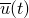
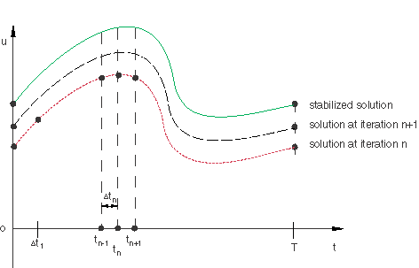
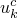
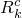
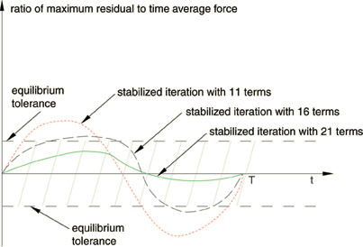
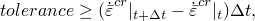
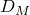
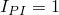

# 6.2.6 直接循环分析

**产品：** Abaqus/Standard  Abaqus/CAE

##### **参考文献**

- ["定义分析，" 第6.1.2节](pt03ch06s01abo05.md)
- [*DIRECT CYCLIC*](../key/key-link.md#usb-kws-hdirectcyclic)
- [*TIME POINTS*](../key/key-link.md#usb-kws-htimepoints)
- [*CONTROLS*](../key/key-link.md#usb-kws-hcontrols)
- ["配置直接循环过程" in "配置一般分析过程，" Abaqus/CAE User's Guide第14.11.1节](../usi/usi-link.md#usi-sim-configure-directcyclic)

### 概述

直接循环分析：
- 是一种准静态分析；
- 使用Fourier级数和非线性材料行为时间积分的组合来迭代获得结构的稳定循环响应；
- 避免了与瞬态分析相关的相当大的数值成本；
- 非常适合非常大型的问题，在这些问题中，如果执行瞬态分析，必须施加许多载荷循环以获得稳定响应；
- 可以执行具有局部塑性变形的线性或非线性材料；
- 可用于预测塑性棘轮发生的可能性；
- 假设几何线性行为和固定接触条件；
- 使用弹性刚度，因此方程系统仅反转一次；以及
- 也可用于基于直接循环方法与损伤外推技术结合，预测延性体材料的渐进损伤和失效，和/或预测层合复合材料中层间界面处的分层/脱粘生长，用于低循环疲劳分析。

### 简介

众所周知，经过一定数量的重复加载循环后，弹塑性结构（如承受大温度波动和夹紧载荷的汽车排气歧管）的响应可能导致稳定状态，其中每个连续循环中的应力-应变关系与前一个循环相同。获得这种结构响应的经典方法是将周期载荷重复施加于结构，直到获得稳定状态。这种方法可能相当昂贵，因为在获得稳定响应之前可能需要施加许多加载循环。为了避免与瞬态分析相关的相当大的数值成本，可以使用直接循环分析直接计算结构的循环响应。该方法的基础是构建一个位移函数，，该函数描述在周期为*T*的载荷循环的所有时间*t*内结构的响应，如[图6.2.6-1](pt03ch06s02at05.md#usb-anl-direct-cyclic-iter)所示。

**图6.2.6-1** 在周期为*T*的载荷循环中，不同迭代下所有时间*t*的位移函数。



为此使用了截断的Fourier级数，


其中*n*表示Fourier级数中的项数，是角频率，和是 与问题中每个自由度相关的未知位移系数。Abaqus/Standard使用改进的Newton法求解未知位移系数，以分析步骤开始时的弹性刚度矩阵作为该方案中的Jacobian。我们使用与位移解相同形式的Fourier级数扩展改进Newton法中的残差向量：


其中Fourier级数中的每个残差向量系数和对应于位移系数和。残差系数通过追踪整个载荷循环获得。在循环中的每个时间瞬间，Abaqus/Standard通过标准逐单元计算获得残差向量中详细描述。

### 直接循环分析

直接循环步骤可以是分析中的唯一步骤，可以跟随一般或线性扰动步骤，或者可以跟随一般或线性扰动步骤。如果直接循环步骤后面是一般步骤，则直接循环步骤结束时的解将是一般步骤的初始状态。如果直接循环步骤跟随一般或线性扰动步骤，则直接循环步骤之前最后一般分析步骤结束时的弹性刚度矩阵将作为直接循环过程中的Jacobian。任何先前的（非循环）载荷简单地包含在残差向量Fourier展开的常数部分中，预载荷步骤结束时的塑性应变被用作直接循环步骤的初始条件。

多个直接循环分析步骤可以包含在单个分析中。在这种情况下，前一步骤中获得的Fourier级数系数可以用作当前步骤的起始值。默认情况下，Fourier系数被重置为零，从而允许施加与先前直接循环步骤中定义的非常不同的循环载荷条件。

您可以指定重启分析中的直接循环步骤应使用先前步骤的Fourier系数，从而允许继续尚未达到稳定循环的分析。在直接循环分析中，重启文件在循环或时间段结束时写入。因此，作为先前直接循环分析的延续的重启分析将开始于的新迭代（请参见["重新启动分析，" 第9.1.1节"](pt04ch09s01aus53.md)）。

| **输入文件用法：** | 使用以下选项将Fourier级数系数重置为零： |
| --- | --- |
|  | ``` [*DIRECT CYCLIC](../key/key-link.md#usb-kws-hdirectcyclic), CONTINUE=NO（默认）``` 使用以下选项指定当前步骤是先前直接循环步骤的延续：``` [*DIRECT CYCLIC](../key/key-link.md#usb-kws-hdirectcyclic), CONTINUE=YES ``` |

| **Abaqus/CAE用法：** | 使用以下选项将Fourier级数系数重置为零（默认）： |
| --- | --- |
|  | 步骤模块：**创建步骤**：**一般**：**直接循环** 使用以下选项指定当前步骤是先前直接循环步骤的延续：步骤模块：**创建步骤**：**一般**：**直接循环**；**基本：****使用先前直接循环步骤的位移Fourier系数** |

#### 使用直接循环方法进行低循环疲劳分析

直接循环过程也可与损伤外推技术结合使用，以预测延性体材料的渐进损伤和失效，和/或预测层合复合材料中层间界面处的分层/脱粘，用于低循环疲劳分析。在这种情况下，多个循环可以包含在单个直接循环分析中，如["使用直接循环方法的低循环疲劳分析，" 第6.2.7节"](pt03ch06s02at06.md)中所述。

| **输入文件用法：** | ``` [*DIRECT CYCLIC](../key/key-link.md#usb-kws-hdirectcyclic), FATIGUE ``` |
| --- | --- |

| **Abaqus/CAE用法：** | 步骤模块：**创建步骤**：**一般**：**直接循环**；**疲劳：****包含低循环疲劳分析** |
| --- | --- |

### 控制求解精度

直接循环分析将Fourier级数近似与非线性材料行为的时间积分相结合，使用改进的Newton法迭代获得稳定循环解。算法的精度取决于所使用的Fourier项数、获得稳定解所采取的迭代次数以及在载荷周期内评估材料响应和残差向量的时间点数。Abaqus/Standard允许您以多种方式控制求解，如下所述。

#### 控制改进Newton法中的迭代

在直接循环方法中，执行全局Newton迭代以确定位移Fourier系数的校正。在每次全局迭代期间，Abaqus/Standard追踪整个时间循环以在适当数量的时间点计算残差向量。这涉及标准逐单元有限元计算，其中积分历史相关材料变量。残差向量在周期上积分以获得Fourier残差系数，当求解方程组时，这些系数又产生位移系数的校正。Abaqus/Standard将继续迭代过程，直到获得收敛或达到允许的最大迭代次数。您可以在定义直接循环步骤时指定最大迭代次数；默认值为200次迭代。

| **输入文件用法：** | ``` [*DIRECT CYCLIC](../key/key-link.md#usb-kws-hdirectcyclic) , , , , , , , *最大迭代次数* ``` |
| --- | --- |

| **Abaqus/CAE用法：** | 步骤模块：**创建步骤**：**一般**：**直接循环**；**增量：****最大迭代次数**：*最大迭代次数* |
| --- | --- |

##### 指定收敛准则

最好通过确保所有残差系数相对于时间平均力足够小，并且所有位移Fourier系数的校正相对于位移Fourier系数足够小来测量收敛。时间平均力在["非线性问题的收敛准则，" 第7.2.3节"](pt03ch07s02aus51.md)中定义。Abaqus/Standard要求最大残差系数与时间平均力的比值， = 0.005和 = 0.005。要更改这些值，您必须定义直接循环控制。

当不存在稳定的循环响应时，方法将不会收敛。在发生塑性棘轮的情况下，Fourier级数中所有周期项（和 = 0.005和 = 0.005。有关更多信息，请参见["常用控制参数，" 第7.2.2节中的"控制直接循环分析中的求解精度"](pt03ch07s02aus50.md#usb-anl-aconvergecontrol-directcyclic)。

| **输入文件用法：** | ``` [*CONTROLS](../key/key-link.md#usb-kws-hcontrols), TYPE=DIRECT CYCLIC ``` |
| --- | --- |

| **Abaqus/CAE用法：** | 步骤模块：****其他****通用求解控制****编辑****；**指定：****直接循环** |
| --- | --- |

#### 控制Fourier表示

获得精确解所需的Fourier项数取决于载荷的变化以及结构响应在周期上的变化。在确定项数时，请记住此类分析的目的是进行低循环疲劳预测。因此，目标是获得每个点塑性应变循环的良好近似；应力中的局部误差不太重要。更多Fourier项通常提供更准确的解，但会增加数据存储和计算时间。此外，准确积分Fourier残差系数要求在循环中的足够数量的时间点评估残差向量。Abaqus/Standard使用梯形法则，假设残差在时间增量上线性变化，以积分残差系数。为了准确积分，时间点数必须大于Fourier系数数量（即等于，其中*n*表示Fourier项数）。如果发现Fourier系数数量大于完成迭代所需的增量数，Abaqus/Standard将自动减少用于下次迭代的Fourier系数数量。

Abaqus/Standard使用自适应算法来确定Fourier项数。默认情况下，Abaqus/Standard从11项开始，并使用前面描述的迭代方法确定结构响应。一旦获得收敛（通过确保所有残差向量系数和Fourier级数中所有位移系数校正都足够小来测量），Abaqus/Standard通过确定在循环中所有时间点是否满足平衡来评估是否使用了足够数量的Fourier项。如果在所有时间点都满足平衡，则接受解。否则，Abaqus/Standard增加Fourier项数（默认情况下，增加5项），并继续迭代方案，直到获得具有新Fourier项数的收敛。重复此过程，直到达到平衡或达到最大Fourier项数。此方案在[图6.2.6-2](pt03ch06s02at05.md#usb-anl-direct-cyclic-converg)中最好地说明，其中当Fourier项数等于21时，获得了局部平衡和整体收敛。默认使用最大25个Fourier项。您可以在定义直接循环步骤时指定Fourier项的初始数量、最大数量和增量。

**图6.2.6-2** 不同Fourier项数的稳定迭代。



您还可以定义用于确定收敛以及确定在周期内所有时间点是否达到平衡的收敛准则（请参见["常用控制参数，" 第7.2.2节"](pt03ch07s02aus50.md)），Abaqus/Standard设置了适当的默认值。

在尚未达到稳定循环的直接循环分析中，您可以在重启时增加迭代或Fourier项数，从而允许继续分析。

Abaqus/Standard在消息（`.msg`）文件中的每次迭代结束时提供每个时间点的最大残差、最大残差系数、最大位移系数、位移系数最大校正以及Fourier项数的详细输出。此输出在下面更详细地描述。

| **输入文件用法：** | ``` [*DIRECT CYCLIC](../key/key-link.md#usb-kws-hdirectcyclic) , , , , *初始项数*, *最大项数*, *项数增量* ``` |
| --- | --- |

| **Abaqus/CAE用法：** | 步骤模块：**创建步骤**：**一般**：**直接循环**；**增量：****Fourier项数**：**初始**：*初始项数*，**最大**：*最大项数*，**增量**：*项数增量* |
| --- | --- |

#### 控制循环时间段期间的增量

为确保准确解，必须在循环中的足够数量的时间点评估材料历史以及残差向量。计算响应的时间点数，。如果不满足此类条件，Abaqus/Standard将自动调整Fourier系数数量。您可以直接指定循环中的时间增量，或者由Abaqus/Standard自动确定。

您应指定步骤定义中允许的时间周期中的最大增量数。默认值为100。

##### 自动增量

有几种方法选择自动增量方案。如果您仅指定增量中允许的最大节点温度变化，时间增量将基于此值自动选择。Abaqus/Standard将限制时间增量以确保在分析的任何增量期间任何节点的温度变化都不超过最大值。

对于率相关本构方程，您可以通过积分精度限制时间增量大小。用户指定的精度容差参数限制了增量允许的最大非弹性应变率变化：



其中*t*是增量开始时的时间，次增量后满足，则下一个时间增量将增加一个因子）。默认值为 = 3和 = 1.5。

| **输入文件用法：** | 使用以下选项指定允许的最大节点温度变化： |
| --- | --- |
|  | ``` [*DIRECT CYCLIC](../key/key-link.md#usb-kws-hdirectcyclic), DELTMX= ``` 使用以下选项指定精度容差参数：``` [*DIRECT CYCLIC](../key/key-link.md#usb-kws-hdirectcyclic), CETOL=*tolerance* ``` |

| **Abaqus/CAE用法：** | 使用以下选项指定允许的最大节点温度变化： |
| --- | --- |
|  | 步骤模块：**创建步骤**：**一般**：**直接循环**；**增量：****每个增量允许的最大温度变化**： 使用以下选项指定精度容差参数：步骤模块：**创建步骤**：**一般**：**直接循环**；**增量：****蠕变/膨胀/粘弹性应变误差容差**：*tolerance* |

##### 固定时间增量

如果未指定精度容差参数或允许的最大节点温度变化，则时间增量大小是固定的。您必须指定时间增量，和时间段*T*。

| **输入文件用法：** | ``` [*DIRECT CYCLIC](../key/key-link.md#usb-kws-hdirectcyclic) , *T* ``` |
| --- | --- |

| **Abaqus/CAE用法：** | 步骤模块：**创建步骤**：**一般**：**直接循环**；**基本：****循环时间段**：*T*；**增量：****类型**：**固定**，**增量大小**： |
| --- | --- |

##### 定义必须评估响应的时间点

可以通过指定载荷历史中的特定时间点来增加或替代直接循环步骤的用户定义时间增量，其中应评估结构的响应。如果您事先知道分析中载荷达到最大值和/或最小值的时间点，或者响应将快速变化的时间点，此功能特别有用。例如，发动机部件的热循环分析中，您通常知道温度何时达到最大值。

当时点与固定增量一起使用时，为直接循环步骤指定的时间增量被忽略，而是精确地遵循指定的时间点。当时点与自动增量一起使用时，时间增量是可变的；但将在指定的时间点评估结构响应。

时间点可以单独列出，也可以通过指定起始时间点、结束时间点以及两个指定时间点之间的时间增量来自动生成。

| **输入文件用法：** | 使用以下选项单独列出时间点： |
| --- | --- |
|  | ``` [*TIME POINTS](../key/key-link.md#usb-kws-htimepoints), NAME=*time points name* [*DIRECT CYCLIC](../key/key-link.md#usb-kws-hdirectcyclic), TIME POINTS=*time points name* ``` 使用以下选项自动生成时间点：``` [*TIME POINTS](../key/key-link.md#usb-kws-htimepoints), NAME=*time points name*, GENERATE [*DIRECT CYCLIC](../key/key-link.md#usb-kws-hdirectcyclic), TIME POINTS=*time points name* ``` |

| **Abaqus/CAE用法：** | 使用以下选项单独列出时间点： |
| --- | --- |
|  | 步骤模块：**创建步骤**：**一般**：**直接循环**；**增量：****在时间点评估结构响应**：*time points name* 使用以下选项自动生成时间点：步骤模块：**创建步骤**：**一般**：**直接循环**；**增量：****在时间点评估结构响应**：**创建**；**编辑时间点**：**使用分隔符指定**：**开始**，**结束**，**增量** |

#### 控制周期性条件的应用

默认情况下，Abaqus/Standard在迭代求解过程中通过使用在前一次迭代结束时获得的状态作为当前迭代的起始状态来施加周期性条件；即，比较了承受相同循环载荷和边界条件的两个相同结构的响应，其中每个结构在施加循环载荷之前经历了不同的加载历史。[图6.2.6-3](pt03ch06s02at05.md#usb-anl-direct-cyclic-periodi)表明，先前的加载历史仅影响应力和应变的平均值；它不影响应力-应变曲线的形状或循环期间消耗的能量。

**图6.2.6-3** 周期性条件对稳定循环应变平均值的影响。


通过延迟周期性条件的应用，您可以影响平均应力和应变水平。但是，这很少有必要，因为平均应力和应变水平通常不是低循环疲劳寿命预测所需的。

您可以通过定义直接循环控制来控制何时应用周期性条件，以指定变量，意味着从迭代6开始应用周期性条件。默认值为，适用于大多数分析。

| **输入文件用法：** | ``` [*CONTROLS](../key/key-link.md#usb-kws-hcontrols), TYPE=DIRECT CYCLIC  ``` |
| --- | --- |

| **Abaqus/CAE用法：** | 步骤模块：****其他****通用求解控制****编辑****；**直接循环**： |
| --- | --- |

### 初始条件

可以指定应力、温度、场变量、依赖于求解的状态变量等的初始值（请参见["Abaqus/Standard和Abaqus/Explicit中的初始条件，" 第34.2.1节"](pt07ch34s02aus116.md)）。

### 边界条件

边界条件可以施加于任何位移或旋转自由度。在分析期间，规定的边界条件必须具有在步骤上循环的幅值定义：起始值必须等于结束值（请参见["幅值曲线，" 第34.1.2节"](pt07ch34s01aus115.md)）。如果分析由多个步骤组成，则适用通常的规则（请参见["Abaqus/Standard和Abaqus/Explicit中的边界条件，" 第34.3.1节"](pt07ch34s03aus118.md)）。在每个新步骤中，边界条件可以修改或完全定义。除非重新定义，否则先前步骤中定义的所有边界条件保持不变。

### 载荷

可以在直接循环分析中规定以下载荷：
- 集中节点力可以施加于位移自由度（1-6）；请参见["集中载荷，" 第34.4.2节"](pt07ch34s04aus121.md)。
- 分布压力载荷或体积力可以施加；请参见["分布载荷，" 第34.4.3节"](pt07ch34s04aus122.md)。特定单元可用的分布载荷类型在["单元，" 第VI部分](pt06.md)中描述。

在分析期间，每个载荷必须具有在步骤上循环的幅值定义：起始值必须等于结束值（请参见["幅值曲线，" 第34.1.2节"](pt07ch34s01aus115.md)）。如果分析由多个步骤组成，则适用通常的规则（请参见["施加载荷：概述，" 第34.4.1节"](pt07ch34s04aus120.md)）。在每个新步骤中，载荷可以修改或完全定义。除非重新定义，否则先前步骤中定义的所有载荷保持不变。

### 预定义场

可以在直接循环分析中规定以下预定义场，如["预定义场，" 第34.6.1节"](pt07ch34s06aus128.md)中所述：
- 温度在直接循环分析中不是自由度，但可以将节点温度规定为预定义场。规定的温度值必须在步骤上循环：起始值必须等于结束值（请参见["幅值曲线，" 第34.1.2节"](pt07ch34s01aus115.md)）。如果从结果文件读取温度，您应指定等于步骤结束时温度值的初始温度条件（请参见["Abaqus/Standard和Abaqus/Explicit中的初始条件，" 第34.2.1节"](pt07ch34s02aus116.md)）。或者，您可以将温度斜坡回其初始条件值，如["预定义场，" 第34.6.1节"](pt07ch34s06aus128.md)中所述。如果为材料指定了热膨胀系数（["热膨胀，" 第26.1.2节"](pt05ch26s01abm52.md)），则施加温度与初始温度之间的任何差异将导致热应变。指定温度也会影响温度依赖性材料属性（如果有的话）。
- 可以指定用户定义场变量的值。这些值仅影响场变量依赖性材料属性（如果有的话）。规定的场变量值必须在步骤上循环。

### 材料选项

大多数描述机械行为的材料模型，包括用户定义材料（使用用户子程序[`UMAT`](../sub/sub-link.md#sub-xsl-umat)定义），都可用于直接循环分析。

以下材料属性在直接循环分析期间不活跃：声学属性、热属性（热膨胀除外）、质量扩散属性、电导率属性、压电属性和孔隙流体流动属性。

率相关屈服（["率相关屈服，" 第23.2.3节"](pt05ch23s02abm19.md)）、率相关蠕变（["率相关塑性：蠕变和膨胀，" 第23.2.4节"](pt05ch23s02abm20.md)）和双层粘塑性（["双层粘塑性，" 第23.2.11节"](pt05ch23s02abm27.md)也可以在直接循环分析期间使用。

### 单元

Abaqus/Standard中任何应力/位移单元都可以在直接循环分析中使用（请参见["为分析类型选择适当的单元，" 第27.1.3节"](pt06ch27s01aus112.md)）。

### 输出

不同类型的输出可用于后处理和监控直接循环分析。

#### 消息文件信息

Abaqus/Standard在每次迭代的不同时间增量打印残差力、时间平均力和一个标志，以指示是否在消息（`.msg`）文件中满足平衡。您可以控制打印到消息文件的信息增量频率，并且可以抑制输出；默认是每10次增量打印一次输出（请参见["输出，" 第4.1.1节中的"Abaqus/Standard消息文件"](pt02ch04s01aus38.md#usb-out-ooutput-message-std)，以获取更多信息）。

Abaqus/Standard还在每次迭代结束时在消息文件中打印所使用的Fourier项数、最大残差系数、位移系数的最大校正以及Fourier级数中的最大位移系数。以下是输出示例：

```
									           ITERATION    26 STARTS
 INC     TIME        STEP       LARG. RESI.   TIME AVG.   FORCE
         INC         TIME       FORCE         FORCE       EQUV.
 10      0.250       2.50       1.008E+01     50.9         N
 20      0.250       5.00       1.622E+01     76.8         N
 30      0.250       7.50       4.622E-02     99.8         Y

                     ITERATION    26 SUMMARY
 NUMBER OF FOURIER TERMS USED 40, TOTAL NUMBER OF INCREMENTS  120
 CYCLE/STEP TIME   30.0,    TOTAL TIME COMPLETED       31.0
 AVERAGE FORCE     21.2     TIME AVG. FORCE     25.7

 MAX. COEFFICIENT OF DISP.                   0.142  AT NODE 24 DOF 2
 MAX. COEFF. OF RESI. FORCE ON CONST. TERM    31.7  AT NODE 44 DOF 1
 MAX. COEFF. OF RESI. FORCE ON PERI. TERMS    0.82  AT NODE  6 DOF 3
 MAX. CORR. TO COEFF. OF DISP. ON CONST. TERM 0.002 AT NODE 50 DOF 3
 MAX. CORR. TO COEFF. OF DISP. ON PERI. TERMS 0.015 AT NODE 50 DOF 3
```

#### 结果输出

仅当达到稳定循环时才写入单元和节点输出。如果在分析结束时未达到稳定循环，则为步骤的最后一次迭代写入输出。直接循环分析可用的单元输出包括应力；应变；能量；以及状态、场和用户定义变量的值。所有能量在每次迭代开始时设置为零，因为在整个稳定循环中消耗的能量在直接循环分析中进行疲劳寿命预测时是感兴趣的。可用的节点输出包括位移、反作用力和坐标。所有输出变量标识符在["Abaqus/Standard输出变量标识符，" 第4.2.1节"](pt02ch04s02abv01.md)中概述。

#### 从迭代恢复额外结果

您可能希望从迭代而不是从稳定循环恢复额外结果。您可以从重启数据中提取这些结果（请参见["输出，" 第4.1.1节中的"从Abaqus/Standard重启数据恢复额外结果输出"](pt02ch04s01aus38.md#usb-out-ooutput-postoutput)）。如果您想评估当发生塑性棘轮时应变从前一次迭代到另一次迭代的偏移，此功能特别有用。

| **输入文件用法：** | ``` [*POST OUTPUT](../key/key-link.md#usb-kws-hpostoutput), ITERATION=*n* ``` |
| --- | --- |

| **Abaqus/CAE用法：** | 不支持在Abaqus/CAE中从迭代恢复额外结果。 |
| --- | --- |

#### 在精确时间指定输出

直接循环分析不支持精确时间的输出。如果请求精确时间的输出，Abaqus将发出警告消息并将输出更改为近似时间的输出。

### 限制

直接循环分析受以下限制：
- 接触条件在直接循环分析期间不能改变；它们保持为在分析开始时或直接循环步骤之前的任何一般步骤结束时定义的状态。在直接循环分析期间不允许摩擦滑动；如果存在摩擦，所有接触点假定为粘着。
- 几何非线性只能包含在直接循环步骤之前的任何一般步骤中；但是，在循环步骤期间仅考虑小位移和应变。

### 输入文件模板

```
[*HEADING](../key/key-link.md#usb-kws-mheading)
…
[*BOUNDARY](../key/key-link.md#usb-kws-hboundary)
*数据行用于指定零值边界条件*
[*INITIAL CONDITIONS](../key/key-link.md#usb-kws-minitialcond)
*数据行用于指定初始条件*
[*AMPLITUDE](../key/key-link.md#usb-kws-mamplitude)
*数据行用于定义幅值变化*
**
[*STEP](../key/key-link.md#usb-kws-hstep) (,INC=)
*将INC设置为单个载荷循环中的最大增量数*
[*DIRECT CYCLIC](../key/key-link.md#usb-kws-hdirectcyclic)
*数据行用于定义时间增量、循环时间、Fourier项初始数量、
Fourier项最大数量、Fourier项数量增量以及最大迭代次数*
[*TIME POINTS](../key/key-link.md#usb-kws-htimepoints)
*数据行用于列出时间点*
[*BOUNDARY](../key/key-link.md#usb-kws-hboundary), AMPLITUDE=
*数据行用于规定零值或非零边界条件*
[*CLOAD](../key/key-link.md#usb-kws-hcload) and/or [*DLOAD](../key/key-link.md#usb-kws-hdload), AMPLITUDE=
*数据行用于指定载荷*
[*TEMPERATURE](../key/key-link.md#usb-kws-htemperature) and/or [*FIELD](../key/key-link.md#usb-kws-hfield), AMPLITUDE=
*数据行用于指定预定义场的值*
[*END STEP](../key/key-link.md#usb-kws-hendstep)
**
[*STEP](../key/key-link.md#usb-kws-hstep)(,INC=)
[*DIRECT CYCLIC](../key/key-link.md#usb-kws-hdirectcyclic), DELTMX
*数据行用于控制自动时间增量和Fourier表示*
[*BOUNDARY](../key/key-link.md#usb-kws-hboundary), OP=MOD,AMPLITUDE=
*数据行用于修改或添加零值或非零边界条件*
[*CLOAD](../key/key-link.md#usb-kws-hcload), OP=NEW, AMPLITUDE=
*数据行用于指定新的集中载荷；所有先前的集中载荷将被移除*
[*DLOAD](../key/key-link.md#usb-kws-hdload), OP=MOD, AMPLITUDE=
*数据行用于指定额外或修改的分布载荷*
[*TEMPERATURE](../key/key-link.md#usb-kws-htemperature) and/or [*FIELD](../key/key-link.md#usb-kws-hfield), AMPLITUDE=
*数据行用于指定预定义场的额外或修改的值*
[*END STEP](../key/key-link.md#usb-kws-hendstep)
```
