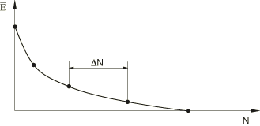
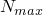
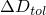

# 6.2.7 使用直接循环方法的低循环疲劳分析

**产品：** Abaqus/Standard  Abaqus/CAE

##### **参考文献**

- ["定义分析，" 第6.1.2节](pt03ch06s01abo05.md)
- ["静态应力分析过程：概述，" 第6.2.1节](pt03ch06s02abo06.md)
- ["直接循环分析，" 第6.2.6节](pt03ch06s02at05.md)
- ["裂纹扩展分析，" 第11.4.3节](pt04ch11s04aus69.md)
- ["低循环疲劳分析中延性材料的损伤和失效，" 第24.4节](pt05ch24s04.md)
- ["使用扩展有限元方法将不连续性建模为富集特征，" 第10.7.1节](pt04ch10s07at36.md)
- [*DAMAGE EVOLUTION*](../key/key-link.md#usb-kws-mdamageevolution)
- [*DAMAGE INITIATION*](../key/key-link.md#usb-kws-mdamageinitiation)
- [*DEBOND*](../key/key-link.md#usb-kws-hdebond)
- [*DIRECT CYCLIC*](../key/key-link.md#usb-kws-hdirectcyclic)
- [*FRACTURE CRITERION*](../key/key-link.md#usb-kws-hfracturecriterion)
- [*CONTROLS*](../key/key-link.md#usb-kws-hcontrols)
- ["配置直接循环过程" in "配置一般分析过程，" Abaqus/CAE User's Guide第14.11.1节](../usi/usi-link.md#usi-sim-configure-directcyclic)

### 概述

低循环疲劳分析：
- 的特征是应力状态足够高，在大多数情况下会发生非弹性变形；
- 是对承受亚临界循环载荷结构的准静态分析；
- 可与热载荷以及机械载荷相关；
- 使用直接循环方法直接获得结构的稳定循环响应；
- 基于连续损伤力学方法建模体延性材料中的渐进损伤和失效，在这种情况下，损伤萌生和演化用每个稳定循环的累积非弹性滞后应变能来表征；
- 基于线弹性断裂力学（LEFM）原理与扩展有限元方法，在体力材料中沿任意、依赖于求解的路径建模离散裂纹扩展，在这种情况下，疲劳裂纹的萌生和生长用相对断裂能释放率来表征；
- 沿层合复合材料中预定义路径在界面处建模渐进分层生长，在这种情况下，界面处疲劳分层的萌生和生长用相对断裂能释放率来表征；
- 使用损伤外推技术加速低循环疲劳分析；以及
- 假设几何线性行为和在每个载荷循环内固定接触条件。

### 低循环疲劳分析方法

确定结构疲劳极限的传统方法是建立结构材料的S-N曲线（载荷与失效循环次数的关系）。这种方法在许多情况下仍被用作预测工程结构抗疲劳性的设计工具。然而，这种技术通常是保守的，它没有定义循环次数与损伤程度或裂纹长度之间的关系。

另一种方法是当结构响应在许多循环后稳定时，基于非弹性应变/能量使用裂纹/损伤演化律来预测疲劳寿命。由于模拟材料在许多载荷循环下的缓慢渐进损伤的计算成本对于除最简单模型外的所有模型来说都是禁止性的，数值疲劳寿命研究通常涉及对承受实际加载历史一小部分的结构的响应建模。然后使用经验公式（如Coffin-Manson关系式，请参见[Coffin，1954，](pt03ch06s02at06.md#adirectcyclicfatigue-coffin1954)和[Manson，1953](pt03ch06s02at06.md#adirectcyclicfatigue-manson1953)）将此响应外推到许多载荷循环，以预测裂纹萌生和扩展的可能性。由于这种方法基于恒定的裂纹/损伤增长率，它可能无法真实地预测裂纹或损伤的演化。

#### Abaqus/Standard中的低循环疲劳分析

Abaqus/Standard中的直接循环分析能力提供了一种计算有效的建模技术，以获得承受周期载荷结构的稳定响应，非常适合在大型结构上执行低循环疲劳计算。该能力使用Fourier级数和非线性材料行为时间积分的组合来直接获得结构的稳定响应。使用直接循环方法获得稳定响应的理论和算法在["直接循环算法，" Abaqus Theory Guide第2.2.3节](../stm/stm-link.md#stm-anl-directcyclic)中详细描述。

直接循环低循环疲劳过程对体材料（如电子芯片封装中的焊点或层合复合材料中的层内裂纹生长）和材料界面（如层合复合材料中的分层）中的渐进损伤和失效进行建模。前者可以基于连续损伤力学方法或基于线弹性断裂力学原理与扩展有限元方法。响应通过评估沿加载历史离散的点的结构行为获得（请参见[图6.2.7-1](pt03ch06s02at06.md#usb-anl-direct-cyclic-fatigue-damaged)）。这些点的解用于预测在下一个增量（跨越多个载荷循环，）期间将发生的材料特性降解。然后使用降解的材料特性计算加载历史中下一个增量的解。因此，裂纹/损伤增长率在整个分析过程中不断更新。

**图6.2.7-1** 弹性刚度降解作为循环次数的函数。



当在加载历史中的给定点计算稳定解时，材料点的弹性材料刚度保持恒定，接触条件保持不变。沿加载历史的每个解表示结构在施加周期载荷下的稳定响应，每个点处的材料损伤水平从前一个解计算。此过程重复进行到可以进行疲劳寿命评估的加载历史点。

在体材料中，有两种建模渐进损伤和失效的方法。一种方法基于连续损伤力学。这种方法更适用于延性材料，其中循环载荷导致应力反向和塑性应变累积，进而导致裂纹的萌生和扩展。损伤萌生和演化用每个循环的稳定累积非弹性滞后应变能来表征，如[图6.2.7-2](pt03ch06s02at06.md#usb-anl-direct-cyclic-fatigue-shakedown-nls)所示。另一种方法基于线弹性断裂力学原理与扩展有限元方法。这种方法更适用于脆性材料或小规模屈服的材料，其中循环载荷导致材料强度降解，引起疲劳裂纹沿任意路径生长。裂纹的萌生和生长基于Paris定律（[Paris，1961](pt03ch06s02at06.md#adirectcyclicfatigue-paris1961)）在裂纹尖端处用相对断裂能释放率来表征。

**图6.2.7-2** 直接循环分析中的塑性安定。


在层合复合材料的界面处，循环载荷导致界面强度降解，引起疲劳分层生长。分层的萌生和生长也基于Paris定律（[Paris，1961](pt03ch06s02at06.md#adirectcyclicfatigue-paris1961))在裂纹尖端处用相对断裂能释放率来表征。

体材料中的渐进损伤机制和界面处的渐进分层生长机制可以同时考虑，失效首先发生在模型中最弱的环节。

使用直接循环方法定义低循环疲劳分析类似于定义直接循环分析。有关如何指定Fourier项数、迭代次数和增量大小的详细信息，请参见["直接循环分析，" 第6.2.6节"](pt03ch06s02at05.md)。您在定义低循环疲劳分析步骤时指定最大循环次数，。

| **输入文件用法：** | ``` [*DIRECT CYCLIC](../key/key-link.md#usb-kws-hdirectcyclic), FATIGUE *第一数据行* , ,  ``` |
| --- | --- |

| **Abaqus/CAE用法：** | 步骤模块：**创建步骤**：**一般**：**直接循环**；**疲劳：****包含低循环疲劳分析**，**最大循环次数**：**值**： |
| --- | --- |

#### 确定是否使用先前步骤的Fourier系数

使用直接循环方法的低循环疲劳步骤可以是分析中的唯一步骤，可以跟随一般或线性扰动步骤，或者可以跟随一般或线性扰动步骤。多个低循环疲劳分析步骤可以包含在单个分析中。在这种情况下，先前步骤中获得的Fourier级数系数可以用作当前步骤的起始值。默认情况下，Fourier系数被重置为零，从而允许施加与先前低循环疲劳步骤中定义的非常不同的循环载荷条件。

与直接循环分析一样，您可以指定重启分析中的低循环疲劳步骤应使用先前步骤的Fourier系数，从而允许继续分析以模拟更多载荷循环。在低循环疲劳分析中，重启文件在稳定循环结束时写入。因此，作为先前低循环疲劳分析延续的重启分析将开始于的新载荷循环（请参见["重新启动分析，" 第9.1.1节"](pt04ch09s01aus53.md)）。

| **输入文件用法：** | 使用以下选项指定当前步骤是先前使用直接循环方法的低循环疲劳步骤的延续： |
| --- | --- |
|  | ``` [*DIRECT CYCLIC](../key/key-link.md#usb-kws-hdirectcyclic), FATIGUE, CONTINUE=YES ``` 使用以下选项将Fourier级数系数重置为零：``` [*DIRECT CYCLIC](../key/key-link.md#usb-kws-hdirectcyclic), FATIGUE, CONTINUE=NO（默认）``` |

| **Abaqus/CAE用法：** | 使用以下选项指定当前步骤是先前低循环疲劳步骤的延续： |
| --- | --- |
|  | 步骤模块：**创建步骤**：**一般**：**直接循环**；**基本：****使用先前直接循环步骤的位移Fourier系数**；**疲劳：****包含低循环疲劳分析** 使用以下选项将Fourier级数系数重置为零：步骤模块：**创建步骤**：**一般**：**直接循环**；**疲劳：****包含低循环疲劳分析** |

### 基于连续损伤力学方法的体延性材料中的渐进损伤和损伤外推

Abaqus/Standard中的低循环疲劳分析允许对任何响应基于连续体本构模型定义的单元的延性材料进行渐进损伤和失效建模（["材料库：概述，" 第21.1.1节"](pt05ch21s01abo18.md)）。这包括使用连续方法建模的内聚单元（["使用连续方法定义内聚单元本构响应"中的"有限厚度粘附层的建模"，第32.5.5节"](pt06ch32s05alm44.md#usb-elm-ecohesivematbehavior-continuum)）。材料点中的非弹性定义必须与线性弹性材料模型（["线性弹性行为，" 第22.2.1节"](pt05ch22s02abm02.md)）、多孔弹性材料模型（["多孔材料的弹性行为，" 第22.3.1节"](pt05ch22s03abm05.md)）或亚弹性材料模型（["亚弹性行为，" 第22.4.1节"](pt05ch22s04abm06.md)结合使用。

损伤萌生后，弹性材料刚度在每个循环中基于累积的稳定非弹性滞后能量逐渐降解（如图6.2.7-1所示）。对于低循环疲劳分析，逐循环模拟是不切实际且计算昂贵的；相反，为了加速低循环疲劳分析，每个增量将当前损伤状态在许多循环中外推到当前载荷循环稳定后的新损伤状态。

#### 损伤萌生和演化

损伤萌生指材料点响应降解的开始。在低循环疲劳分析中，损伤萌生准则用每个循环的累积非弹性滞后能量，。在稳定载荷循环结束时，中详细讨论。

一旦材料点满足损伤萌生准则，损伤状态基于稳定循环的非弹性滞后能量计算和更新。Abaqus/Standard假设弹性刚度的降解可以用标量损伤变量，。

通常，当

其中，以获取更多信息）。

您指定损伤外推的最小（, FATIGUE *第一数据行* ,  ``` |
| --- | --- |

| **Abaqus/CAE用法：** | 步骤模块：**创建步骤**：**一般**：**直接循环**；**疲劳：****包含低循环疲劳分析**，**循环增量大小**：**最小**：。

为了加速低循环疲劳分析，使用了损伤外推技术，在每个稳定循环后将裂纹推进至少一个单元长度。

#### 疲劳裂纹的萌生和生长

富集单元中疲劳裂纹的萌生和生长用Paris定律表征，该定律将相对断裂能释放率，中详细讨论。

#### 损伤外推技术

如果在稳定循环结束时富集单元中任何裂纹尖端满足裂纹生长萌生准则，中所定义），结合裂纹尖前方富集单元的已知单元长度和可能的传播方向，。

为了加速低循环疲劳分析，使用了损伤外推技术，在每个稳定循环后在界面裂纹尖端处释放至少一个单元长度。当分析中同时考虑界面处的脆性疲劳分层和体材料中的延性损伤或离散裂纹生长时，失效首先发生在最弱的环节。

#### 疲劳分层的萌生和生长

定义裂纹界面处疲劳分层的萌生和生长用Paris定律表征，该定律将相对断裂能释放率，中详细讨论。

#### 界面单元处的损伤外推技术

如果在稳定循环结束时界面中任何裂纹尖端满足分层生长萌生准则，中所定义），结合裂纹尖界面单元的已知节点间距，中详细描述。它们在使用直接循环方法的低循环疲劳分析中仍然有效。此外，低循环疲劳分析的精度取决于损伤外推的循环次数，如下所述。

#### 控制使用连续损伤力学方法时体材料中损伤外推的精度

为了加速低循环疲劳分析，在稳定循环结束时使用损伤外推技术。除了指定损伤外推的最小和最大循环次数（请参见上面["体材料中的损伤外推技术"](pt03ch06s02at06.md#usb-anl-adirectcyclicfatigue-bulkextrap)），您可以指定损伤外推容差，, FATIGUE *第一数据行* , , ,  ``` |

| **Abaqus/CAE用法：** | 步骤模块：**创建步骤**：**一般**：**直接循环**；**疲劳：****包含低循环疲劳分析**，**损伤外推容差**： |
| --- | --- |

##### 确定损伤外推的增量

Abaqus/Standard使用自适应算法来确定每个增量中损伤外推的循环次数。默认情况下，Abaqus/Standard从500个循环开始（最大循环增量的默认值的一半），并基于


确定任何材料点的最大损伤增量。

如果最大损伤增量，）。

### 边界条件

边界条件可以施加于任何位移或旋转自由度。在分析期间，规定的边界条件必须具有在步骤上循环的幅值定义：起始值必须等于结束值（请参见["幅值曲线，" 第34.1.2节"](pt07ch34s01aus115.md)）。如果分析由多个步骤组成，则适用通常的规则（请参见["Abaqus/Standard和Abaqus/Explicit中的边界条件，" 第34.3.1节"](pt07ch34s03aus118.md)）。在每个新步骤中，边界条件可以修改或完全定义。除非重新定义，否则先前步骤中定义的所有边界条件保持不变。

### 载荷

可以使用直接循环方法在低循环疲劳分析中规定以下载荷：
- 集中节点力可以施加于位移自由度（1-6）；请参见["集中载荷，" 第34.4.2节"](pt07ch34s04aus121.md)。
- 分布压力载荷或体积力可以施加；请参见["分布载荷，" 第34.4.3节"](pt07ch34s04aus122.md)。特定单元可用的分布载荷类型在["单元，" 第VI部分](pt06.md)中描述。

在分析期间，每个载荷必须具有在步骤上循环的幅值定义：起始值必须等于结束值（请参见["幅值曲线，" 第34.1.2节"](pt07ch34s01aus115.md)）。如果分析由多个步骤组成，则适用通常的规则（请参见["施加载荷：概述，" 第34.4.1节"](pt07ch34s04aus120.md)）。在每个新步骤中，载荷可以修改或完全定义。除非重新定义，否则先前步骤中定义的所有载荷保持不变。

### 预定义场

可以使用直接循环方法在低循环疲劳分析中规定以下预定义场，如["预定义场，" 第34.6.1节"](pt07ch34s06aus128.md)中所述：
- 温度在使用直接循环方法的低循环疲劳分析中不是自由度，但可以将节点温度规定为预定义场。规定的温度值必须在步骤上循环：起始值必须等于结束值（请参见["幅值曲线，" 第34.1.2节"](pt07ch34s01aus115.md)）。如果从结果文件读取温度，您应指定等于步骤结束时温度值的初始温度条件（请参见["Abaqus/Standard和Abaqus/Explicit中的初始条件，" 第34.2.1节"](pt07ch34s02aus116.md)）。或者，您可以将温度斜坡回其初始条件值，如["预定义场，" 第34.6.1节"](pt07ch34s06aus128.md)中所述。如果为材料指定了热膨胀系数（["热膨胀，" 第26.1.2节"](pt05ch26s01abm52.md)），则施加温度与初始温度之间的任何差异将导致热应变。指定温度也会影响温度依赖性材料属性（如果有的话）。
- 可以指定用户定义场变量的值。这些值仅影响场变量依赖性材料属性（如果有的话）。规定的场变量值必须在步骤上循环。

### 材料选项

大多数描述机械行为的延性材料模型可用于低循环疲劳分析。材料点中的非弹性定义必须与线性弹性材料模型（["线性弹性行为，" 第22.2.1节"](pt05ch22s02abm02.md)）、多孔弹性材料模型（["多孔材料的弹性行为，" 第22.3.1节"](pt05ch22s03abm05.md)）或亚弹性材料模型（["亚弹性行为，" 第22.4.1节"](pt05ch22s04abm06.md)结合使用。

以下材料属性在低循环疲劳分析期间不活跃：声学属性、热属性（热膨胀除外）、质量扩散属性、电导率属性、压电属性和孔隙流体流动属性。

率相关屈服（["率相关屈服，" 第23.2.3节"](pt05ch23s02abm19.md)）、率相关蠕变（["率相关塑性：蠕变和膨胀，" 第23.2.4节"](pt05ch23s02abm20.md)）和双层粘塑性（["双层粘塑性，" 第23.2.11节"](pt05ch23s02abm27.md)也可以在低循环疲劳分析期间使用。

### 单元

Abaqus/Standard中任何应力/位移单元都可以在低循环疲劳分析中使用（请参见["为分析类型选择适当的单元，" 第27.1.3节"](pt06ch27s01aus112.md)）。这包括有限厚度的内聚单元（["使用连续方法定义内聚单元本构响应"中的"有限厚度粘附层的建模"，第32.5.5节"](pt06ch32s05alm44.md#usb-elm-ecohesivematbehavior-continuum)）。但是，当基于线弹性断裂力学原理与扩展有限元方法建模疲劳裂纹生长时，仅一阶连续应力/位移单元和二阶应力/位移四面体单元可以与富集特征相关联（请参见["使用扩展有限元方法将不连续性建模为富集特征，" 第10.7.1节"](pt04ch10s07at36.md)）。

### 输出

不同类型的输出可用于后处理和监控使用直接循环方法的低循环疲劳分析。

#### 消息文件信息

与直接循环分析一样，Abaqus/Standard中的使用直接循环方法的低循环疲劳分析在每个载荷循环的每次迭代的不同时间增量打印残差力、时间平均力和一个标志，以指示是否在消息（`.msg`）文件中满足平衡。您可以控制打印到消息文件的信息增量频率，并且可以抑制输出；默认是每10次增量打印一次输出（请参见["输出，" 第4.1.1节中的"Abaqus/Standard消息文件"](pt02ch04s01aus38.md#usb-out-ooutput-message-std)，以获取更多信息）。

Abaqus/Standard还在每个循环的每次迭代结束时在消息文件中打印所使用的Fourier项数、最大残差系数、位移系数的最大校正以及Fourier级数中的最大位移系数。以下是输出示例：

```
									              CYCLE  5 STARTS

									           ITERATION    26 STARTS
 INC     TIME        STEP       LARG. RESI.   TIME AVG.   FORCE
         INC         TIME       FORCE         FORCE       EQUV.
 10      0.250       2.50       1.008E+01     50.9         N
 20      0.250       5.00       1.622E+01     76.8         N
 30      0.250       7.50       4.622E-02     99.8         Y

                     ITERATION    26 SUMMARY
 NUMBER OF FOURIER TERMS USED 40, TOTAL NUMBER OF INCREMENTS  120
 CYCLE/STEP TIME   30.0,    TOTAL TIME COMPLETED       31.0
 AVERAGE FORCE     21.2     TIME AVG. FORCE     25.7

 MAX. COEFFICIENT OF DISP.                   0.142  AT NODE 24 DOF 2
 MAX. COEFF. OF RESI. FORCE ON CONST. TERM    31.7  AT NODE 44 DOF 1
 MAX. COEFF. OF RESI. FORCE ON PERI. TERMS    0.82  AT NODE  6 DOF 3
 MAX. CORR. TO COEFF. OF DISP. ON CONST. TERM 0.002 AT NODE 50 DOF 3
 MAX. CORR. TO COEFF. OF DISP. ON PERI. TERMS 0.015 AT NODE 50 DOF 3
```

#### 结果输出

仅当达到稳定循环时才写入单元和节点输出。如果在循环结束时未达到稳定循环，则为循环的最后一次迭代写入输出。Abaqus/Standard中的所有标准输出变量（["Abaqus/Standard输出变量标识符，" 第4.2.1节"](pt02ch04s02abv01.md)）都可用。此外，以下变量可用于基于连续损伤力学方法的体延性材料渐进损伤：

| STATUS | 单元状态（如果单元活跃，单元状态为1.0；如果单元不活跃，则为0.0）。 |
| --- | --- |

| SDEG | 标量刚度降解，*D*。 |
| --- | --- |

| CYCLEINI | 在材料点初始化损伤的循环次数。 |
| --- | --- |

以下变量可用于基于线弹性断裂力学原理与扩展有限元方法的任意路径离散裂纹扩展：

| STATUSXFEM | 富集单元的状态。（如果富集单元完全断裂，则状态为1.0；如果单元未断裂，则为0.0。如果单元部分断裂，则值在1.0和0.0之间。） |
| --- | --- |

| CYCLEINIXFEM | 在富集单元初始化裂纹的循环次数。 |
| --- | --- |

| ENRRTXFEM | 应变能释放率范围的所有分量；即最大载荷时的能量释放率与最小载荷时的能量释放率之间的差异。 |
| --- | --- |

#### 恢复稳定循环的额外结果

您可能希望为稳定循环恢复额外结果。您可以从重启数据中提取这些结果（请参见["输出，" 第4.1.1节中的"从Abaqus/Standard重启数据恢复额外结果输出"](pt02ch04s01aus38.md#usb-out-ooutput-postoutput)）。

| **输入文件用法：** | ``` [*POST OUTPUT](../key/key-link.md#usb-kws-hpostoutput), CYCLE=*n* ``` |
| --- | --- |

| **Abaqus/CAE用法：** | 不支持在Abaqus/CAE中恢复稳定循环的额外结果。 |
| --- | --- |

#### 在精确时间指定输出

直接循环分析不支持精确时间的输出。如果请求精确时间的输出，Abaqus将发出警告消息并将输出更改为近似时间的输出。

### 限制

使用直接循环方法的低循环疲劳分析受以下限制：
- 当直接循环分析迭代用于获得稳定解时，接触条件在给定循环期间不能改变。
- 几何非线性只能包含在直接循环步骤之前的任何一般步骤中；但是，在循环步骤期间仅考虑小位移和应变。

### 输入文件模板

以下是建模基于连续损伤力学方法的体材料中渐进损伤和失效以及界面处渐进分层生长的示例：

```
[*HEADING](../key/key-link.md#usb-kws-mheading)
…
[*BOUNDARY](../key/key-link.md#usb-kws-hboundary)
*数据行用于指定零值边界条件*
[*INITIAL CONDITIONS](../key/key-link.md#usb-kws-minitialcond)
*数据行用于指定初始条件*
[*AMPLITUDE](../key/key-link.md#usb-kws-mamplitude)
*数据行用于定义幅值变化*
**
[*MATERIAL](../key/key-link.md#usb-kws-mmaterial)
*定义材料属性的选项*
[*DAMAGE INITIATION](../key/key-link.md#usb-kws-mdamageinitiation), CRITERION=HYSTERESIS ENERGY
*定义体延性材料损伤萌生材料常数的数据行*
[*DAMAGE EVOLUTION](../key/key-link.md#usb-kws-mdamageevolution), TYPE=HYSTERESIS ENERGY
*定义体延性材料损伤演化材料常数的数据行*
**
[*SURFACE](../key/key-link.md#usb-kws-msurface), NAME=*slave*
*定义分层界面从表面的数据行*
[*SURFACE](../key/key-link.md#usb-kws-msurface), NAME=*master*
*定义分层界面主表面的数据行*
[*CONTACT PAIR](../key/key-link.md#usb-kws-hcontactpair)
*从表面，主表面*
**
[*STEP](../key/key-link.md#usb-kws-hstep) (,INC=)
*将INC设置为单个载荷循环中的最大增量数*
[*DIRECT CYCLIC](../key/key-link.md#usb-kws-hdirectcyclic), FATIGUE
*数据行用于定义时间增量、循环时间、Fourier项初始数量、
Fourier项最大数量、Fourier项数量增量以及最大迭代次数*
*数据行用于定义循环次数最小增量、循环次数最大增量、总循环次数以及损伤外推容差*
[*DEBOND](../key/key-link.md#usb-kws-hdebond), SLAVE=*slave*, MASTER=*master*
[*FRACTURE CRITERION](../key/key-link.md#usb-kws-hfracturecriterion), TYPE=FATIGUE
*定义Paris定律和断裂准则中材料常数的数据行*
**
[*BOUNDARY](../key/key-link.md#usb-kws-hboundary), AMPLITUDE=
*数据行用于规定零值或非零边界条件*
[*CLOAD](../key/key-link.md#usb-kws-hcload) and/or [*DLOAD](../key/key-link.md#usb-kws-hdload), AMPLITUDE=
*数据行用于指定载荷*
[*TEMPERATURE](../key/key-link.md#usb-kws-htemperature) and/or [*FIELD](../key/key-link.md#usb-kws-hfield), AMPLITUDE=
*数据行用于指定预定义场的值*
**
[*END STEP](../key/key-link.md#usb-kws-hendstep)
```

以下是建模基于线弹性断裂力学原理与扩展有限元方法的体材料中离散裂纹生长以及界面处渐进分层生长的示例：

```
[*HEADING](../key/key-link.md#usb-kws-mheading)
…
[*ENRICHMENT](../key/key-link.md#usb-kws-menrichment), TYPE=PROPAGATION CRACK, INTERACTION=INTERACTION,
ELSET=ENRICHED
[*BOUNDARY](../key/key-link.md#usb-kws-hboundary)
*数据行用于指定零值边界条件*
[*INITIAL CONDITIONS](../key/key-link.md#usb-kws-minitialcond)
*数据行用于指定初始条件*
[*AMPLITUDE](../key/key-link.md#usb-kws-mamplitude)
*数据行用于定义幅值变化*
**
[*MATERIAL](../key/key-link.md#usb-kws-mmaterial)
*定义材料属性的选项*
[*SURFACE](../key/key-link.md#usb-kws-msurface), INTERACTION=INTERACTION
[*SURFACE BEHAVIOR](../key/key-link.md#usb-kws-hsurfacebehavior)
[*FRACTURE CRITERION](../key/key-link.md#usb-kws-hfracturecriterion), TYPE=FATIGUE
*定义Paris定律和富集单元体材料断裂准则中材料常数的数据行*
**
[*SURFACE](../key/key-link.md#usb-kws-msurface), NAME=*slave*
*定义分层界面从表面的数据行*
[*SURFACE](../key/key-link.md#usb-kws-msurface), NAME=*master*
*定义分层界面主表面的数据行*
[*CONTACT PAIR](../key/key-link.md#usb-kws-hcontactpair)
*从表面，主表面*
**
[*STEP](../key/key-link.md#usb-kws-hstep) (,INC=)
*将INC设置为单个载荷循环中的最大增量数*
[*DIRECT CYCLIC](../key/key-link.md#usb-kws-hdirectcyclic), FATIGUE
*数据行用于定义时间增量、循环时间、Fourier项初始数量、
Fourier项最大数量、Fourier项数量增量以及最大迭代次数*
*数据行用于定义循环次数最小增量、循环次数最大增量、总循环次数以及损伤外推容差*
[*DEBOND](../key/key-link.md#usb-kws-hdebond), SLAVE=*slave*, MASTER=*master*
[*FRACTURE CRITERION](../key/key-link.md#usb-kws-hfracturecriterion), TYPE=FATIGUE
*定义界面处Paris定律和断裂准则中材料常数的数据行*
**
[*BOUNDARY](../key/key-link.md#usb-kws-hboundary), AMPLITUDE=
*数据行用于规定零值或非零边界条件*
[*CLOAD](../key/key-link.md#usb-kws-hcload) and/or [*DLOAD](../key/key-link.md#usb-kws-hdload), AMPLITUDE=
*数据行用于指定载荷*
[*TEMPERATURE](../key/key-link.md#usb-kws-htemperature) and/or [*FIELD](../key/key-link.md#usb-kws-hfield), AMPLITUDE=
*数据行用于指定预定义场的值*
**
[*END STEP](../key/key-link.md#usb-kws-hendstep)
```

#### 其他参考文献

- Coffin, L., "A Study of the Effects of Cyclic Thermal Stresses on a Ductile Metal," Transactions of the American Society of Mechanical Engineering, vol. 76, pp. 931--951, 1954.
- Manson, S., "Behavior of Materials under Condition of Thermal Stress," Heat Transfer Symposium, University of Michigan Engineering Research Institute, Ann Arbor, MI, pp. 9--75, 1953.
- Paris, P., M. Gomaz, and W. Anderson, "A Rational Analytic Theory of Fatigue," The Trend in Engineering, vol. 15, 1961.
