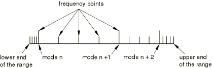
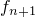
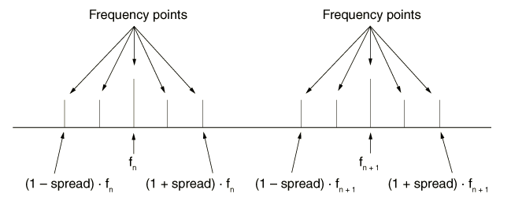
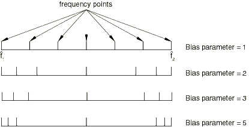
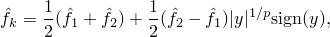
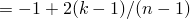
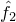

# 6.3.4 直接求解稳态动态分析


**产品：** Abaqus/Standard  Abaqus/CAE  


##### **参考文献**

- ["动态分析过程：概述，" 第6.3.1节](pt03ch06s03abo07.md)
- ["基于模态的稳态动态分析，" 第6.3.8节](pt03ch06s03at13.md)
- ["基于子空间的稳态动态分析，" 第6.3.9节](pt03ch06s03at14.md)
- ["定义分析，" 第6.1.2节](pt03ch06s01abo05.md)
- ["常规和线性扰动过程，" 第6.1.3节](pt03ch06s01aus44.md)
- [*STEADY STATE DYNAMICS](../key/key-link.md#usb-kws-hsteadystdyn)
- ["在Abaqus/CAE用户指南的配置线性扰动分析过程，" 第14.11.2节中配置直接求解稳态动态过程"](../usi/usi-link.md#usi-sim-configure-steadystatedirect)
- ["创建和修改预定义条件，" 第16.4节](../usi/usi-link.md#usi-lbi-edit-editors)

### 概述

直接求解稳态动态分析：
- 用于计算系统对谐波激励的稳态动态线性化响应；
- 是一个线性扰动过程；
- 直接以模型物理自由度的方式计算响应；
- 是基于模态的稳态动态分析的替代方法，在基于模态的稳态动态分析中，系统的响应是基于特征模态计算的；
- 计算成本比基于模态或基于子空间的稳态动力学更高；
- 比基于模态或基于子空间的稳态动力学更准确，特别是在结构中存在显著频率依赖性材料阻尼或粘弹性材料行为时；
- 能够将激励频率偏向于产生响应峰的近似值。

### 引言

稳态动态分析提供了系统由于给定频率的谐波激励而产生的响应的稳态幅值和相位。通常，这种分析是通过在系列不同频率上施加荷载并记录响应来进行的频率扫描；在Abaqus/Standard中，直接求解稳态动态过程执行此频率扫描。在直接求解稳态分析中，稳态谐响应是使用系统的质量、阻尼和刚度矩阵直接以模型的物理自由度计算的。

在定义直接求解稳态动态步骤时，您需要指定感兴趣的频率范围以及每个范围内需要结果的频率数目（包括范围的边界频率）。此外，您可以指定要使用的频率间距类型（线性或对数），如下所述（["选择频率间距"](pt03ch06s03at09.md#usb-anl-asteadystdyndirect-freqspace)"）。对数频率间距是默认值。频率以周期/时间为单位。

需要结果的频率点可以沿频率轴等距分布（按线性或对数标度），或者可以通过引入偏置参数向用户定义频率范围的端部聚集（如下所述）。

直接求解稳态分析过程可用于以下无法提取特征值的情况（因此基于模态的稳态动力学过程不适用）：
- 非对称刚度；
- 必须包含除模态阻尼外的任何形式的阻尼；
- 必须考虑粘弹性材料特性。

虽然此过程中的响应是线性的，但先前的响应可以是非线性的。如果在直接求解稳态动态过程之前的任何常规分析步骤中包含了非线性几何效应（["常规和线性扰动过程，" 第6.1.3节"](pt03ch06s01aus44.md)），则初始应力效应（应力刚化）以及荷载刚度效应将包含在稳态动力学响应中。

| **输入文件用法：** | ``` [*STEADY STATE DYNAMICS](../key/key-link.md#usb-kws-hsteadystdyn), DIRECT ``` |
| --- | --- |

| **Abaqus/CAE用法：** | 步骤模块：**创建步骤**：**线性扰动**：**稳态动力学，直接** |
| --- | --- |

#### 忽略阻尼

如果可以忽略阻尼项，您可以指定对实数而非复数系统矩阵进行分解，这可以显著减少计算时间。阻尼在下面讨论。

| **输入文件用法：** | ``` [*STEADY STATE DYNAMICS](../key/key-link.md#usb-kws-hsteadystdyn), DIRECT, REAL ONLY ``` |
| --- | --- |

| **Abaqus/CAE用法：** | 步骤模块：**创建步骤**：**线性扰动**：**稳态动力学，直接**：**仅计算实数响应** |
| --- | --- |

#### 为输出选择频率区间类型

直接求解稳态动态步骤的输出允许三种类型的频率区间。如果特征频率提取步骤在直接求解稳态动态步骤之前，您可以選擇范围或特征频率类型的频率区间；否则，只能使用范围类型。

##### 使用用户定义的点数和可选偏置函数划分指定频率范围

对于范围类型的频率区间（默认值），使用用户定义的点数和可选偏置函数划分感兴趣的指定频率范围。

| **输入文件用法：** | ``` [*STEADY STATE DYNAMICS](../key/key-link.md#usb-kws-hsteadystdyn), DIRECT, INTERVAL=RANGE ``` |
| --- | --- |

| **Abaqus/CAE用法：** | 步骤模块：**创建步骤**：**线性扰动**：**稳态动力学，直接**：关闭**使用特征频率细分每个频率范围** |
| --- | --- |

##### 使用系统的特征频率指定频率范围

如果直接求解稳态动态分析之前有特征频率提取步骤，您可以选择特征频率类型的频率区间。则在每个频率范围内存在以下区间：
- 第一个区间：从给定频率范围的下限到该范围内的第一个特征频率。
- 中间区间：从特征频率到特征频率。
- 最后一个区间：从该范围内的最高特征频率到频率范围的上限。

对于每个这些区间，使用用户定义的点数（包括区间的边界频率）和可选偏置函数确定计算结果的频率。[图6.3.4-1](pt03ch06s03at09.md#eigen-freq-range-div-ssdd)展示了5个计算点和等于1的偏置参数的频率范围划分。

| **输入文件用法：** | ``` [*STEADY STATE DYNAMICS](../key/key-link.md#usb-kws-hsteadystdyn), DIRECT, INTERVAL=EIGENFREQUENCY ``` |
| --- | --- |

| **Abaqus/CAE用法：** | 步骤模块：**创建步骤**：**线性扰动**：**稳态动力学，直接**：**使用特征频率细分每个频率范围** |
| --- | --- |

**图6.3.4-1** 特征频率类型区间和5个计算点的范围划分。



##### 通过频率扩展指定频率范围

如果直接求解稳态动态分析之前有特征频率提取步骤，您可以选择扩展类型的频率区间。在这种情况下，围绕频率范围内每个特征频率存在区间。对于每个区间，使用用户定义的点数（包括区间的边界频率）等距计算结果的频率。最小频率点数为3。如果用户定义的值小于3（或省略），则假定默认值为3。[图6.3.4-2](pt03ch06s03at09.md#spread-freq-range-div)展示了5个计算点的频率范围划分。

偏置参数不支持扩展类型的频率区间。

**图6.3.4-2** 扩展类型区间和5个计算点的范围划分。和是系统的特征频率。



| **输入文件用法：** | ``` [*STEADY STATE DYNAMICS](../key/key-link.md#usb-kws-hsteadystdyn), DIRECT, INTERVAL=SPREAD *lwr_freq, upr_freq, numpts, bias_param, freq_scale_factor, spread* ``` |
| --- | --- |

| **Abaqus/CAE用法：** | 您不能在Abaqus/CAE中通过频率扩展指定频率范围。 |
| --- | --- |

#### 选择频率间距

直接求解稳态动态步骤允许两种类型的频率间距。对于对数频率间距（默认值），使用对数标度划分感兴趣的指定频率范围。或者，如果需要线性标度，可以使用线性频率间距。

| **输入文件用法：** | 使用以下任一选项： |
| --- | --- |
|  | ``` [*STEADY STATE DYNAMICS](../key/key-link.md#usb-kws-hsteadystdyn), DIRECT, FREQUENCY SCALE=LOGARITHMIC [*STEADY STATE DYNAMICS](../key/key-link.md#usb-kws-hsteadystdyn), DIRECT, FREQUENCY SCALE=LINEAR ``` |

| **Abaqus/CAE用法：** | 步骤模块：**创建步骤**：**线性扰动**：**稳态动力学，直接**：**标度：对数**或**线性** |
| --- | --- |

#### 请求多个频率范围

您可以为直接求解稳态动态步骤请求多个频率范围或多个单一频率点。

| **输入文件用法：** | ``` [*STEADY STATE DYNAMICS](../key/key-link.md#usb-kws-hsteadystdyn), DIRECT *lwr_freq1, upr_freq1, numpts1, bias_param1, freq_scale_factor1* *lwr_freq2, upr_freq2, numpts2, bias_param2, freq_scale_factor2* ... *single_freq1* *single_freq2* ... ``` |
| --- | --- |
|  | 根据需要重复数据行。 |

| **Abaqus/CAE用法：** | 步骤模块：**创建步骤**：**线性扰动**：**稳态动力学，直接**：**数据**：在表格中输入数据，并根据需要添加行 |
| --- | --- |

### 偏置参数

偏置参数可用于提供更紧密的结果点间距，可以朝向每个频率区间的中间或端部。[图6.3.4-3](pt03ch06s03at09.md#biased-frequency-spacing-ssdd)显示了几种偏置参数对频率间距影响的示例。

**图6.3.4-3** 对于点数为的偏置参数对频率间距的影响。



直接求解稳态动力学使用的偏置公式为



其中

*y*

；

*n*

为要给出结果的频率点数；

*k*

为其中一个频率点（）；


为频率范围的下限；



为范围的上限；


为给出第*k*个结果的频率；

*p*

为偏置参数值；以及


为频率或频率的对数，取决于为频率标度选择的值。

大于1.0的偏置参数*p*向频率区间的端部提供更紧密的结果点间距，而小于1.0的值向频率区间的中间提供更紧密的间距。范围频率区间的默认偏置参数为1.0，特征频率区间为3.0。

### 频率标度因子

频率标度因子可用于缩放频率点。除频率范围的下限和上限外，所有频率点都乘以此因子。此标度因子仅在按系统的特征频率指定频率区间时才能使用（见上文["使用系统的特征频率指定频率范围"](pt03ch06s03at09.md#usb-anl-specify-direct)"）。

### 阻尼

如果没有阻尼，当激励频率等于结构的特征频率时，结构的响应将是无界的。要获得定量的准确结果，特别是在自然频率附近，准确指定阻尼特性至关重要。各种阻尼选项在["材料阻尼，" 第26.1.1节](pt05ch26s01abm51.md)中讨论。

在直接求解稳态动力学中，阻尼可以由以下方式产生：
- 减振器（见["减振器，" 第32.2.1节"](pt06ch32s02alm38.md)），
- 与材料和单元相关的"瑞利"阻尼（见["材料阻尼，" 第26.1.1节"](pt05ch26s01abm51.md)），
- 与声学元件相关的阻尼（见["声学介质，" 第26.3.1节"](pt05ch26s03abm58.md)；["无限元，" 第28.3.1节"](pt06ch28s03alm03.md)；以及["声学和冲击载荷，" 第34.4.6节"](pt07ch34s04aus125.md)），
- 结构阻尼（见["动态分析中的阻尼" "动态分析过程：概述，" 第6.3.1节"](pt03ch06s03abo07.md#usb-anl-adynamicproc-damp)），以及
- 材料定义中包含的粘弹性（见["频域粘弹性，" 第22.7.2节"](pt05ch22s07abm13.md)）。

当对纯实数系统矩阵进行分解时，所有形式的阻尼都被忽略，包括无限元上的安静边界和声学元上的非反射边界。

### 带滑动摩擦的接触条件

Abaqus/Standard自动检测在先前步骤中由于参考框架运动或传输速度施加的速度差异而滑动的接触节点。在这些节点上，切向自由度不受约束，摩擦效应将导致刚度矩阵的非对称贡献。在其他接触节点上，切向自由度将受到约束。

在施加速度差的接触节点上，摩擦会产生阻尼项。有两种摩擦引起的阻尼效应。第一种效应是由摩擦力稳定垂直于滑动方向的振动产生的。这种效应仅存在于三维分析中。第二种效应是由速度相关的摩擦系数引起的。如果摩擦系数随速度减小（通常情况），该效应是 destabilizing，也称为"负阻尼"。更多详情，见["库仑摩擦，" 第5.2.3节"](../stm/stm-link.md#stm-ifc-coulombfric)。直接求解稳态动力学分析允许您将这些摩擦引起的贡献包含在阻尼矩阵中。

| **输入文件用法：** | ``` [*STEADY STATE DYNAMICS](../key/key-link.md#usb-kws-hsteadystdyn), DIRECT, FRICTION DAMPING=YES ``` |
| --- | --- |

| **Abaqus/CAE用法：** | 步骤模块：**创建步骤**：**线性扰动**：**稳态动力学，直接**：**包含摩擦引起的阻尼效应** |
| --- | --- |

### 初始条件

基态是稳态动态步骤之前最后一个常规分析步骤结束时模型的当前状态。如果分析的第一个步骤是扰动步骤，则基态由初始条件决定（["Abaqus/Standard和Abaqus/Explicit中的初始条件，" 第34.2.1节"](pt07ch34s02aus116.md)）。直接定义解变量（如速度）的初始条件定义不能在稳态动态分析中使用。

### 边界条件

在稳态动态分析中，任何自由度的实部和虚部同时被约束或不受约束；物理上不可能出现一部分被约束而另一部分不受约束的情况。Abaqus/Standard将自动约束自由度的实部和虚部，即使只明确指定了其中一部分。未指定的部分将被假定为零扰动幅值。

在直接求解稳态分析中，边界条件可以施加于任何位移或旋转自由度（1-6）。见["Abaqus/Standard和Abaqus/Explicit中的边界条件，" 第34.3.1节"](pt07ch34s03aus118.md)。这些边界条件将随时间正弦变化。您可以分别指定边界条件的实部（同相位）和虚部（异相位）。

| **输入文件用法：** | 使用以下任一选项定义边界条件的实部（同相位）： |
| --- | --- |
|  | ``` [*BOUNDARY](../key/key-link.md#usb-kws-hboundary) [*BOUNDARY](../key/key-link.md#usb-kws-hboundary), REAL ``` 使用以下选项定义边界条件的虚部（异相位）： ``` [*BOUNDARY](../key/key-link.md#usb-kws-hboundary), IMAGINARY ``` |

| **Abaqus/CAE用法：** | 载荷模块：边界条件编辑器：*实部（同相位）* + *虚部（异相位）* **i** |
| --- | --- |

#### 频率依赖性边界条件

振幅定义可用于将边界条件的振幅指定为频率的函数（["振幅曲线，" 第34.1.2节"](pt07ch34s01aus115.md)）。

| **输入文件用法：** | 使用以下两个选项： |
| --- | --- |
|  | ``` [*AMPLITUDE](../key/key-link.md#usb-kws-mamplitude), NAME=*name* [*BOUNDARY](../key/key-link.md#usb-kws-hboundary), REAL or IMAGINARY, AMPLITUDE=*name* ``` |

| **Abaqus/CAE用法：** | 载荷或相互作用模块：**创建振幅**：**名称：** *name* |
| --- | --- |
|  | 载荷模块：边界条件编辑器：*实部（同相位）* + *虚部（异相位）* **i**：**振幅：** *name* |

### 载荷

在稳态动态分析中可以施加以下载荷：
- 集中节点力可以施加于位移自由度（1-6）；见["集中载荷，" 第34.4.2节"](pt07ch34s04aus121.md)。
- 可以施加分布式压力载荷或体力；见["分布载荷，" 第34.4.3节"](pt07ch34s04aus122.md)。特定单元可用的分布载荷类型在[第六部分，"单元"](pt06.md)中有描述。
- 可以施加入射波载荷；见["声学和冲击载荷，" 第34.4.6节"](pt07ch34s04aus125.md)。

这些载荷假定在用户指定的频率范围内随时间正弦变化。载荷以实部和虚部给出。

科里奥利分布载荷对整体方程组添加了一个虚部反对称贡献。此贡献目前仅在实体和桁架单元中得到考虑，并通过为该步骤使用非对称矩阵存储和求解方案来激活（["定义分析，" 第6.1.2节"](pt03ch06s01abo05.md)）。

入射波载荷可用于模拟来自不同平面或球面源或来自扩散场的声波。

流体通量载荷不能在稳态动态分析中使用。

| **输入文件用法：** | 使用以下任一选项定义载荷的实部（同相位）： |
| --- | --- |
|  | ``` [*CLOAD](../key/key-link.md#usb-kws-hcload) *or* [*DLOAD](../key/key-link.md#usb-kws-hdload) [*CLOAD](../key/key-link.md#usb-kws-hcload) *or* [*DLOAD](../key/key-link.md#usb-kws-hdload), REAL ``` 使用以下任一选项定义载荷的虚部（异相位）： ``` [*CLOAD](../key/key-link.md#usb-kws-hcload) *or* [*DLOAD](../key/key-link.md#usb-kws-hdload), IMAGINARY ``` |

| **Abaqus/CAE用法：** | 载荷模块：载荷编辑器：*实部（同相位）* + *虚部（异相位）* **i** |
| --- | --- |

#### 频率依赖性载荷

振幅定义可用于将载荷的振幅指定为频率的函数（["振幅曲线，" 第34.1.2节"](pt07ch34s01aus115.md)）。

| **输入文件用法：** | 使用以下两个选项： |
| --- | --- |
|  | ``` [*AMPLITUDE](../key/key-link.md#usb-kws-mamplitude), NAME=*name* [*CLOAD](../key/key-link.md#usb-kws-hcload) *or* [*DLOAD](../key/key-link.md#usb-kws-hdload), REAL or IMAGINARY, AMPLITUDE=*name* ``` |

| **Abaqus/CAE用法：** | 载荷或相互作用模块：**创建振幅**：**名称：** *name* |
| --- | --- |
|  | 载荷模块：载荷编辑器：*实部（同相位）* + *虚部（异相位）* **i**：**振幅：** *name* |

### 预定义场

可以在直接求解稳态动态分析中指定预定义温度场（见["预定义场，" 第34.6.1节"](pt07ch34s06aus128.md)），如果材料定义中包含热膨胀（["热膨胀，" 第26.1.2节"](pt05ch26s01abm52.md)），将产生随时间正弦变化的热应变。其他预定义场被忽略。

### 材料选项

与任何动态分析过程一样，必须在需要动态响应的模型各个独立部件的区域中指定质量或密度（["密度，" 第21.2.1节"](pt05ch21s02abm01.md)）。如果在希望忽略惯性效应的分析中，密度应设置为非常小的数字。以下材料特性在稳态动态分析期间不活跃：塑性和其他非弹性效应、速率依赖性材料特性、热特性（热膨胀除外）、质量扩散特性、电特性（压电分析中的电势除外）以及孔隙流体流动特性——见["常规和线性扰动过程，" 第6.1.3节"](pt03ch06s01aus44.md)。

粘弹性效应可以包含在直接求解稳态谐响应分析中。线性化粘弹性响应被认为是非线性预载状态（基于粘弹性组件中的纯弹性行为（长期响应）计算）的扰动。因此，振动幅值必须足够小，以便在问题的动态阶段材料响应可以作为预变形状态上的线性扰动处理。粘弹性频域响应在["频域粘弹性，" 第22.7.2节"](pt05ch22s07abm13.md)中描述。

### 单元

在稳态动态过程中可以使用Abaqus/Standard中以下任何可用单元：
- 应力/位移单元（带扭曲的广义轴对称单元除外）；
- 声学单元；
- 压电单元；或
- 静水压力流体单元。

 见["为分析类型选择合适的单元，" 第27.1.3节"](pt06ch27s01aus112.md)。

### 输出

在直接求解稳态动态分析中，应变（E）或应力（S）等输出变量的值是具有实部和虚部的复数。对于数据文件输出，第一行给出实部，而第二行列出虚部。结果和数据文件输出变量也可用于获取许多变量的幅值和相位（见["Abaqus/Standard输出变量标识符，" 第4.2.1节"](pt02ch04s02abv01.md)）。对于数据文件输出，第一行给出幅值，而第二行列出相位角。

以下变量专门为稳态动态分析提供：

单元积分点变量：

| PHS | 所有应力分量的幅值和相位角。 |
| --- | --- |

| PHE | 所有应变分量的幅值和相位角。 |
| --- | --- |

| PHEPG | 电势梯度向量的幅值和相位角。 |
| --- | --- |

| PHEFL | 电通量向量的幅值和相位角。 |
| --- | --- |

| PHMFL | 流体链接单元中质量流率的幅值和相位角。 |
| --- | --- |

| PHMFT | 流体链接单元中总质量流的幅值和相位角。 |
| --- | --- |

对于连接单元，以下单元输出变量可用：

| PHCTF | 连接总力的幅值和相位角。 |
| --- | --- |

| PHCEF | 连接弹性力的幅值和相位角。 |
| --- | --- |

| PHCVF | 连接粘性力的幅值和相位角。 |
| --- | --- |

| PHCRF | 连接反力的幅值和相位角。 |
| --- | --- |

| PHCSF | 连接摩擦力的幅值和相位角。 |
| --- | --- |

| PHCU | 连接相对位移的幅值和相位角。 |
| --- | --- |

| PHCCU | 连接构成本构位移的幅值和相位角。 |
| --- | --- |

| PHCV | 连接相对速度的幅值和相位角。 |
| --- | --- |

| PHCA | 连接相对加速度的幅值和相位角。 |
| --- | --- |

节点变量：

| PU | 节点处所有位移/旋转分量的幅值和相位角。 |
| --- | --- |

| PPOR | 节点处流体、孔隙或声压的幅值和相位角。 |
| --- | --- |

| PHPOT | 节点处电势的幅值和相位角。 |
| --- | --- |

| PRF | 节点处所有反力/力矩的幅值和相位角。 |
| --- | --- |

| PHCHG | 节点处无功电荷的幅值和相位角。 |
| --- | --- |

元素的的总动能（ELKE）在直接求解稳态动态分析中不可用于输出。

弹性应变能密度（SENER）在基于SIM的稳态动态分析中不可用于输出。

可以通过请求能量输出到数据、结果或输出数据库文件来获取整个模型的变量，如ALLIE（总应变能）（见["输出到数据和结果文件，" 第4.1.2节"](pt02ch04s01aus39.md)和["输出到输出数据库，" 第4.1.3节"](pt02ch04s01aus40.md)）。

### 输入文件模板

```
[*HEADING](../key/key-link.md#usb-kws-mheading)
 …
[*AMPLITUDE](../key/key-link.md#usb-kws-mamplitude), NAME=loadamp
*数据行用于定义作为频率函数的振幅曲线（周期/时间）*
**
[*STEP](../key/key-link.md#usb-kws-hstep), NLGEOM
*包含NLGEOM参数以便将应力刚化效应包含在稳态动态步骤中*
[*STATIC](../key/key-link.md#usb-kws-hstatic)
***任何可用于预加载结构的常规分析过程*
…
[*CLOAD](../key/key-link.md#usb-kws-hcload) and/or [*DLOAD](../key/key-link.md#usb-kws-hdload)
*数据行用于指定预载荷*
[*TEMPERATURE](../key/key-link.md#usb-kws-htemperature) and/or [*FIELD](../key/key-link.md#usb-kws-hfield)
*数据行用于定义用于预加载结构的预定义场的值*
[*BOUNDARY](../key/key-link.md#usb-kws-hboundary)
*数据行用于指定用于预加载结构的边界条件*
…
[*END STEP](../key/key-link.md#usb-kws-hendstep)
**
[*STEP](../key/key-link.md#usb-kws-hstep)
[*STEADY STATE DYNAMICS](../key/key-link.md#usb-kws-hsteadystdyn), DIRECT
*数据行用于指定频率范围和偏置参数*
[*BOUNDARY](../key/key-link.md#usb-kws-hboundary), REAL
*数据行用于指定实部（同相位）边界条件*
[*BOUNDARY](../key/key-link.md#usb-kws-hboundary), IMAGINARY
*数据行用于指定虚部（异相位）边界条件*
[*CLOAD](../key/key-link.md#usb-kws-hcload), AMPLITUDE=loadamp
*数据行用于指定随频率变化的正弦载荷、集中载荷*
[*CLOAD](../key/key-link.md#usb-kws-hcload) and/or [*DLOAD](../key/key-link.md#usb-kws-hdload)
*数据行用于指定随时间正弦变化的载荷*
…
[*END STEP](../key/key-link.md#usb-kws-hendstep)
```


