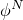
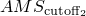
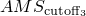
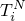
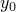
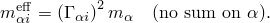

# 6.3.5 固有频率提取


**产品：** Abaqus/Standard  Abaqus/CAE  Abaqus/AMS  


##### **参考文献**

- ["定义分析，" 第6.1.2节](pt03ch06s01abo05.md)
- ["常规和线性扰动过程，" 第6.1.3节](pt03ch06s01aus44.md)
- ["动态分析过程：概述，" 第6.3.1节](pt03ch06s03abo07.md)
- [*FREQUENCY](../key/key-link.md#usb-kws-hfrequency)
- ["在Abaqus/CAE用户指南的配置线性扰动分析过程，" 第14.11.2节中配置频率过程"](../usi/usi-link.md#usi-sim-configure-frequency)

### 概述

频率提取过程：
- 执行特征值提取以计算系统的固有频率和相应的振型；
- 如果在基态中考虑了几何非线性，则将包括由于预载荷和初始条件引起的初始应力刚度和载荷刚度效应，以便可以对预载结构的小振动进行建模；
- 如果请求，将计算残余模态；
- 是一个线性扰动过程；
- 可以使用传统Abaqus软件架构执行，或者如果合适，使用高性能SIM架构（见["动态分析过程：概述，" 第6.3.1节中使用SIM架构进行模态叠加动态分析"](pt03ch06s03abo07.md#usb-anl-alineardynamics)）；以及
- 仅针对对称质量矩阵和刚度矩阵求解特征频率问题；如果需要非对称贡献（如载荷刚度），则必须使用复特征频率求解器。

### 特征值提取

无阻尼有限元模型固有频率的特征值问题为


其中


是质量矩阵（对称且正定）；


是刚度矩阵（如果基态包括非线性几何效应，则包括初始刚度效应）；



是特征向量（振动模式）；以及

*M*和*N*

是自由度。

当正定时，所有特征值为正。刚体模态和不稳定性导致是不定的。刚体模态产生零特征值。当包含初始应力效应时，会产生负特征值并出现不稳定。Abaqus/Standard仅针对对称矩阵求解特征频率问题。

### 选择特征值提取方法

Abaqus/Standard提供三种特征值提取方法：
- Lanczos
- 自动多级子结构（AMS），Abaqus/Standard的附加分析能力
- 子空间迭代

此外，您必须考虑将用于后续模态叠加过程的软件架构。架构选择对频率提取过程的影响很小，但SIM架构可以为后续基于模态的稳态或瞬态动态过程提供显著的性能提升（见["动态分析过程：概述，" 第6.3.1节中使用SIM架构进行模态叠加动态分析"](pt03ch06s03abo07.md#usb-anl-alineardynamics)）。您在频率提取过程中使用的架构将用于所有后续基于模态的线性动态过程；在分析过程中不能切换架构。不同特征求解器使用的软件架构在[表6.3.5-1](pt03ch06s03at10.md#usb-anl-afreqextraction-arch)中概述。

**表6.3.5-1** 不同特征求解器可用的软件架构。
| 软件架构 | Lanczos | AMS | 子空间迭代 |
| --- | --- | --- | --- |
| 传统 |  |  |  |
| SIM |  |  |  |

具有传统架构的Lanczos求解器是默认的特征值提取方法，因为它具有最全面的能力。然而，Lanczos方法通常比AMS方法慢。AMS特征求解器的速度优势在您需要大量特征模态且具有许多自由度的系统时尤为明显。然而，AMS方法有以下限制：
- 对基于SIM的线性动态过程的所有限制也适用于基于AMS特征求解器计算的模态的基于模态的线性动态分析。见["动态分析过程：概述，" 第6.3.1节中使用SIM架构进行模态叠加动态分析"](pt03ch06s03abo07.md#usb-anl-alineardynamics)，了解更多详情。
- AMS特征求解器不计算复合模态阻尼因子、参与因子或模态有效质量。但是，如果主基运动需要参与因子，它们将被计算，但不会写入打印数据（`.dat`）文件。
- 您不能在包含压电单元的分析中使用AMS特征求解器。
- 您不能在AMS频率提取步骤中请求输出到结果（`.fil`）文件。

如果您的模型有许多自由度且这些限制是可接受的，您应该使用AMS特征求解器。否则，您应该使用Lanczos特征求解器。Lanczos特征求解器和子空间迭代方法在["特征值提取，" 第2.5.1节"](../stm/stm-link.md#stm-anl-eigenextract)中描述。

#### Lanczos特征求解器

对于Lanczos方法，您需要提供最大感兴趣频率或所需的特征值数目；Abaqus/Standard将确定合适的块大小（尽管如果需要您可以覆盖此选择）。如果同时指定了最大感兴趣频率和所需的特征值数目，但实际特征值数目被低估了，Abaqus/Standard将发出相应的警告消息；可以通过重新启动频率提取来找到剩余的特征模态。

您还可以指定最小感兴趣频率；Abaqus/Standard将提取特征值，直到在给定范围内提取了所请求的特征值数目，或者该范围内的所有频率都被提取了。

关于将SIM架构与Lanczos特征求解器一起使用的信息，见["动态分析过程：概述，" 第6.3.1节中使用SIM架构进行模态叠加动态分析"](pt03ch06s03abo07.md#usb-anl-alineardynamics)。

| **输入文件用法：** | ``` [*FREQUENCY](../key/key-link.md#usb-kws-hfrequency), EIGENSOLVER=LANCZOS ``` |
| --- | --- |

| **Abaqus/CAE用法：** | 步骤模块：****步骤********创建****：**频率**：**基本**：**特征求解器**：** Lanczos** |
| --- | --- |

##### 为Lanczos方法选择块大小

通常，Lanczos方法的块大小应等于最大预期特征值多重性（即具有相同频率的最大模态数目）。不建议使用大于10的块大小。如果所请求的特征值数目为*n*，默认块大小为（7，*n*）的最小值。选择7作为块大小对于带刚体模态的问题是有效的。每个Lanczos运行中的块Lanczos步数通常由Abaqus/Standard确定，但可以由您更改。一般来说，如果某种特定类型的特征问题收敛缓慢，提供更多的块Lanczos步将降低分析成本。另一方面，如果您知道某种特定问题收敛迅速，提供更少的块Lanczos步将减少使用的内存量。默认值是

| 块大小 | 最大块Lanczos步数 |
| --- | --- |
| 1 | 80 |
| 2 | 50 |
| 3 | 45 |
| ≥ 4 | 35 |

#### 自动多级子结构（AMS）特征求解器

对于AMS方法，您只需指定最大感兴趣频率（全局频率），Abaqus/Standard将提取该频率以下的所有模态。您还可以指定最小感兴趣频率和/或请求的模态数目。但是，指定这些值不会影响特征求解器提取的模态数目；它只会影响为输出或后续模态分析存储的模态数目。

AMS特征求解器的执行可以通过指定三个参数来控制：、和。这三个参数乘以最大感兴趣频率定义三个截止频率。（默认值为5）控制还原阶段中子结构特征问题的截止频率，而和（默认值分别为1.7和1.1）控制在还原特征问题阶段用于定义起始子空间的截止频率。通常，增加和的值会提高结果的准确性，但可能影响分析性能。

##### 请求所有节点的特征向量

默认情况下，AMS特征求解器在模型的每个节点上计算特征向量。

| **输入文件用法：** | ``` [*FREQUENCY](../key/key-link.md#usb-kws-hfrequency), EIGENSOLVER=AMS ``` |
| --- | --- |

| **Abaqus/CAE用法：** | 步骤模块：****步骤********创建****：**频率**：**基本**：**特征求解器**：**AMS** |
| --- | --- |

##### 仅在指定节点请求特征向量

或者，您可以指定一个节点集，特征向量将仅在属于该节点集的节点上计算和存储。您指定的节点集必须包含在后续模态分析中施加载荷或请求输出的所有节点（这包括任何重新启动的分析）。如果请求元素输出或施加基于元素的载荷，则相关单元的节点也必须包含在此节点集中。仅在选定节点上计算特征向量可以提高性能并减少存储的数据量。因此，建议对大型问题使用此选项。Abaqus/Standard可以自动选择需要包含在节点集中的所有节点。这些节点是
- 在后续模态过程中施加集中载荷的节点，
- 在特征值提取分析或后续模态过程中请求输出的节点，
- 请求残余向量的节点，
- 施加分布载荷的单元的节点，
- 具有频率依赖性材料特性的单元的节点，以及
- 在特征值提取分析或后续模态过程中请求输出的单元的节点。

| **输入文件用法：** | 使用以下选项指定节点集： |
| --- | --- |
|  | ``` [*FREQUENCY](../key/key-link.md#usb-kws-hfrequency), EIGENSOLVER=AMS, NSET=*name* ``` 使用以下选项允许Abaqus/Standard自动选择节点： ``` [*FREQUENCY](../key/key-link.md#usb-kws-hfrequency), EIGENSOLVER=AMS, NSET ``` |

| **Abaqus/CAE用法：** | 您只能在Abaqus/CAE中通过指定节点集来请求特定节点的特征向量。 |
| --- | --- |
|  | 步骤模块：****步骤********创建****：**频率**：**基本**：**特征求解器**：**AMS**：**限制保存特征向量的区域**，选择节点集 |

##### 控制AMS特征求解器

AMS方法包括以下三个阶段：

**还原阶段**：在此阶段，Abaqus/Standard使用多级子结构技术以允许非常高效的还原系统特征问题求解的方式还原完整系统。该方法结合了基于多级超节点消除树的稀疏分解和每个超节点上的局部特征问题求解。从最低级超节点开始，我们使用Craig-Bampton子结构还原技术来在消除树中向上推进时逐步减小系统的大小。在每个超节点上，基于连接到下一级超节点的自由度（这些是局部保留或"固定界面"自由度）获得局部特征问题求解。在还原阶段结束时，完整系统已被还原，使得还原刚度矩阵是对角的，还原质量矩阵具有单位对角值，但包含表示超节点之间耦合的非零值块。还原阶段的成本取决于系统大小和提取的特征值数目（通过指定所需最高特征频率间接控制的特征值数目）。您可以通过参数在还原阶段进行成本和准确性之间的权衡。此参数乘以为完整模型指定的最高特征频率，得出在局部超节点特征问题求解中提取的最高特征频率。增加的值会提高还原的准确性，因为保留了更多局部特征模态。然而，保留模态数目的增加也增加了还原特征问题求解阶段的成本，这将在下面讨论。

**还原特征问题求解阶段**：在此阶段，Abaqus/Standard计算从前一阶段产生的还原系统的特征问题求解。虽然还原系统通常比原始系统小两个数量级，但通常仍然太大而无法直接求解。因此，系统主要通过截断保留的特征模态进一步还原，然后使用单个子空间迭代步骤求解。两个AMS参数，和，定义了子空间迭代步骤的起始子空间。这些参数的默认值经过仔细选择，在大多数情况下提供准确的结果。当需要更准确的解决方案时，推荐的程序是从各自的默认值按比例增加两个参数。

**恢复阶段**：在此阶段，使用还原问题的特征向量和局部子结构模态恢复原始系统的特征向量。如果您请求在指定节点恢复，则仅在这些节点上计算特征向量。

#### 子空间迭代方法

对于子空间迭代过程，您只需指定所需的特征值数目；Abaqus/Standard为迭代选择合适数量的向量。如果请求子空间迭代技术，您还可以指定最大感兴趣频率；Abaqus/Standard提取特征值，直到提取了所需数目的特征值或最后提取的频率超过最大感兴趣频率。

| **输入文件用法：** | ``` [*FREQUENCY](../key/key-link.md#usb-kws-hfrequency), EIGENSOLVER=SUBSPACE ``` |
| --- | --- |

| **Abaqus/CAE用法：** | 步骤模块：****步骤********创建****：**频率**：**基本**：**特征求解器**：**子空间** |
| --- | --- |

### 结构-声学耦合

结构-声学耦合影响系统的固有频率响应。在Abaqus中，AMS特征求解器和Lanczos特征求解器可以提取耦合模态以完全包含此效应。子空间特征求解器为计算模态和频率的目的忽略耦合效应；模态和频率使用结构-声学耦合表面上的自然边界条件计算。默认情况下，AMS特征求解器也是如此；耦合被投影到模态空间并存储以供以后使用。

#### 使用Lanczos特征求解器的结构-声学耦合

如果模型中存在结构-声学耦合且使用Lanczos方法，Abaqus/Standard默认提取耦合模态。因为这些模态完全考虑了耦合，它们代表了后续模态过程的数学上最优基础。这种效应在钢壳和水等强耦合系统中最为明显。但是，耦合的结构-声学模态不能在后续随机响应或响应谱分析中使用。您可以使用声学-结构相互作用单元（见["声学界面单元，" 第32.13.1节"](pt06ch32s13alm58.md)）或基于表面的绑定约束（见["声学、冲击和耦合声-结构分析，" 第6.10.1节"](pt03ch06s10at29.md)）来定义耦合。可以在提取声学和结构模态时忽略耦合；在这种情况下，耦合边界在结构侧被视为自由牵引，在声学侧被视为刚性。

对于基于SIM架构使用Lanczos特征求解器的频率提取，还可以将结构-声学耦合算子投影到特征向量子空间。模态使用结构侧耦合边界上的自由牵引边界条件和声学侧上的刚性边界条件计算。结构-声学耦合算子（见["声学、冲击和耦合声-结构分析，" 第6.10.1节"](pt03ch06s10at29.md)）默认投影到特征向量子空间。来自在结构和声学表面之间定义的基于表面的绑定约束的全局算子贡献被组装成投影到模态形状上的全局矩阵，并用于后续基于SIM的模态动态过程。

| **输入文件用法：** | 使用以下选项在频率提取期间考虑结构-声学耦合： |
| --- | --- |
|  | ``` [*FREQUENCY](../key/key-link.md#usb-kws-hfrequency), EIGENSOLVER=LANCZOS, ACOUSTIC COUPLING=ON (default) ``` 使用以下选项在频率提取期间将结构-声学耦合投影到非耦合特征模态： ``` [*FREQUENCY](../key/key-link.md#usb-kws-hfrequency), EIGENSOLVER=LANCZOS, SIM, ACOUSTIC COUPLING=PROJECTION (仅当Lanczos特征求解器基于SIM架构时) ``` 使用以下选项在频率提取期间忽略结构-声学耦合： ``` [*FREQUENCY](../key/key-link.md#usb-kws-hfrequency), EIGENSOLVER=LANCZOS, ACOUSTIC COUPLING=OFF ``` |

| **Abaqus/CAE用法：** | 使用以下选项在频率提取期间考虑结构-声学耦合： |
| --- | --- |
|  | 步骤模块：****步骤********创建****：**频率**：**基本**：**特征求解器：Lanczos**，切换**包含适用的声学-结构耦合** 使用以下选项在频率提取期间将结构-声学耦合投影到非耦合特征模态： 步骤模块：****步骤********创建****：**频率**：**基本**：**特征求解器：Lanczos**，切换**使用基于SIM的线性动力学过程**，切换**在适用处投影声学-结构耦合** 使用以下选项在频率提取期间忽略结构-声学耦合： 步骤模块：****步骤********创建****：**频率**：**基本**：**特征求解器：Lanczos**，关闭**包含声学-结构耦合** |

#### 使用AMS特征求解器的结构-声学耦合

对于使用AMS特征求解器的频率提取，默认使用结构侧耦合边界上的自由牵引边界条件和声学侧上的刚性边界条件计算模态。结构-声学耦合算子（见["声学、冲击和耦合声-结构分析，" 第6.10.1节"](pt03ch06s10at29.md)）默认投影到特征向量子空间。来自在结构和声学表面之间定义的基于表面的绑定约束的全局算子贡献被组装成投影到模态形状上的全局矩阵，并用于后续基于SIM的模态动态过程。

 对于使用AMS特征求解器的频率提取，Abaqus/Standard还可以提取耦合模态。因为这些模态完全考虑了耦合，它们代表了后续模态过程的数学上最优基础。这种效应在钢壳和水等强耦合系统中最为明显。但是，使用AMS特征求解器提取耦合结构-声学模态比默认选项（其中耦合算子投影到非耦合特征向量的子空间）在计算上更昂贵。

用户定义的声学-结构相互作用单元（见["声学界面单元，" 第32.13.1节"](pt06ch32s13alm58.md)）不能在AMS特征值提取分析中使用。

| **输入文件用法：** | 使用以下选项将结构-声学耦合算子投影到特征向量子空间： |
| --- | --- |
|  | ``` [*FREQUENCY](../key/key-link.md#usb-kws-hfrequency), EIGENSOLVER=AMS, ACOUSTIC COUPLING=PROJECTION (default) ``` 使用以下选项禁用结构-声学耦合算子的投影： ``` [*FREQUENCY](../key/key-link.md#usb-kws-hfrequency), EIGENSOLVER=AMS, ACOUSTIC COUPLING=OFF ``` 使用以下选项提取耦合结构-声学特征模态： ``` [*FREQUENCY](../key/key-link.md#usb-kws-hfrequency), EIGENSOLVER=AMS, ACOUSTIC COUPLING=ON ``` |

| **Abaqus/CAE用法：** | 使用以下选项将结构-声学耦合算子投影到特征向量子空间： |
| --- | --- |
|  | 步骤模块：****步骤********创建****：**频率**：**基本**：**特征求解器：AMS**，切换**在适用处投影声学-结构耦合** 使用以下选项禁用结构-声学耦合算子的投影： 步骤模块：****步骤********创建****：**频率**：**基本**：**特征求解器：AMS**，关闭**在适用处投影声学-结构耦合** 在Abaqus/CAE中不支持在AMS特征分析期间请求耦合结构-声学模态。 |

#### 为声学模态指定频率范围

因为结构-声学耦合可以在AMS和基于SIM的Lanczos特征分析期间被忽略，计算的共振原则上将高于完全耦合系统的共振。这可以理解为是在结构阶段忽略流体质量的结果，反之亦然。对于常见的金属和空气情况，结构共振可能相对不受影响；然而，在特征分析期间一些在耦合响应中重要的声学模态可能由于空气的向上频率偏移而被省略。因此，Abaqus允许您指定一个乘数，以便分析中的最大声学频率被视为高于结构最大值。

| **输入文件用法：** | 使用以下任一选项： |
| --- | --- |
|  | ``` [*FREQUENCY](../key/key-link.md#usb-kws-hfrequency), EIGENSOLVER=AMS , , , , , , *acoustic range factor* ``` 或 ``` [*FREQUENCY](../key/key-link.md#usb-kws-hfrequency), EIGENSOLVER=LANCZOS, SIM, ACOUSTIC COUPLING=PROJECTION , , , , , , *acoustic range factor* ``` |

| **Abaqus/CAE用法：** | 步骤模块：****步骤********创建****：**频率**：**基本**：**特征求解器：AMS**，**声学范围因子**：*acoustic range factor* |
| --- | --- |
|  | 在Abaqus/CAE中不支持在Lanczos特征分析期间为声学模态指定频率范围。 |

#### 流体运动对声学系统固有频率分析的影响

要从其中规定了使用声学流速的流体运动的纯声学或耦合结构-声学系统中提取固有频率，可以使用Lanczos方法或复特征值提取过程。在前一种情况下，Abaqus提取纯实数特征值，仅考虑流体运动对声学刚度矩阵的影响。因此，这些结果主要作为后续线性扰动过程的基础。当使用复特征值提取过程时，流体运动效应被完整包含；即，声学刚度和阻尼矩阵被包含在分析中。

### 频率偏移

对于Lanczos和子空间迭代特征求解器，您可以指定正或负偏移的平方频率*S*。当关注特定频率或需要未约束结构或使用次基运动（大质量方法）的结构的固有频率时，此功能很有用。在后一种情况下，从零（刚体模态的频率）偏移将避免奇异性问题或大质量方法的舍入误差；通常使用负频率偏移。默认是无偏移。

如果Lanczos特征求解器正在使用且用户指定的偏移超出请求的频率范围，偏移将自动调整到接近请求范围的值。

### 归一化

对于Lanczos和子空间迭代特征求解器，位移和质量特征向量归一化都可用。位移归一化是默认值。基于SIM的固有频率提取仅支持质量归一化。

特征向量归一化类型的选择不影响后续模态动态步骤的结果（见["杆的线性动态分析，" 第1.4.9节"](../bmk/bmk-link.md#bmk-anl-rodlindynamic)）。归一化类型仅决定特征向量的表示方式。

此外，Lanczos和子空间迭代特征求解器会自动计算广义质量、参与因子、有效质量和每个模态的复合模态阻尼；因此，这些变量可用于后续线性动态分析。AMS特征求解器仅计算广义质量。

#### 位移归一化

如果选择位移归一化，特征向量被归一化，使得每个向量中的最大位移条目为1。如果位移可以忽略不计，如扭转模态，则特征向量被归一化，使得每个向量中的最大旋转条目为1。在耦合声学-结构提取中，如果特定特征向量中的位移和旋转与声学压力相比较小，则特征向量被归一化，使得声学压力最大值为1。归一化在恢复之前通过多点约束或方程约束消除的从属自由度之前完成。因此，这些自由度可能具有大于1的值。

| **输入文件用法：** | ``` [*FREQUENCY](../key/key-link.md#usb-kws-hfrequency), NORMALIZATION=DISPLACEMENT ``` |
| --- | --- |

| **Abaqus/CAE用法：** | 步骤模块：****步骤********创建****：**频率**：**其他**：**按以下方式归一化特征向量**：**位移** |
| --- | --- |

#### 质量归一化

或者，可以对特征向量进行归一化，使得每个向量的广义质量为1。

与模态关联的"广义质量"为


其中是结构的质量矩阵，是模态的特征向量。上标*N*和*M*指有限元模型的自由度。

如果特征向量按质量归一化，则所有特征向量都被缩放，使得=1。对于耦合声学-结构分析，还会计算广义质量的声学贡献分数。

| **输入文件用法：** | ``` [*FREQUENCY](../key/key-link.md#usb-kws-hfrequency), NORMALIZATION=MASS ``` |
| --- | --- |

| **Abaqus/CAE用法：** | 步骤模块：****步骤********创建****：**频率**：**其他**：**按以下方式归一化特征向量**：**质量** |
| --- | --- |

#### 模态参与因子

模态在方向*i*的参与因子，，是一个变量，指示全局*x*-、*y*-或*z*-方向或绕这些轴之一的刚体旋转的运动在多大程度上表现在该模态的特征向量中。六个可能的刚体运动由、*2*、、*6*表示。参与因子定义为


其中定义了由于类型*i*的施加刚体运动（位移或无限小旋转）而导致的模型自由度*N*的刚体响应的大小。例如，在具有三个位移和三个旋转分量的节点上，为


其中为1，所有其他为0；*x*、*y*和*z*是节点的坐标；、和表示旋转中心的坐标。因此，参与因子是为平移自由度和绕旋转中心的旋转定义的。对于耦合声学-结构特征频率分析，还会计算额外的声学参与因子，如["耦合声学-结构介质分析，" 第2.9.1节"](../stm/stm-link.md#stm-anl-acouststruct)中所述。

#### 模态有效质量

与运动方向*i*（、*2*、、*6*）关联的模态的有效质量定义为



如果在任何全局平移方向上添加所有模态的有效质量，总和应给出模型的总质量（除了运动约束自由度上的质量）。因此，如果分析中使用的模态的有效质量之和远小于模型的总质量，此结果表明具有显著参与某激励方向的模态未被提取。

对于耦合声学-结构特征频率分析，还会计算额外的声学有效质量，如["耦合声学-结构介质分析，" 第2.9.1节"](../stm/stm-link.md#stm-anl-acouststruct)中所述。

#### 复合模态阻尼

复合模态阻尼允许您为模型中的每个材料或单元定义临界阻尼分数作为阻尼因子。然后将这些因子组合为每个模态的阻尼因子，作为与每个材料或单元关联的质量矩阵的加权平均值；当使用SIM架构时，您还可以包括刚度矩阵的加权平均值。有关更多信息，见["动态分析过程：概述，" 第6.3.1节中定义复合模态阻尼"](pt03ch06s03abo07.md#usb-anl-adynamicproc-comp-damp)。

### 获取用于基于模态过程的残余模态

Abaqus/Standard中的几种分析类型基于系统的特征模态和特征值。例如，在基于模态的稳态动态分析中，物理系统的质量和刚度矩阵以及载荷向量被投影到一组特征模态上，得到以模态振幅（或广义自由度）表示的对角系统。通过将每个特征模态按其相应模态振幅缩放并叠加结果来获得物理系统的解（更多信息，见["使用模态叠加的线性动态分析，" 第2.5.3节"](../stm/stm-link.md#stm-anl-lindynmodal)）。

由于成本原因，通常只提取系统全部可能特征模态的一小部分，该子集由接近激励频率的特征频率对应的特征模态组成。由于激励频率通常落在较低模态的范围内，因此通常是被排除的高频模态。根据载荷的性质，如果使用的较高频率模态太少，模态解决方案的准确性可能会受到影响。因此，在准确性和成本之间存在权衡。为了最小化足够准确性所需的模态数目，可以将称为*残余模态*的附加模态增强到投影和叠加中使用的特征模态集合中。残余模态有助于纠正模态截断引入的错误。在Abaqus/Standard中，残余模态*R*表示结构在对应于将在基于模态的分析中使用的实际载荷的标称（或单位）载荷*P*作用下的静态响应，对提取的特征模态进行正交化，


然后对残余模态进行彼此之间的正交化。

需要进行此正交化以保留模态（残余模态和特征模态）相对于质量和刚度的正交性质。由于质量和刚度矩阵可用，正交化可以在频率提取期间高效完成。因此，如果您希望在后续基于模态的过程中包含残余模态，则必须在频率提取步骤中激活残余模态计算。如果静态响应线性依赖于彼此或提取的特征模态，Abaqus/Standard会自动消除冗余响应以用于计算残余模态的目的。

对于Lanczos特征求解器，您必须确保通过在紧接频率提取步骤之前的静态扰动步骤中指定载荷，使将在后续基于模态的分析中施加的载荷的静态扰动响应（即，）可用。如果在此静态扰动分析中指定了多个载荷情况，则为每个载荷情况计算一个残余模态；否则，假定所有载荷属于单个载荷情况，并且只计算一个残余模态。当请求残余模态时，频率提取步骤中施加的边界条件必须与先前静态扰动步骤中施加的边界条件匹配。此外，在紧接之前的静态扰动步骤中，Abaqus/Standard要求（1）如果使用多个载荷情况，则每个载荷情况中施加的边界条件必须相同，以及（2）边界条件幅值为零。生成动态子结构时（见["生成子结构的还原结构阻尼矩阵" "定义子结构，" 第10.1.2节"](pt04ch10s01aus59.md#usb-anl-asuperelementdef-genreducedmassmatrix)），如果先前静态扰动步骤中每个载荷情况中定义的载荷模式与子结构生成步骤中相应子结构载荷情况下定义的载荷模式匹配，则残余模态通常会提供最大益处。

如果您使用AMS特征求解器，则无需在先前静态扰动步骤中指定载荷。残余模态在后续基于模态的过程中施加集中载荷的所有自由度上计算。您可以通过指定自由度来请求额外的残余模态。为每个请求的自由度计算一个残余模态。

作为正交化过程的结果，计算对应于每个残余模态的伪特征值，，由


给出。

此后，在其他Abaqus/Standard文档中，术语"特征值"一般用于指实际特征值和伪特征值。与模态（特征模态和残余模态）相关的所有数据（例如，参与因子等；见["输出"](pt03ch06s03at10.md#usb-anl-afreqextraction-output)"）按特征值递增排序。因此，特征模态和残余模态都被分配模态号。在打印输出文件中，Abaqus/Standard清楚地区分哪些是特征模态，哪些是残余模态，以便您可以轻松区分它们。默认情况下，如果激活残余模态，所有计算的特征模态和残余模态都将用于后续基于模态的过程，除非：- 您选择在新的频率提取步骤中获取新的特征模态和残余模态集。
- 您选择在基于模态的过程中选择可用特征模态和残余模态的子集（模态选择在每个基于模态的分析类型部分中描述）。

如果使用循环对称建模能力，则无法计算残余模态。此外，如果您希望激活残余模态计算，必须使用Lanczos或AMS特征求解器。

| **输入文件用法：** | ``` [*FREQUENCY](../key/key-link.md#usb-kws-hfrequency), RESIDUAL MODES ``` |
| --- | --- |

| **Abaqus/CAE用法：** | 步骤模块：****步骤********创建****：**频率**：**基本**：**包含残余模态** |
| --- | --- |

### 评估频率依赖性材料特性

当指定了频率依赖性材料特性时，Abaqus/Standard提供选择在这些特性在频率提取过程中使用的评估频率的选项。此评估是必要的，因为刚度在特征值提取过程中无法修改。如果不选择频率，Abaqus/Standard在零频率评估与频率相关弹簧和减振器关联的刚度，不考虑来自频域粘弹性的刚度贡献。如果指定了频率，则仅考虑来自频域粘弹性的刚度贡献的实部。

在特征频率提取步骤之后是子空间投影稳态动态步骤（见["基于子空间的稳态动态分析，" 第6.3.9节"](pt03ch06s03at14.md)）的分析中，在指定频率评估特性特别有用。在这些分析中，在频率提取步骤中提取的特征模态被用作全局基函数来计算系统在谐波激励下在一系列输出频率下的稳态动态响应。如果选择在与为稳态动态步骤指定的频率范围中心附近的频率评估材料特性，则子空间投影稳态动态步骤中的结果准确性会提高。

| **输入文件用法：** | ``` [*FREQUENCY](../key/key-link.md#usb-kws-hfrequency), PROPERTY EVALUATION=*frequency* ``` |
| --- | --- |

| **Abaqus/CAE用法：** | 步骤模块：****步骤********创建****：**频率**：**其他**：**在频率评估从属特性** |
| --- | --- |

### 初始条件

如果频率提取过程是分析中的第一个步骤，则初始条件构成该过程的*基态*（除了初始应力，如果在频率提取是第一个步骤则不能包含）。否则，基态是最后一个常规分析步骤（["常规和线性扰动过程，" 第6.1.3节"](pt03ch06s01aus44.md)）结束时模型的当前状态。仅当在频率提取过程之前的常规分析过程中考虑了几何非线性时，初始应力刚度效应（无论是通过定义初始应力还是通过常规分析步骤中的载荷指定）才会包含在特征值提取中。

如果必须在频率提取中包含初始应力，但频率提取步骤之前没有常规非线性步骤，则必须在频率提取步骤之前包含一个"虚拟"静态步骤——该步骤包含几何非线性并通过适当的边界条件和水载维持初始应力。

["Abaqus/Standard和Abaqus/Explicit中的初始条件，" 第34.2.1节"](pt07ch34s02aus116.md)描述了所有可用的初始条件。

### 边界条件

频率提取步骤中边界条件的非零幅值将被忽略；指定自由度将被固定（["Abaqus/Standard和Abaqus/Explicit中的边界条件，" 第34.3.1节"](pt07ch34s03aus118.md)）。

在频率提取步骤中定义的边界条件不会用于后续常规分析步骤（除非重新指定）。

在涉及压电单元的频率提取步骤中，电势自由度必须在至少一个节点上约束，以消除由介电部分算子引起的数值奇异性。

#### 为模态叠加过程定义主基和次基

如果要在后续动态模态叠加过程中预定义位移或旋转，必须在频率提取步骤中施加边界条件；这些自由度被分组为"基"。然后这些基用于在模态叠加过程中规定运动——见["瞬态模态动态分析，" 第6.3.7节"](pt03ch06s03at12.md)。

在频率提取步骤中定义的边界条件优先于先前步骤中定义的边界条件。因此，如果在频率提取步骤中将先前固定自由度重新定义为引用此类基，则这些自由度将与特定基关联。

##### 主基

默认情况下，为边界条件列出的所有自由度将被分配给一个未命名的"主"基。如果在所有固定点规定相同的运动，则只需定义一次边界条件；所有规定自由度都属于主基。

除非在频率提取步骤中移除，否则上一个常规分析步骤中的边界条件将成为频率步骤的固定边界条件并属于主基。

如果主基组成边界条件未抑制所有刚体运动，则必须应用适当的频率偏移以避免数值问题。

| **输入文件用法：** | ``` [*BOUNDARY](../key/key-link.md#usb-kws-hboundary) ``` |
| --- | --- |
|  | [*BOUNDARY](../key/key-link.md#usb-kws-hboundary)选项（无BASE NAME参数）在频率提取步骤中只能出现一次。 |

| **Abaqus/CAE用法：** | 载荷模块：**创建边界条件** |
| --- | --- |

##### 次基

如果模态叠加过程有多个独立基运动，则驱动节点必须除了主基外分组为"次"基。次基必须命名。（见["基于模态过程中的基运动，" 第2.5.9节"](../stm/stm-link.md#stm-anl-basemotions)。）次基仅用于模态动态和稳态动态（非直接）过程。

与次基关联的自由度不受抑制；相反，向每个自由度添加一个"大"质量。为提供六位数值精度，Abaqus/Standard将每个"大"质量设置为结构总质量的10^6倍，每个"大"转动惯量设置为结构总转动惯量的10^6倍。因此，为次基中的每个自由度引入一个人工低频模态。为保持请求的频率范围不变，Abaqus/Standard自动增加提取的特征值数目。因此，特征值提取步骤的成本将随着次基中包含的自由度数目增加而增加。为降低分析成本，请将与次基关联的自由度数目保持在最少。这有时可以通过使用BEAM型MPC将具有相同预定义运动的多个次基减少到单个节点来完成（["常规多点约束，" 第35.2.2节"](pt08ch35s02aus130.md)）。

对于Lanczos和子空间迭代方法，必须将负偏移与刚体模态或次基一起使用。

"大"质量不包含在模型统计中，结构总质量和整个模型的惯性打印消息不受影响。但是，质量的存在将在为特征值提取步骤打印的输出表中显而易见，以及在广义质量和有效质量的信息中。见["承受多次基运动的悬臂梁，" 第1.4.12节"](../bmk/bmk-link.md#bmk-anl-multibasemotion)，了解基运动功能使用的示例。

可以通过重复边界条件定义并分配不同的基名称来定义多个次基。

| **输入文件用法：** | ``` [*BOUNDARY](../key/key-link.md#usb-kws-hboundary), BASE NAME=*name* ``` |
| --- | --- |

| **Abaqus/CAE用法：** | 载荷模块；**创建边界条件**；**步骤：** *frequency_step*；**类别：机械**；**所选步骤的类型**：**次基**；**约束自由度**：**区域**：*选择区域*，**U1**，**U2**，**U3**，**UR1**，**UR2**，和/或**UR3** |
| --- | --- |

### 载荷

在频率提取分析期间，施加的载荷（["施加载荷：概述，" 第34.4.1节"](pt07ch34s04aus120.md)）被忽略。如果在先前的常规分析步骤中施加了载荷并且该先前步骤考虑了几何非线性，则在先前常规分析步骤结束时确定的载荷刚度将包含在特征值提取中（["常规和线性扰动过程，" 第6.1.3节"](pt03ch06s01aus44.md)）。

### 预定义场

在固有频率提取期间不能规定预定义场。

### 材料选项

必须定义材料的密度（["密度，" 第21.2.1节"](pt05ch21s02abm01.md)）。以下材料特性在频率提取期间不活跃：塑性和其他非弹性效应、速率依赖性材料特性、热特性、质量扩散特性、电特性（虽然压电材料是活跃的）以及孔隙流体流动特性——见["常规和线性扰动过程，" 第6.1.3节"](pt03ch06s01aus44.md)。

### 单元

除了带扭曲的广义轴对称单元外，Abaqus/Standard中的任何应力/位移或声学单元（包括具有温度、压力或电自由度的单元）都可用在频率提取过程中。

### 输出

特征值（EIGVAL）、周期/时间频率（EIGFREQ）、广义质量（GM）、复合模态阻尼因子（CD）、位移自由度1-6的参与因子（PF1-PF6）和声压（PF7）的参与因子以及位移自由度1-6（EM1-EM6）和声压（EM7）的模态有效质量会自动作为历史数据写入输出数据库。应力、应变和位移（代表振型）等输出变量也可用于每个特征值；这些量是扰动值，代表振型，而非绝对值。

特征值和相应频率（以弧度/时间和周期/时间为单位）也将自动列出在打印输出文件中，以及广义质量、复合模态阻尼因子、参与因子和模态有效质量。

特征值提取过程中唯一可用的能量密度是弹性应变能密度SENER。所有输出变量标识符在["Abaqus/Standard输出变量标识符，" 第4.2.1节"](pt02ch04s02abv01.md)中概述。

AMS特征求解器不计算复合模态阻尼因子、参与因子或模态有效质量。此外，您不能请求输出到结果（`.fil`）文件。

您可以通过选择需要输出的模态来限制输出到结果、数据和输出数据库文件（见["输出到数据和结果文件，" 第4.1.2节"](pt02ch04s01aus39.md)和["输出到输出数据库，" 第4.1.3节"](pt02ch04s01aus40.md)）。

| **输入文件用法：** | 使用以下任一选项： |
| --- | --- |
|  | ``` [*EL FILE](../key/key-link.md#usb-kws-helfile), MODE, LAST MODE [*EL PRINT](../key/key-link.md#usb-kws-helprint), MODE, LAST MODE [*OUTPUT](../key/key-link.md#usb-kws-houtput), MODE LIST ``` |

| **Abaqus/CAE用法：** | 步骤模块：****输出********场输出请求********创建****：**频率**：**指定模态** |
| --- | --- |

### 输入文件模板

```
[*HEADING](../key/key-link.md#usb-kws-mheading)
…
[*BOUNDARY](../key/key-link.md#usb-kws-hboundary)
*数据行用于指定零值边界条件*
[*INITIAL CONDITIONS](../key/key-link.md#usb-kws-minitialcond)
*数据行用于指定初始条件*
**
[*STEP](../key/key-link.md#usb-kws-hstep) (,NLGEOM)
*如果使用NLGEOM，初始应力和预载荷刚度效应将包含在频率提取步骤中*
[*STATIC](../key/key-link.md#usb-kws-hstatic)
…
[*CLOAD](../key/key-link.md#usb-kws-hcload) and/or [*DLOAD](../key/key-link.md#usb-kws-hdload)
*数据行用于指定载荷*
[*TEMPERATURE](../key/key-link.md#usb-kws-htemperature) and/or [*FIELD](../key/key-link.md#usb-kws-hfield)
*数据行用于指定预定义字段的值以预加载结构*
[*BOUNDARY](../key/key-link.md#usb-kws-hboundary)
*数据行用于指定零值或非零边界条件以预加载结构*
[*END STEP](../key/key-link.md#usb-kws-hendstep)
**
[*STEP](../key/key-link.md#usb-kws-hstep), PERTURBATION
[*STATIC](../key/key-link.md#usb-kws-hstatic)
…
[*LOAD CASE](../key/key-link.md#usb-kws-hloadcase), NAME=*load case name*
*关键词和数据行用于定义此载荷情况的载荷*
[*END LOAD CASE](../key/key-link.md#usb-kws-hendloadcase)
…
[*END STEP](../key/key-link.md#usb-kws-hendstep)
**
[*STEP](../key/key-link.md#usb-kws-hstep)
[*FREQUENCY](../key/key-link.md#usb-kws-hfrequency), EIGENSOLVER=LANCZOS, RESIDUAL MODES
*数据行用于控制特征值提取*
[*BOUNDARY](../key/key-link.md#usb-kws-hboundary)

[*BOUNDARY](../key/key-link.md#usb-kws-hboundary), BASE NAME=*name*
*数据行用于将自由度分配给次基*
[*END STEP](../key/key-link.md#usb-kws-hendstep)
```


