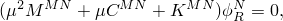
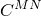
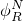
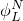
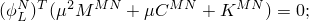
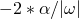

# 6.3.6 复特征值提取


**产品：** Abaqus/Standard  Abaqus/CAE  


##### **参考文献**

- ["定义分析，" 第6.1.2节](pt03ch06s01abo05.md)
- ["常规和线性扰动过程，" 第6.1.3节](pt03ch06s01aus44.md)
- [*COMPLEX FREQUENCY](../key/key-link.md#usb-kws-hcomplexfrequency)
- ["在Abaqus/CAE用户指南的配置线性扰动分析过程，" 第14.11.2节中配置复频率过程"](../usi/usi-link.md#usi-sim-configure-complexfrequency)

### 概述

复特征值提取过程：
- 执行特征值提取以计算系统的复特征值和相应的复振型；
- 是一个线性扰动过程；
- 要求在进行复特征值提取之前执行固有频率提取过程（["固有频率提取，" 第6.3.5节"](pt03ch06s03at10.md)）；
- 可以使用高性能SIM软件架构（见["动态分析过程：概述，" 第6.3.1节中使用SIM架构进行模态叠加动态分析"](pt03ch06s03abo07.md#usb-anl-alineardynamics)）；
- 如果在基态步骤定义中包含非线性几何效应，则将包括由于预载荷和初始条件引起的初始应力和载荷刚度效应（["常规和线性扰动过程，" 第6.1.3节"](pt03ch06s01aus44.md)）；
- 可以包括摩擦、阻尼和非对称载荷刚度贡献；
- 可以包括由于底层平均流引起的声学有限元中的非对称阻尼和刚度贡献（["声学、冲击和耦合声-结构分析，" 第6.10.1节"](pt03ch06s10at29.md)）；以及
- 不能用于定义为循环对称结构的模型（["分析具有循环对称性的模型，" 第10.4.3节"](pt04ch10s04at34.md)）。

### 复特征值提取

复特征值提取过程使用投影方法提取当前系统的复特征值。有限元模型的特征值问题以以下方式表述：



其中


是质量矩阵（对称且通常半正定）；



是阻尼矩阵；


是刚度矩阵（可以包括初始应力刚度和摩擦效应，因此通常是非对称的）；


是复特征值；



是右复特征向量；



是左复特征向量，定义如下：



*M*和*N*

是自由度。

Abaqus/Standard中的复特征值提取过程使用子空间投影方法；因此，必须在使用特征频率提取过程提取对称化刚度矩阵的无阻尼系统的特征模态后，再进行复特征值提取步骤。默认情况下，使用整个子空间作为基向量；可以如下所述减少此子空间。Abaqus/Standard始终计算投影子空间中所有可用的复特征模态（考虑用户对子空间的任何指定修改）。用户指定的请求特征模态数目和复特征值提取过程的频率范围不影响计算的复特征模态数目。它仅决定报告的模态数目，该数目不能高于投影子空间的维数。要修改计算的固有模态数目，请如下所述减少投影子空间，或相应地更改先前固有频率提取步骤中提取的固有模态数目。如果不指定请求的复模态数目或频率范围，所有计算的模态都将被报告。

为了考虑非对称效应，复特征值提取步骤自动使用非对称矩阵求解和存储方案。如果您指定应使用对称求解和存储方案（见["定义分析，" 第6.1.2节"](pt03ch06s01abo05.md)），则非对称效应将被忽略。

| **输入文件用法：** | ``` [*COMPLEX FREQUENCY](../key/key-link.md#usb-kws-hcomplexfrequency) *number of complex eigenmodes, frequency_min, frequency_max* ``` |
| --- | --- |

| **Abaqus/CAE用法：** | 步骤模块：**创建步骤**：**线性扰动**：**复频率**：**请求的特征值数目：全部**或**值**，**感兴趣的最小频率（周期/时间）：***value*，**感兴趣的最大频率（周期/时间）：***value* |
| --- | --- |

#### 偏移点

您可以为复特征值提取过程指定偏移点*S*（周期/时间）（*S* ≥ 0）。Abaqus/Standard按imag(λ)递增的顺序报告复特征模态，，以便与给定偏移点虚部最接近的模态首先报告。当关注特定频率范围时，此功能很有用。默认是无偏移。

| **输入文件用法：** | ``` [*COMPLEX FREQUENCY](../key/key-link.md#usb-kws-hcomplexfrequency), , , , *S* ``` |
| --- | --- |

| **Abaqus/CAE用法：** | 步骤模块：**创建步骤**：**线性扰动**：**复频率**：**频率偏移（周期/时间）：** *S* |
| --- | --- |

#### 归一化

对于复特征值提取分析，位移和模态复特征向量归一化都可用。模态归一化是基于SIM的分析中的默认设置。如果未使用基于SIM的架构，则位移归一化是唯一可用的选项。

如果选择位移归一化，则对特征向量进行归一化，使得每个向量中的最大值为1且虚部为零。如果选择模态归一化，则仅使用位移方法对投影系统（GU）的复特征向量进行归一化，不对有限元子空间中的复特征向量进行归一化。对于大型特征问题，位移归一化可能耗时；因此，推荐使用模态归一化。

| **输入文件用法：** | 使用以下选项选择位移归一化（如果未使用基于SIM的架构，则是唯一选项）： |
| --- | --- |
|  | ``` [*COMPLEX FREQUENCY](../key/key-link.md#usb-kws-hcomplexfrequency), NORMALIZATION=DISPLACEMENT ``` 使用以下选项选择模态归一化（仅在使用基于SIM的架构时可用）： ``` [*COMPLEX FREQUENCY](../key/key-link.md#usb-kws-hcomplexfrequency), NORMALIZATION=MODAL ``` |

| **Abaqus/CAE用法：** | 您不能在Abaqus/CAE中选择复特征向量的归一化方法；使用默认方法。 |
| --- | --- |

#### 选择投影的特征模态

您可以选择对称化刚度矩阵无阻尼系统的特征模态进行子空间投影。您可以通过分别指定模态号、请求Abaqus/Standard自动生成模态号，或通过请求属于指定频率范围的特征模态来选择它们。如果不选择特征模态，则使用先前特征频率提取步骤中提取的所有模态进行模态叠加。

| **输入文件用法：** | 使用以下任一选项通过指定模态号来选择特征模态： |
| --- | --- |
|  | ``` [*SELECT EIGENMODES](../key/key-link.md#usb-kws-hselecteigenmodes), DEFINITION=MODE NUMBERS [*SELECT EIGENMODES](../key/key-link.md#usb-kws-hselecteigenmodes), GENERATE, DEFINITION=MODE NUMBERS ``` 使用以下选项通过指定频率范围来定义特征模态： ``` [*SELECT EIGENMODES](../key/key-link.md#usb-kws-hselecteigenmodes), DEFINITION=FREQUENCY RANGE ``` |

| **Abaqus/CAE用法：** | 您不能在Abaqus/CAE中选择特征模态；所有提取的模态都用于子空间投影。 |
| --- | --- |

#### 评估频率依赖性材料特性

当指定频率依赖性材料特性时，Abaqus/Standard提供选择在这些特性在复特征值提取过程中使用的评估频率的选项。此评估是必要的，因为算子无法在特征值提取过程中修改。如果不选择频率，Abaqus/Standard在零频率评估与频率相关弹簧和减振器关联的刚度和阻尼，不考虑来自频域粘弹性的刚度和阻尼贡献。如果指定了频率，则考虑来自频域粘弹性的刚度和阻尼贡献。

| **输入文件用法：** | ``` [*COMPLEX FREQUENCY](../key/key-link.md#usb-kws-hcomplexfrequency), PROPERTY EVALUATION=*frequency* ``` |
| --- | --- |

| **Abaqus/CAE用法：** | 步骤模块：**创建步骤**：**复频率**：**其他**：**在频率评估从属特性：** *value* |
| --- | --- |

#### 右和左复特征向量

对于复特征值提取分析，可以请求右或左复特征向量。默认情况下，提取右特征向量。左特征向量仅在基于SIM架构的分析中可用。您可以在同一分析中提取右和左复特征向量，但必须在单独步骤中请求。如果要提取右和左特征向量，应选择模态归一化。

| **输入文件用法：** | 使用以下选项提取右复特征向量： |
| --- | --- |
|  | ``` [*COMPLEX FREQUENCY](../key/key-link.md#usb-kws-hcomplexfrequency), RIGHT EIGENVECTORS (default, the only option if the SIM architecture is not used) ``` 使用以下选项提取左复特征向量： ``` [*COMPLEX FREQUENCY](../key/key-link.md#usb-kws-hcomplexfrequency), LEFT EIGENVECTORS (only if the SIM architecture is used) ``` |

| **Abaqus/CAE用法：** | 在Abaqus/CAE中仅提取右复特征向量。 |
| --- | --- |

### 带滑动摩擦的接触条件

Abaqus/Standard自动检测在先前步骤中由于参考框架运动或传输速度施加的速度差异而滑动的接触节点。在这些节点上，切向自由度将不受约束，摩擦效应将导致刚度矩阵的非对称贡献。在其他接触节点上，切向自由度将受到约束。

在施加速度差的接触节点上，摩擦会产生阻尼项。有两种摩擦引起的阻尼效应。第一种效应是由摩擦力稳定垂直于滑动方向的振动产生的。这种效应仅存在于三维分析中。第二种效应是由速度相关的摩擦系数引起的。如果摩擦系数随速度减小（通常情况），该效应是 destabilizing，也称为"负阻尼"。更多详情，见["库仑摩擦，" 第5.2.3节"](../stm/stm-link.md#stm-ifc-coulombfric)。复特征求解器允许您将这些摩擦引起的贡献包含在阻尼矩阵中。

| **输入文件用法：** | ``` [*COMPLEX FREQUENCY](../key/key-link.md#usb-kws-hcomplexfrequency), FRICTION DAMPING=YES ``` |
| --- | --- |

| **Abaqus/CAE用法：** | 步骤模块：**创建步骤**：**线性扰动**：**复频率**：**包含摩擦引起的阻尼效应** |
| --- | --- |

### 阻尼

在复特征值提取分析中，阻尼可以由减振器定义（见["减振器，" 第32.2.1节"](pt06ch32s02alm38.md)）、与材料和单元关联的"瑞利"阻尼（见["材料阻尼，" 第26.1.1节"](pt05ch26s01abm51.md)）以及无限元或声学元上的安静边界定义。此外，如上所述["带滑动摩擦的接触条件"](pt03ch06s03at11.md#complexfreq-sliding)，可以包括摩擦引起的阻尼。

在使用高性能SIM架构的复特征值提取中，支持结构阻尼、来自频域粘弹性的阻尼贡献以及所有类型的模态阻尼（复合模态阻尼除外）。

### 规定运动、传输速度和声流速度

运动、传输速度和声流速度影响复频率分析。运动和传输速度必须在前面的稳态传输常规步骤中指定，其效应包含在复频率步骤中。声流速度在稳态传输步骤中没有影响，在稳态传输步骤中指定的声流速度不会传播到扰动步骤。声流速度必须在每个需要它的线性扰动步骤中指定。

### 初始条件

不能为复特征值提取指定初始条件。

### 边界条件

在复特征值提取期间不能定义边界条件。边界条件将与先前固有频率提取分析中的相同。

### 载荷

在复特征值提取期间，施加的载荷（["施加载荷：概述，" 第34.4.1节"](pt07ch34s04aus120.md)）被忽略。如果在先前包含非线性几何效应的常规分析步骤中施加了载荷，则在先前常规分析步骤结束时确定的载荷刚度将包含在复特征值提取中（见["常规和线性扰动过程，" 第6.1.3节"](pt03ch06s01aus44.md)）。

科里奥利分布载荷对阻尼算子添加非对称贡献，这目前仅在实体和桁架单元中得到考虑。

### 预定义场

在复特征值提取期间不能规定预定义场。

### 材料选项

必须定义材料的密度（见["密度，" 第21.2.1节"](pt05ch21s02abm01.md)）。以下材料特性在复特征值提取期间不活跃：
- 塑性和非弹性效应；
- 速率依赖性材料特性，不包括摩擦，如果接触界面存在速度差，摩擦可以是速率依赖的；
- 热特性；
- 质量扩散特性；
- 电特性（虽然压电材料是活跃的）；以及
- 孔隙流体流动特性。

### 单元

除带扭曲的广义轴对称单元外，Abaqus/Standard中的任何应力/位移单元（包括具有温度或压力自由度的单元）都可用在复特征值提取中。

### 输出

特征值的实部（EIGREAL）和虚部（EIGIMAG）（和）；周期/时间频率（EIGFREQ）；以及有效阻尼比（DAMPRATIO = ）自动写入数据（`.dat`）文件和输出数据库（`.odb`）文件作为历史数据。此外，您可以请求将广义位移（GU）（投影系统的模态）写入输出数据库文件（见["输出到输出数据库，" 第4.1.3节"](pt02ch04s01aus40.md)）。应力、应变和位移等输出变量（代表振型）也可用于每个特征值；这些量是扰动值，代表振型，而非绝对值。

特征值提取过程中唯一可用的能量密度是弹性应变能密度SENER。所有输出变量标识符在["Abaqus/Standard输出变量标识符，" 第4.2.1节"](pt02ch04s02abv01.md)中概述。

您可以通过选择需要输出的模态来限制输出到数据和结果文件以及输出数据库文件（见["输出到数据和结果文件，" 第4.1.2节"](pt02ch04s01aus39.md)或["输出到输出数据库，" 第4.1.3节"](pt02ch04s01aus40.md)）。复特征值提取过程不支持输出到结果（`.fil`）文件。

#### 设置复特征模态的截止值

您还可以设置复特征模态的截止值，以便只有特征值实部高于截止值的复模态才会写入输出数据库文件。默认截止值为0.0。如果未设置截止值，则输出所有复模态。

| **输入文件用法：** | 使用以下任一选项选择要输出的复特征模态： |
| --- | --- |
|  | ``` [*COMPLEX FREQUENCY](../key/key-link.md#usb-kws-hcomplexfrequency), UNSTABLE MODES ONLY [*COMPLEX FREQUENCY](../key/key-link.md#usb-kws-hcomplexfrequency), UNSTABLE MODES ONLY=*value* ``` |

#### SIM架构

复特征值提取分析可以使用SIM架构执行。使用SIM架构执行复特征值提取过程的优势如下：
- 考虑结构阻尼，包括使用粘弹性材料定义的阻尼；
- 可以指定模态阻尼；
- 可以定义表示刚度、质量和阻尼的矩阵（支持对称和非对称矩阵）；以及
- AMS特征求解器可用于为复特征值提取生成投影子空间。

当使用AMS特征求解器计算投影子空间时，您应该通过增加AMS参数的值和增加感兴趣的 highest frequency 来提高AMS特征求解的准确性。基于SIM架构的复特征值提取分析中不能使用耦合结构-声学模态。

### 输入文件模板

```
[*HEADING](../key/key-link.md#usb-kws-mheading)
…
[*SURFACE INTERACTION](../key/key-link.md#usb-kws-hsurfaceinteraction)
[*FRICTION](../key/key-link.md#usb-kws-hfriction)
*指定零摩擦系数*
[*BOUNDARY](../key/key-link.md#usb-kws-hboundary)
*数据行用于指定零值边界条件*
[*INITIAL CONDITIONS](../key/key-link.md#usb-kws-minitialcond)
*数据行用于指定初始条件*
**
[*STEP](../key/key-link.md#usb-kws-hstep) (,NLGEOM)
*如果使用NLGEOM，初始应力和预载荷刚度效应将包含在特征值提取步骤中*
[*STATIC](../key/key-link.md#usb-kws-hstatic)
…
[*CLOAD](../key/key-link.md#usb-kws-hcload) and/or [*DLOAD](../key/key-link.md#usb-kws-hdload)
*数据行用于指定载荷*
[*TEMPERATURE](../key/key-link.md#usb-kws-htemperature) and/or [*FIELD](../key/key-link.md#usb-kws-hfield)
*数据行用于指定预定义字段的值*
[*BOUNDARY](../key/key-link.md#usb-kws-hboundary)
*数据行用于指定零值或非零边界条件*
[*END STEP](../key/key-link.md#usb-kws-hendstep)
**
[*STEP](../key/key-link.md#usb-kws-hstep)(,NLGEOM)
[*STATIC](../key/key-link.md#usb-kws-hstatic)
*数据行用于定义增量*
[*CHANGE FRICTION](../key/key-link.md#usb-kws-hchangefriction)
[*FRICTION](../key/key-link.md#usb-kws-hfriction)
*数据行用于重新定义摩擦系数*
[*MOTION](../key/key-link.md#usb-kws-hmotion), ROTATION or TRANSLATION
*数据行用于定义速度差*
[*END STEP](../key/key-link.md#usb-kws-hendstep)
**
[*STEP](../key/key-link.md#usb-kws-hstep)
[*FREQUENCY](../key/key-link.md#usb-kws-hfrequency)
*数据行用于控制特征值提取*
[*END STEP](../key/key-link.md#usb-kws-hendstep)
**
[*STEP](../key/key-link.md#usb-kws-hstep)
[*COMPLEX FREQUENCY](../key/key-link.md#usb-kws-hcomplexfrequency)
*数据行用于控制复特征值提取*
[*SELECT EIGENMODES](../key/key-link.md#usb-kws-hselecteigenmodes)
*数据行用于定义适用的模态范围*
[*END STEP](../key/key-link.md#usb-kws-hendstep)
```


