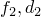
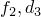
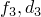

# 6.3.8 基于模态的稳态动态分析


**产品：** Abaqus/Standard  Abaqus/CAE  


##### **参考文献**

- ["定义分析，" 第6.1.2节](pt03ch06s01abo05.md)
- ["常规和线性扰动过程，" 第6.1.3节](pt03ch06s01aus44.md)
- ["动态分析过程：概述，" 第6.3.1节](pt03ch06s03abo07.md)
- ["直接求解稳态动态分析，" 第6.3.4节](pt03ch06s03at09.md)
- ["固有频率提取，" 第6.3.5节](pt03ch06s03at10.md)
- ["基于子空间的稳态动态分析，" 第6.3.9节](pt03ch06s03at14.md)
- [*STEADY STATE DYNAMICS](../key/key-link.md#usb-kws-hsteadystdyn)
- ["在Abaqus/CAE用户指南的配置线性扰动分析过程，" 第14.11.2节中配置基于模态的稳态动态分析"](../usi/usi-link.md#usi-sim-configure-steadystatemodal)

### 概述

基于模态的稳态动态分析：
- 用于计算系统对谐波激励的稳态动态线性化响应；
- 是一个线性扰动过程；
- 基于系统的固有频率和模态计算响应；
- 要求在进行稳态动态分析之前执行固有频率提取过程；
- 可以使用高性能SIM软件架构（见["动态分析过程：概述，" 第6.3.1节中使用SIM架构进行模态叠加动态分析"](pt03ch06s03abo07.md#usb-anl-alineardynamics)）；
- 仅在使用SIM架构时才能包含非对角阻尼效应（即来自材料或单元阻尼）；
- 是直接求解稳态动态分析的替代方法，在直接求解稳态动态分析中，系统的响应是以模型物理自由度计算的；
- 计算成本比直接求解或基于子空间的稳态动力学低；
- 比直接求解或基于子空间的稳态分析准确性低，特别是在存在显著材料阻尼时，以及
- 能够将激励频率偏向于产生响应峰的值。

### 引言

稳态动态分析提供了系统由于给定频率的谐波激励而产生的响应的稳态幅值和相位。通常，这种分析是通过在系列不同频率上施加荷载并记录响应来进行的频率扫描；在Abaqus/Standard中，稳态动态分析过程用于执行此频率扫描。

在基于模态的稳态动态分析中，响应基于模态叠加技术；必须首先使用固有频率提取过程提取系统模态。模态将包括特征模态，如果在前面的固有频率提取步骤中激活了残余模态。提取的模态数目必须足以充分建模系统的动态响应，这需要您进行判断。

在定义基于模态的稳态动态步骤时，您指定感兴趣的频率范围以及每个范围内需要结果的频率数目（包括范围的边界频率）。此外，您可以指定要使用的频率间距类型（线性或对数），如下所述（["选择频率间距"](pt03ch06s03at13.md#usb-anl-asteadystdyn-freqspace)"）。对数频率间距是默认值。频率以周期/时间为单位。

需要结果的这些频率点可以沿频率轴等距分布（按线性或对数标度），或者可以通过引入偏置参数向用户定义频率范围的端部聚集（见下文["偏置参数"](pt03ch06s03at13.md#usb-anl-asteadystdyn-biasparam)"）。

虽然此过程中的响应是线性振动，但先前的响应可以是非线性的。如果在稳态动态过程之前的固有频率提取步骤之前的任何常规分析步骤中包含非线性几何效应（["常规和线性扰动过程，" 第6.1.3节"](pt03ch06s01aus44.md)），则初始应力效应（应力刚化）将包含在稳态动力学响应中。

| **输入文件用法：** | ``` [*STEADY STATE DYNAMICS](../key/key-link.md#usb-kws-hsteadystdyn) ``` |
| --- | --- |
|  | 必须从[*STEADY STATE DYNAMICS](../key/key-link.md#usb-kws-hsteadystdyn)选项中省略DIRECT和SUBSPACE PROJECTION参数，以执行基于模态的稳态动态分析。 |

| **Abaqus/CAE用法：** | 步骤模块：**创建步骤**：**线性扰动**：**稳态动力学，模态** |
| --- | --- |

#### 为输出选择频率区间类型

基于模态的稳态动态步骤的输出允许三种类型的频率区间。

##### 使用系统的特征频率指定频率范围

默认情况下，使用特征频率类型的频率区间；在这种情况下，每个频率范围内存在以下区间：
- 第一个区间：从给定频率范围的下限到该范围内的第一个特征频率。
- 中间区间：从特征频率到特征频率。
- 最后一个区间：从该范围内的最高特征频率到频率范围的上限。

对于每个这些区间，使用用户定义的点数（包括区间的边界频率）和可选偏置函数（如下所述讨论，允许在频率范围内特征频率处更紧密地排列频率标度上的采样点）确定计算结果的频率。因此，允许详细定义接近共振频率的响应。[图6.3.8-1](pt03ch06s03at13.md#eigen-freq-range-div-ssd)展示了5个计算点和等于1的偏置参数的频率范围划分。

| **输入文件用法：** | ``` [*STEADY STATE DYNAMICS](../key/key-link.md#usb-kws-hsteadystdyn), INTERVAL=EIGENFREQUENCY ``` |
| --- | --- |

| **Abaqus/CAE用法：** | 步骤模块：**创建步骤**：**线性扰动**：**稳态动力学，模态**：**使用特征频率细分每个频率范围** |
| --- | --- |

**图6.3.8-1** 特征频率类型区间和5个计算点的范围划分。


##### 通过频率扩展指定频率范围

如果选择了扩展类型的频率区间，则围绕频率范围内每个特征频率存在区间。对于每个区间，使用用户定义的点数（包括区间的边界频率）等距计算结果的频率。最小频率点数为3。如果用户定义的值小于3（或省略），则假定默认值为3。[图6.3.8-2](pt03ch06s03at13.md#usb-anl-asteadystdyn-spread-freq-range-div-ssds)展示了5个计算点的频率范围划分。

偏置参数不支持扩展类型的频率区间。

**图6.3.8-2** 扩展类型区间和5个计算点的范围划分。和是系统的特征频率。


| **输入文件用法：** | ``` [*STEADY STATE DYNAMICS](../key/key-link.md#usb-kws-hsteadystdyn), INTERVAL=SPREAD *lwr_freq, upr_freq, numpts, bias_param, freq_scale_factor, spread* ``` |
| --- | --- |

| **Abaqus/CAE用法：** | 您不能在Abaqus/CAE中通过频率扩展指定频率范围。 |
| --- | --- |

##### 直接指定频率范围

如果选择了替代的范围类型频率区间，则在指定频率范围内只有一个区间，从范围下限到上限。该区间使用用户定义的点数和可选偏置函数划分，可用于将采样频率点放置在更接近范围限制的位置。对于范围类型的频率区间，可能会错过系统特征频率周围的峰值响应，因为将报告输出的采样频率不会偏向特征频率。

| **输入文件用法：** | ``` [*STEADY STATE DYNAMICS](../key/key-link.md#usb-kws-hsteadystdyn), INTERVAL=RANGE ``` |
| --- | --- |

| **Abaqus/CAE用法：** | 步骤模块：**创建步骤**：**线性扰动**：**稳态动力学，模态**：关闭**使用特征频率细分每个频率范围** |
| --- | --- |

#### 选择频率间距

基于模态的稳态动态步骤允许两种类型的频率间距。对于对数频率间距（默认值），使用对数标度划分感兴趣的指定频率范围。或者，如果需要线性标度，可以使用线性频率间距。

| **输入文件用法：** | 使用以下任一选项： |
| --- | --- |
|  | ``` [*STEADY STATE DYNAMICS](../key/key-link.md#usb-kws-hsteadystdyn), FREQUENCY SCALE=LOGARITHMIC [*STEADY STATE DYNAMICS](../key/key-link.md#usb-kws-hsteadystdyn), FREQUENCY SCALE=LINEAR ``` |

| **Abaqus/CAE用法：** | 步骤模块：**创建步骤**：**线性扰动**：**稳态动力学，模态**：**标度：对数**或**线性** |
| --- | --- |

#### 请求多个频率范围

您可以为基于模态的稳态动态步骤请求多个频率范围或多个单一频率点。

| **输入文件用法：** | ``` [*STEADY STATE DYNAMICS](../key/key-link.md#usb-kws-hsteadystdyn) *lwr_freq1, upr_freq1, numpts1, bias_param1, freq_scale_factor1* *lwr_freq2, upr_freq2, numpts2, bias_param2, freq_scale_factor2* ... *single_freq1* *single_freq2* ... ``` |
| --- | --- |
|  | 根据需要重复数据行。 |

| **Abaqus/CAE用法：** | 步骤模块：**创建步骤**：**线性扰动**：**稳态动力学，模态**：**数据**：在表格中输入数据，并根据需要添加行 |
| --- | --- |

### 偏置参数

偏置参数可用于提供更紧密的结果点间距，可以朝向每个频率区间的中间或端部。[图6.3.8-3](pt03ch06s03at13.md#biased-frequency-spacing-ssd)显示了几种偏置参数对频率间距影响的示例。

**图6.3.8-3** 对于点数为的偏置参数对频率间距的影响。


用于计算结果呈现频率的偏置公式如下：


其中

*y*

；

*n*

为在频率区间内要给出结果的频率点数（见上文）；

*k*

为其中一个频率点（）；


为频率区间的下限；


为频率区间的上限；


为给出第*k*个结果的频率；

*p*

为偏置参数值；以及


为频率或频率的对数，取决于为频率标度参数选择哪个值。

大于1.0的偏置参数*p*向频率区间的端部提供更紧密的结果点间距，而小于1.0的值向频率区间的中间提供更紧密的间距。特征频率区间的默认偏置参数为3.0，范围频率区间为1.0。

### 频率标度因子

频率标度因子可用于缩放频率点。除频率范围的下限和上限外，所有频率点都乘以此因子。此标度因子仅在按系统的特征频率指定频率区间时才能使用（见上文["使用系统的特征频率指定频率范围"](pt03ch06s03at13.md#usb-anl-specify)"）。

### 选择模态和指定阻尼

您可以选择用于模态叠加的模态，并为所有选定模态指定阻尼值。

#### 选择模态

您可以通过分别指定模态号、请求Abaqus/Standard自动生成模态号，或通过请求属于指定频率范围的模态来选择模态。如果不选择模态，则在模态叠加中使用先前固有频率提取步骤中提取的所有模态，包括激活的残余模态。

| **输入文件用法：** | 使用以下任一选项通过指定模态号来选择模态： |
| --- | --- |
|  | ``` [*SELECT EIGENMODES](../key/key-link.md#usb-kws-hselecteigenmodes), DEFINITION=MODE NUMBERS [*SELECT EIGENMODES](../key/key-link.md#usb-kws-hselecteigenmodes), GENERATE, DEFINITION=MODE NUMBERS ``` 使用以下选项通过指定频率范围来选择模态： ``` [*SELECT EIGENMODES](../key/key-link.md#usb-kws-hselecteigenmodes), DEFINITION=FREQUENCY RANGE ``` |

| **Abaqus/CAE用法：** | 您不能在Abaqus/CAE中选择模态；所有提取的模态都用于模态叠加。 |
| --- | --- |

#### 指定模态阻尼

对于稳态分析，几乎总是指定阻尼（见["材料阻尼，" 第26.1.1节"](pt05ch26s01abm51.md)）。如果没有阻尼，当激励频率等于结构的特征频率时，结构的响应将是无界的。要获得定量的准确结果，特别是在自然频率附近，准确指定阻尼特性至关重要。各种阻尼选项在["材料阻尼，" 第26.1.1节"](pt05ch26s01abm51.md)中讨论。您可以为用于响应计算的所有或部分模态定义阻尼系数。阻尼系数可以为指定模态号或指定频率范围给出。当通过指定频率范围定义阻尼时，模态的阻尼系数在指定频率之间线性插值。频率范围可以是不连续的；在不连续处的特征频率将应用平均阻尼值。阻尼系数在指定频率范围之外被认为是常数。

| **输入文件用法：** | 使用以下选项通过指定模态号来定义阻尼： |
| --- | --- |
|  | ``` [*MODAL DAMPING](../key/key-link.md#usb-kws-hmodaldamp), DEFINITION=MODE NUMBERS ``` 使用以下选项通过指定频率范围来定义阻尼： ``` [*MODAL DAMPING](../key/key-link.md#usb-kws-hmodaldamp), DEFINITION=FREQUENCY RANGE ``` 使用以下选项通过全局因子定义阻尼： |

| **Abaqus/CAE用法：** | 使用以下输入通过指定模态号来定义阻尼： |
| --- | --- |
|  | 步骤模块：**创建步骤**：**线性扰动**：**稳态动力学，模态**：**阻尼** 在Abaqus/CAE中不支持通过指定频率范围来定义阻尼。 |

##### 指定阻尼的示例

[图6.3.8-4](pt03ch06s03at13.md#amodaldynamics-damprules-1)说明了如何为以下输入确定不同特征频率处的阻尼系数：

```
[*MODAL DAMPING](../key/key-link.md#usb-kws-hmodaldamp), DEFINITION=FREQUENCY RANGE





```

**图6.3.8-4** 通过频率范围指定的阻尼值。


##### 选择模态和指定阻尼系数的规则

以下规则适用于选择模态和指定模态阻尼系数：
- 默认不包含模态阻尼。
- 模态选择和模态阻尼必须以相同的方式指定，使用模态号或频率范围。
- 如果不选择任何模态，则将在叠加中使用先前频率分析中提取的所有模态，包括激活的残余模态。
- 如果不为选择的模态指定阻尼系数，则这些模态将使用零阻尼值。
- 阻尼仅应用于所选的模态。
- 所选模态中超出指定频率范围的阻尼系数是常数，等于为第一个或最后一个频率指定的阻尼系数（取决于哪个更近）。这与Abaqus解释振幅定义的方式一致。

#### 指定全局阻尼

为方便起见，您可以为所有选定的特征模态指定恒定的全局阻尼因子，用于质量和刚度比例粘性因子，以及刚度比例结构阻尼。更多详情，见["动态分析过程：概述，" 第6.3.1节中的动态分析阻尼"](pt03ch06s03abo07.md#usb-anl-adynamicproc-damp)。

| **输入文件用法：** | ``` [*GLOBAL DAMPING](../key/key-link.md#usb-kws-hglobaldamping), ALPHA=*factor*, BETA=*factor*, STRUCTURAL=*factor* ``` |
| --- | --- |

| **Abaqus/CAE用法：** | 在Abaqus/CAE中不支持通过全局因子定义阻尼。 |
| --- | --- |

#### 材料阻尼

结构和粘性材料阻尼（见["材料阻尼，" 第26.1.1节"](pt05ch26s01abm51.md)）在基于SIM的稳态动态分析中被考虑。由于阻尼算子到模态形状的投影仅在频率提取步骤期间执行一次，因此通过使用基于SIM的稳态动态过程可以实现显著的性能优势（见["动态分析过程：概述，" 第6.3.1节中使用SIM架构进行模态叠加动态分析"](pt03ch06s03abo07.md#usb-anl-alineardynamics)。

如果阻尼算子依赖于频率，则将在频率提取过程中指定的属性评估频率处进行评估。

如果需要，您可以停用基于模态的稳态动态过程中的结构或粘性阻尼。

| **输入文件用法：** | 使用以下选项在特定稳态动态步骤中停用结构和粘性阻尼： |
| --- | --- |
|  | ``` [*DAMPING CONTROLS](../key/key-link.md#usb-kws-hdampingcontrols), STRUCTURAL=NONE, VISCOUS=NONE ``` |

| **Abaqus/CAE用法：** | 在Abaqus/CAE中不支持阻尼控制。 |
| --- | --- |

### 初始条件

基态是稳态动态步骤之前最后一个常规分析步骤结束时模型的当前状态。如果分析的第一个步骤是扰动步骤，则基态由初始条件决定（["Abaqus/Standard和Abaqus/Explicit中的初始条件，" 第34.2.1节"](pt07ch34s02aus116.md)）。直接定义解变量（如速度）的初始条件定义不能在稳态动态分析中使用。

### 边界条件

在基于模态的稳态动态分析中，任何自由度的实部和虚部同时被约束或不受约束；物理上不可能出现一部分被约束而另一部分不受约束的情况。Abaqus/Standard将自动约束自由度的实部和虚部，即使只约束了一部分。

#### 基运动

在基于模态的动态响应过程中，不能直接将非零位移和旋转规定为边界条件（["Abaqus/Standard和Abaqus/Explicit中的边界条件，" 第34.3.1节"](pt07ch34s03aus118.md)）。因此，在基于模态的稳态动态分析中，只能将节点运动规定为基运动；作为边界条件给出的非零位移或加速度历史定义被忽略，并且特征频率提取步骤中支撑条件的任何更改都会被标记为错误。在模态叠加过程中规定运动的方法在["瞬态模态动态分析，" 第6.3.7节"](pt03ch06s03at12.md)中描述。

基运动可以由位移、速度或加速度历史定义。对于声压，位移用于描述声压历史。如果规定的激励记录以位移或速度历史的形式给出，Abaqus/Standard会对其进行微分以获得加速度历史。默认为机械自由度给加速度历史，为声压给位移。

当使用次基时，将为模型中施加的每个"大"质量提取低频特征模态。在这种情况下，选择频率下限范围时要小心。"大"质量模态在模态叠加中很重要；但是，不应请求零或任意低频率水平的响应，因为这会强制Abaqus/Standard计算这些"大"质量特征频率之间的响应，这是不希望的。

##### 频率依赖性基运动

振幅定义可用于将基运动的振幅指定为频率的函数（["振幅曲线，" 第34.1.2节"](pt07ch34s01aus115.md)）。

| **输入文件用法：** | 使用以下两个选项： |
| --- | --- |
|  | ``` [*AMPLITUDE](../key/key-link.md#usb-kws-mamplitude), NAME=*name* [*BASE MOTION](../key/key-link.md#usb-kws-hbasemotion), REAL or IMAGINARY, AMPLITUDE=*name* ``` |

| **Abaqus/CAE用法：** | 载荷模块；**创建边界条件**；**步骤：** *step_name*；**类别：机械**；**所选步骤的类型**：**位移基运动**或**速度基运动**或**加速度基运动**；**基本**选项卡页面：**自由度：** **U1**，**U2**，**U3**，**UR1**，**UR2**，或**UR3**；**振幅：** *name* |
| --- | --- |

### 载荷

在基于模态的稳态动态分析中可以规定以下载荷，如["集中载荷，" 第34.4.2节"](pt07ch34s04aus121.md)中所述：
- 集中节点力可以施加于位移自由度（1-6）。
- 可以施加分布式压力载荷或体力；特定单元可用的分布载荷类型在[第六部分，"单元"](pt06.md)中有描述。

这些载荷假定在用户指定的频率范围内随时间正弦变化。载荷以实部和虚部给出。

流体通量载荷不能在稳态动态分析中使用。

| **输入文件用法：** | 使用以下输入行之一定义载荷的实部（同相位）： |
| --- | --- |
|  | ``` [*CLOAD](../key/key-link.md#usb-kws-hcload) *or* [*DLOAD](../key/key-link.md#usb-kws-hdload) [*CLOAD](../key/key-link.md#usb-kws-hcload) *or* [*DLOAD](../key/key-link.md#usb-kws-hdload), REAL ``` 使用以下输入行定义载荷的虚部（异相位）： ``` [*CLOAD](../key/key-link.md#usb-kws-hcload) *or* [*DLOAD](../key/key-link.md#usb-kws-hdload), IMAGINARY ``` |

| **Abaqus/CAE用法：** | 载荷模块：载荷编辑器：*实部（同相位）* + *虚部（异相位）* **i** |
| --- | --- |

#### 频率依赖性载荷

振幅定义可用于将载荷的振幅指定为频率的函数（["振幅曲线，" 第34.1.2节"](pt07ch34s01aus115.md)）。

| **输入文件用法：** | 使用以下两个选项： |
| --- | --- |
|  | ``` [*AMPLITUDE](../key/key-link.md#usb-kws-mamplitude), NAME=*name* [*CLOAD](../key/key-link.md#usb-kws-hcload) *or* [*DLOAD](../key/key-link.md#usb-kws-hdload), REAL or IMAGINARY, AMPLITUDE=*name* ``` |

| **Abaqus/CAE用法：** | 载荷或相互作用模块：**创建振幅**：**名称：** *name* |
| --- | --- |
|  | 载荷模块：载荷编辑器：*实部（同相位）* + *虚部（异相位）* **i**：**振幅：** *name* |

### 预定义场

不允许在基于模态的稳态动态分析中使用预定义温度场。其他预定义场被忽略。

### 材料选项

与任何动态分析过程一样，必须在需要动态响应的模型各个独立部件的区域中指定质量或密度（["密度，" 第21.2.1节"](pt05ch21s02abm01.md)）。以下材料特性在基于模态的稳态动态分析期间不活跃：塑性和其他非弹性效应、粘弹性效应、热特性、质量扩散特性、电特性（压电分析中的电势除外）以及孔隙流体流动特性——见["常规和线性扰动过程，" 第6.1.3节"](pt03ch06s01aus44.md)。

### 单元

在稳态动力学过程中可以使用Abaqus/Standard中以下任何可用单元：
- 应力/位移单元（带扭曲的广义轴对称单元除外）；
- 声学单元；
- 压电单元；或
- 静水压力流体单元。

 见["为分析类型选择合适的单元，" 第27.1.3节"](pt06ch27s01aus112.md)。

### 输出

在基于模态的稳态动态分析中，应变（E）或应力（S）等输出变量的值是具有实部和虚部的复数。对于数据文件输出，第一行给出实部，而第二行列出虚部。结果和数据文件输出变量也可用于获取许多变量的幅值和相位（见["Abaqus/Standard输出变量标识符，" 第4.2.1节"](pt02ch04s02abv01.md)）。在这种情况下，数据文件中的第一行给出幅值，而第二行给出相位角。

以下变量专门为稳态动态分析提供：

单元积分点变量：

| PHS | 所有应力分量的幅值和相位角。 |
| --- | --- |

| PHE | 所有应变分量的幅值和相位角。 |
| --- | --- |

| PHEPG | 电势梯度向量的幅值和相位角。 |
| --- | --- |

| PHEFL | 电通量向量的幅值和相位角。 |
| --- | --- |

| PHMFL | 流体链接单元中质量流率的幅值和相位角。 |
| --- | --- |

| PHMFT | 流体链接单元中总质量流的幅值和相位角。 |
| --- | --- |

对于连接单元，以下单元输出变量可用：

| PHCTF | 连接总力的幅值和相位角。 |
| --- | --- |

| PHCEF | 连接弹性力的幅值和相位角。 |
| --- | --- |

| PHCVF | 连接粘性力的幅值和相位角。 |
| --- | --- |

| PHCRF | 连接反力的幅值和相位角。 |
| --- | --- |

| PHCSF | 连接摩擦力的幅值和相位角。 |
| --- | --- |

| PHCU | 连接相对位移的幅值和相位角。 |
| --- | --- |

| PHCCU | 连接构成本构位移的幅值和相位角。 |
| --- | --- |

节点变量：

| PU | 节点处所有位移/旋转分量的幅值和相位角。 |
| --- | --- |

| PPOR | 节点处流体或声压的幅值和相位角。 |
| --- | --- |

| PHPOT | 节点处电势的幅值和相位角。 |
| --- | --- |

| PRF | 节点处所有反力/力矩的幅值和相位角。 |
| --- | --- |

| PHCHG | 节点处无功电荷的幅值和相位角。 |
| --- | --- |

元素能量密度（如弹性应变能密度SENER）和整个元素能量（如元素的总动能ELKE）在基于模态的稳态动态分析中不可用于输出。

上述标准输出变量U、V、A和变量PU对应于在基于模态分析中相对于主基运动的运动。总值（包含主基的运动）也可以使用：

| TU | 节点处所有总位移/旋转分量的幅值。 |
| --- | --- |

| TV | 节点处所有总速度分量的幅值。 |
| --- | --- |

| TA | 节点处所有总加速度分量的幅值。 |
| --- | --- |

| PTU | 节点处所有总位移/旋转分量的幅值和相位角。 |
| --- | --- |

以下模态变量也可用于基于模态的稳态动态分析，并可输出到数据、结果和/或输出数据库文件（见["输出到数据和结果文件，" 第4.1.2节"](pt02ch04s01aus39.md)和["输出到输出数据库，" 第4.1.3节"](pt02ch04s01aus40.md)）：

| GU | 所有模态的广义位移。 |
| --- | --- |

| GV | 所有模态的广义速度。 |
| --- | --- |

| GA | 所有模态的广义加速度。 |
| --- | --- |

| GPU | 所有模态广义位移的相位角。 |
| --- | --- |

| GPV | 所有模态广义速度的相位角。 |
| --- | --- |

| GPA | 所有模态广义加速度的相位角。 |
| --- | --- |

| SNE | 每个模态整个模型的弹性应变能。 |
| --- | --- |

| KE | 每个模态整个模型的动能。 |
| --- | --- |

| T | 每个模态整个模型的外功。 |
| --- | --- |

| BM | 基运动。 |
| --- | --- |

整个模型变量（如ALLIE（总应变能））可作为输出到数据、结果和/或输出数据库文件用于基于模态的稳态动力学（见["输出到数据和结果文件，" 第4.1.2节"](pt02ch04s01aus39.md)）。

### 输入文件模板

```
[*HEADING](../key/key-link.md#usb-kws-mheading)
…
[*AMPLITUDE](../key/key-link.md#usb-kws-mamplitude), NAME=loadamp
*数据行用于定义作为频率函数的振幅曲线（周期/时间）*
[*AMPLITUDE](../key/key-link.md#usb-kws-mamplitude), NAME=base
*数据行用于定义用于规定基运动的振幅曲线*
**
[*STEP](../key/key-link.md#usb-kws-hstep), NLGEOM
*包含NLGEOM参数以便将应力刚化效应包含在稳态动力学步骤中*
[*STATIC](../key/key-link.md#usb-kws-hstatic)
***任何可用于预加载结构的常规分析过程*
…
[*CLOAD](../key/key-link.md#usb-kws-hcload) and/or [*DLOAD](../key/key-link.md#usb-kws-hdload)
*数据行用于规定预载荷*
[*TEMPERATURE](../key/key-link.md#usb-kws-htemperature) and/or [*FIELD](../key/key-link.md#usb-kws-hfield)
*数据行用于定义用于预加载结构的预定义字段的值*
[*BOUNDARY](../key/key-link.md#usb-kws-hboundary)
*数据行用于指定用于预加载结构的边界条件*
[*END STEP](../key/key-link.md#usb-kws-hendstep)
**
[*STEP](../key/key-link.md#usb-kws-hstep)
[*FREQUENCY](../key/key-link.md#usb-kws-hfrequency)
*数据行用于控制特征值提取*
[*BOUNDARY](../key/key-link.md#usb-kws-hboundary)
*数据行用于将自由度分配给主基*
[*BOUNDARY](../key/key-link.md#usb-kws-hboundary), BASE NAME=base2
*数据行用于将自由度分配给次基*
[*END STEP](../key/key-link.md#usb-kws-hendstep)
**
[*STEP](../key/key-link.md#usb-kws-hstep)
[*STEADY STATE DYNAMICS](../key/key-link.md#usb-kws-hsteadystdyn)
*数据行用于指定频率范围和偏置参数*
[*SELECT EIGENMODES](../key/key-link.md#usb-kws-hselecteigenmodes)
*数据行用于定义适用的模态范围*
[*MODAL DAMPING](../key/key-link.md#usb-kws-hmodaldamp)
*数据行用于定义模态阻尼因子*
[*BASE MOTION](../key/key-link.md#usb-kws-hbasemotion), DOF=*dof*, AMPLITUDE=base
[*BASE MOTION](../key/key-link.md#usb-kws-hbasemotion), DOF=*dof*, AMPLITUDE=base, BASE NAME=base2
[*CLOAD](../key/key-link.md#usb-kws-hcload) and/or [*DLOAD](../key/key-link.md#usb-kws-hdload), AMPLITUDE=loadamp
*数据行用于指定随频率变化的正弦载荷*
…
[*END STEP](../key/key-link.md#usb-kws-hendstep)
```


