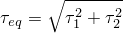
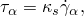
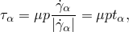
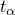
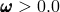
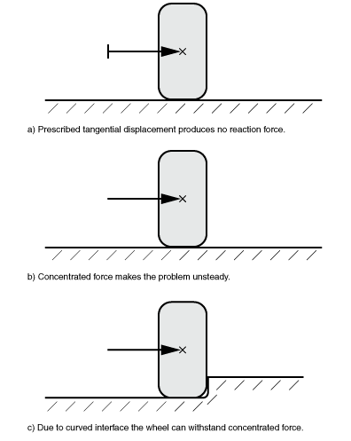

# 6.4.1 稳态传输分析


**产品：** Abaqus/Standard  


##### **参考文献**

- ["定义分析，" 第6.1.2节](pt03ch06s01abo05.md)
- ["对称模型生成，" 第10.4.1节](pt04ch10s04aus63.md)
- [*STEADY STATE TRANSPORT](../key/key-link.md#usb-kws-hsteadystatetransport)
- [*SYMMETRIC MODEL GENERATION](../key/key-link.md#usb-kws-maximodelgen)
- [*MOTION](../key/key-link.md#usb-kws-hmotion)
- [*TRANSPORT VELOCITY](../key/key-link.md#usb-kws-htransportvelocity)
- [*ACOUSTIC FLOW VELOCITY](../key/key-link.md#usb-kws-hacousticflowvelocity)

### 概述

稳态传输分析：
- 允许稳态滚动和滑动解，包括摩擦效应和惯性效应；
- 允许直接获取稳态解或使用准稳态（逐通道）技术；
- 用于模拟变形滚动物体与一个或多个平面、凸面或凹面之间的相互作用；
- 基于专门的分析能力，其中刚体运动以空间或欧拉方式描述，变形以材料或拉格朗日方式描述；
- 允许模型中的一个元素集以欧拉方式描述，而模型中的其余元素以经典拉格朗日方式处理；
- 可以前面有静态应力分析，或后面有固有频率提取或复特征值提取步骤；
- 使用常规应力/位移单元和特殊稳态滚动和滑动接触对；
- 目前仅适用于具有轴对称几何或周期性几何的三维分析；以及
- 允许与速率无关、与速率相关或与历史相关的材料行为。

### 稳态传输分析

使用传统拉格朗日公式建模滚动和滑动接触（例如沿刚性表面滚动的轮胎或相对于制动组件旋转的圆盘）是麻烦的，因为描述运动的参考框架附着在材料上。在这种参考框架中的观察者将 even 稳态滚动视为时间依赖过程，因为每个点都经历重复的变形历史。由于必须执行瞬态分析且需要在整个圆柱表面沿线进行精细网格划分，这种分析计算成本高昂。

Abaqus/Standard中的稳态传输分析能力使用附着在旋转圆柱轴上的参考框架。在这个框架中的观察者看到圆柱上的点不移动，尽管组成圆柱的材料正在通过这些点移动。这从问题中消除了显式时间依赖——观察者看到任何地方的固定点，材料通过它移动。因此，在这个参考框架中描述圆柱的有限元网格不会经历大的刚体旋转。这意味着只需要在接触区域附近进行精细网格划分。

这种描述可以看作是混合拉格朗日/欧拉方法，其中刚体旋转以空间或欧拉方式描述，而变形（现在相对于旋转刚体测量）以材料或拉格朗日方式描述。正是这种运动学描述将稳态移动接触问题转换为纯空间依赖的模拟。

稳态滚动和滑动分析能力为大多数与速率无关、与速率相关和与历史相关的材料模型提供包含摩擦效应、惯性效应和材料对流的解。

理论在["稳态传输分析，" 第2.7.1节"](../stm/stm-link.md#stm-anl-steadystatetransport)中详细描述。

| **输入文件用法：** | ``` [*STEADY STATE TRANSPORT](../key/key-link.md#usb-kws-hsteadystatetransport) ``` |
| --- | --- |

#### 逐通道分析技术

默认情况下，Abaqus/Standard中的稳态传输分析过程直接求解稳态滚动和滑动解作为一系列增量，并进行迭代以在每个增量内获得平衡。每个增量中的解是对应于该瞬间作用在结构上的载荷的稳态解。稳态传输分析过程还提供了一种替代技术，作为一系列增量获取准稳态滚动和滑动解，并进行迭代以在每个增量内获得平衡。但是，每个增量中的解通常不是对应于该瞬间作用在结构上的载荷的稳态解。稳态解通常在几个增量中获得，每个增量对应于结构的一次加载通过。每次加载通过结构可以有不同的幅度。

逐通道分析技术仅在与塑性/蠕变模型一起使用时才有意义。它对粘弹性材料模型没有影响。

| **输入文件用法：** | ``` [*STEADY STATE TRANSPORT](../key/key-link.md#usb-kws-hsteadystatetransport), PASS BY PASS ``` |
| --- | --- |

#### 不稳定问题

稳态传输分析中可能出现局部不稳定性（例如，表面起皱、材料不稳定或局部屈曲）。Abaqus/Standard提供了通过在整个模型中施加阻尼来稳定这类问题的选项，使得引入的粘性力足够大以防止即时屈曲或坍塌，但又足够小以在问题稳定时不会显著影响行为。可用的自动稳定方案在["自动稳定不稳定问题" "解决非线性问题，" 第7.1.1节"](pt03ch07s01aus49.md#usb-anl-anonlineareqns-stabilize-over)中详细描述。

### 定义模型

稳态传输分析需要定义流线。流线是材料在传输过程中通过网格时遵循的轨迹。为满足此要求，网格必须使用对称模型生成能力生成，这在["对称模型生成，" 第10.4.1节"](pt04ch10s04aus63.md)中详细描述。三维模型可以通过关于其旋转轴旋转轴对称模型来创建，也可以通过关于其对称轴旋转单个三维重复扇区来创建。

#### 旋转轴对称横截面以创建三维模型

您可以通过关于对称轴旋转二维横截面来生成三维网格，使得流线遵循网格线。在这种情况下，对称模型生成能力需要一个二维横截面作为起点。横截面（必须用轴对称有限元离散化）在单独输入文件中定义。必须执行数据检查分析以将模型信息写入重新启动文件。在后续运行中读取重新启动文件，Abaqus/Standard通过关于对称轴旋转横截面来生成三维模型，从参考平面开始。新三维模型的对称轴和参考平面可以在全局坐标系中以任何方向 orient。新三维模型的对称轴也定义旋转体的轴。可以在圆周方向上指定非均匀离散化，以在接触区域比模型其他区域允许更精细的网格。

| **输入文件用法：** | ``` [*SYMMETRIC MODEL GENERATION](../key/key-link.md#usb-kws-maximodelgen), REVOLVE ``` |
| --- | --- |

#### 旋转单个三维扇区以创建周期性模型

或者，您可以通过关于其对称轴旋转单个三维扇区来生成周期性三维网格。为了在执行流线积分时准确考虑材料对流，三维重复扇区的扇区角必须选择得足够小。

在这种情况下，对称模型生成能力需要一个单个三维扇区作为起点。原始三维扇区在单独输入文件中定义。必须执行数据检查分析以将模型信息写入重新启动文件。在后续运行中读取重新启动文件，Abaqus/Standard通过关于对称轴旋转原始三维扇区来生成三维周期性模型。原始三维重复扇区及其对称轴可以在全局坐标系中以任何方向 orient。对称轴也定义旋转体的轴。对称轴和原始三维重复扇区也可以以任何方向 orient。对称轴也定义旋转体的轴。对于原始扇区两侧的表面网格是否匹配没有任何限制。如果原始扇区两侧的表面网格不完全匹配，则在旋转原始扇区以创建周期性模型时将自动生成约束以耦合相对的相邻表面。

| **输入文件用法：** | ``` [*SYMMETRIC MODEL GENERATION](../key/key-link.md#usb-kws-maximodelgen), PERIODIC ``` |
| --- | --- |

#### 识别以欧拉方式处理的单元

默认情况下，整个模型中的刚体运动将以空间或欧拉方式描述。在某些情况下，您可能希望仅部分模型以欧拉方法处理，而其余部分以经典拉格朗日方法处理。一个典型示例是盘式制动器，其中圆盘本身可以用欧拉方法处理，而制动组件（制动片和卡钳）以拉格朗日方法处理。在这种情况下，您可以指定将以欧拉方式描述刚体运动的元素集的名称。未包含在元素集中的元素将以经典拉格朗日方法处理。整个模型中只能指定一个欧拉元素集。在新的稳态传输步骤或重新启动时（见["重新启动分析，" 第9.1.1节"](pt04ch09s01aus53.md)），即使先前已用拉格朗日方法处理过，您也可以重新指定要用欧拉方法处理的一组元素，反之亦然。以欧拉方法处理的单元和以拉格朗日方法处理的单元不能沿流线混合。

| **输入文件用法：** | ``` [*STEADY STATE TRANSPORT](../key/key-link.md#usb-kws-hsteadystatetransport), ELSET=*name* ``` |
| --- | --- |

### 定义参考框架运动

在稳态滚动和滑动分析中，变形体和刚体可以各自定义在其自身的移动参考框架中。这些参考框架的运动可以相当 general 地定义，并提供围绕直线行驶的旋转变形体建模，或绕轴"转向"或"进动"，如图6.4.1-1所示。也可以为刚体定义参考框架运动，包括平移和旋转。刚体可以是平面的、凸的或凹的，这允许模拟与旋转鼓接触的变形体，例如在鼓上滚动的轮胎，或安装在刚性轮辋上的轮胎建模。

**图6.4.1-1** 恒定转向示例，显示定义参考框架运动的约定。


在为相互作用的体定义不同的参考框架运动时，必须确保相互作用确实是稳态的。例如，对于平面刚性表面，相对参考框架运动必须切向于刚性表面，对于旋转体，相对参考框架运动必须绕其轴旋转。如果相互作用不是稳态的，收敛困难将持续存在。

#### 自旋运动

变形体绕其自身轴的自旋运动由用户指定的角速度描述，（见图6.4.1-1）。此角速度定义了材料通过网格的传输；您定义自旋旋转的幅度，。旋转轴是["定义模型"](pt03ch06s04at17.md#usb-anl-asteadystatetransport-define)中所述用于生成网格的对称轴。必须为旋转体上的所有节点定义传输速度。角速度的幅度也可以通过用户子程序[`UMOTION`](../sub/sub-link.md#sub-xsl-umotion)定义。

传输速度也可以基于三维旋转表面应用于刚体。在这种情况下，速度被施加到刚体参考节点以描述（刚性）材料相对于参考节点的传输。Abaqus/Standard假定刚体绕刚体旋转轴旋转。此选项可以例如应用于表示轮胎安装的轮辋的刚体。

在大位移分析中，Abaqus/Standard将自动更新旋转轴的位置和方向到当前构型，例如在施加到旋转刚性鼓参考节点的预定载荷保持轮胎和鼓之间的接触压力的情况下，或在为变形体轴施加外倾角的情况下。

| **输入文件用法：** | 使用以下任一选项： |
| --- | --- |
|  | ``` [*TRANSPORT VELOCITY](../key/key-link.md#usb-kws-htransportvelocity) [*TRANSPORT VELOCITY](../key/key-link.md#usb-kws-htransportvelocity), USER ``` |

#### 为平移或旋转运动定义参考框架

旋转变形体也关联一个参考框架。此参考框架可以相对于固定全局参考框架平移或旋转。类似地，每个刚体必须定义在固定、平移或旋转的参考框架中。例如，要将直线行驶与地面速度，，关联到旋转变形体，变形体可以定义在以速度平移的参考框架中，而刚性表面可以定义在固定参考框架中。或者，变形体可以定义在不平移的参考框架中，而刚体可以定义在以速度平移的框架中。另一个示例是沿圆形路径进动的变形体（如图6.4.1-1所示）。在这种情况下，旋转框架与定义进动轴和角速度的变形体关联，而刚体定义在固定参考框架中。除非另有说明，否则参考框架运动的所有分量为零；参考框架运动分量不能被视为由模拟确定的未知数。

您可以将参考框架的运动施加到变形体的所有节点或刚体的参考节点。平移参考框架通过指定速度向量的分量来定义，。旋转参考框架通过指定角旋转速度的大小，，以及当前配置中旋转轴的位置和方向来定义。轴的位置和方向在步骤开始时施加，并在步骤期间保持固定。

| **输入文件用法：** | 使用以下选项定义平移参考框架的运动： |
| --- | --- |
|  | ``` [*MOTION](../key/key-link.md#usb-kws-hmotion), TRANSLATION ``` 使用以下选项定义旋转参考框架的运动： ``` [*MOTION](../key/key-link.md#usb-kws-hmotion), ROTATION ``` |

### 接触条件

Abaqus/Standard提供具有不同速度的刚性表面与变形体之间的接触，例如滚动轮胎与地面之间的接触，以及具有相同速度的表面之间的接触，例如轮胎分析中胎圈与轮辋之间的接触。Abaqus/Standard还提供具有相同速度的两个变形体之间的接触，例如轮胎表面胎面块之间的接触，以及具有不同速度的两个变形体之间的接触，例如圆盘与制动组件之间的接触。

#### 具有不同速度的刚性表面与变形体之间的接触

刚性表面可以是解析表面或由刚性单元制成。当主从表面以不同速度运动时，您通常选择使用假定滑动发生的库仑摩擦定律，如果摩擦应力



等于临界应力，其中和是接触平面上的剪切应力，是摩擦系数，*p*是接触压力。当时不会发生滑动。对于稳态传输，Abaqus/Standard通过刚性"粘性"行为近似无滑动条件



其中是取决于沿流线变形的切向滑动速度，而


是"粘性粘度"，*R*是圆柱半径，是用户定义的滑动容差，默认值为0.005。使用较大的滑动容差会加快收敛速度，但会牺牲解的准确性。使用较小的滑动容差会更准确地施加"无相对运动"约束，但可能会减慢收敛。默认值在效率和准确性之间提供了保守的平衡，适用于滚动接触问题。

由于用于稳态滚动的摩擦模型与Abaqus/Standard中其他分析过程使用的摩擦模型不同，因此在稳态传输分析和其他分析过程（如静态足迹分析）之间的解中可能出现不连续性。为确保解中的平滑过渡，建议在稳态滚动分析之前的所有分析步骤使用零摩擦系数。然后您可以在稳态传输分析步骤中修改摩擦特性以使用所需的摩擦系数（见["在Abaqus/Standard分析期间更改摩擦特性" "摩擦行为，" 第37.1.5节"](pt09ch37s01aus169.md#usb-cni-afriction-change-std)）。

这种摩擦模型更与轮胎分析相关，因为旋转轮胎的速度很大程度上取决于沿接触表面上流线的变形梯度。材料点处的解状态取决于相邻点的解，并且必须考虑对流效应。但是，由于圆盘制动器分析中接触表面上的变形梯度较小，因此可以使用忽略接触表面上对流效应的简化摩擦模型。下一节将讨论这种摩擦模型。

#### 具有不同速度的两个变形体之间的接触

当从属和主表面以不同角速度旋转时（例如圆盘与制动组件之间的接触），滑动将在两个变形表面之间发展。可以在稳态传输分析过程中定义传输速度（["自旋运动"](pt03ch06s04at17.md#usb-anl-asteadystatetransport-spin)"）和参考框架的运动（["为平移或旋转运动定义参考框架"](pt03ch06s04at17.md#usb-anl-asteadystatetransport-ref-frame)"）以模拟以不同速度运动的两变形体之间的稳态摩擦滑动。在这种情况下，假定滑动率 simply 来自于由传输速度和参考框架运动指定的速度差，并且与沿流线的变形梯度或接触表面上的节点位移无关。不考虑接触表面之间的对流效应，摩擦应力不依赖于任何历史效应。因此，摩擦应力为



其中是摩擦系数，*p*是接触压力，是局部切向方向，是由传输速度和参考框架运动定义的滑动速度。如果在具有摩擦的接触节点上没有指定速度或指定了相同速度，则自动施加粘性条件。摩擦模型在["库仑摩擦，" 第5.2.3节"](../stm/stm-link.md#stm-ifc-coulombfric)中详细描述。

这种简化的摩擦模型仅在圆盘制动器分析中相关。在轮胎分析中应谨慎使用，因为接触表面上的变形梯度很大。

由于此摩擦行为与Abaqus/Standard中其他分析过程使用的摩擦模型不同，因此在稳态传输分析和其他分析过程之间的解中可能出现不连续性。一个示例是在盘式制动系统中介于初始制动片预载荷与随后制动分析（圆盘以预定旋转速度旋转）之间发生的非连续性。为确保解中的平滑过渡，建议在稳态分析之前的所有分析步骤使用零摩擦系数（见["在接触特性定义中包含摩擦特性" "摩擦行为，" 第37.1.5节"](pt09ch37s01aus169.md#usb-cni-afriction-define)"）。然后您可以在稳态传输分析中将摩擦系数增加到所需值（见["在Abaqus/Standard分析期间更改摩擦特性" "摩擦行为，" 第37.1.5节"](pt09ch37s01aus169.md#usb-cni-afriction-change-std)"）。

#### 以相同角速度旋转的表面之间的接触

当从属和主表面以相同角速度旋转时（例如轮胎分析中胎圈与轮辋之间的表面），表面之间不会产生相对速度。在这种情况下，摩擦应力作为体之间的反作用力而产生。Abaqus/Standard将自动确定从属和主表面以相同速度旋转，并应用标准库仑摩擦模型，这在["摩擦行为，" 第37.1.5节"](pt09ch37s01aus169.md)中详细描述。

当在意味着材料通过网格流动的参考框架中使用标准库仑摩擦模型时，必须考虑对流效应。但是，Abaqus/Standard假定在稳态传输分析期间表面之间不存在对流效应。换句话说，Abaqus/Standard假定摩擦应力取决于拉格朗日参考框架中的变形历史，忽略点 在旋转运动期间可能发生的任何历史效应。摩擦应力不依赖于滚动期间历史效应的假设对于建模胎圈与轮辋之间的接触是有效的，其中相对滑动仅在稳态传输分析之前的静态分析中安装轮辋期间发生。当在稳态传输分析期间发生滑动时，获得的解不再是正确的稳态解，因为忽略了对流效应。为确保在稳态滚动期间表面之间不发生滑动，建议在稳态传输分析步骤中修改摩擦特性以激活粗糙摩擦（见["在Abaqus/Standard分析期间更改摩擦特性" "摩擦行为，" 第37.1.5节"](pt09ch37s01aus169.md#usb-cni-afriction-change-std)"）。

### 增量

Abaqus/Standard使用牛顿方法求解非线性平衡方程。稳态传输分析中的非线性来源于大位移效应、材料非线性和边界非线性（如接触和摩擦）。如果除了与稳态运动相关的大刚体旋转外还预期几何非线性行为，步骤定义应包含非线性几何效应。

稳态滚动和滑动解通常必须作为一系列增量获得，并进行迭代以在每个增量内获得平衡。如果使用直接稳态解技术，每个增量中的解是对应于该瞬间作用在结构上的载荷的稳态解。如果使用逐通道稳态解技术，每个增量中的解通常不是对应于该瞬间作用在结构上的载荷的稳态解。在这种情况下，稳态解通常在几个增量中获得，每个增量对应于结构的一次加载通过。

由于牛顿方法具有有限的收敛半径，施加载荷的增量过大可能导致无法获得任何解，因为当前稳态解离正在寻找的新稳态平衡解太远：它在收敛半径之外。因此，对增量大小存在算法限制。

#### 自动增量

在大多数情况下，默认自动增量方案是首选，因为它将基于计算效率选择增量大小。

| **输入文件用法：** | ``` [*STEADY STATE TRANSPORT](../key/key-link.md#usb-kws-hsteadystatetransport) ``` |
| --- | --- |

#### 直接增量

也提供直接用户控制增量大小，因为如果您对特定问题有相当多的经验，您可能能够选择更经济的方案。

| **输入文件用法：** | ``` [*STEADY STATE TRANSPORT](../key/key-link.md#usb-kws-hsteadystatetransport), DIRECT ``` |
| --- | --- |

##### 使用最大迭代次数确定增量大小

可以在完成允许的最大迭代次数后（见["常用控制参数，" 第7.2.2节"](pt03ch07s02aus50.md)）接受增量的解，即使未满足平衡容差。此方法不推荐；仅应在您对如何解释以这种方式获得的解有透彻理解的特殊情况下使用。在这种情况下，通常需要非常小的增量和至少两次迭代。

| **输入文件用法：** | ``` [*STEADY STATE TRANSPORT](../key/key-link.md#usb-kws-hsteadystatetransport), DIRECT=NO STOP ``` |
| --- | --- |

### 稳态传输分析中的收敛

稳态传输过程在某些情况下可能会遇到收敛困难，如下所述。

#### 摩擦收敛问题

由于稳态滚动，在接触表面上产生的摩擦力是自旋角速度的函数，，和行驶直线速度，，或转向速度，。当这些摩擦力很大时，牛顿方法的收敛变得困难。Abaqus/Standard中的收敛问题通常通过采用较小的载荷增量来解决。但是，由于稳态滚动产生的接触力通常不会随速度幅度的减小而减小。例如，如果旋转物体被阻止移动（），对于所有自旋角速度值，，整个接触区域将产生完全滑动条件。因此，对于所有（假设法向力保持不变），摩擦力保持不变，因此较小的速度增量（）不会减小摩擦力的大小，因此不会克服收敛困难。

为在这种条件下通过使用较小增量提供收敛，可以将摩擦系数从零增加到分析步骤中的所需值。这通过将模型的初始摩擦系数设置为零来实现（见["在接触特性定义中包含摩擦特性" "摩擦行为，" 第37.1.5节"](pt09ch37s01aus169.md#usb-cni-afriction-define)"），然后在稳态传输分析步骤中将摩擦系数增加到其最终值（见["在Abaqus/Standard分析期间更改摩擦特性" "摩擦行为，" 第37.1.5节"](pt09ch37s01aus169.md#usb-cni-afriction-change-std)"）。

#### Mullins效应材料模型收敛问题

如果材料定义中包含了Mullins效应材料模型（见["Mullins效应，" 第22.6.1节"](pt05ch22s06abm10.md)），则结构在从静态（非滚动）状态转换到稳态滚动状态时可能会出现强不连续性。这种不连续性是由于在瞬态响应期间发生的损伤（例如，结构在静态预载荷后进行第一次旋转时发生的损伤）造成的。由于在稳态传输分析期间未对瞬态响应建模，因此导致的不连续性可能导致收敛问题。与Mullins效应相关的损伤与旋转角速度无关：因此，时间增量削减无法解决收敛问题。在这种情况下，可以在一段时间内将Mullins效应 ramped up 以获得收敛解。在这种情况下，由于损伤导致的响应变化在步骤中逐渐施加。步骤结束时的解对应于完全受损的材料；步骤期间的解对应于部分受损的材料，因此在物理上无意义。因此，建议在从静态到稳态滚动解决方案的过渡中，首先以低角速度进行一个 do-nothing 步骤，同时开启Mullins效应。这有助于以渐进方式解决不连续性。然后 do-nothing 步骤之后可以是常规稳态传输步骤，在步骤开始时瞬时施加Mullins效应。此方法在["具有Mullins效应和永久变形的实心圆盘分析，" 第3.1.7节"](../exa/exa-link.md#exa-veh-mullinstire)中举例说明。

| **输入文件用法：** | ``` [*STEADY STATE TRANSPORT](../key/key-link.md#usb-kws-hsteadystatetransport), MULLINS=RAMP *or* STEP (default) ``` |
| --- | --- |

#### 塑性/蠕变模型中流线积分的收敛问题

虽然原则上任何沿流线的材料点都可以用作执行材料对流计算时流线积分的起点，但Abaqus/Standard始终分别使用原始扇区中的材料点或原始横截面中的材料点作为具有周期性几何或轴对称几何模型中流线积分的起点。

如果使用逐通道解技术，在所有流线完成增量后，Abaqus/Standard将自动使用在上一个增量结束时获得的状态作为后续增量中流线积分的起始状态。此迭代过程对每个增量重复，直到达到稳态解。

如果使用直接稳态解技术，每个流线通常需要几次局部迭代，局部迭代对应于闭合回路流线的积分。在对流线执行局部迭代后，Abaqus/Standard将检查流线是否满足稳态条件。最好通过确保在迭代前后获得的流线起点处的应力/应变差异足够小来测量稳态条件。如果流线不满足稳态条件，Abaqus/Standard将自动使用在前一个局部迭代结束时获得的状态作为后续局部迭代中流线积分的起始状态。此迭代过程重复直到所有流线达到稳态解。

为提高收敛速度，建议您在远离流线起点的单元或节点上施加载荷。

#### 未约束网格运动的收敛问题

网格运动的未约束刚体模态将导致稳态传输分析的收敛问题，类似于静态分析中未约束刚体模态的收敛问题。在稳态传输分析中，不能依赖摩擦来限制刚体模态，因为摩擦应力取决于相对材料速度而不是相对节点位移 for steady-state transport。限制（稳态）材料速度并不限制稳态传输分析的节点位移。材料速度包括材料通过网格流动的效应，并由自旋运动（见["自旋运动"](pt03ch06s04at17.md#usb-anl-asteadystatetransport-spin)"）、参考框架运动（见["为平移或旋转运动定义参考框架"](pt03ch06s04at17.md#usb-anl-asteadystatetransport-ref-frame)"）和相对于旋转轴的节点位置控制。

考虑图6.4.1-2所示的示例。图中显示了端视图，因此轴向（旋转轴）在图中为水平。对于所有这三种情况，参考框架运动的轴向分量为零（无论是通过明确指定还是隐式默认）。由于根据参考框架运动，两个体在稳态下轴向的材料速度为零，因此对于所有这三种情况，轴向摩擦力将保持为零，这可能不直观。图6.4.1-2(a)所示的第一种情况涉及平面界面和轴向边界条件。当滚动体达到稳态时，轴向运动已停止，轴向摩擦力为零，与边界条件相关的反作用力也为零（这也可能是反直观的）。

图6.4.1-2(b)中的第二种情况具有平面界面和轴向施加的力。稳态解的轴向摩擦力保持为零，如前所述，因此不会产生轴向力来抵消施加的力。因此，Abaqus/Standard在此情况下不会提供收敛解，这是未约束刚体网格运动的一个示例。图6.4.1-2(c)所示的第三种情况与第二种情况类似，只是在刚性表面上添加了一个"路缘"。在这种情况下，在"路缘"位置发生法向方向的接触力，这抵消了施加的力，因此分析能够收敛。

**图6.4.1-2** 位移边界条件与集中力。



作为一个现实世界的例子，考虑一辆汽车沿直线行驶在平坦的道路上，一辆卡车平行于汽车行驶，施加恒定的集中力将汽车侧向推动。如果汽车前轮的 toe 角为零（即车轮与汽车纵向轴完全对齐），稳态运动是不可能的，汽车最终会滑离道路。为了在稳态运动中抵抗推动，汽车车轮需要以适当的 toe 角对齐。

### 初始条件

可以指定应力、温度、场变量、依赖于解的状态变量等的初始值。["Abaqus/Standard和Abaqus/Explicit中的初始条件，" 第34.2.1节"](pt07ch34s02aus116.md)描述了所有可用的初始条件。

### 边界条件

边界条件可以施加于任何位移或旋转自由度（1-6）。（关于在大旋转发生时对旋转自由度施加边界条件的详细信息，请见["Abaqus/Standard和Abaqus/Explicit中的边界条件，" 第34.3.1节"](pt07ch34s03aus118.md)。）在分析期间，可以使用振幅定义来改变预定的边界条件（见["振幅曲线，" 第34.1.2节"](pt07ch34s01aus115.md)）。边界条件限制网格运动，但不限制材料通过网格的传输（由于["自旋运动"](pt03ch06s04at17.md#usb-anl-asteadystatetransport-spin)"中所述的自旋运动）。

### 载荷

稳态传输分析中的载荷包括结构运动、运动引起的惯性（达朗贝尔）力、集中载荷、分布压力和体力。

#### 惯性效应

变形体的运动产生可以包含的惯性（达朗贝尔）力。这些力包括离心力和科里奥利效应。

必须在材料描述中定义材料的密度。在较高的旋转速度下，惯性力可能导致以驻波形式的 instability，这可能会阻止牛顿算法的收敛。

| **输入文件用法：** | 使用以下选项包含惯性力： |
| --- | --- |
|  | ``` [*STEADY STATE TRANSPORT](../key/key-link.md#usb-kws-hsteadystatetransport), INERTIA=YES ``` |

##### 四面体单元的惯性载荷

四面体单元C3D4、C3D10、C3D10I和C3D10D的惯性载荷在稳态传输分析中不被考虑。四面体单元仅在包含四面体单元的三维扇区旋转生成的周期性模型中出现。四面体单元不会出现在关于对称轴旋转二维横截面生成的轴对称模型中。详细信息请参见["对称模型生成，" 第10.4.1节"](pt04ch10s04aus63.md)。

#### 其他预定载荷

可以在稳态传输分析中规定以下载荷，如["集中载荷，" 第34.4.2节"](pt07ch34s04aus121.md)中所述：
- 集中节点力可以施加于位移自由度（1-6）。
- 可以施加分布压力载荷或体力；特定单元可用的分布载荷类型在[第六部分，"单元"](pt06.md)中有描述。

在大多数情况下，此类载荷应施加在物体整个圆周上；作用在单个点或单元上的载荷对应于空间固定载荷，这在大多数情况下是不现实的。

### 预定义场

可以在稳态传输分析中指定以下预定义场，如["预定义场，" 第34.6.1节"](pt07ch34s06aus128.md)中所述：
- 虽然温度不是稳态传输分析中的自由度，但可以将节点温度指定为预定义场。如果为材料给出了热膨胀系数（["热膨胀，" 第26.1.2节"](pt05ch26s01abm52.md)），则施加温度与初始温度之间的差异将导致热应变。指定温度也影响温度依赖性材料特性（如果有）。
- 可以指定用户定义的场变量的值。这些值仅影响场变量依赖性材料特性（如果有）。

### 材料选项

由于稳态传输能力使用意味着材料通过网格流动的运动学描述，因此必须考虑材料响应的对流效应。大多数描述机械行为（包括用户定义材料）的材料模型可用于稳态传输分析。特别是，历史依赖粘弹性（["时域粘弹性，" 第22.7.1节"](pt05ch22s07abm12.md)）、历史依赖Mullins效应（["Mullins效应，" 第22.6.1节"](pt05ch22s06abm10.md)）、经典金属塑性（["经典金属塑性，" 第23.2.1节"](pt05ch23s02abm17.md)）、速率相关屈服（["速率相关屈服，" 第23.2.3节"](pt05ch23s02abm19.md)）、速率相关蠕变（["速率相关塑性：蠕变和膨胀，" 第23.2.4节"](pt05ch23s02abm20.md)）和双层粘塑性（["双层粘塑性，" 第23.2.11节"](pt05ch23s02abm27.md)）都可以在稳态传输分析期间使用。

以下材料特性在稳态传输分析期间不活跃：热特性（热膨胀除外）、质量扩散特性、电特性和孔隙流体流动特性。

如果材料描述包含粘弹性或粘塑性材料特性，Abaqus/Standard还提供在稳态传输分析期间获取完全松弛的长期弹性或弹塑性解的能力。如果材料描述包含粘弹性材料特性，长期解将忽略材料对流计算。如果使用双层粘塑性材料模型，长期解将仅包括基于弹塑性网络长期响应材料对流计算。

| **输入文件用法：** | ``` [*STEADY STATE TRANSPORT](../key/key-link.md#usb-kws-hsteadystatetransport), LONG TERM ``` |
| --- | --- |

#### 选择合适的材料模型

由于旋转和滑动体中的材料点经历重复的加载/卸载循环，因此必须选择适当的材料模型来正确表征此类加载条件下的响应。通常不建议使用具有各向同性类型硬化的塑性材料模型，因为它们将在循环加载期间继续硬化，这可能导致大量迭代直到达到稳态解。应使用运动硬化塑性模型来模拟承受重复加载的材料的无弹性行为。

对于速率相关蠕变，推荐使用双层粘塑性模型（["双层粘塑性，" 第23.2.11节"](pt05ch23s02abm27.md)）来建模在升高温度下具有显著时间依赖性行为以及塑性的材料的响应。

对于历史依赖粘弹性，使用循环（频域）测试数据校准稳态传输分析的时域粘弹性材料模型更为合适。循环实验应在滚动模拟预期的频率范围内进行。Abaqus/Standard在内部将频域存储和损耗模量数据转换为时域（Prony级数）表示。此数据转换能力在["时域粘弹性，" 第22.7.1节"](pt05ch22s07abm12.md)中详细描述。

#### 稳态传输分析之前的分析步骤

建议在任何稳态传输分析之前的任何分析步骤（如静态足迹或预载荷解决方案）中的解基于长期弹性模量或长期弹塑性响应（如果使用粘弹性或粘塑性材料特性）（例如，见["静态应力分析，" 第6.2.2节"](pt03ch06s02at01.md)）。长期解在静态分析和慢速滚动或滑动稳态传输分析之间提供了平滑过渡。

#### 非线性分析中的材料对流

当在稳态传输解中包含材料对流时，Abaqus/Standard在牛顿求解非线性平衡方程时使用近似的雅可比矩阵。在这种情况下，收敛速度不再是二次的，而是强烈依赖于非线性的严重程度。当考虑材料对流时，通常需要调整默认求解控制（["常用控制参数，" 第7.2.2节"](pt03ch07s02aus50.md)）以获得稳态传输解。

### 单元

大多数Abaqus/Standard中的三维应力/位移单元可用于稳态传输分析（见["为分析类型选择合适的单元，" 第27.1.3节"](pt06ch27s01aus112.md)）。当从轴对称横截面生成三维模型时，二维模型中使用的单元类型决定了三维模型中的单元类型。二维和三维单元类型之间的对应关系在["对称模型生成，" 第10.4.1节"](pt04ch10s04aus63.md)中描述。如果三维周期性模型是从单个三维扇区生成的，则可以使用Abaqus/Standard中的任何应力/位移单元。

### 输出

稳态传输分析可用的单元输出包括应力、应变、能量以及状态、场和用户定义变量的值。可用的节点输出包括位移、速度、反作用力和坐标。接触输出变量CSLIP包含稳态传输过程的稳态滑动率，这与该变量的通常定义不同。所有输出变量标识符在["Abaqus/Standard输出变量标识符，" 第4.2.1节"](pt02ch04s02abv01.md)中概述。

### 限制

稳态传输分析能力有几个限制。
- 变形结构必须是完整的360圆柱旋转体。不可用对流边界条件来建模圆柱体 segments。
- 该能力在二维中不可用。
- 只允许一个变形旋转体。必须使用对称模型生成能力来生成变形体（["对称模型生成，" 第10.4.1节"](pt04ch10s04aus63.md)）。

### 输入文件模板

```
[*HEADING](../key/key-link.md#usb-kws-mheading)
…
[*SYMMETRIC MODEL GENERATION](../key/key-link.md#usb-kws-maximodelgen), REVOLVE
*数据行用于定义模型生成*
[*SURFACE INTERACTION](../key/key-link.md#usb-kws-hsurfaceinteraction)
[*FRICTION](../key/key-link.md#usb-kws-hfriction)
*指定零摩擦系数*
**
[*STEP](../key/key-link.md#usb-kws-hstep)
[*STATIC](../key/key-link.md#usb-kws-hstatic)
*数据行用于定义传输分析之前的分析步骤*
[*END STEP](../key/key-link.md#usb-kws-hendstep)
…
[*STEP](../key/key-link.md#usb-kws-hstep)
[*STEADY STATE TRANSPORT](../key/key-link.md#usb-kws-hsteadystatetransport)
*数据行用于定义增量*
[*CHANGE FRICTION](../key/key-link.md#usb-kws-hchangefriction)
[*FRICTION](../key/key-link.md#usb-kws-hfriction)
*数据行用于重新定义摩擦系数*
[*BOUNDARY](../key/key-link.md#usb-kws-hboundary)
*数据行用于定义边界条件*
[*TRANSPORT VELOCITY](../key/key-link.md#usb-kws-htransportvelocity)
*数据行用于定义自旋角速度*
[*MOTION](../key/key-link.md#usb-kws-hmotion), TRANSLATION or ROTATION
*数据行用于定义行驶速度或转向旋转速度*
[*EL PRINT](../key/key-link.md#usb-kws-helprint) and/or [*NODE PRINT](../key/key-link.md#usb-kws-hnodeprint)
*数据行用于请求输出变量*
[*END STEP](../key/key-link.md#usb-kws-hendstep)
```


