# 6.11.1 Abaqus/Aqua analysis


**Product: **Abaqus/Aqua  

##### **References**

- ["UWAVE," Section 1.1.56 of the Abaqus User Subroutines Reference Guide](../sub/sub-link.md#sub-rtn-uuwave)
- ["Defining an analysis," Section 6.1.2](pt03ch06s01abo05.md)
- [*AQUA](../key/key-link.md#usb-kws-maqua)
- [*CLOAD](../key/key-link.md#usb-kws-hcload)
- [*C ADDED MASS](../key/key-link.md#usb-kws-hcaddedmass)
- [*DLOAD](../key/key-link.md#usb-kws-hdload)
- [*D ADDED MASS](../key/key-link.md#usb-kws-hdaddedmass)
- [*SURFACE SECTION](../key/key-link.md#usb-kws-msurfacesection)
- [*WAVE](../key/key-link.md#usb-kws-mwave)
- [*WIND](../key/key-link.md#usb-kws-mwind)

### Overview

An Abaqus/Aqua analysis:
- is used to apply steady current, wave, and wind loading to submerged or partially submerged structures in problems such as the modeling of offshore piping installations or the analysis of marine risers;
- can be performed using the static (["Static stress analysis," Section 6.2.2](pt03ch06s02at01.md)), direct-integration dynamic (["Implicit dynamic analysis using direct integration," Section 6.3.2](pt03ch06s03at07.md)), explicit dynamics (["Explicit dynamic analysis," Section 6.3.3](pt03ch06s03at08.md)), or eigenfrequency extraction (["Natural frequency extraction," Section 6.3.5](pt03ch06s03at10.md)) procedures;
- will calculate drag, buoyancy, and inertia loading only for beam, pipe, elbow, truss, and certain rigid elements;
- can include elements that model spud cans for jack-up foundation analysis in Abaqus/Standard; and
- can be linear or nonlinear.

### Procedures available for Aqua analysis

Aqua loading can be applied in static steps (["Static stress analysis," Section 6.2.2](pt03ch06s02at01.md)), direct-integration dynamic steps (["Implicit dynamic analysis using direct integration," Section 6.3.2](pt03ch06s03at07.md)), and explicit dynamic steps (["Explicit dynamic analysis," Section 6.3.3](pt03ch06s03at08.md)). During these steps fluid particle velocity is assumed to consist of two superposed effects: steady currents, which can vary with elevation and location, and gravity waves. Fluid particle accelerations are associated with gravity waves only.

The fluid particle velocities and accelerations are used to calculate drag and inertia loading on the immersed body. Abaqus/Aqua also computes the fluid surface elevation and allows for partial immersion; drag and buoyancy loadings are omitted for those parts of the structure that are above the fluid surface or below the seabed level.

An eigenfrequency extraction step (["Natural frequency extraction," Section 6.3.5](pt03ch06s03at10.md)) can be used to extract the natural frequencies of a structure prestressed by the Aqua loading in a static or direct-integration dynamic step (if that step included the effects of nonlinear geometry). The added-mass effect due to fluid inertia loads can be included in an eigenfrequency extraction step.

### Defining an Abaqus/Aqua problem

Aqua loads are applied in the following manner:

1. The fluid properties and steady current velocity are defined for the model.
2. Gravity waves and wind velocity are defined for the model.
3. Drag, buoyancy, and fluid inertia loads are applied to elements and nodes of the structure using distributed or concentrated load definitions within the static or direct-integration dynamic step definition. The magnitudes of the loads applied are determined by the fluid properties, steady current, wave, and wind definitions.
4. In an eigenfrequency extraction step concentrated and distributed added mass definitions are used (instead of concentrated and distributed loads) to include the effects of fluid inertia.

The load-stiffness terms from Abaqus/Aqua loads, which are important in geometrically nonlinear analysis, are fundamentally unsymmetric. Therefore, the unsymmetric matrix solution and storage scheme should be used for the step when nonlinear geometric effects are included (["Defining an analysis," Section 6.1.2](pt03ch06s01abo05.md)). It is essential to use the unsymmetric solver when the structure being analyzed is flexible (see, for example, ["Slender pipe subject to drag: the "reed in the wind"," Section 1.13.3 of the Abaqus Benchmarks Guide](../bmk/bmk-link.md#bmk-anl-slenderpipedrag)).

On the other hand, if a relatively stiff structure is subject to Aqua loads or if a dynamic step uses small time increments, the unsymmetric load-stiffness terms may not be dominant and you may be able to obtain a convergent solution with the symmetric solver (see, for example, ["Riser dynamics," Section 12.1.2 of the Abaqus Example Problems Guide](../exa/exa-link.md#exa-aqu-riserdynamics)).

#### Coordinate system

The *z*-coordinate axis must point vertically for three-dimensional cases, and the *y*-coordinate axis must point vertically for two-dimensional cases. For the three-dimensional case the still fluid surface (when there is no wave motion) lies in a plane that is parallel to the *x*–*y* plane. For the two-dimensional case it lies parallel to the *x*-axis. The position of the still fluid surface is specified as part of the fluid property data.

### Defining the fluid properties

Aqua loadings require the definition of fluid density, seabed and free surface elevation, and the gravitational constant.

| **Input File Usage: ** | ``` [*AQUA](../key/key-link.md#usb-kws-maqua) *seabed elevation, free surface elevation, gravitational constant, fluid density* ``` |
| --- | --- |
|  | The [*AQUA](../key/key-link.md#usb-kws-maqua) option must be included in the model data portion of the input file. |

### Defining a steady current

Steady currents are defined by giving steady fluid velocity as a function of elevation and location. Elevation is defined in the positive *z*-direction for three-dimensional models and in the positive *y*-direction for two-dimensional models. For two-dimensional cases the *z*-component of the steady current velocity is ignored. See ["Input syntax rules," Section 1.2.1](pt01ch01s02aus01.md), for an explanation of how to define one property (in this case steady current velocity) as a function of multiple independent variables.

If the fluid velocity is not a function of elevation or location (for example, when modeling a problem in a coordinate system that moves uniformly through the still fluid, such as a tow-out analysis), only one fluid velocity need be specified.

The steady current velocities can be scaled by referring to an amplitude curve (["Amplitude curves," Section 34.1.2](pt07ch34s01aus115.md)) from the concentrated or distributed load definitions used to apply drag loads, as described later.

| **Input File Usage: ** | ``` [*AQUA](../key/key-link.md#usb-kws-maqua) *fluid properties on first data line (described above)* *X-velocityfluid, Y-velocityfluid, Z-velocityfluid, elevation, X-coord, Y-coord* ... ``` |
| --- | --- |

### Defining gravity waves

Gravity waves are defined by specifying a wave theory. The wave theory determines fluid acceleration, velocity, and pressure field fluctuations. The fluid acceleration and velocity field fluctuations contribute to the drag loads. The fluid pressure field fluctuations contribute to the buoyancy loads.

#### Choosing the type of wave theory to be used

Using Abaqus/Aqua in an Abaqus/Standard analysis, you can choose Airy linear wave theory, Stokes fifth-order wave theory, wave data read from a gridded mesh, or fluid kinematics defined in user subroutine [`UWAVE`](../sub/sub-link.md#sub-xsl-uwave). For Airy and Stokes waves the fluid surface elevation and the fluid particle velocities and accelerations will be calculated as functions of time and location based on the wave definition. If wave data are provided in the form of a gridded mesh, you must specify these quantities. If user subroutine [`UWAVE`](../sub/sub-link.md#sub-xsl-uwave) is used, the fluid kinematics must be defined in that routine.

Similarly, using Abaqus/Aqua in an Abaqus/Explicit analysis, you can choose Airy linear wave theory, Stokes fifth-order wave theory, or fluid kinematics defined in user subroutine [`VWAVE`](../sub/sub-link.md#sub-xsl-vwave).

All of the built-in wave theories assume a series of waves in the horizontal plane (the plane of the fluid surface) that are unaffected by any fluid-structural interaction. The Airy and Stokes theories are based on irrotational flow of an inviscid, incompressible fluid, where the wave height *H* is small compared to the still water depth *d*. The bottom of the fluid is assumed to be flat (the still water depth is constant).

The Ursell parameter, 

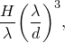

where  is the wavelength, should be much less than 1.0 for Airy wave theory to be applicable and should be less than 10.0 for Stokes theory to be applicable. For ratios of *H*/ greater than 0.142, the crest of the wave is predicted to break. The assumed boundary conditions on the free surface are then no longer valid in either theory, which limits the maximum wave amplitude for either theory.

##### Airy wave theory

Linear Airy wave theory is generally used when the ratio of wave height to water depth, 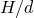, is less than 0.03, provided that the water is deep (ratio of water depth to wavelength, 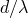, is greater than 20). Convective acceleration terms are neglected in the Airy theory as part of the linearization. The Airy wave theory is described in detail in ["Airy wave theory," Section 6.2.2 of the Abaqus Theory Guide](../stm/stm-link.md#stm-ldc-airywave).

Since the Airy wave theory is linear, any number of wave trains traveling in different directions across the water can be defined; the fluid particle velocities and accelerations sum by linear superposition. The direction of each wave component is given by specifying the direction cosines of a vector, 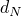, lying in the plane defined by the still fluid surface.

By default, Airy waves are defined in terms of wavelength, . Alternatively, you can define the waves in terms of wave period, . For Airy wave theory the wavelength and period of each component are related by 

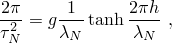

where


is the period of this component,

*g*

is the gravitational acceleration,


is the wavelength, and

*h*

is the undisturbed (still) water depth.

| **Input File Usage: ** | Use the following option to define an Airy wave in terms of wavelength: |
| --- | --- |
|  | ``` [*WAVE](../key/key-link.md#usb-kws-mwave), TYPE=AIRY *amplitude, wavelength, phase angle, x-direction cosine, y-direction cosine* ``` Use the following option to define an Airy wave in terms of wave period: ``` [*WAVE](../key/key-link.md#usb-kws-mwave), TYPE=AIRY, WAVE PERIOD *amplitude, wave period, phase angle, x-direction cosine, y-direction cosine* ``` In either case repeat the data line to define multiple wave trains. |

##### Stokes fifth-order wave theory

The Stokes fifth-order wave theory is a deep-water wave theory that is valid for relatively large wavelengths. Convective terms are included in the fluid particle acceleration calculations for Stokes fifth-order theory and can be significant for larger 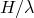 ratios. The Stokes wave theory is described in detail in ["Stokes wave theory," Section 6.2.3 of the Abaqus Theory Guide](../stm/stm-link.md#stm-ldc-stokeswave).

Because the Stokes fifth-order wave theory is nonlinear, only one wave train is allowed in an analysis. The relationship between wavelength and period of the waves in Stokes fifth-order theory is not as simple as that for the Airy theory, although the formula given above is a first-order approximation. Stokes waves can be defined only in terms of the wave period, .

| **Input File Usage: ** | ``` [*WAVE](../key/key-link.md#usb-kws-mwave), TYPE=STOKES *wave height, wave period, phase angle, direction of travel cosines* ``` |
| --- | --- |

##### Gridded wave data

You can choose to provide wave surface elevations, particle velocities and accelerations, and the dynamic pressure at points in a user-defined grid through a binary data file. The binary file contains information about the wave definition, the location of the grid points where wave information is specified, and the wave kinematics at user-defined times. At spatial locations within the user-defined grid, Abaqus/Aqua will interpolate the wave kinematics from the nearest grid points, using either linear or quadratic interpolation. When a point on the structure is above the user-defined grid, Abaqus/Aqua assumes that the point is above the free surface elevation. Hence, no fluid loads are applied. If a point on the structure falls outside the user-defined spatial grid without being above the grid, Abaqus/Aqua finds the wave kinematics at the nearest point within the grid and uses those values at the point on the structure.

| **Input File Usage: ** | ``` [*WAVE](../key/key-link.md#usb-kws-mwave), TYPE=GRIDDED, DATA FILE=*file_name* ``` |
| --- | --- |

##### Binary data file requirements for gridded wave data

The data file must contain the following unformatted (binary) records (see ["Aqua load cases," Section 3.12.1 of the Abaqus Verification Guide](../ver/ver-link.md#ver-prc-aqualoads)). The data for the FORTRAN WRITE statement are given for each record:

First record: 

```
`NCOMP, DTG, NWGX, NWGY, NWGZ, IPDYN`
```

 where

`NCOMP`

is the number of wave components to be read in the data file;

`DTG`

is the time increment at which wave data are given on the grid;

`NWGX`

is the number of grid points in the grid's *x*-direction;

`NWGY`

is the number of grid points in the grid's *y*-direction—if this number is one, Abaqus/Aqua assumes that the wave data are constant with respect to the local *y*-direction;

`NWGZ`

is the number of grid points in the grid's *z*-direction—if this number is zero or one, the analysis is two-dimensional and the *y*-direction is vertical; and

`IPDYN`

is an integer flag indicating whether dynamic pressure information is stored (`IPDYN`=1) or not stored (`IPDYN`=0) in the gridded wave file.

Second record: 

```
`(AMP(K1), WXL(K1), PHI(K1), K1=1,NCOMP)`
```

 where

`NCOMP`

is read on the first record, above;

`AMP`

contains the wave component amplitude, ;

`WXL`

contains the wavelength of this component, ; and

`PHI`

contains the phase angle of this component, 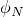 (in degrees).

The second record of this file contains the wave component data used to generate the gridded wave data; it is not used by Abaqus/Aqua. This record is provided only for information in user subroutine [`UEL`](../sub/sub-link.md#sub-xsl-uel) by using the `GETWAVE` interface (see ["Obtaining wave kinematic data in an Abaqus/Aqua analysis," Section 2.1.13 of the Abaqus User Subroutines Reference Guide](../sub/sub-link.md#sub-utl-uwavekinematic)). The meaning of the arrays `AMP` and `WXL` is left to you; however, `PHI` is converted to radians.

Third record: 

```
`(WGX(K1),K1=1,NWGX), (WGY(K1),K1=1,NWGY), (WGZ(K1),K1=1,NWGZ)`
```

 where

`NWG*i*`

are read on the first record, above;

`WGX`

contains the local *x*-coordinates of the grid points;

`WGY`

contains the local *y*-coordinates of the grid points; and

`WGZ`

contains the local *z*-coordinates of the grid points (not included in the gridded wave file for two-dimensional analyses).

Remaining records if `IPDYN=0`:

For three dimensions: 

```
(((WGVX(K1,K2,K3), WGVY(K1,K2,K3), WGVZ(K1,K2,K3),
WGAX(K1,K2,K3), WGAY(K1,K2,K3), WGAZ(K1,K2,K3), K3=1,NWGZ),
WZCRST(K1,K2), NCRST(K1,K2), K1=1,NWGX), K2=1,NWGY)
```

For two dimensions: 

```
((WGVX(K1,K2), WGVY(K1,K2), WGAX(K1,K2), WGAY(K1,K2),
K2=1,NWGY), WZCRST(K1), NCRST(K1), K1=1,NWGX)
```

 Remaining records if `IPDYN=1`:

For three dimensions: 

```
(((WGVX(K1,K2,K3), WGVY(K1,K2,K3), WGVZ(K1,K2,K3),
WGAX(K1,K2,K3), WGAY(K1,K2,K3), WGAZ(K1,K2,K3),
P(K1,K2,K3), DPDZ(K1,K2,K3), K3=1,NWGZ),
WZCRST(K1,K2), NCRST(K1,K2), K1=1,NWGX), K2=1,NWGY)
```

For two dimensions: 

```
((WGVX(K1,K2), WGVY(K1,K2), WGAX(K1,K2), WGAY(K1,K2),
P(K1,K2), DPDZ(K1,K2), K2=1,NWGY),
WZCRST(K1), NCRST(K1), K1=1,NWGX)
```

 where

`WGVX`

contains the local *x*-components of the wave particle velocity,

`WGVY`

contains the local *y*-components of the wave particle velocity,

`WGVZ`

contains the local *z*-components of the wave particle velocity,

`WGAX`

contains the local *x*-components of the wave particle acceleration,

`WGAY`

contains the local *y*-components of the wave particle acceleration,

`WGAZ`

contains the local *z*-components of the wave particle acceleration,

`WZCRST`

contains the wave surface elevation,

`NCRST`

contains the index for the vertical grid level just above the instantaneous water surface,

`P`

contains the dynamic pressure, and

`DPDZ`

contains the gradient of the dynamic pressure in the vertical direction.

##### User-defined wave theory in Abaqus/Standard

A user-defined wave theory can be coded in user subroutine [`UWAVE`](../sub/sub-link.md#sub-xsl-uwave) in an Abaqus/Aqua analysis in Abaqus/Standard. You can define the fluid particle velocity, acceleration, free surface elevation, and fluid pressure field in the user subroutine. 

For stochastic analysis, you can specify a random number seed, *r*, and define frequency/amplitude pairs that define the wave spectrum. During the analysis Abaqus/Aqua stores an intermediate configuration that can be used in the user subroutine to compute the stochastic description of the waves. The intermediate configuration is initialized as the reference configuration and is replaced by the current configuration only when requested by the user subroutine. In this way the stochastic description of the wave field can be stored in an external database and recalculated only when necessary.

| **Input File Usage: ** | Use the following option to specify the wave kinematics in user subroutine [`UWAVE`](../sub/sub-link.md#sub-xsl-uwave): |
| --- | --- |
|  | ``` [*WAVE](../key/key-link.md#usb-kws-mwave), TYPE=USER ``` Use the following option for stochastic analysis to make the intermediate configuration available in user subroutine [`UWAVE`](../sub/sub-link.md#sub-xsl-uwave): ``` [*WAVE](../key/key-link.md#usb-kws-mwave), TYPE=USER, STOCHASTIC=*r* *frequency, amplitude* ... ``` |

##### User-defined wave theory in Abaqus/Explicit

A user-defined wave theory can be coded in user subroutine [`VWAVE`](../sub/sub-link.md#sub-xsl-vwave) in an Abaqus/Aqua analysis in Abaqus/Explicit. You can define the fluid particle velocity, acceleration, free surface elevation, and fluid pressure field in the user subroutine. 

The quantities required to define the wave kinematics can be specified as properties and passed into the user subroutine. For example, in the case of stochastic wave kinematics, any required seed variable and/or frequency-amplitude data pairs can be specified as properties. 

You can also declare and use state variables for user-defined wave calculations, which will be provided at the nodes and initialized to zero at the beginning of the step. You have to update the state variables within the user subroutine. For example, the state variables can be used to store any intermediate configuration of the structure that is used to describe a stochastic wave field.

| **Input File Usage: ** | Use the following option to specify the wave kinematics in user subroutine [`VWAVE`](../sub/sub-link.md#sub-xsl-vwave): |
| --- | --- |
|  | ``` [*WAVE](../key/key-link.md#usb-kws-mwave), TYPE=USER ``` Use the following option to specify properties available as a real-array argument `PROPS` of size `NPROPS` in user subroutine [`VWAVE`](../sub/sub-link.md#sub-xsl-vwave): ``` [*WAVE](../key/key-link.md#usb-kws-mwave), TYPE=USER, PROPERTIES=*nprops* *prop_1, prop_2, ..., prop_8* *..., prop_nprops* ``` Use the following option to specify state variables available as a real-array argument `STATEVAR` of size `NSTATEVAR` in user subroutine [`VWAVE`](../sub/sub-link.md#sub-xsl-vwave): ``` [*WAVE](../key/key-link.md#usb-kws-mwave), TYPE=USER, DEPVAR=*nstatevar* ``` |

#### Wave position as a function of time

For Airy and Stokes waves the position of the wave at time 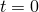 can be chosen by specifying the phase angle  of the wave (or wave components for Airy waves). By default, the waves are chosen such that they have a trough (vertical displacement of the fluid surface is a minimum) at the origin of the horizontal axes at time . You can change this trough by introducing a phase angle  for the waves. A positive phase angle shifts the waves backward in their travel direction (see [Figure 6.11.1--1](pt03ch06s11at30.md#aaqua-zero-phase-wave)).

**Figure 6.11.1–1** Wave of zero phase angle.

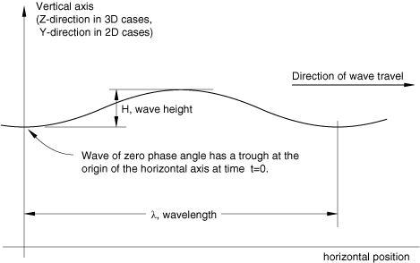

The time *t* used in the wave theory is the total time in the analysis. Therefore, if the direct-integration dynamic steps in which Airy or Stokes waves are applied are preceded by any steps other than direct-integration dynamic steps (such as static steps), it is usually convenient to make the time period in these steps very small compared to the period of the wave.

Because total time is used, the phase of the wave will be continuous from the end of one dynamic step to the beginning of the next dynamic step.

#### Defining a minimum wave trough elevation

For computational efficiency Abaqus/Aqua uses a minimum wave trough elevation below which the structure is assumed to be immersed. Below this elevation no calculation of the fluid surface need be done to determine if the point of interest is above the instantaneous free surface. Similarly, a maximum wave elevation is used: any point above the maximum wave elevation is assumed to have no fluid loading.

For Airy and Stokes waves the minimum and maximum wave elevations are calculated from the wave theory.

For gridded waves Abaqus/Aqua allows the definition of a minimum wave trough elevation: 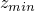 in three-dimensional analysis or 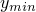 in two-dimensional analysis. The structure is always assumed to be immersed below this elevation. The maximum wave elevation is calculated as the still water elevation plus the difference between this elevation and the minimum wave trough elevation. If the minimum wave trough elevation is not specified for gridded waves, Abaqus/Aqua will compare the elevation of every point on the structure with the instantaneous fluid surface as defined by the gridded data. When defining this elevation, make sure that no wave trough ever drops below the minimum wave trough elevation specified.

| **Input File Usage: ** | ``` [*WAVE](../key/key-link.md#usb-kws-mwave), TYPE=GRIDDED, DATA FILE=*file_name*, MINIMUM=*elevation* ``` |
| --- | --- |

#### Wave kinematics, dynamic pressure, and extrapolation for Airy waves

A spatial (Eulerian) description of the wave field is used for all wave types; therefore, a structural point's coordinates are used to evaluate the wave kinematics. In geometrically nonlinear analysis the structural point's coordinates are its current coordinates. In geometrically linear analysis the wave kinematics are evaluated using the structural point's reference coordinates.

In both geometrically linear and nonlinear analysis for both static and direct-integration dynamic procedures, submergence is calculated to the instantaneous water level at the current value of total time for the analysis. Fluid loading is applied only to those points on the structure below the instantaneous water level.

When buoyancy loading is applied in conjunction with a gravity wave, the dynamic pressure due to the disturbance of the still surface is added to the hydrostatic pressure (measured to the still water level) to obtain the total buoyancy loading, except when the buoyancy loading described by a distributed or concentrated load definition overrides the fluid properties given for the Abaqus/Aqua analysis. Dynamic pressure is included for both static and dynamic procedures for Airy, Stokes, and gridded wave types; however, with gridded wave data you can choose to suppress this effect. See ["Airy wave theory," Section 6.2.2 of the Abaqus Theory Guide](../stm/stm-link.md#stm-ldc-airywave), and ["Stokes wave theory," Section 6.2.3 of the Abaqus Theory Guide](../stm/stm-link.md#stm-ldc-stokeswave), for a definition of dynamic pressure.

Although the linearized Airy wave theory assumes that the fluid displacements are small with respect to the wavelength and the fluid depth, these displacements may not be small with respect to the dimensions of the structure immersed in the fluid. As a result of the linearizing approximations special treatment is necessary to calculate the wave kinematics for points below the instantaneous water level but above the still water line. Abaqus/Aqua uses extrapolation with Airy wave theory: the wave velocity, acceleration, and dynamic pressure for points above the still water level but below the instantaneous free surface are taken to be the values evaluated from the wave theory at the still water level. See ["Airy wave theory," Section 6.2.2 of the Abaqus Theory Guide](../stm/stm-link.md#stm-ldc-airywave), for more details.

#### Reading the data that define gravity waves from an alternate file

The data for the gravity wave can be contained in an alternate file. See ["Input syntax rules," Section 1.2.1](pt01ch01s02aus01.md), for the syntax of the file name.

| **Input File Usage: ** | ``` [*WAVE](../key/key-link.md#usb-kws-mwave), INPUT=*file_name* ``` |
| --- | --- |

#### Visualization of gravity waves

In a three-dimensional analysis you can visualize gravity waves by meshing the free surface of the water with surface elements (see ["General surface element library," Section 32.7.2](pt06ch32s07ael36.md)) and identifying elements as aqua visualization elements through the surface section definition. 

Aqua visualization elements are used for postprocessing only and do not affect the solution. The following must be true for proper use of these elements:

1. Aqua visualization elements can be connected to other visualization elements only through shared nodes. They cannot be connected in any way to any element in the model that is used during the analysis. This includes connections through shared nodes, kinematic constraints, or surface interactions. Abaqus issues an error message during input file preprocessing if these conditions are not met. For example, if you are doing an Abaqus/Aqua analysis of an offshore oil platform, the visualization elements cannot be connected to any element used to model the platform.
2. Any boundary conditions or loads that are applied on the visualization elements are ignored.
3. Density cannot be assigned to the visualization elements.
4. Reinforcement layers cannot be defined for the visualization elements.
5. To visualize the displacements, you must request displacement field output on the output database (`.odb`) file. During the analysis Abaqus computes the *z*-displacements of the elements using whatever wave definitions you include in the model, including user subroutines. Only displacement output can be requested for these elements.
6. The initial *z*-coordinates of the elements should be defined at the still water height; if they are not, Abaqus automatically adjusts them to the still water height during input file preprocessing.

| **Input File Usage: ** | ``` [*SURFACE SECTION](../key/key-link.md#usb-kws-msurfacesection), ELSET =*elset_name*, AQUAVISUALIZATION=YES ``` |
| --- | --- |

### Defining a wind velocity profile

You can define a wind velocity profile. Wind loading is applied only to elements above the still water surface elevation (defined in the fluid properties). If an element is above the still water depth but is submerged due to a wave, the wind loading will still be applied.

The wind profile is assumed to vary with height (the positive *z*-direction in three-dimensional models, the positive *y*-direction in two-dimensional models) according to the power law wind profile and has no variation in the horizontal plane. The power law wind velocity profile is given by 

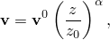

where 

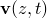

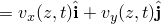 is the local wind velocity (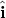 is a unit vector along the local *x*-axis of the wind field, and 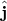 is a unit vector along the local *y*-axis of the wind field);

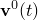

is the time-varying wind velocity at the reference height, , as described below;


is a user-defined constant (default value 1/7);

*z*

is the distance above the still water surface (i.e., 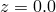 is the still water surface); and


is the reference distance above the still water surface where the time variation of the wind velocity is given.

The wind local system is defined by giving the direction cosines of the unit vector .

| **Input File Usage: ** | ``` [*WIND](../key/key-link.md#usb-kws-mwind) *air density*, , , , *x-direction cosine for *, *y-direction cosine for *,  ``` |
| --- | --- |

#### Prescribing the time variation of wind velocity at the reference height

The variation in time of the wind profile is defined by , the wind velocity vector time history at a reference height 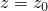: 

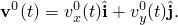

The wind velocity component time histories 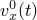 and 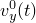 are given by 

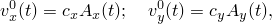

where 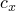 and 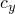 are user-defined as described above (with default values of 1.0) and 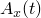 and 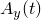 are time-dependent functions defined by referring to amplitude curves from the concentrated or distributed load definitions used to apply the wind loading to the model. If no amplitude curve is referenced, the wind velocity components are the constant values 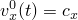 and 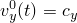.

#### Geometrically linear versus geometrically nonlinear analysis

In geometrically linear analysis wind velocities are calculated based on the original coordinates of the structure. In geometrically nonlinear analysis the current coordinates of a point on the structure are used to calculate the wind velocity at that point.

### Initial conditions

Initial conditions can be applied to the structure in an Abaqus/Aqua analysis in the same way as in static and dynamic analyses without Aqua loads. See ["Initial conditions in Abaqus/Standard and Abaqus/Explicit," Section 34.2.1](pt07ch34s02aus116.md).

### Boundary conditions

Boundary conditions can be applied to the structure in an Abaqus/Aqua analysis in the same way as in static and dynamic analyses without Aqua loads. See ["Boundary conditions in Abaqus/Standard and Abaqus/Explicit," Section 34.3.1](pt07ch34s03aus118.md).

#### Defining contact at the seabed

Aqua loads are applied only above the seabed. To model the bottom of the sea using a contact plane, the elevation of the contact plane must be slightly higher than the seabed level to avoid ambiguity between the contact condition and applied loading. If the contact plane is at the same level as the seabed, there is a risk that round-off problems will cause Aqua loads not to be applied to nodes in contact with the seabed.

### Loads

Steady current, wave, and wind loads are applied to nodes or elements of the structure using concentrated and/or distributed load definitions. Wind loads are applied only if the point is currently above the still fluid surface; fluid loads are applied only if the point is currently below the instantaneous fluid surface and above the seabed. Distributed loads are applied to partly immersed elements.

Concentrated and distributed load definitions cannot be used in eigenfrequency extraction steps, so the loads described below can be applied only in static and direct-integration dynamic steps.

#### Controlling the time variation and magnitude of Aqua loading

You have three ways to control the magnitude of an Aqua load as a function of time:

1. You can reference a user-defined amplitude curve (["Amplitude curves," Section 34.1.2](pt07ch34s01aus115.md)) from the concentrated or distributed load definition to scale the entire load.
2. You can specify a magnitude factor, *M*, for the concentrated or distributed load definition, which is used to scale all the load. This magnitude factor allows normalized amplitude curves to be defined and used for multiple loads. The default magnitude factor is always 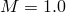.
3. You can reference individual user-defined amplitude curves to scale different components of the loading separately. For example, steady current velocity and wave velocity can be scaled separately by referencing different amplitude curves.

All of these scaling factors are cumulative.

#### Buoyancy loads

The calculated buoyancy of a structure depends on the orientation of the exposed surface area with respect to the vertical direction. This surface area is calculated automatically by Abaqus/Aqua for distributed buoyancy loading; however, you must specify the exposed area and direction cosines of the outward normal at a node for concentrated buoyancy loading.

Abaqus/Aqua uses a closed-end loading condition while computing the distributed buoyancy forces on all line elements. To obtain an open-end loading condition, concentrated buoyancy loading can be used to counteract the buoyancy load applied to the ends of the elements.

The buoyancy loads require the definition of fluid density, seabed and free surface elevation, and the gravitational constant. The default external fluid properties are defined for the model as described in ["Defining the fluid properties](pt03ch06s11at30.md#usb-anl-aaqua-fluidprops).” You can override some of these properties by specifying them directly in the distributed or concentrated load definition. This provides for modeling situations where different parts of the structure are subjected to different buoyancy loads, such as a pipe inside another pipe where the static fluid surrounding the inner pipe is different from the fluid surrounding the outer pipe. Gravity waves (["Wave kinematics, dynamic pressure, and extrapolation for Airy waves](pt03ch06s11at30.md#usb-anl-aaqua-wavekin)”) do not affect the buoyancy loading when any external fluid property is overridden.

##### Specifying distributed buoyancy loads

To apply distributed buoyancy loads to elements immersed in a fluid, the effective outer diameter of beam, truss, and one-dimensional rigid elements must be specified. Provide the external fluid density, free surface elevation, and additional pressure to override the default fluid properties to model the situations described above. For situations where it is necessary to model the fluid inside an element, the effective inner diameter of the element must also be given, along with the density and free surface elevation of the fluid inside the element. 

Distributed buoyancy loading can be applied to rigid surface elements. However, the effects of waves are ignored for these elements; the buoyancy loading is calculated to the still water level only. For proper application of a positive buoyancy force, the positive normal of R3D3 and R3D4 elements must point into the fluid.

| **Input File Usage: ** | ``` [*DLOAD](../key/key-link.md#usb-kws-hdload) *element number or set*, PB, *M*, *effective outer diameter*, *internal fluid density, effective inner diameter, internal free surface elevation, external fluid density, external free surface elevation, additional pressure* ``` |
| --- | --- |

##### Specifying concentrated buoyancy loads

For concentrated buoyancy loads applied to nodes immersed in a fluid, the load is calculated based on the sum of the hydrostatic pressure (measured to the still water level) and the dynamic pressure due to wave action. The total pressure is multiplied by the exposed area associated with the node. The loading is automatically considered to be a follower force in geometrically nonlinear analysis (for elements that have rotational degrees of freedom); therefore, it is not necessary to specify that the load is a follower force. Provide the external fluid density, free surface elevation, and additional pressure to override the default fluid properties to model the situations described above.

| **Input File Usage: ** | ``` [*CLOAD](../key/key-link.md#usb-kws-hcload) *node number or set*, TSB, *M*, *exposed area*, *local coordinate system data, external fluid density, external free surface elevation, additional pressure* ``` |
| --- | --- |

#### Drag loads

Both waves and wind can cause drag loading on a structure. Fluid drag refers to drag caused by the structural member being immersed in the fluid defined by the fluid properties and the gravity waves and, thus, subject to steady current and wave loading. Fluid drag loading is provided by Morison's equation. Fluid drag loads must be specified in terms of a normal (transverse) load and a tangential load.

Wind drag is generated on the portions of a structure that are above the still fluid surface defined by the fluid properties because these portions are exposed to the user-defined wind velocity profile.

##### Specifying distributed transverse fluid or wind drag loads

Distributed transverse drag is defined as follows (see ["Drag, inertia, and buoyancy loading," Section 6.2.1 of the Abaqus Theory Guide](../stm/stm-link.md#stm-ldc-dragbouyancy), for more details):

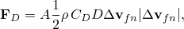

where

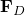

is the force per unit length, transverse to the member;

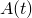

is the current value of the amplitude curve referred to by the distributed load definition, multiplied by the user-defined magnitude factor, *M*;


is the mass density of the fluid (given in the fluid properties) for fluid distributed drag or is the mass density of the air (given in the wind velocity profile) for wind distributed drag;


is the drag coefficient; and

*D*

is the effective outer diameter of the member.

The relative fluid particle velocity in the normal direction, 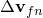, is given by 

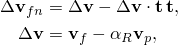

where 


is the fluid particle velocity (see the discussion below);

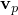

is the velocity of this point on the structure (zero during static steps);


is the structural velocity factor; and


is the unit vector along the axis of the element.

The effective outer diameter of the element, *D*; the drag coefficient, ; and the structural velocity factor, , must be defined in the distributed load definition together with the distributed load type (fluid distributed drag or wind distributed drag).

The velocities due to steady current and waves can be scaled individually for fluid distributed drag by referring to different amplitude curves. Thus, the fluid particle velocity, , at any time is 

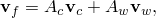

where

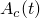

is the current value of the first amplitude curve listed in the load definition or 1.0 if the amplitude reference is omitted,

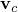

is the steady current velocity defined in the fluid properties,

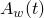

is the current value of the second amplitude curve listed in the load definition or 1.0 if the amplitude reference is omitted, and


is the user-defined wave velocity.

The wind velocity is defined in components relative to the local axes  and  defined for the wind velocity profile. Each velocity component can be scaled independently by referring to different amplitude curves. The total wind velocity at any time, , is 

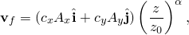

where  and  are the amplitude references provided in the load definition for the velocity components in the local *x*- and *y*-directions, respectively. The values of , , , and  are defined by the wind velocity profile; and *z* is the distance above the still fluid surface.

| **Input File Usage: ** | Use the following option to define fluid distributed drag: |
| --- | --- |
|  | ``` [*DLOAD](../key/key-link.md#usb-kws-hdload) *element number or set*, FDD, *M*, *D*, , , ,  ``` Use the following option to define wind distributed drag: ``` [*DLOAD](../key/key-link.md#usb-kws-hdload) *element number or set*, WDD, *M*, *D*, , , ,  ``` |

##### Specifying distributed tangential fluid drag loads

Distributed tangential fluid loading is a load in the tangential direction of an element due to skin friction. This type of loading is defined as follows (see ["Drag, inertia, and buoyancy loading," Section 6.2.1 of the Abaqus Theory Guide](../stm/stm-link.md#stm-ldc-dragbouyancy), for more details):

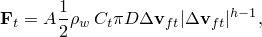

where

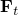

is the force per unit length, tangent to the member;


is the amplitude curve referred to by the distributed load definition,  multiplied by the user-defined magnitude factor, *M*;

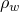

is the mass density of the fluid (given in the fluid properties);


is the tangential drag coefficient;

*D*

is the effective outer diameter of the member; and

*h*

is a constant (by default, 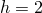, for quadratic dependence of force on velocity).

The relative fluid particle velocity in the tangential direction, 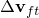, is given by


where


is the fluid particle velocity (as defined above for distributed transverse fluid drag loading),


is the velocity of this point on the structure (zero during static steps),


is the structural velocity factor, and


is the unit vector along the axis of the element.

The effective outer diameter of the element, *D*; the drag coefficient, ; the structural velocity factor, ; and the exponent, *h*, must be defined in the distributed load definition together with the distributed load type (fluid drag tangential).

As with distributed transverse fluid loading, the velocities due to steady current and waves (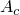 and 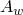) can be scaled individually by referring to different amplitude curves.

| **Input File Usage: ** | Use the following option to define fluid drag tangential: |
| --- | --- |
|  | ``` [*DLOAD](../key/key-link.md#usb-kws-hdload) *element number or set*, FDT, *M*, *D*, , , *h*, ,  ``` |

##### Specifying concentrated fluid or wind drag loads using a concentrated load definition

Concentrated fluid or wind drag loading applies a load normal to the end of an element. Such loading is automatically considered to be a follower force in geometrically nonlinear analysis (for elements that have rotational degrees of freedom).

The drag theory uses Morison's equation (see ["Drag, inertia, and buoyancy loading," Section 6.2.1 of the Abaqus Theory Guide](../stm/stm-link.md#stm-ldc-dragbouyancy)). The drag force is nonzero when the net flow is in the opposite direction of the outward normal to the exposed area and is zero when the net flow is in the direction of the normal: 

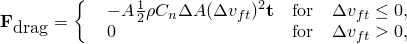

where


is the amplitude curve referenced by the concentrated load definition multiplied by the user-defined magnitude factor, *M*;


is the mass density of the fluid (given in the fluid properties) for transition section fluid drag or is the mass density of the air (given in the wind velocity profile) for transition section wind drag;


is the drag coefficient;


is the exposed area; and

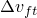

is the relative velocity between the structural member and the fluid particle along  and is given by , where  as defined above for distributed tangential fluid drag loading.

The exposed area, ; the drag coefficient, ; and the structural velocity factor, , must be defined in the concentrated load definition together with the concentrated load type (transition section fluid drag or transition section wind drag).

As with distributed transverse fluid loading, the velocities due to steady current and waves ( and ) and the velocity components of the wind in the  and  directions ( and ) can be scaled individually by referring to different amplitude curves.

| **Input File Usage: ** | Use the following option to define transition section fluid drag: |
| --- | --- |
|  | ``` [*CLOAD](../key/key-link.md#usb-kws-hcload) *node number or set*, TFD, *M*, , , , ,  ``` Use the following option to define transition section wind drag: ``` [*CLOAD](../key/key-link.md#usb-kws-hcload) *node number or set*, TWD, *M*, , , , ,  ``` |

##### Specifying concentrated fluid or wind drag loads using a distributed load definition

You can apply concentrated fluid or wind drag loading on the ends of elements. These loads have the same effect as specifying a concentrated load at a node using a concentrated load definition with concentrated load type transition section fluid drag or transition section wind drag, except that the normal to the exposed area cannot be specified when a distributed load definition is used; the normal to the end of the element is defined by the tangent to the element.

The load can be applied to the first end (node) of the element or to the second end (node 2 or 3, as appropriate) of the element. These loads are nonzero only when the net flow is in the opposite direction of the outward normal to the exposed area.

The loading is exactly the same as that described for the concentrated fluid or wind drag loading applied with a concentrated load definition. The “distributed” form of the loading is provided for convenience.

| **Input File Usage: ** | Use the following option to define fluid drag on the first end of the element: |
| --- | --- |
|  | ``` [*DLOAD](../key/key-link.md#usb-kws-hdload) *element number or set*, FD1, *M*, , *C*, , ,  ``` Use the following option to define fluid drag on the second end of the element: ``` [*DLOAD](../key/key-link.md#usb-kws-hdload) *element number or set*, FD2, *M*, , *C*, , ,  ``` Use the following option to define wind drag on the first end of the element: ``` [*DLOAD](../key/key-link.md#usb-kws-hdload) *element number or set*, WD1, *M*, , *C*, , ,  ``` Use the following option to define wind drag on the second end of the element: ``` [*DLOAD](../key/key-link.md#usb-kws-hdload) *element number or set*, WD2, *M*, , *C*, , ,  ``` |

##### Neglecting the wave's contribution to drag and inertia loading during a step

If the wave's contribution to the drag and inertia loading should not be applied during a step, the concentrated or distributed load component definition must explicitly refer to an amplitude curve with a value of zero. This is the only way to prevent waves from contributing to the fluid velocities and accelerations used in the calculation of these concentrated or distributed load types.

#### Fluid inertia loads (added-mass effects)

Fluid inertia loading causes a structure to have increased inertial resistance to acceleration. This fluid “added-mass” effect is included automatically in a direct-integration dynamic step when fluid inertia loading is applied. Concentrated or distributed added mass must be defined to include the added-mass effect in an eigenfrequency extraction step.

##### Specifying distributed fluid inertia loads in a direct-integration dynamic step

Distributed fluid inertia loading is defined as follows (see ["Drag, inertia, and buoyancy loading," Section 6.2.1 of the Abaqus Theory Guide](../stm/stm-link.md#stm-ldc-dragbouyancy), for a more detailed description):


where


is the force per unit length, transverse to the member, caused by fluid inertia;


is the amplitude curve referred to by the distributed load definition multiplied by the user-defined magnitude factor, *M*;


is the mass density of the fluid (given in the fluid properties);

*D*

is the effective outer diameter of the member;


is the transverse fluid inertia coefficient;


is the transverse added-mass coefficient;


is the transverse component of the fluid acceleration; and


is the transverse component of the beam acceleration (zero during static steps).

The effective outer diameter, *D*; transverse fluid inertia coefficient, ; and transverse added-mass coefficient, , must be defined in the distributed load definition together with the distributed load type (distributed fluid inertia).

The fluid acceleration, , is calculated according to the user-defined gravity wave and is further scaled by the amplitude curve, , referred to by the distributed load definition.

| **Input File Usage: ** | Use the following option to define distributed fluid inertia in a dynamic step: |
| --- | --- |
|  | ``` [*DLOAD](../key/key-link.md#usb-kws-hdload) *element number or set*, FI, *M*, *D*, , ,  ``` |

##### Specifying distributed fluid inertia loads in an eigenfrequency extraction step

The added mass contribution due to distributed fluid inertia loading is 


per unit length of the member in the directions transverse to the axis of the member only, where


is the mass density of the fluid (given in the fluid properties),

*D*

is the effective outer diameter of the member, and


is the transverse added-mass coefficient.

| **Input File Usage: ** | ``` [*D ADDED MASS](../key/key-link.md#usb-kws-hdaddedmass) *element number or set*, FI, *D*,  ``` |
| --- | --- |

##### Specifying concentrated fluid inertia loads in a direct-integration dynamic step using a concentrated load definition

Concentrated fluid inertia loading is automatically considered to be a follower force (for elements that have rotational degrees of freedom).

The inertia term is calculated as a force in the current direction of the outward normal to the exposed surface area: 


where


is the point force caused by fluid inertia;


is the amplitude curve referenced by the concentrated load definition multiplied by the user-defined magnitude factor, *M*;


is the mass density of the fluid (given in the fluid properties);


is the tangential inertia coefficient;


is the fluid acceleration shape factor (of dimension );


is the tangential added-mass coefficient;


is the structural acceleration shape factor (of dimension );


is the fluid acceleration in the direction of the outward normal to the exposed surface; and


is the structural acceleration in the direction of the outward normal to the exposed surface (zero during static steps).

The tangential inertia coefficient, ; the fluid acceleration shape factor, ; the tangential added-mass coefficient, ; and the structural acceleration shape factor, , are given in the concentrated load definition together with the concentrated load type (transition section inertia).

The fluid acceleration, , is calculated according to the user-defined gravity wave and is further scaled by the amplitude curve, , referred to by the concentrated load definition.

| **Input File Usage: ** | Use the following option to define transition section inertia in a dynamic step: |
| --- | --- |
|  | ``` [*CLOAD](../key/key-link.md#usb-kws-hcload) *node number or set*, TSI, *M*, , , , ,  ``` |

##### Specifying concentrated fluid inertia loads in a direct-integration dynamic step using a distributed load definition

You can apply concentrated fluid inertia loading at the ends of elements. These loads have the same effect as specifying a concentrated fluid added-inertia loading using a concentrated load definition with concentrated load type transition section inertia, except that the normal to the exposed area cannot be specified when a distributed load definition is used; the normal to the end of the element is defined by the tangent to the element.

The inertia loading can be applied to the first end (node) of the element or to the second end (node 2 or 3, as appropriate) of the element.

The loading is exactly the same as that described for the concentrated fluid inertia loading applied with a concentrated load definition. The “distributed” form of the loading is provided for convenience.

| **Input File Usage: ** | Use the following option to define fluid inertia on the first end of the element in a dynamic step: |
| --- | --- |
|  | ``` [*DLOAD](../key/key-link.md#usb-kws-hdload) *element number or set*, FI1, *M*, , , , ,  ``` Use the following option to define fluid inertia on the second end of the element in a dynamic step: ``` [*DLOAD](../key/key-link.md#usb-kws-hdload) *element number or set*, FI2, *M*, , , , ,  ``` |

##### Specifying concentrated fluid inertia effects in an eigenfrequency extraction step using a concentrated added mass definition

The added mass contribution due to concentrated fluid inertia loading in an eigenfrequency extraction step is 


in the direction normal to the transition section area, where


is the mass density of the fluid (given in the fluid properties),


is the tangential added-mass coefficient, and


is the structural acceleration shape factor (of dimension ).

| **Input File Usage: ** | ``` [*C ADDED MASS](../key/key-link.md#usb-kws-hcaddedmass) *node number or set*, TSI, ,  *direction cosines defining the outward normal of the exposed area* ``` |
| --- | --- |

##### Specifying concentrated fluid inertia effects in an eigenfrequency extraction step using a distributed added mass definition

You can apply concentrated fluid inertia effects at the ends of elements. These loads have the same effect as specifying concentrated fluid inertia effects using a concentrated added mass definition with concentrated load type transition section inertia, but in this case the normal to the exposed area cannot be specified; the normal to the end of the element is defined by the tangent to the element.

The added mass can be applied to the first end (node) of the element or to the second end (node 2 or 3, as appropriate) of the element.

The effect is exactly the same as that described for the concentrated fluid inertia effects applied with a concentrated added mass definition. The “distributed” form of the loading is provided for convenience.

| **Input File Usage: ** | Use the following option to define fluid inertia on the first end of the element in an eigenfrequency extraction step: |
| --- | --- |
|  | ``` [*D ADDED MASS](../key/key-link.md#usb-kws-hdaddedmass) *element number or set*, FI1, ,  ``` Use the following option to define fluid inertia on the second end of the element in an eigenfrequency extraction step: ``` [*D ADDED MASS](../key/key-link.md#usb-kws-hdaddedmass) *element number or set*, FI2, ,  ``` |

#### Applying non-Aqua loads to the structure

Concentrated and distributed load definitions can also be used to apply concentrated and distributed forces that are not associated with wind, waves, or steady current to the structure. See ["Concentrated loads," Section 34.4.2](pt07ch34s04aus121.md), and ["Distributed loads," Section 34.4.3](pt07ch34s04aus122.md).

### Predefined fields

The following predefined fields can be specified for the structure (not the fluid) in an Abaqus/Aqua analysis, as described in ["Predefined fields," Section 34.6.1](pt07ch34s06aus128.md):
- Temperatures of nodes in the structure can be specified. Any difference between the applied and initial temperatures will cause thermal strain if a thermal expansion coefficient is given for the material (["Thermal expansion," Section 26.1.2](pt05ch26s01abm52.md)). The specified temperature also affects temperature-dependent material properties, if any.
- The values of user-defined field variables can be specified. These values affect only field-variable-dependent material properties, if any.

### Material options

Any of the mechanical constitutive models in Abaqus can be used for modeling the structure in an Abaqus/Aqua analysis (see [Part V, "Materials](pt05.md),” for details on the material models available in Abaqus/Standard).

### Elements

The fluid loads in an Abaqus/Aqua analysis cannot be applied to all element types. Only the beam, pipe, elbow, truss, and rigid beam elements in Abaqus/Standard and linear beam and pipe elements in Abaqus/Explicit can be used to subject a structure to general Abaqus/Aqua loading. The only load that can be applied to two-dimensional rigid surfaces (R3D3 and R3D4 elements) is hydrostatic buoyancy; and this loading can be applied only in Abaqus/Standard. Current, wave, and wind loading have no effect on rigid surfaces.

#### Jack-up foundation analysis

Abaqus/Standard provides element types JOINT2D and JOINT3D, which can be used to model elastic-plastic interaction between spud cans and the sea floor (see ["Elastic-plastic joints," Section 32.10.1](pt06ch32s10alm55.md)). 

### Output

In addition to the usual output variables available in Abaqus/Standard (see ["Abaqus/Standard output variable identifiers," Section 4.2.1](pt02ch04s02abv01.md)) and in Abaqus/Explicit (see ["Abaqus/Explicit output variable identifiers," Section 4.2.2](pt02ch04s02xbv01.md)), element section output variable ESF1 can be used to request output of the effective axial force in a beam subjected to pressure loading (see ["Beam element library," Section 29.3.8](pt06ch29s03ael14.md)). The velocities and accelerations of the fluid cannot be output.

### Input file template

```
[*HEADING](../key/key-link.md#usb-kws-mheading)
…
[*SURFACE SECTION](../key/key-link.md#usb-kws-msurfacesection),ELSET=*aquaviz*,AQUAVISUALIZATION=YES
[*NSET](../key/key-link.md#usb-kws-mnset),NSET=*naquaviz*,ELSET=*aquaviz*
[*AQUA](../key/key-link.md#usb-kws-maqua)
*Data lines defining the fluid properties and steady current velocity*
[*WAVE](../key/key-link.md#usb-kws-mwave), TYPE=*wave theory*
*Data lines defining gravity waves*
**
[*STEP](../key/key-link.md#usb-kws-hstep) (, NLGEOM)
*Use the NLGEOM parameter to include nonlinear geometric effects*
[*DYNAMIC](../key/key-link.md#usb-kws-hdynamic) (*or* [*STATIC](../key/key-link.md#usb-kws-hstatic) *or* [*DYNAMIC](../key/key-link.md#usb-kws-hdynamic), EXPLICIT)
…
[*CLOAD](../key/key-link.md#usb-kws-hcload)
*Data lines defining concentrated buoyancy, fluid/wind drag, and fluid inertia loads*
[*DLOAD](../key/key-link.md#usb-kws-hdload)
*Data lines defining distributed buoyancy, fluid/wind drag, and fluid inertia loads*
[*OUTPUT](../key/key-link.md#usb-kws-houtput), FIELD, TIME INTERVAL=*interval for field output*
[*NODE OUTPUT](../key/key-link.md#usb-kws-hnodeoutput),NSET=*naquaviz*
U
[*END STEP](../key/key-link.md#usb-kws-hendstep)
**
[*STEP](../key/key-link.md#usb-kws-hstep)
*The NLGEOM parameter must have been included in the previous step to obtain
the natural frequencies of the prestressed structure*
[*FREQUENCY](../key/key-link.md#usb-kws-hfrequency)
…
[*C ADDED MASS](../key/key-link.md#usb-kws-hcaddedmass)
*Data lines to define concentrated added-mass effects*
[*D ADDED MASS](../key/key-link.md#usb-kws-hdaddedmass)
*Data lines to define distributed added-mass effects*
[*OUTPUT](../key/key-link.md#usb-kws-houtput), FIELD, TIME INTERVAL=*interval for field output*
[*NODE OUTPUT](../key/key-link.md#usb-kws-hnodeoutput),NSET=*naquaviz*
U
[*END STEP](../key/key-link.md#usb-kws-hendstep)
```


