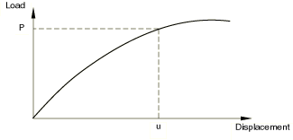
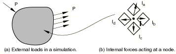
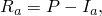
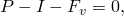

# 7.1.1 求解非线性问题


**产品：** Abaqus/Standard  Abaqus/CAE

##### **参考资料**

- ["收敛与时间积分准则：概述，" 第7.2.1节](pt03ch07s02abo11.md)
- ["常用控制参数，" 第7.2.2节](pt03ch07s02aus50.md)
- ["非线性问题的收敛准则，" 第7.2.3节](pt03ch07s02aus51.md)
- ["瞬态问题的时间积分精度，" 第7.2.4节](pt03ch07s02aus52.md)
- ["配置通用分析过程，" Abaqus/CAE用户指南第14.11.1节](../usi/usi-link.md#usi-sim-configure-general)

### 概述

在Abaqus/Standard中求解非线性问题涉及：
- 增量与迭代过程的组合；
- 使用Newton法求解非线性方程组；
- 确定收敛性；
- 将载荷定义为时间的函数；以及
- 自动选择合适的时间增量。

某些静力问题可能因严重非线性而变得不稳定。Abaqus/Standard提供了一套自动稳定机制来处理此类问题。

### 非线性问题的求解

结构的非线性载荷-位移曲线如图7.1.1-1所示。

**图7.1.1-1** 非线性载荷-位移曲线。



分析的目的是确定此响应。在非线性分析中，解决方案不能像线性问题那样通过求解单个线性方程组来计算。相反，解决方案是通过将载荷指定为时间的函数并逐步增加时间来获得非线性响应。因此，Abaqus/Standard将模拟分解为若干个时间增量，并在每个时间增量结束时找到近似平衡构型。使用Newton法，Abaqus/Standard通常需要多次迭代才能确定每个时间增量可接受的解决方案。

#### 步骤、增量与迭代

- 模拟的时间历程由一个或多个步骤组成。用户定义步骤，通常包括分析过程、载荷和输出请求。不同的载荷、边界条件、分析过程和输出请求可用于每个步骤。例如：步骤1：将板夹在刚性夹具之间。步骤2：施加载荷使板变形。步骤3：找到变形板的固有频率。
- 增量是步骤的一部分。在非线性分析中，每个步骤被分解为增量，以便跟踪非线性求解路径。用户建议第一个增量的大小，之后Abaqus/Standard自动选择后续增量的大小。在每个增量结束时，结构处于（近似）平衡状态，结果可用于写入重启动文件、数据文件、结果文件或输出数据库文件。
- 迭代是在一个增量中寻求平衡解的尝试。如果模型在迭代结束时未处于平衡状态，Abaqus/Standard会尝试另一次迭代。每次迭代中，Abaqus/Standard获得的解应该更接近平衡；但有时迭代过程可能会发散——后续迭代可能偏离平衡状态。在这种情况下，Abaqus/Standard可能会终止迭代过程，并尝试用更小的增量大小来寻找解决方案。

### 收敛

考虑作用在物体上的外力*P*和内力（节点力）*I*（分别参见图7.1.1-2(a)和图7.1.1-2(b)）。作用在节点上的内力是由连接在该节点上的单元中的应力引起的。

**图7.1.1-2** 物体上的内力和外力。



为了使物体处于平衡状态，作用于每个节点的净力必须为零。因此，平衡的基本表述是：内力*I*和外力*P*必须相互平衡：


结构对微小载荷增量ΔP的非线性响应如图7.1.1-3所示。Abaqus/Standard使用结构在配置u_(n)和ΔP处的切线刚度K_T来计算结构的位移修正量Δu_(n+1)。使用Δu_(n+1)，更新结构的配置为u_(n+1)。

**图7.1.1-3** 一个增量中的第一次迭代。


然后，Abaqus/Standard在此更新配置下计算结构的内力I_(n+1)。总施加载荷P与I_(n+1)之间的差值现在可以计算为



其中R_(n+1)是迭代的力残差。

如果模型中每个自由度处的R_(n+1)都为零，则图7.1.1-3中的点a将位于载荷-挠度曲线上，结构将处于平衡状态。在非线性问题中，R_(n+1)永远不会精确为零，因此Abaqus/Standard将其与容差值进行比较。如果所有节点处的R_(n+1)都小于此力残差容差，Abaqus/Standard则接受该解为处于平衡状态。默认情况下，此容差值设置为结构时间平均力的0.5%。Abaqus/Standard在整个模拟过程中自动计算此空间和时间平均力。用户可以通过指定求解控制来更改此容差及所有其他此类容差（参见["非线性问题的收敛准则，" 第7.2.3节](pt03ch07s02aus51.md)）。

如果R_(n+1)小于当前容差值，则认为P和I_(n+1)处于平衡状态，且u_(n+1)是施加载荷下结构的有效平衡构型。但是，在Abaqus/Standard接受该解之前，它还会检查最后的位移修正量Δu_(n+1)相对于总增量位移Δu是否很小。如果Δu_(n+1)大于增量位移的某个分数（默认为1%），Abaqus/Standard将执行另一次迭代。在该时间增量被判定为收敛之前，必须满足两个收敛检查。

如果某次迭代的解未收敛，Abaqus/Standard会执行另一次迭代，以尝试使内力和外力达到平衡。首先，Abaqus/Standard基于更新后的配置u_(n+1)形成结构的新刚度K_(n+1)。该刚度与残差R_(n+1)一起决定了另一次位移修正量Δu_(n+2)，使系统更接近平衡状态（如图7.1.1-4中的点b所示）。

**图7.1.1-4** 第二次迭代。


Abaqus/Standard使用结构新配置I_(n+2)中的内力计算新的力残差R_(n+2)。再次将任意自由度处的最大力残差R_(n+2)与力残差容差进行比较，并将第二次迭代的位移修正量Δu_(n+2)与增量位移Δu进行比较。如有必要，Abaqus/Standard会执行进一步迭代。有关Abaqus/Standard中收敛的更多详细信息，请参见["非线性问题的收敛准则，" 第7.2.3节](pt03ch07s02aus51.md)。

对于非线性分析中的每次迭代，Abaqus/Standard都会形成模型的刚度矩阵并求解方程组。因此，每次迭代的计算成本接近于完成完整线性分析的成本，使非线性分析的计算费用可能比线性分析高出许多倍。由于Abaqus/Standard可以在每个收敛增量处保存结果，非线性模拟可用的输出数据量也可能比相同几何形状线性分析可用的数据量大得多。

### 自动增量控制

默认情况下，Abaqus/Standard自动调整时间增量大小以有效求解非线性问题。用户只需建议模拟中每个步骤第一个增量的大小，之后Abaqus/Standard自动调整增量大小。如果用户未提供建议的初始增量大小，Abaqus/Standard将尝试在单个增量中施加步骤中定义的所有载荷。对于高度非线性问题，Abaqus/Standard将不得不反复减小增量大小以获得解决方案，从而导致CPU时间浪费。提供合理的初始增量大小是有利的，因为只有在轻度非线性问题中，步骤中的所有载荷才能在单个增量中施加。

收敛一个时间增量所需的迭代次数将根据系统的非线性程度而有所不同。默认增量控制下的过程如下。如果在16次迭代内解未收敛或解似乎发散，Abaqus/Standard将放弃该增量，并将增量大小重置为其先前值的25%。然后，它会尝试用这个更小的时间增量找到收敛解。如果解仍然无法收敛，Abaqus/Standard将再次减小增量大小。此过程持续进行，直到找到解。如果时间增量变得小于用户定义的最小值或需要超过5次尝试，Abaqus/Standard将停止分析。

如果增量在少于5次迭代中收敛，这表明求解相当容易。因此，如果连续2个增量需要少于5次迭代才能获得收敛解，Abaqus/Standard会自动将增量大小增加50%。

虽然默认自动增量控制适用于大多数分析，但在必要时用户可以通过指定求解控制来更改所有默认值；参见["常用控制参数，" 第7.2.2节](pt03ch07s02aus50.md)和["瞬态问题的时间积分精度，" 第7.2.4节](pt03ch07s02aus52.md)。

### 不稳定问题的自动稳定

非线性静力问题可能是不稳定的。这种不稳定性可能是几何性质的，例如屈曲；或者是材料性质的，例如材料软化。如果不稳定性表现为具有负刚度的全局载荷-位移响应，则可以将该问题作为["不稳定坍塌和后屈曲分析，" 第6.2.4节](pt03ch06s02at03.md)中所述的屈曲或坍塌问题来处理。然而，如果不稳定是局部的，则应变能将局部地从模型的一部分传递到相邻部分，全局求解方法可能无法工作。这类问题必须通过动力学方法或借助（人工）阻尼来求解；例如，使用减振器。

Abaqus/Standard提供了一种通过自动向模型添加体积比例阻尼来稳定不稳定准静力问题的自动机制。施加的阻尼因子在整个步骤期间可以是恒定的，也可以随时间变化以考虑步骤过程中的变化。后一种自适应方法通常是首选。

#### 具有恒定阻尼因子的静力问题自动稳定

通过在任何非线性准静力过程中包含自动稳定来触发具有恒定阻尼因子的自动稳定。形式为


的粘 l 力被添加到全局平衡方程



其中M是使用 unity 密度计算的人工质量矩阵，c是阻尼因子，是节点速度向量，Δt是时间增量（在被求解问题的上下文中，它可能具有或不具有物理意义）。

对于静力稳定的情况，Timoshenko梁的质量矩阵始终假定各向同性旋转惯性来计算，无论为梁截面定义指定的旋转惯性类型如何（["Timoshenko梁的旋转惯性"在"梁截面行为，" 第29.3.5节](pt06ch29s03alm10.md#usb-elm-ebeamsectionbehavior-rotinertia)）。

自动稳定不会自动延续到后续步骤。对于用户希望其活跃的任何步骤，都需要声明它。Abaqus/Standard根据声明的阻尼强度和步骤第一个增量的解重新计算阻尼因子的新值。因此，除非用户直接指定相同的阻尼因子（参见下面的["直接指定阻尼因子"](pt03ch07s01aus49.md#usb-anl-anonlineareqns-damping)），否则具有不稳定步骤的分析可能产生与将原始步骤拆分为两个步骤的相同分析略有不同的结果。此外，如果模型中的不稳定性在步骤结束前仍未消退，粘 l 力可能会在后续步骤开始时突然终止或改变，如果后续步骤未使用自动稳定，则可能导致收敛困难。如果出现这种情况，建议使用先前步骤中Abaqus/Standard选择的阻尼因子值（或用户在先前步骤中指定的值）重新启动问题。此值会打印在先前步骤的消息（.msg）文件中。如果在发生不稳定之后（并且模型的行为已恢复到稳定状态）需要精确的静态平衡解，则可以使用不带此类稳定的步骤来跟随带自动稳定的步骤。

##### 基于耗散能量分数计算阻尼因子

假设问题在步骤开始时是稳定的，而不稳定性可能在步骤过程中发展。当模型稳定时，粘 l 力和粘 l 能非常小。因此，附加的人工阻尼没有影响。如果局部区域变得不稳定，局部速度会增加，因此释放的部分应变能会被施加的阻尼耗散。Abaqus/Standard可以根据需要减小时间增量，以允许该过程发生而不会导致不稳定的响应引起非常大的位移。Abaqus/Standard根据步骤第一个增量的解计算阻尼因子c并将其打印到消息文件中。在大多数应用中，步骤的第一个增量是稳定的，不需要施加阻尼。然后以这样的方式确定阻尼因子：对于具有与第一个增量相似特征的给定增量，耗散能量是外推应变能量的一个小分数。该分数称为耗散能量分数，默认值为2.0×10⁻⁴。如果使用耗散能量分数的默认值，则下面一节讨论的自适应自动稳定方案将在步骤中自动激活。

或者，用户可以直接为自动稳定指定非默认耗散能量分数。

| **输入文件用法：** | 使用以下任一选项指定非默认耗散能量分数： |
| --- | --- |
|  | ``` [*COUPLED TEMPERATURE-DISPLACEMENT](../key/key-link.md#usb-kws-hcouptempdisp), STABILIZE=*dissipated energy fraction* [*SOILS](../key/key-link.md#usb-kws-hsoils), STABILIZE=*dissipated energy fraction* [*STATIC](../key/key-link.md#usb-kws-hstatic), STABILIZE=*dissipated energy fraction* [*STEADY STATE TRANSPORT](../key/key-link.md#usb-kws-hsteadystatetransport), STABILIZE=*dissipated energy fraction* [*VISCO](../key/key-link.md#usb-kws-hvisco), STABILIZE=*dissipated energy fraction* ``` |

| **Abaqus/CAE用法：** | 步骤模块：**创建步骤**：**常规**：*任何有效步骤类型*：**基本**：从**自动稳定**字段中选择**指定耗散能量分数** |
| --- | --- |

##### 第一个增量不稳定或奇异时的注意事项

在某些情况下，第一个增量要么是不稳定的，要么是奇异的（由于刚性体模式）。在这种情况下，不可能在不施加某些阻尼的情况下获得第一个增量的解。因此，在第一个增量期间已经施加了一些阻尼。用于初始增量的阻尼因子是这样选择的：平均单元阻尼矩阵分量除以步骤时间，等于平均单元刚度矩阵分量乘以耗散能量分数。如果此增量中计算的应变能变化表明无阻尼的解是稳定的，则根据前面描述的能量方法重新计算阻尼因子。然而，如果应变能变化表明解是不稳定或奇异的，则保持最初计算的阻尼因子，并发出警告消息，指示所施加的阻尼量可能不合适。在许多情况下，阻尼量实际上可能相当大，这可能会以不可取的方式影响解。因此，如果发出上述警告消息，请检查粘 l 力（VF）并将其与预期的节点力进行比较，以确保粘 l 力不会支配解。如有必要，可以使用不带稳定的步骤或使用小得多的阻尼因子的步骤来跟随稳定步骤。

##### 直接指定阻尼因子

用户也可以直接指定阻尼因子。不幸的是，除非从先前运行的输出中知道某个值，否则通常很难对阻尼因子做出合理估计；阻尼因子不仅取决于阻尼量，还取决于网格尺寸和材料行为。

| **输入文件用法：** | 使用以下任一选项直接指定阻尼因子： |
| --- | --- |
|  | ``` [*COUPLED TEMPERATURE-DISPLACEMENT](../key/key-link.md#usb-kws-hcouptempdisp), STABILIZE, FACTOR=*damping factor* [*SOILS](../key/key-link.md#usb-kws-hsoils), STABILIZE, FACTOR=*damping factor* [*STATIC](../key/key-link.md#usb-kws-hstatic), STABILIZE, FACTOR=*damping factor* [*STEADY STATE TRANSPORT](../key/key-link.md#usb-kws-hsteadystatetransport), STABILIZE, FACTOR=*damping factor* [*VISCO](../key/key-link.md#usb-kws-hvisco), STABILIZE, FACTOR=*damping factor* ``` |

| **Abaqus/CAE用法：** | 步骤模块：**创建步骤**：**常规**：**耦合温度-位移**、**土体**、**静力，通用**或**粘性**：**基本**：从**自动稳定**字段中选择**指定阻尼因子** |
| --- | --- |

#### 自适应自动稳定方案

如上所述，具有恒定阻尼因子的自动稳定方案通常可以很好地消除不稳定性并消除刚性体模式，而不会对解决方案产生重大影响。但是，不能保证在某些情况下阻尼因子的值是最优的或甚至合适的。对于薄壳模型尤其如此，在这些模型中，如果第一个增量中外推应变能量的估计不佳，阻尼因子可能太高。对于此类模型，如果收敛行为有问题，用户可能不得不增加阻尼因子；如果阻尼因子扭曲了解，则可能不得不减小阻尼因子。前一种情况需要用户用更大的阻尼因子重新运行分析，而后一种情况需要用户对粘 l 阻尼（ALLSD）耗散的能量与总应变能（ALLIE）进行比较。因此，获得阻尼因子最优值是一个手动过程，需要反复试验，直到获得收敛解且耗散稳定能量足够小。

自适应自动稳定方案（阻尼因子可以随空间和时间变化）提供了一种有效的替代方法。在这种情况下，阻尼因子由收敛历史和粘 l 阻尼耗散能量与总应变能量的比值控制。如果由于不稳定性或刚性体模式导致收敛行为有问题，Abaqus/Standard会自动增加阻尼因子。例如，如果分析每个增量需要额外的严重不连续或平衡迭代或需要时间增量削减，阻尼因子可能会增加。另一方面，如果不稳定性和刚性体模式消退，Abaqus/Standard可能会自动减小阻尼因子。

粘 l 阻尼耗散能量与总应变能量的比值受用户指定的精度容差限制。此精度容差在全局级别对整个模型施加。如果整个模型的粘 l 阻尼耗散能量与总应变能量的比值超过精度容差，则调整每个单独单元的阻尼因子，以确保稳定能量与应变能量的比值在全局和局部单元级别都小于精度容差。稳定能量总是增加的，而应变能量可能会减少。因此，Abaqus/Standard限制每个增量的稳定能量增量值与应变能量增量值之比，以确保如果稳定能量总量与应变能量总量之比超过精度容差，则该值不会超过精度容差。精度容差是一个目标值，在某些情况下可能会超过，例如当存在刚性体运动或发生显著的局部不稳定性时。

自适应自动稳定方案使用的默认精度容差为0.05。默认容差适用于大多数应用，但用户可以酌情指定非默认精度容差。如果精度容差设置为零，则自适应自动稳定方案不会被激活，并且将在步骤中使用具有恒定阻尼因子的自动稳定方案。

如果未指定精度容差但使用了默认值为2.0×10⁻⁴的耗散能量分数，则自适应自动阻尼算法将自动激活，精度容差为0.05。

| **输入文件用法：** | 使用以下任一选项激活具有默认稳定能量容差的自适应自动稳定： |
| --- | --- |
|  | ``` [*COUPLED TEMPERATURE-DISPLACEMENT](../key/key-link.md#usb-kws-hcouptempdisp), STABILIZE [*SOILS](../key/key-link.md#usb-kws-hsoils), STABILIZE [*STATIC](../key/key-link.md#usb-kws-hstatic), STABILIZE [*STEADY STATE TRANSPORT](../key/key-link.md#usb-kws-hsteadystatetransport), STABILIZE [*VISCO](../key/key-link.md#usb-kws-hvisco), STABILIZE ``` 使用以下任一选项激活具有非默认稳定能量容差的自适应自动稳定： ``` [*COUPLED TEMPERATURE-DISPLACEMENT](../key/key-link.md#usb-kws-hcouptempdisp), STABILIZE, ALLSDTOL=*accuracy tolerance* [*SOILS](../key/key-link.md#usb-kws-hsoils), STABILIZE, ALLSDTOL=*accuracy tolerance* [*STATIC](../key/key-link.md#usb-kws-hstatic), STABILIZE, ALLSDTOL=*accuracy tolerance* [*STEADY STATE TRANSPORT](../key/key-link.md#usb-kws-hsteadystatetransport), STABILIZE, ALLSDTOL=*accuracy tolerance* [*VISCO](../key/key-link.md#usb-kws-hvisco), STABILIZE, ALLSDTOL=*accuracy tolerance* ``` |

| **Abaqus/CAE用法：** | 步骤模块：**创建步骤**：**常规**：**耦合温度-位移**、**土体**、**静力，通用**或**粘性**：**基本**：从**自动稳定**方法中选择：切换**使用自适应稳定，最大稳定能量与应变能量比：** *精度容差* |
| --- | --- |

##### 初始阻尼因子的默认值

默认情况下，初始阻尼因子的值通常等于用于具有恒定阻尼因子的自动稳定的值（参见上面的["基于耗散能量分数计算阻尼因子"](pt03ch07s01aus49.md#usb-anl-anonlineareqns-dissipated)）。在某些情况下，自适应自动稳定中考虑的其他因素会导致初始阻尼因子存在一些差异。

##### 直接指定初始阻尼因子

或者，用户可以直接指定初始阻尼因子。阻尼因子在整个步骤中根据收敛历史和精度容差进行调整。

| **输入文件用法：** | 使用以下任一选项指定具有默认稳定能量容差的初始阻尼因子： |
| --- | --- |
|  | ``` [*COUPLED TEMPERATURE-DISPLACEMENT](../key/key-link.md#usb-kws-hcouptempdisp), STABILIZE, FACTOR=*damping factor*, ALLSDTOL [*SOILS](../key/key-link.md#usb-kws-hsoils), STABILIZE, FACTOR=*damping factor*, ALLSDTOL [*STATIC](../key/key-link.md#usb-kws-hstatic), STABILIZE, FACTOR=*damping factor*, ALLSDTOL [*STEADY STATE TRANSPORT](../key/key-link.md#usb-kws-hsteadystatetransport), STABILIZE, FACTOR=*damping factor*, ALLSDTOL [*VISCO](../key/key-link.md#usb-kws-hvisco), STABILIZE, FACTOR=*damping factor*, ALLSDTOL ``` |

| **Abaqus/CAE用法：** | 步骤模块：**创建步骤**：**常规**：**耦合温度-位移**、**土体**、**静力，通用**或**粘性**：**基本**：从**自动稳定**字段中，选择**指定阻尼因子：** *阻尼因子*：切换**使用自适应稳定，最大稳定能量与应变能量比：** *最大比值* |
| --- | --- |

##### 将紧邻前一个通用步骤的阻尼因子传播到当前步骤

自适应自动稳定提供了将阻尼因子从紧邻的前一个通用步骤传播到后续步骤的选项。默认情况下，不从先前通用步骤的结果传播阻尼因子。在这种情况下，Abaqus根据声明的耗散能量分数和步骤第一个增量的解重新计算初始阻尼因子，或者用户可以直接指定初始阻尼因子。

| **输入文件用法：** | 使用以下任一选项指示当前步骤中的阻尼因子是从紧邻的前一个通用步骤传播的： |
| --- | --- |
|  | ``` [*COUPLED TEMPERATURE-DISPLACEMENT](../key/key-link.md#usb-kws-hcouptempdisp), STABILIZE, ALLSDTOL, CONTINUE=YES [*SOILS](../key/key-link.md#usb-kws-hsoils), STABILIZE, ALLSDTOL, CONTINUE=YES [*STATIC](../key/key-link.md#usb-kws-hstatic), STABILIZE, ALLSDTOL, CONTINUE=YES [*STEADY STATE TRANSPORT](../key/key-link.md#usb-kws-hsteadystatetransport), STABILIZE, ALLSDTOL, CONTINUE=YES [*VISCO](../key/key-link.md#usb-kws-hvisco), STABILIZE, ALLSDTOL, CONTINUE=YES ``` |

| **Abaqus/CAE用法：** | 步骤模块：**创建步骤**：**常规**：**耦合温度-位移**、**土体**、**静力，通用**或**粘性**：**基本**：从**自动稳定**字段中选择**使用先前通用步骤的阻尼因子**：**使用自适应稳定，最大稳定能量与应变能量比：** *精度容差* |
| --- | --- |

#### 确保使用自动稳定获得准确的解决方案

每当将自动稳定应用于问题时，请检查以下内容以确保获得准确的解决方案：
- 对于使用耗散能量分数计算的阻尼因子，检查在第一个增量结束时打印到消息（.msg）文件中的因子，以确保施加了合理量的阻尼。不幸的是，阻尼因子是问题相关的；因此，用户必须依靠先前运行的经验。
- 将粘 l 力（VF）与分析中的总体力进行比较，并确保粘 l 力相对于模型中的总体力较小。
- 将粘 l 阻尼能量（ALLSD）与总应变能量（ALLIE）进行比较，并确保该比率不超过耗散能量分数或任何合理量。如果结构经历大量运动，粘 l 阻尼能量可能很大。

计算阻尼因子的自动程序在许多应用中运行良好。但是，在某些情况下，计算的阻尼因子要么太小（因此无法控制不稳定性），要么太高（从而导致不准确的结果）。这些问题在使用恒定阻尼因子时更容易发生——阻尼因子是在第一个增量中计算的，这可能不代表步骤其余部分的行为。例如，考虑一个顺序耦合的热应力分析，其中力学分析从先前的瞬态热分析中读取温度。热分析通常表现出扩散过程，在分析早期温度发生快速变化，达到稳态后温度变化很小。在这种情况下，Abaqus将根据第一个增量对应的时间计算外推应变能量（在这个案例中，第一个增量可能有显著的温度变化），从而产生比预期更大的外推应变能量。这反过来又导致阻尼因子过大，从而导致不准确的结果。

如果某种自动稳定方法不能正常工作，用户可以尝试使用另一种自动稳定方法；自适应稳定方案通常是首选。或者，用户可以直接指定阻尼因子。


