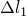
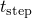
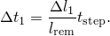

# 9.1.1 重新启动分析


**产品：** Abaqus/Standard  Abaqus/Explicit  Abaqus/CFD  Abaqus/CAE  

##### **参考文献**

- ["输出，" 第 4.1.1 节](pt02ch04s01aus38.md)
- [*RESTART](../key/key-link.md#usb-kws-mrestart)
- ["重新启动分析，" Abaqus/CAE 用户指南第 19.6 节](../usi/usi-link.md#usi-ana-restart)

### 概述

运行分析时，您可以将模型定义和状态写入重新启动所需的文件。

使用重新启动功能的场景包括：

**继续中断的运行**：如果分析因计算机故障而中断，Abaqus 重新启动分析功能允许分析按原始定义完成。

**使用额外步骤继续**：在查看成功分析的结果后，您可能决定将步骤追加到载荷历史中。

**更改分析**：有时，在查看先前分析的结果后，您可能希望从中间点重新启动分析，并以某种方式更改剩余的载荷历史数据。此外，如果先前的分析成功完成，您可能希望在载荷历史中追加额外的步骤。

["输出，" 第 4.1.1 节](pt02ch04s01aus38.md) 描述了从 Abaqus/Standard 重新启动文件获取结果输出的过程。

### 写入重新启动文件

如果您希望能够重新启动分析，必须请求重新启动输出。此输出将被写入可用于重新启动分析的文件。如果您不请求写入重新启动数据，在 Abaqus/Standard 中不会创建重新启动文件，而在 Abaqus/Explicit 和 Abaqus/CFD 中，将创建一个状态文件，仅在每个步骤的开始和结束时包含结果。

在 Abaqus/Standard 中，这些文件是重新启动（`*job-name*`.res`；文件大小限制为 16 吉字节）、分析数据库（`.mdl` 和 `.stt`）、部件（`.prt`）、输出数据库（`.odb`）和线性动力学及子结构数据库（`.sim`）文件。在 Abaqus/Explicit 中，这些文件是重新启动（`*job-name*`.res`；文件大小限制为 16 吉字节）、分析数据库（`.abq`、`.mdl`、`.pac` 和 `.stt`）、部件（`.prt`）、选择结果（`.sel`）和输出数据库（`.odb`）文件。在 Abaqus/CFD 中，这些文件是重新启动和分析数据库（`*job-name*`.sim`）和输出数据库（`.odb`）文件。这些文件（统称为重新启动文件）允许分析在特定运行中完成到某一点，并在后续运行中重新启动并继续。输出数据库文件只需包含模型数据；结果数据不是必需的，可以被抑制。

您可以控制写入重新启动文件的数据量，如下所述。如果在每个步骤定义中包含重新启动请求，则写入重新启动文件的数据量可以从步骤到步骤更改。

在以下线性扰动步骤期间不会写入重新启动信息：
- ["静态应力分析，" 第 6.2.2 节](pt03ch06s02at01.md)（扰动）
- ["特征值屈曲预测，" 第 6.2.3 节](pt03ch06s02at02.md)
- ["直接求解稳态动力学分析，" 第 6.3.4 节](pt03ch06s03at09.md)
- ["复特征值提取，" 第 6.3.6 节](pt03ch06s03at11.md)
- ["瞬态模态动力学分析，" 第 6.3.7 节](pt03ch06s03at12.md)
- ["基于模态的稳态动力学分析，" 第 6.3.8 节](pt03ch06s03at13.md)
- ["基于子空间的稳态动力学分析，" 第 6.3.9 节](pt03ch06s03at14.md)
- ["响应谱分析，" 第 6.3.10 节](pt03ch06s03at15.md)
- ["随机响应分析，" 第 6.3.11 节](pt03ch06s03at16.md)
- ["涡流分析，" 第 6.7.5 节](pt03ch06s07at24.md)

| **输入文件用法：** | 使用以下选项请求写入分析的重启数据： |
| --- | --- |
|  | ``` [*RESTART](../key/key-link.md#usb-kws-mrestart), WRITE ``` [*RESTART](../key/key-link.md#usb-kws-mrestart), WRITE 选项可用作模型数据或历史数据。 |

| **Abaqus/CAE 用法：** | 步骤模块：****输出****重新启动请求**** |
| --- | --- |
|  | 在 Abaqus/CAE 中，重新启动请求始终与特定步骤相关联；您不能为整个分析定义重新启动请求。重新启动请求默认为每个步骤创建；Abaqus/Standard 和 Abaqus/CFD 步骤的重新启动请求默认频率为 0，而 Abaqus/Explicit 步骤的重新启动请求默认间隔数为 1。 |

#### 控制写入重新启动文件的输出频率

您可以指定将数据写入 Abaqus/Standard 重新启动文件和 Abaqus/Explicit 及 Abaqus/CFD 状态文件的频率。要写入的变量无法指定；每次写入完整的数据集。因此，重新启动文件可能非常大，除非您控制写入重新启动信息的频率。如果在精确时间间隔请求 Abaqus/Standard 分析的重新启动信息，Abaqus/Standard 将在每次写入数据时获得一个解。在这种情况下，如果写入重新启动文件的频率很高，增量数量和相应的分析计算成本可能会大幅增加。

##### 指定写入 Abaqus/Standard 重新启动文件的增量频率

默认情况下，Abaqus/Standard 将在增量号恰好能被用户指定的频率值 *N* 整除的每个增量后将数据写入重新启动文件，并在分析的每个步骤结束时写入（无论此时的增量号是多少）。在直接循环或低周疲劳分析中，Abaqus/Standard 仅在加载循环结束时写入数据到重新启动文件；因此，Abaqus/Standard 将在迭代号（在低周疲劳分析中为循环号）恰好能被 *N* 整除的每次迭代（或循环）后以及在分析的每个步骤结束时写入数据到重新启动文件。

| **输入文件用法：** | ``` [*RESTART](../key/key-link.md#usb-kws-mrestart), WRITE, FREQUENCY=*N* ``` |
| --- | --- |
|  | 默认情况下，*N*=1。 |

| **Abaqus/CAE 用法：** | 步骤模块：****输出****重新启动请求****：在每个步骤的**频率**列中输入 *N* |
| --- | --- |
|  | 默认情况下，*N*=0（不写入重新启动信息）。 |

##### 指定写入 Abaqus/Standard 重新启动文件的时间间隔频率

Abaqus/Standard 可以将步骤划分为用户指定数量的时间间隔 *n*，并在每个间隔结束时写入结果，每个步骤共 *n* 个点。如果指定了 *n*，默认情况下，数据将在计算将步骤划分为 *n* 个相等间隔的精确时间写入结果文件。或者，您可以选择在实际间隔结束后的增量时写入信息。

您只能为[表 9.1.1-1](pt04ch09s01aus53.md#usb-anl-arestart-stdtimepointprocedures)中列出的过程指定时间间隔的重新启动输出频率。此外，线性扰动分析不支持此功能。

| **输入文件用法：** | 使用以下选项请求在精确时间间隔写入结果： |
| --- | --- |
|  | ``` [*RESTART](../key/key-link.md#usb-kws-mrestart), WRITE, NUMBER INTERVAL=*n*, TIME MARKS=YES ``` 使用以下选项请求在实际间隔结束后的增量写入结果： ``` [*RESTART](../key/key-link.md#usb-kws-mrestart), WRITE, NUMBER INTERVAL=*n*, TIME MARKS=NO ``` |

| **Abaqus/CAE 用法：** | 步骤模块：****输出****重新启动请求****：在每个步骤的**间隔**列中输入 *n*；如果要在精确时间间隔写入结果，在每个步骤的**时间标记**列中切换 |
| --- | --- |

**表 9.1.1-1** 支持时间间隔重新启动的 Abaqus/Standard 过程列表。
| 过程 | 时间增量 | 精确时间间隔重新启动 | 近似时间间隔重新启动 |
| --- | --- | --- | --- |
| ["静态应力分析，" 第 6.2.2 节](pt03ch06s02at01.md)（除非使用 Riks 方法） | 自动 |  |  |
| 固定 | --- |  |
| ["使用直接积分的隐式动力学分析，" 第 6.3.2 节](pt03ch06s03at07.md) | 自动 |  |  |
| 固定 | --- |  |
| ["非耦合热传递分析，" 第 6.5.2 节](pt03ch06s05at18.md)（除非您指定分析在达到稳态时结束） | 自动 |  |  |
| 固定 | --- |  |
| ["质量扩散分析，" 第 6.9.1 节](pt03ch06s09at28.md)（除非您指定分析在达到稳态时结束） | 自动 |  |  |
| 固定 | --- |  |
| ["耦合孔隙流体扩散和应力分析，" 第 6.8.1 节](pt03ch06s08at26.md)（除非您指定分析在达到稳态时结束） | 自动 |  |  |
| 固定 | --- |  |
| ["完全耦合热应力分析，" 第 6.5.3 节](pt03ch06s05at19.md) | 自动 |  |  |
| 固定 | --- |  |
| ["完全耦合热电结构分析，" 第 6.7.4 节](pt03ch06s07at23.md) | 自动 |  |  |
| 固定 | --- |  |
| ["耦合热电分析，" 第 6.7.3 节](pt03ch06s07at22.md)（除非您指定分析在达到稳态时结束） | 自动 |  |  |
| 固定 | --- |  |
| ["稳态输运分析，" 第 6.4.1 节](pt03ch06s04at17.md) | 自动 |  |  |
| 固定 | --- |  |
| ["基于子空间的稳态动力学分析，" 第 6.3.9 节](pt03ch06s03at14.md) | 固定 | --- |  |
| ["准静态分析，" 第 6.2.5 节](pt03ch06s02at04.md) | 自动 |  |  |
| 固定 | --- |  |

##### 时间增量

如果输出频率以增量数指定，Abaqus/Standard 将调整时间增量以确保在指定的确切时间点写入数据。在某些情况下，Abaqus 可能在时间点之前的增量中使用小于步骤中允许的最小时间增量的时间增量。但是，对于固结、瞬态质量扩散、瞬态热传递、瞬态耦合热电、瞬态耦合温度-位移和瞬态耦合热电结构分析，Abaqus 不会违反步骤中允许的最小时间增量。对于这些过程，如果需要比最小时间增量更小的时间增量，Abaqus 将使用步骤中允许的最小时间增量，并在时间点之后的第一个增量写入重新启动数据。

当以增量数指定输出频率时，完成分析所需的增量数量可能会增加，这可能会对性能产生不利影响。

##### 指定写入 Abaqus/Explicit 状态文件的输出频率

Abaqus/Explicit 将把步骤划分为用户指定数量的时间间隔 *n*，并在步骤开始时和每个间隔结束时写入结果，每个步骤共 *n*+1 个点。默认情况下，结果将在实际间隔结束后的增量写入状态文件。或者，您可以选择在将步骤划分为 *n* 个相等间隔计算的确切时间写入结果。结果总是在步骤结束时写入，因此如果结果仅在步骤结束时需要，则不需要在精确时间间隔请求结果。

如果问题阻止分析继续完成（例如，如果元素变得过度畸变），Abaqus/Explicit 将尝试将最后完成的增量保存到状态文件中。

| **输入文件用法：** | 使用以下选项请求在实际间隔结束后的增量写入结果： |
| --- | --- |
|  | ``` [*RESTART](../key/key-link.md#usb-kws-mrestart), WRITE, NUMBER INTERVAL=*n*, TIME MARKS=NO ``` 使用以下选项请求在精确时间间隔写入结果： ``` [*RESTART](../key/key-link.md#usb-kws-mrestart), WRITE, NUMBER INTERVAL=*n*, TIME MARKS=YES ``` 默认情况下，*n*=1。 |

| **Abaqus/CAE 用法：** | 步骤模块：****输出****重新启动请求****：在每个步骤的**间隔**列中输入 *n*；如果要在精确时间间隔写入结果，在每个步骤的**时间标记**列中切换 |
| --- | --- |
|  | 默认情况下，*n*=1。 |

##### 指定写入 Abaqus/CFD 状态文件的增量频率

Abaqus/CFD 将在增量号恰好能被用户指定的频率值 *N* 整除的每个增量后将数据写入重新启动文件，并在分析的每个步骤结束时写入（无论此时的增量号是多少）。

| **输入文件用法：** | ``` [*RESTART](../key/key-link.md#usb-kws-mrestart), WRITE, FREQUENCY=*N* ``` |
| --- | --- |
|  | 默认情况下，*N*=1。 |

| **Abaqus/CAE 用法：** | 步骤模块：****输出****重新启动请求****：在每个步骤的**频率**列中输入 *N* |
| --- | --- |
|  | 默认情况下，*N*=0（不写入重新启动信息）。 |

##### 指定写入 Abaqus/CFD 状态文件的时间间隔频率

Abaqus/CFD 将把步骤划分为用户指定数量的时间间隔 *n*，并在步骤开始时和每个间隔结束时写入结果，每个步骤共 *n*+1 个点。默认情况下，结果将在实际间隔结束后的增量写入状态文件。

如果问题阻止分析继续完成（例如，如果解不收敛），Abaqus/CFD 将尝试将最后完成的增量保存到状态文件中。

| **输入文件用法：** | ``` [*RESTART](../key/key-link.md#usb-kws-mrestart), WRITE, NUMBER INTERVAL=*n* ``` |

| **Abaqus/CAE 用法：** | 步骤模块：****输出****重新启动请求****：在每个步骤的**间隔**列中输入 *n* |
| --- | --- |
|  | 默认情况下，*n*=0。 |

##### 在协同仿真中同步写入重新启动信息

协同仿真分析之间必须同步重新启动输出才能成功进行协同仿真重新启动。为实现此同步，建议您请求在指定数量的时间间隔 *n* 写入重新启动数据。在这种情况下，Abaqus/Standard、Abaqus/Explicit 和 Abaqus/CFD 将在每个间隔结束后的协同仿真目标时间立即写入重新启动信息。如果以增量指定重新启动数据的输出频率，则很难同步写入重新启动信息，重新启动分析可能从两个不同的时间点开始，可能导致不平衡。

| **输入文件用法：** | 使用以下选项同步在协同仿真中写入的重新启动信息： |
| --- | --- |
|  | ``` [*RESTART](../key/key-link.md#usb-kws-mrestart), WRITE, NUMBER INTERVAL=*n* ``` 在协同仿真使用 NUMBER INTERVAL 参数时，[*RESTART](../key/key-link.md#usb-kws-mrestart) 选项上的 TIME MARKS 参数始终设置为 NO。 |

| **Abaqus/CAE 用法：** | 步骤模块：****输出****重新启动请求****：在每个步骤的**间隔**列中输入 *n* |
| --- | --- |

#### 控制写入 Abaqus/Explicit 状态文件的精度

默认情况下，当以双精度运行分析时，Abaqus/Explicit 以双精度写入状态文件。或者，如果您想减小状态文件的大小，可以选择以单精度将数据写入状态文件。此选项可能导致步骤边界处或重新启动分析第一步的结果有噪声。如果以单精度运行 Abaqus/Explicit，则忽略此控制参数，始终使用单精度。

| **输入文件用法：** | ``` [*RESTART](../key/key-link.md#usb-kws-mrestart), WRITE, SINGLE ``` |
| --- | --- |

| **Abaqus/CAE 用法：** | Abaqus/CAE 不支持单精度状态文件输出。 |
| --- | --- |

#### 在重新启动文件中叠加结果

对于 Abaqus/Standard 或 Abaqus/Explicit 分析，您可以指定仅保留每个步骤的一个增量（对于直接循环分析为一个迭代）的数据，从而最小化文件大小。当数据被写入时，它们会覆盖先前为同一步骤写入的前一个增量（如有）的数据。您可以为每个步骤单独指定数据是否应该被覆盖。由于在 Abaqus/Explicit 中默认仅在步骤结束时写入结果，建议结合指定写入数据的时间间隔数来叠加数据；这样，重新启动文件中的数据会按照使用的间隔数向前推进。

为防止系统崩溃时丢失数据，当 Abaqus/Standard 从给定增量写入帧时，它不会严格覆盖上一个保存增量的帧。相反，它始终保留一个备用帧，只有在下一个帧被安全写入文件后才释放给定的保存帧供覆盖。此备用帧不会被删除，除非需要为后续增量释放空间。此过程在分析的最后一个步骤中（如果在该步骤中发生叠加且分析成功完成）会产生一个额外的帧；用户会观察到最后一个步骤也保留了倒数第二个重新启动帧，即使正在使用覆盖。

叠加重新启动数据的优点是它最小化了存储重新启动文件所需的空间。

| **输入文件用法：** | 在 Abaqus/Standard 中使用以下选项： |
| --- | --- |
|  | ``` [*RESTART](../key/key-link.md#usb-kws-mrestart), WRITE, OVERLAY ``` 在 Abaqus/Explicit 中使用以下选项： ``` [*RESTART](../key/key-link.md#usb-kws-mrestart), WRITE, OVERLAY, NUMBER INTERVAL=*n* ``` |

| **Abaqus/CAE 用法：** | 步骤模块：****输出****重新启动请求****：点击勾选每个步骤的**覆盖**列 |
| --- | --- |

### 重新启动分析

您可以通过指定在原始分析中创建的重新启动或状态、分析数据库和部件文件被读入新分析来重新启动（继续）分析。重新启动文件必须在第一个作业完成时保存。在 Abaqus/Explicit 中，包（`.pac`）文件和选择结果（`.sel`）文件也用于重新启动分析，必须在第一个作业完成时保存。由于重新启动文件可能非常大，必须提供足够的磁盘空间（在 Abaqus/Standard 中，分析输入文件处理器估计重新启动文件所需的空间）。

您可以指定在何处继续新运行中的分析，如下所述。

分析不能从["写入重新启动文件"](pt04ch09s01aus53.md#usb-anl-arestart-writing)中列出的线性扰动步骤重新启动。

此外，如果 Abaqus/Standard 或 Abaqus/Explicit 分析被操作系统命令终止或因电源故障而突然终止，则该作业可能无法恢复或重新启动。在这种情况下，分析过程中打开的文件不会正确关闭，这可能导致数据丢失和不完整的文件。

| **输入文件用法：** | 使用以下选项重新启动分析： |
| --- | --- |
|  | ``` [*RESTART](../key/key-link.md#usb-kws-mrestart), READ ``` 当包含 READ 参数时，[*RESTART](../key/key-link.md#usb-kws-mrestart) 选项必须作为模型数据出现。它通常出现在输入文件中 [*HEADING](../key/key-link.md#usb-kws-mheading) 选项之后的第一个选项。 |

| **Abaqus/CAE 用法：** | 作业模块：作业编辑器：将**重新启动**切换为**作业类型** |
| --- | --- |

#### 识别要重新启动的分析

在 Abaqus/Standard 重新启动分析中，您必须指定包含指定步骤和增量的重新启动文件的名称。在 Abaqus/Explicit 或 Abaqus/CFD 重新启动分析中，您必须指定包含指定步骤和间隔的状态文件的名称。

如果请求重新启动的步骤和增量、迭代、循环或间隔号不存在于指定的重新启动或状态文件中，Abaqus 会发出错误消息。

| **输入文件用法：** | 在命令行上输入以下内容： |
| --- | --- |
|  | **abaqus** **job**=*job-name* **oldjob**=`*oldjob-name*` |

| **Abaqus/CAE 用法：** | 任何模块：****模型****编辑属性*****model_name*****：**重新启动**：切换勾选**从作业读取数据**并输入 *oldjob-name* |
| --- | --- |

#### 指定重新启动点

您可以指定先前分析中要重新启动的点（步骤和增量、迭代、循环或间隔）。在重新启动时截断先前分析中的步骤在下面讨论。

##### 为 Abaqus/Standard 分析指定重新启动点（从直接循环或低周疲劳分析重新启动除外）

从任何非直接循环或低周疲劳分析重新启动的 Abaqus/Standard 分析将在用户指定的步骤和增量之后立即继续分析。如果不指定步骤或增量，分析将从重新启动文件中找到的最后一个可用步骤和增量重新启动。

| **输入文件用法：** | ``` [*RESTART](../key/key-link.md#usb-kws-mrestart), READ, STEP=*step*, INC=*increment* ``` |
| --- | --- |

| **Abaqus/CAE 用法：** | 任何模块：****模型****编辑属性*****model_name*****：**重新启动**：切换勾选**从作业读取数据**、**步骤名称：***step*、切换勾选**从增量、间隔、迭代或循环重新启动**，并输入 *increment* |
| --- | --- |

##### 为从直接循环分析重新启动的 Abaqus/Standard 分析指定重新启动点

从先前的直接循环分析重新启动的 Abaqus/Standard 分析只能从加载循环结束时重新启动。在这种情况下，您应该指定新分析将恢复的步骤和迭代号。

在尚未达到稳定循环的重新启动直接循环分析中，您可以增加迭代数或傅里叶项数，从而允许分析继续（请参阅["直接循环分析，" 第 6.2.6 节](pt03ch06s02at05.md)）。

| **输入文件用法：** | ``` [*RESTART](../key/key-link.md#usb-kws-mrestart), READ, STEP=*step*, ITERATION=*iteration* ``` |
| --- | --- |

| **Abaqus/CAE 用法：** | 任何模块：****模型****编辑属性*****model_name*****：**重新启动**：切换勾选**从作业读取数据**、**步骤名称：***step*、切换勾选**从增量、间隔、迭代或循环重新启动**，并输入 *iteration* |
| --- | --- |

##### 为从低周疲劳分析重新启动的 Abaqus/Standard 分析指定重新启动点

从先前的低周疲劳分析重新启动的 Abaqus/Standard 分析只能从加载循环结束时重新启动。在这种情况下，您应该指定新分析将恢复的步骤和循环号。

| **输入文件用法：** | ``` [*RESTART](../key/key-link.md#usb-kws-mrestart), READ, STEP=*step*, CYCLE=*cycle* ``` |
| --- | --- |

| **Abaqus/CAE 用法：** | 任何模块：****模型****编辑属性*****model_name*****：**重新启动**：切换勾选**从作业读取数据**、**步骤名称：***step*、切换勾选**从增量、间隔、迭代或循环重新启动**，并输入 *cycle* |
| --- | --- |

##### 为 Abaqus/Explicit 分析指定重新启动点

Abaqus/Explicit 重新启动分析将在用户指定的步骤和间隔之后立即继续分析。您必须指定 Abaqus/Explicit 重新启动分析将继续的步骤。如果不指定重新启动的间隔或指定当前步骤应在指定间隔终止，分析将从指定步骤的状态文件中可用的最后一个间隔重新启动。

| **输入文件用法：** | ``` [*RESTART](../key/key-link.md#usb-kws-mrestart), READ, STEP=*step*, INTERVAL=*interval* ``` |
| --- | --- |

| **Abaqus/CAE 用法：** | 任何模块：****模型****编辑属性*****model_name*****：**重新启动**：切换勾选**从作业读取数据**、**步骤名称：***step*、切换勾选**从增量、间隔、迭代或循环重新启动**，并输入 *interval* |
| --- | --- |

##### 为 Abaqus/CFD 分析指定重新启动点

Abaqus/CFD 重新启动分析将在用户指定的步骤和增量之后立即继续分析。您必须指定 Abaqus/CFD 重新启动分析将继续的步骤和增量。如果不指定步骤或增量，将发出错误消息。

| **输入文件用法：** | ``` [*RESTART](../key/key-link.md#usb-kws-mrestart), READ, STEP=*step*, INC=*increment* ``` |
| --- | --- |

| **Abaqus/CAE 用法：** | 任何模块：****模型****编辑属性*****model_name*****：**重新启动**：切换勾选**从作业读取数据**、**步骤名称：***step*、切换勾选**从增量、间隔、迭代或循环重新启动**，并输入 *increment* |
| --- | --- |

#### 不更改继续分析

要不更改继续分析，只需在重新启动点之后的步骤定义为重新启动分析。所有其他信息已保存到重新启动文件。此功能不能用于使用协同仿真技术的 Abaqus 分析，也不能用于 Abaqus/CFD 分析。

##### 不更改继续 Abaqus/Standard 分析

在 Abaqus/Standard 中，当重新启动只是为了继续一个长步骤时（例如，可能因为作业的时间限制超出而终止），重新启动运行的数据可能仅仅包括从另一个分析读取重新启动数据的请求。

| **输入文件用法：** | ``` [*RESTART](../key/key-link.md#usb-kws-mrestart), READ ``` |
| --- | --- |

| **Abaqus/CAE 用法：** | 任何模块：****模型****编辑属性*****model_name*****：**重新启动**：切换勾选**从作业读取数据** |
| --- | --- |

##### 不更改继续 Abaqus/Explicit 分析

在 Abaqus/Explicit 中，当重新启动只是为了继续一个长步骤时（例如，可能因为 CPU 时间限制超出而终止），不要使用重新启动分析；而是使用恢复分析。在这种情况下，不需要数据（除非使用用户子程序）。

| **输入文件用法：** | 在命令行上输入以下内容： |
| --- | --- |
|  | **abaqus** **job**=*job-name* **recover** |

| **Abaqus/CAE 用法：** | 作业模块：作业编辑器：将**恢复（Explicit）**切换为**作业类型** |
| --- | --- |

#### 截断步骤

当您重新启动分析时，可以在步骤完成之前将其截断。例如，默认情况下，如果先前的分析是 Abaqus/Standard 过程并且您指定重新启动点为步骤 *p*，重新启动分析将从步骤 *p* 的最后保存增量重新启动并继续该步骤。但是，如果您指定重新启动点为步骤 *p* 的增量 *n* 并且该步骤应在重新启动前终止，重新启动分析将从步骤 *p* 的增量 *n* 重新启动，在该点结束步骤 *p*，然后继续新定义的步骤。在这种情况下，从中重新启动的步骤将在重新启动时被视为已完成，即使可能尚未应用所有载荷。分析的继续将由重新启动运行中提供的历史数据定义。

当在 Abaqus/Explicit 重新启动分析中截断分析步骤时，必须指定重新启动后的间隔。当在 Abaqus/CFD 重新启动分析中截断分析步骤时，必须指定重新启动后的增量。

如果从中重新启动的步骤正常完成，您可以截断该步骤以在步骤内重新启动，从而请求额外输出、以更高频率写入重新启动文件等。在 Abaqus/Explicit 中，当步骤内发生意外事件时，可能需要截断分析步骤；例如，如果由于意外位移需要修改接触表面定义。如果从中重新启动的步骤正常完成并且从最后一个增量、迭代或间隔重新启动，截断分析步骤将无效。

如果从被操作系统截断的作业重新启动（例如，由于磁盘空间不足、超出运行时间限制等），通常您不会选择截断分析步骤，以便旧步骤首先完成，然后再开始新步骤（如果存在）。如果从在 Abaqus 内部提前终止的步骤结束重新启动（例如，因为增量用尽或未能收敛），您必须截断步骤并包含新的步骤定义。如果不截断步骤，Abaqus 将在重新启动时尝试继续旧步骤，并以与之前相同的方式终止分析。

| **输入文件用法：** | 在 Abaqus/Standard 中使用以下选项从任何非直接循环步骤重新启动： |
| --- | --- |
|  | ``` [*RESTART](../key/key-link.md#usb-kws-mrestart), READ, STEP=*p*, INC=*n*, END STEP ``` 在 Abaqus/Standard 中使用以下选项从直接循环分析步骤重新启动： ``` [*RESTART](../key/key-link.md#usb-kws-mrestart), READ, STEP=*p*, ITERATION=*n*, END STEP ``` 在 Abaqus/Standard 中使用以下选项从低周疲劳分析步骤重新启动： ``` [*RESTART](../key/key-link.md#usb-kws-mrestart), READ, STEP=*p*, CYCLE=*n*, END STEP ``` 在 Abaqus/Explicit 中使用以下选项： ``` [*RESTART](../key/key-link.md#usb-kws-mrestart), READ, STEP=*p*, INTERVAL=*n*, END STEP ``` |

| **Abaqus/CAE 用法：** | 任何模块：****模型****编辑属性*****model_name*****：**重新启动**：切换勾选**从作业读取数据**；**步骤名称：***step*；切换勾选**从增量、间隔、迭代或循环重新启动**，输入 *increment*、*interval*、*iteration* 或 *cycle*；并切换勾选**在此点终止步骤** |
| --- | --- |

##### 幅值参考

如果载荷和边界条件引用幅值曲线（["幅值曲线，" 第 34.1.2 节"](pt07ch34s01aus115.md)），应小心处理。如果幅值以总时间给出，载荷和边界条件将继续按照幅值定义应用。但是，如果幅值以步骤时间（默认）给出，载荷和边界条件将在步骤终止时的值处保持不变。

如果在旧步骤中未重新定义，则在旧步骤中应用的温度、场变量和质量流率将保留在新步骤中。如果未指定幅值曲线，这些量将继续根据过程的默认幅值应用。

##### Abaqus/Standard 中的自动稳定

在 Abaqus/Standard 中，当在截断步骤的点处自动稳定处于活动状态时，应谨慎处理。这可能发生在使用自动稳定的准静态过程中间（请参阅["求解非线性问题，" 第 7.1.1 节"](pt03ch07s01aus49.md)），或在使用自动粘性阻尼的接触分析期间（请参阅["在 Abaqus/Standard 中调整接触控制，" 第 36.3.6 节"](pt09ch36s03aus150.md)）。在这种情况下，可能存在粘性力，不会被带到后续步骤，因此导致收敛困难。

对于使用自动稳定的准静态过程，建议在后续步骤中继续强制执行稳定，并直接指定阻尼因子，使用 Abaqus/Standard 在消息文件中打印的最后一个值。对于接触对中尚未完全建立的自动粘性阻尼，建议重新应用阻尼，但不能保证与原始步骤中应用的阻尼量相同。

##### 为 Abaqus/Standard 重新启动分析选择初始时间增量

在 Abaqus/Standard 中，如果先前的步骤被截断，在为新步骤选择时间段和初始时间增量时要小心。在瞬态分析中，新步骤的初始时间增量应该类似于在旧步骤中重新启动点处使用的时间增量。在准静态分析中，选择新步骤的初始时间增量，使载荷或规定边界条件的增量类似于在旧步骤中重新启动点处的增量。

在非线性分析中，重新启动运行第一个增量中施加的载荷增量应该类似于先前运行最后收敛增量中施加的载荷增量。让



= 重新启动运行第一个增量中要施加的载荷，


= 重新启动运行中要施加的剩余载荷，


= 重新启动运行的初始时间增量，以及



= 重新启动运行第一步的总步骤时间。

则可使用以下方程确定重新启动运行的初始时间增量：



##### 示例

假设 Abaqus/Standard 作业因达到步骤指定的最大增量数而停止运行。原始输入文件如下：

```
[*HEADING](../key/key-link.md#usb-kws-mheading)
 …
[*STEP](../key/key-link.md#usb-kws-hstep), INC=4
[*STATIC](../key/key-link.md#usb-kws-hstatic), DIRECT
 0.1, 1.0
[*CLOAD](../key/key-link.md#usb-kws-hcload)
 1, 2, 20.0
[*RESTART](../key/key-link.md#usb-kws-mrestart), WRITE, FREQUENCY=2
[*END STEP](../key/key-link.md#usb-kws-hendstep)
```

此运行在步骤 1、增量 4 处结束，施加的载荷为 8.0。可以使用以下输入文件重新启动此作业并完成加载：

```
[*HEADING](../key/key-link.md#usb-kws-mheading)
[*RESTART](../key/key-link.md#usb-kws-mrestart), READ, STEP=1, INC=4, END STEP
[*STEP](../key/key-link.md#usb-kws-hstep), INC=120
[*STATIC](../key/key-link.md#usb-kws-hstatic), DIRECT
 0.1, 0.6
[*CLOAD](../key/key-link.md#usb-kws-hcload)
 1, 2, 20.0
[*END STEP](../key/key-link.md#usb-kws-hendstep)
```

请注意，施加的集中载荷与先前步骤中的相同。

在此示例中，假设在先前运行的最后收敛增量中施加的载荷增量为 2.0。因此，选择重新启动运行的初始时间增量，使得第一个增量期间施加的载荷增量也是 2.0。重新启动运行中要施加的剩余载荷为 12.0（总计 20.0 减去先前运行中施加的 8.0）。代入初始时间增量方程得  = /6。重新启动作业第一步的步骤时间  选择为 0.6，使得当施加的载荷为 20.0 时（在步骤结束时）总累积时间为 1.0。因此，重新启动运行的初始时间增量  设置为 0.1。

#### 在重新启动分析中提供额外数据

可以定义在重新启动点之后的步骤。也可以在重新启动分析期间提供新的幅值定义、新的表面、新的节点集和新的单元集。现有集无法修改。

在 Abaqus/Standard 中，在重新启动分析的模型部分中定义的额外表面具有以下限制：它们只能从基于表面的载荷定义（请参阅["载荷，" 第 34.4 节"](pt07ch34s04.md)）或用户定义表面截面的输出请求（请参阅["输出到数据和结果文件，" 第 4.1.2 节"](pt02ch04s01aus39.md)）中引用。

##### 示例

例如，假设一个单步 Abaqus/Explicit 作业因超出 CPU 时间限制而提前停止，您决定应添加具有新边界条件定义的第二步。可以使用以下输入文件重新启动此作业、完成步骤 1 的剩余部分并完成步骤 2：

```
[*HEADING](../key/key-link.md#usb-kws-mheading)
[*RESTART](../key/key-link.md#usb-kws-mrestart), READ, STEP=1
**
** This defines Step 2
**
[*STEP](../key/key-link.md#usb-kws-hstep)
[*DYNAMIC](../key/key-link.md#usb-kws-hdynamic), EXPLICIT
 , .003
[*BOUNDARY](../key/key-link.md#usb-kws-hboundary), OP=NEW
 …
[*END STEP](../key/key-link.md#usb-kws-hendstep)
```

#### 重新启动分析中可选历史数据的继续

控制可选分析历史数据——载荷、边界条件、输出控制和辅助控制（请参阅["在 Abaqus 中定义模型，" 第 1.3.1 节"](pt01ch01s03aus03.md)）的继续的规则，对于重新启动分析中定义的步骤和原始分析中的步骤是相同的。关于控制可选历史数据继续的规则的讨论，请参阅["定义分析，" 第 6.1.2 节"](pt03ch06s01abo05.md)。

#### 在重新启动分析中规定预定义场

可以在重新启动分析中规定预定义场（请参阅["预定义场，" 第 34.6.1 节"](pt07ch34s06aus128.md)）。

要在 Abaqus/Standard 重新启动分析中指定预定义温度或场变量，相应的预定义场必须在原始分析中已指定为初始温度或场变量（["Abaqus/Standard 和 Abaqus/Explicit 中的初始条件，" 第 34.2.1 节"](pt07ch34s02aus116.md)）或预定义温度或场变量（["预定义场，" 第 34.6.1 节"](pt07ch34s06aus128.md)）。

#### 使用用户子程序重新启动

用户子程序不会被写入 Abaqus/Standard 重新启动文件或 Abaqus/Explicit 状态文件。因此，如果原始分析包含任何用户子程序，这些子程序必须再次包含在重新启动运行中，或在恢复重新启动数据的额外结果输出时（请参阅["输出"中的"从 Abaqus/Standard 重新启动数据恢复额外结果输出，" 第 4.1.1 节"](pt02ch04s01aus38.md#usb-out-ooutput-postoutput)）。这些子程序可以在重新启动时修改；但是，应谨慎进行修改，因为它们可能使重新启动所依据的解无效。

### 同时读取和写入重新启动文件

您可以继续前一个分析作为重新启动分析，并将重新启动分析的结果写入新的重新启动文件或状态文件。例如，如果先前的分析是 Abaqus/Explicit 过程并且在当前分析中指定重新启动点为步骤 *p* 并且重新启动输出频率为 *n*，分析将从步骤 *p* 的最后保存间隔重新启动，并根据 *n* 的新值在后续步骤中写入重新启动状态。

当重新启动先前的分析时，要在 Abaqus/Standard 中停止写入重新启动文件，请指定重新启动输出频率为 0；如果不指定频率，文件将继续以先前分析定义的频率写入。

#### 新的重新启动文件

对于大型模型或涉及许多重新启动增量（除非您选择叠加重新启动数据——请参阅["在重新启动文件中叠加结果"](pt04ch09s01aus53.md#usb-anl-arestart-overlay)"）的作业，重新启动文件可能非常大。因此，当作业重新启动时，先前的重新启动文件不会复制到新重新启动文件的开头；只有当前运行中请求的重新启动增量的数据才会保存到新的重新启动文件。但是，如果重新启动特征值提取步骤（["自然频率提取，" 第 6.3.5 节"](pt03ch06s03at10.md)）并请求额外的特征值，新的重新启动文件将包含在第一次运行中收敛的那些特征值以及额外的特征值。

#### 示例：Abaqus/Standard

假设 Abaqus/Standard 作业因磁盘空间不足而停止运行。重新启动文件中最后一个完整增量信息来自步骤 2、增量 4。可以使用以下两行输入文件重新启动此作业并继续写入重新启动文件：

```
[*HEADING](../key/key-link.md#usb-kws-mheading)
[*RESTART](../key/key-link.md#usb-kws-mrestart), READ, STEP=2, INC=4, WRITE
```

#### 示例：Abaqus/Explicit

假设您因为生成了太多输出而停止了 Abaqus/Explicit 作业。状态文件中的最后信息来自步骤 2、间隔 4，时间为 .004。步骤 2 的时间段为 .010，并在 10 个间隔请求重新启动结果。可以使用以下输入文件重新启动此作业并重新定义步骤的剩余部分，并减少输出请求：

```
[*HEADING](../key/key-link.md#usb-kws-mheading)
[*RESTART](../key/key-link.md#usb-kws-mrestart), READ, END STEP, STEP=2, INTERVAL=4
[*STEP](../key/key-link.md#usb-kws-hstep)
[*DYNAMIC](../key/key-link.md#usb-kws-hdynamic), EXPLICIT
 , .006
[*RESTART](../key/key-link.md#usb-kws-mrestart), WRITE, NUMBER INTERVAL=2
[*END STEP](../key/key-link.md#usb-kws-hendstep)
```

### 重新启动时输出的继续

当您重新启动分析时，Abaqus 会创建一个新的输出数据库文件（`*job-name*`.odb`）和一个新的结果文件（`*job-name*`.fil`；此文件不是在 Abaqus/CFD 中创建的），并根据以下所述的标准向这些文件写入输出数据。

#### 输出数据库（`.odb`）文件

Abaqus 输出数据库文件（`*job-name*`.odb`）包含可用于在 Abaqus/CAE 中进行后处理的结果。默认情况下，输出数据库文件不会在重新启动之间保持连续；每次运行作业时，Abaqus 都会创建一个新的输出数据库文件。您可以在 Abaqus/CAE 的可视化模块中组合从多个输出数据库文件提取的 X–Y 数据。或者，您也可以通过运行 **abaqus** **restartjoin** 执行程序来合并原始分析和重新启动分析的场和历史结果。有关更多信息，请参阅["连接重新启动分析的输出数据库（`.odb`）文件，" 第 3.2.21 节"](pt01ch03s02abx21.md)。

#### 结果（`.fil`）文件

在 Abaqus/Standard 和 Abaqus/Explicit 中创建的 Abaqus 结果文件（`*job-name*`.fil`）包含用户指定的结果，可用于外部后处理包中的后处理。在 Abaqus/Explicit 中，结果也会写入选择结果文件（`*job-name*`.sel`），然后将其转换为用于后处理的结果文件。详见["输出，" 第 4.1.1 节"](pt02ch04s01aus38.md)。

重新启动时，Abaqus/Standard 会将旧结果文件中的信息复制到新作业结果文件中，直到重新启动点，然后在那个点之后开始向新文件写入新结果。Abaqus/Explicit 会将旧选择结果文件中的信息复制到新作业的选择结果文件中，直到重新启动点，然后在那个点之后开始向新文件写入新结果。

如果未提供旧的结果文件，Abaqus/Standard 将继续分析，仅将重新启动分析的结果写入新的结果文件。因此，您将在不同文件中获得分析结果的片段，这在大多数情况下应该避免，因为后处理程序假设结果在单个连续文件中。如有需要，您可以使用 **abaqus** **append** 执行程序（["连接结果（`.fil`）文件，" 第 3.2.14 节"](pt01ch03s02abx14.md)）合并此类分段的结果文件。

### 重新启动兼容性

Abaqus/Standard 中的重新启动分析可以使用与相同或任何先前维护版本相同的一般版本生成的重新启动文件。例如，如果原始分析使用 Abaqus 6.14-3 维护版本执行，则所有后续 Abaqus 6.14 维护版本都可用于启动重新启动分析。重新启动在不同一般版本之间不兼容（例如，在 Abaqus 6.13 和 Abaqus 6.14 之间）。

在 Abaqus/Explicit 和 Abaqus/CFD 中，原始分析和重新启动分析必须使用完全相同的版本。例如，如果原始分析使用 Abaqus 6.14-3 维护版本执行，则只有这个确切版本可用于启动重新启动分析。

Abaqus 中的重新启动分析和 Abaqus/Explicit 中的恢复分析必须在与生成重新启动文件所用的计算机二进制兼容的计算机上运行。


