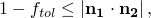

# 9.2.1 在 Abaqus 分析之间传输结果：概述


**产品：** Abaqus/Standard  Abaqus/Explicit  Abaqus/CAE  

##### **参考文献**

- ["在 Abaqus/Explicit 和 Abaqus/Standard 之间传输结果，" 第 9.2.2 节](pt04ch09s02aus55.md)
- ["将结果从一个 Abaqus/Standard 分析传输到另一个，" 第 9.2.3 节](pt04ch09s02aus56.md)
- ["将结果从一个 Abaqus/Explicit 分析传输到另一个，" 第 9.2.4 节](pt04ch09s02aus57.md)
- [*IMPORT](../key/key-link.md#usb-kws-mimport)
- [*IMPORT ELSET](../key/key-link.md#usb-kws-mimportelset)
- [*IMPORT NSET](../key/key-link.md#usb-kws-mimportnset)
- [*IMPORT CONTROLS](../key/key-link.md#usb-kws-mimportcontrols)
- [*INSTANCE](../key/key-link.md#usb-kws-minstance)
- ["在 Abaqus 分析之间传输结果，" Abaqus/CAE 用户指南第 16.6 节](../usi/usi-link.md#usi-lbi-import)

### 概述

Abaqus 提供了从 Abaqus/Standard 导入变形网格及其相关材料状态到 Abaqus/Explicit，反之亦然的功能。此功能在制造问题中特别有用；例如，可以分析整个金属板成型过程（需要初始预加载、成型和后续回弹）。在这种情况下，初始预加载可以使用静态过程通过 Abaqus/Standard 进行模拟，随后的成型过程可以使用 Abaqus/Explicit 进行模拟。最后，回弹分析可以在 Abaqus/Standard 中执行。

Abaqus 还提供了将所需结果和模型信息从 Abaqus/Standard 分析传输到新的 Abaqus/Standard 分析，或从 Abaqus/Explicit 分析传输到新的 Abaqus/Explicit 分析的功能，在继续分析之前可以指定其他模型定义。例如，在装配过程中，分析人员可能首先对特定组件的局部行为感兴趣，但随后关心的是装配产品的行为。在这种情况下，可以首先在 Abaqus/Standard 或 Abaqus/Explicit 分析中分析局部行为。随后，可以将此分析中的模型信息和结果传输到第二个 Abaqus/Standard 或 Abaqus/Explicit 分析，在其中可以为其他组件指定额外的模型定义，然后可以分析整个产品的行为。

为此功能正常工作，必须在同一台二进制兼容的计算机上运行相同版本的 Abaqus/Explicit 和 Abaqus/Standard。此外，只能从先前的一个分析请求传输模型和结果；不支持从多个分析传输。

### 保存分析结果

原始分析的重新启动文件包含从 Abaqus/Standard 或 Abaqus/Explicit 传输的分析结果。获取重新启动文件的详细说明在["写入重新启动文件"中的"重新启动分析，" 第 9.1.1 节"](pt04ch09s01aus53.md#usb-anl-arestart-writing)中；下面提供简要摘要。默认情况下，Abaqus/Standard 不写入任何重新启动信息，而 Abaqus/Explicit 在每个步骤的开始和结束时写入结果。

#### 从 Abaqus/Standard 保存结果

如果要从 Abaqus/Standard 分析导入结果，原始 Abaqus/Standard 作业的结果必须写入重新启动（`.res`）、分析数据库（`.mdl` 和 `.stt`）、部件（`.prt`）和输出数据库（`.odb`）文件。

您可以指定写入重新启动信息的增量。在 Abaqus/Standard 中请求重新启动数据时，重新启动信息总是在请求的增量以及步骤结束时写入。

| **输入文件用法：** | ``` [*RESTART](../key/key-link.md#usb-kws-mrestart), WRITE, FREQUENCY=*n* ``` |
| --- | --- |

| **Abaqus/CAE 用法：** | 步骤模块：****输出****重新启动请求****：在每个步骤的**频率**列中输入 *n* |
| --- | --- |

#### 从 Abaqus/Explicit 保存结果

如果要从 Abaqus/Explicit 分析导入结果，原始 Abaqus/Explicit 作业的结果必须在需要传输变形体状态的时间写入状态（`.abq`）文件。状态（`.abq`）、重新启动（`.res`）、分析数据库（`.stt`）、包（`.pac`）、部件（`.prt`）和输出数据库（`.odb`）文件将用于从 Abaqus/Explicit 导入结果。

您可以指定是在 Abaqus/Explicit 分析步骤期间以指定时间间隔 *n* 的确切时间写入结果，还是在实际间隔结束后的增量写入结果。结果总是在步骤结束时写入，因此如果结果仅从步骤结束时读取，则不需要在精确时间间隔请求结果。

| **输入文件用法：** | 使用以下选项请求在实际间隔结束后的增量写入结果： |
| --- | --- |
|  | ``` [*RESTART](../key/key-link.md#usb-kws-mrestart), WRITE, NUMBER INTERVAL=*n*, TIME MARKS=NO ``` 使用以下选项请求在精确时间间隔写入结果： ``` [*RESTART](../key/key-link.md#usb-kws-mrestart), WRITE, NUMBER INTERVAL=*n*, TIME MARKS=YES ``` |

| **Abaqus/CAE 用法：** | 步骤模块：****输出****重新启动请求****：在每个步骤的**间隔数**列中输入 *n*；如果您要在精确时间间隔写入结果，点击勾选每个步骤的**时间标记**列 |
| --- | --- |

### 指定模型数据和结果的传输

导入功能用于将模型数据和结果从一个分析传输到另一个。以下部分描述了如何指定导入请求。您可以从未定义为部件实例装配的模型导入单元集，也可以从定义为部件实例装配的模型导入部件实例。在 Abaqus/CAE 中，您只能从定义为部件实例装配的模型导入模型数据和结果。

尽管可以在同一单元集中指定不同类型的单元（如 C3D4、C3D6、C3D8R 等），但如果模型要用于导入分析，单元类型的最大数量限制为三个。

#### 为未定义为部件实例装配的模型指定模型数据和结果的传输

您可以从先前的分析导入单元集，以指定未定义为部件实例装配的模型的模型数据和结果的传输。此导入功能在["二维拉延弯曲的回弹，" Abaqus 例题指南第 1.5.1 节](../exa/exa-link.md#exa-sta-springback)和["圆杯的轴对称成型，" Abaqus 例题指南第 1.3.7 节](../exa/exa-link.md#exa-sta-axiform)中进行了说明。

要导入的每个单元集必须在原始分析中定义。您可以导入任何单元集，包括嵌套单元集和具有重叠元素的单元集。导入的单元集也可以是另一个导入单元集的子集。这些集中的元素以及单元集定义都会被导入。即使一个单元可能包含在多个导入的单元集中，每个单元在导入分析中仅被导入一次。不能使用原始分析的内部单元集。

| **输入文件用法：** | 使用以下选项从先前的分析导入单元集： |
| --- | --- |
|  | ``` [*IMPORT](../key/key-link.md#usb-kws-mimport) *list of element sets that are to be imported* ``` 例如，以下输入导入 BLANK1 和 BLANK2 的单元集定义以及 BLANK 的元素和单元集定义：原始分析 ``` [*SHELL SECTION](../key/key-link.md#usb-kws-mshellsection), MATERIAL=STEEL1, ELSET=BLANK1 .00082, 5 [*SHELL SECTION](../key/key-link.md#usb-kws-mshellsection), MATERIAL=STEEL2, ELSET=BLANK2 .00082, 5 [*ELSET](../key/key-link.md#usb-kws-melset), ELSET=BLANK BLANK1, BLANK2 ``` 导入分析 ``` [*IMPORT](../key/key-link.md#usb-kws-mimport) BLANK ``` 为防止单元和节点定义的任何歧义，必须在输入文件中定义额外模型数据的任何选项之前指定 [*IMPORT](../key/key-link.md#usb-kws-mimport) 选项。此外，[*IMPORT](../key/key-link.md#usb-kws-mimport) 选项只能指定一次。 |

| **Abaqus/CAE 用法：** | 在 Abaqus/CAE 中，您只能从定义为部件实例装配的模型导入模型数据和结果。 |
| --- | --- |

#### 为定义为部件实例装配的模型指定模型数据和结果的传输

您可以从先前的分析导入部件实例，以指定定义为部件实例装配的模型的模型数据和结果的传输。如果导入多个部件实例，这些部件实例必须来自同一输出数据库（`.odb`）文件，并且所有导入参数对每个导入的部件实例必须相同。您指定的每个实例名称必须与原始分析中的实例名称相同。只有在导入实例内定义的集才会被导入。必须在装配级别定义的集必须在导入分析中重新定义。可以在导入时添加新的集定义和表面定义。您不能为导入的部件实例分配新的截面、材料取向、法向或梁取向。

| **输入文件用法：** | 使用以下选项从先前的分析导入部件实例： |
| --- | --- |
|  | ``` [*INSTANCE](../key/key-link.md#usb-kws-minstance), INSTANCE=*instance-name* * Additional set and surface definitions (optional)* [*IMPORT](../key/key-link.md#usb-kws-mimport) [*END INSTANCE](../key/key-link.md#usb-kws-mendinstance) ``` |

| **Abaqus/CAE 用法：** | 在 Abaqus/CAE 中，您只能从定义为部件实例装配的模型导入模型数据和结果。 |
| --- | --- |
|  | 载荷模块：**创建预定义场**：**步骤：初始**：为**类别**选择**其他**，为**所选步骤的类型**选择**初始状态**：选择应分配初始状态的实例 |

#### 识别要从中获取数据的分析

您必须指定要从中获取模型和结果数据的作业名称。

| **输入文件用法：** | 对于所有模型，您可以在命令行上输入以下内容： |
| --- | --- |
|  | ``` `abaqus` `job`=*job-name* `oldjob`=`*oldjob-name*` ``` 如果省略 **oldjob** 参数，Abaqus 将提示输入作业名称（请参阅["Abaqus/Standard、Abaqus/Explicit 和 Abaqus/CFD 执行，" 第 3.2.2 节"](pt01ch03s02abx02.md)），即使当前作业是使用恢复选项从状态文件中最后可用的步骤和增量重新启动的 Abaqus/Explicit 分析。或者，对于定义为部件实例装配的模型，您可以使用以下选项： ``` [*INSTANCE](../key/key-link.md#usb-kws-minstance), LIBRARY=*oldjob-name* ``` 如果导入多个部件实例，LIBRARY 参数指定的 *oldjob-name* 对每个导入的部件实例必须相同。如果使用 **oldjob** 选项在命令行上指定作业名称，则命令行规范优先于 LIBRARY 参数。 |

| **Abaqus/CAE 用法：** | 在 Abaqus/CAE 中，您只能从定义为部件实例装配的模型导入模型数据和结果。 |
| --- | --- |
|  | 载荷模块：**创建预定义场**：**步骤：初始**：为**类别**选择**其他**，为**所选步骤的类型**选择**初始状态**：**作业名称：***output-database-name* |

#### 导入模型数据

只有在更新了参考配置（请参阅["更新参考配置"](pt04ch09s02aus54.md#usb-anl-atransferoverview-update)"）且未导入材料状态（请参阅["导入材料状态"](pt04ch09s02aus54.md#usb-anl-atransferoverview-state)"）时，才能重新定义导入元素的属性定义。在这种情况下，也可以重新定义导入元素的材料取向定义（["取向，" 第 2.2.5 节"](pt01ch02s02aus15.md)）、沙漏刚度但不是沙漏控制定义，以及（对于壳单元）横向剪切刚度定义。

对于其他参考配置和材料状态组合，需要为每个导入元素定义截面所需的信息将从原始分析导入。材料取向在导入分析中不能重新定义；取向名称不能在导入分析中重复使用。对于导入的元素，材料取向将从原始分析传输。对于导入的壳单元，不能重新定义横向剪切刚度；将从原始分析传输值。导入元素的沙漏刚度在 Abaqus/Standard 导入分析中不能重新定义；将使用默认值。导入元素使用的截面控制定义（运动学公式、准确性阶数的元素公式和沙漏控制方法）不能重新定义（请参阅["在 Abaqus/Explicit 和 Abaqus/Standard 之间传输结果，" 第 9.2.2 节"](pt04ch09s02aus55.md)中的详细信息）。

只导入与导入元素关联的节点。可以在导入分析中定义新节点。

只要更新了参考配置、未导入材料状态且不是从实例库导入，就可以定义与要导入的节点或元素使用相同编号的节点或元素。新的定义将覆盖导入的定义。如果未更新参考配置，则无论是否导入材料状态，新节点或元素都不能使用导入的节点和元素编号。

在从 Abaqus/Standard 分析到另一个 Abaqus/Standard 分析或从 Abaqus/Explicit 到另一个 Abaqus/Explicit 分析的结果传输期间，如果更新了参考配置且未导入材料状态，则可以通过重新指定节点定义来修改导入节点的坐标从其导入值。在从 Abaqus/Explicit 到 Abaqus/Standard 或反之亦然的传输过程中，不允许修改导入节点的坐标。

#### 导入由分布定义的模型数据

在从 一个 Abaqus/Standard 分析传输结果到另一个 Abaqus/Standard 分析时，由分布（请参阅["分布定义，" 第 2.8.1 节"](pt01ch02s08aus26.md)）定义的大多数元素或材料属性会随元素一起导入。唯一的例外是在复合壳和实体的层上定义的空间变化厚度和取向角；在这种情况下，Abaqus 会在输入文件预处理期间发出错误消息。

在从 Abaqus/Explicit 分析传输结果到 Abaqus/Standard 分析时，可以由分布导入的唯一空间变化元素属性是壳和实体元素的壳厚度和截面取向。如果任何其他元素或材料属性由分布定义，Abaqus 会在输入文件预处理期间发出错误消息。

在从 Abaqus/Standard 分析传输结果到 Abaqus/Explicit 分析或从 Abaqus/Explicit 分析传输结果到另一个 Abaqus/Explicit 分析时，可以由分布导入的唯一空间变化元素属性是壳厚度、壳和实体元素的截面取向、在复合壳层的壳截面上定义的取向角，以及为通用壳截面直接指定的截面刚度矩阵。如果任何其他元素或材料属性由分布定义，Abaqus 会在输入文件预处理期间发出错误消息。

只有更新了参考配置（请参阅["更新参考配置"](pt04ch09s02aus54.md#usb-anl-atransferoverview-update)"）且未导入材料状态（请参阅["导入材料状态"](pt04ch09s02aus54.md#usb-anl-atransferoverview-state)"）时，才能使用分布重新定义导入元素的截面和材料属性。在这种情况下，也可以重新定义导入元素的材料取向定义（["取向，" 第 2.2.5 节"](pt01ch02s02aus15.md)）、沙漏刚度但不是沙漏控制定义，以及（对于壳单元）横向剪切刚度定义。

#### 从 Abaqus/Standard 分析导入结果（非直接循环分析）

如果要从 Abaqus/Standard 分析导入结果，您可以指定要在其中导入结果的重新启动文件中的步骤和增量。默认情况下，导入分析结束 时写入的结果。

| **输入文件用法：** | ``` [*IMPORT](../key/key-link.md#usb-kws-mimport), STEP=*step*, INCREMENT=*increment* ``` |
| --- | --- |
|  | 对于定义为部件实例装配的模型，[*IMPORT](../key/key-link.md#usb-kws-mimport) 选项必须出现在部件实例定义内。 |

| **Abaqus/CAE 用法：** | 在 Abaqus/CAE 中，您只能从定义为部件实例装配的模型导入模型数据和结果。 |
| --- | --- |
|  | 载荷模块：**创建预定义场**：**步骤：初始**：为**类别**选择**其他**，为**所选步骤的类型**选择**初始状态**：选择实例：**步骤**：选择**指定**：*step* 和**帧**：选择**指定**：*increment* |

#### 从 Abaqus/Standard 直接循环分析导入结果

如果要从直接循环分析导入结果，您可以指定要在其中导入结果的重新启动文件中的步骤和迭代号。默认情况下，导入分析结束时写入的结果。

| **输入文件用法：** | ``` [*IMPORT](../key/key-link.md#usb-kws-mimport), STEP=*step*, ITERATION=*iteration* ``` |
| --- | --- |
|  | 对于定义为部件实例装配的模型，[*IMPORT](../key/key-link.md#usb-kws-mimport) 选项必须出现在部件实例定义内。 |

| **Abaqus/CAE 用法：** | 在 Abaqus/CAE 中，您只能从定义为部件实例装配的模型导入模型数据和结果。 |
| --- | --- |
|  | 载荷模块：**创建预定义场**：**步骤：初始**：为**类别**选择**其他**，为**所选步骤的类型**选择**初始状态**：选择实例：**步骤**：选择**指定**：*step* 和**帧**：选择**指定**：*iteration* |

#### 从 Abaqus/Explicit 分析导入结果

如果要从 Abaqus/Explicit 分析导入结果，您可以指定要在其中导入结果的状态文件中的步骤和间隔。默认情况下，导入分析结束时写入的结果。

| **输入文件用法：** | ``` [*IMPORT](../key/key-link.md#usb-kws-mimport), STEP=*step*, INTERVAL=*interval* ``` |
| --- | --- |
|  | 对于定义为部件实例装配的模型，[*IMPORT](../key/key-link.md#usb-kws-mimport) 选项必须出现在部件实例定义内。 |

| **Abaqus/CAE 用法：** | 在 Abaqus/CAE 中，您只能从定义为部件实例装配的模型导入模型数据和结果。 |
| --- | --- |
|  | 载荷模块：**创建预定义场**：**步骤：初始**：为**类别**选择**其他**，为**所选步骤的类型**选择**初始状态**：选择实例：**步骤**：选择**指定**：*step* 和**帧**：选择**指定**：*interval* |

#### 更新参考配置

一旦 Abaqus 分析的当前模型配置导入到 Abaqus/Explicit 或 Abaqus/Standard，可以继续分析，也可以选择更新参考配置为导入的配置。如果未将参考配置更新为导入的配置，位移和应变将报告为相对于原始参考配置的总值，因此将是连续的。如果将参考配置更新为导入的配置，则在导入分析中报告的位移和应变是相对于更新后参考配置的总值。如果您需要相对于导入的配置显示结果（例如，在回弹分析中可能需要），此选择很有用。如果导入的分析是几何线性的，则不能更新参考配置。

是否更新参考配置的选择可能影响与 Abaqus/Standard 中接触初始化相关的无应变节点调整。无应变调整可用于解析参考配置中存在的穿透或间隙，因此在未更新参考配置时，Abaqus/Standard 的无应变调整算法不考虑先前的位移。Abaqus/Explicit 中的无应变节点调整基于当前配置而非参考配置，因此这些调整对在 Abaqus/Explicit 中是否更新参考配置不敏感。有关无应变调整的更多详细信息，请参阅["Abaqus/Standard 中默认接触初始化方法"中的"控制 Abaqus/Standard 中的初始接触状态，" 第 36.2.4 节"](pt09ch36s02aus142.md#usb-cni-agenlcontinitializationstd-default)；["控制 Abaqus/Standard 中的初始接触状态，" 第 36.2.4 节"](pt09ch36s02aus142.md)；["控制 Abaqus/Explicit 中一般接触的初始接触状态，" 第 36.4.4 节"](pt09ch36s04aus158.md)；以及["调整 Abaqus/Explicit 中接触对的初始表面位置并指定初始间隙，" 第 36.5.4 节"](pt09ch36s05aus163.md)。

如果导入连接器元素，只要未导入状态，就可以更新配置。

导入超弹性材料时，如果未导入状态，必须更新配置。

| **输入文件用法：** | 使用以下选项指定将参考配置更新为导入的配置： |
| --- | --- |
|  | ``` [*IMPORT](../key/key-link.md#usb-kws-mimport), STEP=*step*, UPDATE=YES ``` 使用以下选项指定不应将参考配置更新为导入的配置： ``` [*IMPORT](../key/key-link.md#usb-kws-mimport), STEP=*step*, UPDATE=NO ``` 对于定义为部件实例装配的模型，[*IMPORT](../key/key-link.md#usb-kws-mimport) 选项必须出现在部件实例定义内。 |

| **Abaqus/CAE 用法：** | 在 Abaqus/CAE 中，您只能从定义为部件实例装配的模型导入模型数据和结果。 |
| --- | --- |
|  | 载荷模块：**创建预定义场**：**步骤：初始**：为**类别**选择**其他**，为**所选步骤的类型**选择**初始状态**：切换打开或关闭**更新参考配置** |

#### 导入材料状态

您可以指定是否导入相关的材料状态。如果选择导入材料状态，将导入以下内容：
- 应力；
- 等效塑性应变；
- 运动硬化模型的后应力；
- 用户定义的状态变量；
- 混凝土损伤塑性模型相关的状态变量；
- 具有内聚单元牵引-分离响应的损伤相关状态变量；
- 韧性金属的损伤相关状态变量；
- 纤维增强复合材料的损伤相关状态变量；
- Mullins 效应变形历史中的最大偏应变能密度；
- 粘弹性材料模型的内部应变和应力；以及
- 连接器状态变量，如塑性应变、摩擦滑移和损伤状态。

因此，只有对于以下材料，状态才能正确导入以进行进一步分析：
- 线弹性，
- Mises 塑性（包括运动硬化模型），
- 扩展 Drucker-Prager 塑性，
- 可压碎泡沫塑性，
- Mohr-Coulomb 塑性，
- 临界状态（粘土）塑性，
- 铸铁塑性，
- 混凝土损伤塑性，
- 超弹性（包括 Mullins 效应），
- 超泡沫，
- 粘弹性，
- 具有损伤的内聚单元牵引-分离响应，
- 韧性金属的损伤，
- 纤维增强复合材料的损伤，
- 连接器行为，
- 在用户子程序 [`UMAT`](../sub/sub-link.md#sub-xsl-umat) 和 [`VUMAT`](../sub/sub-link.md#sub-xsl-vumat) 中定义的材料，以及
- 使用并行流变框架定义非线性粘弹性-弹塑性行为的材料。

对于所有其他材料模型，只会导入应力。不会导入其他状态变量。

如果材料行为在用户子程序中定义，您必须确保 [`UMAT`](../sub/sub-link.md#sub-xsl-umat) 和 [`VUMAT`](../sub/sub-link.md#sub-xsl-vumat) 是一致的。

如果导入连接器元素，只要未更新配置，就可以导入状态。

导入超弹性材料时，如果未更新配置，必须导入状态。

| **输入文件用法：** | 使用以下选项指定应导入材料状态： |
| --- | --- |
|  | ``` [*IMPORT](../key/key-link.md#usb-kws-mimport), STATE=YES ``` 使用以下选项指定不应导入材料状态： ``` [*IMPORT](../key/key-link.md#usb-kws-mimport), STATE=NO ``` 对于定义为部件实例装配的模型，[*IMPORT](../key/key-link.md#usb-kws-mimport) 选项必须出现在部件实例定义内。 |

| **Abaqus/CAE 用法：** | 在 Abaqus/CAE 中，您只能从定义为部件实例装配的模型导入模型数据和结果。Abaqus/CAE 始终导入材料状态。如果您只想导入变形网格，可以从输出数据库的所选步骤和增量导入孤立的网格；请参阅["什么样的文件可以导入和导出 Abaqus/CAE？" Abaqus/CAE 用户指南第 10.1.1 节](../usi/usi-link.md#usi-imp-concepts-whatkind)。 |
| --- | --- |

#### 导入时定义约束

大多数约束（如多点点约束和基于表面的绑定约束）不会从原始分析导入，必须在导入分析中重新定义；然而，嵌入单元约束默认会被导入。请参阅["运动学约束：概述，" 第 35.1.1 节"](pt08ch35s01abo32.md)，了解各种运动学约束的讨论。

如果在导入分析中定义了新约束，确保约束在参考配置或导入分析的起始配置中不违反，这很重要。这两个配置对于新引入的节点是相同的。如果新约束涉及原始分析的节点，则应更新导入分析的参考配置（请参阅["更新参考配置"](pt04ch09s02aus54.md#usb-anl-atransferoverview-update)" 以获取更多信息）。

在具有自适应网格和声学-结构绑定约束的 Abaqus/Standard 分析中，结构以及声学节点可能从其初始位置移动。当此类声学和结构网格从 Abaqus/Standard 导入 Abaqus/Explicit 而不更新参考配置时，接口处的声学元素在 Abaqus/CAE 可视化模块的未变形绘图模式中可能看起来畸变。这种畸变出现是因为声学节点的参考配置会自动更新，而声学节点的配置不会。变形绘图在 time=0 时显示正确的网格。

#### 导入单元集和节点集定义

与导入元素关联的所有单元集和节点集定义默认会被导入。对于未定义为部件实例装配的模型，您还可以有选择地仅导入指定的单元集或节点集定义。此功能提供了一种方便的方法来选择性地重用原始分析中定义的单元或节点集。但是，此类集的成员中不属于导入元素的将被移除。

例如，假设在原始分析中定义了三个单元集——`SHELL3D`、`MEMB` 和 `ALL`。单元集 `ALL` 包含单元集 `SHELL3D` 和 `MEMB` 中的所有元素以及其他元素。您选择仅导入单元集 `SHELL3D` 和 `MEMB`（即这些集中的元素以及单元集定义）。此外，您有选择地导入单元集定义 `ALL`（但不包括此集中的元素）。如果元素 100 属于单元集 `ALL` 但不属于单元集 `SHELL3D` 或 `MEMB`，则不会被导入，并将从属于单元集 `ALL` 的元素列表中移除。导入的单元集定义在任何节点或元素定义之前处理；因此，即使元素 100 随后在导入分析中重新定义，它也不会属于单元集 `ALL`（除非在导入分析中明确将其分配给单元集 `ALL`）。

只有在原始分析或先前的导入分析中定义的节点和单元集才能用于导入。在重新启动运行期间定义的新集不能导入。

| **输入文件用法：** | 在 [*IMPORT](../key/key-link.md#usb-kws-mimport) 选项之后立即使用以下一个或两个选项来导入所选的单元或节点集定义： |
| --- | --- |
|  | ``` [*IMPORT ELSET](../key/key-link.md#usb-kws-mimportelset) [*IMPORT NSET](../key/key-link.md#usb-kws-mimportnset) ``` 对于定义为部件实例装配的模型，您不能有选择地导入单元和节点集定义。所有单元和节点集定义都会自动导入。 |

| **Abaqus/CAE 用法：** | 在 Abaqus/CAE 中，您只能从定义为部件实例装配的模型导入模型数据和结果。您不能在 Abaqus/CAE 中有选择地导入单元和节点集定义。所有单元和节点集定义都会自动导入。 |
| --- | --- |

#### 在更新配置时指定壳法向的容差

当导入配置在导入时更新时，网格离散化可能不满足 Abaqus/Explicit 或 Abaqus/Standard 中评估网格是否合理的网格几何检查。对于高度扭曲的壳单元，从 Mids 表面插值计算的单元中心法向可能与从节点处旋转法向插值预测的法向不同。如果差异超过指定的容差，分析将终止。这表明可能需要细网格来建模曲率变化剧烈区域的模型以获得成功的分析。

从 midsurface 插值计算的单位法向，，以及从节点处旋转法向插值预测的单位法向，，必须满足条件：



其中您可以指定容差，。如果您不指定容差值，则使用默认值  = 0.1。

| **输入文件用法：** | 如果将参考配置更新为导入的配置，您可以指定壳法向的容差进行错误检查： |
| --- | --- |
|  | ``` [*IMPORT CONTROLS](../key/key-link.md#usb-kws-mimportcontrols), NORMAL TOL= ``` |

| **Abaqus/CAE 用法：** | Abaqus/CAE 不支持壳法向容差。 |
| --- | --- |


