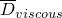
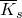
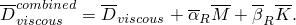
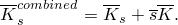
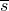
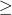

# 10.1.1 使用子结构


**产品：** Abaqus/Standard  Abaqus/CAE  

##### **参考文献**

- ["定义子结构，" 第 10.1.2 节](pt04ch10s01aus59.md)
- [*SLOAD](../key/key-link.md#usb-kws-hsload)
- [*SUBSTRUCTURE PATH](../key/key-link.md#usb-kws-hsubpath)
- [*SUBSTRUCTURE PROPERTY](../key/key-link.md#usb-kws-msubprop)

### 概述

子结构：
- 允许将一组元素组合在一起，并根据组内的线性响应消除除保留自由度外的所有自由度；
- 在按照["定义子结构，" 第 10.1.2 节"](pt04ch10s01aus59.md)中描述的方式创建后，可以像 Abaqus 单元库中的任何标准单元类型一样使用；
- 可用于应力/位移分析和耦合声学-结构分析；
- 具有线性响应，但允许大位移和大旋转；
- 在结构中多次出现相同部件（如齿轮的齿）的情况下特别有用，因为单个子结构可以重复使用；
- 在使用时可以平移、相对于全局系统旋转和在平面中反射；
- 通过保留节点上的保留自由度与模型的其余部分连接；
- 可能包含一组可在使用时激活和缩放的内部载荷情况和边界条件；
- 可以通过包含保留的特征模态来包括动态效应；以及
- 对模型的其余部分表现为刚度、可选质量、阻尼和一组可缩放的载荷向量。

### 子结构

子结构是从其中消除了内部自由度的元素集合。保留节点和自由度是那些在使用级别（当子结构用于分析时）将在外部被识别的，它们是在生成子结构期间定义的。决定应保留哪些节点和自由度的因素在下面和["定义子结构，" 第 10.1.2 节"](pt04ch10s01aus59.md)中讨论。

#### 子结构与超单元

在有限元文献中，子结构也被称为*超单元*。在 Abaqus 的早期版本中，子结构和超单元之间有区别。当需要明确说明是在子结构内恢复结果时，使用"子结构"一词。否则，两个术语可以互换使用。为避免混淆，将不再使用"超单元"一词。

#### 为什么要使用子结构？

使用子结构有很多充分的理由。

##### 计算优势

- 由于子结构化，系统矩阵（刚度、质量）很小。在创建子结构之后，只有保留的自由度以及相关的缩减刚度（和质量）矩阵用于分析，直到需要恢复子结构内部的解。
- 当多次使用相同的子结构时，效率会提高。刚度计算和子结构缩减只执行一次；但是，子结构本身可以使用多次，从而显著节省计算工作量。
- 子结构化可以隔离子结构外的可能变化，以节省重新分析期间的时间。在设计过程中，结构的很大一部分通常保持不变；这些部分可以隔离在子结构中，以节省形成该部分结构刚度的计算工作量。
- 在具有局部非线性的问题中，例如包含可能分离或接触的界面的模型，如果使用子结构功能将模型缩减到仅涉及局部非线性的那些自由度，则解决这些局部非线性的迭代可以在非常少的自由度上进行。

##### 组织优势

- 子结构化为复杂分析提供了系统的方法。设计过程通常从对自然发生的子结构进行独立分析开始。因此，使用在这些独立分析期间获得的子结构数据执行最终设计分析是高效的。
- 子结构库允许分析人员共享子结构。在大型设计项目中，大型工程师组通常必须使用相同的结构进行分析。子结构库提供了一种清晰简单的方式来共享结构信息。
- 许多实际结构非常庞大和复杂，以至于完整结构的有限元模型对可用计算资源的要求过高。这样的大型线性问题可以通过逐个子结构地构建模型来解决，并将这些级别堆叠在一起，直到整个结构完成，然后根据需要本地恢复位移和应力。

### 有效过程

子结构可以在以下过程中无限制地使用：
- ["静态应力分析，" 第 6.2.2 节](pt03ch06s02at01.md)
- ["使用直接积分的隐式动力学分析，" 第 6.3.2 节](pt03ch06s03at07.md)
- ["直接求解稳态动力学分析，" 第 6.3.4 节](pt03ch06s03at09.md)
- ["自然频率提取，" 第 6.3.5 节](pt03ch06s03at10.md)
- ["复特征值提取，" 第 6.3.6 节](pt03ch06s03at11.md)
- ["基于模态的稳态动力学分析，" 第 6.3.8 节](pt03ch06s03at13.md)

子结构也可以在以下过程中使用，但不支持恢复消除的自由度：
- ["瞬态模态动力学分析，" 第 6.3.7 节](pt03ch06s03at12.md)
- ["响应谱分析，" 第 6.3.10 节](pt03ch06s03at15.md)
- ["随机响应分析，" 第 6.3.11 节](pt03ch06s03at16.md)

#### 在静态分析中使用子结构

子结构化在线性静态结构分析中不会引入额外的近似：子结构是其成员线性、静态行为的精确表示。在应力/位移分析中使用子结构的主要缺点是子结构的刚度矩阵是满矩阵（没有零项），因此，如果子结构具有大量保留自由度，可能会非常大。这反过来可能意味着使用子结构的模型波前可能很大，从而导致求解方程的计算时间很长。

通过仔细选择子结构的边界或重用几个较小的子结构而不是单个较大的子结构，通常可以避免这种困难。在某些情况下，可以利用 Abaqus/Standard 允许保留单个自由度而不是节点上整套自由度的事实。例如，在无摩擦的接触问题中，只需要保留对接触求解垂直于表面的位移分量。节点变换可能有助于为此目的在表面节点处定位位移分量（请参阅["变换坐标系统，" 第 2.1.5 节"](pt01ch02s01aus09.md)）。

在包含声学元素的子结构的静态分析中，结果将与没有子结构的等效静态分析中获得的结果不同。声学-结构耦合在子结构中被考虑（导致声学流体的静水贡献），而在没有子结构的静态分析中耦合被忽略。

#### 在动力学分析中使用子结构

子结构在动力学分析中会引入近似。子结构动力学表示的默认方法是使用与刚度矩阵相同的变换来缩减其质量和阻尼矩阵，这被称为"Guyan 缩减"。这种方法假定消除的自由度和保留自由度之间的响应仅由静态模态正确表示。如果子结构内的动态模态很重要，这种表示可能不准确。可以通过保留额外的物理自由度来改善 Guyan 缩减的动力学表示，这些自由度不需要连接子结构到模型的其余部分。例如，如果子结构是板或梁，一些横向位移（可能还有面内旋转分量）可能作为保留自由度包括在内。有关 Guyan 缩减的更多详细信息，请参阅["子结构化和子结构分析，" Abaqus 理论指南第 2.14.1 节](../stm/stm-link.md#stm-anl-superelements)。

"动态模态添加"可用作 Guyan 缩减的替代方案。这种方法涉及添加与为子结构提取的特征模态相关的广义自由度，所有物理保留自由度自动约束。这改善了动态行为，但增加了为约束子结构提取特征模态的额外成本。有关动态模态添加的更多详细信息，请参阅["子结构化和子结构分析，" Abaqus 理论指南第 2.14.1 节](../stm/stm-link.md#stm-anl-superelements)。

缩减方法可以同时应用于同一结构内的不同子结构。缩减质量矩阵的定义在["定义子结构，" 第 10.1.2 节"](pt04ch10s01aus59.md)中进一步讨论。

#### 在几何非线性应力/位移分析中使用子结构

如果在与几何非线性（请参阅["静态应力分析过程：概述，" 第 6.2.1 节"](pt03ch06s02abo06.md)）的特定应力/位移分析中考虑，子结构可能经历大运动。Abaqus/Standard 将考虑子结构的大刚体旋转和平移。但是，假定子结构在几何非线性分析期间始终经历小（线性弹性）变形。在每个平衡迭代期间，使用子结构的保留节点计算每个子结构的等效刚体旋转。然后使用等效刚体旋转适当旋转子结构的质量、阻尼、刚度矩阵（包括保留的特征模态）和力向量。使用适当的（旋转的）线性扰动位移（相对于旋转参考配置的应变诱导位移）来计算与子结构相关的内力。如果子结构将用于几何非线性分析，则不应有选择地保留节点处的自由度。耦合声学-结构子结构不应用于几何非线性分析。

#### 与组件模态综合的比较

组件模态综合方法已开发出来，允许将结构细分为组件（子结构），大部分分析在较小的组件上执行，以开发整个结构的近似模型。

Abaqus/Standard 中的子结构实际上是组件模态综合方法的特例，扩展到允许在几何非线性分析中子结构（组件）的大旋转和平移。组件模态综合方法基于这样的假设：子结构的小变形可以用一组模态来建模。文献中最常用的模态通常如下所指：
- 约束模态，是通过给子结构中每个保留自由度单位位移而保持所有其他保留自由度固定而获得的静态形状；
- 固定界面法向模态，是通过固定保留自由度并计算子结构的特征模态而获得的；
- 自由界面法向模态，是通过计算具有自由（未固定）保留自由度 的子结构的特征模态而获得的；以及
- 混合界面法向模态，是通过固定部分保留自由度并计算子结构的特征模态而获得的。

约束模态正是 Abaqus/Standard 使用的静态模态（请参阅["子结构化和子结构分析，" Abaqus 理论指南第 2.14.1 节](../stm/stm-link.md#stm-anl-superelements)）。您通过指定要保留的自由度（请参阅["定义子结构"中的"定义保留自由度，" 第 10.1.2 节"](pt04ch10s01aus59.md#usb-anl-asuperelementdef-retaineddofs)）将这些模态包括在子结构的表示中。固定界面、自由界面或混合界面法向模态是在生成级别的特征频率提取步骤中提取的特征模态，这些模态表示 Abaqus 中允许的子结构动态模态的特定情况（请参阅["定义子结构"中的"定义广义自由度，" 第 10.1.2 节"](pt04ch10s01aus59.md#usb-anl-asuperelementdef-generalizeddofs)）。您通过选择要使用的特征模态将动态模态包括在子结构的表示中。

### 在模型中包括子结构

当在模型中使用子结构时，像任何其他单元一样为其分配单元编号并由节点定义。

使用具有子结构标识符的单元定义（["单元定义，" 第 2.2.1 节"](pt01ch02s02aus11.md)）将子结构包括在另一子结构（嵌套子结构）或分析模型的定义中。子结构可以从子结构库中读取。给定分析中最多可以访问 500 个库来读取子结构数据。

在单元定义中，您在使用级别定义子结构的单元编号，并分配节点编号到子结构的保留节点。每个单元定义可以定义多个子结构。

一旦子结构通过单元定义引入，除了其响应只能是线性的（尽管它可以用作包括非线性效应的模型的一部分，包括大位移）外，它就像模型中的任何其他单元一样被对待。

使用子结构需要子结构数据库可用。为子结构生成的所有文件，包括 `.sup` 和 `.sim` 文件和/或 `.prt`、`.stt` 和 `.mdl` 文件必须可用。

| **输入文件用法：** | 使用以下选项在模型中包括一个或多个子结构： |
| --- | --- |
|  | ``` [*ELEMENT](../key/key-link.md#usb-kws-melement), TYPE=Z*n* ``` |

| **Abaqus/CAE 用法：** | 使用以下选项在模型中包括一个子结构： |
| --- | --- |
|  | 所有模块：****文件****导入****部件****：**文件过滤器**：**子结构** 对您想要在模型中包括的每个子结构重复导入过程。 |

### 使用级别上子结构节点的排序

创建子结构时使用的节点编号和在使用子结构时与子结构关联的节点编号是完全独立的。子结构使用时保留节点的排序可以用两种不同的方式定义：

1. 可以按与子结构定义中列出的相同顺序提供节点。在这种情况下，当您指定保留自由度时（请参阅["定义子结构"中的"防止自由度被排序，" 第 10.1.2 节"](pt04ch10s01aus59.md#usb-anl-asuperelementdef-retaineddofs-nosort)），必须阻止保留节点的排序。如果保留节点未排序，则不会合并重复节点。因此，如果在保留自由度列表中多次指定相同的节点以保留不同的自由度，则在使用级别的相应节点必须出现相同次数。
2. 子结构节点的指定顺序必须与按子结构内使用的编号升序排序的保留节点顺序相同。当您指定保留自由度时，这是默认方法。

无论哪种情况，当使用子结构时，都必须确保节点正确匹配。

#### 从子结构库读取子结构定义

您可以从子结构库读取子结构定义。

| **输入文件用法：** | ``` [*ELEMENT](../key/key-link.md#usb-kws-melement), TYPE=Z*n*, FILE=*substructure_library_name* ``` |
| --- | --- |

| **Abaqus/CAE 用法：** | Abaqus/CAE 不支持子结构库。 |
| --- | --- |

#### 解释数据文件中的模型输出

如果模型定义数据被写入数据文件（["控制写入数据文件的分析输入文件处理器信息量"中的"输出，" 第 4.1.1 节"](pt02ch04s01aus38.md#usb-out-ooutput-data-control)），子结构实例在数据（`.dat`）文件中由子结构标识符标识，后跟 F 和指示子结构库号的两位数字。与此编号关联的子结构库的完整名称也包含在模型输出中。

### 定义子结构的属性

您可以为模型中的每个子结构关联属性定义。属性定义用于以下目的：

1. 它定义了子结构在使用级别的任何平移、旋转和反射。
2. 它允许设置容差以确保使用级别节点的坐标与生成子结构时使用的节点的坐标匹配。
3. 它控制在使用级别动态分析中使用各种子结构阻尼源。

| **输入文件用法：** | ``` [*SUBSTRUCTURE PROPERTY](../key/key-link.md#usb-kws-msubprop), ELSET=*name* ``` |
| --- | --- |

| **Abaqus/CAE 用法：** | 使用以下选项定义子结构的平移和旋转： |
| --- | --- |
|  | 装配模块：****实例****平移**** 或 ****实例****旋转**** Abaqus/CAE 不支持子结构的反射。使用以下选项应用连接保留节点与使用级别节点的约束：相互作用模块：****约束****创建**** |

#### 平移、旋转和反射子结构

可以在子结构属性定义中指定子结构的平移、旋转和/或反射（按该顺序）。

通过给出平移向量来指定平移。通过给出两个点 *a* 和 *b*（定义旋转轴）以及围绕该轴的右手旋转角度来指定旋转。通过在反射平面中给出三个不共线的点来指定反射。

平移不影响子结构的刚度或质量：应用平移的主要原因是启用对节点坐标的容差检查（如后所述）。子结构的旋转和/或反射影响子结构的刚度和质量。子结构载荷情况定义以与子结构的刚度和质量相同的方式旋转和/或反射；因此，子结构载荷情况内的所有载荷以与创建子结构时关联的局部方向应用。

对于分布式载荷（例如，表面上的压力载荷），这种应用正是所需的。但是，坐标方向上的分布式体力（BX、BY、BZ）在子结构的局部方向而不是全局方向上应用，这可能不是所需的。同样，依赖于位置的分布式载荷（例如，静水压力或离心载荷）基于子结构的局部坐标而不是使用期间子结构的位置。在旋转或移动的子结构上加载时要小心确保其使用是正确的。

每当子结构被平移、旋转和/或反射时，任何保留节点处的自由度都相对于使用级别的坐标方向。因此，如果节点的所有自由度未保留，或者如果二维子结构用于具有超出 *x*–*y* 平面的旋转的三维模型，由于旋转和/或反射，可能会激活额外的自由度。在这种情况下要小心检查子结构使用的有效性。

#### 设置子结构节点的容差

使用大型子结构的一个困难是确保子结构中的保留节点连接到使用级别上正确的节点（在子结构平移、旋转和/或反射之后（如适用））。因此，Abaqus/Standard 检查保留节点的坐标与使用级别上相应节点的坐标匹配。子结构不需要使用级别的任何坐标，因为它仅由刚度矩阵、质量矩阵和若干载荷情况组成。然而，验证子结构与其引入的模型在几何上是一致的通常是模型有效性的一个很好的检查。

要检查坐标，您可以设置使用级别节点与相应子结构节点之间距离的容差。此容差表示在发出警告之前允许的最大偏差。如果不指定此容差，默认使用子结构内最大整体尺寸的 104 倍作为容差。如果指定容差为 0.0，则不检查保留节点的位置。

几何检查基于子结构在使用级别平移、旋转和/或反射后保留节点的坐标；生成子结构期间发生的几何非线性预加载导致的这些节点的运动不在此检查中考虑。

| **输入文件用法：** | ``` [*SUBSTRUCTURE PROPERTY](../key/key-link.md#usb-kws-msubprop), ELSET=*name*, POSITION TOL=*tolerance* ``` |
| --- | --- |

| **Abaqus/CAE 用法：** | 装配模块：****实例****平移**** 和 ****实例****旋转**** |
| --- | --- |

#### 定义子结构阻尼

Abaqus 允许您为子结构选择特定的阻尼源、添加多个源，或在使用级别排除子结构的阻尼效应。

##### 子结构阻尼源

您可以选择在使用阶段通过使用在生成阶段计算并存储在子结构数据库中的缩减粘性阻尼矩阵，，和缩减结构阻尼矩阵，，来建模子结构的阻尼。或者，您可以使用与刚度和质量成比例的阻尼因子，使用缩减刚度和质量矩阵， 和 ，分别创建子结构阻尼矩阵。您还可以请求组合两个阻尼源或在使用级别完全排除阻尼效应。

| **输入文件用法：** | 使用以下选项控制子结构阻尼源： |
| --- | --- |
|  | ``` [*DAMPING CONTROLS](../key/key-link.md#usb-kws-hdampingcontrols), VISCOUS=*viscousDampingSource*, STRUCTURAL=*structuralDampingSource* ``` |

| **Abaqus/CAE 用法：** | 使用以下选项控制子结构阻尼源： |
| --- | --- |
|  | 步骤模块：**创建步骤**：**线性扰动**：**子结构生成**：**阻尼** 选项卡页面 |

##### 控制粘性阻尼源

一般情况下，子结构粘性阻尼由以下矩阵定义：



| **输入文件用法：** | 要仅激活子结构的生成缩减粘性阻尼矩阵（右侧第一项），请使用以下选项： |
| --- | --- |
|  | ``` [*DAMPING CONTROLS](../key/key-link.md#usb-kws-hdampingcontrols), VISCOUS=ELEMENT ``` 要仅激活 Rayleigh 粘性阻尼，请使用以下选项： ``` [*DAMPING CONTROLS](../key/key-link.md#usb-kws-hdampingcontrols), VISCOUS=FACTOR ``` 要激活组合生成和 Rayleigh 粘性阻尼矩阵，请使用以下选项： ``` [*DAMPING CONTROLS](../key/key-link.md#usb-kws-hdampingcontrols), VISCOUS=COMBINED ``` 要在使用级别完全排除粘性阻尼效应，请使用以下选项： ``` [*DAMPING CONTROLS](../key/key-link.md#usb-kws-hdampingcontrols), VISCOUS=NONE ``` |

| **Abaqus/CAE 用法：** | 要仅激活子结构的生成缩减粘性阻尼矩阵（右侧第一项），请使用以下选项： |
| --- | --- |
|  | 步骤模块：**创建步骤**：**线性扰动**：**子结构生成**：**阻尼** 选项卡页面：**粘性阻尼**：**单元** 要仅激活 Rayleigh 粘性阻尼，请使用以下选项：步骤模块：**创建步骤**：**线性扰动**：**子结构生成**：**阻尼** 选项卡页面：**粘性阻尼**：**因子** 要激活组合生成和 Rayleigh 粘性阻尼矩阵，请使用以下选项：步骤模块：**创建步骤**：**线性扰动**：**子结构生成**：**阻尼** 选项卡页面：**粘性阻尼**：**组合** 要在使用级别完全排除粘性阻尼效应，请使用以下选项：步骤模块：**创建步骤**：**线性扰动**：**子结构生成**：**阻尼** 选项卡页面：**粘性阻尼**：**无** |

##### 控制结构阻尼源

一般情况下，子结构结构阻尼由以下矩阵定义：



| **输入文件用法：** | 要仅激活子结构的生成缩减结构阻尼矩阵（右侧第一项），请使用以下选项： |
| --- | --- |
|  | ``` [*DAMPING CONTROLS](../key/key-link.md#usb-kws-hdampingcontrols), STRUCTURAL=ELEMENT ``` 要仅激活刚度比例结构阻尼矩阵，请使用以下选项： ``` [*DAMPING CONTROLS](../key/key-link.md#usb-kws-hdampingcontrols), STRUCTURAL=FACTOR ``` 要激活组合生成和刚度比例结构阻尼矩阵，请使用以下选项： ``` [*DAMPING CONTROLS](../key/key-link.md#usb-kws-hdampingcontrols), STRUCTURAL=COMBINED ``` 要排除结构阻尼矩阵，请使用以下选项： ``` [*DAMPING CONTROLS](../key/key-link.md#usb-kws-hdampingcontrols), STRUCTURAL=NONE ``` |

| **Abaqus/CAE 用法：** | 要仅激活子结构的生成缩减结构阻尼矩阵（右侧第一项），请使用以下选项： |
| --- | --- |
|  | 步骤模块：**创建步骤**：**线性扰动**：**子结构生成**：**阻尼** 选项卡页面：**结构阻尼**：**单元** 要仅激活刚度比例结构阻尼矩阵，请使用以下选项：步骤模块：**创建步骤**：**线性扰动**：**子结构生成**：**阻尼** 选项卡页面：**结构阻尼**：**因子** 要激活组合生成和刚度比例结构阻尼矩阵，请使用以下选项：步骤模块：**创建步骤**：**线性扰动**：**子结构生成**：**阻尼** 选项卡页面：**结构阻尼**：**组合** 要排除结构阻尼矩阵，请使用以下选项：步骤模块：**创建步骤**：**线性扰动**：**子结构生成**：**阻尼** 选项卡页面：**结构阻尼**：**无** |

##### 定义阻尼比

默认情况下，用于定义子结构阻尼比的质量比例和刚度比例 Rayleigh 阻尼比， 和 ，以及结构阻尼比，，为零。

| **输入文件用法：** | 使用以下选项在使用级别定义子结构阻尼比的值： |
| --- | --- |
|  | ``` [*DAMPING](../key/key-link.md#usb-kws-mdamping), ALPHA=, BETA=, STRUCTURAL= ``` |

| **Abaqus/CAE 用法：** | 使用以下选项在使用级别定义子结构阻尼比的值： |
| --- | --- |
|  | 步骤模块：**创建步骤**：**线性扰动**：**子结构生成**：**阻尼** 选项卡页面：**Alpha**：：**Beta**：：**结构**： |

##### 为模态动力学分析定义阻尼

要为基于结构模态的线性动力学分析定义阻尼，请在使用子结构时指定模态阻尼。每个特征模态的阻尼可以给定为临界阻尼的一部分。或者，可以定义 Rayleigh 阻尼。复合模态阻尼不能在子结构内部使用。

请参阅["瞬态模态动力学分析，" 第 6.3.7 节"](pt03ch06s03at12.md)，了解更多关于模态阻尼过程的信息。

| **输入文件用法：** | 使用以下选项将每个特征模态的阻尼定义为临界阻尼的一部分： |
| --- | --- |
|  | ``` [*MODAL DAMPING](../key/key-link.md#usb-kws-hmodaldamp), VISCOUS=FRACTION OF CRITICAL DAMPING ``` 使用以下选项定义 Rayleigh 阻尼： ``` [*MODAL DAMPING](../key/key-link.md#usb-kws-hmodaldamp), VISCOUS=RAYLEIGH ``` |

| **Abaqus/CAE 用法：** | Abaqus/CAE 不支持子结构的模态阻尼。 |
| --- | --- |

### 定义运动学约束和变换

所有运动学边界条件、MPC 和变换都可以应用于使用级别保留自由度上的保留自由度。这些规范可以像通常一样在步骤之间更改。在这方面，子结构及其保留节点的行为与常规单元及其节点完全相同。

#### 在保留节点处定义变换

如果在保留节点处使用节点变换（["变换坐标系统，" 第 2.1.5 节"](pt01ch02s01aus09.md)）进行子结构生成，则变换被构建到子结构中。当子结构节点连接到标准 Abaqus 单元时，这会造成不一致，因为 Abaqus/Standard 直接使用保留自由度而不检查其方向。因此，建议避免这种情况。

如果必须使用节点变换，可以通过保留该节点处的所有自由度并应用线性约束方程（["线性约束方程，" 第 35.2.1 节"](pt08ch35s02aus129.md)）来解决产生的不一致，如下所示。在这样的变换子结构节点连接到全局模型的任何点，定义使用级别的两个重合节点，例如 *P* 和 *Q*。在定义单元定义的使用级别，将节点 *P* 用于子结构；自由度 的局部方向已在此节点内置入。将节点 *Q* 用于连接到此点的所有标准 Abaqus 单元。在节点 *Q* 处使用局部变换，将自由度变换到与为节点 *P* 内置的相同局部方向。现在使用线性约束方程来等同节点 *P* 和 *Q* 处的各个自由度。

### 向子结构施加载荷

在分析中（在使用级别）要应用于子结构的载荷或边界条件，必须通过定义子结构载荷情况或请求计算子结构的重力载荷向量在子结构生成步骤中指定（请参阅["定义子结构"中的"定义用于后续分析加载的子结构载荷情况，" 第 10.1.2 节"](pt04ch10s01aus59.md#usb-anl-asuperelementdef-loads)）。载荷情况可以由任何组合的载荷和非零边界条件组成，可以为任何给定的子结构定义多个载荷情况。

当激活为子结构创建的载荷情况时，您指定子结构的单元编号或单元集名称、相关的子结构载荷情况名称以及指定子结构载荷情况载荷和/或边界条件的缩放乘数。要精确重现生成子结构时定义的载荷条件，请使用 1.0 的幅度。

在子结构生成期间指定的边界条件始终存在，无论它们所属的子结构载荷情况是否活跃。它们有效地内置于子结构中，如果需要可以缩放，但不能移除。请参阅["定义子结构，" 第 10.1.2 节"](pt04ch10s01aus59.md)，了解更多关于在子结构中定义边界条件的信息。

| **输入文件用法：** | 使用以下选项激活子结构载荷情况： |
| --- | --- |
|  | ``` [*SLOAD](../key/key-link.md#usb-kws-hsload) ``` |

| **Abaqus/CAE 用法：** | 使用以下选项激活子结构载荷情况： |
| --- | --- |
|  | 载荷模块：载荷编辑器：**类别**：**机械**：**所选步骤的类型**：**子结构载荷** |

#### 修改或移除载荷情况

默认情况下，子结构载荷作为现有载荷的修改或添加到先前定义的任何载荷来应用。当您激活载荷情况时，您可以移除所有先前定义的载荷，并可选择指定新载荷。边界条件不能移除。

| **输入文件用法：** | 使用以下选项修改载荷情况： |
| --- | --- |
|  | ``` [*SLOAD](../key/key-link.md#usb-kws-hsload), OP=MOD ``` 使用以下选项移除载荷情况： ``` [*SLOAD](../key/key-link.md#usb-kws-hsload), OP=NEW ``` |

| **Abaqus/CAE 用法：** | 使用以下选项修改载荷情况： |
| --- | --- |
|  | 载荷模块：**载荷情况管理器**：点击**编辑** 使用以下选项移除载荷情况：载荷模块：**载荷情况管理器**：点击**删除** |

#### 指定时间相关载荷情况

通过引用幅值定义（["幅值曲线，" 第 34.1.2 节"](pt07ch34s01aus115.md)），子结构载荷的幅度可以随时间变化。

| **输入文件用法：** | 使用以下选项定义时间相关载荷情况： |
| --- | --- |
|  | ``` [*AMPLITUDE](../key/key-link.md#usb-kws-mamplitude), NAME=*amplitude* [*SLOAD](../key/key-link.md#usb-kws-hsload), AMPLITUDE=*amplitude* ``` |

| **Abaqus/CAE 用法：** | 使用以下选项定义时间相关载荷情况： |
| --- | --- |
|  | 载荷模块：幅值编辑器：**创建幅值**：**幅值**：*amplitude* 载荷模块：载荷编辑器：**类别**：**机械**：**所选步骤的类型**：**子结构载荷**：**幅值**：*amplitude* |

#### 几何非线性分析中的载荷情况

所有子结构载荷和边界条件都应用于与子结构关联的局部系统。由于当存在大运动时此局部系统随子结构旋转，这些载荷和边界条件也将旋转。因此，在几何非线性分析中使用子结构载荷时要小心，以确保载荷在使用级别处于适当方向。这种情况类似于通过子结构属性定义旋转子结构。

#### 重力载荷

分布式载荷定义可用于向具有用户定义幅度的子结构施加重力载荷，由幅值定义缩放，并在指定方向上作用。要启用子结构的重力载荷，您必须在子结构生成步骤期间请求计算子结构的重力载荷向量（请参阅["定义子结构"中的"重力载荷，" 第 10.1.2 节"](pt04ch10s01aus59.md#usb-anl-asuperelementdef-loads-grav)）。在这种情况下，重力载荷不应作为子结构载荷情况的一部分定义。

| **输入文件用法：** | 使用以下选项定义重力载荷： |
| --- | --- |
|  | ``` [*DLOAD](../key/key-link.md#usb-kws-hdload), AMPLITUDE=*amplitude* *element set or element number*, GRAV, *magnitude, direction* ``` |

| **Abaqus/CAE 用法：** | 载荷模块：**创建载荷**：为**类别**选择**机械**和为**所选步骤的类型**选择**重力** |
| --- | --- |

### 获取子结构内部结果输出

您可以获得在静态、动力学、特征频率提取以及稳态和瞬态模态动力学分析中使用的子结构内部输出。不支持在响应谱和随机响应分析中使用的子结构获取输出。子结构内部的输出不包括来自子结构预加载变形的位移、应力等。

子结构内部输出可在数据（`.dat`）文件、结果（`.fil`）文件和输出数据库（`.odb`）文件中获得。为每个子结构创建单独的输出数据库文件，使用命名约定 `*inputfile-name*_*substructure-number*.odb`。如果子结构包含嵌套子结构，则创建名为 `*inputfile-name*_*substructure-number*_*nested-substructure-number*.odb` 的文件，其中包含嵌套子结构的输出。**abaqus substructurecombine** 执行过程可以将两个子结构输出数据库的模型和结果数据组合成单个输出数据库文件。有关更多信息，请参阅["组合子结构输出，" 第 3.2.22 节"](pt01ch03s02abx22.md)。

获取子结构内部的解需要从 `.sup`、`.sim`、`.prt`、`.stt` 和 `.mdl` 文件中获取恢复子结构内部数据所需的信息。

输出按子结构组织：您指示 Abaqus/Standard 进入特定子结构，然后请求该子结构的输出。只有当链中所有子结构的子结构库都可用时，才能在嵌套多级子结构中恢复结果。

子结构输出请求最容易通过将子结构视为"级别"的详细建模来理解。在全局（顶部）级别，我们有分析模型（例如，飞机）。从这个级别下降到第一个子结构级别，我们有定义为子结构的主要组件（机翼、稳定器、机身等）。下降到第二个子结构级别，我们有其他子结构（副翼、油箱、地板等），它们又可能包含第三级子结构（翼梁、纵梁等），依此类推。要获取输出，您使用子结构路径在这些不同级别之间上下移动，类似于为文件目录导航树结构的方式。每个子结构路径定义包括进入下一级别子结构或离开当前子结构并在树中向上移动一级。

在输出请求开始时，Abaqus/Standard 处于全局模型级别。您必须始终一致地进入和离开子结构，以便在一组子结构输出请求之后，Abaqus/Standard 保持在全局模型级别。您必须在步骤定义结束之前返回全局级别（所有子结构之外）。

如果您在同一子结构路径定义中进入和离开，效果是离开子结构并在同一级别进入另一个子结构。

#### 进入子结构获取输出

要进入特定子结构获取输出，您通过在模型中为其选择的单元编号 *n* 来识别子结构。所有后续输出请求都是针对该子结构内部的输出，必须根据其内部节点和单元编号（创建子结构时使用的节点和单元编号）给出。

| **输入文件用法：** | ``` [*SUBSTRUCTURE PATH](../key/key-link.md#usb-kws-hsubpath), ENTER ELEMENT=*n* ``` |
| --- | --- |

| **Abaqus/CAE 用法：** | 步骤模块：场输出请求编辑器：**域**：**子结构**：点击  并选择子结构集 |
| --- | --- |

#### 获取输出后离开子结构

在获取子结构输出后，您必须返回构成该子结构的模型级别，从而表示该子结构内部变量输出请求的结束。

| **输入文件用法：** | ``` [*SUBSTRUCTURE PATH](../key/link.md#usb-kws-hsubpath), LEAVE ``` |
| --- | --- |

| **Abaqus/CAE 用法：** | 步骤模块：场输出请求编辑器：**域**：**子结构**：点击  并选择子结构集 |
| --- | --- |

#### 获取嵌套子结构中的输出

如果子结构用于多级并且需要在多级下方获取输出，则必须进入多个子结构。Abaqus/CAE 不支持子结构嵌套。

##### 示例：获取嵌套子结构内部的输出

例如，假设模型在两个级别中包含多个子结构。需要在与第二级别两个子结构内部的某些单元中打印输出应力，以及在第一级别子结构之一的一些节点上打印位移。（回想一下，"第一级别"指的是直接在分析模型中使用的子结构；"第二级别"子结构是第一级别子结构的组成部分使用。）

数据可能如下：

```
[*SUBSTRUCTURE PATH](../key/key-link.md#usb-kws-hsubpath), ENTER ELEMENT=*N*
** *This option takes us into element number N, which must be a substructure.*
[*SUBSTRUCTURE PATH](../key/key-link.md#usb-kws-hsubpath), ENTER ELEMENT=*M*
** *We now drop down into element number M of this substructure.*
** *M is the element number used for this substructure when N was created.*
** *M must refer to a substructure.*[*EL PRINT](../key/key-link.md#usb-kws-helprint), ELSET=A1
S
** *This option requests stress output in element set A1 of this substructure.*
** *This element set must have been defined during the creation of substructure M.*
[*SUBSTRUCTURE PATH](../key/key-link.md#usb-kws-hsubpath), LEAVE
** *This option takes us back up into first-level substructure N.*
[*SUBSTRUCTURE PATH](../key/key-link.md#usb-kws-hsubpath), ENTER ELEMENT=*P*
** *This option takes us down into element P, which must again be a substructure in element N.*
[*EL PRINT](../key/key-link.md#usb-kws-helprint), ELSET=A1
S
** *This option requests the printing of stress output in element set A1. It is possible that*
** *this is the same set of elements in the same substructure as was used in the request above*
** *because substructures M and P may both be copies of the same substructure.*
** *However, the stresses will presumably be different because they represent the same*
** *component in different locations in the model.*
[*SUBSTRUCTURE PATH](../key/key-link.md#usb-kws-hsubpath), LEAVE
** *Back to N.*
[*SUBSTRUCTURE PATH](../key/key-link.md#usb-kws-hsubpath), LEAVE
** *We are now back at the global level.*
[*SUBSTRUCTURE PATH](../key/key-link.md#usb-kws-hsubpath), ENTER ELEMENT=*R*
** *Enter element R at the global level: this element is the substructure in which we want*
** *to print the displacements.*
[*NODE PRINT](../key/key-link.md#usb-kws-hnodeprint), NSET=FLANGE
U
** *This option prints the displacements at all nodes in node set *
** FLANGE *of the substructure.*
** *Again,* FLANGE * must have been defined when the substructure was*
** *created.*
[*SUBSTRUCTURE PATH](../key/key-link.md#usb-kws-hsubpath), LEAVE
** *Back to the global level.*
```

#### 解释节点变量输出

子结构内部的节点位移不包括来自预加载变形的位移（如果存在）。

如果子结构被旋转和/或反射，节点变量将相对于分析的全局坐标系统输出。在几何非线性分析中，节点位移将包括与子结构平移和旋转相关的大运动以及小应变位移。如果使用了节点变换（["变换坐标系统，" 第 2.1.5 节"](pt01ch02s01aus09.md)），节点输出将根据节点输出请求在局部或全局方向（请参阅["输出到数据和结果文件，" 第 4.1.2 节"](pt02ch04s01aus39.md)）。如果在子结构生成期间使用了节点变换，则变换方向随子结构旋转。

#### 解释单元变量输出

子结构内部的单元输出变量不包括来自预加载变形的变量值（如果存在）。

连续体单元中的单元变量相对于分析模型的全局坐标系统或已使用的局部（材料）坐标系统输出（["取向，" 第 2.2.5 节"](pt01ch02s02aus15.md)）。结构单元的单元输出始终相对于生成子结构时使用的单元坐标系统给出。积分点坐标和局部材料方向（请参阅["输出到数据和结果文件，" 第 4.1.2 节"](pt02ch04s01aus39.md)）相对于全局坐标系统给出。

与非线性预加载响应相关的单元量（塑性应变、蠕变应变等）可以在子结构恢复期间输出。由于子结构在其使用期间的响应完全是线性的，这些作为基态一部分的量不会从预加载期间计算的值更改。

如果子结构被反射，连续体单元写入子结构实例输出数据库的单元连接性会被调整，以避免违反逆时针单元编号的 Abaqus 约定。

当在子结构内恢复结果时，不能直接获取单元质心值的单元输出或单元节点处的单元输出。可以使用 Abaqus 脚本界面中的命令从输出数据库文件中的子结构相关数据计算此输出数据。

#### 解释写入结果文件的结果

结果可以在子结构内写入结果文件。子结构路径记录被插入结果文件以指示进入子结构：此类记录之后的所有记录都属于该记录上定义的子结构，直到文件中出现下一个子结构路径记录。

对结果文件的输出请求将导致 Abaqus/Standard 将模型级别和模型内所有子结构中单元和节点的定义写入文件。与结果记录本身一样，子结构内节点和单元的这些记录前面和后面都会有子结构路径记录，以指示它们属于该子结构。

每个子结构内的节点和单元编号是该子结构本地的，因此相同的节点和单元编号可能出现在多个子结构和全局级别模型中。在这种情况下，必须使用子结构路径记录来识别模型内特定节点或单元的位置。如果您可以确保整个模型（包括所有子结构）中的节点和单元编号是唯一的，则可以忽略结果文件中的子结构路径记录。

### 可视化子结构结果

虽然 Abaqus/CAE 不直接支持子结构，但您可以通过将所有子结构实例输出数据库（`.odb`）文件组合成单个文件来查看子结构结果。请参阅["组合子结构输出，" 第 3.2.22 节"](pt01ch03s02abx22.md)，了解更多详情。

您也可以在 Abaqus/CAE 中单独加载和查看每个子结构实例输出数据库（`.odb`）文件。

### 子结构库兼容性

子结构使用分析可以使用与相同或任何先前维护版本相同的一般版本生成的子结构库。例如，如果使用 Abaqus 6.14-3 维护版本生成子结构，则可以在所有后续 Abaqus 6.14 维护版本中使用它。子结构库在不同一般版本之间不兼容（例如，在 Abaqus 6.13 和 Abaqus 6.14 之间）。

子结构使用分析必须在与用于生成子结构库的计算机二进制兼容的计算机上运行。

### 输入文件模板

以下模板可用于生成子结构：

```
[*HEADING](../key/key-link.md#usb-kws-mheading)
…
[*NODE](../key/key-link.md#usb-kws-mnode),NSET=N1
*Data lines to define the nodes.*
…
[*NSET](../key/key-link.md#usb-kws-mnset),NSET=N3
*Data lines to define the node set members.*
…
[*ELEMENT](../key/key-link.md#usb-kws-melement), TYPE=CPE8, ELSET=E1
*Data lines to define the elements that make up the substructure.*
…
[*ELSET](../key/key-link.md#usb-kws-melset),ELSET=E3
*Data lines to define the element set members.*
…
[*SOLID SECTION](../key/key-link.md#usb-kws-msolidsection), ELSET=E1, MATERIAL=M1
[*MATERIAL](../key/key-link.md#usb-kws-mmaterial), NAME=M1
[*ELASTIC](../key/key-link.md#usb-kws-melastic)
30.E6, 0.3
[*DENSITY](../key/key-link.md#usb-kws-mdensity)
0.0007324
[*STEP](../key/key-link.md#usb-kws-hstep)
[*FREQUENCY](../key/key-link.md#usb-kws-hfrequency)
*Data line to specify the number of modes (  m). The [*FREQUENCY](../key/key-link.md#usb-kws-hfrequency) option*
*is required if modes are requested using the [*SELECT EIGENMODES](../key/key-link.md#usb-kws-hselecteigenmodes) option.*
[*END STEP](../key/key-link.md#usb-kws-hendstep)
[*STEP](../key/key-link.md#usb-kws-hstep)
[*STATIC](../key/key-link.md#usb-kws-hstatic)
…
*Options to define a linear or nonlinear static preload.*
…
[*END STEP](../key/key-link.md#usb-kws-hendstep)
[*STEP](../key/key-link.md#usb-kws-hstep)
[*SUBSTRUCTURE GENERATE](../key/key-link.md#usb-kws-ssubgenerate), TYPE=Z101, OVERWRITE, MASS MATRIX=YES,
VISCOUS DAMPING MATRIX=YES, STRUCTURAL DAMPING MATRIX=YES,
RECOVERY MATRIX=YES, NSET=N3, ELSET=E3
[*RETAINED NODAL DOFS](../key/key-link.md#usb-kws-sretainnodaldofs)
*Data lines to define the retained degrees of freedom.*
[*SELECT EIGENMODES](../key/key-link.md#usb-kws-hselecteigenmodes), GENERATE
1, *m*, 1
[*SUBSTRUCTURE LOAD CASE](../key/key-link.md#usb-kws-ssubloadcase), NAME=BOUND
[*BOUNDARY](../key/key-link.md#usb-kws-hboundary)
*Data lines to define the boundary conditions.*
[*SUBSTRUCTURE LOAD CASE](../key/key-link.md#usb-kws-ssubloadcase), NAME=LOADS
[*CLOAD](../key/key-link.md#usb-kws-hcload)
*Data lines to define concentrated loading.*
[*DLOAD](../key/key-link.md#usb-kws-hdload)
*Data lines to define distributed loading.*
[*END STEP](../key/key-link.md#usb-kws-hendstep)
```

以下模板可用于定义子结构实例：

```
[*HEADING](../key/key-link.md#usb-kws-mheading)
…
[*ELEMENT](../key/key-link.md#usb-kws-melement), TYPE=Z101, ELSET=E2
*Data line to define the element.*
[*SUBSTRUCTURE PROPERTY](../key/key-link.md#usb-kws-msubprop), ELSET=E2
[*BOUNDARY](../key/key-link.md#usb-kws-hboundary)
…
[*RESTART](../key/key-link.md#usb-kws-mrestart), WRITE
[*STEP](../key/key-link.md#usb-kws-hstep)
[*STATIC](../key/key-link.md#usb-kws-hstatic)
…
[*BOUNDARY](../key/key-link.md#usb-kws-hboundary)
…
[*SLOAD](../key/key-link.md#usb-kws-hsload)
E2, LOADS, *scale factor*
[*SUBSTRUCTURE PATH](../key/key-link.md#usb-kws-hsubpath), ENTER ELEMENT=*n*
[*EL PRINT](../key/key-link.md#usb-kws-helprint)
S,
[*NODE PRINT](../key/key-link.md#usb-kws-hnodeprint)
U,
[*SUBSTRUCTURE PATH](../key/key-link.md#usb-kws-hsubpath), LEAVE
[*END STEP](../key/key-link.md#usb-kws-hendstep)
[*STEP](../key/key-link.md#usb-kws-hstep)
[*DYNAMIC](../key/key-link.md#usb-kws-hdynamic)
…
[*BOUNDARY](../key/key-link.md#usb-kws-hboundary)
…
[*SUBSTRUCTURE PATH](../key/key-link.md#usb-kws-hsubpath), ENTER ELEMENT=*n*
[*EL PRINT](../key/key-link.md#usb-kws-helprint)
S,
[*NODE PRINT](../key/key-link.md#usb-kws-hnodeprint)
U, V
[*SUBSTRUCTURE PATH](../key/key-link.md#usb-kws-hsubpath), LEAVE
[*END STEP](../key/key-link.md#usb-kws-hendstep)
```


