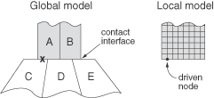

# 10.2.1 子模型：概述


**产品：** Abaqus/Standard  Abaqus/Explicit  Abaqus/CAE  

##### **参考文献**

- ["基于节点的子模型，" 第 10.2.2 节](pt04ch10s02aus61.md)
- ["基于表面的子模型，" 第 10.2.3 节](pt04ch10s02aus62.md)
- [*SUBMODEL](../key/key-link.md#usb-kws-msubmodel)
- [Abaqus/CAE 用户指南第 38 章，"子模型"](../usi/usi-link.md#usi-adv-submodeling)

### 概述

子模型技术：
- 用于基于从初始（未变形）相对粗糙的全局模型解的插值，用细化网格研究模型的局部部分；
- 当需要在局部区域获得精确、详细的解，而该局部区域的详细建模对整体解的影响可忽略时，最为有用；
- 可用于通过节点结果（如位移（请参阅本节后面的["基于节点的子模型"](pt04ch10s02aus60.md#usb-anl-asubmodeloverview-node)））或通过全局网格的单元应力结果（请参阅本节后面的["基于表面的子模型"](pt04ch10s02aus60.md#usb-anl-asubmodeloverview-surface)）来驱动模型的局部部分；
- 可用于分析由结构全局模型的位移驱动的声学模型，当声学流体对结构解的影响可忽略时；
- 可用于由声学或耦合声学-结构全局模型的结构压力驱动的结构分析；
- 可结合使用 Abaqus/Explicit 和 Abaqus/Standard 过程；
- 可结合使用线性和非线性过程；以及
- 不能在导入分析中使用。

### 术语

其解被插值到子模型边界相关部分的模型称为"全局"模型（即使它本身可能是更大"全局"模型的子模型）。驱动变量定义为子模型中约束为与全局模型结果匹配的变量。驱动变量可以是基于节点技术中节点处的自由度，或者是基于表面技术中单元面积分点处应力张量的分量。

### 子模型技术

子模型可以相当普遍地应用于 Abaqus。为子模型定义的材料响应可能与为全局模型定义的材料响应不同。全局模型和子模型都可以有非线性响应。请参阅["壳到实体子模型和管道接头壳到实体耦合，" Abaqus 例题指南第 1.1.10 节](../exa/exa-link.md#exa-sta-shellsolidpipe)，了解子模型技术的示例应用。

车辆乘员/行人交互模拟是子模型技术可以有效使用的一个示例。碰撞安全模拟通常包括车辆与其乘员之间或车辆与行人之间的交互。在某些情况下，人对车辆结构响应的影响非常小可以忽略。在这些情况下，执行不包括人或用简单表示人的车辆全局分析，然后通过子模型技术使用围绕人的车辆部分来研究与多种人体模型的详细交互。

子模型首先根据使用的两种基本技术中哪一种进行分类。最常见和更通用的技术是基于节点的子模型，它使用节点结果场（包括位移、温度或压力自由度）将全局模型结果插值到子模型节点。替代的基于表面的技术使用应力场将全局模型结果插值到驱动基于单元的表面小平面上的子模型积分点。

您可以选择基于节点或基于表面的技术，或在子模型中组合使用两种技术。在决定使用的技术时应考虑以下因素：
- 您是在 Abaqus/Standard 一般静态分析中执行实体到实体子模型吗：
  - 基于表面的子模型仅适用于实体模型和静态分析。
  - 对于所有其他过程，使用基于节点的技术。
- 全局模型和子模型在子模型区域的平均刚度是否存在显著差异：
  - 当模型刚度相当时，位移的基于节点子模型将提供与基于表面技术相当的结果，不太可能出现与刚体模式相关的数值问题。
  - 当模型刚度不同且全局模型主要暴露于载荷控制环境时，基于表面的技术通常会提供更准确的应力结果。刚度差异可能由于子模型中的额外细节而产生，如显式建模的圆角或孔。在其他情况下，刚度变化可能由轻微的几何变化引起，不需要对全局模型进行重新分析。
- 您的模型是否承受大变形或旋转：
  - 位移的基于节点子模型将导致更准确地将大变形和旋转传递到子模型。
- 全局模型的位移响应是否对应于子模型的位移响应：
  - 当全局模型中的位移与子模型中的预期位移密切相关时，通常优选基于节点的子模型。
  - 当预期子模型位移响应与全局模型响应不同时，应使用基于表面的子模型。当建模热应变且子模型的温度历史与全局模型不同时，可能会出现这种情况；例如，当作为顺序热-结构分析的一部分执行热传递子模型时。
- 结构刚度：
  - 对于非常刚性的结构，基于表面的子模型可能提供更准确的结果。当结构非常刚性以至于全局模型位移场的分量仅对应力响应有很小贡献时，位移结果中的数值舍入可能会变得显著；例如，当全局模型位移由刚体运动分量主导时。
- 您感兴趣的子模型输出类型：
  - 位移的基于节点子模型将导致更准确的位移场传递。
  - 基于表面的子模型将导致更准确的应力场传递，以及子模型中反力的确定。

您可以在同一模型中同时使用基于节点的子模型和基于应力的子模型。

### 基于节点的子模型

基于节点的子模型是更通用的技术，在 Abaqus/Explicit 和 Abaqus/Standard 中支持各种单元类型组合和过程。

| **输入文件用法：** | ``` [*SUBMODEL](../key/key-link.md#usb-kws-msubmodel), TYPE=NODE ``` |
| --- | --- |

| **Abaqus/CAE 用法：** | 载荷模块：**创建边界条件**：为**类别**选择**其他**，为**所选步骤的类型**选择**子模型**：**驱动区域**：**指定** |
| --- | --- |

#### 支持的单元类型

子模型中使用的单元类型可以与用于在全局模型中对相应区域建模的单元类型不同。

为基于节点的方法提供以下类型的子模型（全局到子模型）：
- 二维模型：
  - 实体到实体
  - 声学到结构
- 三维模型：
  - 实体到实体
  - 壳到壳
  - 膜到膜
  - 壳到实体
  - 声学到结构

用连续体壳单元网格化的全局或子模型区域在子模型技术中构成三维实体区域。因此，涉及连续体壳单元的模型的子模型技术与涉及连续体实体单元（如 C3D8R 或 C3D6）的模型相同。

#### 支持的过程

全局模型和子模型都可以有非线性响应，并且可以为任何顺序的分析过程进行分析。这些过程对两个模型不必相同。例如，全局模型的线性或非线性动态响应可用于驱动子模型的静态非线性响应，因为子模型太小，动态效应在该局部区域不重要。可以在 Abaqus/Standard 中执行全局过程以驱动 Abaqus/Explicit 中的子模型过程，反之亦然。例如，在 Abaqus/Standard 中执行的静态分析可以驱动 Abaqus/Explicit 中的准静态分析。在这些分析中使用的步骤时间可以不同；驱动节点处生成的幅值函数的时间变量可以缩放到子模型中使用的步骤时间。

您的子模型不能引用包含多个载荷情况的全局模型步骤（请参阅["多载荷情况分析，" 第 6.1.4 节"](pt03ch06s01aus45.md)）。您必须使用单个载荷定义执行全局分析以进行将驱动子模型的步骤。

### 基于表面的子模型

提供基于表面的子模型作为基于节点技术的补充，使您能够使用来自全局模型的应力驱动子模型。

| **输入文件用法：** | ``` [*SUBMODEL](../key/key-link.md#usb-kws-msubmodel), TYPE=SURFACE ``` |
| --- | --- |

| **Abaqus/CAE 用法：** | 载荷模块：**创建载荷**：为**类别**选择**机械**，为**所选步骤的类型**选择**子模型**：**驱动区域**：**指定** |
| --- | --- |

#### 支持的单元类型

为基于表面的方法提供以下类型的子模型（全局到子模型）：
- 二维模型：
  - 实体到实体
- 三维模型：
  - 实体到实体

子模型中使用的单元类型可以与用于在全局模型中对相应区域建模的单元类型不同。支持静态分析过程的连续体单元支持基于表面的子模型，但以下例外：
- 不支持圆柱单元。
- 不支持连续体壳单元。

#### 支持的过程

基于表面的技术仅在 Abaqus/Standard 的静态分析中实现。

您的子模型不能引用包含多个载荷情况的全局模型步骤（请参阅["多载荷情况分析，" 第 6.1.4 节"](pt03ch06s01aus45.md)）。您必须使用单个载荷定义执行全局分析以进行将驱动子模型的步骤。

### 执行子模型分析

子模型分析包括：
- 运行全局分析并将子模型边界附近的结果保存；
- 定义子模型中驱动节点或驱动表面的总集；
- 通过在每个步骤中指定要驱动的实际节点和自由度或基于单元的表面来定义子模型分析中驱动变量随时间的变化；以及
- 使用"驱动变量"运行子模型分析来驱动解。

#### 链接全局模型和子模型

子模型作为与全局分析分离的分析运行。子模型与全局模型之间的唯一链接是将全局分析中保存的变量时间相关值传输到子模型的相关边界节点或相关边界表面。此传输通过将全局模型的结果保存到结果（`.fil`）文件或输出数据库（`.odb`）（对于基于节点的技术）或输出数据库（`.odb`）（对于基于应力技术）中来完成，然后将结果读入子模型分析。如果全局模型定义为部件实例的装配，则子模型分析需要全局模型的部件（`.prt`）文件。由于子模型是单独的分析，子模型可以用于任何数量的级别；子模型可以用作后续子模型的全局模型。

#### 准确性

子模型分析中的全局模型必须足够准确地定义子模型边界响应。您有责任确保任何特定的子模型技术使用提供物理上有意义的结果。一般来说，子模型边界处的解不能因不同的局部建模而有显著改变。Abaqus 中没有对此标准的内置检查；这是您判断的问题。通常，可以通过比较子模型区域边界附近重要变量的等值线图来检查准确性。

### 指定用于驱动子模型的全局单元

默认情况下，会搜索子模型附近全局模型中包含驱动节点位置或驱动表面面孔的单元；然后子模型由这些单元的响应驱动。在某些情况下，多个单元可能包含驱动节点的位置。例如，全局模型中的相邻体可能有暂时重合的节点或表面，如图 10.2.1-1 所示。

**图 10.2.1-1** 局部模型驱动节点区域中具有重合表面的全局模型。



在这种情况下，驱动节点在相应全局模型中的位置同时接触单元 A 和单元 C；但是，只有来自单元 A 的结果应该驱动子模型中的节点。

为排除某些单元驱动子模型，您可以选择指定全局单元集以将搜索限制为全局模型的适当子集。

| **输入文件用法：** | ``` [*SUBMODEL](../key/key-link.md#usb-kws-msubmodel), GLOBAL ELSET=*name* ``` |
| --- | --- |
|  | 如果全局模型定义为部件实例的装配，在指定全局单元集时给出完整名称（包括装配和部件实例名称）。例如，装配 `Assembly-1` 中部件实例 `I-1` 中名为 `top` 的单元集必须用 `Assembly-1.I-1.top` 表示。如果子模型未定义为部件实例的装配，则全局单元集名称中的点必须替换为下划线：`Assembly-1_I-1_top`。如果全局单元集在装配级别定义，则在子模型分析中可以提供不带装配名称限定的单元集名称。 |

| **Abaqus/CAE 用法：** | 载荷模块：**创建边界条件**：为**类别**选择**其他**，为**所选步骤的类型**选择**子模型**：**驱动区域**：**指定** |
| --- | --- |

### 最小化文件大小

通过仅为用于驱动子模型的全局节点和全局单元请求输出，可以最小化子模型分析的结果文件或输出数据库的大小。要确定用于驱动子模型的全局节点和/或单元，请执行以下操作：

1. 使用结果文件或输出数据库文件输出请求的任何组合对全局模型运行数据检查分析。通过在运行 Abaqus 的命令中使用 **datacheck** 参数来执行数据检查分析（["Abaqus/Standard、Abaqus/Explicit 和 Abaqus/CFD 执行，" 第 3.2.2 节"](pt01ch03s02abx02.md)）。
2. 对子模型运行数据检查分析。

在子模型数据检查分析期间，用于驱动子模型的全局节点和/或单元的列表会输出到数据文件。

### 输出频率

请特别注意您请求全局模型输出的频率（请参阅["输出到数据和结果文件，" 第 4.1.2 节"](pt02ch04s01aus39.md)和["输出到输出数据库，" 第 4.1.3 节"](pt02ch04s01aus40.md)）。可以定义结果文件输出或节点和单元输出到输出数据库文件，使得不同节点和单元的信息以不同频率写入，尽管不应该对涉及用于定义驱动变量值插值的节点和单元执行此操作，因为 Abaqus 将仅以最粗频率取值。为避免此问题，使用相同频率将节点和单元输出写入输出数据库或结果文件，涉及插值的所有节点和单元，并选择允许在子模型中准确再现历史的频率。

| **输入文件用法：** | 要控制输出到 Abaqus/Standard 结果文件的频率，请使用以下选项： |
| --- | --- |
|  | ``` [*NODE FILE](../key/key-link.md#usb-kws-hnodefile), FREQUENCY ``` 要控制输出到 Abaqus/Explicit 结果文件的频率，请使用以下选项： ``` [*FILE OUTPUT](../key/key-link.md#usb-kws-hexpfileoutput), NUMBER INTERVAL ``` 要控制输出到输出数据库的频率，请使用以下选项： ``` [*OUTPUT](../key/key-link.md#usb-kws-houtput), FIELD, FREQUENCY ``` |

| **Abaqus/CAE 用法：** | 步骤模块：****输出****场输出请求****创建****：**频率** |
| --- | --- |

### 材料选项

[第五部分，"材料"](pt05.md)中描述的任何材料模型都可用于全局和子模型分析。为子模型定义的材料响应可能与为全局模型定义的材料响应不同。

### 单元

子模型的维度必须与全局模型相同：两个模型必须是二维或三维的。以下限制适用：
- 子模型的边界节点必须位于全局模型中 Abaqus 能够执行空间插值以定义驱动变量值的区域。因此，它们必须位于全局模型中几何定义的二维或三维单元之内（或在外部容差允许的情况下接近）。
- 边界节点不能位于全局模型中仅有一维单元（梁、桁架、连杆、轴对称壳）的区域，因为 Abaqus 不为此类单元提供必要的结果插值。
- 边界节点不能位于全局模型中仅有用户单元、子结构、弹簧、阻尼器、内聚单元等的区域，因为这些单元类型不允许几何插值。
- 边界节点不能位于全局模型中仅有具有非线性非对称变形的轴对称实体单元（CAXA 单元）的区域。这些单元目前不支持子模型功能。
- 与广义平面应变单元（CPEG）关联的参考节点不能用作战子模型分析中的驱动边界节点。

### 输出

在特定过程中通常可用的任何输出在子模型分析期间也可用（请参阅["Abaqus/Standard 输出变量标识符，" 第 4.2.1 节"](pt02ch04s02abv01.md)和["Abaqus/Explicit 输出变量标识符，" 第 4.2.2 节"](pt02ch04s02xbv01.md)）。

如上所述，必须在全局分析中使用节点输出请求到结果文件或输出数据库文件，以保存子模型边界处驱动变量的值。


