# 10.2.2 基于节点的子模型

**产品：** Abaqus/Standard  Abaqus/Explicit  Abaqus/CAE  

##### **参考文献**

- ["子模型：概述，" 第 10.2.1 节](pt04ch10s02aus60.md)
- [*SUBMODEL](../key/key-link.md#usb-kws-msubmodel)
- [*BOUNDARY](../key/key-link.md#usb-kws-hboundary)
- [Abaqus/CAE 用户指南第 38 章，"子模型"](../usi/usi-link.md#usi-adv-submodeling)

### 概述

以下类型的基于节点的子模型可用：
- 相同类型（如实体到实体、壳到壳）；
- 壳到实体；以及
- 声学到结构。

这些子模型类型支持以下节点驱动变量：
- 位移，
- 旋转，
- 温度，
- 孔隙压力，以及
- 声压。

### 执行基于节点的子模型分析

有关子模型（包括基于节点和基于表面的子模型共有的某些细节）的概述，请参阅["子模型：概述，" 第 10.2.1 节](pt04ch10s02aus60.md)。

您的子模型分析由从全局模型分析获得的结果部分或完全驱动。全局模型的结果被插值到子模型边界相关部分上的节点（见图 10.2.2-1）。因此，局部区域边界处的响应由全局模型的解定义。驱动节点和施加到局部区域的任何载荷决定了子模型中的解。

**图 10.2.2-1** 全局模型。


#### 基于节点的子模型的不同类型

基于节点的子模型有三种不同的技术可用。

##### 实体到实体子模型

全局实体模型的线性或非线性响应可用于驱动实体子模型的子模型响应。驱动变量可以是位移或温度。

##### 壳到实体子模型

全局壳模型的线性或非线性响应可用于驱动实体子模型的子模型响应。驱动变量是位移，由全局模型位移和旋转确定。

##### 声学子模型

如果流体作用在结构上的力很小，则全局结构模型的线性或非线性响应可用于驱动任意大小的流体区域的声学响应。对于空气中的金属结构、建筑内部或液体到空气的声音传播，这种情况经常发生。对于液体和气体的情况，不需要特殊程序；压力自由度直接耦合。对于驱动流体的结构，您必须确保子模型中被驱动的自由度存在于全局模型结果中。有几种替代方案。可以向全局模型添加一层与子模型流体属性相同的流体单元；然后可以使用该单元集及其节点以常规方式驱动子模型。或者，您可以在子模型表面创建声学界面单元，并用结构节点驱动相应的节点（请参阅["消音器的完全和顺序耦合声学-结构分析，" Abaqus 例题指南第 9.1.1 节](../exa/exa-link.md#exa-aco-muffler)）。

在流体对结构施加很大压力的问题中，结构的力学响应可能令人感兴趣。在此类问题中可以使用声学到结构的子模型。在这些问题中，子模型是全局模型结构组件的一部分。从耦合声学-结构全局分析获得的声学压力用于驱动子模型在与流体介质共享的表面上。其他子模型边界可以通过实体到实体子模型使用全局模型结构组件的位移来驱动。声学到结构子模型分析求解非耦合结构力-位移问题。声学压力从全局模型被插值到子模型驱动节点。与驱动节点相关的受载面积和外法线用于将插值的声学压力转换为作用于该位置的集中载荷（请参阅["杂项子模型测试，" Abaqus 验证指南第 3.8.17 节](../ver/ver-link.md#ver-prc-submodelmisc)）。

### 保存全局模型的结果

必须将结果保存在为将驱动变量插值到子模型边界所需的所有节点上（见图 10.2.2-1）。结果（`.fil`）文件或输出数据库（`.odb`）文件可用于此目的。

#### 将结果保存到结果文件

在全局模型的每个步骤中，其解将用于驱动子模型，将所有驱动变量的节点结果写入结果文件（请参阅["输出到数据和结果文件，" 第 4.1.2 节"](pt02ch04s01aus39.md)）。这些结果必须以模型的全局坐标系写入。子模型只能引用来自二进制兼容平台的全域模型结果文件。

当全局模型在 Abaqus/Explicit 中运行并请求结果文件输出时，结果将写入所选结果（`.sel`）文件；需要使用 **convert** 选项将此文件转换为结果（`.fil`）文件（请参阅["Abaqus/Standard、Abaqus/Explicit 和 Abaqus/CFD 执行，" 第 3.2.2 节"](pt01ch03s02abx02.md)）。

| **输入文件用法：** | ``` [*NODE FILE](../key/key-link.md#usb-kws-hnodefile) （在 Abaqus/Standard 中，不应在 [*NODE FILE](../key/key-link.md#usb-kws-hnodefile) 选项上使用 GLOBAL=NO。）``` |
| --- | --- |

| **Abaqus/CAE 用法：** | 您无法在 Abaqus/CAE 中写入结果文件输出。 |
| --- | --- |

#### 将结果保存到输出数据库

在全局模型的每个步骤中，其解将用于驱动子模型，将所有驱动变量的节点结果写入输出数据库（请参阅["输出到输出数据库，" 第 4.1.3 节"](pt02ch04s01aus40.md)）。与结果文件不同，节点输出到输出数据库始终以全局方向写入。输出数据库可以传输到任何平台，因为它与二进制无关。

| **输入文件用法：** | 同时使用以下两个选项： |
| --- | --- |
|  | ``` [*OUTPUT](../key/key-link.md#usb-kws-houtput), FIELD [*NODE OUTPUT](../key/key-link.md#usb-kws-hnodeoutput) ``` |

| **Abaqus/CAE 用法：** | 步骤模块：****输出****场输出请求****创建**** |
| --- | --- |

##### 以更高精度保存结果

默认情况下，节点输出到输出数据库使用单精度写入，这对于某些类型的问题可能不够；例如，子模型经历大的刚体运动的情况（在这些情况下也可以考虑基于表面的子模型——请参阅["基于表面的子模型，" 第 10.2.3 节"](pt04ch10s02aus62.md)）。对于此类分析，请求以可能的最高精度输出节点结果（请参阅["Abaqus/Standard、Abaqus/Explicit 和 Abaqus/CFD 执行，" 第 3.2.2 节"](pt01ch03s02abx02.md)）。

| **输入文件用法：** | **abaqus** **job**=*global_model_input_file* **output_precision**=`full` |
| --- | --- |

| **Abaqus/CAE 用法：** | 作业模块：**创建作业**：**精度**：**节点输出精度**：**完整** |
| --- | --- |

#### 从具有物理时间尺度的全局模型保存结果

如果 Abaqus/Standard 中的全局分析涉及物理时间尺度，并且结果文件将用于子模型分析，则请求在全局分析的所有步骤开始时（零增量）写入结果文件输出（请参阅["输出，" 第 4.1.1 节"](pt02ch04s01aus38.md)）。然后，Abaqus 将具有完整的解历史记录（包括步骤开始时的解状态），子模型可以从中被驱动。如果未请求零增量结果，则如果子模型中的步骤时间小于结果文件上第一个增量的步骤时间，将获得不正确的结果。Abaqus 将简单使用第一个增量的结果，而不是在步骤开始时的结果和结果文件上第一个增量的结果之间进行插值，只要子模型步骤时间小于结果文件上第一个增量的步骤时间。零增量请求在 Abaqus/Explicit 中不是必需的，因为结果总是在每个步骤开始时写入结果文件。类似地，在使用输出数据库将结果从全局模型传输到子模型时，结果总是被正确插值，因为零增量总是写入输出数据库。

| **输入文件用法：** | ``` [*FILE FORMAT](../key/key-link.md#usb-kws-hfileformat), ZERO INCREMENT ``` |
| --- | --- |

| **Abaqus/CAE 用法：** | 您无法在 Abaqus/CAE 中写入结果文件输出。 |
| --- | --- |

#### 从子模型分析引用全局模型结果

您必须定义全局解结果的来源。提供全局结果文件或输出数据库文件的名称；文件扩展名是可选的。如果省略文件扩展名，并且仅存在结果文件或输出数据库文件，则 Abaqus 将正确选择扩展名。如果省略文件扩展名且结果和输出数据库文件都存在，则将使用结果文件。

| **输入文件用法：** | **abaqus** **job**=*submodel_input_file* **globalmodel**=`*global_results_file*` 或 `*global_output_database*` |
| --- | --- |

| **Abaqus/CAE 用法：** | 任何模块：****模型****编辑属性*****submodel*****: **子模型**：**从作业读取数据**：`*global_results_file*` 或 `*global_output_database*` |
| --- | --- |

### 在子模型中指定驱动节点

指定驱动节点不会激活驱动变量：必须通过指定适当的子模型边界条件来激活它们。

必须在任何步骤中驱动变量的子模型的所有节点（见图 10.2.2-2）必须指定为驱动节点，因为节点列表在其初始定义之后不能扩展（即使在重启时也不能扩展）。但是，给定节点处的变量不必在所有步骤中被驱动：在特定步骤中选择驱动哪些变量是作为子模型边界条件定义的一部分做出的，稍后讨论。

**图 10.2.2-2** 放大的子模型。

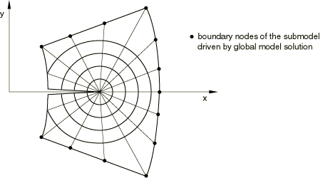

| **输入文件用法：** | ``` [*SUBMODEL](../key/key-link.md#usb-kws-msubmodel) *节点或节点集标签列表，或者对于声学-结构子模型，基于单元的结构的表面名称* ``` |
| --- | --- |
|  | [*SUBMODEL](../key/key-link.md#usb-kws-msubmodel) 选项必须包含在子模型分析的模型定义部分的输入文件中。允许使用多个 [*SUBMODEL](../key/key-link.md#usb-kws-msubmodel) 选项；但是，在这种情况下，您必须确保在一个选项的数据行上指定的驱动节点与所有其他选项的数据行上指定的节点是分开且不同的。 |

| **Abaqus/CAE 用法：** | 载荷模块：**创建边界条件**：为**类别**选择**其他**，为**所选步骤的类型**选择**子模型**：选择区域 |
| --- | --- |

#### 在壳到实体子模型中指定驱动节点

在壳到实体子模型中，子模型由实体单元组成，替换了全局模型中使用常规壳单元的区域。在这种情况下，Abaqus 期望子模型上的所有驱动节点都属于实体单元，并由完全由壳单元组成的全局模型区域驱动。子模型被驱动的边界是子模型中的一组表面，但在全局模型的壳参考表面中是一组线，如图 10.2.2-3 所示。壳模型上的虚线 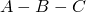 被实体单元子模型的阴影表面所取代。

**图 10.2.2-3** 壳到实体子模型。


每当使用壳到实体子模型时，您必须定义全局模型中的最大壳厚度，以模型使用的单位给出。如果在全局模型中定义了壳偏移，则壳厚度必须设置为等于从顶部或底部壳表面到壳参考表面距离的两倍。

| **输入文件用法：** | ``` [*SUBMODEL](../key/key-link.md#usb-kws-msubmodel), SHELL TO SOLID, SHELL THICKNESS=*thickness* ``` |
| --- | --- |
|  | 如果使用了多个 [*SUBMODEL](../key/key-link.md#usb-kws-msubmodel) 选项，则必须在每个选项上包含 SHELL TO SOLID 参数。 |

| **Abaqus/CAE 用法：** | 任何模块：****模型****编辑属性*****submodel*****: **子模型**：**壳全局模型驱动实体子模型** 载荷模块：**创建边界条件**：为**类别**选择**其他**，为**所选步骤的类型**选择**子模型**：选择区域：**壳厚度：** *thickness* |
| --- | --- |

#### 在声学-结构子模型中指定驱动节点

声学-结构子模型问题的全局分析作为耦合声学-结构分析执行。全局分析的声学节点压力必须写入与感兴趣结构表面接触的声学网格的结果文件。在子模型分析中，来自全局分析的声学压力驱动用户指定的感兴趣结构表面。子模型的驱动节点是位于指定表面上的节点。在声学-结构子模型中只允许基于单元的表面。

| **输入文件用法：** | ``` [*SUBMODEL](../key/key-link.md#usb-kws-msubmodel), ACOUSTIC TO STRUCTURE, ABSOLUTE EXTERIOR TOLERANCE=*value* ``` |
| --- | --- |

| **Abaqus/CAE 用法：** | Abaqus/CAE 不支持声学-结构子模型。 |
| --- | --- |

#### 为两侧有声学压力的壳指定驱动节点

在某些问题中，声学压力可能作用在壳结构的两侧。图 10.2.2-4 显示了由夹在两个声学介质之间的壳结构组成的全局模型的横截面。

**图 10.2.2-4** 壳两侧有声学区域的声学-结构全局模型的横截面。


分别定义了由壳正侧和负侧的声学单元组成的单独单元集。属于这些集合中单元的节点的节点压力被写入所选结果文件。图 10.2.2-5 显示了仅由精细壳结构组成的子模型。

**图 10.2.2-5** 壳两侧有声学压力的声学-结构子模型。


两个独立的表面分别定义在 SPOS 和 SNEG 侧。为了正确地在壳的每一侧施加来自全局分析的声学压力，您必须指定表面名称以及相应的声学单元集。

| **输入文件用法：** | ``` [*SUBMODEL](../key/key-link.md#usb-kws-msubmodel), ACOUSTIC TO STRUCTURE, GLOBAL ELSET=*Acoustic_SPOS* *Shell_SPOS* ``` |
| --- | --- |
|  | ``` [*SUBMODEL](../key/key-link.md#usb-kws-msubmodel), ACOUSTIC TO STRUCTURE, GLOBAL ELSET=*Acoustic_SNEG* *Shell_SNEG* ``` |

| **Abaqus/CAE 用法：** | Abaqus/CAE 不支持声学-结构子模型。 |
| --- | --- |

#### 定义几何容差

几何容差用于定义子模型中的边界节点可以偏离全局模型外表面多远（因为该表面在全局未变形有限元模型中被插值）。默认情况下，子模型中的节点必须位于由全局模型平均单元尺寸乘以 0.05 计算的距离内。您可以更改容差，这在子模型驱动节点在更大程度上位于全局模型外表面外部的情况下很有用。但是，大于此默认值的容差可能导致显著更长的计算时间和对于明显位于全局模型外表面的驱动节点更低的精度。

您可以将几何容差定义为全局模型中平均单元尺寸的分数或作为模型所选长度单位的绝对距离。如果两个容差都定义了，Abaqus 使用更严格的容差。

| **输入文件用法：** | 使用以下选项将几何容差定义为绝对距离： |
| --- | --- |
|  | ``` [*SUBMODEL](../key/key-link.md#usb-kws-msubmodel), ABSOLUTE EXTERIOR TOLERANCE=*tolerance* ``` 使用以下选项将几何容差定义为全局模型中平均单元尺寸的分数： ``` [*SUBMODEL](../key/key-link.md#usb-kws-msubmodel), EXTERIOR TOLERANCE=*tolerance* ``` |

| **Abaqus/CAE 用法：** | 载荷模块：**创建边界条件**：为**类别**选择**其他**，为**所选步骤的类型**选择**子模型**：选择区域：**外部容差**：**绝对：** 或 **相对：** *tolerance* |
| --- | --- |

##### 实体到实体子模型中的外部容差

实体到实体子模型分析的外部容差如图 10.2.2-6 中的阴影区域所示。如果驱动节点与全局模型自由表面之间的距离在指定容差范围内，则将全局模型的解变量外推到子模型。

**图 10.2.2-6** 实体到实体子模型中的外部容差。

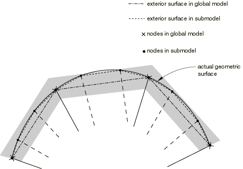

##### 壳到壳子模型中的外部容差

在壳到壳子模型分析中，Abaqus 检查子模型的驱动节点是否足够接近全局模型中壳单元的参考表面。为简化计算，全局模型中的最近点计算为通过子模型节点的直线与全局模型中壳参考表面的交点。直线的方向垂直于每个壳单元的平面表面近似。平面表面的法线是壳单元节点处法线的平均值。针对指定外部容差检查的距离如图 10.2.2-7 所示。

**图 10.2.2-7** 壳到壳子模型中的平面表面近似。


##### 壳到实体子模型中的外部容差

对于壳到实体子模型，Abaqus 使用两种容差来确定子模型与全局模型之间的关系。首先，确定全局模型壳参考表面上的最近点。这个点，即"影像节点"，如图 10.2.2-8 所示。用户指定的外部容差用于检查影像节点是否位于全局模型的域内。然后检查驱动节点与其影像之间的距离 ；如果距离小于指定壳厚度的一半加上外部容差，则接受该距离。如果全局模型具有变化的壳厚度或者壳参考表面偏离中面，则此检查仅是近似的。

**图 10.2.2-8** 壳到实体子模型中的外部容差。

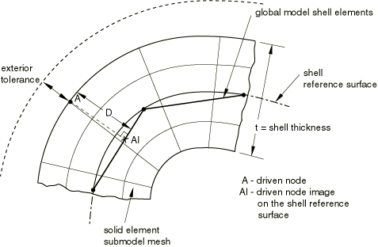

#### 允许将驱动节点排除在子模型之外

在某些情况下（如当您的子模型几何比全局模型在靠近自由表面的区域更详细时），您可以指定即使考虑搜索容差，Abaqus 也会发现位于全局模型元素外部区域的驱动节点。默认情况下，这些情况会导致错误消息。但是，在实体到实体子模型中，您可以指定 Abaqus 忽略无法找到的驱动节点。谨慎使用此选项，并始终评估被标记为未找到的节点列表。在大多数情况下，Abaqus 发现驱动节点位于全局模型外部反映了建模错误，使用仅交点选项可能导致这些情况下出现错误结果。

| **输入文件用法：** | 使用以下选项指定 Abaqus 忽略在全局模型元素中找不到的驱动节点： |
| --- | --- |
|  | ``` [*SUBMODEL](../key/key-link.md#usb-kws-msubmodel), INTERSECTION ONLY *节点或节点集标签列表* ``` 通过 INTERSECTION ONLY 参数忽略的驱动节点随后在所有后续子模型边界条件引用中被忽略。 |

### 在子模型中定义驱动变量

实际的驱动变量在任何步骤中定义为子模型边界条件。边界条件是从全局分析的结果或输出数据库文件获得的"驱动变量"。

子模型驱动节点上的自由度必须存在于全局模型的强制节点上。例如，在由结构全局模型驱动的声学流体子模型的问题中，应在子模型的驱动边界上创建声学界面单元，结构与该边界接触。

对于实体到实体和壳到壳子模型，指定要驱动的各个自由度。在大多数情况下，这些节点处解变量的所有分量（位移、旋转、温度等）都由全局解驱动，尽管您可以选择仅在任意驱动节点上驱动某些分量。对于壳到实体子模型，驱动自由度的选择是根据用户指定的壳参考表面周围的区域自动选择的，如下所述。

Abaqus/Explicit 不允许位移和旋转边界条件出现跳跃（请参阅["Abaqus/Standard 和 Abaqus/Explicit 中的边界条件，" 第 34.3.1 节"](pt07ch34s03aus118.md#usb-prc-pboundary-prescribed-disp)）；驱动位移和旋转的任何跳跃都将被忽略。

不建议让子模型中所有节点的所有变量都由全局解驱动。

对于声学-结构子模型，作用于子模型驱动节点的声学压力引起的载荷通过与驱动节点集一起指定压力（自由度 8）来激活。

在分析的每个步骤中只能指定一个子模型边界条件。

| **输入文件用法：** | ``` [*BOUNDARY](../key/key-link.md#usb-kws-hboundary), SUBMODEL ``` |

| **Abaqus/CAE 用法：** | 载荷模块：**创建边界条件**：为**类别**选择**其他**，为**所选步骤的类型**选择**子模型**：选择区域：**自由度：** *degrees of freedom* |
| --- | --- |

#### 指定全局分析中的步骤编号

您指定全局模型历史中用于当前子模型分析步骤中驱动变量的步骤。当从结果文件获取全局解时，如果已在全局分析中请求，则包含零增量（请参阅["输出，" 第 4.1.1 节"](pt02ch04s01aus38.md)）。

在一般分析步骤或直接解稳态动态分析步骤中，Abaqus 根据全局模型的结果计算驱动变量随时间或频率变化的幅值。

| **输入文件用法：** | ``` [*BOUNDARY](../key/key-link.md#usb-kws-hboundary), SUBMODEL, STEP=*step* ``` |

| **Abaqus/CAE 用法：** | 载荷模块：**创建边界条件**：为**类别**选择**其他**，为**所选步骤的类型**选择**子模型**：选择区域：**全局步骤编号：** *step* |
| --- | --- |

##### 将全局时间周期缩放到子模型时间周期

全局分析和子模型分析可以具有不同的时间步长。您可以将驱动节点从全局分析的时间变量缩放到子模型分析的步骤时间。当分析本质上是静态或准静态时，此技术很有用；在具有显著惯性效应的动态分析中使用此技术不推荐。如果在全局模型和子模型中使用相同的步骤时间，则时间刻度没有影响。不能在频域分析或线性扰动步骤中指定时间刻度。

Abaqus 将通过使用写入全局解结果或输出数据库文件的时间点来确定驱动变量在子模型分析步骤中遵循的值。当驱动节点的时间变量被缩放并且步骤时间与子模型步骤时间不同时，驱动变量的时间点被缩放到子模型步骤时间。

| **输入文件用法：** | ``` [*BOUNDARY](../key/key-link.md#usb-kws-hboundary), SUBMODEL, STEP=*step*, TIMESCALE ``` |

| **Abaqus/CAE 用法：** | 载荷模块：**创建边界条件**：为**类别**选择**其他**，为**所选步骤的类型**选择**子模型**：选择区域：**将全局步骤的时间周期缩放到子模型步骤的时间周期** |
| --- | --- |

##### 缩放驱动变量的幅值

对于基于位移的子模型，驱动变量的幅值通过将从全局分析获得的位移历史乘以缩放参数来获得。您可以通过在子模型边界条件定义中设置缩放参数来缩放驱动变量。此技术可用于在多步骤分析中缩放子模型边界条件而无需重新运行全局模型。它可用于 Abaqus/Standard 和 Abaqus/Explicit 中的相同到相同和壳到实体情况，声学-结构子模型除外。

| **输入文件用法：** | ``` [*BOUNDARY](../key/key-link.md#usb-kws-hboundary), SUBMODEL, STEP=*step*, SCALE=*scalarValue* ``` |

| **Abaqus/CAE 用法：** | 载荷模块：**创建边界条件**：为**类别**选择**其他**，为**所选步骤的类型**选择**子模型**：选择区域：**缩放：** *scale* |
| --- | --- |

#### 修改驱动变量集

您可以修改子模型边界条件以向驱动变量列表添加新变量，可以从驱动变量集中移除变量，也可以稍后重新引入它们（请参阅["Abaqus/Standard 和 Abaqus/Explicit 中的边界条件，" 第 34.3.1 节"](pt07ch34s03aus118.md)）。不能向为子模型定义的驱动节点总集中添加新节点；该驱动节点集是模型定义的固定部分。

| **输入文件用法：** | 使用以下选项之一： |
| --- | --- |
|  | ``` [*BOUNDARY](../key/key-link.md#usb-kws-hboundary), SUBMODEL, OP=MOD [*BOUNDARY](../key/key-link.md#usb-kws-hboundary), SUBMODEL, OP=NEW ``` |

| **Abaqus/CAE 用法：** | 载荷模块：边界条件编辑器：**自由度** |
| --- | --- |

#### 在壳到实体子模型中自动选择驱动变量

对于壳到实体子模型，驱动节点处的驱动自由度是根据驱动节点与全局模型壳参考表面之间的距离自动选择的。所有位移分量在位于参考表面内或"中心区域"内的节点处被驱动，如图 10.2.2-9 所示。中心区域的尺寸在子模型边界条件定义中指定，如下所述。对于距离参考表面更远的节点，只驱动平行于壳参考表面的位移分量。子模型中至少一层节点必须位于中心区域内；如果没有找到如此靠近参考表面的节点，Abaqus 会发出错误消息。

**图 10.2.2-9** 壳到实体子模型中的中心区域选择。

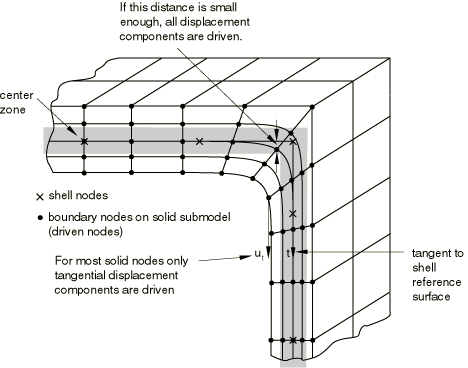

##### 在壳到实体子模型中指定中心区域的尺寸

为中心区域方法指定驱动变量通常提供壳模型中平面应力假设的合理传递。在参考表面周围所有位移分量被驱动的区域宽度对于各种驱动节点或节点集可能不同。如果您不为中心区域尺寸提供值，则假定为指定壳厚度最大值的 10% 的默认值。

对于复杂几何形状，为不同节点或节点集分配不同的中心区域尺寸可能是有利的。

您可以通过在可视化模块中显示模型边界条件（****视图****ODB 显示选项****）在 Abaqus/CAE 中查看位于中心区域内部和外部的驱动节点。

| **输入文件用法：** | ``` [*BOUNDARY](../key/key-link.md#usb-kws-hboundary), SUBMODEL, STEP=*step* *nodes*, *center zone size* ``` |

| **Abaqus/CAE 用法：** | 载荷模块：**创建边界条件**：为**类别**选择**其他**，为**所选步骤的类型**选择**子模型**：选择区域：**中心区域尺寸：** *center zone size* |
| --- | --- |

##### 在壳到实体子模型中传递横向剪切应力

通常，最靠近壳参考表面的节点层位于中心区域内就足够了。如果在厚度方向上使用了非常精细的实体网格并且传递了相当大的横向剪切应力，则可能需要将中心区域尺寸设置得足够大，以使多层节点位于区域内。但是，如果子模型边界处的横向剪切应力很高且子模型在厚度方向上高度细化，则可能会产生高局部应力，因为子模型边界处的剪切力仅在中心区域内的驱动节点处传递。横向剪切应力仅在弯矩快速变化的区域才会很高；在这些区域定位子模型边界并不好。最好在全局模型中横向剪切应力低的区域定位子模型边界。

### 特殊注意事项

有几个值得注意的特殊注意事项。

#### 在壳到壳子模型中指定壳厚度

对于壳到壳子模型，壳厚度通常不会在模型之间更改。例如，如果正在研究局部厚度变化，您可以指定不同的壳厚度；但是，Abaqus 不会检查这些差异的有效性。

#### 壳到实体子模型中的限制

壳到实体功能适用以下限制和特殊情况：
- 全局模型可以同时包含实体和壳单元；但是，当使用壳到实体功能时，所有驱动节点必须位于全局模型的壳单元内。如果驱动边界位于实体和壳区域的边界上，则驱动节点必须远离实体区域移动一小段距离（见图 10.2.2-10）。**图 10.2.2-10** 壳到实体子模型的限制。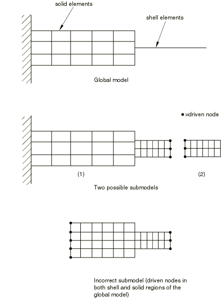
- 角落或扭结可能存在于由壳单元组成的全局模型中。在这样的角落或扭结处，壳单元仅近似于远离壳中面的材料分布（见图 10.2.2-11）。由于这种近似，如果子模型的驱动节点位于距离角落或扭结一个壳厚度以内，则无法正确驱动子模型。如有必要，使用图 10.2.2-11 中所示的方法。**图 10.2.2-11** 角落周围的壳到实体子模型。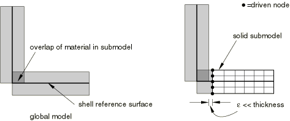 更好的方法是将角落或扭结作为子模型的一部分，并从远离角落或扭结的节点驱动它，因为它们是应力集中和高应力梯度的来源（见图 10.2.2-12）。**图 10.2.2-12** 壳交叉点的实体子模型。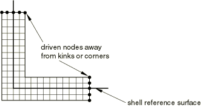
- 在壳到实体子模型中不能驱动温度自由度。

#### 壳到实体子模型的替代方案

壳到实体子模型的替代方案是["壳到实体耦合，" 第 35.3.3 节"](pt08ch35s03aus134.md) 中讨论的基于表面的壳到实体耦合功能。

### 过程

耦合热电过程和任何基于模态的动力学过程都不能在子模型级别使用。此外，子模型不能与对称模型生成或对称结果传递结合使用。自适应网格不应在全局模型中使用。但是，它们可用于子模型分析；Abaqus 始终将子模型中的驱动节点视为拉格朗日节点。

一般（可能是非线性的）和线性扰动步骤都可以用于子模型（请参阅["一般和线性扰动过程，" 第 6.1.3 节"](pt03ch06s01aus44.md)，了解一般和线性扰动步骤的讨论）。

#### 动态过程中的子模型

子模型功能可用于使用显式积分的动态过程（在 Abaqus/Explicit 中）和使用直接积分的动态过程（在 Abaqus/Standard 中）。可以考虑全局模型和子模型之间过程的以下组合：显式动态、隐式动态、动态耦合热应力 和耦合热应力。在惯性力显著的动态问题中，全局模型和子模型需要在相同的步骤时间间隔内运行。

在 Abaqus/Explicit 中，准静态分析作为动态过程执行。对于这种情况以及在 Abaqus/Standard 中执行的静态分析，全局模型和子模型的时间步长可以不同。必须将从全局分析中驱动节点的时间变量缩放到子模型分析的步骤时间，以使在驱动节点生成的幅值函数的时间变量与子模型中使用的步骤时间匹配。

对于 Abaqus/Explicit 中显著动态的问题，需要将足够数量的间隔写入全局模型的结果或输出数据库文件。最好为用于驱动子模型的节点保存每个增量的位移结果。特别是在具有弹性材料属性问题中，这种警告是必要的，以避免可能的混叠（欠采样），这可能导致子模型中的解失真。这些要求不适用于准静态问题。

##### 解释加速度结果

当您使用全局模型位移结果驱动子模型边界时，位移被解释为时间上的平滑分段线性函数，类似于使用表格幅值定义应用位移边界条件的方式（请参阅["在边界条件中使用幅值定义"中的"幅值曲线，" 第 34.1.2 节"](pt07ch34s01aus115.md#usb-prc-pamplitude-bc)）。这种平滑函数通常导致驱动节点的位移和速度与全局模型相当合理地一致。然而，驱动边界处的加速度结果通常与全局模型不太一致，因为它们反映的是位移历史平滑的形状，而不是全局模型加速度结果（从分段线性全局模型位移历史中不可用的信息）。远离子模型驱动节点的子模型加速度结果受此平滑的影响较小，通常与全局模型响应相当一致。

#### 使用线性扰动分析在特定时间点获取解

在 Abaqus/Standard 中，可以使用子模型分析中的静态线性扰动过程来研究对应于全局解中特定时间点的子模型线性化响应。您可以选择全局分析步骤中用作计算驱动变量值基础的增量。如果您没有在静态线性扰动步骤中选择增量，则使用全局分析中所选步骤的最后一个增量作为计算驱动变量值的基础。您不能在一般子模型步骤中选择增量。

| **输入文件用法：** | ``` [*BOUNDARY](../key/key-link.md#usb-kws-hboundary), SUBMODEL, STEP=*step*, INC=*increment* ``` |

| **Abaqus/CAE 用法：** | 载荷模块：**创建边界条件**：为**类别**选择**其他**，为**所选步骤的类型**选择**子模型**：选择区域：**全局步骤编号**：*step*，**全局增量**：*increment* |
| --- | --- |

#### 频域中的子模型

子模型功能可通过直接解稳态动力学过程用于频域。子模型级别不能使用基于模态的稳态动力学。

子模型中频率范围规范唯一的限制是最小和最大频率应落在全局模型中计算的频率范围内。Abaqus 将在频域以及空间上插值来自全局模型的解变量，然后将其应用到子模型。如果在子模型中请求响应的频率与在全局模型中计算响应的频率相匹配，则结果将最准确。这在全局模型特征频率附近尤其如此。

在全局模型中，您必须将节点位移的幅值和相位写入结果文件，以便 Abaqus 可以在子模型的驱动节点处应用解的实部和虚部。如果您使用输出数据库来驱动子模型，则只需要请求节点位移输出，因为输出数据库中的位移输出包括实部和虚部。

#### 混合一般和线性扰动步骤

在全局和子模型分析中混合一般步骤和线性扰动步骤是可能的。Abaqus 允许在子模型期间将一般分析步骤视为线性扰动步骤，反之亦然。

##### 示例：使用一般和线性扰动步骤的子模型

有关使用一般和线性扰动步骤的子模型示例，请考虑以下情况。全局分析包括静态预载荷——作为一般非线性分析步骤——然后是预载结构的特征模态和频率提取，然后是 5 秒模态动态响应分析的步骤：

```
[*STEP](../key/key-link.md#usb-kws-hstep)
** Apply preload
[*STATIC](../key/key-link.md#usb-kws-hstatic)
 0.1, 1.0
…
** Write out results for nodes needed to
** interpolate to the submodel's boundary
[*NODE FILE](../key/key-link.md#usb-kws-hnodefile), NSET=DETAIL
 U
[*END STEP](../key/key-link.md#usb-kws-hendstep)
[*STEP](../key/key-link.md#usb-kws-hstep)
** Calculate modes and frequencies
[*FREQUENCY](../key/key-link.md#usb-kws-hfrequency)
…
** The [*NODE FILE](../key/key-link.md#usb-kws-hnodefile) option is repeated because
** this is the first linear perturbation step
[*NODE FILE](../key/key-link.md#usb-kws-hnodefile), NSET=DETAIL
 U
[*END STEP](../key/key-link.md#usb-kws-hendstep)
[*STEP](../key/key-link.md#usb-kws-hstep)
** Dynamic response of preloaded system
[*MODAL DYNAMIC](../key/key-link.md#usb-kws-hmodaldyn)
 0.01, 5.0
…
[*END STEP](../key/key-link.md#usb-kws-hendstep)
```

我们希望研究模型局部部分的局部（可能是非线性）响应，该部分非常小以至于我们不需要在局部建模动态效应，因此可以执行两个静态分析步骤：
```
** Define submodel boundary (driven nodes)
[*SUBMODEL](../key/key-link.md#usb-kws-msubmodel)
PERIM
[*STEP](../key/key-link.md#usb-kws-hstep)
** Preload
[*STATIC](../key/key-link.md#usb-kws-hstatic)
 0.1, 1.0
[*BOUNDARY](../key/key-link.md#usb-kws-hboundary), SUBMODEL, STEP=1
…
[*END STEP](../key/key-link.md#usb-kws-hendstep)
[*STEP](../key/key-link.md#usb-kws-hstep)
** Local static response to global dynamic step
[*STATIC](../key/key-link.md#usb-kws-hstatic)
 0.01, 5.0
[*BOUNDARY](../key/key-link.md#usb-kws-hboundary), SUBMODEL, STEP=3
…
[*END STEP](../key/key-link.md#usb-kws-hendstep)
```

子模型分析为两个步骤请求一般（可能是非线性的）分析是完全可以接受的，而在全局分析中动态步骤是线性扰动步骤（模态动态始终是线性扰动分析）。有您负责判断此子模型功能的使用是否合理。例如，假设全局分析继续进行第四个一般非线性静态响应步骤：
```
[*RESTART](../key/key-link.md#usb-kws-mrestart), READ, STEP=3
** Read state at end of initial preload
** (could equally well use [*RESTART](../key/key-link.md#usb-kws-mrestart), READ, STEP=1)
[*STEP](../key/key-link.md#usb-kws-hstep)
** Add more preload
[*STATIC](../key/key-link.md#usb-kws-hstatic)
 0.2, 1.0
…
[*END STEP](../key/key-link.md#usb-kws-hendstep)
```

第四个一般分析步骤从一般分析步骤 1 结束时的状态开始，因为频率提取和模态动态步骤都是线性扰动步骤。但是，如果我们以相同的方式重启子模型分析，则解可能与全局模型解不可比：
```
[*RESTART](../key/key-link.md#usb-kws-mrestart), READ, STEP=2
** Read state at end of step 2
[*STEP](../key/key-link.md#usb-kws-hstep)
** Add more preload
[*STATIC](../key/key-link.md#usb-kws-hstatic)
 0.2, 1.0
[*BOUNDARY](../key/key-link.md#usb-kws-hboundary), SUBMODEL, STEP=4
…
[*END STEP](../key/key-link.md#usb-kws-hendstep)
```

子模型中的第二个步骤是一般分析步骤，响应可能是非线性的，从而改变模型的状态。一个有效的替代方案是在第一个步骤之后立即将步骤 4 响应应用于子模型：
```
[*RESTART](../key/key-link.md#usb-kws-mrestart), READ, STEP=1
** Read state at end of preload step
[*STEP](../key/key-link.md#usb-kws-hstep)
** Add more preload
[*STATIC](../key/key-link.md#usb-kws-hstatic)
 0.2, 1.0
[*BOUNDARY](../key/key-link.md#usb-kws-hboundary), SUBMODEL, STEP=4
…
[*END STEP](../key/key-link.md#usb-kws-hendstep)
```

#### 在子模型分析中重新解释解变量

在一般分析步骤中，Abaqus 使用总解变量（如位移  工作。在线性扰动步骤中，Abaqus 使用关于基态 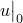 的位移扰动  工作。当在子模型分析中重新解释一般分析步骤和线性扰动步骤时，全局分析结果的处理方式如表 10.2.2-1 所示。

**表 10.2.2-1** 在子模型分析中重新解释解变量。
| 全局分析步骤基础 | 子模型步骤基础 | 子模型边界条件定义中指定的全局增量 | 驱动变量基础 |
| --- | --- | --- | --- |
| 一般 | 一般 | 无 | 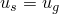 |
| 线性扰动 | 一般 | 无 | 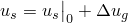 |
| 一般 | 静态，线性扰动 |  |  |
| 线性扰动 | 静态，线性扰动 |  |  |

在本表中


是一般非线性分析步骤期间任何时候子模型中驱动变量的当前值；


是线性扰动步骤期间子模型中驱动变量的扰动值；

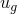 和 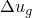

是全局模型中相同（几何插值）变量的对应值；

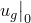

是全局分析线性扰动步骤期间变量的"基态"值；


是子模型分析线性扰动步骤期间变量的"基态"值；


是全局分析步骤增量 *i* 中  的值；以及


是全局分析步骤增量 *i* 中  的值。

#### 在壳到实体子模型中混合一般和线性扰动步骤

当全局模型上的一般过程驱动子模型上的线性扰动过程，反之亦然时，必须为壳到实体情况做出额外的假设。这些假设取决于所使用的几何公式（线性或非线性）和过程组合。有关这些情况的详细信息和控制方程，请参阅["子模型分析，" Abaqus 理论指南第 2.15.1 节](../stm/stm-link.md#stm-anl-submodeling)。

### 初始条件

全局模型和子模型之间的初始条件定义应一致。

### 边界条件

在驱动自由度上指定的边界条件（子模型边界条件除外）将替换使用子模型边界条件指定的边界条件。当发生这种替换时，Abaqus 会在数据文件中报告更改。

节点可以在某些步骤中由全局模型驱动，在其他步骤中具有用户指定的边界条件。在这些情况下，所有相关边界条件必须重新指定（请参阅["Abaqus/Standard 和 Abaqus/Explicit 中的边界条件，" 第 34.3.1 节"](pt07ch34s03aus118.md)）。

在子模型区域中应用的任何其他边界条件应以常规方式在子模型分析中施加。您有责任正确地将此类边界条件应用于子模型，以使它们与全局模型的载荷相对应。

对于也是对称平面的子模型边界节点要小心，因为两种形式的边界条件都可以应用。在这种情况下，在局部坐标系中应用边界条件可能会有所帮助（请参阅["变换坐标系，" 第 2.1.5 节"](pt01ch02s01aus09.md)）。局部坐标系应仅应用于打算覆盖子模型边界条件的边界条件，因为子模型边界条件始终通过全局模型以全局坐标方向输出。

### 载荷

在子模型区域中施加的任何载荷必须以常规方式在子模型分析中施加。您有责任正确地将此类载荷应用于子模型，以使它们与全局模型的载荷相对应。请参阅["施加载荷：概述，" 第 34.4.1 节"](pt07ch34s04aus120.md)，了解 Abaqus 中可用载荷的概述。

### 预定义场

可以在子模型分析中指定以下预定义场，如["预定义场，" 第 34.6.1 节"](pt07ch34s06aus128.md)中所述：
- 可以指定节点温度。如果为材料给出了热膨胀系数，则施加温度与初始温度之间的差异将导致热应变（["热膨胀，" 第 26.1.2 节"](pt05ch26s01abm52.md)）。指定温度也会影响温度依赖性材料特性（如果有）。
- 可以指定用户定义场变量的值。这些值仅影响场变量依赖性材料特性（如果有）。

Abaqus 将解变量插值到子模型驱动节点。它还可以将温度作为场变量插值（请参阅["预定义场，" 第 34.6.1 节"](pt07ch34s06aus128.md#usb-prc-pfields-tempinterpolate)中的"在网格之间插值数据"）。其他预定义场不会被插值到子模型的节点上；它们必须从需要这些场的子模型所有节点的输入数据中可用。

当必须使用来自全局热传递分析的温度解执行子模型热应力分析时，Abaqus/Standard 提供了多种方法。
- 运行全局模型的热传递分析，并将节点温度写入结果或输出数据库文件。运行全局模型的顺序耦合热应力分析。在这种情况下，从全局热传递分析的结果或输出数据库文件获得的温度是场变量。如果热应力分析中使用的网格与热传递分析中的网格不同，请指定 Abaqus/Standard 应将温度场从热传递分析网格插值到热应力分析网格。使用全局热应力分析的结果或输出数据库文件运行子模型热应力分析，以读取驱动变量（位移场），并使用全局热传递分析或全局热应力分析的结果或输出数据库文件读取作为场变量的温度。在任何一种情况下，温度场都将被插值到当前子模型节点。如果需要在不同网格之间进行插值，则必须使用全局输出数据库文件来读取温度。详见图 10.2.2-13 和图 10.2.2-14。**图 10.2.2-13** 全局模型顺序耦合热应力分析，仅子模型热应力分析。**图 10.2.2-14** 全局模型顺序耦合热应力分析，仅子模型热应力分析。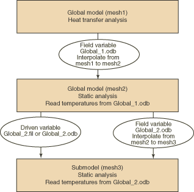
- 运行全局模型的热传递分析，并将节点温度写入结果或输出数据库文件。使用与全局热传递分析相同的网格（mesh1）运行顺序耦合热应力分析（全局热应力分析），并使用来自全局热传递分析的结果或输出数据库文件的温度。接下来，运行子模型热传递分析，使用最终子模型热应力分析所需的网格（mesh2），并将节点温度写入结果或输出数据库文件。使用来自全局热传递分析的温度解来驱动子模型热传递分析的解。最后，使用来自子模型热传递分析的结果或输出数据库文件获得的温度（作为场变量）和来自全局热应力分析的位移（作为驱动变量）运行子模型热应力分析。见详细流程图图 10.2.2-15。**图 10.2.2-15** 全局模型和子模型两者的顺序耦合热应力分析。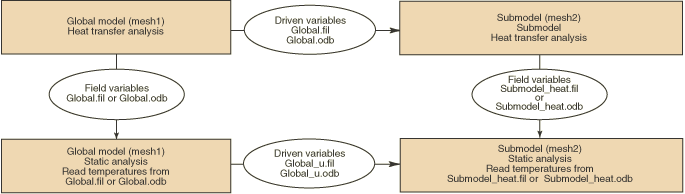

### 材料选项

[第五部分，"材料"](pt05.md) 中描述的任何材料模型都可用于全局和子模型分析。为子模型定义的材料响应可能与为全局模型定义的材料响应不同。

### 单元

子模型的维度必须与全局模型相同：两个模型必须是二维或三维的。以下限制适用：
- 子模型的边界节点必须位于全局模型中 Abaqus 能够执行空间插值以定义驱动变量值的区域。因此，它们必须位于全局模型中几何定义的二维或三维单元之内（或在外部容差允许的情况下接近）。这种几何定义的单元包括：
  - 二维中的一阶或二阶三角形或四边形；
  - 一阶或二阶三角形或四边形壳；以及
  - 三维中的一阶或二阶四面体、棱柱或六面体。
- 当在全局模型中使用每节点五个自由度的壳单元（S4R5、S8R5、STRI65 等）时，旋转不会写入结果文件或输出数据库；因此，只能驱动位移自由度。此限制表明这些单元不应与子模型一起使用，或者子模型应在其驱动边缘周围包含一组窄单元，以便这些节点处的插值位移有效地传递旋转。五个自由度壳不能用于壳到实体子模型。
- 边界节点不能位于全局模型中仅有一维单元（梁、桁架、连杆、轴对称壳）的区域，因为 Abaqus 不为此类单元提供必要的解插值。
- 边界节点不能位于全局模型中仅有用户单元、子结构、弹簧、阻尼器等的区域，因为这些单元类型不允许几何插值。
- 边界节点不能位于全局模型中仅有非线性非对称变形的轴对称实体单元（CAXA 单元）的区域。这些单元目前不支持子模型功能。
- 与广义平面应变单元（CPEG）关联的参考节点不能用作战子模型分析中的驱动边界节点。

### 输出

在特定过程中通常可用的任何输出在子模型分析期间也可用（请参阅["Abaqus/Standard 输出变量标识符，" 第 4.2.1 节"](pt02ch04s02abv01.md) 和["Abaqus/Explicit 输出变量标识符，" 第 4.2.2 节"](pt02ch04s02xbv01.md)）。

如上所述，必须在全局分析中使用节点输出请求到结果文件或输出数据库文件，以保存子模型边界处驱动变量的值。

### 输入文件模板

#### 全局分析：

```
[*HEADING](../key/key-link.md#usb-kws-mheading)
…
[*STEP](../key/key-link.md#usb-kws-hstep)
Step 1
[*STATIC](../key/key-link.md#usb-kws-hstatic) (*or* [*DYNAMIC](../key/key-link.md#usb-kws-hdynamic), *etc.*)
*Data line to define step time and control incrementation*
…
[*NODE FILE](../key/key-link.md#usb-kws-hnodefile)
*List of solution variables to be used to drive the submodel*
[*OUTPUT](../key/key-link.md#usb-kws-houtput), FIELD
[*NODE OUTPUT](../key/key-link.md#usb-kws-hnodeoutput)
*List of solution variables to be used to drive the submodel*
[*END STEP](../key/key-link.md#usb-kws-hendstep)
```

#### 子模型分析：

```
[*HEADING](../key/key-link.md#usb-kws-mheading)
…
[*SUBMODEL](../key/key-link.md#usb-kws-msubmodel), EXTERIOR TOLERANCE=*tolerance*
*List of all nodes to be driven*
**
[*STEP](../key/key-link.md#usb-kws-hstep)
[*STATIC](../key/key-link.md#usb-kws-hstatic) (*or any other allowable procedure*)
*Data line to define step time (must be the same as the step time in the global analysis unless the*
*TIMESCALE parameter is used on the [*BOUNDARY](../key/key-link.md#usb-kws-hboundary) option) and control incrementation*
…
[*BOUNDARY](../key/key-link.md#usb-kws-hboundary), SUBMODEL, STEP=1
*Data lines listing nodes and degrees of freedom to be driven in this step*
…
[*END STEP](../key/key-link.md#usb-kws-hendstep)
```
