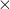

# 10.3.1 生成矩阵

**产品：** Abaqus/Standard  

##### **参考文献**

- ["定义矩阵，" 第 2.11.1 节"](pt01ch02s11aus29.md)
- ["单元矩阵装配实用程序，" 第 3.2.26 节"](pt01ch03s02abx26.md)
- ["定义分析，" 第 6.1.2 节"](pt03ch06s01abo05.md)
- [*MATRIX GENERATE](../key/key-link.md#usb-kws-hmatrixgenerate)
- [*MATRIX CHECK](../key/key-link.md#usb-kws-hmatrixcheck)
- [*MATRIX OUTPUT](../key/key-link.md#usb-kws-hmatrixoutput)
- [*MATRIX INPUT](../key/key-link.md#usb-kws-mmatrixinput)
- [*CLOAD](../key/key-link.md#usb-kws-hcload)

### 概述

矩阵生成：
- 是线性扰动过程；
- 允许通过生成表示模型中刚度、质量、粘性阻尼、结构阻尼和载荷向量的全局或单元矩阵来对模型数据（如网格和材料信息）进行数学抽象；
- 通常创建与基于子空间的稳态动力学过程使用的矩阵相同的矩阵（请参阅["基于子空间的稳态动力学分析，" 第 6.3.9 节"](pt03ch06s03at14.md)）；
- 如果分析中包含非线性几何效应，则包括由于预载荷和初始条件引起的初始应力和载荷刚度效应；
- 将矩阵数据写入可被 Abaqus 作为输入读取的二进制 `.sim` 文件；
- 可以将矩阵数据输出到文本文件，这些文件可被 Abaqus 或其他仿真软件在其他分析中读取为输入；以及
- 可以检查生成的全局刚度矩阵和质量矩阵的质量。

### 简介

线性化有限元模型可以用表示模型中刚度、质量、阻尼和载荷的矩阵来概括。使用这些矩阵，您可以与其他用户、供应商或软件包交换模型数据，而无需交换网格或材料数据。模型的矩阵表示防止了专有信息的传输，并最大限度地减少了数据操作的需要。

矩阵生成过程是一个线性扰动步骤（请参阅["一般和线性扰动过程，" 第 6.1.3 节"](pt03ch06s01aus44.md)），它考虑了模型中所有当前边界条件、载荷和材料响应。您还可以在矩阵生成步骤中指定新的边界条件、载荷和预定义场。生成的矩阵被输入到矩阵使用模型中。

矩阵生成过程使用 SIM，这是 Abaqus 中的高性能数据库。生成的矩阵存储在名为 `*jobname*_X*n*.sim` 的文件中，其中 *jobname* 是输入文件或分析作业的名称，*n* 是生成矩阵的 Abaqus 步骤编号。

#### 指定矩阵类型

您可以生成表示以下模型特征的矩阵：
- 刚度，
- 质量，
- 粘性阻尼，
- 结构阻尼，以及
- 载荷。

载荷矩阵包含为矩阵生成步骤中定义的载荷情况集成的节点载荷向量（右侧）。载荷情况可以由任意组合的载荷组成——分布载荷、集中节点载荷、热膨胀，以及为可用作模型一部分的任何子结构定义的载荷情况。

| **输入文件用法：** | 使用以下选项生成刚度矩阵： |
| --- | --- |
|  | ``` [*MATRIX GENERATE](../key/key-link.md#usb-kws-hmatrixgenerate), STIFFNESS ``` 使用以下选项生成质量矩阵： ``` [*MATRIX GENERATE](../key/key-link.md#usb-kws-hmatrixgenerate), MASS ``` 使用以下选项生成粘性阻尼矩阵： ``` [*MATRIX GENERATE](../key/key-link.md#usb-kws-hmatrixgenerate), VISCOUS DAMPING ``` 使用以下选项生成结构阻尼矩阵： ``` [*MATRIX GENERATE](../key/key-link.md#usb-kws-hmatrixgenerate), STRUCTURAL DAMPING ``` 使用以下选项生成载荷矩阵： ``` [*MATRIX GENERATE](../key/key-link.md#usb-kws-hmatrixgenerate), LOAD ``` |

#### 生成单元矩阵

默认情况下，矩阵生成过程为模型生成装配形式的全局矩阵。生成的全局矩阵由局部单元矩阵装配而成，包括来自矩阵输入数据的贡献。Abaqus/Standard 提供了以逐单元形式生成全局矩阵的选项。不是生成全局（装配）矩阵，而是生成局部单元矩阵。如果您选择为包含矩阵输入数据的模型生成局部单元矩阵，则 Abaqus/Standard 仅计算和存储单元矩阵；忽略矩阵输入数据。

| **输入文件用法：** | ``` [*MATRIX GENERATE](../key/key-link.md#usb-kws-hmatrixgenerate), ELEMENT BY ELEMENT ``` |
| --- | --- |

#### 为模型的一部分生成矩阵

您可以为由单元集定义的模型部分、源贡献或物理场生成矩阵。

##### 定义生成矩阵的单元集

默认情况下，矩阵生成过程为整个模型生成矩阵。Abaqus/Standard 可以为由单元集定义的模型部分生成矩阵。

| **输入文件用法：** | ``` [*MATRIX GENERATE](../key/key-link.md#usb-kws-hmatrixgenerate), ELSET=*element set name* ``` |
| --- | --- |

##### 定义生成矩阵的源贡献

默认情况下，矩阵生成过程从有限元和有限元模型中使用的矩阵输入数据生成矩阵。Abaqus/Standard 可以仅从有限元或仅从矩阵输入贡献为模型的一部分生成矩阵。

| **输入文件用法：** | 使用以下选项从有限元和矩阵输入数据生成矩阵： |
| --- | --- |
|  | ``` [*MATRIX GENERATE](../key/key-link.md#usb-kws-hmatrixgenerate), SOURCE=ALL (default) ``` 使用以下选项仅包括来自有限元的贡献生成矩阵： ``` [*MATRIX GENERATE](../key/key-link.md#usb-kws-hmatrixgenerate), SOURCE=ELEMENTS ``` 使用以下选项仅包括来自矩阵输入数据的贡献生成矩阵： ``` [*MATRIX GENERATE](../key/key-link.md#usb-kws-hmatrixgenerate), SOURCE=MATRIX INPUT ``` |

##### 定义生成矩阵的物理场

您还可以通过物理场定义矩阵生成的模型部分。矩阵生成过程可以为力学和声学场生成矩阵。默认情况下，矩阵生成过程为模型的结构和声学部分生成矩阵。您可以仅为模型的结构部分或仅为模型的声学部分生成矩阵。Abaqus/Standard 不支持在矩阵使用模型中生成包含声学自由度的矩阵（请参阅["定义矩阵，" 第 2.11.1 节"](pt01ch02s11aus29.md)）。

| **输入文件用法：** | 使用以下选项为模型的结构和声学部分生成矩阵： |
| --- | --- |
|  | ``` [*MATRIX GENERATE](../key/key-link.md#usb-kws-hmatrixgenerate), FIELD=ALL (default) ``` 使用以下选项仅为模型的结构部分生成矩阵： ``` [*MATRIX GENERATE](../key/key-link.md#usb-kws-hmatrixgenerate), FIELD=MECHANICAL ``` 使用以下选项仅为模型的声学部分生成矩阵： ``` [*MATRIX GENERATE](../key/key-link.md#usb-kws-hmatrixgenerate), FIELD=ACOUSTIC ``` |

#### 评估频率依赖性材料特性

当在模型定义中指定了频率依赖性材料特性时，Abaqus/Standard 提供了选择这些特性在全局矩阵生成中求值频率的选项。如果您不选择频率，Abaqus/Standard 将在零频率下对矩阵求值，并且不考虑频域粘弹性的贡献。

| **输入文件用法：** | ``` [*MATRIX GENERATE](../key/key-link.md#usb-kws-hmatrixgenerate), PROPERTY EVALUATION=*frequency* ``` |
| --- | --- |

#### 应用多点约束

如果模型中使用了多点约束，默认情况下，生成的矩阵仅包含独立自由度的条目。您可以跳过在生成模型中应用多点约束。

| **输入文件用法：** | 使用以下选项生成应用了多点约束的矩阵： |
| --- | --- |
|  | ``` [*MATRIX GENERATE](../key/key-link.md#usb-kws-hmatrixgenerate), MPC=YES (default) ``` 使用以下选项在矩阵生成期间跳过多点约束： ``` [*MATRIX GENERATE](../key/key-link.md#usb-kws-hmatrixgenerate), MPC=NO ``` |

#### 指定公共节点

Abaqus/Standard 模型可能包含用户定义的节点和内部节点。内部节点是具有与之关联的内部自由度的节点（例如，拉格朗日乘子和广义位移），这些节点由 Abaqus/Standard 内部创建。

您可以使用矩阵生成过程将一些用户定义的节点指定为"公共节点"。这些节点在矩阵使用模型中是可见的。矩阵数据中其余用户定义的节点被指定为内部节点，在矩阵使用模型中有效地隐藏（请参阅["定义矩阵，" 第 2.11.1 节"](pt01ch02s11aus29.md#usb-int-idefiningmatrices-internal)中的"矩阵数据中的内部节点"）。默认情况下，矩阵数据中的所有用户定义节点都是公共节点。

通过指定公共节点，您可以减少矩阵使用分析中的用户定义节点数量，这简化了重新映射过程（请参阅["定义矩阵，" 第 2.11.1 节"](pt01ch02s11aus29.md#usb-int-idefiningmatrices-remap)中的"装配矩阵中用户定义节点的重新映射"）。例如，您可能希望将用于将子组件（矩阵）附加到矩阵使用模型的节点或用于结果输出的节点标识为公共节点。

| **输入文件用法：** | ``` [*MATRIX GENERATE](../key/key-link.md#usb-kws-hmatrixgenerate), PUBLIC NODES=*node set name* ``` |
| --- | --- |

#### 检查生成的矩阵

在矩阵生成分析中，您可以检查生成的全局刚度矩阵和质量矩阵的质量。矩阵检查生成六个"人工"刚体模式，并将矩阵投影到刚体模式子空间。预期在没有边界条件约束的情况下，投影的 6  6 刚度矩阵（也称为刚体能量矩阵）接近零。为了执行刚度矩阵质量检查，可以在矩阵生成过程中抑制边界条件和多点约束。从投影的 6  6 刚体质量矩阵中提取模型的总惯性统计。您可以指定用于创建人工旋转刚体模式和计算全局惯性张量的旋转中心。如果请求了矩阵质量检查，则检查结果将打印在数据（`.dat`）文件中。

| **输入文件用法：** | 使用以下选项请求矩阵检查： |
| --- | --- |
|  | ``` [*MATRIX CHECK](../key/key-link.md#usb-kws-hmatrixcheck) ``` 使用以下选项指定用于矩阵检查的坐标系旋转中心： ``` [*MATRIX CHECK](../key/link.md#usb-kws-hmatrixcheck), REFERENCE NODE=*node_label* ``` |

### 初始条件

矩阵生成是线性扰动过程。因此，矩阵生成步骤的初始状态是最后一个一般分析步骤结束时的模型状态。如果分析中包含非线性几何效应，则生成的矩阵包括由于预载荷和初始条件引起的初始应力和载荷刚度效应。

### 边界条件

可以在矩阵生成步骤中定义或修改边界条件。有关定义边界条件的更多信息，请参阅["Abaqus/Standard 和 Abaqus/Explicit 中的边界条件，" 第 34.3.1 节"](pt07ch34s03aus118.md)。在矩阵生成步骤中定义的任何边界条件都不会在后续一般分析步骤中使用（除非重新指定）。

### 载荷

所有类型的载荷都可以在矩阵生成步骤的载荷情况中应用。将为复载荷生成载荷向量的实部和虚部。有关施加载荷的更多信息，请参阅["施加载荷：概述，" 第 34.4.1 节"](pt07ch34s04aus120.md)。在矩阵生成步骤中定义的任何载荷都不会在后续一般分析步骤中使用（除非重新指定）。

### 预定义场

可以在矩阵生成过程中指定所有类型的预定义场。有关指定预定义场的更多信息，请参阅["预定义场，" 第 34.6.1 节"](pt07ch34s06aus128.md)。在矩阵生成步骤中定义的任何预定义场都不会在后续一般分析步骤中使用（除非重新指定）。

### 材料选项

Abaqus/Standard 中可用的所有类型材料都可以在矩阵生成过程中使用。

### 单元

Abaqus/Standard 中可用的所有类型单元都可以在矩阵生成过程中使用。

#### 为包含实体连续无限单元的模型生成矩阵

实体连续无限单元（CIN 类型单元）在静态和动态分析中具有不同的公式。因此，在为包含实体连续无限单元的模型生成矩阵时，您必须指定是使用静态公式还是动态公式。

| **输入文件用法：** | 使用以下选项为实体无限单元选择静态公式： |
| --- | --- |
|  | ``` [*MATRIX GENERATE](../key/key-link.md#usb-kws-hmatrixgenerate), SOLID INFINITE FORMULATION=STATIC ``` 使用以下选项为实体无限单元选择动态公式： ``` [*MATRIX GENERATE](../key/key-link.md#usb-kws-hmatrixgenerate), SOLID INFINITE FORMULATION=DYNAMIC ``` |

### 输出

在矩阵生成分析中，您可以将刚度、质量、粘性阻尼、结构阻尼和载荷矩阵输出到文本文件。有几种格式可用于矩阵输出，如下所述。矩阵从 `.sim` 文件复制并输出到使用以下命名约定的文本文件中：

```
*jobname*_*matrix**N*.mtx
```

其中 *jobname* 是输入文件或分析作业的名称，*matrix* 是一个四字母标识符，表示矩阵类型（如表 10.3.1-1 中所列），*N* 是与生成矩阵的 Abaqus 分析步骤关联的编号。

**表 10.3.1-1** 生成矩阵文件名中使用的标识符。
| 标识符 | 矩阵类型 |
| --- | --- |
| `STIF` | 刚度矩阵 |
| `MASS` | 质量矩阵 |
| `DMPV` | 粘性阻尼矩阵 |
| `DMPS` | 结构阻尼矩阵 |
| `LOAD` | 载荷矩阵 |

例如，如果在对名为 `VehicleFrame` 的分析作业的第三个步骤中执行刚度矩阵生成，则矩阵将输出到名为 `VehicleFrame_STIF3.mtx` 的文件。

您可以使用矩阵装配实用程序（["单元矩阵装配实用程序，" 第 3.2.26 节"](pt01ch03s02abx26.md)）来装配 SIM 文档中的单元矩阵和/或将装配矩阵写入文本文件。

| **输入文件用法：** | 使用以下选项输出刚度矩阵： |
| --- | --- |
|  | ``` [*MATRIX OUTPUT](../key/key-link.md#usb-kws-hmatrixoutput), STIFFNESS ``` 使用以下选项输出质量矩阵： ``` [*MATRIX OUTPUT](../key/key-link.md#usb-kws-hmatrixoutput), MASS ``` 使用以下选项输出粘性阻尼矩阵： ``` [*MATRIX OUTPUT](../key/key-link.md#usb-kws-hmatrixoutput), VISCOUS DAMPING ``` 使用以下选项输出结构阻尼矩阵： ``` [*MATRIX OUTPUT](../key/key-link.md#usb-kws-hmatrixoutput), STRUCTURAL DAMPING ``` 使用以下选项输出载荷矩阵： ``` [*MATRIX OUTPUT](../key/key-link.md#usb-kws-hmatrixoutput), LOAD ``` |

#### 矩阵输入文本格式

此默认文本格式创建与 Abaqus/Standard 中矩阵定义技术使用的格式一致的矩阵文件（请参阅["定义矩阵，" 第 2.11.1 节"](pt01ch02s11aus29.md)）。此格式不转换任何内部 Abaqus 节点标签。负数或零可用作内部节点的标签。

| **输入文件用法：** | ``` [*MATRIX OUTPUT](../key/key-link.md#usb-kws-hmatrixoutput), FORMAT=MATRIX INPUT ``` |
| --- | --- |

##### 算子矩阵的格式

装配的稀疏矩阵算子数据作为一系列逗号分隔的列表写入文本文件。文件中的每一行代表一个单独的矩阵条目；一行作为逗号分隔的列表写入，包含以下元素：

1. 行节点标签
2. 行节点自由度
3. 列节点标签
4. 列节点自由度
5. 矩阵条目

##### 载荷矩阵的格式

载荷矩阵中的非零条目（表示右侧向量数据）作为逗号分隔的列表写入文本文件，包含以下元素：

1. 节点标签
2. 自由度
3. 右侧向量条目

载荷向量和标题标签的格式基于 Abaqus 关键字接口，这允许将生成的载荷轻松应用于其他 Abaqus 分析。每个载荷向量使用以下标题来指示载荷的实部和虚部：
```
[*CLOAD](../key/key-link.md#usb-kws-hcload), REAL
[*CLOAD](../key/key-link.md#usb-kws-hcload), IMAGINARY
```

如果矩阵生成步骤有多个载荷情况，则每个载荷情况的载荷矩阵由生成的文本文件中的以下标签包装：

```
[*LOAD CASE](../key/key-link.md#usb-kws-hloadcase)
…
[*END LOAD CASE](../key/key-link.md#usb-kws-hendloadcase)
```

##### 在另一个 Abaqus 模型中包含生成的矩阵数据和生成的载荷

以矩阵输入文本格式输出的生成的稀疏矩阵数据和生成的载荷可以包含在另一个 Abaqus 模型中。

| **输入文件用法：** | 使用以下选项： |
| --- | --- |
|  | ``` [*MATRIX INPUT](../key/key-link.md#usb-kws-mmatrixinput) [*INCLUDE](../key/key-link.md#usb-kws-minclude), INPUT=*matrix or load file* ``` |

#### 标签文本格式

您可以生成矩阵按照标准标签格式格式化的文本文件。内部 Abaqus 节点标签被转换为大的正数，这些正数可用于 Abaqus 矩阵输入数据。这是标签文本格式与默认矩阵输入文本格式之间的唯一区别。如果矩阵在 Abaqus/Standard 分析中使用，则以标签文本格式生成矩阵的所有节点都被视为用户定义的节点。

| **输入文件用法：** | ``` [*MATRIX OUTPUT](../key/key-link.md#usb-kws-hmatrixoutput), FORMAT=LABELS ``` |
| --- | --- |

#### 坐标文本格式

您可以生成矩阵按照常用数学坐标格式格式化的文本文件。此格式通常用于 MATLAB 等数学程序。

坐标格式化文件中的每一行对应一个矩阵条目；一行作为逗号分隔的列表写入，包含以下元素：

1. 行号
2. 列号
3. 矩阵条目

对于表示右侧向量数据的载荷矩阵，文本文件中的每一行写入以下元素：

1. 方程（行）号
2. 右侧向量条目

注释的载荷情况选项被写入输出文件以指示载荷情况。

| **输入文件用法：** | ``` [*MATRIX OUTPUT](../key/key-link.md#usb-kws-hmatrixoutput), FORMAT=COORDINATE ``` |
| --- | --- |

#### 以逐单元形式输出矩阵

如果以逐单元形式生成矩阵，您可以以逐单元形式写入它们。当您使用矩阵输入或标签格式生成文本文件时，文件中的每一行代表一个单独的矩阵条目；一行作为逗号分隔的列表写入，包含以下元素：

1. 单元标签
2. 行节点标签
3. 行节点自由度
4. 列节点标签
5. 列节点自由度
6. 矩阵条目

对于表示右侧向量数据的载荷矩阵，文本文件中的每一行写入以下元素：

1. 单元标签
2. 节点标签
3. 自由度
4. 右侧向量条目

逐单元全局矩阵生成也提供坐标格式。坐标格式化文件中的每一行对应一个矩阵条目；一行作为逗号分隔的列表写入，包含以下元素：

1. 单元编号
2. 行号
3. 列号
4. 矩阵条目

对于载荷矩阵，文本文件中的每一行写入以下元素：

1. 单元编号
2. 方程（行）编号
3. 右侧向量条目

### 输入文件模板

```
[*HEADING](../key/key-link.md#usb-kws-mheading)
…
**
[*STEP](../key/key-link.md#usb-kws-hstep)
*Options to define the preloading history for the model.*
[*END STEP](../key/key-link.md#usb-kws-hendstep)
**
[*STEP](../key/key-link.md#usb-kws-hstep)
[*MATRIX GENERATE](../key/key-link.md#usb-kws-hmatrixgenerate), STIFFNESS, MASS, VISCOUS DAMPING,
STRUCTURAL DAMPING, LOAD
[*MATRIX OUTPUT](../key/key-link.md#usb-kws-hmatrixoutput), STIFFNESS, MASS, VISCOUS DAMPING,
STRUCTURAL DAMPING, LOAD, FORMAT=MATRIX INPUT
[*BOUNDARY](../key/key-link.md#usb-kws-hboundary)
*Options to define the boundary conditions for the matrix generation step.*
**
[*LOAD CASE](../key/key-link.md#usb-kws-hloadcase), NAME=LC1
*Options to define the loading for the first load case.*
[*END LOAD CASE](../key/key-link.md#usb-kws-hendloadcase)
**
[*LOAD CASE](../key/key-link.md#usb-kws-hloadcase), NAME=LC2
*Options to define the loading for the second load case.*
[*END LOAD CASE](../key/key-link.md#usb-kws-hendloadcase)
*Any number of load cases can be defined.*
[*END STEP](../key/key-link.md#usb-kws-hendstep)
```
